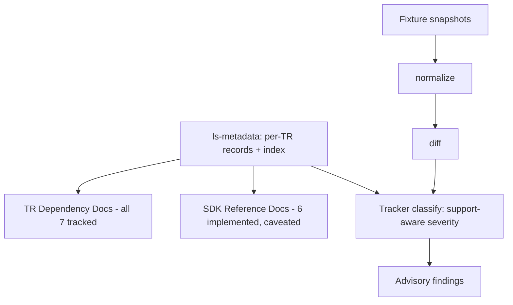

# Metadata-Driven Docs Generation + Staged-Snapshot Tracker Skeleton

## Summary

Two metadata-driven additions covering migration steps 10–11. A re-runnable docs
generator emits full **TR Dependency Docs** for all seven tracked TRs plus a
minimal **SDK Reference** stub for the six implemented ones, with a `--check`
mode that fails CI when committed docs drift from metadata. A **staged-snapshot
tracker walking skeleton** runs normalize → diff → classify over checked-in
fixtures to produce advisory, support-aware findings, with fetch and promote
stubbed and no SDK or metadata mutation.

---

## Problem Frame

Steps 1–9 of the migration are done: the vertical slice (`ls-core`, `ls-sdk`,
`ls-metadata`) ships seven tracked TRs, six of them implemented, and the
Paper Live Smoke proves the live transport path. Today the maintenance facts —
which TR owns which dependency class, what its prerequisites and coupling are,
whether it is implemented or merely tracked — live only in per-TR YAML under
`metadata/trs/` and in `CONTEXT.md` vocabulary. A maintainer or agent has to
read YAML and code to answer "what does this TR need, and is it safe to lean
on." There is no readable projection of that metadata, and nothing yet watches
upstream LS for the changes that would invalidate it. Step 10 closes the first
gap with a readable projection. Step 11 does not close the second — it proves
the support-aware classify logic over fixtures while real upstream fetch stays
stubbed — so "nothing watches upstream LS" remains open until a later round
wires fetch. Neither step expands TR coverage.

---

## Key Decisions

- **Metadata is the single source of truth for both products.** Docs are
  generated from `ls-metadata`, never mirrored from upstream LS docs or tracker
  output. The tracker reads the same metadata to weight its findings. Neither
  product re-encodes facts that live in metadata.

- **TR Dependency Docs full; SDK Reference minimal and caveated.** Dependency
  Docs are a clean deterministic projection of metadata, so they cover all seven
  tracked TRs in full. SDK Reference Docs need request/response schemas and
  verified examples that metadata does not hold, and zero TRs are `recommended`
  yet — so Reference ships as a thin stub for the six implemented TRs, each
  marked "implemented, not yet recommended."

- **The generator is re-runnable with a CI drift gate, not a one-shot
  bootstrap.** A `--check` mode lets CI fail when committed docs no longer match
  metadata, so the docs stay honest as metadata changes.

- **The tracker is a walking skeleton over fixtures, not interface-only stubs.**
  normalize/diff/classify run for real against checked-in fixture snapshots so
  the support-aware severity logic is proven, not just shaped. Fetch and promote
  are stubbed.

- **API Drift Tracker is the one worked example.** It exercises support-aware
  severity against existing metadata. The Specification Document Tracker is
  represented only by the shared stage and type contract this round.

- **No shared metadata-projection layer yet.** The generator and the tracker
  each read `ls-metadata` independently. Two consumers do not justify a shared
  projection abstraction; introduce one only if a third consumer or real
  duplication appears.

### Source-of-truth fan-out

---

## Requirements

### Docs Generation (step 10)

- R1. A re-runnable generator produces TR Dependency Docs for all seven tracked
  TRs from `ls-metadata`, not from raw upstream docs or tracker output.
- R2. Each TR Dependency Doc renders the TR's owning dependency class, support
  state (tracked / implemented / recommended), facets, dependency fields
  (self-continuation and strong-order fields), and venue/session constraints.
- R3. The generator produces SDK Reference Docs for the six implemented TRs
  only; the tracked-not-implemented order TR (`CSPAT00601`) is excluded from
  Reference but still appears in Dependency Docs.
- R4. Each SDK Reference entry carries an "implemented, not yet recommended"
  status banner whenever the TR's metadata has `recommended: false`.
- R5. The generator is deterministic: identical metadata input yields
  byte-identical output across runs and platforms. Determinism is guaranteed by
  stable key/collection ordering, no wall-clock or run timestamp in generated
  output, and canonical formatting of any date or hash fields rendered into
  docs — so the R6 `--check` gate cannot flap on cosmetic reordering.
- R6. A `--check` mode compares generated output against the committed docs and
  exits non-zero on any drift; the default mode writes the docs.
- R7. Generated output lives under `docs/tr-dependencies/` (Dependency Docs) and
  `docs/reference/` (SDK Reference Docs).

### Tracker Skeleton (step 11)

This round delivers proven support-aware classification logic, not a working
tracker. A maintainer can classify a hand-placed fixture snapshot into
severity-ranked findings; they cannot pull real upstream change (fetch is
stubbed) or apply anything (promote is dry-run).

- R8. The tracker defines all five pipeline stages as explicit boundaries:
  fetch, normalize, diff, classify, promote.
- R9. The tracker defines the core types: Staged Snapshot, normalized artifact,
  Tracker Finding, and Support-Aware Severity.
- R10. normalize, diff, and classify run for real against checked-in fixture
  snapshots and are unit-tested.
- R11. classify assigns Support-Aware Severity using each affected TR's support
  state from `ls-metadata`, following the migration plan's severity ladder
  (critical / breaking / maintenance / evidence / informational): a removed or
  incompatibly-changed field on an implemented or recommended TR classifies as
  `breaking`; the same change on a tracked-only TR classifies as `informational`
  or `maintenance`; a new optional field classifies as `maintenance`. A change
  to an implemented or recommended TR always ranks higher than the same change
  to a tracked-only TR.
- R12. fetch is stubbed — snapshots are placed manually rather than retrieved
  over the network.
- R13. promote is a dry-run that writes nothing — no SDK code, metadata,
  baseline, or docs mutation — but its report must enumerate exactly what a real
  promote would touch: which baseline files, which metadata fields, and which
  generated docs. The deferred risk is the mutation coupled to a review gate,
  not the reporting; the dry-run output is the contract that future mutation
  must satisfy.
- R14. The API Drift Tracker is the one concrete worked example; the
  Specification Document Tracker exists only as the shared stage and type
  contract.
- R15. Findings are advisory output only; nothing in the skeleton auto-converts a
  finding into an SDK Maintenance Work Item.

---

## Key Flows

- F1. Generate docs
  - **Trigger:** A maintainer runs the generator after editing metadata, or CI runs it in check mode.
  - **Steps:** Load and validate `ls-metadata`; project Dependency Docs for all tracked TRs and the Reference stub for implemented TRs; in default mode write to `docs/tr-dependencies/` and `docs/reference/`, in `--check` mode compare against committed files.
  - **Outcome:** Docs written, or a non-zero exit naming the drifted files.
  - **Covered by:** R1, R2, R3, R4, R5, R6, R7

- F2. Tracker run over a fixture
  - **Trigger:** A maintainer drops a Staged Snapshot fixture in place and runs the API Drift Tracker.
  - **Steps:** normalize the snapshot to a canonical artifact; diff it against the reviewed baseline fixture; classify each change into a Support-Aware Severity using metadata support state; promote runs as a dry-run and reports intended baseline/metadata changes without writing.
  - **Outcome:** A list of advisory findings; no repository state changes.
  - **Covered by:** R8, R10, R11, R12, R13

---

## Acceptance Examples

- AE1. Docs drift detection
  - **Covers R6.**
  - **Given** committed docs generated from the current metadata,
  - **When** a TR's `owner_class` changes in metadata and `--check` runs without regenerating,
  - **Then** the command exits non-zero and names the stale doc(s).

- AE2. Support-aware severity
  - **Covers R11.**
  - **Given** a fixture diff that removes a response field,
  - **When** the field belongs to an implemented TR versus a tracked-only TR,
  - **Then** the implemented-TR change classifies at a higher severity (`breaking`) than the tracked-only change (`informational`/`maintenance`).

- AE3. Reference excludes non-implemented TR
  - **Covers R3, R4.**
  - **Given** `CSPAT00601` is tracked but not implemented and the six others are implemented with `recommended: false`,
  - **When** the generator runs,
  - **Then** Reference Docs contain the six implemented TRs each with the "not yet recommended" banner, and omit `CSPAT00601`; Dependency Docs include all seven.

---

## Scope Boundaries

### Deferred for later

- SDK Reference enrichment — real request/response schemas and verified examples
  — until a TR reaches `recommended` or a real external consumer exists.
- Real upstream `fetch` over the network.
- `promote` mutation of baselines, metadata, or docs.
- The Specification Document Tracker as a concrete, running tracker.
- A shared metadata-projection layer between the generator and the tracker.

### Outside this round's identity

- No new TR implementation or expansion of coverage beyond the existing seven.
- No automatic promotion of a Tracker Finding into an SDK Maintenance Work Item.
- No change-driven evidence invalidation (it remains inactive — see Assumptions).

---

## Dependencies / Assumptions

- Both products build on the validated `ls-metadata` types; metadata remains the
  source of truth.
- Change-driven evidence invalidation (the freshness rules defined in
  `metadata/EVIDENCE-FRESHNESS.md` and noted in `metadata/tr-index.yaml`) stays
  **inactive**. The 90-day freshness backstop in `metadata/EVIDENCE-FRESHNESS.md`
  remains the only evidence control until the Specification Document Tracker and
  its reviewed baselines exist.
- No real LS endpoint access is assumed for the tracker; checked-in fixtures
  stand in for live snapshots.
- The shared tracker stage and type contract (Staged Snapshot, normalized
  artifact, diff, Tracker Finding) is validated this round only against the API
  Drift Tracker's structured-shape diff. The Specification Document Tracker
  diffs free-text upstream prose, whose normalized-artifact and diff shapes may
  not fit the same contract; the contract must be revisited when that tracker is
  implemented.
- This round's fixtures exercise only the `breaking`, `maintenance`, and
  `informational` tiers. `critical` (auth/order-safety changes) and `evidence`
  (stale focused evidence on a Recommended TR) are defined in the Support-Aware
  Severity type but unreachable here — no TR is `recommended` and change-driven
  invalidation is inactive.

---

## Outstanding Questions

### Deferred to planning

- Exact crate names and boundaries for the generator and the tracker (each a new
  workspace crate depending on `ls-metadata`).
- On-disk layout for the tracker's Staged Snapshots, baselines, and fixtures.
- TR Dependency Docs page granularity: a single index plus per-TR pages, versus
  pages grouped by dependency class.
- How the `--check` mode wires into the actual CI configuration.

---

## Deferred / Open Questions

### From 2026-06-15 review

- Walking-skeleton scope vs the migration plan's "skeleton" label: R10/R11 run
  real normalize/diff/classify logic, which goes beyond the migration plan's
  step 11 "skeleton" wording. This was a deliberate brainstorm choice (walking
  skeleton over fixtures). Open: reconcile the migration plan's step-11 label, or
  note the intentional scope there. (scope-guardian)
- Uniformly-caveated SDK Reference: all six SDK Reference entries carry the same
  "implemented, not yet recommended" banner. Weighed and confirmed in the
  brainstorm (ship the stub). Recorded for revisit — trim Reference to an index
  until a TR reaches `recommended` if the maintenance surface proves not worth
  it. (product-lens)

---

## Sources

- `docs/plans/maintained-sdk-migration-plan.md` — steps 10 and 11 origin; the
  Documentation and Change Tracking sections.
- `CONTEXT.md` — SDK Reference Docs / TR Dependency Docs / Change Tracker /
  Tracker Finding / Support-Aware Severity / Staged Snapshot vocabulary.
- `metadata/tr-index.yaml`, `metadata/trs/*.yaml` — the source data both
  products project from; support flags and dependency fields.
- `metadata/EVIDENCE-FRESHNESS.md` — the 90-day backstop and the inactive
  change-driven invalidation note.
- `crates/ls-metadata/` — validated metadata types the generator and tracker
  consume.
