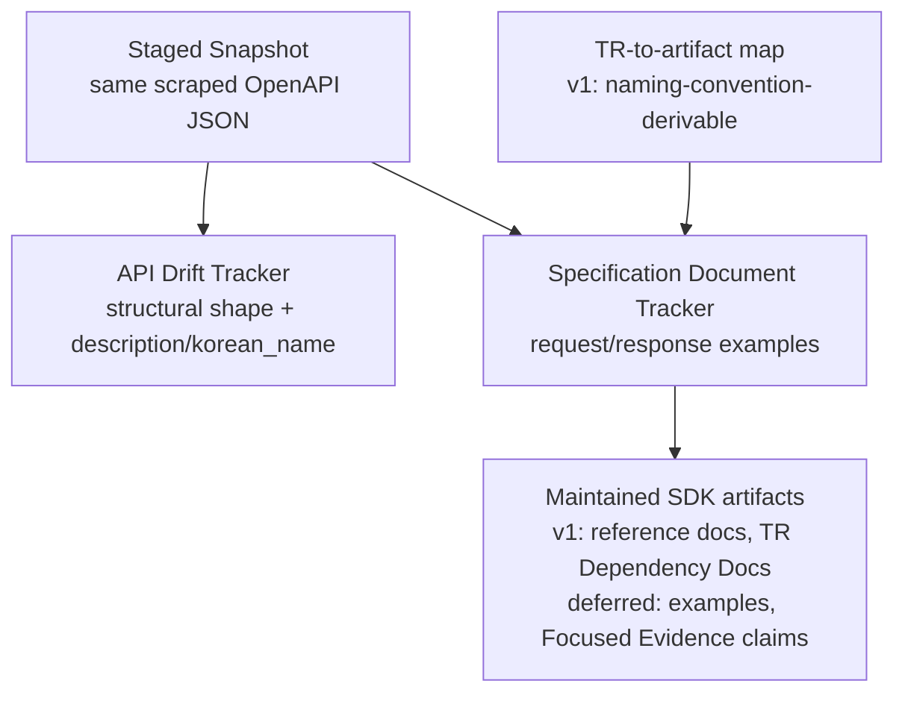

# Specification Document Tracker — example drift and advisory artifact pointers

## Summary

Build the **Specification Document Tracker** as a **Change Tracker** that reuses the **Staged Snapshot** the **API Drift Tracker** already fetches and covers the one documentation surface still uncovered: request/response examples. When an example changes for a **Tracked TR**, it emits a support-aware advisory **Tracker Finding** that points at the maintained SDK artifacts referencing that TR as review candidates. The pointer is resolved through a TR→artifact map; its first version covers the artifacts derivable by naming convention.

---

## Problem Frame

PR #3 and PR #4 made the **API Drift Tracker** trustworthy for *structural* upstream change — TR add/remove, field shape, endpoint and rate facts. It also already detects and emits **description and `korean_name` changes** as informational findings over the same staged snapshot. Those two facets are not a blind spot.

Two gaps remain. First, request/response **examples** are fetched into the snapshot but never diffed — an example can drift without any structural or description change firing. Second, nothing maps an upstream change to the maintained SDK artifacts — reference docs, examples, **Focused Evidence** claims, **TR Dependency Docs** — that were built on it and may now be stale.

There is no separate machine-fetchable documentation corpus to solve this from. The LS portal exposes only the structured API; the per-TR markdown in the Migration Source (`korea-broker-documents`) is derived from the same JSON. That corpus does carry a hand-maintained, dated `CHANGELOG.md` that logs LS documentation changes informally — but it is unstructured, not support-aware, and not mapped to maintained artifacts, so it is prior art for the need, not a substitute for the tracker. Note also that TR-level and group descriptions are empty or absent in the snapshot, so they are not usable facets; per-field descriptions (already handled by API Drift) and examples are the real documentation content.

Left unbuilt, example drift stays invisible, and even a description change API Drift *does* catch tells the maintainer nothing about which maintained artifacts to review.

---

## Key Decisions

- **Scope to the genuinely-new surface: examples plus the advisory pointer.** API Drift already owns description and `korean_name` detection; the new tracker does not re-diff them. This keeps the trusted tracker untouched and removes any double-reporting of the same facet.
- **Advisory pointer, not staleness proof.** A finding points at the maintained artifacts that reference a changed TR; the human judges whether they are stale. Proving staleness would require parsing and modeling what each artifact claims — out of scope.
- **The pointer ships in tiers; the map does not exist yet.** Today there is no TR→artifact map. The first version (R4) resolves only the artifacts derivable by naming convention — SDK reference docs and **TR Dependency Docs**. Registering SDK example artifacts and **Focused Evidence** claims, which have no derivable path today, is net-new modeling deferred to a follow-up so it cannot block the tracker. Deferring **Focused Evidence** is safe by construction: it attaches only to a **Recommended TR**, and no TR is recommended yet, so the deferred tier routes to an empty set and cannot leave the pointer hollow today. The first promotion of a TR to Recommended creates the first Focused Evidence claim and is the explicit trigger to revisit its routing. Whether the map lives as a **Facet Metadata** facet or tracker-local is a planning choice.
- **Example comparison is noise-controlled and per payload class.** Example payloads are heterogeneous opaque strings — JSON-as-text for most TRs, form-encoded for a few (`token`, `revoke`), free text for others. JSON-parseable examples are shape-diffed (sample-value churn ignored); form-encoded examples are compared at key-set level; non-parseable examples yield at most an informational finding. A noisy advisory tracker is an unrun tracker; protecting the operator's trust budget is a requirement, not a later optimization.
- **Maintained-only baseline, support-aware for the rest.** The example baseline covers the **Tracked TRs**; untracked example changes surface as visible non-gating findings.
- **Findings are advisory and non-gating.** An example change never fails ordinary verification on its own; a per-example parse failure is informational, and only a snapshot-level fetch failure gates.

One snapshot, two non-overlapping lenses, plus the routing map that powers the pointer:

---

## Requirements

**Example projection**

- R1. The tracker consumes the same **Staged Snapshot** the API Drift Tracker fetches; it adds no new fetch source and no new network path.
- R2. The tracker projects request/response examples into a normalized documentation view — the one facet covered by neither **Structural API Shape** nor API Drift's existing description/`korean_name` diffing. Examples are stored as opaque strings of mixed encoding, so comparison is per payload class: shape-diff for JSON-parseable examples (ignoring sample-value churn), key-set diff for form-encoded examples, and informational-only for non-parseable examples.
- R3. A **Reviewed Baseline** of example shapes covers the **Tracked TRs** represented in maintained metadata, refreshed only by an operator-run, human-reviewed update — no automatic baseline promotion.

**Artifact pointer**

- R4. A **Tracked TR** is resolved to its referencing artifacts through a TR→artifact map. The first version covers artifacts derivable by naming convention against the existing TR index — SDK reference docs (for **Implemented TRs**) and **TR Dependency Docs** (for all Tracked TRs). Registering SDK example artifacts and **Focused Evidence** claims, which have no derivable path today, is deferred (see Scope Boundaries).
- R5. An example change on any TR emits a support-aware advisory **Tracker Finding**. For a **Tracked TR**, the finding points at that TR's artifacts, resolved through R4's map, as review candidates.
- R6. Finding severity is **Support-Aware Severity** by whether the TR is tracked, implemented, or recommended; an example change confined to untracked inventory is a visible non-gating informational finding.
- R7. A finding is informational-only, with no artifact pointer, when R4's map resolves no artifact for the affected TR — including untracked TRs and Tracked TRs with no registered artifact.
- R8. A finding becomes an **SDK Maintenance Work Item** only after human review. The tracker never mutates SDK code, docs, metadata, examples, or baselines.

**Verification posture**

- R9. Ordinary repository verification stays network-free; the tracker's compare path runs against the already-staged snapshot. A per-example parse failure is a non-gating informational finding, not a gating error.
- R10. Document review is operator-run and opt-in; no scheduled cron or CI automation is added.
- R11. SDK reference docs stay generated from maintained SDK behavior and metadata. The tracker flags upstream example drift; it does not mirror upstream text into product documentation.

---

## Acceptance Examples

- AE1. Implemented-TR JSON example shape change → advisory pointer.
  - **Covers R2, R4, R5, R6.**
  - **Given** `t1102` is implemented, so R4 resolves its reference doc and **TR Dependency Doc**.
  - **When** the staged snapshot changes the shape of the `t1102` response example.
  - **Then** the tracker emits an advisory finding naming those artifacts as review candidates, at support-aware severity, without failing the gate.

- AE2. Untracked-only example change → visible non-gating finding.
  - **Covers R5, R6, R7.**
  - **Given** a TR outside maintained metadata.
  - **When** its example shape changes in the staged snapshot.
  - **Then** a visible informational finding is emitted, with no artifact pointer, and no gate fails.

- AE3. Tracked TR with no resolvable artifact → informational only.
  - **Covers R7.**
  - **Given** a Tracked TR whose R4 map resolves no referencing artifact.
  - **When** its example shape changes.
  - **Then** the finding is informational-only, with no artifact pointer.

- AE4. JSON sample-value churn → no finding.
  - **Covers R2.**
  - **Given** a JSON example whose structure is unchanged but a sample value differs (e.g., a timestamp or account number).
  - **When** the staged snapshot is compared.
  - **Then** no finding is emitted — only shape changes qualify.

- AE5. Non-JSON example → key-set or informational handling.
  - **Covers R2, R9.**
  - **Given** the `token` request example, which is form-encoded rather than JSON.
  - **When** a new key appears in the form, a finding is emitted at key-set level; when only a secret value changes, no finding is emitted; when an example cannot be parsed at all, an informational finding is emitted without failing the gate.

---

## Success Criteria

PR #5 is successful when a maintainer can answer, from the new repository alone, with the tracker plus their own review:

- Which request/response examples changed since the last **Reviewed Baseline**?
- For a changed example on a **Tracked TR**, which maintained artifacts should be reviewed?
- Which example changes are informational only?
- Which need human review before any SDK maintenance work proceeds?

Description and `korean_name` changes remain answered by the API Drift Tracker; this tracker answers the example-and-pointer questions above. Success is the maintainer answering these with the pointer, not the tracker deciding staleness automatically. It is not successful merely because examples can be diffed — it is successful when example changes become reviewed, staged, support-aware maintenance signals. `cargo test --workspace` and `make docs-check` stay clean, and network-free verification requires no network.

---

## Scope Boundaries

**Deferred for later**

- A staleness-comparison engine that parses maintained artifacts to prove a specific upstream/SDK mismatch.
- Registering SDK example artifacts and **Focused Evidence** claims in the R4 map — neither has a derivable path today, so routing to them is net-new modeling. The first pointer ships with reference docs and TR Dependency Docs only.
- Enriching API Drift's existing description/`korean_name` findings with the artifact pointer — possible once the map exists, but not part of this item.
- Full example baselining of untracked TRs.
- Any automatic mutation or promotion of SDK docs, metadata, examples, or baselines from findings.

**Outside this tracker's identity**

- Re-detecting description or `korean_name` changes — owned by the API Drift Tracker.
- Tracking upstream "metadata" or "operations notes" as separate documentation facets — the LS portal exposes no such surface, and structural metadata changes are the API Drift Tracker's domain.
- Tracking a separate documentation corpus or the rendered per-TR markdown — that tracks a derived artifact, and CONTEXT.md says not to mirror upstream documentation.
- Mirroring upstream documentation as product documentation.
- Scheduled cron or CI automation; the tracker stays opt-in operator-run.
- The migration closeout (mark `korea-broker-sdk-ls` migration-source-only) — a separate following item, not this tracker (see Following Item).

---

## Open Questions

**Resolve before planning**

- None blocking. The prior open item — tier-a sufficiency versus pulling in **Focused Evidence** routing — is settled in Key Decisions: Focused Evidence has zero current population, so tier-a clears the success bar for every Tracked TR today, and the first promotion of a TR to Recommended is the explicit trigger to revisit.

**Deferred to planning**

- The exact structural normalization per payload class — what counts as a shape change versus sample-value churn for JSON, and the key-set rule for form-encoded examples (R2).
- Where the TR→artifact map lives — a **Facet Metadata** facet or a tracker-local mapping (R4).
- Whether the example baseline is a separate artifact or a projection stored alongside the API Drift baseline.

---

## Dependencies / Assumptions

- Depends on the API Drift staging path producing the shared **Staged Snapshot**. Examples survive in the raw snapshot as opaque strings — JSON-as-text for most TRs, form-encoded (`token`, `revoke`) or free text for a few — so the projection must parse per class; the normalized API Drift baseline stores no examples.
- The first pointer's map covers naming-convention-derivable artifacts (reference docs for Implemented TRs, TR Dependency Docs for all Tracked TRs) against the existing TR index. SDK example artifacts and **Focused Evidence** claims have no derivable path and are deferred. The defer-Focused-Evidence decision holds only while zero TRs are Recommended; the first promotion of a TR to Recommended (a known not-done item in the origin status) creates the first Focused Evidence claim and is the point at which its routing must be reconsidered.
- A clean self-diff of the example baseline is net-new, not inherited. The API Drift baseline reached a clean self-diff only after a dedicated truthfulness closeout (PR #4) and a normalizer bump; the example projection must strip volatile sample values (tokens, dated timestamps, account numbers) embedded in the example strings and may need its own normalizer iteration.
- Because the tracker needs its own example projection, its own example baseline, and the pointer map, PR #5 is not a trivial one-PR add. It reuses the fetch and staging path, but the example baseline is a distinct artifact with its own self-diff.
- Noise-controlled, per-class comparison (R2) is what keeps advisory, non-gating findings run-worthy; if no normalization satisfies the noise constraint for a payload class, that class is reconsidered rather than shipped as raw-text diffing.

---

## Following Item

The migration closeout — mark `korea-broker-sdk-ls` obsolete and migration-source-only inside the old repository — remains a separate, well-defined communication task. It states that `korea-adapter-sdk-ls` is the maintained SDK direction, marks the old generated all-TR surface historical, and keeps historical docs and runtime lessons available as migration reference. It closes migration communication but adds no upstream-change tracking capability, and does not need this brainstorm's shaping.
