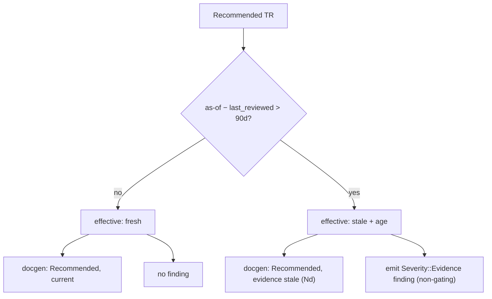

# Evidence-Freshness Evaluator — Requirements

## Summary

Build an evidence-freshness evaluator that makes the 90-day backstop operative
for Recommended TRs. It computes each Recommended TR's effective freshness from
`maintenance.last_reviewed` and an injectable as-of date, marks evidence older
than 90 days as stale, emits a non-gating `Severity::Evidence` finding, and
surfaces the stale state in generated docs — without mutating any metadata. One
shared freshness function feeds both the doc marker and the finding so they can
never disagree. Re-attestation stays human.

## Problem Frame

The repo documents a freshness contract it does not enforce. `metadata/EVIDENCE-FRESHNESS.md`
spells out the intended semantics — a 90-day backstop from `last_reviewed`, or a
structural API Drift change, whichever comes first — then states candidly that
"no code enforces any of the controls." The rendered revocation-policy text in
every Recommended TR's contract says the same: stated policy, not enforced.

That gap mattered less when nothing was recommended. It matters now: six TRs are
Recommended (`token`, `t1101`, `t1102`, `t8412`, `S3_`, `CSPAQ12200`) across five
dependency classes. Each carries a user-facing recommendation claim whose only
backing control is human review discipline — a maintainer remembering to
re-attest. Nothing makes a recommendation that has gone quietly stale *visibly*
stale. The backstop is the cheap half of the evaluator and the single piece that
gives a Recommended claim any on-demand revocation signal.

This signal is on-demand, not continuous: it surfaces only when the evaluator is
run or docs are regenerated, so staleness visibility lags by the doc-rebuild /
evaluator-invocation cadence. Pinning that cadence (a scheduled run, a release
hook) is a [Resolve before planning](#outstanding-questions) item, not settled
here.

## Key Decisions

- **Stale is computed, not stored — `recommended` stays true.** A TR's
  `support.recommended` metadata is unchanged by staleness. Freshness is a
  computed overlay on top of it: the metadata says "this TR has a recommendation
  contract," the overlay says "the current evidence is fresh / stale." Docs render
  "Recommended, evidence stale," never a silent demotion to Implemented. This keeps
  generated docs from contradicting metadata.

- **Advisory, never gating.** `Severity::Evidence` stays below `Severity::Maintenance`
  in the ladder, so `gates_for` never trips on it. A stale backstop produces a
  finding and a visible doc marker; it does not fail CI. "Revokes the claim pending
  review" means the recommendation becomes visibly untruthful and a human acts — not
  that code edits state.

- **One freshness function, two consumers.** The finding emitter and docgen call
  the same pure freshness computation, mirroring the single-source `gates_for`
  pattern. There is no second copy of the 90-day rule to drift.

- **Injectable as-of date.** The computation takes an as-of date; production defaults
  to today (UTC, matching how Paper Live Smoke stamps evidence). Tests prove stale
  behavior by passing a future as-of, never by waiting 90 days.

- **Split-candor revocation text.** The rendered revocation policy becomes per-clause
  accurate: the backstop clause is described as enforced; the structural-change clause
  stays described as stated-policy-not-enforced until the change-driven increment
  ships. The doc text never overclaims enforcement the code doesn't have.

## Requirements

**Freshness computation**

- R1. A single pure freshness function takes a TR's `last_reviewed` date and an
  as-of date and returns an effective freshness state: fresh, or stale with the
  age in days past the backstop.
- R2. The backstop is 90 days: evidence is stale when `(as-of − last_reviewed) > 90`
  days. Exactly 90 days is fresh; 91 days is stale.
- R3. The as-of date is injectable. Production defaults to today (UTC); callers
  (tests, the evaluator, docgen) may pass an explicit as-of for deterministic
  evaluation.
- R4. Freshness applies only to Recommended TRs. Implemented, Tracked, and
  Untracked TRs carry no freshness obligation and produce no effective freshness
  state, regardless of any `last_reviewed` value.

**Finding emission**

- R5. When a Recommended TR's evidence is stale, the evaluator emits a
  `Severity::Evidence` finding identifying the TR, its `last_reviewed` date, and
  its age past the backstop. The concrete finding *shape* — existing finding
  types carry a structural `Change` a backstop finding has no value for — is a
  planning decision; see Outstanding Questions. R5 fixes the finding's intent and
  payload, not its type representation.
- R6. The finding is non-gating. `Severity::Evidence` stays below
  `Severity::Maintenance`, so `gates_for` never crosses the exit threshold on a
  backstop finding; staleness alone never fails CI.
- R7. The evaluator is operator-invoked, mirroring the existing trackers, and
  mutates nothing — not metadata, evidence files, reviewed baselines, or docs.

**Generated-doc surface**

- R8. Generated docs for a Recommended TR show its effective freshness state
  (current, or stale with age) computed at docgen time using the same freshness
  function as the finding emitter.
- R9. A stale Recommended TR still renders as Recommended — its `support.recommended`
  metadata is untouched and the badge is not demoted to Implemented. The doc adds a
  stale marker alongside the existing freshness date.

**Truthfulness and re-attestation**

- R10. The rendered `REVOCATION_POLICY` text and its guarding comment are updated to
  per-clause candor: the 90-day backstop is described as enforced; the
  structural-change clause stays described as stated policy not yet enforced.
- R11. `metadata/EVIDENCE-FRESHNESS.md` is updated so its "operative today" section
  reflects that the backstop is now computed and surfaced, while change-driven
  invalidation remains deferred.
- R12. Re-attestation stays human and unchanged in shape: rerun the Paper Live
  Smoke, update the evidence file and `last_reviewed` (kept equal per the
  validator), regenerate docs. Clearing is recompute-on-invocation, not retraction:
  on the next evaluator run after re-attestation the TR evaluates fresh and emits no
  finding; an already-emitted finding is not retroactively withdrawn.

## Acceptance Examples

- AE1. Fresh within window. **Covers R1, R2, R8.** `last_reviewed: 2026-06-17`,
  as-of `2026-08-01` (45 days). Effective state is fresh; docs show "current"; no
  finding.
- AE2. Backstop boundary. **Covers R2.** With `last_reviewed: 2026-06-17`, as-of
  `2026-09-15` (exactly 90 days) is fresh; as-of `2026-09-16` (91 days) is stale.
- AE3. Stale. **Covers R3, R5, R6, R8, R9.** `last_reviewed: 2026-06-17`, as-of
  `2026-09-16` (an injected as-of). The evaluator emits one `Severity::Evidence`
  finding; it does not gate; docs render "Recommended, evidence stale (91 days)";
  the TR's `support.recommended` stays `true`.
- AE4. Re-attestation clears it. **Covers R12.** After rerunning the smoke and
  updating evidence + `last_reviewed` to `2026-09-16`, evaluating as-of `2026-09-16`
  returns fresh and emits no finding.
- AE5. Non-recommended TR is exempt. **Covers R4.** An Implemented-but-not-recommended
  TR (e.g. `revoke`) produces no effective freshness state and no finding no matter
  how old any date on it is.
- AE6. Evaluator mutates nothing. **Covers R7.** Capture metadata, evidence files,
  reviewed baselines, and generated docs before evaluating a stale TR; after the run,
  all are byte-for-byte identical — only the finding was emitted.
- AE7. Default as-of is today. **Covers R3.** The no-argument form delegates to the
  injectable function with `Utc::now()` as its only clock source — verified
  deterministically by asserting the no-arg result equals the injectable function called
  with that same captured date, not by comparing two independent wall-clock reads (which
  would flake across the UTC midnight boundary). This pins the production-default path so
  an implementation cannot hardcode the date and still pass the injected-date examples.

## Scope Boundaries

**Deferred for later**

- Change-driven invalidation: a maintained-TR Structural API Shape change (API Drift
  Tracker) on a Recommended TR staling its evidence and firing `Severity::Evidence`.
  This is the next increment and shares the same finding severity and effective-freshness
  surface built here.
- Per-class freshness tightening (e.g. a shorter window for `orders`) — stays at the
  uniform 90-day default until those classes have Recommended TRs.

**Outside this work's identity**

- Staleness as a CI gate or build failure. Evidence severity is advisory by design;
  the backstop informs, humans act.
- Any evaluator-driven mutation of metadata, evidence, baselines, or docs. The
  never-mutate invariant for trackers and evaluators holds.
- `revoke` promotion (needs a new smoke harness and has session-token invalidation
  concerns) and order runtime (ADR 0008 — order runtime waits for the full safety
  package). Separate tracks, not this work.

## Dependencies / Assumptions

- `chrono` is already a workspace dependency (`Utc::now()` is used in
  `crates/ls-sdk/tests/live_smoke.rs`) and is assumed sufficient for parsing and
  diffing ISO `last_reviewed` dates.
- The metadata validator already enforces `evidence.date == maintenance.last_reviewed`
  (`crates/ls-metadata/src/validator.rs`), so "freshness date" unambiguously means
  `last_reviewed`. The evaluator reads that one field; no new freshness field is added.
- The six current Recommended TRs all carry parseable ISO `last_reviewed` dates.
- The README's stale "token is currently the only Recommended TR" line is corrected as
  separate pre-work (alongside committing the CONTEXT.md glossary). This doc assumes
  the README and generated docs already reflect the six Recommended TRs; these fixes
  are not tracked as requirements here.

## Outstanding Questions

**Resolve before planning**

- docgen `--check` determinism vs R8. `ls-docgen` has a `--check` mode that compares
  freshly rendered output against committed files. A wall-clock as-of (R8) makes the
  same committed metadata render "current" today and "stale (Nd)" later, so committed
  docs drift on-disk over calendar time and `--check` fails with no metadata change.
  Decide how the committed-doc render path coexists with `--check` — e.g. render the
  computed marker only in a non-committed view, pin an as-of for `--check`, or exclude
  the marker from the byte-comparison — before implementing R8.

**Deferred to planning**

- Where the advisory `Severity::Evidence` finding surfaces to a maintainer, and who
  owns acting on it. A non-gating finding only makes a recommendation truthful if it is
  seen and acted on; the increment should name the surfacing path (operator report,
  scheduled run) or record the human-cadence dependency as an explicit assumption.
- Whether R10 and R11 (the `REVOCATION_POLICY` reword and the `EVIDENCE-FRESHNESS.md`
  update) ship inside this increment or as a separable doc-update task, so doc-review
  friction can't block the functional backstop (R1–R9) from landing.
- README / CONTEXT.md pre-work ownership: the Dependencies section assumes the README
  already reflects the six Recommended TRs, but the fix is untracked. Give it an
  explicit owner and completion criterion, or fold the README correction in as a
  tracked requirement.
- Finding representation: `TrackerFinding` / `DriftFinding` both carry a structural
  `Change`, which a time-based backstop finding lacks. Whether to add a freshness-specific
  finding shape or a non-structural change variant is a planning decision.
- Where the shared freshness function lives (a small module in `ls-trackers`, or
  `ls-metadata` so docgen and the evaluator both depend on it without a cycle) and which
  crate owns it.
- Whether docgen's freshness marker needs the as-of date injected for deterministic doc
  tests (likely yes, mirroring the evaluator), and how the docgen banner test / freshness
  count assertions adapt to a computed stale marker.

## Sources / Research

- `crates/ls-trackers/src/types.rs:116` — `Severity` enum with the `Evidence` variant
  and its "defined but unreachable" candor comment.
- `crates/ls-trackers/src/types.rs:280` — `gates_for`, the single-source exit rule that
  excludes `Evidence` (below `Maintenance`).
- `crates/ls-metadata/src/schema.rs:122` — `Maintenance.last_reviewed`.
- `crates/ls-metadata/src/schema.rs:151` — `EvidenceRecord.date`.
- `crates/ls-metadata/src/validator.rs:270` — enforces `evidence.date == last_reviewed`.
- `crates/ls-docgen/src/lib.rs:387` — `REVOCATION_POLICY` text and its guarding comment.
- `crates/ls-docgen/src/lib.rs:397` — `render_recommendation`, where the freshness date
  is rendered into each Recommended TR's contract.
- `crates/ls-sdk/tests/live_smoke.rs:138` — Paper Live Smoke stamping evidence with the
  UTC date.
- `metadata/EVIDENCE-FRESHNESS.md` — intended semantics, the five-point combine rule, and
  the standing deferral.
