# Change-Driven Evidence Invalidation — Requirements

## Summary

When a Recommended TR's committed structural API shape diverges from the shape its Focused Evidence was attested against, stale that TR's evidence in the existing network-free freshness check — surfaced in the same monthly cadence and rolling issue as the 90-day backstop, advisory and non-gating. This ships the *detection* arm of the "stated policy, not yet enforced" clause all six Recommended TRs carry: it flags drifted evidence; it does not auto-revoke the recommendation. The policy's "revokes the claim pending review" arm stays unenforced, so a drifted TR keeps rendering as Recommended in generated docs until a human re-attests or demotes it — an accepted, deferred residual exposure.

## Problem Frame

The 90-day backstop is the *cheap half* of the evidence-freshness policy: absent any signal, Focused Evidence is presumed valid for 90 days from `maintenance.last_reviewed`. But an upstream structural API change — a field added, an endpoint moved, a protocol switch — invalidates what the evidence proved the moment it lands, not 90 days later. Today there is no path that connects a detected shape change to the evidence it undermines: the API Drift Tracker classifies structural changes, the freshness evaluator ages evidence, and the two never meet (`crates/ls-trackers/src/api_drift.rs`, `crates/ls-trackers/src/freshness.rs` run independently).

The operator-run api-drift checkpoint already classifies structural changes and turns accepted findings into Maintenance Work Queue issues at the moment the operator refreshes the baseline. What is missing is the connection to the evidence-freshness surface and any automation between checkpoints: structural drift is not reflected on the freshness dashboard, and nothing surfaces it in the monthly cadence — so a change that lands can sit unreviewed, and unreflected on the freshness surface, until the next manual checkpoint.

The cost of the gap: between backstops, a Recommended TR can carry evidence the dashboard reports as valid while its real API shape has already drifted. The claim stays "Recommended" on the strength of a smoke test that no longer matches the live contract. `metadata/EVIDENCE-FRESHNESS.md` already specifies the remedy as policy, and every Recommended TR's `recommendation.excludes` block names it as deliberately unenforced — this brings the *detection* half of the structural arm online (see Summary for the revoke half left out of scope).

## Key Decisions

- **Network-free baseline divergence, not an operator-checkpoint trigger.** Staling is computed by comparing two *committed* artifacts — the per-TR structural baseline and the shape the evidence was attested against — so it runs inside the existing scheduled freshness check with no live fetch and no conflict with the R19 network constraint. The operator's api-drift fetch + baseline update remains the human-reviewed act that *introduces* a divergence; staling follows automatically and shows up in the monthly cadence rather than only when someone runs the drift check by hand.

- **Shape-level qualifying set, defined as an explicit allow-list.** Only request/response field-shape, endpoint, and protocol changes stale evidence. `RateLimitChanged` (behavioral, not shape) and `TrAdded`/`TrRemoved` (TR lifecycle, handled elsewhere) do not stale; informational changes never do. The set is an explicit `DriftChange` allow-list because severity is assigned *contextually* at classify time, not fixed on the variant — "everything Breaking" is not a stable definition.

- **Advisory and non-gating; escalation stays human.** A qualifying change emits a `Severity::Evidence` finding (which never trips `gates_for`) and surfaces in the rolling issue with a maintainer @mention. It never mutates metadata and never flips `support.recommended`. The policy's phrase "revokes the claim pending review" is read as a *human prompt*, not an automatic state change — anchored on the established non-gating posture of `Severity::Evidence` and the matching advisory treatment the 90-day backstop already ships, not a stronger guarantee. (Issue surfacing follows ADR 0013's work-queue model; ADR 0013 does not itself decide the advisory-vs-revoke question.)

- **One surface, with a reason tag.** Change-driven staleness reuses the single `freshness check --json` contract and the single rolling "Evidence freshness status" issue, distinguished from age-staleness only by a per-entry `reason` field. No second list, no second dashboard.

```mermaid
flowchart TB
  T[Recommended TR] --> B[Read committed baseline shape]
  T --> A[Read attested shape from metadata]
  B --> D{Classify diff}
  A --> D
  D -->|reorder/move / informational / rate-limit / TR-lifecycle / none| F[Fresh by change]
  D -->|field add/remove/change · endpoint · protocol| S[Stale by change · Severity::Evidence]
  S --> O[stale&#91;&#93; reason=change + rolling-issue @mention]
```

## Requirements

**Detection**

- R1. Change-driven staling compares each Recommended TR's committed structural baseline shape against the structural shape its current Focused Evidence was attested against; a qualifying divergence marks that TR's evidence stale-by-change. The attested shape is an independent committed snapshot captured at evidence-attestation time — not a re-read of the live baseline. A baseline update moves the baseline ahead of this frozen snapshot, creating the divergence; the snapshot only catches up when the TR is re-attested (R11). If the attested shape were re-derived from the current baseline at check time, divergence would always be zero and detection would be a no-op. The comparison is on representation-invariant *structural content*, not the raw baseline file: an operator fetch regenerates the baseline wholesale (one run rewrites every TR's normalized file), so a per-TR divergence must register only when that TR's actual shape changed, never on a global re-normalization that left the TR's shape unchanged. (How that projection is computed and stored is a planning decision — see Outstanding Questions.)
- R2. The qualifying change set is exactly: `FieldAdded`, `FieldRemoved`, `FieldChanged`, `EndpointChanged`, `ProtocolChanged`. `FieldReordered` and `FieldMovedAcrossBlock` do not stale — for the name-keyed JSON/REST contracts the Focused Evidence exercises, field position is not part of what the smoke proved, so a reorder or cross-block move does not falsify the evidence. `RateLimitChanged`, `TrAdded`, and `TrRemoved` do not stale either; `DescriptionChanged` and `FactsDegraded` never stale.
- R2a. A pure `NORMALIZER_VERSION`-driven representation shift — the baseline re-normalized under a bumped normalizer with no upstream change — must never qualify as staling. The attested shape carries the normalizer version it was captured under; a version mismatch against the baseline triggers re-attestation, not a stale-by-change finding. Without this invariant, a normalizer bump mass-stales every Recommended TR at once and trains maintainers to ignore the signal.
- R3. The evaluation reads only committed artifacts — the baseline under `crates/ls-trackers/baselines/api-drift/normalized/` and the per-TR attested shape held in metadata — and performs no network fetch, so it runs inside the scheduled freshness check.
- R4. The recorded attested shape must carry enough structural fidelity to classify a later diff as qualifying-or-not; an opaque whole-record hash that cannot distinguish a field change from a description change does not satisfy R2. The existing `maintenance.source_spec_hash` (an opaque string) therefore cannot serve as the attested shape — the plan must introduce a new metadata or evidence-record field that carries the structural snapshot at R2-classifying fidelity.
- R5. Selection is Recommended TRs only (`support.recommended == true`), matching the 90-day backstop evaluator.

**Surfacing**

- R6. Change-driven staleness surfaces through the same `freshness check --json` contract and the same rolling "Evidence freshness status" issue as the 90-day backstop, sharing the `Severity::Evidence` surface. Extending the contract and the issue dashboard is explicitly in-scope: adding the `reason` field (R7) is an additive change to the pinned `--json` key set (its pin test must be updated in lockstep) and to the fixed issue-table renderer.
- R7. Each stale entry carries a `reason` distinguishing `age` from `change`; a change entry also carries a short summary of what drifted. The dashboard renders the reason — age entries keep showing age, change entries show the drifted shape.
- R8. Change-driven staling is advisory: it emits a `Severity::Evidence` finding, never mutates metadata, and leaves `support.recommended` unchanged. The check's exit semantics are unchanged — stale or fresh both exit 0.
- R9. The rolling issue's notify-on-transition behavior is unchanged: a newly stale-by-change TR joining the stale set posts a maintainer @mention; same-set re-runs stay silent.
- R9a. The freshness check surfaces baseline staleness: when the committed structural baseline is older than a threshold, the check emits a warning so a never-refreshed baseline is distinguishable from genuinely-fresh. The age must come from a refresh date stamped into the committed baseline artifact at baseline-update time (network-free, deterministic) — *not* from git commit date or filesystem mtime, both unreliable in the cadence's CI environment (shallow checkout has no history; a fresh runner's mtime is checkout time, which always reads "just refreshed"). Without this signal, change-driven detection silently reports "fresh-by-change" forever if the operator stops refreshing the baseline — reintroducing the false-green this increment removes. The warning is advisory, consistent with R8 (it does not gate).

**Clearing / re-attestation**

- R10. Age-staleness and change-staleness clear independently. Refreshing `maintenance.last_reviewed` clears age-staleness but does not clear change-staleness.
- R11. Clearing change-staleness requires re-pinning the TR's attested shape to the current committed baseline. The existing re-attestation flow (re-run Paper Live Smoke, refresh evidence + `last_reviewed`, regenerate docs) must also re-pin the attested shape, or the TR re-fires as stale-by-change on the next run.

## Acceptance Examples

- AE1. Qualifying field change stales.
  - **Given:** a Recommended TR whose committed baseline has a `FieldAdded` relative to its attested shape.
  - **When:** the freshness check runs.
  - **Then:** the TR appears in `stale[]` with `reason: change` and a drifted-shape summary; if newly stale, the rolling issue posts a maintainer @mention.
  - **Covers:** R1, R2, R6, R7, R9.
- AE2. Informational-only change does not stale.
  - **Given:** a TR whose baseline differs from its attested shape only by `DescriptionChanged`.
  - **When:** the check runs.
  - **Then:** the TR is not reported stale-by-change.
  - **Covers:** R2.
- AE3. Rate-limit change does not stale.
  - **Given:** a TR whose only divergence is `RateLimitChanged`.
  - **When:** the check runs.
  - **Then:** the TR is not reported stale-by-change.
  - **Covers:** R2.
- AE4. Touching the date alone does not clear change-staleness.
  - **Given:** a TR stale-by-change.
  - **When:** an operator refreshes `last_reviewed` (and the matching evidence date) without re-pinning the attested shape.
  - **Then:** the TR is fresh-by-age but still stale-by-change.
  - **Covers:** R10, R11.
- AE5. Full re-attestation clears it.
  - **Given:** the only stale TR is stale-by-change.
  - **When:** the operator re-attests — re-pins the attested shape to the current baseline and refreshes evidence + `last_reviewed`.
  - **Then:** the next check reports it fresh and the rolling issue closes with an all-clear comment.
  - **Covers:** R6, R10, R11.
- AE6. Stale for both reasons must clear both.
  - **Given:** a TR that is both past 90 days and structurally drifted.
  - **When:** the check runs.
  - **Then:** the entry reflects both reasons; the TR clears only once both the date is refreshed and the attested shape is re-pinned.
  - **Covers:** R7, R10, R11.
- AE7. Partial clearing leaves the other reason standing.
  - **Given:** a TR stale for both age and change.
  - **When:** an operator refreshes `last_reviewed` (and the matching evidence date) but does not re-pin the attested shape.
  - **Then:** the next check reports the TR stale-by-change only (no longer stale-by-age); the entry's `reason` reflects `change` alone.
  - **Covers:** R7, R10.

## Scope Boundaries

**Deferred for later**

- Auto-revoking `support.recommended` on a detected structural change (the stronger "revoke the claim" reading) — revisit once the advisory flag has run against real drift events.
- Scheduling the `spec-doc` check (network-free/advisory like freshness) — a separate, independent follow-up.

**Outside this increment**

- The api-drift network fetch and baseline-refresh itself stay operator-run; this increment only *reads* the already-committed baseline. R19's network-touching scope is unchanged.
- Rename fingerprinting / adjacency computation (already removed/deferred in the drift tracker) plays no part here.

## Dependencies / Assumptions

- **Baseline liveness (load-bearing).** Change-driven detection is only as current as the committed baseline. If the operator never runs the api-drift fetch to refresh it, an upstream change is never introduced as divergence and never fires. R9a makes this *visible* (the check warns on a stale baseline) rather than silently green, but does not *solve* it — refreshing the baseline remains the operator's job, the same liveness dependency `docs/MAINTENANCE_RUNBOOK.md` documents for api-drift, overlapping the deferred external dead-man's-switch (the runbook's R9 silent-non-run vectors — distinct from this doc's requirement R9).
- **Normalizer-version hazard.** A `NORMALIZER_VERSION` bump can re-normalize baseline shapes and shift their representation without any upstream change. R2a makes the invariant binding (a pure normalizer-driven shift never qualifies, via a version stamp on the attested shape); the per-TR baseline JSON does not currently carry a normalizer-version stamp, so the *mechanism* for honoring R2a — version-aware comparison vs a re-attest-all sweep on bump — is the planning concern, not whether to honor it.
- **Attested shape always available.** Only maintained TRs have committed baseline shapes; Recommended ⊆ maintained (verified in `crates/ls-trackers/src/freshness.rs`), so every Recommended TR has a baseline to compare against.
- **Consistency model extends, not replaces — with a gap to close.** The existing `EvidenceDateMismatch` validator (evidence `date` == `maintenance.last_reviewed`) stays. Re-pinning the attested shape (R11) is a new, separate consistency the re-attestation flow must maintain — but unlike `EvidenceDateMismatch` it has **no validator backstop** today, so a maintainer who refreshes evidence yet forgets to re-pin (or forgets to capture the snapshot at attestation time per R1) leaves the TR silently stale-by-change with nothing catching it. Assume the plan adds a matching validator (attested-shape present and consistent with the re-attestation) so a forgotten re-pin is a loud error, not a silent re-fire.

## Outstanding Questions

**Deferred to planning**

- **(Central design decision — resolve first.)** How the per-TR structural projection is computed and stored so that a wholesale baseline rewrite (one operator fetch re-normalizes every TR's file) fires divergence *only* for a TR whose actual shape changed — never on a global re-normalization that left a given TR's shape unchanged (R1). This determines the form of the attested shape, the diff operands, and how R2a's normalizer-invariance is realized per-TR given that `normalizer_version` is a single manifest-global value.
- Where the new attested-shape field lives and its exact form — a structural-only hash field, the full attested `TrShape` snapshot, or another structural fingerprint (a new metadata or evidence-record field per R4; `source_spec_hash` is ruled out) — subject to R4's fidelity floor and docgen determinism.
- How a `NORMALIZER_VERSION` bump is handled (version-aware comparison vs a re-attest-all sweep).
- The `reason` representation when a TR is stale for both age and change (one combined value vs two flags) and how the dashboard renders it.
- The baseline-staleness threshold and the exact age source for R9a (manifest field, baseline commit date, or assumed operator fetch cadence).

## Sources / Research

- `crates/ls-trackers/src/types.rs` — `Severity` (Evidence < Maintenance), `gates_for` (Evidence never gates), `DriftChange` variants, `TrShape` / `BlockField`.
- `crates/ls-trackers/src/freshness.rs`, `crates/ls-metadata/src/freshness.rs` — the 90-day backstop evaluator and `Severity::Evidence` surface; Recommended selection.
- `crates/ls-trackers/src/api_drift.rs`, `crates/ls-trackers/src/stages.rs` — `normalize` / `diff` / `classify` (pure, network-free); `NormalizedRun`, `TrShape`.
- `crates/ls-trackers/baselines/api-drift/normalized/trs/*.json` + `manifest.json` — committed per-TR structural baselines.
- `crates/ls-metadata/src/schema.rs` (`source_spec_hash`), `crates/ls-metadata/src/validator.rs` (`EvidenceDateMismatch`).
- `metadata/EVIDENCE-FRESHNESS.md` — the combine policy and the "not yet enforced" status of the change-driven arm.
- `metadata/trs/*.yaml` — all six Recommended TRs carry the identical "stated policy, not yet enforced" excludes clause.
- `docs/MAINTENANCE_RUNBOOK.md` — operator-run vs scheduled split, R19 scoping, R9 residual gap.
- `.github/workflows/freshness-cadence.yml`, `.github/scripts/update-freshness-issue.sh` — the scheduled cadence and rolling-issue surface this extends.
