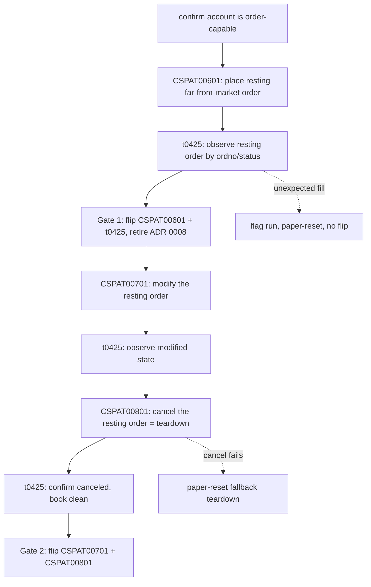

# Order Wave 2 — Live Flip + Modify/Cancel (CSPAT00701 / CSPAT00801)

## Summary

Take the order class from machinery-complete to live-proven and round-trip-capable.
Flip the first package's `CSPAT00601` (submit) + `t0425` (inquiry) from Pending to
Implemented via a guarded paper run, and add `CSPAT00701` (modify) + `CSPAT00801`
(cancel) so the SDK can place, amend, and pull a domestic-stock order. The wave ships
in one piece but flips on two independent gates: the submit pair flips on a submit +
reconcile run (retiring ADR 0008 as soon as it lands), and modify/cancel flip on the
chained submit → modify → cancel run — so the ready pair is never held hostage to the
newer build.

---

## Problem Frame

The first order package shipped its full safety runtime (no-retry `post_order`,
`OrderDeduplicator`, global kill switch, reconciliation, redaction, guarded manual
evidence) and merged to `main`, but its two TRs are still `implemented: false`
(`metadata/trs/CSPAT00601.yaml:26`, `metadata/trs/t0425.yaml:27`). The Implemented
gate for orders is a real guarded paper order — an operator action that was not run
in-window, so ADR 0008 sits open as "machinery-complete, evidence-pending"
(`docs/adr/0008-defer-order-runtime-until-safety-package-is-complete.md:5`), and the
order success predicate is seed-only (`00039`/`00040`) and unconfirmed against live
codes.

The first package also deliberately deferred modify and cancel
(`CSPAT00701`/`CSPAT00801` exist only in the raw OpenAPI capture, no metadata). That
deferral is exactly why its test order "has no in-wave SDK cancel path and must be
cleared by paper reset" — teardown was the loose end. Adding cancel closes it: the
SDK gains a native way to pull a resting order.

The danger profile is not uniform across the three actions, which is why this is not
just "more `is_order` TRs." Submit ambiguity risks a **double fill** (guarded by
dedup-on-request-body). Modify ambiguity risks acting on a wrong belief about whether
the new price/quantity landed — `CSPAT00701` is absolute (it carries the full target
`OrdQty`/`OrdPrc`, no delta field), so a blind re-send re-applies the same target
rather than compounding, but a stale "did it land?" assumption still mis-states the
book. Cancel ambiguity **inverts** the risk: a cancel wrongly believed to have
succeeded leaves a **live resting order** in the market. Submit's
"did a brand-new order appear?" reconciliation does not fit actions that target an
existing order number.

Why now: no external consumer is pulling for order placement yet — this is
maintainer-initiated retirement of the order-class contract debt, chosen over more
read-only breadth, consistent with the first package's framing.

---

## Key Decisions

- **One wave, two independent flip gates.** The submit pair and the modify/cancel pair
  ship in one wave but flip on separate gates so a failure in the newer build cannot
  re-defer the ready pair. Gate 1: `CSPAT00601` + `t0425` flip on a submit + reconcile
  run (teardown via paper-reset), retiring ADR 0008 the moment it lands. Gate 2:
  `CSPAT00701` + `CSPAT00801` flip on the chained submit → modify → cancel run. The
  chained run's first leg *is* gate 1's evidence, so a single in-window session can
  satisfy both gates — but gate 1 landing never depends on gate 2.

- **Cancel is the evidence run's teardown.** submit → modify → cancel is one chained
  sequence where the final cancel pulls the resting test order the SDK itself placed —
  the SDK-native teardown the first package lacked. Because cancel is both the teardown
  *and* a TR under test, paper-reset remains the fallback when cancel itself fails or a
  resting order fills unexpectedly.

- **Reuse dispatch, specialize reconciliation.** Modify/cancel route through the same
  `post_order` (no-retry, dedup, global kill switch, redaction/tracing) unchanged, but
  reconciliation becomes order-state-aware: after ambiguity, query `t0425` for the
  referenced order number (`ordno`) and classify by the order's lifecycle state field
  `status` (상태, corroborated by `ordrem`/`cheqty`), rather than matching a
  newly-created order.

- **Cancel ambiguity fails toward "still live."** An unknown-outcome cancel is treated
  as possibly-not-canceled (the order may still be resting), never assumed successful —
  the safe direction given the inverted danger.

---

## Requirements

**Live flip of the first order package**

- R1. `CSPAT00601` and `t0425` flip from their current `implemented: false` state to
  Implemented on a clean guarded submit + reconcile run (gate 1, teardown via
  paper-reset), independent of the modify/cancel build. The flip marks ADR 0008
  superseded; a Pending outcome leaves it open as machinery-complete, evidence-pending.
- R2. The order success predicate — seeded only on `00039`/`00040` and currently
  unconfirmed — is confirmed and, where needed, widened from the `rsp_cd` codes
  observed in the live run. A widened set forces a mock-gate update and re-run, not a
  silent pass.

**Order modify + cancel TRs**

- R3. `CSPAT00701` (현물정정주문, stock order modify) and `CSPAT00801` (현물취소주문,
  stock order cancel) are raised raw→Tracked via the `track-tr` recipe, then
  Implemented via the `implement-order-tr` recipe.
- R4. Both are `owner_class: orders` with `is_order: true` policies, routed exclusively
  through `post_order`, reusing its no-retry dispatch, deduplication, global kill
  switch, and redaction/tracing contract unchanged.
- R5. Both reference an existing order number (`OrgOrdNo`) and serialize all required
  numeric request-body fields as JSON numbers (`string_as_number`) to avoid `IGW40011`.

**Order-state-aware reconciliation**

- R6. Reconciliation for modify/cancel queries `t0425` for the referenced order number
  and classifies by the order's lifecycle state field `status` (상태), corroborated by
  `ordrem` (remaining qty) and `cheqty` (filled qty), into resting / modified / filled /
  canceled / absent — distinct from submit's "a new order appeared" matching. This
  reconciliation read is a new data flow and inherits the redaction/tracing contract:
  its spans carry no raw `ordno`, account, or order state, and any persisted
  reconciliation evidence follows R10's at-rest posture.
- R7. After an ambiguous modify/cancel, no retry fires until reconciliation proves the
  intended state transition did not land. A cancel of unknown outcome is treated as
  possibly-still-live, never assumed successful.
- R8. The accepted-ack set is extended with modify/cancel acknowledgement codes, each
  confirmed from the live run. An unrecognized 2xx (including `00000`) fails safe to
  Unknown → reconciliation, never a silent accept or reject.

**Evidence & gate**

- R9. The automated gate proves modify/cancel logic — no-retry, dedup, the extended
  predicate, and order-state reconciliation — entirely against mocks, and never submits
  a live order.
- R10. A single chained paper evidence run covers submit → modify → cancel: place a
  resting far-from-market order, amend it, then cancel it as the run's teardown — each
  observed via `t0425` and recorded with its `rsp_cd`/`rsp_msg` and order number. The
  artifact carries the first package's at-rest posture, not merely "credential-free":
  the account identifier is HMAC-keyed (never bare), the record is written only to the
  known evidence location, and it carries a stated retention/deletion bound.
- R11. The two flip gates are independent. Gate 1 (`CSPAT00601` + `t0425`) flips on a
  clean submit + reconcile run, teardown via paper-reset. Gate 2 (`CSPAT00701` +
  `CSPAT00801`) flips on a clean chained submit → modify → cancel run, where cancel is
  the primary teardown and paper-reset the fallback when cancel itself fails or a
  resting order fills unexpectedly. A gate whose run cannot execute in-window leaves only
  its own TRs Pending; gate 1 does not wait on gate 2.

**Metadata & recipe**

- R12. Each new `is_order: true` REST `{TR}_POLICY` (`CSPAT00701`, `CSPAT00801`)
  registers in the policy index cross-check list only — not the REST-only non-order
  list. Tracking the two TRs bumps the maintained-count assertions.
- R13. The frozen `implement-order-tr` recipe is reused; any modify/cancel-specific
  step it lacks (order-state reconciliation, chained teardown) is folded back into the
  recipe rather than improvised per-TR.

---

## Key Flow

The chained run is the new load-bearing sequence; its first leg satisfies gate 1, and
cancel doubles as gate 2's teardown.

- F1. Ambiguous modify/cancel reconciliation
  - **Trigger:** `post_order` returns a transport timeout or 5xx on `CSPAT00701`/`CSPAT00801`.
  - **Steps:** No retry fires; the SDK records local evidence, queries `t0425` for the
    referenced order number, and reads its lifecycle state from `status` (corroborated by
    `ordrem`/`cheqty`).
  - **Outcome:** A landed modify/cancel is detected rather than re-sent; an unknown
    cancel keeps the order treated as possibly-live; retry is cleared only after the
    transition is proven not to have landed.
  - **Covers R6, R7, R8.**

---

## Acceptance Examples

- AE1. **Covers R7.** **Given** a cancel that times out, **when** the error surfaces,
  **then** no retry fires, reconciliation queries `t0425`, and if the order is still
  resting it is classified not-canceled — never assumed successful.
- AE2. **Covers R6, R8.** **Given** a modify that returns an unrecognized 2xx
  (including `00000`), **when** classified, **then** it fails safe to Unknown →
  reconciliation rather than a silent accept.
- AE3. **Covers R10, R11.** **Given** a clean chained run, **when** submit + reconcile
  succeed, **then** gate 1 flips `CSPAT00601`/`t0425` and ADR 0008 is retired; **when**
  modify → cancel then also succeed and `t0425` confirms the book clean, **then** gate 2
  flips `CSPAT00701`/`CSPAT00801` and the resting order is cleared by the SDK's own cancel.
- AE4. **Covers R11.** **Given** submit + reconcile succeed but the modify or cancel link
  then fails, **when** the run ends, **then** gate 1 still flips `CSPAT00601`/`t0425`
  (ADR 0008 retired) while `CSPAT00701`/`CSPAT00801` stay Pending — a modify/cancel
  failure does not re-defer the submit flip.
- AE5. **Covers R11.** **Given** the cancel link itself fails mid-run, **when** teardown
  is needed, **then** paper-reset is invoked as fallback, the run is flagged for review,
  and gate 2 does not flip (`CSPAT00701`/`CSPAT00801` stay Pending) — gate 1 is
  unaffected if submit + reconcile already succeeded.
- AE6. **Covers R4.** **Given** a cancel submitted successfully, **when** an identical
  cancel is re-sent within the dedup TTL, **then** the cached response returns and no
  second dispatch occurs — idempotent cancel for free.

---

## Success Criteria

- Gate green end-to-end: `make docs`, `cargo test`, `cargo test -p ls-core` (metadata
  validation + policy index cross-check), `make docs-check`.
- Modify/cancel logic proven against mocks: no-retry dispatch, dedup, the extended
  success predicate, and order-state reconciliation classification.
- A chained evidence artifact (submit → modify → cancel) recorded with R10's at-rest
  posture, with the observed `rsp_cd` surface captured and the accepted-code set pinned
  from it.
- `CSPAT00601` + `t0425` flip on gate 1 (submit + reconcile); `CSPAT00701` +
  `CSPAT00801` flip on gate 2 (chained run) — each honestly recorded Pending,
  independently, if its gate cannot execute in-window.
- ADR 0008 marked superseded only on a successful flip; otherwise it stays open as
  machinery-complete, evidence-pending. The supersession note scopes what the flip
  proves honestly: a clean run confirms callability, the happy path, and the live
  ack-code surface — the inverted-cancel reconciliation (still-live vs canceled)
  remains mock-proven, not live-exercised, since a clean run never produces an
  ambiguous outcome against a genuinely live order.
- Recommended rung untouched for all four TRs (deferred, consistent with every prior
  wave).

---

## Scope Boundaries

**Deferred for later**

- F&O order class (`CFOAT00100`/`00200`/`00300`) — needs a distinct F&O account and an
  F&O-specific order safety design.
- Recommended promotion of the order TRs (separate act: Focused Evidence ≤7 days + a
  recommendation block).
- Field-level order-number dependency edges (e.g. `OrgOrdNo <- CSPAT00601.OrdNo`) — the
  coarse `strong_order_fields` + `prerequisite_producer_trs` contract is enough for now.

**Outside this wave**

- Overseas order classes.
- Production (non-paper) order testing — prohibited by the safety contract.
- Modify/cancel for any non-stock class.

---

## Dependencies / Assumptions

- An operator with a funded, order-capable paper account in-window. If the gateway
  cannot place an order at all in-window, both gates fail and all four TRs land Pending;
  if only modify/cancel can't complete, gate 1 still lands and only gate 2's TRs stay
  Pending (precedent: the night-window market-data TRs and the first order package).
- `t0425`'s response carries the fields reconciliation needs — `ordno` (order number)
  and `status` (order lifecycle state, 상태), with `ordrem` (remaining qty) and `cheqty`
  (filled qty) corroborating, in `t0425OutBlock1`. (`medosu` is the buy/sell side, 구분 —
  not the state field.) The specific `status` values that denote resting / modified /
  filled / canceled are confirmed from the live run, not assumed.
- `CSPAT00701` modify is absolute: it carries the full target `OrdQty`/`OrdPrc` with no
  delta field (confirmed in the raw baseline), so a re-sent modify re-applies the same
  target rather than compounding.
- `CSPAT00701`/`CSPAT00801` exist in the raw capture (verified) and are raised to
  Tracked via `track-tr` before implementation.
- The first package's runtime is in place and merged: `post_order`
  (`crates/ls-core/src/inner.rs:524`), `OrderDeduplicator`
  (`crates/ls-core/src/order_dedup.rs:58`), the global kill switch (`inner.rs:177`), and
  the frozen `implement-order-tr` recipe (`.agents/skills/implement-order-tr/SKILL.md`).
- Maintainer-initiated; no external consumer is pulling for order placement.

---

## Outstanding Questions

All deferred to planning — none block the start of planning.

- The canonical resting-limit price offset and symbol for the chained run — far enough
  from market to rest unfilled, yet within exchange validation bounds. An evidence-time
  operator parameter.
- Whether modify/cancel dedup keys should incorporate `OrgOrdNo` identity, or the full
  canonical request body (as submit does) already covers it.
- The `t0425` matching fallback when `ordno` is empty or zero in an ambiguous ack —
  whether to reuse the first package's field-corroboration fallback.

---

## Sources / Research

- `docs/brainstorms/2026-06-25-order-runtime-first-package-requirements.md` — the first
  order package this wave extends.
- `docs/adr/0008-defer-order-runtime-until-safety-package-is-complete.md` — the open
  "machinery-complete, evidence-pending" deferral this wave aims to retire.
- `docs/design/order-safety-design.md` — the order-safety contract (no-retry, dedup
  eviction, reconciliation, manual evidence, redaction).
- `metadata/trs/CSPAT00601.yaml:26`, `metadata/trs/t0425.yaml:27` — current
  `implemented: false` state.
- `crates/ls-trackers/baselines/api-drift/normalized/trs/t0425.json` — `t0425OutBlock1`
  with `ordno` + `status` (lifecycle state) + `ordrem`/`cheqty`, the reconciliation
  source of truth; `crates/ls-sdk/src/orders/mod.rs:351-353` documents `medosu` as side,
  `status` as state.
- `crates/ls-trackers/baselines/api-drift/raw/ls-openapi-full.json` — `CSPAT00701`,
  `CSPAT00801`, and the F&O order TRs present but unmetadata'd.
- `crates/ls-core/src/inner.rs:524` (`post_order`), `crates/ls-core/src/order_dedup.rs:58`
  (`OrderDeduplicator`), `crates/ls-core/tests/policy_index_crosscheck.rs:110` (the
  `is_order` cross-check convention).
- `.agents/skills/track-tr/`, `.agents/skills/implement-order-tr/` — recipes for raising
  the two raw TRs and implementing the order class.
