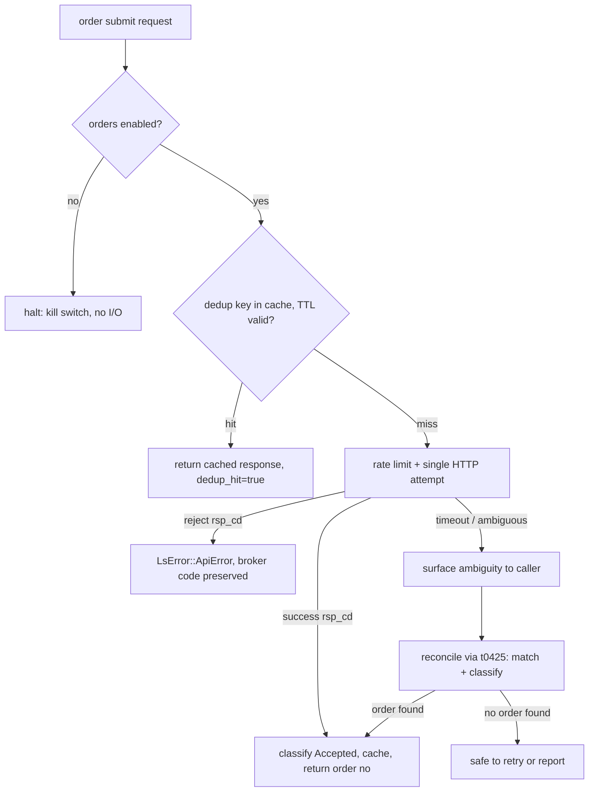

# Order Runtime — First Package (CSPAT00601 + t0425)

## Summary

Break ground on the order class. Ship the full order-safety runtime package the
design contract has been waiting on — no-retry `post_order` dispatch, an
`OrderDeduplicator`, a kill switch, reconciliation, redaction/tracing, and a
manual-evidence harness — behind two TRs that ship together: `CSPAT00601`
(domestic-stock cash order submit) and `t0425` (order/execution inquiry). Both
earn Implemented through one guarded live paper order plus a reconciliation read,
not the automated Paper Live Smoke every read-only TR uses. It also crosses a
one-way line: the first order flip makes the SDK trade-capable — a permanent
change to its support and liability posture, not another read-only wave. This wave
aims to retire the ADR 0008 deferral, conditional on a successful in-window
evidence run (see Key Decisions).

---

## Problem Frame

Every one of the ~97 Implemented TRs to date is read-only — market data, account
reads, realtime feeds. The support ladder's Implemented gate is built around that:
a Paper Live Smoke that constructs a request, gets a success code, and asserts a
non-empty result. The order class is the one place where that gate is unusable. An
order "smoke" is a real, irreversible market action; a bug there is not a stale
quote but a double fill.

The project already wrote down what must exist before any order TR is callable
(`docs/design/order-safety-design.md`, ADR 0008): one-attempt dispatch so an
ambiguous timeout is never blindly retried, idempotent deduplication, a reconciliation
path that resolves ambiguous sends against real exchange state, an operator kill
switch, and an order-specific success predicate. Today the runtime carries only the
*seam* — `EndpointPolicy.is_order` and `guard_non_order()` — and none of the
machinery. `CSPAT00601` sits Tracked-not-implemented; its reconciliation companion
`t0425` is not even Tracked (it exists only in the raw OpenAPI capture). This wave
builds the package and flips both TRs.

Why now: no external consumer is pulling for order placement yet. This wave is
maintainer-initiated retirement of contract debt — ADR 0008's deferral — chosen
over continuing to compound read-only TR breadth. The tradeoff is deliberate; the
order class's irreversible blast radius is why it waited this long.

---

## Key Decisions

- **Live-paper-order Implemented gate.** An order TR flips to Implemented only after
  an operator places a real guarded paper order out-of-band and records credential-free
  manual evidence — the strongest proof it is genuinely callable, parallel to how the
  realtime class earned its own calibrated gate. This *strengthens* the current contract:
  `docs/design/order-safety-design.md` today reserves manual evidence for Recommended and
  has the automated gate "never submit a live order." That doc is updated as part of this
  wave to make a single guarded paper order the Implemented gate for orders.

- **Full first package in one wave.** Both TRs and all safety machinery ship together
  rather than a staged cut, at the cost of a large wave whose Implemented flip is blocked
  until both TRs smoke cleanly in the same window. Deferral-retirement is conditional on
  that in-window run: if both TRs land Pending (AE5), the safety machinery still ships but
  ADR 0008 stays open in a *machinery-complete, evidence-pending* state rather than being
  marked superseded.

- **Evidence is a scenario matrix, not one order.** The manual run places resting
  far-from-market limit orders (buy and sell), one marketable/immediate order, and one
  deliberate rejection — so the new order success predicate is pinned from *observed*
  real `rsp_cd` codes rather than only the `00039`/`00040` codes recorded in
  `order-safety-design.md` §1.

- **t0425 is the reconciliation companion.** It must be raised raw→Tracked (via the
  `track-tr` recipe) before it can be implemented, and its reconciliation read is what
  CSPAT00601's order number feeds into.

---

## Requirements

**Order dispatch runtime**

- R1. `post_order` issues exactly one network attempt with no generic retry, charges the
  Orders rate bucket, and rejects a non-order policy before any HTTP call. An ambiguous
  failure (timeout/5xx) surfaces the ambiguity to the caller and reconciliation rather
  than retrying.
- R2. A kill switch (`set_orders_enabled(false)` or equivalent) halts all order dispatch
  before dedup lookup, rate limiting, or HTTP I/O. Non-order dispatch is unaffected, and
  reconciliation must not silently re-enable it.
- R3. `OrderDeduplicator` keys on `SHA256(account_no + ":" + tr_code + ":" + canonical
  request JSON)`, with a 300s default TTL, per SDK-client scope. A cache hit returns the
  cached response and bypasses rate limiting and HTTP. Key-build serialization failure is
  fail-closed (no dispatch). Eviction is an opportunistic write-path sweep that holds no
  per-entry guard.
- R4. An order success predicate, distinct from the read-only predicate, classifies an
  acknowledgement as Accepted and keeps a rejected order as `LsError::ApiError` with the
  broker code and message preserved. The predicate is built and mock-gated (R9) against the
  starting accepted-code hypothesis (`00039`/`00040`); the evidence run (R11) then confirms
  or amends that set against observed live codes. A live-widened set forces a mock-gate
  update and re-run rather than silently passing a green gate.
- R5. Order dispatch carries the redaction/tracing contract: `instrument(skip_all)` on
  public methods, spans record only `tr_code`/`path`/`category`/`dedup_hit` and never
  credentials or request body. Order response types are not auto-redacted, but they are
  fail-closed by default: a response body reaches no logging or tracing sink unless an
  operator explicitly surfaces it for evidence against a known artifact, with operator
  review as the second layer rather than the primary control. The reconciliation
  local-evidence record (F1) — which persists account, symbol, side, quantity, and price —
  carries the same at-rest posture: account identifier redacted or hashed, written only to a
  known evidence location, with a stated retention bound.

**The two TRs**

- R6. `CSPAT00601` is callable as a domestic-stock cash order submit, `owner_class: orders`,
  with its policy `is_order: true`, routed exclusively through `post_order`.
- R7. `t0425` is raised raw→Tracked and then Implemented as the read-only order/execution
  inquiry used for reconciliation.
- R8. A reconciliation path, after an ambiguous send, queries `t0425` and matches candidate
  orders by account, symbol, side, quantity, price, time window, and any known order number,
  then classifies the outcome as Accepted, Rejected, Duplicate, Modified, Canceled, or
  Unknown. It retries only after proving no matching order was accepted, or after an explicit
  operator override.

**Gate and manual evidence**

- R9. The automated gate proves order logic — no-retry semantics, dedup and its eviction
  rule, the success predicate, reconciliation, and the kill switch — entirely against mocks.
  The gate never submits a live order.
- R10. A manual-evidence harness fails closed: the order TR selection is explicit with no
  default, operator parameters are validated before SDK construction, invalid parameters and
  missing order numbers produce structured "not certified" evidence, runs are paper-only, and
  recorded evidence excludes credentials and account-sensitive data.
- R11. Both TRs flip to Implemented only after a guarded paper-order evidence run covering
  the scenario matrix: a resting far-from-market limit buy and sell (each observable by
  `t0425`), one marketable/immediate order, and one deliberate rejection — capturing the real
  `rsp_cd`/`rsp_msg` surface that defines R4's predicate. The run follows the owned
  place→observe→teardown sequence in F2, including its cleanup and unexpected-fill branches.

**Metadata and recipe**

- R12. Each new `is_order: true` REST `{TR}_POLICY` const is registered in both cross-check
  lists (the order policy is *not* added to the REST-only non-order list).
- R13. A frozen `implement-order-tr` recipe captures the order-class path — no automated
  smoke, guarded manual evidence, no-retry dispatch — mirroring the existing `implement-tr`
  and `implement-realtime-tr` recipes.

---

## Key Flow

The order dispatch decision path is the load-bearing safety logic. A non-order TR never
enters it; an order TR never leaves it.

- F1. Ambiguous submit reconciliation
  - **Trigger:** `post_order` returns a transport timeout or 5xx on `CSPAT00601`.
  - **Steps:** No retry fires; the SDK records local evidence (TR, request hash, account,
    symbol, side, quantity, price, error), queries `t0425`, matches candidate orders, and
    classifies the outcome.
  - **Outcome:** A landed-but-locally-failed order is detected as Accepted rather than
    silently resubmitted; a genuinely-absent order is cleared for retry.
  - **Covers R1, R8.**

- F2. Guarded manual evidence run
  - **Trigger:** Operator initiates the out-of-band evidence harness against the paper gateway.
  - **Steps:** Operator selects the order TR explicitly and supplies validated parameters; the
    harness places the scenario matrix (resting buy/sell, marketable, rejection); each result
    is recorded credential-free with its `rsp_cd`/`rsp_msg` and any order number; `t0425`
    reconciles the resting orders.
  - **Sequence:** confirm the account is order-capable → place → observe via `t0425` →
    teardown. Each link has a defined abort, so a break upstream invalidates only the
    downstream evidence.
  - **Cleanup:** the resting order is cleared by paper reset — the only verified teardown, since
    all cancel TRs are deferred and no gateway-side cancel-all exists. Cleanup is an owned, verified
    step (the book is checked clean before and after the run); if no clearing mechanism is available
    in-window, that is a blocking Pending condition, not a silent gap.
  - **Unexpected fill:** if a resting order fills, the harness records the fill, flags the
    evidence run for review, and the operator unwinds the paper position out-of-band — the
    matrix expects resting-acknowledgement codes, not a fill.
  - **Outcome:** A reproducible evidence artifact that pins R4's predicate and flips both TRs
    to Implemented.
  - **Covers R10, R11.**

---

## Acceptance Examples

- AE1. **Covers R3.** **Given** an order submitted successfully, **when** an identical request
  (same account, TR, and request body) is submitted again within 300s, **then** the cached
  response returns with `dedup_hit=true` and no second dispatch occurs.
- AE2. **Covers R1, R8.** **Given** a submit that times out, **when** the transport error
  surfaces, **then** no retry fires, the ambiguity reaches the caller, and reconciliation is
  invoked against `t0425`.
- AE3. **Covers R3, R11.** **Given** the evidence matrix is being recorded, **when** the
  operator re-runs an identical scenario, **then** the dedup cache short-circuits it — so each
  scenario must use a distinct request body (or an explicit cache bypass) to regenerate
  fresh broker codes. The dedup key is the full canonical request body (R3); the
  `strong_order_fields` are the order-identity concept the matrix varies to miss the cache.
- AE4. **Covers R2.** **Given** orders are disabled via the kill switch, **when** an order
  submit is attempted, **then** dispatch halts before dedup and HTTP, while a market-data read
  on the same client still succeeds.
- AE5. **Covers R11.** **Given** the paper account cannot place an order in the smoke window
  (not order-capable, or empty), **when** the evidence run executes, **then** the TRs stay
  Pending — callable-but-unconfirmed — rather than flipping to Implemented.

---

## Success Criteria

- Gate green end-to-end: `make docs`, `cargo test`, `cargo test -p ls-core` (metadata
  validation + policy index cross-check), `make docs-check`.
- Order logic proven against mocks: no-retry dispatch, dedup with the opportunistic
  write-path eviction, the order success predicate, reconciliation classification, and the
  kill switch.
- A credential-free guarded manual evidence artifact recorded, covering the scenario matrix,
  with the observed `rsp_cd` surface captured and R4's accepted-code set pinned from it.
- `CSPAT00601` and `t0425` flip to Implemented — or are honestly recorded Pending if the
  paper gateway cannot place orders in-window.
- `docs/design/order-safety-design.md` updated to reflect the live-paper-order Implemented
  gate. ADR 0008's deferral is marked superseded only on a successful in-window flip; if both
  TRs land Pending, it stays open as machinery-complete, evidence-pending.
- Recommended rung untouched for both TRs (deferred, consistent with every prior wave).

---

## Scope Boundaries

**Deferred for later**

- Modify/cancel TRs (`CSPAT00701`, `CSPAT00801`) — explicitly after this package. Consequence:
  the wave's test order has no in-wave SDK cancel path and must be cleared by paper reset.
- Recommended promotion of the order TRs (needs Focused Evidence ≤7 days + a recommendation
  block as a separate act).
- Field-level order-number dependency edges (e.g. `OrgOrdNo <- CSPAT00601.OrdNo`) — the coarse
  `strong_order_fields` + `prerequisite_producer_trs` contract is enough for now.

**Outside this wave**

- Overseas, futures, and options order classes.
- Production (non-paper) order testing — prohibited by the safety contract.
- A background dedup sweeper thread — the design rejects it in favor of the write-path sweep.

---

## Dependencies / Assumptions

- A funded paper account holding a tradeable domestic-stock symbol, order-capable in the smoke
  window. If the gateway cannot place orders in-window, both TRs land Pending (precedent: the
  night-window market-data TRs).
- A clearable teardown mechanism for the resting test order in-window — paper reset (or an
  out-of-band operator action), verified before the run starts. With all cancel TRs deferred and
  no gateway-side cancel-all, the absence of a clearing mechanism is a blocking Pending condition.
- `t0425` exists in the raw OpenAPI capture (verified) and is brought to Tracked via the
  `track-tr` recipe before implementation.
- The `00039` (sell) / `00040` (buy) acknowledgement codes recorded in
  `order-safety-design.md` §1 are the starting hypothesis for R4's predicate, confirmed and
  expanded by the evidence run. (The originating migration source is decommissioned per ADR
  0014; the in-repo design note is the live record.)
- The runtime today has the `is_order` seam and `guard_non_order()` but no `post_order`,
  `OrderDeduplicator`, kill switch, or `LsError::DuplicateOrder` (the variant is re-added this
  wave).

---

## Outstanding Questions

All deferred to planning — none block the start of planning.

- The canonical resting-limit price offset and symbol for the evidence matrix — far enough from
  market to rest unfilled, yet within exchange validation bounds. An evidence-time operator
  parameter, not a structural decision.
- `t0425`'s `owner_class` and routing: it is a read, but it belongs to the order package — does
  it route through the `account` handle, or a new order-read surface? Resolvable from the raw
  baseline and existing handle patterns.
- The module layout for the order dispatch path and the manual-evidence harness.
- Whether the kill switch is global or per-account.

---

## Sources / Research

- `docs/design/order-safety-design.md` — the order-safety contract (no-retry, dedup eviction,
  reconciliation, manual evidence, redaction).
- `docs/adr/0008-defer-order-runtime-until-safety-package-is-complete.md` — the deferral
  this wave aims to retire (on a successful in-window flip; see Key Decisions).
- `crates/ls-core/src/endpoint_policy.rs` — the `is_order` / `guard_non_order()` seam already in
  place (all consts currently `is_order: false`).
- `metadata/trs/CSPAT00601.yaml` — `strong_order_fields`, `certification_path: manual`,
  Tracked-not-implemented.
- `docs/design/order-safety-design.md` §2 — the authoritative dedup eviction contract
  (opportunistic write-path sweep).
- `.agents/skills/track-tr/`, `.agents/skills/implement-tr/`, `.agents/skills/implement-realtime-tr/`
  — recipe patterns for raising `t0425` and for the new `implement-order-tr` recipe.
- Raw capture (`crates/ls-trackers/baselines/api-drift/raw/ls-openapi-full.json`) — `t0425`,
  `CSPAT00701`, `CSPAT00801` present but unmetadata'd.

---

## Deferred / Open Questions

### From 2026-06-25 review

- **Kill-switch scope is a safety policy, not a layout detail** — Outstanding Questions (P2, product-lens, confidence 75)

  Whether the kill switch is global or per-account is currently deferred as a planning detail, but for an emergency halt on real-money actions it defines who can trade when one account misbehaves and what an operator's "stop" actually stops. Global vs per-account changes the safety-control semantics this wave exists to deliver, so it should be resolved as a committed decision (recommended default: global) rather than left as an open layout choice.
