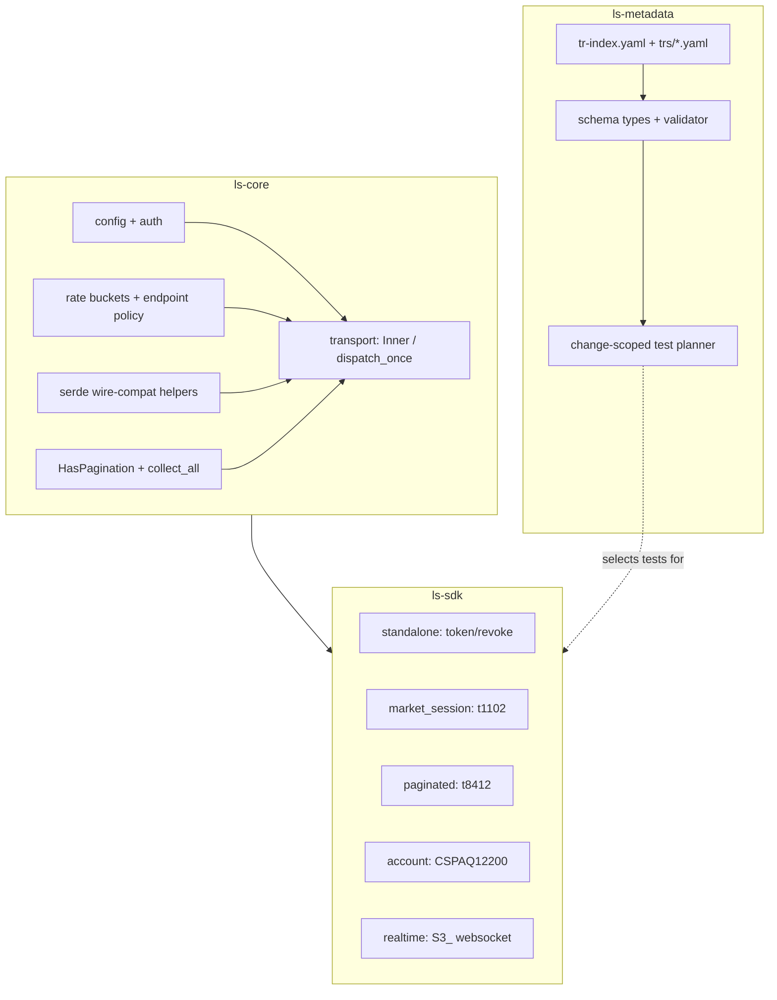
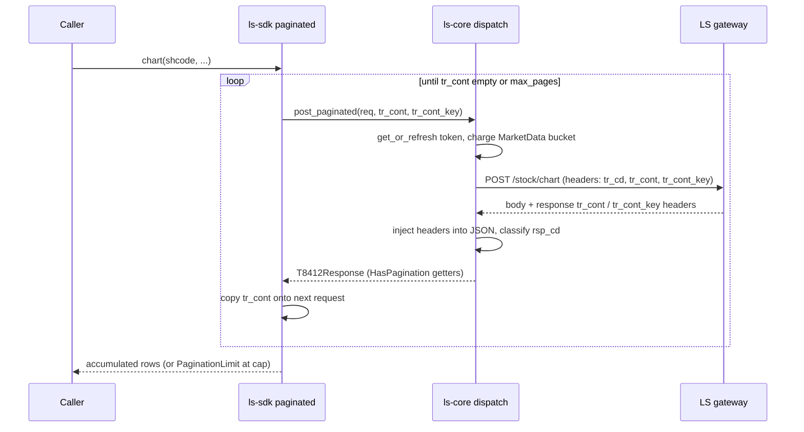

# feat: Maintained SDK first vertical slice

## Summary

Stand up the maintained `korea-adapter-sdk-ls` workspace and implement a representative vertical slice: a ported `ls-core` runtime, an `ls-sdk` with one TR per dependency class (`token`/`revoke`, `t1102`, `t8412`, `CSPAQ12200`, `S3_`), and an `ls-metadata` crate whose Rust-owned validator and facet-driven Change-Scoped test planner prove the architecture's central thesis. Order runtime, `ls-trackers`, and tracker-driven evidence invalidation stay out of this slice.

## Problem Frame

The predecessor `korea-broker-sdk-ls` is a generated-surface SDK whose maintenance cost the new architecture exists to escape (see origin and `docs/adr/0001-maintained-sdk-surface.md`). Its `crates/core` runtime, however, is correct and carries bugs-fixed-the-hard-way (string-vs-number wire coercion, `tr_cont` header defaulting, `expire_in` parsing, websocket lost-wakeup fixes). The slice's job is not to re-derive that runtime but to **port it cleanly into the dependency-class layout** and build the maintained-SDK machinery around it — metadata as source of truth, and a test gate that selects by facet rather than running everything. Getting that machinery right on a small, real slice is what de-risks expanding TR coverage later.

---

## Requirements

**First-slice coverage**

- R1. Implement one TR per representative dependency class: `token`/`revoke` (standalone), `t1102` (market_session), `t8412` (paginated), `CSPAQ12200` (account), `S3_` (realtime). (origin R1)
- R2. Ship `orders` as metadata plus safety/reconciliation design notes only — no order runtime. (origin R2; `docs/adr/0008-defer-order-runtime-until-safety-package-is-complete.md`)
- R3. Exclude TRs with known unresolved upstream blockers, including `t8430`. (origin R3)

**Workspace**

- R4. Build three crates this slice — `ls-core`, `ls-sdk`, `ls-metadata` — as the first cut of the four-crate target workspace (`ls-trackers` deferred until the tracker skeleton lands). A dev-only `ls-sdk-test-support` crate (`publish = false`) is added as a workspace member for test mocks; it is not one of the four shippable target crates. (origin R4)
- R5. Dependency classes are modules within `ls-sdk`, not separate crates. (origin R5)

**Metadata and gate**

- R6. The `ls-metadata` Rust types and validator are the authority that validates per-TR YAML; the validator enforces index↔per-TR consistency and one `owner_class` per TR. (origin R6)
- R7. No hand-maintained JSON Schema; any schema is generated from the Rust types later, triggered by authoring friction. (origin R7)
- R8. A Change-Scoped test planner selects the verification set from changed TRs, owning dependency classes, and facets — a real facet-driven selector, not a stub. (origin R5)

**Evidence freshness**

- R9. Record the focused-evidence freshness rule (change-driven + 90-day backstop) in metadata and docs, but do not wire change-driven invalidation in this slice; the 90-day backstop is the sole operative control until a tracker exists. (origin R8, R9, R10)

**Wire compatibility**

- R10. Preserve the load-bearing wire-compat behaviors from the ported runtime verbatim: string-or-number deserialization, single-or-array out-block tolerance, `tr_cont` defaulting to `"N"`, `expire_in` parsing, and `rsp_cd`-based business-error classification with `01900` as the only paper-incompatible signal. (Plan-level refinement of the Problem Frame's porting-fidelity concern; no direct origin R-ID.)

---

## Key Technical Decisions

- **Port, don't rewrite, the core runtime.** `ls-core` ports `auth`, `config`, `error`, transport dispatch, rate limiting, pagination, and the serde wire-compat helpers from old `crates/core/src/` largely verbatim. Rewrite only to drop generator coupling (no `generated/`, `macros`, `python`, `nodejs`, certification harness). Rationale: the old runtime's wire handling is correct and hard-won; a clean rewrite would re-introduce fixed bugs. (origin: chosen at plan-time)

- **Rust-owned metadata is the validating authority.** `ls-metadata` serde structs + validator gate per-TR YAML; `metadata/tr-index.yaml` duplicates only routing fields and is validated against `metadata/trs/*.yaml`. No parallel JSON Schema. Recorded as ADR 0012. (origin R6, R7)

- **Change-Scoped planner is a real facet-driven selector.** The planner maps changed TRs → owning `owner_class` + facets → a concrete test set (serde for shape changes, pagination tests for `self_paginated`, date tests for `date_sensitive`, credential-free construction for `account_state`, subscribe/reconnect/frame for `protocol: websocket`). It selects by metadata facet, never by touched crate. (origin R5)

- **Continuation tokens are transport headers via a trait.** `tr_cont`/`tr_cont_key` ride as HTTP headers, surfaced through a `HasPagination` trait implemented only on paginated request wrappers; standalone TRs are structurally incapable of pagination. (research: predecessor `CONCEPTS.md`)

- **Validate field semantics against the spec, not synthetic fixtures.** Serde test fixtures are derived from the LS spec / captured shapes, and every date-bearing test pins an explicit trading day. Business errors classify on structured `rsp_cd`, never `rsp_msg` substrings; `01900` is the sole paper-incompatible code. (research: `docs/solutions/logic-errors/synthetic-test-data-masks-wrong-api-field-semantics.md`, `.../empty-date-fixture-defaults-to-today-fails-on-non-trading-days.md`, `.../conventions/paper-incompatible-classification-boundary-convention.md` in the old repo)

- **WebSocket lifecycle preserves the fixed concurrency patterns.** `WsManager` holds `TokenManager` directly (never `Arc<Inner>`, avoiding a circular `Arc`), refreshes the token on every reconnect, pins one `Notified` future across polls, exposes an explicit terminal `None`, and records a subscription before the outbound send. (research: `docs/solutions/runtime-errors/timeout-wrapped-polls-mask-lost-notify-wakeup.md`, `.../best-practices/buffered-channel-ordering-invariant-unit-test.md` in the old repo)

- **`base_url`/`ws_base_url` injection is the single test seam.** Every dispatch resolves the host through one override-wins-else-environment-default choke point, letting wiremock and a mock WS server exercise real code paths.

---

## High-Level Technical Design

Crate and module topology — `ls-core` is transport-agnostic; dependency classes are `ls-sdk` modules; `ls-metadata` drives the test gate:



REST dispatch and SELF-pagination data flow (`t8412`):



---

## Output Structure

```text
Cargo.toml                      # workspace: members ls-core, ls-sdk, ls-metadata, ls-sdk-test-support
crates/
  ls-core/
    src/{lib,error,config,config_resolve,auth,rate_limiter,endpoint_policy,inner,client,pagination,parse}.rs
  ls-sdk/
    src/{lib}.rs
    src/standalone/mod.rs        # token, revoke
    src/market_session/mod.rs    # t1102
    src/paginated/mod.rs         # t8412 + shared continuation helper
    src/account/mod.rs           # CSPAQ12200
    src/realtime/                # S3_ websocket
      {mod,connection,frame,dispatch,stream,overflow}.rs
    tests/                       # serde, pagination, websocket suites
    tests/fixtures/              # spec-derived response fixtures
  ls-metadata/
    src/{lib,schema,validator,planner}.rs
  ls-sdk-test-support/
    src/{lib,mock_http,mock_ws}.rs  # mock_config, wiremock token endpoints, mock WS server
metadata/
  tr-index.yaml
  trs/{token,revoke,t1102,t8412,CSPAQ12200,S3_,<orders-rep>}.yaml
docs/adr/0011-*.md               # crate layout
docs/adr/0012-*.md               # rust-owned metadata schema authority
```

The tree is a scope declaration; per-unit `Files` lists are authoritative.

---

## Implementation Units

### Phase A — Workspace and ls-core runtime (ported)

### U1. Workspace skeleton and crate scaffolding

- Goal: Create the Cargo workspace with `ls-core`, `ls-sdk`, `ls-metadata`, and `ls-sdk-test-support`, pinned workspace dependencies, and ADR 0011 recording the crate layout.
- Requirements: R4, R5
- Dependencies: none
- Files: `Cargo.toml`, `crates/ls-core/Cargo.toml`, `crates/ls-sdk/Cargo.toml`, `crates/ls-metadata/Cargo.toml`, `crates/ls-sdk-test-support/Cargo.toml`, crate `src/lib.rs` stubs, `docs/adr/0011-ls-crate-layout.md`
- Approach: Port `[workspace.dependencies]` versions verbatim from the old workspace (`tokio 1.52`, `reqwest 0.13` rustls/json/form, `serde 1`, `serde_json 1`, `thiserror 2`, `chrono 0.4` no-serde, `tracing 0.1`, `governor 0.10`, `backon 1.5` tokio-sleep, `tokio-tungstenite 0.29` rustls-native-roots, `dashmap 6`, `rust_decimal 1.36`, dev `wiremock 0.6`). `edition = "2021"`, `resolver = "2"`. `ls-trackers` intentionally absent. ADR follows the terse `docs/adr/` one-paragraph format (next number is 0011).
- Patterns to follow: old `Cargo.toml` workspace block; `.agents/skills/grill-with-docs/ADR-FORMAT.md`
- Test scenarios: Test expectation: none — scaffolding; verified by `cargo build` succeeding across the workspace.
- Verification: `cargo build` and `cargo metadata` resolve all four crates with no `ls-trackers` member.

### U2. ls-core error model and serde wire-compat helpers

- Goal: Port the `LsError`/`LsResult` model and the load-bearing serde coercion helpers.
- Requirements: R10
- Dependencies: U1
- Files: `crates/ls-core/src/error.rs`, `crates/ls-core/src/lib.rs` (serde helpers), `crates/ls-core/src/parse.rs`
- Approach: Port `LsError` thiserror enum (`Auth`, `Http(#[from])`, `WebSocket`, `Decode(#[from])`, `ApiError{code,message}`, `RateLimited`, `Config`, `PaginationLimit(usize)`, `Parse`, …). Drop the order-only `DuplicateOrder` variant — U15 is metadata-only with no Rust consumer; re-add it with the order-dispatch follow-up. Port `string_or_number`, `option_string_or_number`, `de_vec_or_single`, `string_as_number`, and `parse.rs` decimal helpers exactly (wire-compat-critical), but expose them as `pub` from `ls-core` — the old repo's `pub(crate)` only worked because the TR structs shared the crate. `ls-sdk` TR structs reference them by full path (`#[serde(deserialize_with = "ls_core::string_or_number")]`), never `crate::`-rooted.
- Patterns to follow: old `crates/core/src/error.rs`, `lib.rs`, `parse.rs`
- Test scenarios:
  - Happy path: `string_or_number` deserializes both `"123"` and `123` to the same numeric value.
  - Edge case: `de_vec_or_single` accepts a single object, an array, null, and empty string for an out-block array field.
  - Edge case: `option_string_or_number` yields `None` for absent/empty, `Some` for `"0"`.
  - Error path: a non-numeric string into a numeric field surfaces `LsError::Parse`, not a panic.
- Verification: Unit tests in `error.rs`/`lib.rs` cover each helper; the crate compiles with no generator-era comments referencing `rust_writer.py`.

### U3. ls-core config and credentials

- Goal: Port `LsConfig`, `Environment`, env resolution, and `ResolvedConfig`.
- Requirements: R10
- Dependencies: U2
- Files: `crates/ls-core/src/config.rs`, `crates/ls-core/src/config_resolve.rs`
- Approach: Port the plain-struct `LsConfig` (no builder), redacting `Debug`, `Environment{Real,Simulation}` with `FromStr` aliases. `from_env()` reads `LS_TRADING_ENV` (default `paper`), selects `LS_PAPER_*` vs `LS_PROD_*` with legacy `LS_*` fallback; error format `missing env var: {primary} (or {legacy})` is test-pinned. `base_url`/`ws_base_url` are the test-injection escape hatch; `Environment::resolve_base_url`/`resolve_ws_url` are the single choke points. `ResolvedConfig::from_raw` materializes defaults as named constants (timeouts, `ws_channel_capacity`, `max_pages`, rate defaults market 5 / orders 3 / account 1 / auth 1); rejects `ws_channel_capacity == Some(0)`. `ResolvedConfig` carries `appkey`/`appsecretkey`/`account_no`, so it gets the same redacting manual `Debug` impl as `LsConfig` — the old repo's *derived* `Debug` on `ResolvedConfig` is a credential leak the port must fix, not carry forward.
- Patterns to follow: old `crates/core/src/config.rs`, `config_resolve.rs`
- Test scenarios:
  - Happy path: `from_env` with `LS_PAPER_*` set resolves Simulation config.
  - Edge case: legacy `LS_APPKEY` fallback resolves when `LS_PAPER_APPKEY` is absent.
  - Error path: missing required env var produces the exact `missing env var: {primary} (or {legacy})` message.
  - Edge case: `ws_channel_capacity == Some(0)` rejected by `from_raw` with field-named `LsError::Config`.
- Verification: Config unit tests pass; redacting `Debug` on both `LsConfig` and `ResolvedConfig` never prints secret material (assert a known test appkey string is absent from `{:?}` output).

### U4. ls-core auth: token manager, fetch, revoke

- Goal: Port `TokenManager` with double-checked locking and the `fetch_token`/`revoke_token_http` flows.
- Requirements: R1, R10
- Dependencies: U3
- Files: `crates/ls-core/src/auth.rs`
- Approach: Port `TokenData{access_token, expires_at}` (`is_expiring_soon` = within 300s, redacting `Debug`), `TokenManager` with `RwLock<Option<TokenData>>` and a mandatory re-check after acquiring the write lock (avoids duplicate fetches), `get_or_refresh(&Client, &ResolvedConfig, &RateLimiterManager)` charging the `Auth` bucket only on fetch, plus `clear()`/`snapshot_token()`. `fetch_token` form-POSTs `client_credentials` to `/oauth2/token`; field is `expire_in` (alias `expires_in`, 24h default, fail-closed on zero/negative). `revoke_token_http` form-POSTs to `/oauth2/revoke` with `token_type_hint=access_token`. Both inspect a `{code,message}` envelope on HTTP 200 before treating as success (`0000`/`00000`/empty = OK). Both `fetch_token` and `revoke_token_http` carry `#[tracing::instrument(skip_all)]` (or no instrumentation) so the token/secret arguments never land in span fields.
- Execution note: Port the double-checked-lock test first — it is the concurrency contract.
- Patterns to follow: old `crates/core/src/auth.rs`
- Test scenarios:
  - Happy path: `get_or_refresh` fetches once, caches, returns the cached token within expiry.
  - Integration: two concurrent `get_or_refresh` calls against a wiremock token endpoint that asserts it is hit exactly once.
  - Edge case: `expire_in` absent → 24h default; zero/negative → fail closed (`LsError::Auth`).
  - Error path: token endpoint returns HTTP 200 with `{code:"...", message:"..."}` non-OK envelope → `LsError::Auth`, not a cached bad token.
- Verification: Auth unit + wiremock tests pass; the token never appears in logs on either the fetch or revoke path (span fields exclude it).

### U5. ls-core rate limiting and endpoint policy

- Goal: Port the four-bucket rate limiter and the static `EndpointPolicy` descriptor.
- Requirements: R8, R10
- Dependencies: U2
- Files: `crates/ls-core/src/rate_limiter.rs`, `crates/ls-core/src/endpoint_policy.rs`
- Approach: Port `RateLimitCategory{MarketData,Orders,Account,Auth}` (`as_str` byte-identical to `Debug`), `RateLimiterManager` with four independent `governor` GCRA limiters (`Quota::per_second(NonZeroU32)`, no Mutex), async `wait(category)` that never errors and logs only when wait > 10ms, zero-rate rejected per category with field-named `LsError::Config`. Port `EndpointPolicy` (all `&'static str`, `Copy`) with `guard_non_order` as hand-written `pub const {TR}_POLICY` values — the consts are the runtime mirror of `tr-index.yaml` selector fields, and the `ls-metadata` validator (U7) cross-checks them against the index at test time, rather than codegen generating them. Omit `guard_order` (no order dispatch path exists this slice). Keep `RateLimitCategory::Orders` in the enum — it is the metadata `rate_bucket` vocabulary, not dead code.
- Patterns to follow: old `crates/core/src/rate_limiter.rs`, `endpoint_policy.rs`
- Test scenarios:
  - Happy path: `wait(MarketData)` returns promptly under the bucket's rate.
  - Edge case: zero configured rate for a category is rejected with a field-named `LsError::Config`.
  - Edge case: `RateLimitCategory::as_str` matches `Debug` byte-for-byte (regression guard).
  - Integration: the `ls-metadata` validator cross-checks each `{TR}_POLICY` const against the `tr-index.yaml` selector fields, so code and metadata cannot drift.
- Verification: Rate-limiter unit tests pass; buckets are `Send + Sync` without a Mutex.

### U6. ls-core transport and dispatch

- Goal: Port `Inner`, `dispatch_once`, the non-order dispatch methods, and `collect_all`.
- Requirements: R8, R10
- Dependencies: U4, U5
- Files: `crates/ls-core/src/inner.rs`, `crates/ls-core/src/client.rs`, `crates/ls-core/src/pagination.rs`
- Approach: Port `Inner` (one pooled `reqwest::Client`, `ResolvedConfig`, `Arc<TokenManager>`, `Arc<RateLimiterManager>`); `Inner::new` is sync (lazy token). Port `dispatch_once` as the single auth/transport point: Bearer via `get_or_refresh`, URL = `base + policy.path`, inject `tr_cd`, `tr_cont` (default `"N"`), `tr_cont_key` (default `""`), `content-type: application/json; charset=utf-8`; read response `tr_cont`/`tr_cont_key` headers before consuming the body and inject into the JSON so `HasPagination` getters work; classify `rsp_cd`/`rsp_msg` on 2xx and non-2xx with the success whitelist. Port `post` (retry via `backon` ≤4 calls with rate-limiter `wait` inside the retry closure) and `post_paginated`. Omit `post_order`, `OrderDeduplicator`, `orders_enabled`. Port `collect_all` (loops to `max_pages`, stops on empty `tr_cont`, else copies continuation onto the next request, returns `LsError::PaginationLimit` at the cap) and the `HasPagination` trait. Export `impl_has_pagination!` with `#[macro_export]` (invoked from `ls-sdk` as `ls_core::impl_has_pagination!`) because paginated request structs live in `ls-sdk` — the old repo's `pub(crate) use` only worked intra-crate.
- Patterns to follow: old `crates/core/src/inner.rs`, `client.rs`, `pagination.rs`
- Test scenarios:
  - Happy path: `post` against wiremock returns a deserialized typed response; `tr_cd`/`tr_cont` headers are present and `tr_cont` defaults to `"N"`.
  - Edge case: a 2xx body with a non-success `rsp_cd` surfaces `LsError::ApiError{code,message}`.
  - Edge case: `01900` response classifies as paper-incompatible specifically, not a generic failure.
  - Error path: retryable transport error retries up to the cap, charging the rate bucket on each attempt; non-retryable errors do not retry.
  - Integration: `collect_all` walks two pages via response `tr_cont` headers and returns `PaginationLimit` when truncated at `max_pages`.
- Verification: Transport unit + wiremock tests pass; no order dispatch path compiled in.

### Phase B — Metadata and the Change-Scoped gate

### U7. ls-metadata schema types and validator

- Goal: Define the Rust-owned metadata model and the validator that gates per-TR YAML.
- Requirements: R6, R7
- Dependencies: U1
- Files: `crates/ls-metadata/src/schema.rs`, `crates/ls-metadata/src/validator.rs`, `crates/ls-metadata/src/lib.rs`, `docs/adr/0012-rust-owned-metadata-schema-authority.md`
- Approach: serde structs mirror the per-TR YAML (`tr_code`, `owner_class`, `facets{protocol, instrument_domain, venue_session, date_sensitive, self_paginated, account_state, paper_incompatible, certification_path, rate_bucket, caller_supplied_identifiers}`, `dependencies{self_continuation_fields, strong_order_fields}`, `support{tracked, implemented, recommended}`, `maintenance{source_spec_hash, last_reviewed}`) and the routing-only `tr-index.yaml`. Validator enforces: every indexed TR has a per-TR file; index routing fields equal the per-TR values; exactly one `owner_class`; `owner_class` and facet enums are known values. No JSON Schema emitted. ADR 0012 records Rust-as-authority.
- Patterns to follow: per-TR YAML example in `docs/plans/maintained-sdk-migration-plan.md`; `docs/adr/0003-per-tr-maintenance-metadata-with-routing-index.md`
- Test scenarios:
  - Happy path: a valid index + per-TR set validates clean.
  - Error path: index routing field mismatched against its per-TR file fails with a located error.
  - Error path: a TR present in the index but missing its per-TR file fails.
  - Edge case: unknown `owner_class` or facet enum value is rejected.
- Verification: Validator unit tests cover each failure mode; running the validator over U8's files passes.

### U8. Hand-authored slice TR metadata

- Goal: Author the metadata for the slice TRs and the routing index.
- Requirements: R1, R2, R3, R9
- Dependencies: U7
- Files: `metadata/tr-index.yaml`, `metadata/trs/token.yaml`, `metadata/trs/revoke.yaml`, `metadata/trs/t1102.yaml`, `metadata/trs/t8412.yaml`, `metadata/trs/CSPAQ12200.yaml`, `metadata/trs/S3_.yaml`
- Approach: Hand-author one file per slice TR with accurate facets (`t8412`: `self_paginated: true`, `date_sensitive: true`, `self_continuation_fields: [cts_date, cts_time]`, `rate_bucket: market_data`, `caller_supplied_identifiers: [shcode]` — `date_sensitive` is required for U9's multi-facet composition test and matches the canonical example in the migration plan; `t1102`: `market_session`, `rate_bucket: market_data`; `CSPAQ12200`: `account`, `account_state: true`; `S3_`: `realtime`, `protocol: websocket`; `token`/`revoke`: `standalone`). Record `support.implemented: true` for the slice TRs and the freshness `maintenance.last_reviewed`. The 90-day backstop is documented; change-driven invalidation is noted as inactive until a tracker exists (R9). Exclude `t8430`.
- Patterns to follow: per-TR YAML example in `docs/plans/maintained-sdk-migration-plan.md`
- Test scenarios: Test expectation: none — data files; correctness is enforced by U7's validator (run it over these files as the gate).
- Verification: `ls-metadata` validator passes over the authored set; index and per-TR files agree.

### U9. ls-metadata change-scoped test planner

- Goal: Build the real facet-driven selector that maps changed TRs to a test set.
- Requirements: R5, R8
- Dependencies: U7, U8
- Files: `crates/ls-metadata/src/planner.rs`
- Approach: Given a set of changed TR codes (and/or changed `owner_class`), resolve each via metadata to its `owner_class` + facets and emit the selected test groups: TR shape change → that TR's serde tests; `self_paginated` → that TR's pagination tests + shared pagination tests; `date_sensitive` → date/default-handling tests; `account_state` → credential-free request-construction tests; `protocol: websocket` → subscribe/reconnect/frame tests; touched `owner_class` → that class's unit tests. Selection is by facet, never by touched crate (R5). Output is a declarative test-selection plan (group identifiers), not a test runner.
- Patterns to follow: facet→gate mapping in `docs/plans/maintained-sdk-migration-plan.md` "Testing And Evidence"; old `endpoint_policy.rs` for the facet vocabulary
- Test scenarios:
  - Happy path: changing `t8412` selects its serde + pagination + shared-pagination groups (because `self_paginated`).
  - Happy path: changing `CSPAQ12200` selects credential-free construction (because `account_state`), not credentialed evidence.
  - Edge case: changing `S3_` selects subscribe/reconnect/frame groups (because `protocol: websocket`).
  - Edge case: a TR carrying multiple facets (`t8412`: `self_paginated` + `date_sensitive`) selects the union of both facets' groups — proves routing composes, not just fires once per facet (origin Outstanding Question).
  - Error path: a changed TR with no metadata file surfaces a located error rather than silently selecting nothing.
- Verification: Planner unit tests assert exact selected-group sets for each slice TR, including the multi-facet composition case.

### Phase C — ls-sdk dependency-class modules

### U10. ls-sdk standalone: token and revoke

- Goal: Expose the OAuth-only token/revoke surface and build the shared mock test support.
- Requirements: R1, R5
- Dependencies: U6
- Files: `crates/ls-sdk/src/standalone/mod.rs`, `crates/ls-sdk/src/lib.rs`, `crates/ls-sdk-test-support/src/mock_http.rs`, `crates/ls-sdk-test-support/src/lib.rs`, `crates/ls-sdk/tests/standalone_tests.rs`
- Approach: Thin wrapper over `ls-core` auth — `token` acquires/returns a token; `revoke` calls `revoke_token_http` and clears the token cache on success (cache-clear is the wrapper's job, not auth's). Build `ls-sdk-test-support` `mock_config(base_url)` (Simulation env, generous rate limits, `base_url: Some(...)`) plus wiremock token/revoke endpoints in `mock_http.rs`, reused by all later TR units; U14 later adds the mock WS server in a separate `mock_ws.rs` so the two units never edit the same file.
- Patterns to follow: old `crates/test-support/src/mock_support.rs`; old `auth_tests.rs`
- Test scenarios:
  - Happy path: `token` returns a token via the mock endpoint; `revoke` returns success and the next `token` call re-fetches (cache cleared).
  - Edge case: `revoke` on a non-OK `{code,message}` envelope surfaces `LsError::Auth` and does not clear a still-valid cache.
  - Integration: standalone module has no `HasPagination` impl (structurally non-paginated).
- Verification: Standalone tests pass against wiremock; `ls-sdk-test-support` mocks are reusable.

### U11. ls-sdk market_session: t1102 quote

- Goal: Implement the t1102 quote TR with grounded serde.
- Requirements: R1, R5, R10
- Dependencies: U6, U10
- Files: `crates/ls-sdk/src/market_session/mod.rs`, `crates/ls-sdk/tests/market_session_tests.rs`, `crates/ls-sdk/tests/fixtures/t1102_resp.json`
- Approach: `T1102Request` wraps `t1102InBlock{shcode, exchgubun}` with `#[serde(skip)]` continuation fields; response `t1102OutBlock` uses `string_or_number` on numeric fields and `#[serde(default)]`. Fixture derived from the LS spec shape, not invented. Dispatch via `post`.
- Patterns to follow: old `serde_round_trip_tests.rs`; spec shape in `specs/ls_openapi_specs.json`
- Test scenarios:
  - Covers R10. Happy path: request serializes to `{t1102InBlock:{...}}` with no `tr_cont`/`tr_cont_key` in the body.
  - Happy path: response deserializes from the spec-derived fixture with key quote fields asserted (`price`, `volume`, `sign`).
  - Edge case: a numeric field arriving as a JSON number (not string) still deserializes (regression for field-semantics).
  - Error path: a `01900` response classifies as paper-incompatible.
- Verification: Serde round-trip tests pass; fixture field semantics checked against the spec, not self-consistency.

### U12. ls-sdk paginated: t8412 chart and continuation helper

- Goal: Implement the SELF-paginated t8412 chart TR and the shared continuation helper.
- Requirements: R1, R5, R8, R10
- Dependencies: U6, U10
- Files: `crates/ls-sdk/src/paginated/mod.rs`, `crates/ls-sdk/tests/paginated_tests.rs`, `crates/ls-sdk/tests/fixtures/t8412_resp.json`
- Approach: `T8412Request` wraps `t8412InBlock{shcode, ncnt, qrycnt, ..., cts_date, cts_time, comp_yn}` and implements `HasPagination` (continuation as headers, `#[serde(skip)]` in body). Response carries summary `t8412OutBlock` + `t8412OutBlock1[]` rows via `de_vec_or_single`. Public surface offers single-page and `collect_all`-driven full-range fetch; `cts_date`/`cts_time` echo in both in- and out-block while the transport `tr_cont` headers drive the loop. Pin an explicit trading day in tests.
- Execution note: Pin an explicit trading date in every fixture — empty dates default to today and fail on weekends.
- Patterns to follow: old `pagination_tests.rs`, `serde_replay_*`; `docs/solutions/.../empty-date-fixture-defaults-to-today` in the old repo
- Test scenarios:
  - Covers R10. Happy path: single-page request serializes correctly; `cts_*` ride as headers, not body.
  - Happy path: `collect_all` walks two pages via response `tr_cont`/`tr_cont_key` headers and concatenates rows.
  - Edge case: `t8412OutBlock1` as a single object (not array) deserializes via `de_vec_or_single`.
  - Edge case: truncation at `max_pages` returns `LsError::PaginationLimit`.
  - Edge case: an explicitly pinned trade date is used (no empty-date-defaults-to-today).
- Verification: Pagination + serde tests pass, including the single-vs-array out-block and the `PaginationLimit` cap.

### U13. ls-sdk account: CSPAQ12200

- Goal: Implement the account-state CSPAQ12200 inquiry with credential-free construction tests.
- Requirements: R1, R5, R10
- Dependencies: U6, U10
- Files: `crates/ls-sdk/src/account/mod.rs`, `crates/ls-sdk/tests/account_tests.rs`, `crates/ls-sdk/tests/fixtures/CSPAQ12200_resp.json`
- Approach: `CSPAQ12200Request` wraps `CSPAQ12200InBlock1{BalCreTp}`; account number comes from config, not a caller-supplied identifier. Response `CSPAQ12200OutBlock1` + `CSPAQ12200OutBlock2` (balance fields via `string_or_number`). Per the `account_state` gate, tests prove credential-free request construction; credentialed live evidence is scheduled separately, not run here.
- Patterns to follow: old `serde_round_trip_tests.rs`; account TR shapes in `specs/ls_openapi_specs.json`
- Test scenarios:
  - Happy path: request constructs from config-supplied account with `BalCreTp`, serializing to `{CSPAQ12200InBlock1:{...}}` without network.
  - Happy path: response deserializes from the spec-derived fixture with key balance fields asserted (`MnyOrdAbleAmt`, `BalEvalAmt`).
  - Edge case: `account_state` gate runs only credential-free construction; no credentialed call is attempted in the unit suite.
  - Error path: `01715` (date) and `01900` (paper-incompatible) classify distinctly via `rsp_cd`.
- Verification: Credential-free construction + serde tests pass; no credentialed call in the gate.

### U14. ls-sdk realtime: S3_ websocket

- Goal: Implement the S3_ KOSPI-trade subscription with the ported, fixed websocket lifecycle.
- Requirements: R1, R5
- Dependencies: U4, U6, U10
- Files: `crates/ls-sdk/src/realtime/mod.rs`, `crates/ls-sdk/src/realtime/connection.rs`, `crates/ls-sdk/src/realtime/frame.rs`, `crates/ls-sdk/src/realtime/dispatch.rs`, `crates/ls-sdk/src/realtime/stream.rs`, `crates/ls-sdk/src/realtime/overflow.rs`, `crates/ls-sdk/tests/realtime_tests.rs`, `crates/ls-sdk-test-support/src/mock_ws.rs` (mock WS server)
- Approach: Port `WsManager` holding `TokenManager` directly (not `Arc<Inner>`), built via `Arc::new_cyclic` for reconnect. `ensure_connected` force-clears then refreshes the token on each (re)connect, times out `connect_async`, splits, replays subscriptions, installs `tx`, spawns forwarder + inbound dispatch. The inbound task must never log raw frame text at any level (server ACK frames echo the bearer token in the header); it logs only structured fields (`tr_cd`, `tr_key`, outcome). Frame build/decode: subscribe body `{header:{token,tr_type},body:{tr_cd,tr_key}}`; S3_ is market-data → `tr_type "3"`; composite key `"<tr_cd>:<tr_key>"`; decode S3_ push fields (`price`, `cvolume`, `volume`, `cgubun`, …). Reconnect is bounded to 4 attempts then delivers terminal `LsError::WebSocket("reconnect budget exhausted")`. Overflow `DropNewest`(default)/`LatestOnly`; the LatestOnly stream pins one `Notified` across polls and exposes an explicit terminal `None`. `subscribe_typed` returns `(SubscriptionHandle, WsStream<Res>)` with RAII unsubscribe.
- Execution note: Hold one `Notified` future across polls and prove record-before-send ordering with a synchronous-failure unit test (drop the receiver so `send` fails) — buffered channels mask the bug.
- Patterns to follow: old `ws_manager/*`; `docs/solutions/runtime-errors/timeout-wrapped-polls-mask-lost-notify-wakeup.md` and `.../best-practices/buffered-channel-ordering-invariant-unit-test.md` in the old repo
- Test scenarios:
  - Happy path: subscribe to S3_ against the mock WS server with `tr_type "3"`; a pushed frame decodes to the typed row and routes by composite key.
  - Integration: reconnect refreshes the token and replays the S3_ subscription; record-before-send ordering proven via a synchronous send failure (no buffer in the observation path).
  - Edge case: reconnect budget exhaustion (4 attempts) delivers the terminal `WebSocket` error to subscribers and cleans up.
  - Edge case: `LatestOnly` overflow yields the newest frame and an explicit terminal `None` on unsubscribe (lost-wakeup regression).
  - Edge case: RAII `SubscriptionHandle` drop unsubscribes.
- Verification: Websocket suite (subscribe/decode/reconnect/overflow/handle) passes against the mock server; the ordering test is red against an inverted implementation.

### Phase D — Orders design-only

### U15. Orders metadata and safety design notes

- Goal: Record the orders class as tracked-not-implemented metadata plus design notes, with no runtime.
- Requirements: R2
- Dependencies: U7
- Files: `metadata/trs/<orders-rep>.yaml` (one representative order TR, e.g. `CSPAT00601`), `docs/adr/` design note
- Approach: Author one representative order TR metadata file (`owner_class: orders`, `support.tracked: true`, `implemented: false`, `recommended: false`, `strong_order_fields` populated). Record the order-safety design contract as notes: no-retry dispatch, dedup cache with opportunistic expired-entry sweeps (not background, not count-only), reconciliation, guarded manual evidence. Record the dedup-eviction contract in the order-safety design note (an ADR or `docs/` design doc), not in `CONTEXT.md` — `CONTEXT.md` stays a vocabulary glossary. No order runtime code.
- Patterns to follow: `docs/adr/0008-defer-order-runtime-until-safety-package-is-complete.md`; old `ORDER_SAFETY_DESIGN.md`, `docs/solutions/performance-issues/order-dedup-cache-opportunistic-eviction.md`
- Test scenarios: Test expectation: none — metadata + design notes, no runtime behavior; the order TR metadata is covered by U7's validator.
- Verification: Validator accepts the order TR metadata as tracked-not-implemented; no order dispatch path exists in `ls-core`/`ls-sdk`.

---

## Scope Boundaries

- Order runtime (no-retry dispatch, deduplication, reconciliation, guarded evidence) is deferred per `docs/adr/0008-defer-order-runtime-until-safety-package-is-complete.md`.
- `ls-trackers` and both Change Trackers (API Drift, Specification Document) are out of this slice; change-driven evidence invalidation (origin R8) is documented but inactive until the tracker skeleton lands.
- A true standalone *data* TR is not in the slice; the standalone class is represented by auth primitives only (origin Scope Boundaries). `t8430` is excluded (blocked upstream).
- The `paper_incompatible` dependency class is not exercised this slice.
- Credentialed live checking for this slice is a paper-only live smoke, not broad integration coverage or new TR expansion. It runs as ignored Rust integration tests through a repo-level `Makefile` that loads the gitignored `.env`; SDK code continues to read ordinary environment variables only.
- The default live smoke proves auth plus harmless market-data REST behavior. `CSPAQ12200` account-state checking is read-only and opt-in, and `S3_` WebSocket checking is a timeboxed lifecycle smoke whose row receipt is extra evidence rather than the pass/fail gate.

### Deferred to Follow-Up Work

- SDK Reference Docs and TR Dependency Docs generation from metadata (migration plan step 10).
- Generated JSON Schema for metadata editor tooling — added when hand-authoring friction appears (origin R7).
- Per-class freshness-window overrides, especially the tighter window `orders` will need when runtime lands (origin Outstanding Questions).
- Do not port the old `generated/`, `macros`, `python`, `nodejs`, or certification-harness trees.

---

## Risks & Dependencies

- **Field-semantics drift.** Synthetic fixtures prove self-consistency, not correctness against real LS fields (a prior build mis-parsed `expcode`/`appldate`). Mitigation: derive every serde fixture from the LS spec or a captured frame, and validate field meaning, not just round-trip. (KTD on field semantics)
- **Trading-day-dependent tests.** Empty date fields default to today and fail on weekends with a misleading `01715`. Mitigation: pin explicit trading days in t1102/t8412/CSPAQ12200 fixtures.
- **Websocket concurrency regressions.** The lost-wakeup and record-before-send bugs are easy to re-introduce on a rewrite. Mitigation: port the fixed patterns verbatim and keep the synchronous-failure ordering test.
- **Generator-era coupling leaking in during port.** `EndpointPolicy`/`LsResult` carry codegen comments. Mitigation: source policy values from maintained metadata; strip generator references during the port (U2, U5).
- **Dependency:** the old repo `/Users/mini/dev/korea-broker-sdk-ls` must remain readable as the Migration Source (its `crates/core/src/` and `specs/ls_openapi_specs.json` ground this plan).

---

## Open Questions

- Whether the planner's facet-composition coverage (U9's multi-facet test) is sufficient proof, or whether a deliberately multi-facet TR beyond `t8412` should be added (origin Outstanding Question).
- Which representative order TR to author in U15 (`CSPAT00601` is the likely pick) — confirmable at implementation time from the spec.

---

## Sources & Research

- Origin requirements: `docs/brainstorms/2026-06-15-sdk-first-slice-decisions-requirements.md`.
- Architecture decisions: `docs/adr/0001`–`0010`; metadata shape and facet→gate mapping in `docs/plans/maintained-sdk-migration-plan.md`.
- Migration Source runtime (old repo `korea-broker-sdk-ls`): `crates/core/src/{auth,config,config_resolve,error,inner,client,pagination,rate_limiter,endpoint_policy,parse,lib}.rs`, `crates/core/src/ws_manager/*`, `crates/test-support/src/mock_support.rs`, `crates/core/tests/*`, `specs/ls_openapi_specs.json`, `CONCEPTS.md`.
- Institutional learnings (old repo `docs/solutions/`): `runtime-errors/timeout-wrapped-polls-mask-lost-notify-wakeup.md`, `best-practices/buffered-channel-ordering-invariant-unit-test.md`, `logic-errors/synthetic-test-data-masks-wrong-api-field-semantics.md`, `logic-errors/empty-date-fixture-defaults-to-today-fails-on-non-trading-days.md`, `conventions/paper-incompatible-classification-boundary-convention.md`, `performance-issues/order-dedup-cache-opportunistic-eviction.md`.
