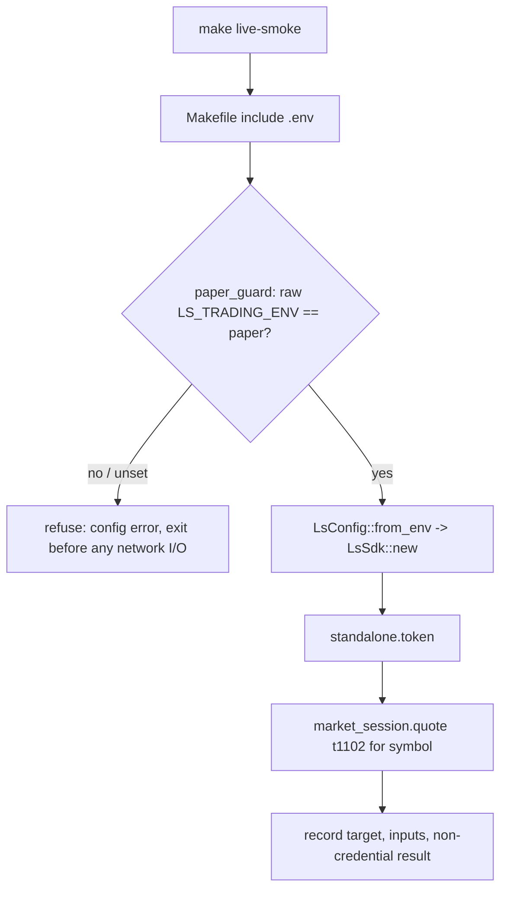
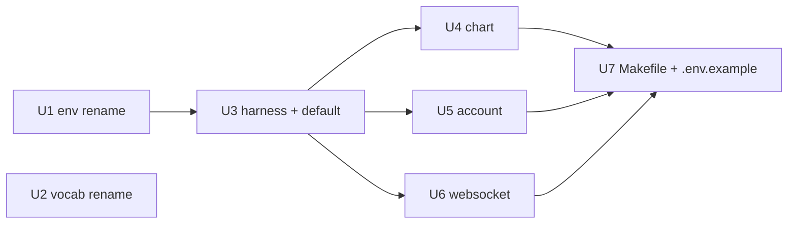

# feat: Paper Live Smoke harness + two-environment rename

## Summary

Build a credential-gated **Paper Live Smoke** over the existing SDK slice: a default `make live-smoke` (paper-only guard → OAuth token → one `t1102` quote) plus opt-in `live-smoke-chart`, `live-smoke-account`, and `live-smoke-ws` targets, implemented as `#[ignore]` integration tests wrapped by a new Makefile that loads `.env`. First, collapse the SDK to two environments — `Paper` (default) and `Real` — removing every alias, since the harness's prod guard depends on the renamed `Environment::Paper`.

---

## Problem Frame

The maintained SDK already implements the slice (`token`/`revoke`, `t1102`, `t8412`, `CSPAQ12200`, `S3_`), but nothing proves that slice still reaches the live LS gateway with real credentials. Two hazards shape the harness (see origin: `docs/brainstorms/2026-06-15-paper-live-smoke-requirements.md`): LS serves paper and real REST traffic from one host (`https://openapi.ls-sec.co.kr:8080`), so environment is a credential-and-enum fact with no server-side signal; and `t8412` is date-sensitive (empty date → gateway error `01715` on a non-trading day). The harness must make both hazards explicit rather than letting a green run hide them.

The current `Environment` enum carries dual naming — variant `Simulation` displays as `"paper"`, and `FromStr` accepts `paper`/`simulation`/`sim` for one concept and `production`/`prod`/`real` for the other. That duality is exactly the confusion the rename removes, and the prod guard (R4) needs the canonical `Environment::Paper` to assert against.

---

## Requirements Traceability

Origin requirements carried into this plan, mapped to units:

| Requirement | Unit |
|---|---|
| R1–R3 (two variants, `LS_TRADING_ENV` paper/real only, symmetric `Display`) | U1 |
| R5 (`LS_PROD_*` → `LS_REAL_*`) | U1 |
| R17 (vocabulary rename) | U2 |
| R4 (hard-refuse unless Paper), R6 (default smoke), R12/R13 (config, dotenv-free SDK) | U3 |
| R7, R14, R15, R16 (chart target + date safety) | U4 |
| R8 (account, isolated failure) | U5 |
| R9 (WebSocket lifecycle) | U6 |
| R10 (no order behavior), R11 (`.env`), R18 (evidence recording) | U7 |

Acceptance Examples AE1–AE7 from origin are enforced via the test scenarios noted per unit.

---

## Key Technical Decisions

- **The rename is a single breaking unit, sequenced first.** The `Environment::Simulation` *identifier* appears in 5 files (`ls-core` config/auth/inner, `ls-sdk-test-support` mock_http, `ls-sdk` realtime); two more (`ls-core` error.rs/config_resolve.rs) carry "Simulation" only in doc comments. Splitting the rename across units would leave the workspace uncompilable between commits, so U1 lands the whole rename — code variants and surviving prose — atomically; every harness unit depends on it.

- **The prod guard is a pre-flight assertion on the raw env var.** Because LS exposes no server-side paper/real signal (origin Sources: `korea-broker-sdk-ls/docs/ENVIRONMENT_VERIFICATION_RESEARCH.md`), the guard requires `LS_TRADING_ENV` to be set *explicitly* to `paper` and refuses otherwise. It must not lean on `from_env`'s default-to-paper — an unset or misspelled var (`LS_TRADIGN_ENV`, a Makefile that fails to export it) would otherwise resolve to Paper and pass the guard while loading whatever credentials are present. It runs before `LsSdk::new` and token acquisition; since `from_env` does pure env reads with no I/O, no network I/O is possible when the environment is wrong. The evidence record names which env var supplied each credential, so a legacy-fallback hit (`LS_APPKEY` standing in for `LS_PAPER_APPKEY`) is visible rather than silent.

- **Live smoke is a new `#[ignore]` integration-test module, not a binary.** The existing `crates/ls-sdk/tests/*.rs` are wiremock-mocked; the live tests reuse that test harness location but build a real `LsSdk` from `LsConfig::from_env()` with no `base_url` override, so dispatch hits the real gateway. `#[ignore]` keeps them out of the default `cargo test` run. The Makefile loads `.env` and invokes them explicitly.

- **Date validation is offline format + weekday + a not-in-future bound.** Pre-network validation parses the `YYYYMMDD` literal with `chrono::NaiveDate` (a date literal's weekday is timezone-independent — no tz database needed) and rejects non-weekdays. It also rejects any date later than "today in KST", computed with `FixedOffset::east_opt(9 * 3600)` — Korea observes no DST, so a fixed +9 offset is exact, and the base `chrono` dependency has no IANA tz database (`chrono-tz` is deliberately not added). Holiday correctness remains the gateway's verdict (`01715`); no KRX calendar is shipped. No in-slice TR can supply a trading day — `t1102OutBlock` carries no date field — so auto-derivation stays out of scope. (Resolves the origin's deferred KST-pinning question.)

- **Chart smoke fetches one page via `chart_page`, not `chart_all`.** `paginated().chart_page(&req)` issues a single `t8412` request; `chart_all` (the `collect_all` path) is explicitly excluded by R7.

- **Default symbol resolves to `005930` (Samsung Electronics).** A liquid KOSPI symbol used in the origin's `.env` example; `LS_LIVE_SMOKE_SHCODE` overrides it. The chart date keeps no baked-in default.

---

## High-Level Technical Design

Default `live-smoke` control flow — the guard precedes all network I/O:

Unit dependency order:

---

## Implementation Units

### U1. Collapse `Environment` to Paper/Real, remove aliases, rename credential prefix

**Goal:** Two environment variants only — `Paper` (default) and `Real` — with `LS_TRADING_ENV` accepting exactly `paper`/`real`, symmetric `Display`, and the Real credential prefix renamed `LS_PROD_*` → `LS_REAL_*`. Breaking change to `ls-core`'s public API.

**Requirements:** R1, R2, R3, R5.

**Dependencies:** none. Sequenced first; independently shippable.

**Files:**
- `crates/ls-core/src/config.rs` — rename variant `Simulation` → `Paper`; `FromStr` accepts only `paper`/`real` (error on all else, updated message); `Display` renders `paper`/`real`; `from_env` reads `LS_REAL_*` for Real; update module docs and the env-var fallback comments; update unit tests (`environment_from_str_aliases`, `from_env_*`, `save_ls_env` var list).
- `crates/ls-core/src/auth.rs`, `crates/ls-core/src/inner.rs` — update `Environment::Simulation` variant references in code.
- `crates/ls-core/src/config_resolve.rs`, `crates/ls-core/src/error.rs` — **doc-comment strings only** ("Real / Simulation", the `01900` "LS Simulation" note); update the prose so no "Simulation" survives, but no enum-variant change here.
- `crates/ls-sdk-test-support/src/mock_http.rs` — `mock_config` builds `Environment::Paper`.
- `crates/ls-sdk/src/realtime/mod.rs` — `Environment::Simulation` reference (WS URL resolution comment/test).

**Approach:** `is_paper()`, `paper()`, and the `"paper"` display string already exist and stay. The change is the variant identifier, the `FromStr` alias set (drop `simulation`/`sim`/`production`/`prod`), the `Real` display string (`"production"` → `"real"`), and the `from_env` credential var names. Keep the legacy unprefixed `LS_APPKEY`/`LS_SECRET`/`LS_ACCOUNT` fallback. Real-side accepts only `real` now (production aliases removed) — this is intentional asymmetry-removal, both sides collapse to one token each.

**Patterns to follow:** existing `FromStr`/`Display` impls and the env-snapshot test helpers (`save_ls_env`/`restore_ls_env`) in `crates/ls-core/src/config.rs`.

**Test scenarios:**
- `"paper"` and `"real"` parse to the two variants; mixed-case (`"Paper"`, `"REAL"`) parse identically.
- `"simulation"`, `"sim"`, `"production"`, `"prod"` each return `LsError::Config` with the updated "Expected one of: paper, real" message.
- `LS_TRADING_ENV` unset → `from_env` resolves `Paper`.
- `from_env` with `LS_TRADING_ENV=real` reads `LS_REAL_APPKEY`/`LS_REAL_SECRET`/`LS_REAL_ACCOUNT`; legacy `LS_APPKEY` fallback still resolves when the prefixed var is absent.
- `Display` renders `paper` and `real`.
- Existing credential-redaction tests still pass unchanged.

**Verification:** `cargo build` and `cargo test` green across the workspace; `git grep -i simulation` returns nothing across code and module docs (the sweep covers prose in `inner.rs`/`error.rs`/`config_resolve.rs`, not just the variant), and no `"production"`/`"prod"`/`"sim"` aliases survive in `FromStr`/`Display`.

---

### U2. Rename the vocabulary entry: Simulation Live Smoke → Paper Live Smoke

**Goal:** `CONTEXT.md` names the concept "Paper Live Smoke"; "Simulation" moves to the avoid list. Maintained repo only — the frozen `korea-broker-sdk-ls` Migration Source is untouched.

**Requirements:** R17.

**Dependencies:** none. **Commit separately** so the vocabulary change is isolated from the U1 code rename. If `CONTEXT.md` has unrelated uncommitted edits in the working tree, land or stash them first so this edit lands as a clean, discrete change.

**Files:**
- `CONTEXT.md` — rename the **Simulation Live Smoke** term and its relationship lines to **Paper Live Smoke**; update the `_Avoid_` list to include `simulation`; reword the definition to reference Paper credentials.

**Approach:** Vocabulary-only edit; no code. Preserve the existing entry format and the "is a Credentialed Live Smoke" relationship.

**Test scenarios:** Test expectation: none — documentation vocabulary change, no behavioral code.

**Verification:** `CONTEXT.md` has no remaining "Simulation Live Smoke" heading; the concept reads "Paper Live Smoke" and the change is a self-contained commit separate from prior working-tree edits.

---

### U3. Live-smoke harness foundation + default `live-smoke` target

**Goal:** A new `#[ignore]` integration-test module with a paper-only pre-flight guard, then the default smoke: token acquisition + one `t1102` quote. Symbol resolution and an evidence-recording helper (target / inputs / result) are shared by later targets.

**Requirements:** R4, R6, R12 (symbol override + default), R13 (SDK stays dotenv-free).

**Dependencies:** U1.

**Files:**
- `crates/ls-sdk/tests/live_smoke.rs` (new) — `#[ignore]`-marked `#[tokio::test]` cases; shared helpers `resolve_symbol()` (reads `LS_LIVE_SMOKE_SHCODE`, defaults `005930`), `paper_guard(&LsConfig)` (returns `Err` unless `environment.is_paper()`), and `record(target, inputs, result)` printing a structured evidence line to stdout.
- `crates/ls-sdk/Cargo.toml` — no new dependency expected (`tokio`, `ls-sdk-test-support` already dev-deps); confirm during implementation.

**Approach:** `paper_guard` reads the raw `LS_TRADING_ENV` and returns `Err(LsError::Config)` unless it is explicitly `paper` (unset is a failure, not a default). It runs before `LsConfig::from_env()` → `LsSdk::new(config)` — note `LsSdk::new` returns `LsResult<Self>` — so a non-Paper or unset environment fails before client construction or any network call. With no `base_url` override, dispatch reaches the live gateway. The default smoke calls `sdk.standalone().token().await`, then `sdk.market_session().quote(&T1102Request::new(symbol, "K")).await`, asserting both succeed; treat missing credentials as an explicit test failure (`panic!`/propagated `Err`), never a silent skip. `record()`'s `inputs` field MUST carry only non-credential values (symbol, date, environment, which env var supplied each credential); its `result` MUST carry only parsed response fields or error codes — never the raw OAuth token, appkey, secret, or account number. Record a non-forgeable liveness signal (e.g. token length from a real round-trip) so a green run proves transport. The SDK itself reads only ordinary env vars — dotenv loading is never added to `ls-core`.

**Patterns to follow:** `sdk_for`/fixture structure in `crates/ls-sdk/tests/market_session_tests.rs`, but with a real config instead of `mock_config`.

**Test scenarios:**
- Covers AE2. Default smoke: with Paper creds present and `LS_TRADING_ENV=paper`, token acquisition succeeds and one `t1102` quote for the resolved symbol returns a parsed response with a non-empty token (liveness proof).
- Covers AE1. Guard: with `LS_TRADING_ENV=real`, the guard returns `LsError::Config` before `LsSdk::new` — no token request is issued.
- Guard: with `LS_TRADING_ENV` unset or misspelled, the guard also fails before network I/O (no silent default-to-paper).
- Missing credentials surface as an explicit test failure, distinct from a guard refusal.
- `resolve_symbol()` returns `005930` when `LS_LIVE_SMOKE_SHCODE` is unset and the override value when set.

**Verification:** `cargo test -p ls-sdk --test live_smoke -- --ignored` runs the default smoke against the gateway with real Paper creds and passes; the same target with `LS_TRADING_ENV=real` aborts before network I/O.

---

### U4. Chart smoke target + offline date validation

**Goal:** `live-smoke-chart` validates `LS_LIVE_SMOKE_T8412_DATE` offline (format + KST weekday) before any network I/O, then fetches one `t8412` page for the symbol and date.

**Requirements:** R7, R14, R15, R16.

**Dependencies:** U3.

**Files:**
- `crates/ls-sdk/tests/live_smoke.rs` — add `validate_t8412_date(&str) -> Result<…>` (YYYYMMDD shape + `Asia/Seoul` weekday via chrono) and the chart smoke test.

**Approach:** `paper_guard(&config)` runs first (identical to the default smoke), then date validation: parse the `YYYYMMDD` literal with `NaiveDate`, reject non-weekdays, and reject any date after "today in KST" (`FixedOffset::east_opt(9 * 3600)`). All of this returns an error with no SDK construction. A well-formed past weekday that is a holiday passes offline validation and is sent to the gateway; the gateway's `01715` rejection is surfaced as a chart failure distinct from an offline-validation failure. Fetch one page via `sdk.paginated().chart_page(&req)` — never `chart_all`.

**Patterns to follow:** the date-field handling documented in `crates/ls-sdk/src/paginated/mod.rs` (sdate/edate/cts_date semantics).

**Test scenarios:**
- Covers AE3. Missing `LS_LIVE_SMOKE_T8412_DATE` → fail before network with a message naming the missing date.
- Covers AE4. A non-`YYYYMMDD` value and a Saturday date each fail offline before network.
- A future-dated weekday (after today in KST) fails offline before network.
- Covers AE5. A well-formed past weekday holiday passes offline validation, reaches the gateway, and the gateway rejection is reported as a chart failure.
- Guard: with `LS_TRADING_ENV=real`, the chart target aborts before network I/O.
- Happy path: a real recent trading day returns one `t8412` page for the symbol.

**Verification:** `make live-smoke-chart LS_LIVE_SMOKE_T8412_DATE=<trading-day>` fetches one page and passes; omitting the date fails before any network call.

---

### U5. Account smoke target

**Goal:** `live-smoke-account` runs `CSPAQ12200` as a read-only account-state inquiry, reporting account-state failures separately from market-data failures.

**Requirements:** R8.

**Dependencies:** U3.

**Files:**
- `crates/ls-sdk/tests/live_smoke.rs` — add the account smoke test.

**Approach:** `paper_guard(&config)` runs first (identical to the default smoke). Call `sdk.account().balance(&CSPAQ12200Request::new(...))`; the account number comes from config, not the caller. Distinguish an account-state error in the result/output so a failure here is not conflated with transport correctness — record it under a separate evidence target label.

**Patterns to follow:** `crates/ls-sdk/tests/account_tests.rs` for request construction and the `CSPAQ12200` block shapes.

**Test scenarios:**
- Covers AE7. A `CSPAQ12200` account-state error is reported as an account-state failure, labeled distinctly from market-data smoke results.
- Guard: with `LS_TRADING_ENV=real`, the account target aborts before network I/O.
- Happy path: a provisioned Paper account returns a parsed balance/orderable-amount response.

**Verification:** `make live-smoke-account` runs the read-only inquiry; an account-setup failure is reported as account-state, not transport.

---

### U6. WebSocket smoke target

**Goal:** `live-smoke-ws` connects to the Paper WebSocket URL, subscribes to `S3_` for the symbol, and unsubscribes cleanly. The connect/subscribe/unsubscribe lifecycle is the blocking assertion; receiving a row is extra evidence, and its absence within the timeout is not a failure. Timeboxed.

**Requirements:** R9.

**Dependencies:** U3.

**Files:**
- `crates/ls-sdk/tests/live_smoke.rs` — add the WebSocket smoke test.

**Approach:** `paper_guard(&config)` runs first (identical to the default smoke). Use `realtime()` (which returns `Arc<WsManager>`) → `subscribe_typed::<S3Trade>("S3_", &symbol).await`, which returns `(SubscriptionHandle, WsStream<S3Trade>)`; wait for a row on the stream under a bounded timeout, then `handle.unsubscribe().await` (RAII drop is the fallback). The plain `subscribe()` yields no stream, so it cannot satisfy the row-observation step — use `subscribe_typed`. Record whether a row arrived without failing on its absence. The pass condition is clean connect → subscribe → unsubscribe AND that the resolved `ws_url` contains the Paper port `29443` — asserting the port turns a silent wrong-target run (REST is single-host, but WS ports differ by environment) into a failure.

**Patterns to follow:** `crates/ls-sdk/tests/realtime_tests.rs` and the mock-WS lifecycle in `ls-sdk-test-support`, adapted to a real connection.

**Test scenarios:**
- Covers AE6. Connect → subscribe → unsubscribe succeeds and no row arrives within the timeout → target passes, recording "no row received."
- Pass condition asserts the resolved `ws_url` contains `29443` (Paper port).
- Guard: with `LS_TRADING_ENV=real`, the target aborts before connecting.
- Lifecycle: `subscribe_typed` registers before send and `unsubscribe` tears down cleanly (no leaked subscription).
- Extra evidence: when a live `S3Trade` row arrives within the timeout, it is recorded.

**Verification:** `make live-smoke-ws` completes the lifecycle within the timebox and passes whether or not a row is received.

---

### U7. Makefile, `.env.example`, and evidence/scope guardrails

**Goal:** A repo-level Makefile exposing the four targets (loading the gitignored `.env`), an `.env.example` showing the credential-only shape, and the evidence-recording convention. No target exercises order behavior.

**Requirements:** R10, R11, R18.

**Dependencies:** U3, U4, U5, U6.

**Files:**
- `Makefile` (new) — targets `live-smoke`, `live-smoke-chart`, `live-smoke-account`, `live-smoke-ws`. Load `.env` via GNU make's `include .env` directive (not `source`/`export $(shell cat .env …)`, which would write credentials into the subprocess environment and `/proc/<pid>/environ`). Invoke the matching `#[ignore]` test by exact name with `-- --ignored`, and fail the target if `cargo test` reports `0 passed` — a filter typo that runs zero tests must not read as green.
- `.env.example` (new) — `LS_TRADING_ENV=paper`, `LS_PAPER_APPKEY`, `LS_PAPER_SECRET`, `LS_PAPER_ACCOUNT`; commented optional `LS_LIVE_SMOKE_SHCODE` / `LS_LIVE_SMOKE_T8412_DATE`; a commented `LS_REAL_*` block under `# Real environment (opt-in)` so the renamed vars are self-documenting; and two warning comments — (a) bare `LS_APPKEY`/`LS_SECRET`/`LS_ACCOUNT` are legacy fallback vars that Paper runs pick up when `LS_PAPER_*` is unset, and (b) do not place `LS_REAL_*` credentials in the same `.env` used by Paper runs.
- `.gitignore` — `.env` is already ignored (line 3); confirm only.

**Approach:** Make targets load `.env` for convenience; the SDK never gains dotenv behavior (the loading lives only in the Makefile recipe). `live-smoke-chart` requires `LS_LIVE_SMOKE_T8412_DATE` on the command line. Each target records target/inputs/result so a green run is not silently treated as Focused Evidence (R18). No order-capable target exists (R10).

**Patterns to follow:** none in-repo (first Makefile); keep recipes minimal and POSIX-portable.

**Test scenarios:** Test expectation: none — build glue and templates; behavior is covered by U3–U6's smoke tests. Manual verification only.

**Verification:** `make live-smoke` runs the default smoke with `.env` loaded and fails if zero tests run; `make live-smoke-chart` without a date fails before network; `.env.example` carries the legacy-fallback and `LS_REAL_*` warnings; `git grep` finds no dotenv usage in `crates/` and no shell-export of `.env` in the `Makefile`.

---

## Scope Boundaries

**In scope:** the two-environment rename, the four smoke targets, the Makefile/`.env.example` glue, and offline date validation.

**Out of scope (from origin):**
- Production (Real) live smoke; any order-capable behavior; new TR implementation.
- `ls-trackers` and change-driven evidence invalidation.
- A shipped/maintained KRX trading-day calendar — holiday correctness stays the gateway's job.
- Auto-deriving the chart date from a daily-chart TR (`t8410`/`t8413`/`t8451`) — that source is unimplemented; adding it is new TR work.
- Treating smoke success as automatic Focused Evidence.
- The frozen `korea-broker-sdk-ls` Migration Source — no edits there.

### Deferred to Follow-Up Work
- A `live-smoke` evidence log persisted to disk (beyond stdout recording) if Focused Evidence promotion needs it later.
- A reusable `ls-core` paper-only guard (e.g. `LsConfig::ensure_paper()`) so future live callers inherit the gate instead of re-implementing the harness-level check. Held out of this slice per the brainstorm's "no SDK runtime change" decision; revisit when a second live caller appears.

---

## Assumptions & Dependencies

- The five slice TRs are implemented and reachable; the smoke verifies live transport, not new behavior.
- **Operator discipline (unenforceable):** the paper guard cannot catch a *credential* mismatch where Real keys sit in `LS_PAPER_*` or in the legacy `LS_APPKEY`/`LS_SECRET`/`LS_ACCOUNT` fallback — no server-side signal exists. The guard requires explicit `LS_TRADING_ENV=paper` and the evidence record names which var supplied each credential, but correct credential provenance stays an operator responsibility. Documented, not enforced.
- A real Paper account is provisioned for `CSPAQ12200`; account-state failures may reflect provisioning, which is why U5 isolates them.
- `chrono` (workspace dependency, no tz features) supplies `NaiveDate` for weekday checks and `FixedOffset` for the KST "today" bound; `chrono-tz` is intentionally not added (Korea has no DST, so a fixed +9 offset is exact).

---

## Open Questions

**Deferred to implementation:**
- The exact `t8412` request field set for a one-page fetch (sdate/edate/cts_date pinning) — resolve against `crates/ls-sdk/src/paginated/mod.rs` when wiring U4.
- Whether `t1102`'s `exchgubun` should vary by symbol/market or stay `"K"` for the default KOSPI symbol — default `"K"`, revisit only if the quote rejects.
- The WebSocket row-wait timeout value for U6 — pick a small bounded value (a few seconds) during implementation.

---

## Sources & Research

- `docs/brainstorms/2026-06-15-paper-live-smoke-requirements.md` — origin requirements (R1–R18, AE1–AE7).
- `crates/ls-core/src/config.rs` — current `Environment` model, `FromStr` aliases, `Display`, `from_env` (U1 targets).
- `crates/ls-sdk/src/{market_session,paginated,account,realtime,standalone}/mod.rs` — public entry points the smoke calls.
- `crates/ls-sdk/tests/market_session_tests.rs` — integration-test pattern the live module adapts (real config instead of `mock_config`).
- `korea-broker-sdk-ls/docs/ENVIRONMENT_VERIFICATION_RESEARCH.md` — Phase 46 finding: no server-side paper/real signal.
- `korea-broker-sdk-ls/docs/TR_DEPENDENCY_GUIDE.md` — `01715` trading-day sensitivity; `t1102` carries no date field.
