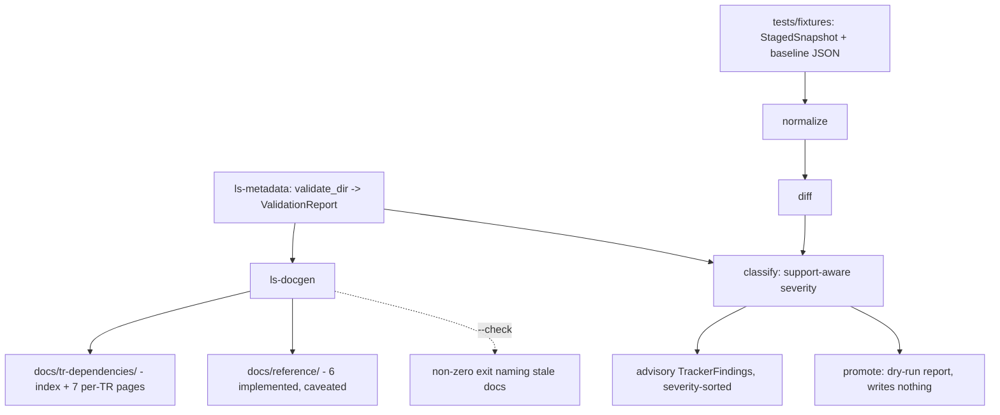
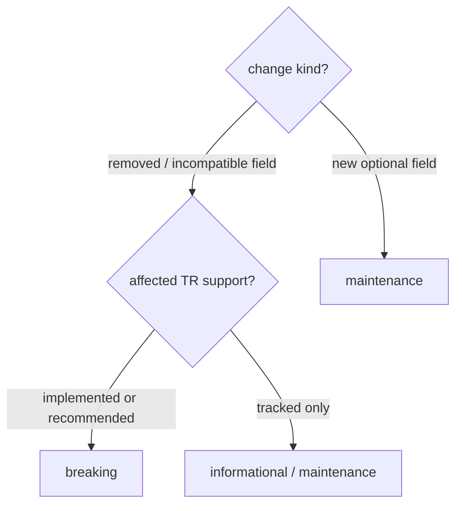

# feat: Metadata-driven docs generation + staged-snapshot tracker skeleton

## Summary

Add two metadata-driven tools for migration steps 10–11. A new `ls-docgen` crate
generates TR Dependency Docs (all seven tracked TRs) and a minimal SDK Reference
Docs stub (six implemented TRs) from `ls-metadata`, byte-deterministically, with
a `--check` drift mode. A new `ls-trackers` crate lands a walking-skeleton change
tracker: five pipeline stages with real normalize/diff/classify over checked-in
fixtures producing advisory, support-aware findings — fetch stubbed, promote a
write-nothing dry-run.

---

## Problem Frame

Steps 1–9 are done: the slice ships seven tracked TRs (six implemented) across
`ls-core` / `ls-sdk` / `ls-metadata`. Maintenance facts — owner class,
prerequisites, support state — live only in `metadata/trs/*.yaml` and
`CONTEXT.md`, so a maintainer reads YAML and code to learn what a TR needs and
whether it is safe to lean on. There is no readable projection of metadata, and
nothing watches upstream LS for change. Step 10 closes the projection gap; step
11 proves the support-aware classification logic over fixtures, leaving real
upstream watching for a later round.

---

## Requirements

Carried from the origin (`see origin`) and traced to units below.

### Docs generation (step 10)

- R1. A re-runnable generator produces TR Dependency Docs for all seven tracked TRs from `ls-metadata`, not from raw upstream docs or tracker output. (U1, U2)
- R2. Each TR Dependency Doc renders owner class, support state, facets, dependency fields (self-continuation and strong-order), and venue/session constraints. (U2)
- R3. SDK Reference Docs cover the six implemented TRs only; `CSPAT00601` (tracked-not-implemented) is excluded from Reference but present in Dependency Docs. (U3)
- R4. Each SDK Reference entry carries an "implemented, not yet recommended" banner whenever the TR's metadata has `recommended: false`. (U3)
- R5. The generator is deterministic: identical metadata yields byte-identical output across runs and platforms. (U2, U4)
- R6. A `--check` mode compares generated output against committed docs and exits non-zero on drift; default mode writes. (U1, U4)
- R7. Output lives under `docs/tr-dependencies/` and `docs/reference/`. (U2, U3)

### Tracker skeleton (step 11)

- R8. The tracker defines all five pipeline stages as explicit boundaries: fetch, normalize, diff, classify, promote. (U5)
- R9. The tracker defines core types: Staged Snapshot, normalized artifact, Tracker Finding, Support-Aware Severity. (U5)
- R10. normalize, diff, and classify run for real against checked-in fixtures and are unit-tested. (U6, U7)
- R11. classify assigns Support-Aware Severity from each affected TR's support state, following the severity ladder; an implemented/recommended TR ranks higher than a tracked-only TR for the same change. (U7)
- R12. fetch is stubbed — snapshots are placed manually, not retrieved over the network. (U5)
- R13. promote is a dry-run that writes nothing but enumerates which baseline files, metadata fields, and generated docs a real promote would touch. (U7)
- R14. The API Drift Tracker is the one concrete worked example; the Specification Document Tracker exists only as the shared stage and type contract. (U5, U6)
- R15. Findings are advisory output only; nothing auto-converts a finding into an SDK Maintenance Work Item. (U7)

---

## Key Technical Decisions

- **Two new crates, each a direct `ls-metadata` consumer; no shared projection layer.** `ls-docgen` (new) and `ls-trackers` (named in ADR 0011). Both depend on `ls-metadata` by path and read it independently — the origin rejects a shared projection abstraction for two consumers (`see origin`).
- **Consume `ls_metadata::validate_dir` and its types; never re-parse YAML.** Per ADR 0012 the Rust types are the schema authority. Both crates call `validate_dir(metadata_root) -> ValidationReport { index, trs: BTreeMap<String, TrMetadata> }` as a precondition.
- **Build markdown by hand with `format!`; no templating crate.** Two static doc shapes do not justify a template engine, and plain string building keeps byte-determinism (R5) directly controllable. No new runtime dependency beyond the `ls-metadata` path dep.
- **Determinism is structural, then guarded.** `ls-metadata` collections are `BTreeMap` (sorted) — iteration order is stable for free. The generator emits no wall-clock or run timestamp and renders `last_reviewed` / `source_spec_hash` verbatim as stored. A golden re-generation test asserts byte-identical output so the `--check` gate cannot flap.
- **Library-first split mirroring `planner.rs`.** Low-level `render_*` / `normalize` / `diff` / `classify` functions take `&BTreeMap<String, TrMetadata>` (or fixture structs) so unit tests drive from inline fixtures; high-level entry points take `&ValidationReport`. `main.rs` is a thin shell.
- **Hand-rolled CLI arg parsing (default write vs `--check`); no `clap`.** These are the repo's first binaries; a two-mode match fits the existing zero-extra-dep ethos.
- **Tracker types use `CONTEXT.md` vocabulary; `Severity` enumerates all five tiers but fixtures exercise three.** `StagedSnapshot`, normalized-artifact type, `TrackerFinding`, and a `Severity` enum (`critical`, `breaking`, `maintenance`, `evidence`, `informational`) deriving `Ord` so findings sort by severity. Fixtures this round reach only `breaking` / `maintenance` / `informational`; `critical` and `evidence` are defined-but-unreachable (no recommended TR, invalidation inactive). Avoid retired vocabulary per ADR 0006.
- **Tracker fixtures as `tests/fixtures/*.json` via `include_str!`.** Matches the existing `crates/ls-sdk/tests/fixtures/` precedent. Staged Snapshot and baseline fixtures live under `crates/ls-trackers/tests/`; promote writes nothing.
- **TR Dependency Docs granularity: an index page plus one page per TR.** Chosen over grouping pages by dependency class for scannability; the index carries the routing table.

---

## High-Level Technical Design

Source-of-truth fan-out and the two tool pipelines:



classify decision logic (R11, exercised tiers):



`critical` and `evidence` tiers exist in the `Severity` enum but no fixture
reaches them this round.

---

## Output Structure

```text
crates/
  ls-docgen/
    Cargo.toml
    src/
      lib.rs              # render_dependency_docs / render_reference_docs / check
      main.rs             # thin CLI shell: default write vs --check
    tests/
      determinism.rs      # golden byte-identical re-generation
  ls-trackers/
    Cargo.toml
    src/
      lib.rs              # re-exports
      types.rs            # StagedSnapshot, NormalizedArtifact, TrackerFinding, Severity
      stages.rs           # fetch (stub) / normalize / diff / classify / promote
      api_drift.rs        # API Drift Tracker worked example
    tests/
      fixtures/           # *.json staged snapshots + baselines
      classify.rs         # AE2 severity + dry-run promote
docs/
  tr-dependencies/        # generated: index + per-TR pages
  reference/              # generated: 6 implemented TR stubs
```

The per-unit `**Files:**` sections are authoritative; the implementer may adjust
layout if implementation reveals a better shape.

---

## Implementation Units

### U1. Scaffold `ls-docgen` crate and CLI shell

- **Goal:** New workspace crate with a thin binary that selects write vs `--check` mode and delegates to library functions.
- **Requirements:** R1, R6
- **Dependencies:** none
- **Files:** `Cargo.toml` (add `crates/ls-docgen` to workspace members), `crates/ls-docgen/Cargo.toml`, `crates/ls-docgen/src/lib.rs`, `crates/ls-docgen/src/main.rs`
- **Approach:** Manifest uses `edition.workspace = true` etc. and `ls-metadata = { path = "../ls-metadata" }`. `main` parses args by hand (`--check` → Check, no flag → Write, unknown → error to stderr + non-zero), resolves the metadata root as a `CARGO_MANIFEST_DIR`-relative path (`../../metadata`, matching the `crates/ls-core/tests/policy_index_crosscheck.rs` precedent rather than cwd), calls `ls_metadata::validate_dir`, and dispatches to library entry points. Stub those entry points in this unit to return an empty value (`BTreeMap::new()`) — not `todo!()` — so the crate compiles and the binary runs without panicking; U2–U4 fill the bodies. Open with a `//!` module doc stating the metadata-is-source-of-truth thesis.
- **Patterns to follow:** `crates/ls-metadata/src/lib.rs` re-export shape; `planner.rs` library-first structure and located-error/`Display` conventions.
- **Test scenarios:**
  - Arg parsing: no args resolves to Write mode; `--check` resolves to Check mode; an unrecognized flag returns an error and non-zero intent.
  - `Test expectation: scaffolding` — rendering logic lands in U2–U4; this unit only proves mode selection and crate wiring compile and run.
- **Verification:** `cargo build -p ls-docgen` succeeds; running the binary resolves metadata and exits cleanly in both modes (entry points return `BTreeMap::new()` until U2, so it compiles and does not panic).

### U2. TR Dependency Docs renderer (all seven tracked TRs)

- **Goal:** Deterministic markdown for an index page plus one page per tracked TR, written under `docs/tr-dependencies/`.
- **Requirements:** R1, R2, R5, R7
- **Dependencies:** U1
- **Files:** `crates/ls-docgen/src/lib.rs`, `docs/tr-dependencies/` (generated output committed)
- **Approach:** A low-level `render_dependency_docs(&BTreeMap<String, TrMetadata>, &TrIndex) -> BTreeMap<PathBuf, String>` returns the full file set so tests assert content without touching disk; a high-level wrapper takes `&ValidationReport` and writes. Each per-TR page renders owner class, support state (tracked/implemented/recommended), all facets, dependency fields (self-continuation, strong-order), and venue/session. The index renders the routing table. Build strings with `format!`; emit no timestamps; render `last_reviewed` / `source_spec_hash` verbatim.
- **Patterns to follow:** `planner.rs` `plan_with_metadata` vs `plan_changes` split (low-level fn on raw map, high-level on report).
- **Test scenarios:**
  - Happy: rendering `t8412` (implemented, paginated) includes its owner class, support flags, facets, `self_continuation_fields`, and venue/session.
  - Coverage: all seven tracked TRs produce a page, and the index lists all seven.
  - Edge: a TR with empty dependency fields (`token`) renders without dangling sections.
  - Determinism: rendering the same metadata twice yields byte-identical output.
- **Verification:** generated `docs/tr-dependencies/` matches the rendered set; the determinism test passes.

### U3. SDK Reference Docs renderer (six implemented TRs, caveated)

- **Goal:** Minimal Reference stub for implemented TRs only, each carrying the "implemented, not yet recommended" banner; the order TR is excluded.
- **Requirements:** R3, R4, R7
- **Dependencies:** U2
- **Files:** `crates/ls-docgen/src/lib.rs`, `docs/reference/` (generated output committed)
- **Approach:** `render_reference_docs` filters to `support.implemented == true`, so `CSPAT00601` is excluded. Each entry renders the banner when `support.recommended == false`. Reference pages are intentionally thin (name, owner class, support caveat) — request/response schemas and verified examples are deferred.
- **Patterns to follow:** same low-level/high-level split as U2.
- **Test scenarios:**
  - Covers AE3: the six implemented TRs each appear with the banner; `CSPAT00601` is absent from Reference; Dependency Docs still include all seven.
  - R4 conditional: an inline fixture TR with `recommended: true` drops the banner — proves the banner is keyed on the flag even though no real recommended TR exists yet.
- **Verification:** generated `docs/reference/` contains exactly the six implemented TRs with banners.

### U4. `--check` drift mode, determinism guard, and Makefile targets

- **Goal:** Wire `--check` to compare generated output against committed files and fail naming drift; back it with a golden test and convenience targets.
- **Requirements:** R5, R6
- **Dependencies:** U2, U3
- **Files:** `crates/ls-docgen/src/lib.rs`, `crates/ls-docgen/src/main.rs`, `crates/ls-docgen/tests/determinism.rs`, `Makefile`
- **Approach:** Check mode renders the in-memory file set and compares each path against the committed file; on any mismatch it collects the drifted paths and exits non-zero, naming each (located-error convention). Add `make docs` (write) and `make docs-check` (check); these need no credentials, so no `.env` sourcing. Note for the future: any target that later loads `.env` must source it in the recipe shell, never via make `include` (`see` docs/solutions/integration-issues/makefile-include-env-quotes-gateway-403.md).
- **Patterns to follow:** `crates/ls-core/tests/policy_index_crosscheck.rs` (cross-check / drift-gate test reading real metadata).
- **Test scenarios:**
  - Covers AE1: drive the low-level `render_*(&BTreeMap, &TrIndex)` path with an inline-mutated metadata map (a changed `owner_class`) to produce drifted docs, then run check against the committed docs and assert non-zero exit naming the stale doc(s). Drive the low-level path, not `validate_dir` on the real `metadata/` dir — a per-TR `owner_class` mutation there trips the validator's routing cross-check (`RoutingMismatch`) before any doc renders, which would assert the wrong failure.
  - Check passes (zero exit) when committed docs match the metadata.
  - Golden: re-generating into a temp dir yields byte-identical content to the committed docs.
- **Verification:** `make docs-check` is green on committed output; the AE1 drift test fails check as expected.

### U5. Scaffold `ls-trackers` crate: core types and five stage boundaries

- **Goal:** New crate defining the Staged Snapshot / normalized-artifact / Tracker Finding / Severity types and explicit fetch/normalize/diff/classify/promote boundaries, with fetch stubbed.
- **Requirements:** R8, R9, R12, R14
- **Dependencies:** none (parallel to U1)
- **Files:** `Cargo.toml` (add `crates/ls-trackers` to members), `crates/ls-trackers/Cargo.toml`, `crates/ls-trackers/src/lib.rs`, `crates/ls-trackers/src/types.rs`, `crates/ls-trackers/src/stages.rs`, `crates/ls-trackers/src/api_drift.rs`
- **Approach:** Depends on `ls-metadata` (path) and `serde`/`serde_json` (fixtures). `types.rs` defines: `StagedSnapshot` carrying an explicit `tr_code` field plus the captured payload (the LS response payloads are keyed by block names like `CSPAQ12200OutBlock1` and contain no TR code, so `tr_code` must be an explicit snapshot field, not derived from block-name prefixes); a `NormalizedArtifact` (the snapshot reduced to a canonical, sorted set of field paths); a `Change` enum (`FieldAdded` / `FieldRemoved` / `FieldChanged`, each carrying the field path and the `tr_code`); `TrackerFinding` (named TR + change + severity, `Display`); and `Severity` (five tiers, `#[serde(rename_all = "snake_case")]`, derive `Ord` so higher severity sorts first). `stages.rs` declares the five stage functions as the contract; `fetch` returns an explicit not-implemented marker (no network). `api_drift.rs` holds the worked example. The Specification Document Tracker is represented only by the shared types/stage signatures.
- **Patterns to follow:** `schema.rs` enum conventions (`Ord`, snake_case serde, closed sets); `CONTEXT.md` vocabulary for all public names; ADR 0006 retired-term avoidance.
- **Test scenarios:**
  - `Severity` ordering: the derived `Ord` ranks the tiers as defined (e.g., `breaking` outranks `informational`).
  - `fetch` stub returns its not-implemented marker rather than panicking.
  - `Test expectation: type/contract` — stage logic lands in U6–U7; this unit proves the types and boundaries compile and re-export cleanly.
- **Verification:** `cargo build -p ls-trackers` succeeds; public types are re-exported from `lib.rs`.

### U6. normalize + diff over fixtures (API Drift worked example)

- **Goal:** Real normalize and diff stages that turn a Staged Snapshot fixture into a canonical artifact and compare it against a baseline fixture, keyed to TR.
- **Requirements:** R10, R14
- **Dependencies:** U5
- **Files:** `crates/ls-trackers/src/stages.rs`, `crates/ls-trackers/src/api_drift.rs`, `crates/ls-trackers/tests/fixtures/`, `crates/ls-trackers/tests/classify.rs`
- **Approach:** `normalize(&StagedSnapshot) -> NormalizedArtifact` produces a stable canonical form — field paths sorted, no incidental ordering. `diff(&NormalizedArtifact, &NormalizedArtifact) -> Vec<Change>` reports field additions/removals/changes; each `Change` carries the `tr_code` propagated from the snapshot (the lookup key for U7's `classify`), since the payload itself has none. Checked-in fixtures: a baseline and a candidate snapshot for an API Drift scenario, each with an explicit `tr_code`, loaded via `include_str!`. (Open: whether reordering within payload arrays counts as a change — see Open Questions.)
- **Patterns to follow:** `crates/ls-sdk/tests/fixtures/*.json` + `include_str!`; the inline-fixture `#[cfg(test)]` style in `validator.rs`.
- **Test scenarios:**
  - normalize: a snapshot fixture produces a stable canonical artifact (idempotent — normalizing twice is identical).
  - diff happy: baseline → candidate with a removed response field reports that removal keyed to the right TR.
  - diff no-change: identical baseline and candidate produce an empty diff.
  - diff addition: a new optional field is reported as an addition.
- **Verification:** diff output over the fixtures matches expected change sets.

### U7. classify (support-aware severity), dry-run promote, advisory findings

- **Goal:** Map each diff change to a Support-Aware Severity using metadata support state; emit severity-sorted advisory findings; provide a write-nothing promote that reports intended touches.
- **Requirements:** R10, R11, R13, R15
- **Dependencies:** U6
- **Files:** `crates/ls-trackers/src/stages.rs`, `crates/ls-trackers/tests/classify.rs`
- **Approach:** `classify(&[Change], &BTreeMap<String, TrMetadata>) -> Vec<TrackerFinding>` looks up each changed TR's `support` and applies the ladder: removed/incompatible field on implemented/recommended → `breaking`; same on tracked-only → `informational`/`maintenance`; new optional field → `maintenance`. Findings sort by `Severity` (`Ord`). `promote(&[TrackerFinding]) -> PromoteReport` enumerates the baseline files, metadata fields, and generated docs a real promote would touch and writes nothing. Output is advisory; no path mutates SDK code or metadata.
- **Patterns to follow:** `planner.rs` `plan_with_metadata` (classify takes a raw `BTreeMap` so inline-fixture tests drive it directly).
- **Test scenarios:**
  - Covers AE2: a removed field on an implemented TR classifies as `breaking`; the same change on a tracked-only TR classifies as `informational`/`maintenance`; a new optional field classifies as `maintenance`.
  - Findings sort by severity (highest first).
  - promote dry-run returns a report enumerating intended touches and writes no files (assert the working tree is unchanged / no write call).
  - Advisory: classify produces findings only — no metadata or SDK mutation occurs.
- **Verification:** `cargo test -p ls-trackers` is green; AE2 assertions hold; promote writes nothing.

---

## Acceptance Examples

Carried from the origin and mapped to units.

- AE1. Docs drift detection — committed docs generated from current metadata; a TR's `owner_class` changes and `--check` runs without regenerating → non-zero exit naming the stale doc(s). (U4)
- AE2. Support-aware severity — a removed response field on an implemented TR classifies `breaking`; on a tracked-only TR, `informational`/`maintenance`. (U7)
- AE3. Reference excludes non-implemented TR — Reference contains the six implemented TRs each with the banner and omits `CSPAT00601`; Dependency Docs include all seven. (U3)

---

## Scope Boundaries

### Deferred for later (from origin)

- SDK Reference enrichment (real request/response schemas, verified examples) until a TR reaches `recommended` or a real consumer exists.
- Real upstream `fetch` over the network.
- `promote` mutation of baselines, metadata, or docs.
- The Specification Document Tracker as a concrete, running tracker.
- A shared metadata-projection layer between the generator and the tracker.

### Deferred to follow-up work (plan-local)

- Wiring `make docs-check` into a CI workflow — the repo has no CI configuration yet, so `--check` ships as a Makefile target this round.
- Reconciling the migration plan's step-11 "skeleton" wording with this round's real normalize/diff/classify logic (a deliberate walking-skeleton choice; `see origin` Deferred / Open Questions).

### Outside this round's identity (from origin)

- No new TR implementation or coverage expansion beyond the existing seven.
- No automatic promotion of a Tracker Finding into an SDK Maintenance Work Item.
- No change-driven evidence invalidation (remains inactive).

---

## Open Questions

- Should `normalize`/`diff` treat reordering within a payload array (e.g. an LS response's repeated `...OutBlock2` list) as a `Change`, or only additions/removals/value changes? Some LS list orderings are semantically meaningful; resolve when the first API Drift fixture is authored (U6).

---

## Risks & Dependencies

- **`serde_yaml` / collection ordering could make `--check` flap.** Mitigated structurally: `ls-metadata` exposes `BTreeMap`-ordered collections, the generator adds no timestamps, and the U4 golden test asserts byte-identical re-generation. If any rendered structure routes through `serde_yaml`, pin ordering deliberately.
- **The shared stage/type contract is validated only against the API Drift Tracker.** The Specification Document Tracker diffs free-text prose, whose normalized-artifact and diff shapes may not fit the same contract; revisit when that tracker is implemented (`see origin` Assumptions).
- **First binaries in the repo.** No existing `[[bin]]` or CLI pattern; the hand-rolled arg approach is new surface but minimal.
- **Dependency:** both crates depend on `ls-metadata`'s `validate_dir` and types remaining the schema authority (ADR 0012).

---

## Sources & Research

- `crates/ls-metadata/src/{lib.rs,schema.rs,validator.rs,planner.rs}` — the API both crates consume; `planner.rs` is the library-first / `Ord`-enum / located-error template to mirror.
- `crates/ls-metadata/tests/slice_metadata.rs`, `crates/ls-core/tests/policy_index_crosscheck.rs` — drift-gate / real-metadata test precedents (model for U4 and the tracker tests).
- `crates/ls-sdk/tests/fixtures/*.json` — `include_str!` fixture precedent for tracker snapshots/baselines.
- `docs/plans/maintained-sdk-migration-plan.md` (lines 120–148) — tracker pipeline stages and the Finding Severity ladder.
- `metadata/EVIDENCE-FRESHNESS.md`, `metadata/tr-index.yaml` — the inactive freshness controls; the tracker wires no freshness logic this round.
- `CONTEXT.md` — canonical vocabulary for all public type names.
- ADRs: `0011-ls-crate-layout.md` (names `ls-trackers`), `0012-rust-owned-metadata-schema-authority.md`, `0005-staged-snapshots-for-change-tracking.md`, `0009-rust-first-permanent-tooling.md`, `0006-retire-generated-surface-certification-vocabulary.md`.
- `docs/solutions/integration-issues/makefile-include-env-quotes-gateway-403.md` — `.env` must be sourced in the recipe shell, not via make `include` (relevant only if a future target loads credentials).
