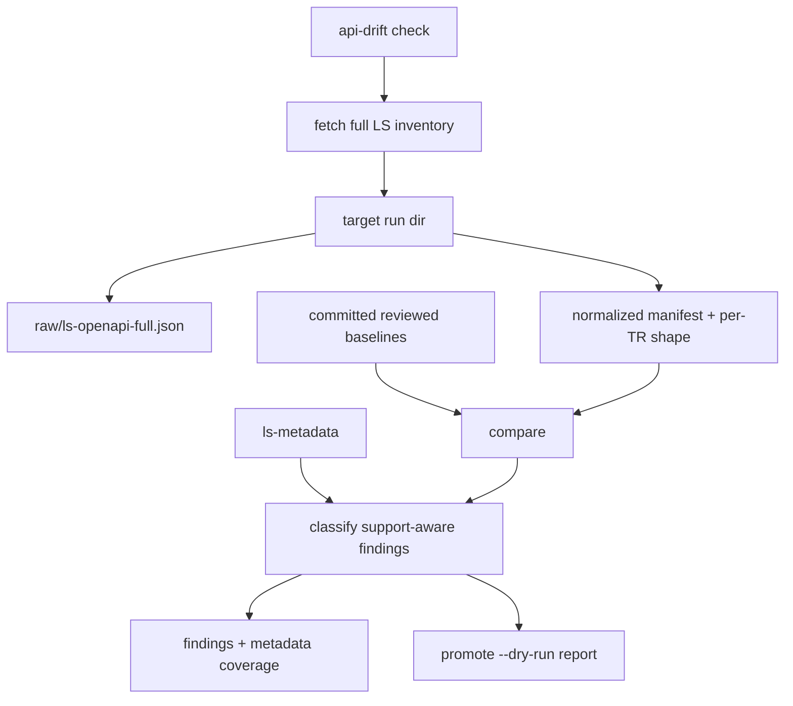

# feat: API Drift real fetch and reviewed baseline comparison

## Summary

Turn the API Drift Tracker from a fixture-only walking skeleton into an opt-in,
Rust-native upstream checker. PR #3 fetches the full LS public API inventory,
writes timestamped staged runs under `target/`, normalizes the full inventory
into per-TR **Structural API Shape** baselines plus a manifest, compares against
committed **Reviewed Baselines**, and emits support-aware advisory findings.
It does not mutate SDK code, metadata, docs, or existing committed baselines.
U6 seeds the initial reviewed baselines once; thereafter `promote --dry-run`
reports baselines that would need review without writing them.

---

## Problem Frame

PR #2 proved the tracker pipeline shape with checked-in fixtures:
`fetch -> normalize -> diff -> classify -> promote`, with `fetch` stubbed and
`promote` write-nothing. The maintained SDK now needs the first real upstream
watcher. The important split is complete upstream awareness versus selective SDK
maintenance: the tracker must observe the full LS API inventory, while SDK
severity and follow-up work remain grounded in `ls-metadata`.

The old `korea-broker-sdk-ls` scraper is useful as a Migration Source for LS
endpoint knowledge and failure lessons, but permanent tracker tooling in this
repository is Rust-first per ADR 0009.

---

## Requirements

- R1. Fetch the full LS public API inventory, not only the seven TRs currently
  represented in `metadata/`.
- R2. Implement fetch natively in Rust inside `ls-trackers`; use the old Python
  scraper only as endpoint and guardrail reference.
- R3. Commit a reviewed raw full-inventory baseline and committed normalized
  per-TR baselines plus a manifest.
- R4. Fresh fetches write only to timestamped staged run directories under
  `target/ls-trackers/api-drift/runs/`, and update a portable `latest.txt`
  pointer.
- R5. Normalize each TR into **Structural API Shape**, not sample payload leaf
  paths.
- R6. Field identity includes `(direction, block_name, field_index, field_name)`
  so duplicate fields, order changes, block moves, length changes, and
  required-flag changes are reviewable.
- R7. Track endpoint/protocol facts and rate-limit metadata as top-level
  structural facts.
- R8. Preserve raw LS text verbatim in the raw baseline. In normalized baselines,
  preserve compact names verbatim and store long descriptions/examples as stable
  hashes. "Stable" means hashing a normalized form, not the raw text: decode HTML
  entities, strip tags and `<br>`, collapse internal whitespace, and trim before
  hashing, so a benign upstream re-encoding of the same description hashes
  identically and does not fire a spurious informational finding.
- R9. Classify untracked upstream inventory drift as visible advisory findings,
  but not SDK-breaking.
- R10. Do not auto-create or edit `metadata/trs/*.yaml` or
  `metadata/tr-index.yaml` for newly discovered upstream TRs.
- R11. Add metadata coverage reporting: upstream count, metadata count,
  implemented count, tracked-only count, metadata missing upstream, and upstream
  missing metadata summarized by default.
- R12. Fetch fails closed on structural incompleteness; no fixed minimum TR-count
  floor is used. Completeness is anchored against the committed Reviewed
  Baseline's TR-code set, not the scrape alone: fetch fails closed (exit `2`)
  when the menu scrape yields zero groups, or when any TR code present in the
  committed baseline is absent from the staged inventory. This restores the
  pinned-code-set guard without reintroducing a numeric floor.
- R13. Description-only changes are tracked as informational in this PR because
  no TR is `recommended`.
- R14. Detect likely TR renames as advisory grouping when structural fingerprints
  match strongly; do not auto-accept renames.
- R15. Provide a thin `ls-trackers` CLI: `api-drift fetch`, `api-drift check`,
  and `api-drift promote --dry-run`.
- R16. `api-drift check` defaults to upstream fetch, and supports `--staged <dir>`
  for repeatable review against an existing staged run.
- R17. Exit codes are stable: `0` no drift, `1` one or more tracker findings,
  `2` fetch/parse/baseline/internal error.
- R18. Default `cargo test` and ordinary verification remain network-free.
- R19. Add opt-in Makefile targets for fetch/check/dry-run promote; do not wire
  them into default gates.
- R20. Keep the Specification Document Tracker out of PR #3 except for shared
  type compatibility.

---

## Key Technical Decisions

- **Full-inventory fetch, metadata-scoped severity.** The API Drift baseline
  covers all LS TRs. `ls-metadata` determines support-aware severity only for
  maintained TRs; untracked TRs remain visible as inventory drift.
- **Raw plus normalized baselines.** Raw baseline preserves the accepted upstream
  artifact for audit and future normalizer debugging. Normalized baselines are
  the deterministic diff inputs.
- **Per-TR normalized files plus one manifest.** A single raw JSON captures the
  upstream artifact. Normalized output is split by TR for reviewability, with a
  manifest carrying inventory facts, hashes, source URLs, and normalizer version.
- **Structural completeness replaces magic counts.** There is no `MIN_TR_COUNT`.
  A fetch is complete only if every discovered group and TR is accounted for,
  required structural facts are present, and every TR code in the committed
  Reviewed Baseline appears in the staged inventory. Anchoring the gate to the
  baseline code-set (rather than the scrape's own output) catches a silently
  truncated menu scrape, which is otherwise self-consistent and would pass.
  Count/code-set changes above that floor-free baseline are drift, not scrape
  failure.
- **No mutation boundary.** `promote --dry-run` reports committed baselines,
  metadata fields, and generated docs that would need review, but writes nothing.
- **Network is explicit.** Real fetch runs only through operator commands. Tests
  use fixtures and local mocks.
- **No metadata generation.** New upstream TRs produce findings and possible
  follow-up work. They do not generate placeholder maintained metadata.

---

## High-Level Design



Committed baseline layout:

```text
crates/ls-trackers/baselines/api-drift/
  raw/
    ls-openapi-full.json
  normalized/
    manifest.json
    trs/
      token.json
      revoke.json
      t1102.json
      t8412.json
      CSPAQ12200.json
      S3_.json
      CSPAT00601.json
      ...
```

Staged run layout:

```text
target/ls-trackers/api-drift/
  latest.txt
  runs/
    2026-06-15T14-30-00Z/
      raw/
        ls-openapi-full.json
      normalized/
        manifest.json
        trs/
          ...
      fetch-report.json
```

## Structural API Shape

Each per-TR normalized baseline should carry:

```text
tr_code
tr_name
protocol
is_websocket
endpoint_path
api_group_id
source_group_name
request_blocks[]
response_blocks[]
rate_limit_per_sec
corp_rate_limit_per_sec
rate_source_group
description_hash
```

Each block field should carry:

```text
direction
block_name
field_index
field_name
korean_name
type
length
required
description_hash
```

Field identity is:

```text
(direction, block_name, field_index, field_name)
```

This intentionally supersedes the PR #2 sample-payload leaf-path fixture model
for real API Drift work.

---

## Severity Policy

| Change | Metadata state | Severity |
|---|---|---|
| TR added | no metadata | maintenance |
| TR removed | no metadata | maintenance |
| TR shape changed | no metadata | informational |
| Description-only change | any state in PR #3 | informational |
| Same-block field reorder | implemented or tracked | maintenance |
| Field moved across block | implemented or recommended | breaking |
| Field removed or incompatible shape changed | implemented or recommended | breaking |
| Field removed or incompatible shape changed | tracked-only | maintenance |
| Endpoint/protocol changed | implemented or recommended | breaking |
| Endpoint/protocol changed | tracked-only | maintenance |
| Rate limit decreased | implemented or recommended | breaking or maintenance, depending runtime risk |
| Rate limit changed | tracked-only or untracked | maintenance or informational |
| Auth structural change | any metadata state | critical |
| Order runtime structural change | implemented or recommended order | critical |
| Order structural change | tracked-only order | maintenance |

Likely rename detection groups add/remove findings when Korean name, protocol,
endpoint/group, and field fingerprints match strongly. The grouped rename is
advisory and still requires review.

Metadata coverage summaries do not cause exit `1` by themselves. Actual upstream
drift findings do, including informational findings.

---

## CLI & Make Targets

CLI:

```text
cargo run -p ls-trackers -- api-drift fetch
cargo run -p ls-trackers -- api-drift check
cargo run -p ls-trackers -- api-drift check --staged target/ls-trackers/api-drift/runs/<timestamp>
cargo run -p ls-trackers -- api-drift promote --dry-run --staged target/ls-trackers/api-drift/runs/<timestamp>
```

Exit codes:

```text
0 = fetched/loaded and compared successfully; no drift findings
1 = fetched/loaded and compared successfully; one or more findings need review
2 = fetch, parse, baseline, staged-run, or internal error
```

Makefile targets:

```make
api-drift-fetch:
	cargo run -p ls-trackers -- api-drift fetch

api-drift-check:
	cargo run -p ls-trackers -- api-drift check

api-drift-promote-dry-run:
	cargo run -p ls-trackers -- api-drift promote --dry-run
```

These targets are explicit operator commands only.

---

## Implementation Units

### U1. Baseline and staged-run types

- **Goal:** Define committed baseline and staged-run data types for raw artifact
  metadata, normalized manifest, per-TR Structural API Shape, fetch reports, and
  metadata coverage summaries.
- **Requirements:** R3, R4, R5, R7, R8, R11
- **Files:** `crates/ls-trackers/src/types.rs`, possibly
  `crates/ls-trackers/src/api_drift.rs`
- **Approach:** Keep shared tracker vocabulary while adding API Drift-specific
  structs. Use sorted maps/vectors for deterministic serialization. Keep raw
  JSON as `serde_json::Value` or bytes at the storage boundary, not as a domain
  model.
- **Verification:** Unit tests serialize a normalized TR shape and manifest
  deterministically.

### U2. Rust-native LS public API fetch adapter

- **Goal:** Fetch the full LS public API inventory through Rust `reqwest`.
- **Requirements:** R1, R2, R12
- **Files:** `crates/ls-trackers/src/api_drift.rs`, possibly
  `crates/ls-trackers/src/fetch.rs`, `crates/ls-trackers/Cargo.toml`
- **Approach:** Group/TR inventory discovery is an HTML scrape of the
  `/apiservice` menu page (`nav#lnb` / `ul.second-depth` / `ul.third-depth` in
  the Migration Source), not a JSON endpoint; add an HTML/DOM-parsing crate
  (e.g. `scraper`) to `[workspace.dependencies]` and ls-trackers' Cargo.toml,
  and treat the selector contract as the brittle surface the "fail closed when
  groups cannot be accounted for" guard protects. The remaining endpoints supply
  TR detail: `/api/apis/guide/tr/{api_id}`,
  `/api/apis/guide/tr/property/{tr_id}`, `/api/apis/public/{api_id}`, and
  `/api/codes/public/system-codes?groupCode=property_type`. Run fetch through a
  synchronous `reqwest` blocking client so the CLI keeps the same no-`#[tokio::main]`
  shape as `ls-docgen` (the docgen precedent governs CLI shape only; it does no
  network, so it gives no guidance on the HTTP/retry path — and reqwest's blocking
  client spins its own current-thread runtime internally). Enable the feature
  per-crate in ls-trackers' Cargo.toml via
  `reqwest = { workspace = true, features = ["blocking"] }` so ls-core/ls-sdk
  feature surface is unchanged; do not edit the shared `[workspace.dependencies]`
  entry. Bounded retries on transient request failures. Property-type mapping
  failure is recoverable with fallback and a warning; group list, TR list, and TR
  property failures are fetch errors. To make the R12 baseline-anchored
  completeness gate fire at fetch time (exit `2`) rather than surfacing as exit-1
  drift in U4, the fetch path itself loads the committed Reviewed Baseline's
  TR-code set after a successful scrape and treats any baseline code absent from
  the staged inventory as a fetch error before normalize/compare. On the
  bootstrap fetch (no committed baseline yet) this clause is vacuous and only the
  zero-groups guard applies.
- **Verification:** Local mock HTTP tests cover success, retry-exhausted group
  failure, property-type fallback, and TR property failure. ls-trackers currently
  declares no `[dev-dependencies]`; add `wiremock` and `tokio` (both required —
  `wiremock::MockServer` is async regardless of the blocking production client).
  Mock tests run under `#[tokio::test]` like `crates/ls-sdk/tests/`, driving the
  blocking client via `tokio::task::spawn_blocking`.

### U3. Normalize raw inventory into Structural API Shape

- **Goal:** Convert fetched inventory into raw baseline JSON plus normalized
  manifest and per-TR JSON.
- **Requirements:** R5, R6, R7, R8, R14
- **Files:** `crates/ls-trackers/src/api_drift.rs`
- **Approach:** Preserve names, hash descriptions/examples, include endpoint,
  protocol, and rate metadata, and key fields by direction/block/index/name.
  Compute structural fingerprints for likely-rename detection.
- **Verification:** Fixture tests prove duplicate field names, field reorder,
  block move, length change, required-flag change, rate-limit change, and
  description-only change are represented distinctly. A dedicated fixture
  asserts that an entity-only re-encoding of an otherwise-identical description
  (per the R8 normalization) hashes to the same value and produces no finding.

### U4. Compare staged run against committed reviewed baselines

- **Goal:** Load committed baselines and a staged run, compare manifest and
  per-TR structural shapes, and emit API Drift changes.
- **Requirements:** R3, R9, R10, R11, R13, R14, R17
- **Files:** `crates/ls-trackers/src/api_drift.rs`,
  `crates/ls-trackers/tests/`
- **Approach:** Inventory diffs come from manifest/code-set comparison.
  Structural diffs come from per-TR shape comparison. Metadata coverage is a
  separate report section, not a per-TR drift finding unless a metadata TR is
  missing upstream. R10 is enforced here by emitting findings only: the compare
  and classify paths never create or edit `metadata/trs/*.yaml` or
  `metadata/tr-index.yaml` for newly discovered upstream TRs.
- **Verification:** Fixture tests cover added TR, removed implemented TR,
  untracked changed TR, metadata TR missing upstream, coverage summary, and
  likely rename grouping.

### U5. CLI and staged run storage

- **Goal:** Add a thin `ls-trackers` binary with `api-drift fetch`, `check`, and
  `promote --dry-run`.
- **Requirements:** R4, R15, R16, R17, R20
- **Files:** `crates/ls-trackers/src/main.rs`, `crates/ls-trackers/Cargo.toml`
- **Approach:** Hand-roll args like `ls-docgen`. `fetch` creates timestamped
  run dirs and writes `latest.txt`. `check` defaults to upstream fetch, or uses
  `--staged`. `promote --dry-run` requires an explicit staged run or uses
  `latest.txt` only if that behavior is unambiguous in implementation. Per R20,
  the CLI exposes only `api-drift` subcommands in this PR; the Specification
  Document Tracker appears only as the shared stage/type contract, with no
  fetch/normalize/diff surface.
- **Verification:** Unit or integration tests cover arg parsing and exit-code
  mapping without live network.

### U6. Commit initial reviewed baselines from fresh Rust-native fetch

- **Goal:** Seed the initial committed raw and normalized API Drift baselines.
- **Requirements:** R3, R8
- **Files:** `crates/ls-trackers/baselines/api-drift/**`
- **Approach:** Run the Rust-native fetcher, review the staged output, and
  commit that output as the initial baseline. Use the old repo only for parity
  checks and spot checks; do not copy old `specs/ls_openapi_specs.json`.
  Because the first baseline has nothing to diff against, attest its
  completeness independently before committing: derive a comparison TR-code set
  from the old repo's `specs/ls_openapi_specs.json` by walking its `categories`
  tree (parity check, not a file copy — the old artifact has no `tr_codes` key,
  so the set is computed, not read), assert the menu yielded a non-empty group
  set, and record the group count and code-set as the initial review evidence.
  If the derived old-repo set proves unavailable or untrustworthy, fall back to
  the non-empty-group-set assertion plus the recorded evidence as the bootstrap
  guard.
- **Verification:** The first-baseline attestation above (independent code-set
  parity + non-empty group set) is the correctness check; the subsequent
  `api-drift check --staged <seed-run>` against the committed baseline confirms
  the round-trip but, being a self-diff, is not by itself evidence of
  completeness.

### U7. Makefile targets and network-free tests

- **Goal:** Add opt-in Makefile targets and keep default verification
  deterministic.
- **Requirements:** R18, R19
- **Files:** `Makefile`
- **Approach:** Add `api-drift-fetch`, `api-drift-check`, and
  `api-drift-promote-dry-run`. Do not include them in ordinary test/gate
  targets.
- **Verification:** `cargo test -p ls-trackers` is network-free; Makefile target
  names resolve to the intended CLI commands.

---

## Acceptance Examples

- AE1. Full inventory fetch: `api-drift fetch` writes a timestamped staged run
  with raw JSON, normalized manifest, per-TR normalized files, and
  `fetch-report.json`; `latest.txt` points at the run.
- AE2. Baseline no-drift: after the initial baseline is committed,
  `api-drift check --staged <seed-run>` exits `0`.
- AE3. Implemented TR breaking drift: removing an implemented `t1102` response
  field in a fixture produces a `breaking` finding and check exits `1`.
- AE4. Untracked inventory drift: adding a new untracked TR produces a
  `maintenance` finding and check exits `1`; no metadata file is created.
- AE5. Coverage summary: unchanged upstream with 365 upstream TRs and 7 metadata
  TRs prints summarized missing-metadata coverage but exits `0`.
- AE6. Structural fetch failure: a discovered TR property endpoint failure
  exits `2` and writes only a failure report under `target/`.
- AE7. Description-only drift: a field description hash change produces an
  informational finding in PR #3.
- AE8. Likely rename: a removed and added TR with matching fingerprint are
  grouped as a likely rename while preserving add/remove facts for review.

---

## Scope Boundaries

### In Scope

- API Drift Tracker only.
- Full upstream API inventory fetch.
- Raw and normalized reviewed baselines.
- Structural API Shape diffing.
- Support-aware advisory findings.
- CLI and opt-in Makefile targets.
- Network-free tests plus local mock fetch tests.

### Out of Scope

- Specification Document Tracker fetch/normalize/diff.
- SDK code mutation from tracker findings.
- Automatic metadata creation or edits.
- Mutating baseline promotion.
- Recommended TR promotion or Focused Evidence invalidation.
- Default network checks in ordinary verification.
- A fixed minimum TR-count floor.

---

## Risks & Dependencies

- **LS public page shape can change.** Isolate HTML/menu parsing behind the fetch
  adapter and fail closed when groups cannot be accounted for.
- **Large baseline churn.** Per-TR normalized files reduce review noise; raw
  baseline is committed only for the reviewed state.
- **False rename grouping.** Rename detection is advisory only and must preserve
  underlying add/remove facts.
- **Description hashing could hide useful context.** Raw baseline preserves the
  verbatim text for audit; normalized diff defaults stay compact.
- **Network volatility.** Live fetch is opt-in; tests use fixtures/mocks.

---

## Sources & Research

- `crates/ls-trackers/src/{stages.rs,api_drift.rs,types.rs}` - PR #2 tracker
  skeleton and current fixture model.
- `docs/adr/0005-staged-snapshots-for-change-tracking.md` - staged snapshot and
  reviewed baseline boundary.
- `docs/adr/0009-rust-first-permanent-tooling.md` - Rust-first permanent
  tooling decision.
- `docs/plans/maintained-sdk-migration-plan.md` - tracker workflow and severity
  ladder.
- `CONTEXT.md` - canonical terms: Staged Snapshot, Reviewed Baseline, Structural
  API Shape, Tracker Finding, Support-Aware Severity.
- Migration Source: `/Users/mini/dev/korea-broker-sdk-ls/scripts/fetch_ls_specs.py`
  for LS public API endpoints, retry behavior, property-type fallback, and
  rate-limit parsing.
- Migration Source: `/Users/mini/dev/korea-broker-sdk-ls/docs/SPEC_DRIFT_REVIEW.md`
  for structural field identity and drift-review lessons.

---

## Deferred / Open Questions

### From 2026-06-15 review (ce-doc-review)

Judgment calls surfaced by review that need a scope/design decision before or
during implementation. Each is a real concern with no single mechanical fix.

- **PR #3 silently replaces the PR #2 data model (scope-guardian, P1).** U1
  frames its work as "adding API Drift-specific structs," but U3 states the new
  Structural API Shape "supersedes the PR #2 sample-payload leaf-path fixture
  model." The implemented-and-tested PR #2 types (`NormalizedArtifact`,
  `FieldShape`, `Change`, the `normalize`/`diff` stages, and the two committed
  fixtures) are unaddressed. Decide: migrate/remove the old model (and rewrite
  its tests/fixtures) or let two normalization models coexist — and state the
  migration path. As written this is an unacknowledged migration, not an
  extension.

- **`field_index` in field identity defeats clean reorder detection
  (adversarial, P1).** Field identity is
  `(direction, block_name, field_index, field_name)`, yet the Severity Policy
  lists "Same-block field reorder" as a distinct row. Because `field_index` is
  part of identity, a benign reorder re-keys every shifted field, producing
  remove-at-old-index + add-at-new-index pairs indistinguishable from a real
  remove+add. Decide how a clean "reorder" finding is emitted — e.g. a
  same-name-different-index reconciliation pass — or accept that reorders surface
  as remove+add and remove that severity row.

- **Severity Policy rows lack supporting classify logic (scope-guardian, P2).**
  The table covers eleven change×metadata-state combinations — auth structural →
  `critical`, order-runtime → `critical`, rate-limit-decreased →
  runtime-risk-dependent, WebSocket protocol — but no U1–U7 unit describes
  detecting auth/order/rate-limit changes. Decide whether these rows are
  in-scope (then U3/U4 need the detection logic specified) or aspirational (then
  move them to Out of Scope for PR #3).

- **Rename-detection fingerprinting has no consumer this PR (scope-guardian,
  P2).** R14 + AE8 add a distinct fingerprinting algorithm with its own fixtures,
  absent from the origin's deferred list, whose only consumer is advisory
  display. Decide whether to keep it in the first real-fetch PR or defer it so
  the core fetch/normalize/diff/classify pipeline is validated first.

- **Metadata coverage reporting (R11) has no stated origin requirement
  (scope-guardian, P2).** R11 adds a six-count aggregation subsystem with its own
  acceptance example (AE5) and exit-code carve-out, sequentially dependent on U6
  inside the same PR, with no origin requirement. Decide whether it belongs in
  PR #3 or a follow-up, and settle the permanent policy on whether coverage
  summaries ever affect exit codes (it shapes U4's report output type).

- **Incomplete scrape surfaces at compare, not fetch (adversarial, P2).** R12
  promises fail-closed at exit `2`, but a truncated-yet-well-formed inventory
  would reach the compare stage and surface as mass "TR removed" findings at
  exit `1`, indistinguishable from real upstream deletions. The baseline-anchored
  completeness gate added to R12 this round largely addresses this; confirm the
  gate runs at fetch time (exit `2`) before compare, so this failure mode cannot
  reach exit `1`.

#### Open questions for planning/implementation

- Does `api-drift check` without `--staged` fetch into a fresh run dir and then
  compare, or read `latest.txt`? The data-source mechanic is unspecified.
- What concrete fallback value is used when property-type mapping fails? U2 names
  the behavior but not the substitute value.

#### Residual concerns (advisory, not blocking)

- PR #2's `PromoteReport` references `tests/fixtures/{tr}_baseline.json`; the new
  `baselines/api-drift/normalized/trs/{tr}.json` layout may strand those path
  strings.
- The property-type mapping fallback set is hardcoded (4 codes in the Migration
  Source); it goes stale and mislabels field types if LS adds property types,
  without surfacing that fallback was used.
- Rename fingerprinting may false-group LS's near-identical domestic/overseas TR
  variants; acceptable as advisory but worth watching once real data exists.
- AE5's literal "365 upstream TRs" is illustrative; a pinned test on that count
  would contradict the no-floor boundary.
- The full ~365-TR inventory is the standing review surface even though severity
  is metadata-scoped to 7 TRs; whether to bound the committed baseline to
  maintained-plus-adjacent TRs is an open strategic question (ADR 0006 context).
- The opt-in targets (R19) have no scheduling/CI trigger; a watcher nobody runs
  detects no drift. Name an operational cadence or acknowledge this ships
  detection capability without a detection trigger.
- The R12 baseline-anchored completeness gate checks against a code-set seeded
  once at U6 (from the old repo) and never independently re-attested; a TR the
  old repo never knew about can never trip the gate. Document how the baseline
  code-set is meant to grow and be re-attested over time so the seed's authority
  does not become permanent by default. (product-lens, 2026-06-16)
