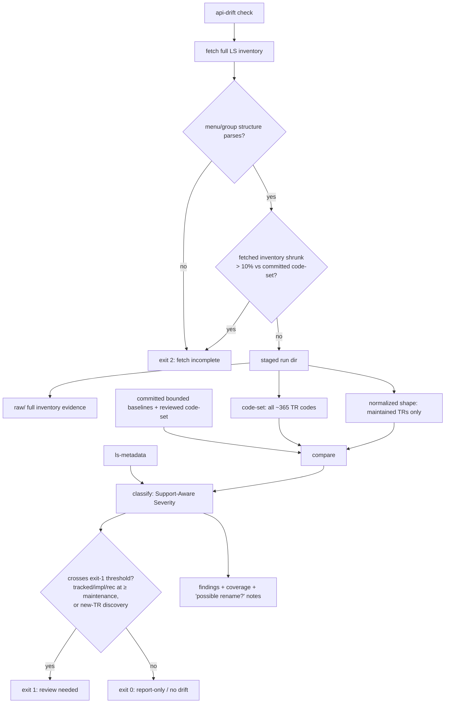

# feat: API Drift real fetch — signal-model revision

## Summary

This supersedes `docs/plans/2026-06-15-004-feat-api-drift-real-fetch-plan.md`.
The pipeline shape is unchanged — fetch → stage → normalize into **Structural
API Shape** → compare against **Reviewed Baselines** → emit **Support-Aware**
advisory findings, network-free by default, mutating nothing. Six decisions from
the scope pressure-test (`docs/brainstorms/2026-06-16-api-drift-scope-pressure-test-requirements.md`)
rework the **signal model** so the tracker is usable against a ~365-TR upstream
surface that serves 7 maintained TRs:

- **D1** Severity-tiered, support-aware exit contract (replaces "any finding = exit 1").
- **D2** Bounded structural baseline (maintained TRs only) plus a full-inventory **code-set** for awareness.
- **D3** Removal-vs-truncation split in the completeness gate.
- **D4** Rename fingerprinting cut to a minimal report hook.
- **D5** Incremental code-set re-attestation; bootstrap seed provisional.
- **D6** Cadence bound to an existing operator checkpoint.

The unit structure (U1–U7) is preserved for diffability against the origin plan;
U-IDs are stable. Rename work is removed from U3/U4; the code-set artifact and
re-attestation thread through U1, U2, U4, and U6.

---

## Problem Frame

The origin plan treated the full ~365-TR inventory and the 7-TR maintained
surface identically in its exit contract and its committed baseline. Three
consequences followed, each resolved here:

- **Cry-wolf.** Any finding — including an informational typo on an untracked
  TR — produced the same exit `1` as a `breaking` change on an implemented TR.
  An opt-in tracker with a distrusted signal is an unrun tracker.
- **Review cost.** The committed Structural API Shape baseline covered all ~365
  TRs, making the *human review* surface (ADR 0005) ~358 TRs of shape that
  nothing gates on.
- **Unreachable removals.** The completeness gate fused "real upstream TR
  removal" and "truncated scrape" into one exit-`2` bucket, so the `TR removed`
  severity rows could never fire for baselined TRs.

The migration source (`~/dev/korea-broker-sdk-ls`) is direct evidence: its drift
detector treats removed TRs as reviewable drift, guarded silent-wipe with a
numeric `MIN_TR_COUNT` floor (not the pinned-code check), and — having lived
through real LS drift — never built rename detection.

---

## Requirements

Markers: **(revised)** changed from origin, **(new)** added here, **(removed)**
dropped here. Unmarked requirements carry forward unchanged.

- R1. Fetch the full LS public API inventory, not only the maintained TRs.
- R2. Implement fetch natively in Rust inside `ls-trackers`; use the old Python
  scraper only as endpoint and guardrail reference.
- R3. **(revised)** Commit reviewed raw evidence and committed normalized per-TR
  Structural API Shape baselines **only for maintained TRs** (the 7 in
  `metadata/`), plus a manifest. Adjacency-scoped baselining is deferred —
  Dependency Class is uncomputable for untracked TRs (see KTD-2 and Deferred to
  Follow-Up Work).
- R3b. **(new)** Commit a reviewed full-inventory **code-set** (the set of all
  upstream TR codes) as a first-class artifact. It drives the new-TR gate (R9b),
  the completeness anchor (R12), and the coverage summary (R11) — none of which
  require per-TR structural shape.
- R4. Fresh fetches write only to timestamped staged run directories under
  `target/ls-trackers/api-drift/runs/`, and update a portable `latest.txt`.
- R5. **(revised)** Normalize each **maintained** TR into Structural API Shape.
  Untracked TRs are captured in the code-set and raw staged evidence only, not
  normalized into committed structural baselines.
- R6. Field identity includes `(direction, block_name, field_index, field_name)`
  so duplicate fields, order changes, block moves, length changes, and
  required-flag changes are reviewable.
- R7. Track endpoint/protocol facts and rate-limit metadata as top-level
  structural facts (for baselined TRs).
- R8. Preserve raw LS text verbatim in raw evidence. In normalized baselines,
  preserve compact names verbatim and store long descriptions/examples as stable
  hashes — hash a normalized form (decode HTML entities, strip tags and `<br>`,
  collapse internal whitespace, trim) so benign re-encoding hashes identically.
- R9. Classify untracked upstream inventory drift as **report-only** advisory
  findings (exit `0`), never SDK-breaking.
- R9b. **(new)** New untracked-TR *discovery* is the one untracked event that
  gates: it emits a finding and contributes to exit `1` ("should we track
  this?"). Field-level changes to an already-known untracked TR remain
  report-only (exit `0`).
- R10. Do not auto-create or edit `metadata/trs/*.yaml` or
  `metadata/tr-index.yaml` for newly discovered upstream TRs.
- R11. Metadata coverage reporting: upstream count, metadata count, implemented
  count, tracked-only count, metadata-missing-upstream, and upstream-missing-
  metadata. Driven by the code-set (R3b), not structural baselines. Coverage
  summaries never affect exit codes.
- R12. **(revised)** Completeness gate splits structural integrity from TR
  presence:
  - A baselined TR absent from an **otherwise well-parsed** menu is a real
    `TR removed` finding, exited per severity (R17b) — not a fetch error.
  - Exit `2` (fetch incomplete) fires only when the menu/group structure itself
    fails to parse, **or** when the fetched **full inventory** has shrunk past a
    **relative proportion** of the committed code-set —
    `fetched_count < (1 - PROPORTION) * committed_code_set_len` (suspected mass
    truncation). The proportion is relative (scales with inventory), never a
    fixed count, and is measured over the full code-set, not the maintained
    baseline subset.
- R13. Description-only changes are informational and **report-only** (exit `0`).
- R14. **(removed)** Rename fingerprinting/grouping is cut from the first slice.
- R14b. **(new)** Minimal rename hook: when a TR removal and a TR addition
  co-occur in one run, the report lists them adjacently with a "possible
  rename?" note. No fingerprinting algorithm, no matching logic, no dedicated
  fixtures.
- R15. Provide a thin `ls-trackers` CLI: `api-drift fetch`, `api-drift check`,
  and `api-drift promote --dry-run`.
- R16. `api-drift check` defaults to upstream fetch, and supports `--staged <dir>`
  for repeatable review against an existing staged run.
- R17. **(revised)** Exit codes:
  - `0`: comparison completed; no finding crossed the gate threshold.
  - `1`: at least one finding crossed the gate threshold (R17b).
  - `2`: fetch, parse, baseline, staged-run, or internal error.
- R17b. **(new)** A finding crosses the exit-`1` threshold iff it touches a
  tracked/implemented/recommended TR at **maintenance or breaking** severity,
  **or** it is a new untracked-TR discovery (R9b). All other untracked-TR
  changes and **all** informational findings are reported but exit `0`.
- R18. Default `cargo test` and ordinary verification remain network-free.
- R19. **(revised)** Add opt-in Makefile targets for fetch/check/dry-run promote,
  and document the check as a step in an existing recurring operator checkpoint
  (release checklist / periodic maintenance review). No cron/CI scheduling.
- R20. Keep the Specification Document Tracker out of this slice except for
  shared type compatibility.

---

## Key Technical Decisions

- **KTD-1 — Severity and support state are part of the exit contract (D1).**
  The classify stage already produces Support-Aware Severity; the exit mapping
  now reads it. Exit `1` means "the maintained SDK surface has a change worth
  reviewing, or a new TR appeared" — not "something, somewhere, differs."
  Side effect: an imperfect description-hash normalizer now produces report
  noise, not false gate failures (informational → exit `0`).

- **KTD-2 — Two artifacts, decoupled: maintained-only structural baseline + full
  code-set (D2).** Completeness and coverage need only the code-set (a cheap
  list), so structural baselining is bounded to the **maintained TRs** (the 7 in
  `metadata/`). Adjacency was considered but is uncomputable: Dependency Class
  (`owner_class`) exists only for maintained TRs and upstream TRs carry no class
  signal, so "adjacent to a maintained TR's class" always resolves to the empty
  set. Adjacency is therefore deferred — a neighbor is baselined when it is
  promoted to maintained, or via an explicit curated list (or an
  `api_group_id`-based definition) if a broader baseline is later justified. ADR
  0004's "complete tracking" is satisfied as full-inventory *awareness*, not
  full structural diff. The human-reviewed baseline collapses from ~365 to 7 TRs.

- **KTD-3 — Structural accountability, not TR-presence, fails the fetch (D3).**
  The silent-wipe guard is menu/group parse integrity plus a *relative*
  mass-shrink proportion measured over the **full** fetched-vs-committed code-set
  (`fetched_count < (1 - PROPORTION) * committed_code_set_len`, default
  `PROPORTION = 0.10`, operator-overridable), replacing the migration source's
  fixed `MIN_TR_COUNT` floor. A single baselined TR's absence is a real removal
  finding, not a scrape failure; the guard fires only on full-inventory collapse.

- **KTD-4 — Rename detection deferred until evidence exists (D4).** The
  migration source never needed it; the only consumer is advisory display. A
  co-occurring add/remove gets an adjacency note. Real fetch data revisits
  whether LS renames TRs often enough to justify matching logic.

- **KTD-5 — The code-set is re-attested incrementally; the seed is provisional
  (D5).** Each new-TR finding (exit `1`) forces the operator to decide whether
  to admit the TR into the reviewed code-set. The reviewed commit that updates
  the code-set is the review-evidence trail; no separate attestation manifest.
  The bootstrap seed is marked provisional, dissolving the old repo's permanent
  authority through normal maintenance.

- **KTD-6 — A real trigger at near-zero infra cost (D6).** The check binds to an
  existing recurring operator checkpoint rather than new automation, keeping the
  default verification network-free while ensuring the tracker actually fires.

---

## High-Level Technical Design



Committed baseline layout (bounded):

```text
crates/ls-trackers/baselines/api-drift/
  code-set.json            # all ~365 upstream TR codes; provisional flag on seed
  raw/
    ls-openapi-full.json   # raw evidence for the reviewed snapshot
  normalized/
    manifest.json          # inventory facts, hashes, source URLs, normalizer version
    trs/                   # maintained TRs ONLY (the 7 in metadata/)
      token.json
      revoke.json
      t1102.json
      t8412.json
      CSPAQ12200.json
      S3_.json
      CSPAT00601.json
```

Staged run layout (unchanged from origin):

```text
target/ls-trackers/api-drift/
  latest.txt
  runs/
    2026-06-16T14-30-00Z/
      raw/ls-openapi-full.json
      code-set.json
      normalized/manifest.json
      normalized/trs/...
      fetch-report.json
```

---

## Structural API Shape

Per-TR normalized baseline (maintained TRs only):

```text
tr_code, tr_name, protocol, is_websocket, endpoint_path, api_group_id,
source_group_name, request_blocks[], response_blocks[], rate_limit_per_sec,
corp_rate_limit_per_sec, rate_source_group, description_hash
```

Per block field:

```text
direction, block_name, field_index, field_name, korean_name, type, length,
required, description_hash
```

Field identity: `(direction, block_name, field_index, field_name)`. This
supersedes the PR #2 sample-payload leaf-path fixture model for real API Drift
work (the PR #2 fixtures remain as compatibility coverage only).

---

## Severity Policy and Exit Gate

Severity classification is unchanged from origin; the new column is **Gate** —
whether the finding crosses the exit-`1` threshold (R17b). Rows that previously
required auth/order detection without supporting fetch facts are out of scope
(see Scope Boundaries) and omitted here.

| Change | Metadata state | Severity | Gate (exit 1?) |
|---|---|---|---|
| TR added (newly discovered) | no metadata | maintenance | **yes** (new-TR discovery) |
| TR removed | no metadata | maintenance | no (report-only) |
| TR removed | tracked-only | maintenance | **yes** |
| TR removed | implemented or recommended | breaking | **yes** |
| TR shape changed | no metadata | informational | no |
| Description-only change | any state | informational | no |
| Same-block field reorder | implemented or tracked | maintenance | **yes** |
| Field moved across block | implemented or recommended | breaking | **yes** |
| Field removed / incompatible | implemented or recommended | breaking | **yes** |
| Field removed / incompatible | tracked-only | maintenance | **yes** |
| Endpoint or protocol changed | implemented or recommended | breaking | **yes** |
| Endpoint or protocol changed | tracked-only | maintenance | **yes** |
| Rate limit decreased | implemented or recommended | maintenance | **yes** |
| Rate limit changed | tracked-only | informational/maintenance | maintenance → yes; informational → no |
| Any change | untracked (known TR) | informational/maintenance | no (report-only) |

Rule of thumb: **gate iff (touches tracked/impl/rec TR at ≥ maintenance) OR
(new-TR discovery).** Coverage summaries never gate.

The "Same-block field reorder" row is reachable only via the **reorder
reconciliation pass** in U4 (matching same-name fields across `field_index`
shifts); field identity includes `field_index` (R6), so without reconciliation a
reorder would surface as paired add/remove findings.

---

## Implementation Units

### U1. Baseline, code-set, and staged-run types

- **Goal:** Define committed-baseline, **code-set**, staged-run, manifest,
  per-TR Structural API Shape, fetch-report, coverage-summary, and finding types,
  with severity + support-state fields sufficient for the exit gate.
- **Requirements:** R3, R3b, R5, R7, R8, R11, R17b
- **Dependencies:** none
- **Files:** `crates/ls-trackers/src/types.rs`,
  `crates/ls-trackers/src/api_drift.rs`
- **Approach:** Keep shared tracker vocabulary; add API Drift structs. Add a
  first-class `CodeSet` type (sorted set of TR codes + `provisional: bool`
  seed flag). Findings carry `severity` and a `support_state`
  (implemented/recommended/tracked/untracked) plus a `gates: bool` stored field,
  set at classify time by a pure `gates_for(severity, support_state, is_new_tr)`
  helper (single source of the R17b rule; unit-tested here, exercised end-to-end
  in U4). Sorted maps/vectors for deterministic serialization; raw evidence stays
  `serde_json::Value`/bytes at the storage boundary.
- **Patterns to follow:** existing `crates/ls-trackers/src/types.rs` and
  `stages.rs` skeleton.
- **Test scenarios:**
  - Happy path: serialize a normalized TR shape, a manifest, and a code-set
    deterministically (stable byte output across runs).
  - Edge: code-set with `provisional: true` round-trips deterministically.
  - Edge: `gates_for(...)` returns the correct value for each
    (severity × support_state × is_new_tr) combination in the Severity Policy
    table.
- **Verification:** Unit tests cover serialization determinism and the
  `gates_for` derivation matrix.

### U2. Rust-native LS fetch adapter + split completeness gate

- **Goal:** Fetch the full inventory through Rust `reqwest`; build the code-set;
  apply the D3 split completeness gate.
- **Requirements:** R1, R2, R12
- **Dependencies:** U1
- **Files:** `crates/ls-trackers/src/api_drift.rs`,
  `crates/ls-trackers/src/fetch.rs`, `crates/ls-trackers/Cargo.toml`
- **Approach:** Group/TR discovery is an HTML scrape of the `/apiservice` menu
  (`nav#lnb` / `ul.second-depth` / `ul.third-depth` per the Migration Source);
  add an HTML/DOM crate (e.g. `scraper`) to `[workspace.dependencies]` and enable
  it per-crate. TR detail endpoints: `/api/apis/guide/tr/{api_id}`,
  `/api/apis/guide/tr/property/{tr_id}`, `/api/apis/public/{api_id}`,
  `/api/codes/public/system-codes?groupCode=property_type`. Synchronous `reqwest`
  blocking client (matches `ls-docgen`'s no-`#[tokio::main]` CLI shape); the
  workspace pin lacks `blocking`, so declare
  `reqwest = { workspace = true, features = ["blocking"] }` in
  `ls-trackers/Cargo.toml` (per-crate feature union, leaving other crates
  unchanged). Bounded retries on transient failures.
  Property-type mapping failure is recoverable with fallback + warning; group/TR
  list and TR-property failures are fetch errors. **Split gate (R12):** after a
  successful scrape, (a) if the menu/group structure failed to parse → exit `2`;
  (b) load the committed code-set and compute the **full** fetched inventory
  size; if `fetched_count < (1 - PROPORTION) * committed_code_set_len` (default
  `PROPORTION = 0.10`, operator-overridable) → exit `2` suspected truncation;
  (c) otherwise pass the staged run through — individual absent **baselined** TRs
  become removal findings in U4, a count-independent rule separate from the
  mass-shrink guard (whose numerator is the full fetched inventory and
  denominator the full committed code-set — never the ~7-TR baselined subset).
  On bootstrap (no committed code-set) only the menu-parse guard applies.
- **Execution note:** Add the split-gate decision as a failing test first — the
  removal-vs-truncation boundary is the unit's core risk.
- **Patterns to follow:** `ls-docgen` CLI shape. NOTE: `crates/ls-sdk/tests/`
  uses a fully **async** client end-to-end (no `spawn_blocking`, no blocking
  reqwest), so it is not a direct pattern for a blocking-client harness — do not
  cite it as one. Make the fetch adapter testable by injecting the base URL and
  factoring menu-parse + gate logic into pure functions over parsed structures,
  so the gate branches are tested transport-independently.
- **Test scenarios:**
  - Happy path: full scrape yields a code-set + raw evidence; gate passes.
  - Covers AE6. Menu/group parse failure → exit `2`, failure report only.
  - Edge: exactly one baselined TR absent, menu well-formed → gate passes
    (becomes a removal finding downstream), NOT exit `2`.
  - Edge: fetched full-inventory count just above vs just below
    `(1 - PROPORTION) * committed_code_set_len` → pass vs exit `2` respectively.
  - Error: retry-exhausted group-list failure → fetch error; property-type
    fallback path emits a warning and continues.
  - Bootstrap: no committed code-set → only menu-parse guard active.
- **Verification:** Gate/parse logic is unit-tested as pure functions over
  parsed structures (no transport). The HTTP layer is covered by a small mock
  test against a base-URL-injected client; for the blocking client, use a
  synchronous mock — `httpmock`, added as an `ls-trackers` dev-dependency — under
  plain `#[test]` rather than `wiremock`/`tokio` + `spawn_blocking`. No live
  network in either path.

### U3. Normalize bounded inventory into Structural API Shape

- **Goal:** Convert fetched inventory into raw evidence + code-set + normalized
  manifest and per-TR shape for **maintained TRs** only.
- **Requirements:** R5, R6, R7, R8
- **Dependencies:** U1, U2
- **Files:** `crates/ls-trackers/src/api_drift.rs`
- **Approach:** Normalize only the maintained TRs (the 7 in `metadata/`); record
  all codes in the code-set. Preserve names, hash descriptions/examples per R8,
  include endpoint/protocol/rate facts, key fields by direction/block/index/name.
  No adjacency computation (deferred, KTD-2); no rename fingerprinting (R14
  removed). Reorder *detection* lives in U4's diff, not here — U3 only ensures
  `field_index` is preserved so the reconciliation pass can run.
- **Test scenarios:**
  - Happy path: a maintained TR normalizes to stable shape; an untracked TR
    appears in the code-set but produces no normalized file.
  - Edge: duplicate field names, field reorder, block move, length change,
    required-flag change, rate-limit change each represented distinctly.
  - Edge: entity-only re-encoding of an otherwise-identical description hashes
    identically and produces no finding (R8).
- **Verification:** Fixture tests assert bounded normalization and the
  representational distinctions above.

### U4. Compare staged run against bounded baselines + code-set

- **Goal:** Load committed bounded baselines and the reviewed code-set, compare
  against a staged run, and emit support-aware findings with correct exit gating.
- **Requirements:** R3, R3b, R6, R9, R9b, R10, R11, R13, R14b, R17b
- **Dependencies:** U1, U2 (reads U2's gate-filtered staged run), U3
- **Files:** `crates/ls-trackers/src/api_drift.rs`, `crates/ls-trackers/tests/`
- **Approach:** Inventory diffs come from code-set comparison (added/removed
  codes). Structural diffs come from per-TR shape comparison over the bounded
  baseline set. Classify each change via `ls-metadata` support state; derive the
  `gates` flag per R17b. New-TR discovery (code in staged, not in reviewed
  code-set) gates (R9b); other untracked changes are report-only (R9, R13).
  Removal of a maintained baselined TR (passed through by U2's gate) is a real
  `TR removed` finding, gated by support state; removal of an untracked TR is
  observed via code-set diff (no structural baseline exists for it) and is
  report-only. **Reorder reconciliation (R6):** in per-TR shape diff, group
  fields by `(direction, block_name, field_name)`. When a group has exactly one
  field on each side, reconcile across differing `field_index` and emit a
  distinct same-block reorder finding. When a group has cardinality >1 on either
  side (duplicate names), do not attempt positional matching — emit raw
  add/remove findings for every index-differing member of that group (no reorder
  finding). **Rename hook
  (R14b):** when a TR removal and a TR addition co-occur in one run, emit them
  with an adjacency "possible rename?" note — no matching logic. R10 enforced
  here: compare/classify never write `metadata/`. Coverage summary (R11) is a
  separate report section that never gates.
- **Test scenarios:**
  - Covers AE2. Identical staged run vs committed baseline → exit `0`.
  - Covers AE3. Removing an implemented TR response field → `breaking`, exit `1`.
  - Covers AE4. New untracked TR discovered → `maintenance` finding, gates exit
    `1`, no metadata file created.
  - New finding: a field change on an already-known untracked TR → report-only,
    exit `0`.
  - Covers AE7. Description-only change on an implemented TR → informational,
    exit `0`.
  - Real removal via code-set diff: a code present in the reviewed code-set but
    absent from the staged code-set, with no structural baseline (untracked) →
    report-only maintenance, exit `0`; the same absence for a maintained
    baselined TR → exit `1`.
  - Reorder reconciliation: a same-block field reorder (unique names, shifted
    indices) on an implemented TR → one maintenance reorder finding, not paired
    add/remove. Duplicate-name group where only one of two same-named fields
    shifts → raw add/remove for the shifted member, no reorder finding.
  - Rename hook: co-occurring add+remove emit an adjacency note; both underlying
    findings preserved.
  - Covers AE5. Coverage: metadata-TR-missing-upstream surfaces in the summary;
    summary alone never flips exit `0` → `1`.
- **Verification:** Fixture tests cover the gate matrix, the removal path, the
  rename hook, and coverage independence.

### U5. CLI, staged-run storage, and exit-code mapping

- **Goal:** Thin `ls-trackers` binary with `api-drift fetch`, `check`, and
  `promote --dry-run`, mapping findings to the tiered exit contract.
- **Requirements:** R4, R15, R16, R17, R17b, R20
- **Dependencies:** U2, U4
- **Files:** `crates/ls-trackers/src/main.rs`, `crates/ls-trackers/Cargo.toml`,
  `crates/ls-trackers/src/stages.rs`, `crates/ls-trackers/tests/classify.rs`
- **Approach:** Hand-roll args like `ls-docgen`. `fetch` creates timestamped run
  dirs + `latest.txt`. `check` defaults to upstream fetch, or `--staged`.
  `promote --dry-run` reports review targets, writes nothing. Exit mapping reads
  the aggregate `gates` flags: any gating finding → `1`; fetch/parse/baseline
  error → `2`; else `0`. Only `api-drift` subcommands exposed (R20).
  **Migrate the dead fixture path:** the existing `promote` stage in
  `crates/ls-trackers/src/stages.rs` hardcodes `tests/fixtures/{tr}_baseline.json`
  and `tests/classify.rs` asserts it; both must point at the new layout
  `crates/ls-trackers/baselines/api-drift/normalized/trs/{tr}.json` — the old
  path is a dead reference once the new layout is committed.
- **Test scenarios:**
  - Happy path: arg parsing for `fetch` / `check` / `check --staged` /
    `promote --dry-run`.
  - Edge: a run with only report-only findings exits `0`; a run with one gating
    finding exits `1`.
  - Covers AE1. `fetch` writes raw, code-set, manifest, per-TR shape,
    `fetch-report.json`, and updates `latest.txt`.
  - Dry-run: `promote --dry-run` lists review targets and leaves the working tree
    unchanged.
- **Verification:** Unit/integration tests cover arg parsing and exit-code
  mapping with no live network.

### U6. Seed provisional code-set + initial bounded baselines

- **Goal:** Seed the initial reviewed maintained-TR baselines and the
  **provisional** full-inventory code-set from a fresh Rust-native fetch.
- **Requirements:** R3, R3b, R8, R12 (seed path), KTD-5
- **Dependencies:** U2, U3, U5
- **Files:** `crates/ls-trackers/baselines/api-drift/**`
- **Approach:** Run the fetcher, review staged output, commit the maintained-TR
  normalized baselines + raw evidence + the code-set with `provisional: true`. First-baseline attestation (nothing to diff against):
  derive a comparison code-set from the old repo's `specs/ls_openapi_specs.json`
  by walking `categories` (parity check, not a file copy — computed, not read),
  assert a non-empty group set, and record group count + code-set as review
  evidence. **Re-attestation (KTD-5):** document that the code-set is re-attested
  incrementally — each future new-TR finding prompts an operator decision to
  admit the code; the reviewed commit is the evidence trail; the `provisional`
  flag is cleared once an operator has independently attested the inventory.
- **Test expectation:** none — this is an operator-reviewed seeding activity
  (live fetch + human review), not autonomous-buildable. The round-trip
  `api-drift check --staged <seed-run>` → exit `0` confirms wiring but, being a
  self-diff, is not completeness evidence.
- **Verification:** First-baseline parity attestation recorded; `check --staged`
  against the committed baseline exits `0`.

### U7. Makefile targets, operator-checkpoint doc, network-free tests

- **Goal:** Opt-in Makefile targets, a documented checkpoint step, and
  deterministic default verification.
- **Requirements:** R18, R19
- **Dependencies:** U5
- **Files:** `Makefile`, an existing operator checkpoint doc (e.g.
  `docs/RELEASE_CHECKLIST_TEMPLATE.md` equivalent in this repo, or the periodic
  maintenance runbook)
- **Approach:** Add `api-drift-fetch`, `api-drift-check`,
  `api-drift-promote-dry-run`, excluded from default gates. Add a documented
  step to an existing recurring operator checkpoint that runs `api-drift check`
  and reviews exit `1` findings (D6) — no cron/CI scheduling. Identify the
  concrete host checkpoint during implementation; if none exists yet, add the
  step to the maintenance runbook and note the gap.
- **Test expectation:** none for the doc step (`Test expectation: none --
  documentation + Makefile wiring`). `cargo test -p ls-trackers` stays
  network-free; Makefile target names resolve to the intended CLI commands.
- **Verification:** `cargo test -p ls-trackers` is network-free; the checkpoint
  doc names the check as a recurring step.

---

## Acceptance Examples

- AE1. `api-drift fetch` writes a timestamped staged run with raw JSON,
  code-set, normalized manifest, bounded per-TR files, and `fetch-report.json`;
  `latest.txt` points at the run.
- AE2. After the initial baseline is committed, `api-drift check --staged
  <seed-run>` exits `0`.
- AE3. Removing an implemented `t1102` response field in a fixture → `breaking`
  finding, exit `1`.
- AE4. **(revised)** Adding a new untracked TR → `maintenance` finding that gates
  exit `1` (new-TR discovery); a field-level change to an already-known untracked
  TR → report-only, exit `0`; no metadata file created in either case.
- AE5. Unchanged upstream with a large code-set and a small metadata set prints
  summarized missing-metadata coverage and exits `0`.
- AE6. A menu/group parse failure exits `2` and writes only a failure report; a
  single baselined-TR absence does NOT exit `2` (it becomes a removal finding).
- AE7. A description-only change → informational finding, **exit `0`**.
- AE8. **(removed)** Likely-rename grouping. Replaced by: a co-occurring
  add+remove emits a "possible rename?" adjacency note while preserving both
  findings.

---

## Scope Boundaries

### In scope

- The six pressure-test decisions folded into the first real-fetch slice.
- Full-inventory fetch, code-set artifact, bounded structural baselines.
- Support-aware advisory findings with the tiered exit gate.
- Coverage summary, CLI, opt-in Makefile targets, network-free + mock tests.

### Out of scope

- Specification Document Tracker fetch/normalize/diff.
- SDK code mutation, metadata creation/edits, doc regeneration, mutating promote.
- Full structural baselining of untracked TRs.
- Rename fingerprinting/matching (R14 removed; R14b hook only).
- Scheduled cron/CI automation (R19 binds to an existing checkpoint instead).
- Auth-wide and order-runtime critical detection. The `Critical` severity tier
  stays defined in shared types for future use, but no detection path for it
  exists in this slice and it will not fire; the slice must not imply coverage.

### Deferred to Follow-Up Work

- Promoting `provisional: true` → attested code-set once an operator
  independently verifies inventory completeness.
- Adjacency-scoped structural baselining. Dependency Class is uncomputable for
  untracked TRs, so slice 1 baselines maintained TRs only; a neighbor is
  baselined when promoted to maintained, or via an explicit curated list / an
  `api_group_id`-based definition if a broader baseline is later justified.
- Rename matching logic, if real fetch data shows LS renames TRs often enough.
- Auth/order structural detection units, when fetched facts support them.

---

## Open Questions

- **D3 proportion value.** Defaulted to `0.10` (10% of code-set absent →
  suspected truncation), operator-overridable. The exact default is tunable once
  real inventory sizes are observed; revisit after the first few live fetches.
- **Adjacency (resolved → deferred).** Dependency Class cannot be computed for
  untracked TRs, so slice 1 baselines maintained TRs only. If a broader baseline
  is later justified, define adjacency on the upstream `api_group_id`/`group_name`
  or a curated list (see Deferred to Follow-Up Work).
- **Checkpoint host (U7).** Which existing recurring operator checkpoint hosts
  the documented `api-drift check` step is resolved during implementation
  against this repo's actual runbooks.

---

## Risks & Dependencies

- **LS page shape can change.** Isolate HTML/menu parsing behind the fetch
  adapter; the split gate (KTD-3) fails closed on parse failure and mass
  absence.
- **Proportion threshold mis-tuned.** Too low → real multi-TR removals
  misread as truncation (exit `2`); too high → a truncated menu slips through as
  removal findings. Operator override + the menu-parse guard bound both ends;
  revisit the default with real data.
- **Inert tracker.** D6 mitigates "a watcher nobody runs" by binding to an
  existing checkpoint, but depends on that checkpoint having an owner. Flagged in
  U7 if no host checkpoint exists.
- **Bootstrap authority.** The provisional code-set seed (KTD-5) dissolves the
  old repo's permanent authority through the incremental re-attestation loop;
  until an operator clears `provisional`, the seed is explicitly untrusted-as-
  complete.

---

## Sources & Research

- `crates/ls-trackers/src/{stages.rs,api_drift.rs,types.rs}` — PR #2 tracker
  skeleton and current fixture model.
- `docs/brainstorms/2026-06-16-api-drift-scope-pressure-test-requirements.md` —
  origin; the six decisions.
- `docs/plans/2026-06-16-001-feat-api-drift-real-fetch-what.md` — WHAT scope
  (unchanged; this plan revises HOW).
- `docs/plans/2026-06-15-004-feat-api-drift-real-fetch-plan.md` — superseded plan.
- `docs/adr/0004-complete-tracking-selective-sdk-implementation.md`,
  `0005-staged-snapshots-for-change-tracking.md`,
  `0009-rust-first-permanent-tooling.md` — governing decisions.
- `CONTEXT.md` — canonical terms (Staged Snapshot, Reviewed Baseline, Structural
  API Shape, Tracker Finding, Support-Aware Severity, Dependency Class).
- Migration Source: `~/dev/korea-broker-sdk-ls/scripts/fetch_ls_specs.py`
  (endpoints, retry, property-type fallback, the `MIN_TR_COUNT` floor KTD-3
  replaces) and `~/dev/korea-broker-sdk-ls/docs/SPEC_DRIFT_REVIEW.md` (field
  identity, removed-TR-as-drift precedent, absence of rename detection).
