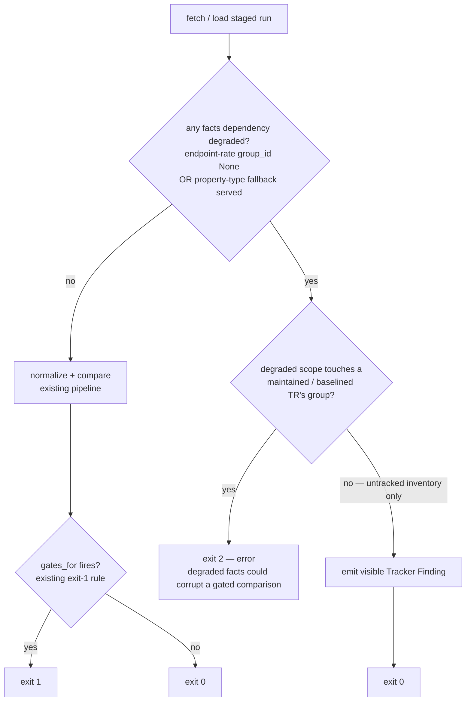

# feat: API Drift baseline truthfulness + governance closeout

## Summary

Close PR #3's maintenance-quality gaps in the API Drift Tracker (`ls-trackers`)
before tracker scope expands. Three substantive changes: surface the `token`
`scope` field by fixing a normalizer block-header rule (forcing a deliberate
`NORMALIZER_VERSION` bump and a reviewed baseline re-seed), add a support-aware
facts-outage gate that intercepts degraded fetches before they surface as
spurious drift, and record the provisional code-set seed plus carried debt as
named residuals. All work stays inside `crates/ls-trackers/`; default
verification stays network-free; operator live review stays opt-in.

This plan covers the full brainstorm scope (see origin). It carries serde
forward-compat hardening and duplicate same-code/same-group handling as
explicitly-named debt, not active work.

---

## Problem Frame

The committed **Reviewed Baseline** encodes known untruths and the gate has an
undecided failure mode (see origin):

- The `token` **Structural API Shape** omits the `scope` field. Root cause:
  `ParsedProp::is_block_header` (`crates/ls-trackers/src/api_drift.rs`, ~line
  229) treats any body row where `propertyCd == propertyNm` as a block delimiter
  and drops it. The `token` `scope` rows (request + response, length 256)
  collide because the field's code equals its label, so `scope` is dropped *and*
  the following `token_type` field is mis-filed under a phantom `scope` block.
  Logged as accepted residual **R-1**.
- A whole-inventory **facts** outage (endpoint/rate facts via a Null group
  protocol, or the property-type mapping fallback) is warned at fetch time but
  does not gate. A degraded maintained-TR fetch flows through `compare` and
  surfaces as spurious `EndpointChanged` / `RateLimitChanged` / `ProtocolChanged`
  / `FieldChanged` findings — Breaking for an implemented TR, gating at exit `1`
  with a false "removed/changed" signal. Logged as accepted residual **R-2**
  (round-2 mitigated to a count + stderr warning; the gate half was deferred).
- The code-set seed (~365 TR codes from the **Migration Source**) is provisional
  with no recorded governance stance.

Left unaddressed, the baseline lies about `token`, a degraded fetch can corrupt a
comparison the tracker is trusted to make, and the seed's provisional status is
undocumented. A distrusted opt-in tracker is an unrun tracker.

---

## Requirements Trace

| Req (origin) | Addressed by |
|---|---|
| R1 — `token` `scope` coverage | U1 (normalizer rule + version bump) |
| R2 — Reviewed Baseline refresh + fixture re-sync | U2 (re-normalize affordance), U3 (re-seed + tests) |
| R3 — support-aware facts-outage gate (per-group, pre-compare, endpoint/rate + property-type) | U4 (detection), U5 (gate + discrimination) |
| R4 — provisional seed carried visibly + named debt | U6 (governance + residuals docs) |
| R5 — network-free default stays clean | U2 (re-seed is network-free), U5 (gate fires on fetch path only); verified in every unit |
| R6 — live review stays opt-in | No Makefile default-gate change; verified in U5 |

---

## Key Technical Decisions

**KTD-1 — R1 is a normalizer-rule change, landed deliberately with R2.**
Add `&& self.length.is_none()` to `is_block_header` (block-header rows carry a
null length; real fields carry a length). This surfaces `scope` as a real field
and re-files `token_type` under `response_body`. Because normalized output
changes, bump `NORMALIZER_VERSION` (`api_drift.rs`, ~line 29) from `1` to `2`.
The `run_check` version guard already forces exit `2` on a committed-vs-staged
version mismatch, so R1 and R2 are inseparable and land together — the guard is
the mechanism that makes the deliberate re-baseline safe, not a regression.

**KTD-2 — Re-seed from committed raw evidence via a new network-free affordance.**
No committed tool re-normalizes from raw today; only a live fetch produces a
normalized run. Add a re-normalize-from-committed-raw path (reads
`baselines/api-drift/raw/ls-openapi-full.json`, writes `normalized/trs/*.json` +
`manifest.json`) so the re-seed is deterministic, reviewable, and network-free.
Rejected: re-seeding via opt-in live fetch — it touches the network, is
non-deterministic, and is harder to review against the reviewed raw evidence.

**KTD-3 — The facts-outage gate is a distinct exit-`2` decision, not an overload of
`gates_for`.** `gates_for` (`types.rs`, ~line 289) is the single source for the
exit-`1` drift rule and is reused at classify time; it must stay that. R3's
facts-outage gate is a separate, equally single-sourced exit-`2` decision keyed
on support state. It routes through the same support-state lens (does a degraded
group contain a maintained/baselined TR?) without modifying `gates_for`.

**KTD-4 — The gate intercepts before `compare`.** Degraded facts must produce the
support-aware exit (`2` for a maintained group, `0` + visible finding for
untracked-only) *before* normalization/compare turns them into spurious
structural drift. Insertion points: `fetch_and_stage` (live path, right after
the degradation count at `cli.rs` ~line 312) and `run_check` (the `--staged`
path, before `compare` at `cli.rs` ~line 281).

**KTD-4a — Membership joins on TR code, not group id.** A group is flagged
degraded *because* its `group_id` is `None` (the protocol UUID is exactly the
field that goes missing on a facts outage), so the committed
`TrShape.api_group_id` UUID is **not** a usable join key — the intersection would
always be empty. Resolve maintained-group membership by which maintained TR
**codes** appear in a degraded `RawGroup` instead: a degraded group still lists
its TRs even when its protocol facts fail. (If TR-code membership proves
insufficient, the fallback is to carry the menu `api_id` into `RawGroup` so a
degraded group retains a stable identity — but TR-code membership is the smaller
change and is preferred.)

**KTD-5 — Property-type mapping degradation needs a new detection signal.**
Endpoint/rate degradation is already observable as `group_id.is_none()`
(`facts_degraded_groups`). The property-type mapping fallback
(`PROPERTY_TYPE_FALLBACK`, `fetch.rs` ~line 31) has *no* current detection signal
— it silently substitutes raw type codes. U4 adds a fetch-time signal recording
that the mapping was served from fallback, so U5 can gate on it.

Unlike endpoint/rate degradation, the property-type mapping is a single
whole-inventory call — its fallback substitutes the hardcoded table for *every*
TR in the run, with no per-group granularity. So it does **not** route through
the untracked-only-vs-maintained branch: property-type fallback served + at least
one maintained TR present in the run → exit `2`, full stop. Only endpoint/rate
degradation participates in the per-group discrimination.

**KTD-6 — R4 ships the visibility branch only.** Mark the seed provisional
in-artifact and record it as a named residual; rely on the D5 new-TR review loop
for incremental re-attestation (no separate attestation manifest — the reviewed
commit is the evidence trail). The origin's "independent operator attestation"
branch is a deliberate de-scope for a solo-maintainer project (see origin).

---

## High-Level Technical Design

R3's gate decision, for both entry paths, intercepting before `compare`:

Maintained-group membership is resolved by which maintained TR **codes** appear
in a degraded `RawGroup` (see KTD-4a) — not by group UUID, which is `None` on the
degraded side. The discriminating case the success criteria require: a degraded
group with no maintained TR co-occurring with a degraded group that contains one
— the former contributes a finding at exit `0`, the latter forces exit `2`. The
property-type fallback (whole-inventory) does not participate in this per-group
split; it forces exit `2` whenever any maintained TR is in the run (see KTD-5).

---

## Implementation Units

### U1. Fix `is_block_header` and bump the normalizer version

- **Goal:** Surface the `token` `scope` field by correcting the block-header
  rule; mark the normalized output as a new version.
- **Requirements:** R1. Closes residual R-1.
- **Dependencies:** none.
- **Files:**
  - `crates/ls-trackers/src/api_drift.rs` (modify `ParsedProp::is_block_header`
    ~line 229; bump `NORMALIZER_VERSION` ~line 29)
  - `crates/ls-trackers/src/api_drift.rs` `#[cfg(test)]` module (add a unit test)
- **Approach:** Add `&& self.length.is_none()` to the block-header predicate so a
  body row is treated as a delimiter only when it carries a null length. Bump
  `NORMALIZER_VERSION` to `2`. Do not change field-identity or diff logic.
- **Patterns to follow:** the existing block-header handling and the synthetic
  `t8412` normalizer tests in the same `#[cfg(test)]` module; CONTEXT.md
  vocabulary in any new doc comments.
- **Test scenarios:**
  - A body row with `propertyCd == propertyNm` **and** a non-null length
    normalizes as a real field (not dropped). Input: a `scope`-like row, length
    256 → expect a `BlockField` with `field_name: "scope"`, `type: "String"`,
    `length: 256`.
  - A body row with `propertyCd == propertyNm` **and** a null length is still
    treated as a block-header (delimiter), preserving existing behavior.
  - A field following a same-code/same-label real field is filed under the
    correct block, not under a phantom block (regression guard for the
    `token_type` mis-filing).
- **Verification:** new and existing `api_drift` normalizer unit tests pass;
  `NORMALIZER_VERSION` reads `2`.

### U2. Add a network-free re-normalize-from-committed-raw affordance

- **Goal:** Produce a deterministic normalized run from the committed reviewed
  raw evidence, without a live fetch, so the baseline can be re-seeded and
  reviewed.
- **Requirements:** R2 (mechanism), R5.
- **Dependencies:** U1 (re-seed must use the v2 normalizer).
- **Files:**
  - `crates/ls-trackers/src/cli.rs` (add a subcommand/flag that reads committed
    raw and writes a normalized run via the existing `write_normalized` path
    ~line 181)
  - `crates/ls-trackers/src/cli.rs` `#[cfg(test)]` module (command-parse + happy-
    path test)
  - `Makefile` (add an opt-in target mirroring the existing `api-drift-*` targets;
    excluded from default gates)
- **Approach:** Reuse `normalize_run` over a `RawInventory` deserialized from
  `baselines/api-drift/raw/ls-openapi-full.json` instead of a fetched one. Emit
  byte-stable pretty JSON with trailing newline (existing convention). The
  affordance is operator-run and network-free; it does not fetch.
- **Patterns to follow:** existing `Command` parsing and `write_staged_run` /
  `write_normalized` persistence in `cli.rs`; the opt-in `api-drift-fetch` /
  `api-drift-check` Makefile targets and their network-free exclusion note.
- **Test scenarios:**
  - Re-normalizing the committed raw evidence yields a manifest with
    `normalizer_version: 2` and 7 maintained shapes.
  - Output is byte-stable across two runs (deterministic).
  - Command parsing maps the new subcommand/flag correctly (mirrors existing
    `parse_args` tests).
- **Verification:** the affordance writes a normalized run matching the committed
  layout; no network call occurs (no `reqwest` client constructed on this path).

### U3. Re-seed the committed baseline and assert the `token` shape

- **Goal:** Refresh the committed Reviewed Baseline so it includes `token`
  `scope`, carries `normalizer_version: 2`, and self-diffs clean; lock the
  correction with a test.
- **Requirements:** R2. Closes the R1/R2 truthfulness gap.
- **Dependencies:** U1, U2.
- **Files:**
  - `crates/ls-trackers/baselines/api-drift/normalized/trs/token.json` (and the
    other six maintained shapes if re-normalization changes their bytes)
  - `crates/ls-trackers/baselines/api-drift/normalized/manifest.json`
    (`normalizer_version` 1 → 2)
  - `crates/ls-trackers/src/cli.rs` (reconcile any `run_check` test manifest that
    hardcodes `normalizer_version: 1` — only `run_check` enforces the guard)
  - `crates/ls-trackers/tests/api_drift.rs` (add a token-shape assertion test)
- **Approach:** Run the U2 affordance to regenerate `normalized/trs/*.json` +
  `manifest.json` from committed raw. Reconcile the `cli.rs` `run_check` synthetic
  manifests that pin version `1` so the version guard does not trip (the
  `tests/api_drift.rs` manifests call `compare()` directly and never read the
  version, so they need no change). Add a test asserting `token` exposes `scope`
  (request + response, length 256) and that `token_type` sits under
  `response_body`.
- **Patterns to follow:** the committed-baseline layout under
  `baselines/api-drift/`; the in-code `TrShape` builders (`shape()` / `field()`)
  in `tests/api_drift.rs`.
- **Test scenarios:**
  - `api-drift check --staged crates/ls-trackers/baselines/api-drift` exits `0`
    with no drift (the load-bearing self-diff).
  - The new token-shape test asserts `scope` is present in both request and
    response blocks and `token_type` is under `response_body`.
  - Baseline invariants preserved: 365 codes, 7 maintained shapes, 6 implemented
    + 1 tracked-only (assert counts unchanged; only the `token` shape bytes move).
- **Verification:** `cargo test --workspace` clean; `make docs-check` clean
  (the re-seed touches `ls-trackers` baselines only, not `ls-metadata`); self-diff
  exits `0`.

### U4. Detect facts degradation, including the property-type mapping fallback

- **Goal:** Make both facts-degradation classes observable to the gate on both
  entry paths.
- **Requirements:** R3 (detection half).
- **Dependencies:** none (independent of U1–U3).
- **Files:**
  - `crates/ls-trackers/src/fetch.rs` (record when `property_type_mapping` served
    the fallback, ~line 417; expose alongside the raw inventory)
  - `crates/ls-trackers/src/types.rs` (extend `FetchReport` ~line 387 to carry the
    property-type-fallback signal next to `facts_degraded_groups`; add the set of
    **degraded TR codes** — the TRs listed under degraded groups — so U5 can join
    on code, not the missing group UUID, per KTD-4a)
  - `crates/ls-trackers/src/cli.rs` (`fetch_and_stage` ~line 312 — populate the
    new signals into the `FetchReport`)
- **Approach:** Add a boolean/enum signal for property-type fallback served, plus
  the set of degraded TR codes (collected from each `RawGroup` with
  `group_id.is_none()`). **Mechanism decision (settles the prior open question):**
  the `--staged` path reads `fetch-report.json` from the staged-run directory in
  `run_check` — this is the smaller change; it leaves the `NormalizedRun` struct
  and the committed baseline JSON layout untouched (so U3's re-seed is
  unaffected), versus folding new fields into the normalized run. `load_normalized`
  gains a sibling read of `fetch-report.json`.
- **Patterns to follow:** the existing `facts_degraded_groups` computation and
  the "do not silently degrade" stance in `committed_code_set_len`
  (`cli.rs` ~line 245); byte-stable persisted artifacts.
- **Test scenarios:**
  - A simulated property-type mapping outage (mapping API fails) sets the
    fallback-served signal; a healthy mapping does not.
  - A group with a Null protocol has its listed TR codes recorded as degraded TR
    codes (not only counted).
  - The persisted `fetch-report.json` round-trips the degradation signals so
    `--staged` (via `run_check` reading the report) can gate without a network
    call.
- **Verification:** `httpmock`-backed fetch tests assert both signals populate;
  no live network in default tests.

### U5. Support-aware facts-outage gate (pre-compare, per-group)

- **Goal:** Gate degraded fetches by support state before compare, with the
  discriminating per-group outcome.
- **Requirements:** R3 (gate half), R5, R6. Closes residual R-2.
- **Dependencies:** U4. (Independent of U1–U3.)
- **Files:**
  - `crates/ls-trackers/src/cli.rs` (`fetch_and_stage` and `run_check` — insert
    the pre-compare gate; extend `Exit` mapping as needed)
  - `crates/ls-trackers/src/types.rs` or `api_drift.rs` (a single-sourced pure
    helper deciding facts-outage exit from degraded TR codes + property-type
    fallback flag vs maintained TR codes; a `DriftFinding` for the untracked-only
    visible finding)
  - `crates/ls-trackers/tests/api_drift.rs` (gate acceptance tests)
- **Approach:** Take the degraded TR codes (endpoint/rate) and the property-type
  fallback signal from U4. Join the degraded TR codes against the maintained TR
  codes (KTD-4a) — not group UUIDs. If any degraded TR code is a maintained TR,
  exit `2` before compare; if degradation is confined to untracked codes, emit a
  visible Tracker Finding and exit `0`. The property-type fallback is whole-
  inventory (KTD-5): served + any maintained TR in the run → exit `2`, with no
  untracked-only branch. Keep this a distinct decision from `gates_for` (KTD-3).
  No Makefile default-gate change.
- **Execution note:** Start with the discriminating acceptance test (degraded
  untracked-only group exits `0` + finding; co-degraded maintained group exits
  `2`) before wiring the gate, so the per-group contract is pinned first.
- **Patterns to follow:** `gates_for` as the model for a single-sourced pure gate
  decision; the support-state lens in the existing U4 acceptance tests
  (`tests/api_drift.rs`); `httpmock` + base-URL injection, no live network.
- **Test scenarios:**
  - **Covers the R3 discriminating case.** A degraded group containing no
    maintained TR exits `0` with a visible finding; a co-occurring degraded group
    containing a maintained TR exits `2`.
  - A property-type mapping outage affecting a maintained TR exits `2` — not a
    false `FieldChanged` at exit `1`.
  - An endpoint/rate outage on a maintained TR's group exits `2` before compare —
    no spurious `EndpointChanged` / `RateLimitChanged` / `ProtocolChanged` finding
    is produced.
  - A clean fetch is unaffected: existing drift findings and exit codes are
    unchanged (regression guard that the gate only fires on degradation).
  - The `--staged` path reaches the same gate decision from a persisted degraded
    run, with no network call.
- **Verification:** all facts-gate scenarios pass; clean-fetch behavior unchanged;
  network-free default test run stays network-free.

### U6. Governance: provisional seed marker and named residuals

- **Goal:** Record the seed's provisional status and the carried debt as named,
  tracked residuals.
- **Requirements:** R4.
- **Dependencies:** U1 (the version bump is the trigger to re-document the serde
  residual).
- **Files:**
  - `crates/ls-trackers/baselines/api-drift/code-set.json` (confirm/keep
    `provisional: true`)
  - `crates/ls-trackers/baselines/api-drift/SEED-ATTESTATION.md` (update to state
    the seed remains provisional and re-attestation runs through the D5 new-TR
    loop)
  - `docs/residual-review-findings/feat-api-drift-real-fetch.md` (mark R-1 and R-2
    closed by this PR; re-affirm R-3 duplicate same-code/group and R-4 serde
    forward-compat as named, carried residuals)
- **Approach:** No code behavior change. Keep the `provisional` flag set; document
  that the visibility branch (not independent attestation) is the recorded
  governance stance. Re-document R-4 (serde): since U1 performs the first
  `NORMALIZER_VERSION` bump — R-4's original deferral trigger — state explicitly
  why the serde hardening remains safe to defer under v2 rather than pulling it
  forward.
- **Patterns to follow:** the existing residual-review-findings format and the
  KTD-5 re-attestation narrative.
- **Test scenarios:** `Test expectation: none — documentation and a persisted
  flag only, no behavioral change.`
- **Verification:** `code-set.json` `provisional` is `true`; residuals doc marks
  R-1/R-2 closed and R-3/R-4 carried with the v2-bump safety note; self-diff still
  exits `0`.

---

## Scope Boundaries

### In scope

- R1–R6 as traced above, all within `crates/ls-trackers/`.

### Deferred to Follow-Up Work — carried as named debt

- **R-4 — serde forward-compat hardening** (`#[serde(default)]` / `#[serde(other)]`).
  Re-documented under U6 with the rationale for remaining safe under the v2 bump.
- **R-3 — duplicate same-code/same-group edge handling** (last-wins reconcile can
  emit a false `Breaking` "field removed").

### Out of scope — unchanged from prior decisions

- No automatic baseline promotion (R2 is a one-time reviewed correction; ADR 0005
  keeps promotion review-gated).
- No expansion of structural baselining to untracked TRs (ADR 0004 — full
  inventory awareness via code-set, not full structural diff).
- No Recommended TR promotion, order runtime, or Specification Document Tracker.
- No scheduled cron/CI automation; no rename fingerprinting.
- Independent operator attestation of the seed (deliberate de-scope; see origin).

---

## Risks & Dependencies

- **Re-normalization changes more than `token`.** If re-normalizing from committed
  raw moves bytes in other maintained shapes, U3 must commit those too and the
  self-diff still must exit `0`. Mitigation: review the full `normalized/trs/`
  diff in U3, not just `token.json`; assert invariant counts.
- **Version-guard tripwire in `run_check` tests.** Only `run_check` (`cli.rs`)
  enforces the normalizer-version guard; its tests construct both committed and
  staged sides, so any hardcoded `normalizer_version: 1` there must move to `2` in
  the same change. Note `tests/api_drift.rs` calls `compare()` directly, which
  never reads `normalizer_version` — those manifests do not trip the guard, so no
  reconciliation is needed there. Mitigation: U3 updates the `cli.rs` test
  manifests alongside the committed baseline.
- **`--staged` path lacks degradation context today.** `load_normalized` does not
  read `fetch-report.json`. Mitigation: U4 has `run_check` read `fetch-report.json`
  from the staged-run directory (see U4 mechanism decision), leaving the baseline
  JSON layout untouched.
- **Property-type fallback detection is net-new.** No current signal exists.
  Mitigation: U4 adds it before U5 depends on it.

---

## Open Questions (deferred to implementation)

- Exact serde representation of the degraded-TR-code set and the property-type
  fallback flag on `FetchReport` (the join is on TR code per KTD-4a; the precise
  field types are a U4 detail resolved against the code).
- Whether re-normalization perturbs non-`token` shapes — knowable only by running
  the U2 affordance against committed raw in U3.

---

## Sources & Research

- Origin requirements: `docs/brainstorms/2026-06-16-api-drift-truthfulness-closeout-requirements.md`
- Accepted residuals (R-1…R-4): `docs/residual-review-findings/feat-api-drift-real-fetch.md`
- PR #3 design decisions (D1/D3 exit contract, KTD-5 re-attestation, fixture
  conventions): `docs/plans/2026-06-16-002-feat-api-drift-real-fetch-plan.md`
- Scope pressure-test (D1–D6) and ADRs 0004/0005:
  `docs/brainstorms/2026-06-16-api-drift-scope-pressure-test-requirements.md`,
  `docs/adr/0004-complete-tracking-selective-sdk-implementation.md`,
  `docs/adr/0005-staged-snapshots-for-change-tracking.md`
- Committed baseline invariants: `docs/plans/2026-06-16-003-post-pr3-migration-status-what.md`
- Vocabulary: `CONTEXT.md`
- Key code anchors: `crates/ls-trackers/src/api_drift.rs` (`is_block_header`,
  `NORMALIZER_VERSION`, `normalize_tr_shape`, `compare`), `src/fetch.rs`
  (`property_type_mapping`, `PROPERTY_TYPE_FALLBACK`, `group_protocol`),
  `src/cli.rs` (`fetch_and_stage`, `run_check`, `Exit`, version guard),
  `src/types.rs` (`FetchReport`, `TrShape`, `gates_for`), baselines under
  `crates/ls-trackers/baselines/api-drift/`
