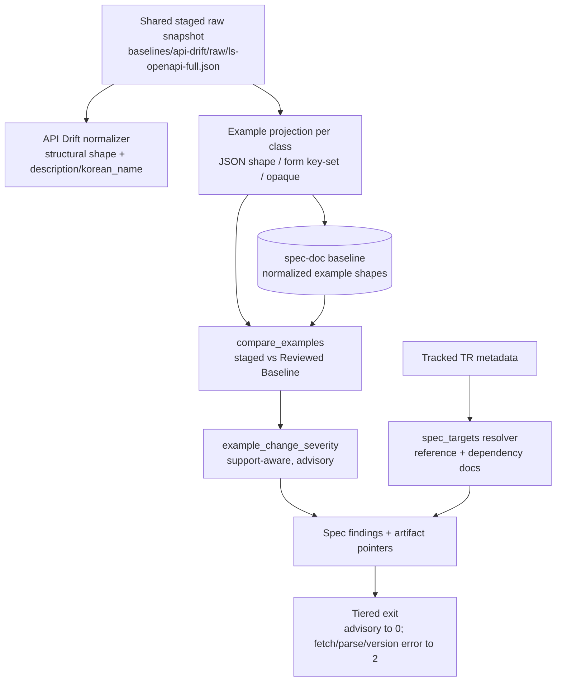

# feat: Specification Document Tracker — example drift and advisory artifact pointers

## Summary

Add a **Specification Document Tracker** to `crates/ls-trackers` that reuses the staged OpenAPI snapshot the API Drift Tracker already fetches, projects request/response **examples** (a facet the current normalizer never reads), and emits support-aware advisory findings that point at the maintained SDK artifacts a changed TR touches. It mirrors the API Drift Tracker's normalize → baseline → compare → tiered-exit machinery and reuses the shared exit gate, so the trusted tracker stays untouched.

---

## Problem Frame

The API Drift Tracker (PR #3/#4) is trustworthy for structural change and already emits description and `korean_name` changes as informational findings — those are not a blind spot. Two gaps remain (see origin: `docs/brainstorms/2026-06-16-specification-document-tracker-requirements.md`): request/response examples are staged but never diffed, and nothing maps an upstream change to the maintained SDK artifacts built on it.

Research confirms the leverage point: `crates/ls-trackers/src/fetch.rs:226-227` already carries `req_example`/`res_example` on every `RawTr`, and the committed snapshot `crates/ls-trackers/baselines/api-drift/raw/ls-openapi-full.json` populates them for 355/365 (req) and 344/365 (res) TRs. `normalize_run` (`crates/ls-trackers/src/api_drift.rs:67`) never touches those fields, so examples are latent signal. This tracker projects exactly that facet.

---

## Requirements

Carried from origin (`docs/brainstorms/2026-06-16-specification-document-tracker-requirements.md`); each maps to a unit below.

**Example projection**

- R1. Consume the same staged snapshot the API Drift Tracker fetches; no new fetch source or network path. (U1, U4)
- R2. Project request/response examples into a normalized view; compare per payload class — shape-diff for JSON (ignore sample-value churn), key-set diff for form-encoded, informational-only for non-parseable. (U1)
- R3. A reviewed example baseline covers the full upstream inventory — every TR carrying an example — so an untracked TR's in-place example change is detectable; refreshed only by operator-run human review, no automatic promotion. (U4, U5)

**Artifact pointer**

- R4. Resolve a Tracked TR to its referencing artifacts through a TR→artifact map; the first version covers naming-convention-derivable artifacts — reference docs for Implemented TRs, TR Dependency Docs for all Tracked TRs. (U3)
- R5. An example change on any TR emits a support-aware advisory finding; for a Tracked TR it points at that TR's resolved artifacts. (U2, U3)
- R6. Severity is support-aware by tracked/implemented/recommended; an untracked-only example change is a visible non-gating finding. (U2)
- R7. A finding is informational-only, no pointer, when the map resolves no artifact for the TR. (U2, U3)
- R8. A finding becomes an SDK Maintenance Work Item only after human review; the tracker never mutates code, docs, metadata, examples, or baselines. (U4, U7)

**Verification posture**

- R9. Ordinary verification stays network-free; a per-example parse failure is a non-gating informational finding, not a gating error. (U2, U4, U6)
- R10. Document review is operator-run and opt-in; no scheduled cron or CI automation. (U4, U7)
- R11. SDK reference docs stay generated from maintained behavior and metadata; the tracker flags drift, it does not mirror upstream text. (U7)

---

## Key Technical Decisions

- KTD1. **Mirror the API Drift Tracker and reuse the shared gate.** Build `src/spec_doc.rs` parallel to `src/api_drift.rs`, and reuse `Severity`, `SupportState`/`from_support`/`is_maintained`, `gates_for` (`src/types.rs:289`), and the CLI `Exit`/`exit_for`/`parse_staged`/`write_json` machinery verbatim. The exit contract is single-sourced; do not fork it.
- KTD2. **Separate `spec-doc` baseline tree with its own `EXAMPLE_NORMALIZER_VERSION`, reusing the shared raw snapshot.** Examples live only in `baselines/api-drift/raw/ls-openapi-full.json`; the new normalized example baseline lives under `baselines/spec-doc/` and reads that shared raw. This keeps the trusted API Drift normalized baseline untouched and gives the example projection an independent re-baseline cadence.
- KTD3. **Per-payload-class comparison, noise-controlled.** JSON examples → shape-diff via the existing leaf-path walker (`src/stages.rs:61`), discarding scalar sample values so churn is ignored; form-encoded (`token`, `revoke`) → key-set diff; non-parseable → informational-only. Strip volatile values (timestamps, tokens, account numbers, secrets) so the baseline reaches a clean self-diff. A noisy advisory tracker is an unrun tracker — noise control is a requirement, not a later optimization.
- KTD4. **Advisory, non-gating signal kept distinct from `gates_for`.** Example changes never set the exit gate; `report.gates()` is false for all example findings by construction. Only a snapshot-level fetch/parse/version error exits 2. Route example severity through the support-state lens but in a separate `example_change_severity`, not by overloading the drift classifier.
- KTD5. **TR→artifact resolver is a tracker-local pure function.** `spec_targets` mirrors the conventions in `src/stages.rs:222` and `crates/ls-docgen/src/lib.rs` — `docs/reference/{tr}.md` only when `support.implemented`, `docs/tr-dependencies/{tr}.md` for every Tracked TR. No `ls-metadata` schema change. SDK-example and Focused-Evidence registration is deferred: Focused Evidence attaches only to a Recommended TR, of which there are zero today, so that tier routes to an empty set. The first promotion of a TR to Recommended is the trigger to revisit.
- KTD6. **Set serde forward-compat posture on the new baseline from day one.** The new persisted example types carry `#[serde(default)]` on optional fields, heeding the carried R-4 residual (`docs/residual-review-findings/feat-api-drift-real-fetch.md`) whose named trigger — a new persisted baseline before the first normalizer bump — fires here.
- KTD7. **No example value ever reaches a committed artifact or a printed finding.** The `token`, `revoke`, and `S3_` examples embed real-looking credentials (`appkey`, `appsecretkey`, JWTs). The baseline writer's input type is `ExampleShape` (path→`FieldShape` / key-set), never a raw `serde_json::Value`, so the compiler rejects writing an unprocessed payload; `SpecChange` variants carry only structural descriptors, never raw example strings or scalar values; and `SEED-ATTESTATION.md` requires a clean self-diff (zero findings) before any baseline file is committed, so no pre-convergence intermediate write can land secrets in git. The full-inventory baseline (KTD8) widens this surface to every example, making the type-level guarantee load-bearing rather than incidental.
- KTD8. **The example baseline covers the full inventory, not maintained-only.** Every TR carrying an example is projected and baselined (~355 req / 344 res shapes), so an untracked TR's in-place example-shape change is detectable as a visible non-gating finding (R6/AE2), not just its appearance/disappearance from inventory. This un-defers untracked example baselining; the cost is a larger committed baseline and a wider volatile-stripping surface to keep the self-diff clean. The artifact-pointer tier stays maintained-only — untracked findings carry no pointer (R7), since untracked TRs have no reference or dependency docs.

---

## High-Level Technical Design

One staged snapshot feeds two non-overlapping lenses; the example lens is net-new and never gates.

---

## Implementation Units

### U1. Example projection and normalizer

- **Goal:** Project request/response examples from every TR carrying an example in the staged raw snapshot into normalized example shapes, per payload class, with volatile values stripped, under a dedicated normalizer version.
- **Requirements:** R1, R2
- **Dependencies:** none
- **Files:** `crates/ls-trackers/src/spec_doc.rs` (new), `crates/ls-trackers/src/types.rs` (add `ExampleShape`), `crates/ls-trackers/src/lib.rs` (module wiring)
- **Approach:** Mirror `normalize_run`/`normalize_tr_shape` (`src/api_drift.rs:67`, `:103`). Walk `RawInventory` groups→TRs over every TR carrying a non-empty example (skip empty examples), read `req_example`/`res_example`. The projection is full-inventory (KTD8); support state is attached per TR for severity, not used to filter the projection. Classify each example: JSON-parseable → parse to `Value` and reuse the leaf-path walker (`src/stages.rs:61`) to build a `path → FieldShape` map, discarding scalar sample values; form-encoded string → split into a key-set; non-parseable → mark opaque (no shape). Strip volatiles defensively. Introduce `EXAMPLE_NORMALIZER_VERSION` recorded in the example manifest.
- **Technical design (directional):** `ExampleShape { tr_code, req: ExampleFacet, res: ExampleFacet }` where `ExampleFacet = Json { shape: BTreeMap<path, FieldShape> } | Form { keys: BTreeSet<String> } | Opaque`. Serde types carry `#[serde(default)]` on optional fields (KTD6).
- **Patterns to follow:** `src/api_drift.rs` `normalize_run` (:67), `normalize_tr_shape` (:103), `NORMALIZER_VERSION` (:33); `src/stages.rs` `collect_paths` (:61).
- **Execution note:** Start with the AE4/AE5 normalization tests — noise control is the load-bearing property — then implement the projection to satisfy them.
- **Test scenarios:**
  - Covers AE4. A JSON example whose structure is unchanged but a sample value (timestamp, account number) differs normalizes to the identical `ExampleShape`.
  - A JSON example with an added field normalizes to a shape carrying the new path.
  - Covers AE5. The `token` form-encoded request example normalizes to a key-set; adding a key changes it; changing only a secret value does not.
  - A free-text / non-parseable example normalizes to `Opaque` with no shape.
  - `normalize_example_run` over the committed raw yields an example shape for every TR carrying an example (~355 req / 344 res), including the 7 Tracked TRs (`token`, `revoke`, `t1102`, `t8412`, `CSPAQ12200`, `S3_`, `CSPAT00601`); a TR with no example produces no shape.
- **Verification:** Projection is deterministic over the committed raw; per-class unit tests pass; `cargo test -p ls-trackers` green.

### U2. Spec finding model and comparison

- **Goal:** Compare a staged example projection against the **Reviewed Baseline** and emit support-aware, advisory (non-gating) findings.
- **Requirements:** R5, R6, R7, R9
- **Dependencies:** U1
- **Files:** `crates/ls-trackers/src/types.rs` (`SpecChange`, `SpecFinding`), `crates/ls-trackers/src/spec_doc.rs` (`SpecReport`, `compare_examples`, `example_change_severity`, `make_spec_finding`)
- **Approach:** Mirror `DriftChange`/`DriftFinding`/`DriftReport` and `compare`/`change_severity`/`make_finding` (`src/api_drift.rs:443`, `:549`, `:603`); `SpecReport` lives in `spec_doc.rs` next to `compare_examples`, matching `DriftReport`'s location in `api_drift.rs:334`. `SpecChange` variants: `ExampleAdded`, `ExampleRemoved`, `ExampleShapeChanged`, `ExampleKeySetChanged`, `ExampleUnparseable`. Each variant carries only structural descriptors — path names, key names, `FieldShape` — never a raw example string or scalar value (KTD7), following the `DescriptionChanged { location }` template. `example_change_severity` maps change + `SupportState` to `Severity`; every example change is advisory and sets `gates: false` (KTD4) — reuse `SupportState`/`is_maintained` and the existing `Severity` enum. `SpecReport { findings, coverage }`; `.gates()` is false for all example findings.
- **Patterns to follow:** `src/types.rs` `DriftChange` (:445), `DriftFinding` (:520), `Severity` (:128), `gates_for` (:289); `src/api_drift.rs` `DescriptionChanged` emission (:657, :722) as the advisory-finding template.
- **Test scenarios:**
  - A shape change on an implemented TR (`t1102`) emits a finding at advisory severity with `gates == false`.
  - Covers AE2. An example change on an untracked TR emits a visible finding; `report.gates()` is false.
  - A key-set change on `token` emits an `ExampleKeySetChanged` finding.
  - No example change, regardless of support state, sets `gates` true; `report.gates()` stays false.
- **Verification:** `compare_examples` over baseline/candidate fixtures yields the expected findings and severities; the report never gates on example changes.

### U3. TR→artifact resolver (tier-a pointer)

- **Goal:** Resolve a changed Tracked TR to its naming-convention-derivable maintained artifacts and attach them to the finding; informational-only when none resolve.
- **Requirements:** R4, R5, R7
- **Dependencies:** U2
- **Files:** `crates/ls-trackers/src/spec_doc.rs` (`spec_targets`), `crates/ls-trackers/src/types.rs` (`SpecFinding` pointer field)
- **Approach:** Pure function `spec_targets(tr_code, &TrMetadata) -> Vec<ArtifactRef>`: `docs/tr-dependencies/{tr}.md` for every Tracked TR; `docs/reference/{tr}.md` only when `support.implemented`, mirroring `ls-docgen`'s `REFERENCE_DOCS_DIR` implemented-only filter and `DEPENDENCY_DOCS_DIR` (`crates/ls-docgen/src/lib.rs`). No `ls-metadata` schema change. SDK-example and Focused-Evidence registration return nothing (deferred, KTD5). Populate `SpecFinding.pointers`; empty → informational-only (R7).
- **Patterns to follow:** `src/stages.rs` `promote_targets` (:222); `crates/ls-docgen/src/lib.rs` `DEPENDENCY_DOCS_DIR` / `REFERENCE_DOCS_DIR` and the `support.implemented` filter.
- **Test scenarios:**
  - Covers AE1. An Implemented TR (`t1102`) resolves to its reference doc and dependency doc; the finding carries both pointers.
  - A Tracked-only TR (`CSPAT00601`) resolves to its dependency doc only.
  - Covers AE3. A Tracked TR whose resolution yields no artifact (synthetic metadata fixture, since every real maintained TR resolves at least a dependency doc) → informational-only, no pointer.
- **Verification:** `spec_targets` returns the implemented-vs-tracked-correct artifact set against real metadata (`validate_dir` over `metadata/`); pointer attachment is reflected in findings.

### U4. CLI subcommand, baseline storage, re-seed path

- **Goal:** Add `spec-doc check --staged`, wire example baseline write/load and a network-free re-seed from the shared raw snapshot, print findings, and map to tiered exits.
- **Requirements:** R1, R3, R8, R9, R10
- **Dependencies:** U1, U2, U3
- **Files:** `crates/ls-trackers/src/cli.rs` (`Command::SpecCheck`, `parse_args` arm, `dispatch` arm, `run_spec_check`, `write_example_baseline`/`load_example_baseline`, `print_spec_report`, `spec_baseline_dir` in `Paths`), `crates/ls-trackers/src/lib.rs`
- **Approach:** Mirror `Command::Check`/`run_check`/`print_report`/`exit_for` (`src/cli.rs:280`, `:586`, `:522`). Extend the `parse_args` first-token match (`:96`) with `Some("spec-doc")`; reuse `parse_staged`. `run_spec_check` loads the **Reviewed Baseline** (the committed `baselines/spec-doc/`) and re-projects the staged side from the staged raw snapshot, runs `compare_examples`, prints. Until a real staged fetch exists, `--staged DIR` points at the spec-doc baseline dir and the staged side re-projects the shared committed raw (`renormalize_committed` analogue reading `baselines/api-drift/raw/ls-openapi-full.json`), so the check is a self-diff; the `--staged` slot is the seam where a future staged raw snapshot plugs in. `spec_baseline_dir` defaults to `crates/ls-trackers/baselines/spec-doc`. A version-mismatch guard exits 2 (mirror `:329`). Example findings are advisory, so `exit_for` returns `Ok` unless a load/parse/version error (`Error = 2`). No automatic promotion (R3); no scheduled automation (R10).
- **Patterns to follow:** `src/cli.rs` `Exit` (:32), `exit_for` (:522), `run_check` (:280), `write_normalized`/`load_normalized` (:197, :219), `renormalize_committed` (:415), `Paths` (:73).
- **Test scenarios:**
  - `parse_args` parses `spec-doc check --staged <dir>` and rejects unknown `spec-doc` subcommands. Add this as a new test; the existing `spec-drift`-rejection assertion (`cli.rs:695`) stays unchanged — `spec-drift` is still an unknown first token after `spec-doc` is added.
  - `run_spec_check` against a clean Reviewed Baseline (self) exits 0 with no findings.
  - A simulated `EXAMPLE_NORMALIZER_VERSION` mismatch exits 2.
  - Covers AE1, AE2. A candidate carrying a Tracked-TR example change exits 0 with a visible advisory finding plus pointer; an untracked-only change exits 0 with a visible finding.
- **Verification:** The subcommand parses and dispatches; tiered exits are correct; no network access on the check path.

### U5. Seed the committed spec-doc baseline (clean self-diff)

- **Goal:** Generate and commit the initial reviewed example baseline for the full upstream inventory (every TR carrying an example), reusing the shared raw snapshot, achieving a clean self-diff.
- **Requirements:** R3; Success Criteria
- **Dependencies:** U4
- **Files:** `crates/ls-trackers/baselines/spec-doc/normalized/manifest.json`, `crates/ls-trackers/baselines/spec-doc/normalized/trs/{code}.json` for every TR carrying an example (~355), `crates/ls-trackers/baselines/spec-doc/code-set.json`, `crates/ls-trackers/baselines/spec-doc/SEED-ATTESTATION.md`
- **Approach:** Run the re-seed path (U4) over `baselines/api-drift/raw/ls-openapi-full.json` to project the full-inventory example shapes and commit them; reuse the shared raw, do not duplicate it. Strip volatiles so `spec-doc check --staged` against the same raw yields zero findings — across the whole inventory, so the volatile-stripping must hold for all payload classes, not just the 7 Tracked examples. Author `SEED-ATTESTATION.md` mirroring the API Drift one, marking the seed provisional, recording the review, and carrying a checklist item requiring a clean self-diff before any baseline file is committed (KTD7 — the seed examples embed real credentials, so no pre-convergence write may land). Budget for normalizer iteration to reach a clean self-diff — the API Drift baseline only got there after a dedicated closeout pass.
- **Patterns to follow:** `crates/ls-trackers/baselines/api-drift/` layout and `SEED-ATTESTATION.md`.
- **Test expectation:** none — the baseline is data, not behavior; its correctness is the self-diff assertion in U6.
- **Verification:** `spec-doc check --staged crates/ls-trackers/baselines/spec-doc` exits 0 with no findings; the manifest records `EXAMPLE_NORMALIZER_VERSION`, 365 upstream, and the count of TRs carrying examples (~355).

### U6. Acceptance and self-diff tests with fixtures

- **Goal:** Lock the AE1–AE5 behaviors and the clean-self-diff bar with fixture-backed, network-free tests.
- **Requirements:** all (verification); Success Criteria
- **Dependencies:** U4, U5
- **Files:** `crates/ls-trackers/tests/spec_doc.rs` (new), `crates/ls-trackers/tests/fixtures/{tr}_example_baseline.json`, `crates/ls-trackers/tests/fixtures/{tr}_example_candidate.json`
- **Approach:** Mirror the AE-named tests in `tests/api_drift.rs` and the fixture loading in `tests/classify.rs`. Use the `authored_trs()`/`validate_dir` helper over real `metadata/` for support states. Assert via `exit_for` vs `Exit` and on `report.gates()` / `SpecChange` variants / `.severity` / pointer presence.
- **Patterns to follow:** `crates/ls-trackers/tests/api_drift.rs` (AE-named tests, `baseline_dir()`, `read_committed`), `crates/ls-trackers/tests/classify.rs` (fixture `include_str!` loading).
- **Test scenarios:**
  - Covers AE1. Implemented-TR JSON example shape change → advisory finding naming reference + dependency doc, exit 0.
  - Covers AE2. Untracked-only example change → visible finding, exit 0.
  - Covers AE3. Tracked TR with no resolvable artifact (synthetic metadata) → informational-only, no pointer.
  - Covers AE4. JSON sample-value churn → no finding.
  - Covers AE5. `token` form-encoded: key added → finding; secret value changed → no finding; non-parseable example → informational, exit 0.
  - Clean self-diff: committed `spec-doc` baseline vs itself → zero findings, exit 0.
- **Verification:** `cargo test --workspace` green; the new tests require no network.

### U7. Operator wiring and runbook

- **Goal:** Expose opt-in operator targets for the tracker and document the review workflow, keeping default verification network-free.
- **Requirements:** R8, R10, R11
- **Dependencies:** U4
- **Files:** `Makefile` (`spec-doc-check` / `spec-doc-fetch` / `spec-doc-renormalize` targets, excluded from default and CI gates), `docs/tr-dependencies/index.md` or a maintenance runbook note
- **Approach:** Mirror the `api-drift-*` Make targets (`Makefile:70-87`), keeping them out of default/CI gates so ordinary verification stays network-free. Add a runbook note: document review is operator-run and opt-in, findings are advisory and become SDK Maintenance Work Items only after human review (R8), and SDK docs stay generated from metadata (R11) — the tracker resolves to existing doc paths, it does not generate docs.
- **Patterns to follow:** `Makefile` `api-drift-*` targets and the network-free CI header (`:62`).
- **Test expectation:** none — Makefile and runbook wiring with no behavioral change; the underlying command path is covered by U4 and U6.
- **Verification:** `make spec-doc-check` runs the tracker; the default `make` and CI paths are unchanged and network-free.

---

## Scope Boundaries

### Deferred for later (from origin)

- A staleness-comparison engine that parses maintained artifacts to prove a specific upstream/SDK mismatch.
- Registering SDK example artifacts and Focused Evidence claims in the TR→artifact map — deferred until the first Recommended TR exists (KTD5).
- Enriching API Drift's existing description/`korean_name` findings with the artifact pointer.
- Any automatic mutation or promotion of SDK docs, metadata, examples, or baselines.

### Outside this tracker's identity (from origin)

- Re-detecting description or `korean_name` changes — owned by the API Drift Tracker.
- Tracking upstream "metadata" or "operations notes" as separate documentation facets.
- Tracking a separate documentation corpus or the rendered per-TR markdown.
- Mirroring upstream documentation as product documentation.
- Scheduled cron or CI automation.
- The migration closeout (mark `korea-broker-sdk-ls` migration-source-only).

### Deferred to Follow-Up Work (plan-local)

- After this lands, capture a consolidated `docs/solutions/` entry via `/ce-compound` on "building a second change-tracker baseline + clean self-diff" — the tracker-design learnings are currently scattered across ADRs, residual-findings, and brainstorms.
- Revisit serde forward-compat hardening across both baselines if a second normalizer bump arrives (carried R-4).

---

## Risks & Dependencies

- **Clean self-diff for examples is net-new, over the whole inventory.** The full-inventory baseline (KTD8, ~355 shapes) means the volatile-stripping must reach exit 0 across all payload classes, not just the 7 Tracked examples — a materially larger surface than a maintained-only seed. Mitigation: U5 budgets the iteration; U6's self-diff test gates it; if a payload class can't be made clean, the brainstorm's "reconsider that class" exit applies.
- **Heterogeneous payloads can hide real change.** Only `token`/`revoke` are form-encoded, plus a handful of free-text examples; the non-parseable path must mark opaque explicitly, never silently drop a key (the R-1-class trap in `docs/residual-review-findings/feat-api-drift-real-fetch.md`). Mitigation: explicit `Opaque`/informational handling and per-class tests.
- **Carried residuals apply to the new baseline.** Duplicate same-code keying (R-3) and serde forward-compat (R-4) recur for the new persisted artifact. Mitigation: KTD6 sets serde posture; key by TR code with the same dedup caution as `normalize_run`.
- **Dependency on the shared raw snapshot.** The tracker reads `baselines/api-drift/raw/ls-openapi-full.json`, produced by the API Drift staging path; it assumes that snapshot is present and current.

---

## Open Questions

Deferred to implementation — resolved against real code/data, not blocking:

- Whether the JSON example shape reuses `stages::collect_paths` verbatim or needs an example-specific walker — decided against the real example payloads in U1. Reuse requires exposing `collect_paths`/`record` as `pub(crate)` (they are private today) or copying the walker.
- The exact volatile-stripping rules to reach a clean self-diff — discovered against the 7 real examples in U5.
- Whether `EXAMPLE_NORMALIZER_VERSION` starts at 1 independently (default) or shares the API Drift constant — default independent, per KTD2.

---

## Sources & Research

- Origin requirements: `docs/brainstorms/2026-06-16-specification-document-tracker-requirements.md`.
- Tracker template and seams: `crates/ls-trackers/src/api_drift.rs` (`normalize_run` :67, `NORMALIZER_VERSION` :33, `compare` :443, `change_severity` :549, `DescriptionChanged` :657/:722), `crates/ls-trackers/src/types.rs` (`Severity` :128, `SupportState` :238, `gates_for` :289, `DriftFinding` :520), `crates/ls-trackers/src/cli.rs` (`parse_args` :96, `run_check` :280, `exit_for` :522, `renormalize_committed` :415), `crates/ls-trackers/src/stages.rs` (`collect_paths` :61, `promote_targets` :222), `crates/ls-trackers/src/fetch.rs` (`req_example`/`res_example` :226-227).
- Example data: committed `crates/ls-trackers/baselines/api-drift/raw/ls-openapi-full.json` populates examples for 355/365 req and 344/365 res TRs; the normalized baseline stores none.
- Artifact-path conventions: `crates/ls-docgen/src/lib.rs` (`DEPENDENCY_DOCS_DIR`, `REFERENCE_DOCS_DIR`, implemented-only reference filter); existing `docs/reference/*.md` (6 implemented) and `docs/tr-dependencies/*.md` (7 tracked).
- Prior learnings: `docs/residual-review-findings/feat-api-drift-real-fetch.md` (R-1 silent field drop, R-3 same-code keying, R-4 serde forward-compat); `docs/adr/0005-staged-snapshots-for-change-tracking.md` (staged snapshots, advisory findings, promote-after-review); `docs/adr/0003-per-tr-maintenance-metadata-with-routing-index.md` (routing index for the TR→artifact map); the API Drift truthfulness closeout `docs/plans/2026-06-16-004-feat-api-drift-truthfulness-closeout-plan.md` (normalizer-version guard, network-free re-seed, clean-self-diff bar).
