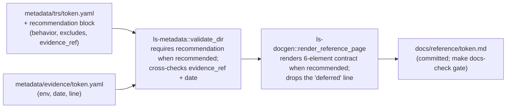

# feat: Migration legibility and the `token` recommendation contract

## Summary

Make the post-PR7 state legible to anyone arriving without the internal plans, via
three coupled documentation moves from the origin requirements doc:

1. A migration closeout notice in `korea-broker-sdk-ls` so the old repository stops
   presenting itself as the active full SDK (origin item #1).
2. A top-level `README.md` in `korea-adapter-sdk-ls` stating the maintained,
   selective, evidence-based SDK contract (origin item #2).
3. A real **Recommended TR** contract for `token`, realized through a generic
   `recommendation` block in the `ls-metadata` schema and rendered by `ls-docgen`,
   replacing the stale "schemas deferred until recommended status" line that
   `docs/reference/token.md` still carries even though `token` is now recommended
   (origin item #3).

No SDK runtime behavior, tracker logic, or evidence-freshness *enforcement* changes
here — revocation conditions are rendered as stated policy only (origin #4 stays
deferred).

---

## Problem Frame

PR #7 made `token` the first **Recommended TR** and rewrote the freshness policy to
state the truth, but the project's outward-facing surface still misleads in three
places, each able to misdirect future work (see origin: `docs/brainstorms/2026-06-16-migration-legibility-and-token-contract-requirements.md`):

- **Ownership is ambiguous.** `korea-broker-sdk-ls` still reads like an active full
  `ls-sdk` with 365 typed TRs, so a contributor can restart in the wrong repository.
- **No front door.** `korea-adapter-sdk-ls` has no top-level `README.md` (verified);
  the product stance is only legible by reading `docs/plans/`.
- **No recommendation contract.** `ls-docgen`'s `render_reference_page`
  (`crates/ls-docgen/src/lib.rs:389`) emits the line _"Request/response schemas and
  verified examples are deferred until this TR reaches recommended status…"_
  **unconditionally** — so `token`'s page asserts deferral despite being recommended.

These three are one theme (legibility), individually small, and the origin sequences
them ahead of the heavier durability engines (freshness enforcement, tracker→work-item
workflow), which stay out of scope here.

---

## Requirements Traceability

Carried from the origin requirements doc; R-IDs are the origin's.

| Origin requirement | Where addressed |
|---|---|
| R1–R3 — closeout notice in `korea-broker-sdk-ls` | U1 |
| R4–R8 — README orientation, no 365-TR revival | U2 |
| R9 — six-element Recommended-TR contract | U3 (schema), U4 (render) |
| R10 — token's narrow paper-OAuth claim, cites evidence + date | U5 |
| R11 — revocation conditions stated as policy, not enforced | U4, U5 |
| R12 — explicit non-claims (no prod creds, edge cases, broader auth) | U3, U5 |
| R13 — contract from metadata + generator; stale "deferred" line removed for recommended TRs; regenerates via `make docs` | U3, U4, U5 |
| AE1–AE2 (closeout/README reader outcomes) | U1, U2 |
| AE3–AE5 (token page contract, policy-not-enforced, regeneration) | U4, U5 |

---

## Key Technical Decisions

- **KTD1 — Generic `recommendation` schema block, not token-hardcoded text.**
  Add an optional `recommendation` block to `TrMetadata`
  (`crates/ls-metadata/src/schema.rs`), validator-required when
  `support.recommended == true`. R9 is phrased generically and the next cycle
  promotes `t1102`, so the contract surface is built once and reused. This matches
  the repo's metadata-as-source-of-truth ethos (ADR 0012: Rust-owned schema
  authority). Alternative (token-only hardcoded prose in `ls-docgen`) was rejected as
  rework-at-second-promotion. (origin Q2)

- **KTD2 — The block carries only the non-derivable narrative; dates and env are
  not duplicated.** `recommendation` holds `behavior` (what is recommended) and
  `excludes` (what it does not claim). The freshness *date* stays
  `maintenance.last_reviewed`; the environment and evidence linkage come from the
  evidence record via a new `evidence_ref` field pointing at
  `metadata/evidence/<tr>.yaml`. This finally gives the convention-only link a schema
  field — the gap called out in `crates/ls-metadata/tests/slice_metadata.rs:78-91`.
  (origin Q2)

- **KTD3 — Revocation conditions render as stated policy, never as enforced
  behavior.** The contract's "what would stale the claim" mirrors the five intent
  rules already in `metadata/EVIDENCE-FRESHNESS.md` and must not imply code enforces
  them — origin #4 (the evaluator) is deferred. The render reuses the freshness doc's
  candor verbatim in spirit. (origin R11, KTD inherited from PR #7)

- **KTD4 — README links to metadata rather than restating figures.** The README
  states the selective, evidence-based stance and points at `metadata/` and the
  trackers for live counts, so it cannot drift into a second source of truth (and
  cannot accidentally revive the "365 typed TRs" promise). (origin Q3, R8)

- **KTD5 — Cross-repo item #1 is documentation-only and lands in the target repo.**
  U1 touches `korea-broker-sdk-ls`, not this repo; it has no automated test surface
  here and may be committed separately. Stated explicitly so `ce-work` does not try
  to test it in-tree.

---

## High-Level Technical Design

The `token` contract data flow (U3–U5) — metadata stays the single source of truth;
the page is a pure projection:

The validator gate is what makes the contract durable: a future Recommended TR
without a `recommendation` block fails validation rather than silently rendering a
thin page.

---

## Implementation Units

### U1. Migration closeout notice in `korea-broker-sdk-ls`

**Target repo:** `korea-broker-sdk-ls` (not this repository).

**Goal:** Stop the old repository from presenting itself as the active full SDK.

**Requirements:** origin R1, R2, R3; AE1.

**Dependencies:** none.

**Files (repo-relative to `korea-broker-sdk-ls`):**
- `README.md` (prepend a prominent closeout notice) or a new `MIGRATION.md` linked from the top of `README.md` — see Open Questions.

**Approach:** State that `korea-adapter-sdk-ls` is the maintained SDK direction; the
old generated all-TR surface is historical; new SDK behavior belongs in the
maintained SDK; old docs/runtime-lessons/specs remain **Migration Source** reference
material; the old repository's existing promises are not the future SDK contract. Do
not re-assert the active "365 typed TRs / full generated SDK" promise as current.

**Patterns to follow:** the **Migration Source** framing already established in this
repo's `CONTEXT.md`.

**Test scenarios:** Test expectation: none — documentation-only change in a separate
repository with no automated test surface. Verification is reader-outcome (AE1).

**Verification:** A contributor reading the top of `korea-broker-sdk-ls` is directed
to `korea-adapter-sdk-ls` and is not led to treat the old generated surface as the
future contract.

---

### U2. Top-level `README.md` orientation in `korea-adapter-sdk-ls`

**Goal:** Give the maintained repo a front door that states the product stance
without requiring `docs/plans/`.

**Requirements:** origin R4, R5, R6, R7, R8; AE2.

**Dependencies:** none.

**Files:**
- `README.md` (new, repo root)

**Approach:** State, concisely: a maintained Rust SDK for the LS Open API; the SDK
surface is selective; **Implemented** does not mean **Recommended**; `token` is
currently the only Recommended TR; the API Drift Tracker and Specification Document
Tracker cover upstream API-shape drift and example drift and are advisory (no
mutation of code/metadata/docs/baselines); order runtime is deferred by design;
`korea-broker-sdk-ls` is historical **Migration Source** material. Link to `metadata/`
and the trackers for live counts rather than restating figures (KTD4). Do not revive
the "365 typed TRs" promise.

**Patterns to follow:** `CONTEXT.md` vocabulary and stance; `MAINTENANCE_RUNBOOK.md`
tone for operator-facing prose.

**Test scenarios:** Test expectation: none — static top-level documentation, not a
generated artifact, so no drift gate or unit test applies. Verification is
reader-outcome (AE2).

**Verification:** A first-time reader of only `README.md` can state the SDK is
selective, that `token` is the only Recommended TR, that the trackers are advisory,
and that order runtime is deferred — without opening `docs/plans/`.

---

### U3. Add the generic `recommendation` block to the `ls-metadata` schema

**Goal:** Give a Recommended TR a schema-validated home for the six contract
elements, so the page is a projection of metadata (KTD1, KTD2).

**Requirements:** origin R9, R12, R13.

**Dependencies:** none.

**Files:**
- `crates/ls-metadata/src/schema.rs` (add `Recommendation` struct + optional field on `TrMetadata`)
- `crates/ls-metadata/src/validator.rs` (require-when-recommended; cross-check `evidence_ref`)
- `crates/ls-metadata/tests/slice_metadata.rs` (extend consistency guards)

**Approach:** Add an optional `recommendation` field to `TrMetadata` holding
`behavior: String` (what is recommended), `excludes: Vec<String>` (what it does not
claim, R12), and `evidence_ref: String` (repo-relative path under `metadata/evidence/`).
The validator: (a) errors when `support.recommended == true` and `recommendation` is
absent; (b) errors when present but `support.recommended == false`; (c) resolves
`evidence_ref` and confirms the referenced evidence file exists and its `date` equals
`maintenance.last_reviewed` — promoting the convention-only link described in
`crates/ls-metadata/tests/slice_metadata.rs:19-22` into a real schema check. Keep the
field `#[serde(default, skip_serializing_if = "Option::is_none")]` so untracked and
implemented-only TRs are unaffected.

**Patterns to follow:** the located-error convention in `validator.rs`; the optional
`name`/`dependencies` field handling in `schema.rs`
(`crates/ls-metadata/src/schema.rs:133-141`).

**Test scenarios:**
- Happy path: a TR with `recommended: true` and a complete `recommendation` block
  whose `evidence_ref` resolves and whose evidence `date` matches `last_reviewed`
  validates clean.
- Edge: a TR with `recommended: false` and no `recommendation` block validates clean
  (field stays optional).
- Error: `recommended: true` with no `recommendation` block → located validation
  error naming the TR and the missing block.
- Error: `recommendation` block present but `recommended: false` → located error.
- Error: `evidence_ref` points at a missing file → located error naming the path.
- `Covers AE5 (precondition).` Error: `evidence_ref` resolves but evidence `date`
  ≠ `maintenance.last_reviewed` → located error (keeps the U5 data honest).
- Determinism/serde: a record round-trips (deserialize→serialize) without dropping
  the block.

**Verification:** `cargo test -p ls-metadata` passes; the authored metadata still
validates clean once U5 lands; an incomplete recommended TR fails validation with a
located, TR-named error.

---

### U4. Render the Recommended-TR contract in `ls-docgen`

**Goal:** Project the six-element contract onto the reference page for recommended
TRs and remove the stale unconditional "deferred" line (R13, AE3–AE5).

**Requirements:** origin R9, R11, R13; AE3, AE4, AE5.

**Dependencies:** U3.

**Files:**
- `crates/ls-docgen/src/lib.rs` (`render_reference_page`, and tests in-module)

**Approach:** In `render_reference_page` (`crates/ls-docgen/src/lib.rs:389`), branch on
`support.recommended`. When recommended, render a **Recommendation** section with the
six elements: what behavior is recommended (`recommendation.behavior`); what evidence
backs it (the `evidence_ref` path and the evidence `env` level); what freshness date
applies (`maintenance.last_reviewed`); what would stale or revoke the claim — rendered
as **stated policy** echoing the five rules in `metadata/EVIDENCE-FRESHNESS.md`, with
explicit "not enforced by code today" candor (KTD3, R11); and what the recommendation
does not claim (`recommendation.excludes`). The unconditional "deferred" line
(`crates/ls-docgen/src/lib.rs:407-410`) becomes the `else` branch — emitted only for
implemented-but-not-recommended TRs. The generator must read the evidence record's
`env` (the docgen does not parse `metadata/evidence/` today); add a minimal evidence
read keyed off `evidence_ref`, or surface `env` through the validated report — see
Open Questions Q-A.

**Patterns to follow:** the existing `NOT_RECOMMENDED_BANNER` recommended-flag branch
(`crates/ls-docgen/src/lib.rs:383-401`); the pure string-build render style; the
deterministic-output invariant (no wall-clock).

**Test scenarios:**
- `Covers AE3.` A recommended TR (inline fixture) renders the Recommendation section
  naming the recommended behavior, the paper env, and the excludes list; the
  "deferred" line is absent.
- `Covers AE4.` The rendered revocation text is phrased as policy and includes the
  "not enforced by code" candor — assert the page does **not** claim active
  enforcement (e.g. no "automatically revoked" without the policy/intent qualifier).
- `Covers AE5.` An implemented-but-not-recommended TR still renders the "deferred"
  line and the not-recommended banner (no regression to the five banner TRs).
- Determinism: identical metadata yields byte-identical output across two renders.
- Edge: a recommended TR whose `excludes` is empty renders a clear statement rather
  than a dangling/empty section (mirror the `field_list` `none` precedent).

**Verification:** `cargo test -p ls-docgen` passes including the existing
`reference_covers_six_implemented_with_banner_and_omits_unimplemented` and
`reference_banner_is_keyed_on_recommended_flag` tests (unchanged behavior for the five
banner TRs).

---

### U5. Author `token`'s recommendation metadata and regenerate docs

**Goal:** Make `token`'s page state the real, narrow paper-OAuth contract and keep the
committed docs in sync with the drift gate (R10, R13, AE5).

**Requirements:** origin R10, R12, R13; AE5.

**Dependencies:** U3, U4.

**Files:**
- `metadata/trs/token.yaml` (add the `recommendation` block)
- `docs/reference/token.md` (regenerated by `make docs`)
- `docs/reference/index.md`, `docs/tr-dependencies/*` (regenerated if touched)

**Approach:** Add to `metadata/trs/token.yaml`:
`recommendation.behavior` = "Paper OAuth access-token issuance"; `recommendation.evidence_ref`
= `evidence/token.yaml`; `recommendation.excludes` = the non-claims from origin R12
(no production-credential evidence; no broader OAuth edge-case coverage; no non-auth
authorization semantics; no stronger freshness automation than exists). Keep the claim
narrow (R10) — it cites `metadata/evidence/token.yaml` (`env: paper`,
`2026-06-16`) and `maintenance.last_reviewed: 2026-06-16`, which already match. Then
run `make docs` to regenerate and commit the result; confirm `make docs-check` is
clean.

**Patterns to follow:** the existing `metadata/trs/token.yaml` shape; the evidence
record at `metadata/evidence/token.yaml`.

**Test scenarios:**
- `Covers AE5.` After `make docs`, `docs/reference/token.md` contains the
  Recommendation section and no longer contains "deferred until this TR reaches
  recommended status"; `make docs-check` exits clean.
- Consistency: `cargo test -p ls-metadata` — `token_is_the_first_recommended_tr` and
  `token_last_reviewed_matches_its_evidence_date` still pass, plus U3's new
  `evidence_ref`/date cross-check passes against the real record.
- Reader outcome (AE3): the regenerated page states paper-OAuth as the recommended
  behavior, cites the paper evidence dated 2026-06-16, and lists the exclusions.

**Verification:** `make docs && make docs-check` clean; full `cargo test` green;
`docs/reference/token.md` reads as a real contract, not a deferral.

---

## Scope Boundaries

### In scope
- The three legibility documents (U1–U2) and the `token` recommendation contract
  realized through schema + generator (U3–U5).

### Deferred for later (from origin)
- Evidence-freshness *enforcement* for `token` (origin #4): the 90-day backstop and
  structural-change staling as live code. This plan renders the policy as intent only.
- Tracker Finding → **SDK Maintenance Work Item** workflow (origin #5).
- Provisional-baseline re-attestation and the standing baseline-quality bar
  (origin #6, #7).
- Second Recommended TR (`t1102`, origin #8) and selective inventory expansion
  (origin #9) — the generic `recommendation` block (U3) is built to make `t1102`'s
  later promotion cheap.

### Outside this move's identity (from origin)
- No change to SDK runtime behavior, tracker logic, severity emission, or any
  baseline.
- No `Severity::Evidence` emission and no automatic staling of Focused Evidence.
- No revival of the full generated all-TR surface or the "365 typed TRs" promise in
  either repository.
- No upstream LS documentation mirror turned into SDK product docs.

### Deferred to Follow-Up Work (plan-local)
- Generalizing the README into per-audience docs (operator vs. consumer) — not needed
  for first legibility.

---

## System-Wide Impact

- **CI drift gate.** `make docs-check` (`Makefile:59`) fails if committed docs drift
  from metadata; U5 must regenerate and commit `docs/reference/token.md`. External
  contract surface — the gate runs in CI.
- **Schema consumers.** The new optional `recommendation` field is backward-compatible
  (serde `default` + `skip_serializing_if`); existing TR records and any `ls-core`
  cross-check that loads the index are unaffected.
- **Cross-repo.** U1 lands in `korea-broker-sdk-ls`; it is documentation-only and
  carries no in-tree test or CI impact for this repository.

---

## Open Questions

### Deferred to implementation
- **Q-A (U4).** How `ls-docgen` obtains the evidence `env`: parse
  `metadata/evidence/<tr>.yaml` directly keyed off `evidence_ref`, or have
  `ls-metadata::validate_dir` surface a parsed evidence record on the
  `ValidationReport`. Prefer surfacing through the validated report if a second
  consumer is near; otherwise a minimal docgen-local read. Resolve when touching the
  code.
- **Q-B (U1).** Closeout notice placement in `korea-broker-sdk-ls`: prepend to its
  `README.md`, a dedicated `MIGRATION.md` linked from the top, or the repository
  description. Decide against that repo's current top-level layout at execution time.

---

## Sources & Research

- Origin: `docs/brainstorms/2026-06-16-migration-legibility-and-token-contract-requirements.md`
  (improvements #1, #2, #3 and the recommended sequence).
- `crates/ls-docgen/src/lib.rs` — `render_reference_page`, the unconditional
  "deferred" line (lines 407-410), and the recommended-flag banner precedent.
- `crates/ls-metadata/src/schema.rs` — `TrMetadata` / `Support` / `Maintenance`; no
  evidence-record type exists yet.
- `crates/ls-metadata/tests/slice_metadata.rs:19-91` — the convention-only
  evidence↔`last_reviewed` link U3 promotes to a schema check.
- `metadata/EVIDENCE-FRESHNESS.md` — the five revocation rules (stated as intent) the
  contract's policy text mirrors, plus the "not enforced by code" candor.
- `metadata/trs/token.yaml`, `metadata/evidence/token.yaml` — `token`'s recommended
  state, `last_reviewed`, and the durable paper Focused Evidence record.
- `CONTEXT.md` — vocabulary and the advisory-tracker invariant.
- Repository root — confirmed absence of `README.md`.
