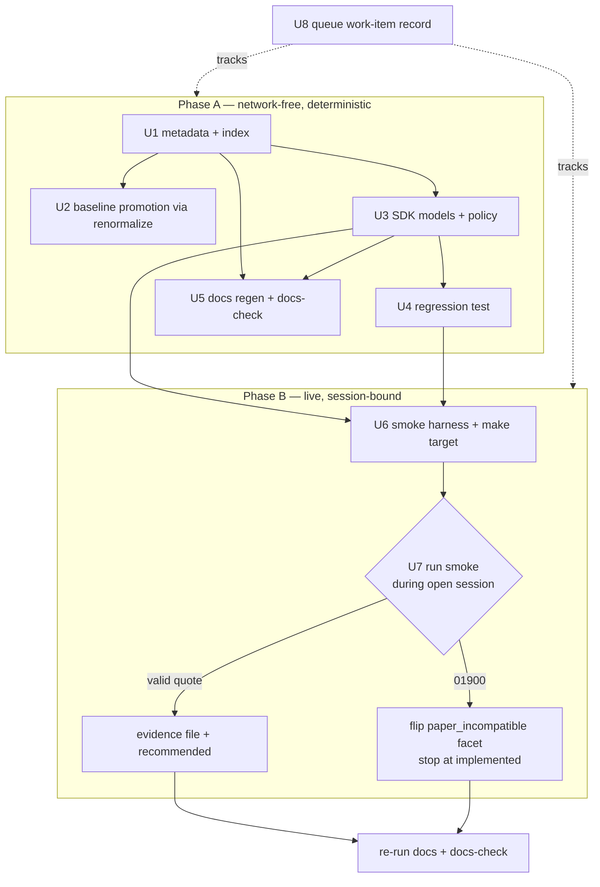

# feat: Adopt TR t1101 as the Stage-2 expansion proof

## Summary

Adopt upstream TR `t1101` (주식현재가호가조회 — current price + order book) as a new
`queue:expansion` item and take it to `support:recommended` via a Paper Live Smoke. This
exercises the full Maintenance Flow on a real TR — new metadata, Baseline Promotion, SDK
behavior, regenerated docs, a Change-Scoped Gate, and Focused Evidence — and is Stage 2 of
the two-stage Foundation Complete gate (see origin: `docs/brainstorms/2026-06-17-maintenance-queue-pressure-test-requirements.md`).

## Problem Frame

The maintained SDK owns exactly seven TRs, one per dependency class. Stage 1 (issue #9)
proved the queue plumbing but nulled out every load-bearing field, so it cannot prove the
flow carries weight. Both trackers offered no candidate (api-drift blocked by an upstream
`property_type` 500; spec-doc clean), so Stage 2 is a deliberate expansion. `t1101` is the
closest sibling to the already-owned `t1102` (same `[주식] 시세` group), making it the
second TR in the `market_session` class — the first real test that the dependency-class
grouping holds more than one TR.

---

## Key Technical Decisions

- **Baseline Promotion is network-free.** The maintained baseline set is derived from
  metadata-file presence — `maintained_codes` (`crates/ls-trackers/src/cli.rs:343`) reads
  `metadata/trs/` keys, consumed by `normalize_run` (`crates/ls-trackers/src/api_drift.rs:67`)
  — so adding the metadata file then `make api-drift-renormalize` projects `t1101`'s
  Structural API Shape from the committed raw snapshot
  (`crates/ls-trackers/baselines/api-drift/raw/ls-openapi-full.json`). The `property_type`
  outage cannot block it.
- **Provisional baseline.** The committed raw was itself fetched under the `property_type`
  fallback (see `crates/ls-trackers/baselines/api-drift/SEED-ATTESTATION.md`), so `t1101`'s
  projected shape inherits that caveat. Accept it as provisional; a future clean fetch
  refines type names. This matches the seed's existing governance stance.
- **Model a representative subset of `t1101OutBlock`.** Mirror `t1102`'s approach — core
  price fields plus level-N order-book depth, not all fields. Every numeric-bearing field
  uses `ls_core::string_or_number` for the gateway's string-or-number inconsistency.
- **Hold the `market_session` module flat.** Two TRs do not justify a module split; keep
  `t1101` alongside `t1102` in one module and defer any split until a third TR. Avoids a
  premature refactor (origin's watch-item).
- **Support promotion is gated on the smoke outcome.** `recommended` only on a successful
  Paper Live Smoke; on the `01900` paper-incompatible signal, flip the `paper_incompatible`
  facet, stop at `implemented`, and skip the evidence file (AE2). Both outcomes close the
  work item as a valid Stage-2 proof.

---

## High-Level Technical Design

Two-phase flow — the deterministic phase is network-free and unblocked by the outage; the
live phase is session-bound and branches on the smoke result.

---

## Requirements Traceability

- R1, R2 → U1 (new `queue:expansion` TR, market_session/stock classification)
- R3 → U6, U7 (self-contained, paper-verifiable)
- R4 → U1; R5 → U2; R6 → U3; R7 → U5
- R8 → U4, U5, U7 (Change-Scoped Gate); R9 → U6, U7 (Focused Evidence); R10 → U7
- R11, R12 → U8 (queue mechanics, completion checklist)
- AE1, AE2 → U7; AE3 → U6, U7

---

## Implementation Units

### U1. TR Maintenance Metadata for t1101

- **Goal:** Create the per-TR metadata record and index entry that admit `t1101` into the
  maintained surface and drive Baseline Promotion.
- **Requirements:** R1, R2, R4.
- **Dependencies:** none.
- **Files:** `metadata/trs/t1101.yaml` (create), `metadata/tr-index.yaml` (modify).
- **Approach:** Mirror `metadata/trs/t1102.yaml`. Set `owner_class: market_session`,
  facets `protocol: rest`, `instrument_domain: stock`, `venue_session: krx_regular`,
  `self_paginated: false`, `account_state: false`, `paper_incompatible: false` (assumption,
  validated in U7), `rate_bucket: market_data`, `certification_path: automated`,
  `caller_supplied_identifiers: [shcode]`. Start `support: tracked+implemented` with
  `recommended: false` (U7 promotes). Add the matching `tr-index.yaml` routing entry.
- **Patterns to follow:** `metadata/trs/t1102.yaml`, `metadata/tr-index.yaml`.
- **Test scenarios:** `Covers R4.` Metadata validator passes (the `ls-metadata` validator
  asserts every `tr-index.yaml` field equals its per-TR file) — run the validator and
  confirm `t1101` round-trips. No new behavioral code in this unit.
- **Verification:** Metadata validation passes with `t1101` present and index-consistent.

### U2. Baseline Promotion — admit t1101 to the Reviewed Baseline

- **Goal:** Project `t1101`'s Structural API Shape into the committed baseline as a separate
  review act, network-free from the committed raw.
- **Requirements:** R5.
- **Dependencies:** U1 (maintained set derives from metadata presence).
- **Files:** `crates/ls-trackers/baselines/api-drift/normalized/trs/t1101.json` (created by
  the tool), `crates/ls-trackers/baselines/api-drift/normalized/manifest.json` (count bump),
  `crates/ls-trackers/baselines/api-drift/SEED-ATTESTATION.md` (re-attestation note).
- **Approach:** Run `make api-drift-renormalize` (network-free; reads committed raw). Review
  the diff: expect exactly the new `t1101.json` plus a `maintained_tr_count` bump 7→8 in the
  manifest; no other maintained shape should change. Add a KTD-5 re-attestation note to
  `SEED-ATTESTATION.md` recording the admission and the provisional caveat. The reviewed
  commit is the attestation trail.
- **Patterns to follow:** `SEED-ATTESTATION.md` "Re-attestation (KTD-5)";
  `normalized/trs/t1102.json` shape.
- **Test scenarios:** `Covers R5.` Renormalize diff touches only `t1101.json` + manifest
  count (no drift in the other seven shapes). If a staged self-diff run is available,
  `api-drift check --staged` exits `0`; record that the live `api-drift check` remains
  blocked by the upstream outage and is not part of this gate.
- **Verification:** Baseline contains `t1101.json`, manifest count is 8, diff is clean and
  reviewed.

### U3. SDK behavior for t1101 in the market-session surface

- **Goal:** Add the request/response models and the `MarketSession` method that issues a
  `t1101` order-book quote.
- **Requirements:** R6.
- **Dependencies:** U1.
- **Files:** `crates/ls-sdk/src/market_session/mod.rs` (modify),
  `crates/ls-core/src/endpoint_policy.rs` (add `T1101_POLICY` + its in-module test list),
  `crates/ls-core/tests/policy_index_crosscheck.rs` (register `T1101_POLICY`).
- **Approach:** Mirror the `t1102` models: `T1101InBlock { shcode }` serialized under
  `t1101InBlock`; `T1101Response` with `rsp_cd`/`rsp_msg`/`t1101OutBlock`. Model
  `T1101OutBlock` as a representative subset — current price plus level-N offer/bid depth
  (e.g. `offerho1..N`, `bidho1..N`, `offerrem1..N`, `bidrem1..N`, totals) — every
  numeric-bearing field via `ls_core::string_or_number`, struct `#[serde(default)]`. Add
  `T1101_POLICY` (endpoint `/stock/market-data`, `tr_cd t1101`, `RateLimitCategory::MarketData`)
  mirroring `T1102_POLICY:113`. **Register `T1101_POLICY` in both hardcoded cross-check
  lists** — the import + `policies` array in `crates/ls-core/tests/policy_index_crosscheck.rs:45`
  and the `slice_rest_policies_are_non_order_rest` list in `endpoint_policy.rs:205` — neither
  auto-discovers a new const, so the policy/index cross-check skips `t1101` unless registered.
  Add a non-paginated `order_book` method on `MarketSession` dispatching via `Inner::post`.
  Keep both TRs in the one module (KTD: flat).
- **Patterns to follow:** `crates/ls-sdk/src/market_session/mod.rs` (`T1102*`,
  `MarketSession::quote`); `crates/ls-core/src/endpoint_policy.rs:113`;
  `crates/ls-core/tests/policy_index_crosscheck.rs`.
- **Test scenarios:** `Covers R6.` `cargo test -p ls-core` (policy/index cross-check) passes
  with `T1101_POLICY` registered — confirms its endpoint/rate-bucket mapping. Deserialization
  behavior is pinned in U4.
- **Verification:** `cargo build -p ls-sdk` and `cargo test -p ls-core` succeed; `order_book`
  is reachable from the SDK surface and `t1101`'s policy is cross-checked.

### U4. Regression test for t1101 deserialization

- **Goal:** Pin `t1101` request serialization and response deserialization against a
  spec-derived fixture, including string-or-number coercion.
- **Requirements:** R6, R8.
- **Dependencies:** U3.
- **Files:** `crates/ls-sdk/tests/market_session_tests.rs` (modify),
  `crates/ls-sdk/tests/fixtures/` (add a `t1101` response fixture).
- **Approach:** Mirror the existing `t1102` regression. Build a fixture from the spec shape
  (numbers as bare JSON in some fields, strings in others) and assert it deserializes
  without panic and maps the depth/price fields correctly. Assert the request serializes to
  exactly `{"t1101InBlock":{...}}` with no continuation fields.
- **Patterns to follow:** the `t1102` case in `market_session_tests.rs`; `fixtures/`.
- **Test scenarios:**
  - Happy path: full fixture → all modeled fields populated; depth levels parsed.
  - Edge: mixed string/number numerics both deserialize (string_or_number).
  - Edge: sparse/empty out-block deserializes via `#[serde(default)]`.
  - Request shape: serializes to `{"t1101InBlock":{"shcode":...}}`, no `tr_cont` leak.
- **Verification:** `cargo test -p ls-sdk --test market_session_tests` passes.

### U5. Regenerate SDK Reference and TR Dependency Docs

- **Goal:** Produce the generated docs for `t1101` and keep the docs gate green.
- **Requirements:** R7.
- **Dependencies:** U1, U3.
- **Files:** `docs/reference/t1101.md`, `docs/tr-dependencies/t1101.md`,
  `docs/reference/index.md`, `docs/tr-dependencies/index.md` (all generated by `make docs`).
- **Approach:** Run `make docs` (network-free) to project the new docs from metadata; commit
  the generated output. Re-run after U7 if support state changes (recommended/paper flags
  alter the rendered docs).
- **Patterns to follow:** `docs/reference/t1102.md`, `docs/tr-dependencies/t1102.md`.
- **Test scenarios:** `Covers R7, R8.` `make docs-check` exits `0` (committed docs match
  metadata). No behavioral code.
- **Verification:** `make docs-check` passes; `t1101` docs exist and are index-linked.

### U6. Paper Live Smoke harness for t1101

- **Goal:** Add the credential-free `#[ignore]` smoke test and its `make` target that issues
  a real `t1101` order-book quote on the paper gateway.
- **Requirements:** R3, R9, AE3.
- **Dependencies:** U3, U4.
- **Files:** `crates/ls-sdk/tests/live_smoke.rs` (add a `live_smoke_book` test), `Makefile`
  (add a `live-smoke-book` target).
- **Approach:** Mirror `live_smoke_default`: `paper_guard()` → token → one `order_book`
  call. Emit a `LIVE-SMOKE` stdout line with structural descriptors only (no symbol secrets,
  no token) — e.g. `inputs=[env=paper symbol=... ]` and `result=[rsp_cd=... <one depth/price
  descriptor>]`. Add the `make live-smoke-book` target via the existing `run_smoke` define.
  `shcode` is a public market ticker, safe to commit; any `LS_LIVE_SMOKE_SHCODE` override must
  also be a public ticker, never an account number or internal identifier.
- **Patterns to follow:** `live_smoke_default` (`crates/ls-sdk/tests/live_smoke.rs`);
  `Makefile` `run_smoke` define; secret-safety note in `metadata/evidence/token.yaml`.
- **Execution note:** The smoke is `#[ignore]` and excluded from the default `cargo test`
  (network-free CI; ADR 0009, R18). It is session-bound — a closed-session response is not valid
  evidence (AE3); run during KRX regular hours (09:00–15:30 KST).
- **Test scenarios:**
  - Happy path (manual, session-bound): `make live-smoke-book` prints `1 passed` and a
    `LIVE-SMOKE` line with `rsp_cd=00000`.
  - Failure: filter typo / zero tests → target fails (the `run_smoke` 0-tests guard).
  - `Covers AE3.` Closed-session response is recognized as not-valid-evidence, not recorded.
- **Verification:** Target runs exactly one test and fails on zero-tests; emitted line is
  credential-free.

### U7. Capture Focused Evidence and resolve support state

- **Goal:** Run the smoke during an open session and resolve the terminal support state —
  `recommended` on success, or the AE2 paper-incompatible fallback.
- **Requirements:** R9, R10, AE1, AE2.
- **Dependencies:** U6.
- **Files:** `metadata/evidence/t1101.yaml` (create on success), `metadata/trs/t1101.yaml`
  (modify: support/facets + `last_reviewed`), then re-run U5 docs.
- **Approach:** Run `make live-smoke-book` during an open session.
  - **AE1 success:** capture the `LIVE-SMOKE` line verbatim into
    `metadata/evidence/t1101.yaml` (mirror `metadata/evidence/token.yaml`: `tr_code`,
    `date`, `env: paper`, `target`, `line`); set `support.recommended: true` and
    `last_reviewed`. Re-run `make docs` + `docs-check`.
  - **AE2 `01900`:** the `order_book` call returns `LsError::ApiError` classifying
    paper-incompatible; set `facets.paper_incompatible: true`, leave `recommended: false`,
    write no evidence file, record the discovery. Re-run `make docs` + `docs-check`.
- **Patterns to follow:** `metadata/evidence/token.yaml`; the `01900`/paper-incompatible
  classification noted in `crates/ls-sdk/src/market_session/mod.rs`.
- **Test scenarios:**
  - `Covers AE1.` Success → evidence file present, `line` matches smoke stdout,
    `recommended: true`, docs regenerated, `docs-check` green.
  - `Covers AE2.` `01900` → `paper_incompatible: true`, `recommended: false`, no evidence
    file, docs regenerated, `docs-check` green.
- **Verification:** Support state matches the smoke outcome; `docs-check` passes; evidence
  file exists iff `recommended`.

### U8. Queue work-item record

- **Goal:** Track the work as a queue item and record completion decisions.
- **Requirements:** R11, R12.
- **Dependencies:** none (may be opened first; closed last).
- **Files:** none in-repo (GitHub issue via the SDK work item template).
- **Approach:** Open the issue with `.github/ISSUE_TEMPLATE/sdk_work_item.yml`, labels
  `queue:expansion`, `source:manual`, `class:market-session`, `gate:change-scoped`,
  `baseline:promotion-needed`, `evidence:needed`, plus the achieved support label at close.
  On completion record: Change-Scoped Gate passed (U4 regression + `docs-check` +
  metadata validation), Baseline Promotion decision (done, U2), Focused Evidence decision
  (AE1 recorded / AE2 fallback).
- **Test scenarios:** `Test expectation: none -- process/queue record, no code.`
- **Verification:** Template completion checklist satisfied; labels reflect the final
  support state.

---

## Change-Scoped Gate

The gate for completion (R8), all runnable today except the session-bound smoke:

- `cargo test -p ls-sdk --test market_session_tests` (U4 regression), `cargo test -p ls-sdk`,
  and `cargo test -p ls-core` (policy/index cross-check covers `t1101`).
- Metadata validation (`ls-metadata` validator) — `t1101` round-trips against the index.
- `make docs-check` — committed docs match metadata.
- `make api-drift-renormalize` diff is clean (only `t1101.json` + manifest count).
- `make live-smoke-book` during an open session (Focused Evidence; AE1/AE2 outcome recorded).

The live `make api-drift-check` is **not** part of this gate — it is blocked by the upstream
`property_type` outage and is independent of admitting `t1101`.

---

## Scope Boundaries

- Overseas / futures / overseas-futures expansion — deferred (paper support unverified).
- The single-select dependency-class / support-state template question — deferred; `t1101`
  is single-class (see origin: pressure-test doc).
- `CSPAT00601` (orders) promotion — excluded (prerequisite coupling).
- Alternate candidates `t1305`, `t8407` — not chosen.

### Deferred to Follow-Up Work

- A clean `api-drift` fetch once the `property_type` endpoint recovers, to refine `t1101`'s
  baseline type names past the fallback caveat.
- A `market_session` module split — revisit when a third TR joins the class.

---

## Risks & Dependencies

- **Paper-incompatibility (primary unknown).** `paper_incompatible: false` is an assumption
  until U7. Mitigation: AE2 fallback is a planned, valid outcome — no rework, just a
  reclassification.
- **Session-bound evidence.** A closed-session smoke yields no valid evidence (AE3).
  Mitigation: run U7 during KRX regular hours.
- **Provisional baseline.** `t1101`'s projected shape inherits the seed's `property_type`
  fallback caveat. Mitigation: carry it provisional; refine on the next clean fetch
  (deferred follow-up).
- **Exact `t1101` field set.** The order-book block field names are an implementation detail
  to confirm against the committed raw at build time; the representative-subset decision
  (KTD) bounds it.

---

## Sources & Research

- Origin: `docs/brainstorms/2026-06-17-stage-2-expansion-t1101-requirements.md`; Stage
  framing: `docs/brainstorms/2026-06-17-maintenance-queue-pressure-test-requirements.md`.
- SDK pattern: `crates/ls-sdk/src/market_session/mod.rs`; policy:
  `crates/ls-core/src/endpoint_policy.rs:113`; smoke: `crates/ls-sdk/tests/live_smoke.rs`.
- Baseline: `crates/ls-trackers/src/cli.rs:343` (`maintained_codes`),
  `crates/ls-trackers/src/api_drift.rs:67` (`normalize_run`),
  `crates/ls-trackers/baselines/api-drift/SEED-ATTESTATION.md`, `normalized/trs/t1102.json`,
  committed raw `raw/ls-openapi-full.json` (`t1101` shape).
- Metadata/evidence: `metadata/trs/t1102.yaml`, `metadata/tr-index.yaml`,
  `metadata/evidence/token.yaml`; gate targets: `Makefile`.
