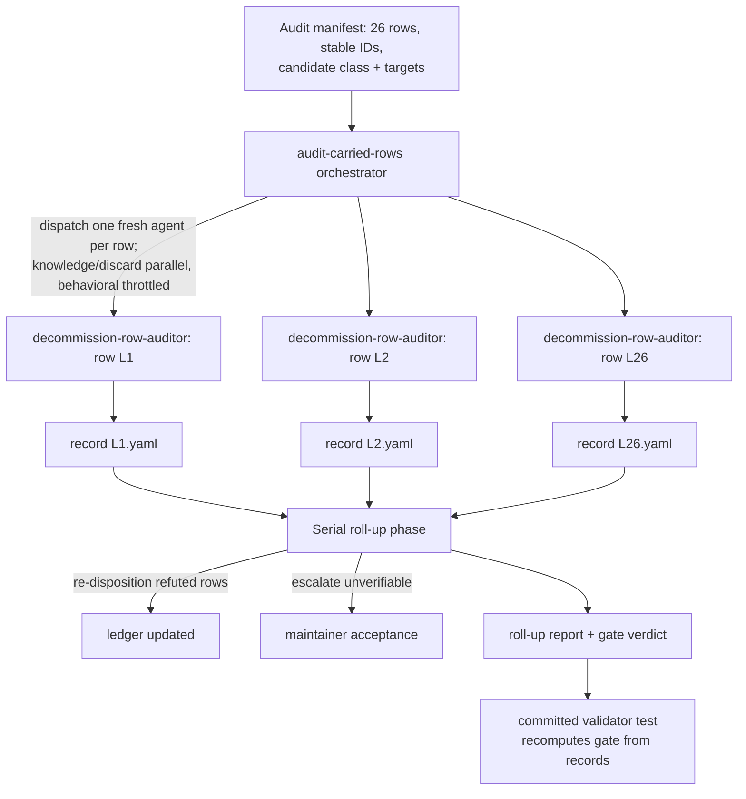
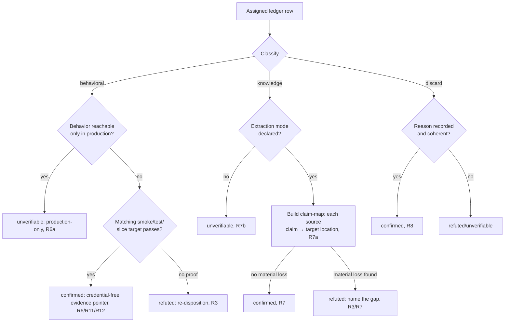
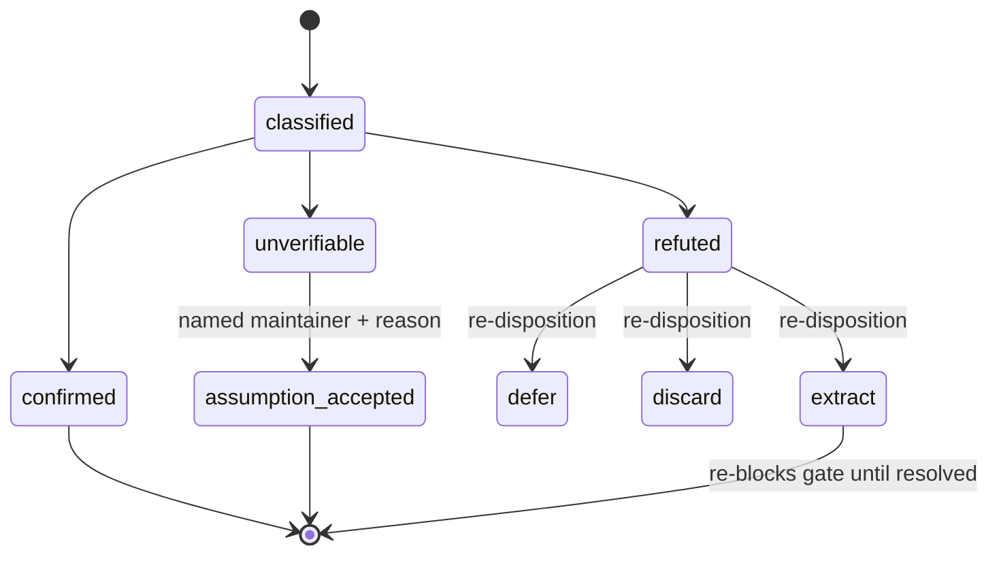

# feat: Decommission Audit — Verify Carried Rows Before Trusting the Gate

## Summary

Build a fresh-context agent fleet — one agent per ledger row — that audits every
`carried` and `discard` row in `docs/migration-source-extraction-ledger.md`
against a bar tiered by row type, freezes a re-checkable per-row record, and
produces an explicit trustworthy-green gate verdict. The machinery mirrors the
existing `promote-trs` / `tr-promoter` / `promote-tr` pattern but does read-only
verification instead of recommendation promotion. The deliverable is a
*trustworthy* gate, not the physical decommission act.

---

## Problem Frame

The extraction ledger is the decommission gate: `korea-broker-sdk-ls` becomes a
**Decommissioned Migration Source** only once every knowledge asset is resolved.
As of `2026-06-14` the ledger reports 24 `carried` rows and 2 `discard` rows and
no unresolved `extract` rows — on paper, green.

But every `carried` row is an unproven *assertion* that the knowledge is
represented here. None has been independently verified. If one is wrong — a
behavior described but never migrated, a design doc that dropped a constraint —
decommissioning silently loses that knowledge, and the loss is unrecoverable
because the completeness comparison requires reading the old source that
decommission removes. This audit makes that comparison while it is still
possible and freezes the result so a confirmed gate stays defensible after the
source is gone (see origin: `docs/brainstorms/2026-06-18-decommission-audit-carried-rows-requirements.md`).

The ledger currently keys rows only by area name, with no stable IDs and no
declared extraction mode per row. Both are prerequisites for one-agent-per-row
dispatch and for the claim-by-claim knowledge bar.

---

## Key Technical Decisions

- **New audit machinery modeled on `promote-trs`, not a reuse of it.** The
  promotion orchestrator is coupled to doc regeneration (`make docs`),
  recommendation flips, the docgen banner test, and the freshness count — none
  of which this read-only audit does. Reusing it directly would drag that
  coupling in. A new orchestrator skill + recipe skill + auditor agent reuse the
  *pattern* (fresh-context fleet, machine-readable return line, sweep ledger,
  resume) without the promotion-specific steps. (origin deferred-to-planning Q2)

- **Recipe skill and agent stay separate; the agent is a thin wrapper.** The
  recipe (`audit-row`) holds the steps; the agent (`decommission-row-auditor`)
  is a thin delegating wrapper that runs the recipe verbatim — matching
  `tr-promoter.md`, which is a 42-line wrapper over the 147-line `promote-tr`
  recipe. The split is not just precedent-mirroring: it keeps the recipe runnable
  from two entry points (the orchestrator's per-row dispatch *and* a direct
  single-row invocation by a human), which inlining the recipe into the agent
  would break. `audit-row` plays the dual recipe/single-item role exactly as
  `promote-tr` does, so the artifact count matches precedent — no surface bloat.

- **Durable record = per-row frozen files + a committed validator test + ledger
  re-disposition.** Each row gets a self-contained record file (mirroring the
  `metadata/evidence/<tr>.yaml` header+body convention, but its own schema — not
  the `EvidenceRecord` struct); a committed Rust integration test recomputes the
  gate from those records; and refuted rows are re-dispositioned in the ledger
  itself. This beats verdict-columns-in-the-ledger (the record is too rich for a
  table cell — classification, bar, claim-map, pointer) and a one-time markdown
  report (which is not re-runnable). The validator is what makes the gate
  re-checkable after the source is gone. Four invariants give the durability
  teeth (see U6): (a) a confirmed row's evidence pointer must be `inline` or a
  git-tracked in-repo path that resolves on disk — not merely "not an old-source
  path"; (b) knowledge claims must be transcribed inline (a claim whose text is
  empty or references an old-source path fails — it would be unverifiable once
  the source is gone); (c) the validator cross-checks each record verdict against
  that row's ledger disposition, the same anti-drift discipline
  `slice_metadata.rs::token_last_reviewed_matches_its_evidence_date` enforces in
  the metadata domain; (d) every transcribed or free-text field
  (`line`, `claim_text`, `acceptance_reason`) is credential-scanned, not just the
  behavioral `line` — claims and acceptance reasons pulled from old-source docs
  can carry credential field-names (`appkey`, `account_no`) into a committed
  record (R12). (origin deferred-to-planning Q1)

- **The gate proves record-consistency after decommission, not re-verifiability.**
  R14 means the committed validator can recompute the gate from frozen records
  forever — pointer integrity, inline transcription, verdict-vs-ledger
  reconciliation. It cannot re-compare records against the source, which is gone
  by design: the source comparison is a one-shot done while the source exists.
  Two consequences the plan accepts and surfaces (see Risks): a green gate is not
  independently re-falsifiable later, and the claim-map bounds completeness to
  what each agent *enumerated* — a constraint no agent noticed is invisible to
  both the agent and the permanent validator. U6's source-coverage reconciliation
  is the counter-discipline that makes under-enumeration detectable *now*.

- **`assumption-accepted` is counted toward green but reported apart from
  `confirmed`.** Acceptance is a real escape hatch (R4a) but the path of least
  resistance to green for the ~17 knowledge rows and the unprovable WebSocket
  sub-claims. To keep acceptance from silently becoming the default route, the
  report counts `assumption-accepted` separately from `confirmed`, and each
  acceptance_reason must name the specific residual risk being accepted — not a
  bare "accepted."

- **Validator lives in `ls-trackers`, not `ls-metadata`.** `ls-metadata`'s
  charter is TR-metadata validation only, and the audit reuses none of its API —
  just a ~4-line `CARGO_MANIFEST_DIR` → workspace-root idiom that every test file
  copies locally (there is no shared harness). `ls-trackers` is the closest
  domain fit: it already owns drift / spec-document tracking — "is the
  represented state still faithful to a source," the same shape as "is the
  carried knowledge faithfully represented." A dedicated `ls-decommission-audit`
  crate is the cleaner-isolation alternative (see Open Questions). `serde_yaml`
  dev-deps are needed regardless of home.

- **Parallel fleet for record-writing, throttled behavioral execution, serial
  roll-up.** Knowledge and discard agents (the large majority — ~17 knowledge +
  2 discard) read the two repos and write their own record file, so they
  parallelize freely with no collision, unlike `promote-trs` (forced serial by
  shared docgen / freshness files). Behavioral agents must be throttled (serial
  or a small concurrency bound): they run `cargo test` / `make` smoke targets
  that contend on the cargo build lock, a single shared `.env`, and the live
  paper gateway. The orchestrator — never the agents — appends to
  `outcomes.jsonl`, so the sweep ledger has no parallel-write hazard. Ledger
  re-disposition and the gate computation run serially in the roll-up phase after
  all agents return.

- **Self-contained records: no live dependency on the old source.** A confirmed
  row's record transcribes the compared claims *inline* and records old-source
  paths only as provenance. The evidence pointer must resolve entirely within
  this repo or inline (R13), so the record survives decommission (R14).

- **Behavioral sub-claims that the harness cannot prove land `unverifiable`, not
  `confirmed`.** The only WebSocket smoke is lifecycle-reachability-only; ledger
  row claims like reconnect replay, terminal exhaustion, and latest-only wakeup
  are not exercised by any runnable test here. Those sub-claims are recorded
  `unverifiable` (R6/R6a) and routed to maintainer acceptance (R4a / AE6) rather
  than allowed to read as a behavioral confirm. The trustworthy-green bar counts
  `assumption-accepted`, not bare `unverifiable`. (origin Deferred/Open Q2)

- **Order rows are knowledge/design, not behavioral.** ADR 0008 means no order
  runtime exists in this slice, so order rows (acknowledgement codes, error enum
  surface, order safety runtime, dedup eviction) are verified by
  completeness-vs-source (R7), never by a runnable order test.

---

## High-Level Technical Design

### Fleet topology and roll-up



### Single-row classification and bar (per agent)



### Row verdict lifecycle



The gate is **trustworthy-green** only when all 26 rows are `confirmed` or
`assumption-accepted`, every verdict reconciles against the ledger, and no row is
an unresolved `extract`. A missing verdict for any row is not-green.

---

## Output Structure

```text
docs/migration-source/audit/
  manifest.yaml                      # 26 rows: id, area, candidate class, targets/sources
  records/
    L1.yaml … L26.yaml               # frozen per-row durable records (only these)
  decommission-audit-report.md       # roll-up + explicit gate verdict
.agents/skills/audit-carried-rows/
  SKILL.md                           # orchestrator: discover, dispatch, roll-up, resume
  references/
    record-format.md                 # per-row record + report schema
    record-format.example.yaml       # worked example per class (NOT under records/)
.agents/skills/audit-row/
  SKILL.md                           # single-row recipe (run by the agent)
  references/
    classification-and-bars.md       # behavioral/knowledge/discard bars
.claude/agents/
  decommission-row-auditor.md        # fresh-context per-row auditor (only .claude/agents/ exists)
crates/ls-trackers/tests/
  decommission_audit.rs              # committed validator: recomputes the gate
.compound-engineering/runs/audit-carried-rows/<branch-slug>/   # git-ignored (transient sweep state)
  state/progress.json                # phase + branch
  state/candidates.json              # manifest snapshot at sweep start
  state/outcomes.jsonl               # one object per returned row (orchestrator-written)
  logs/orchestrator.jsonl            # operational log
```

The tree is a scope declaration; the per-unit `**Files:**` sections remain
authoritative.

---

## Requirements

Carried from the origin document; IDs preserved verbatim for traceability.

**Coverage and disposition**

- R1. The audit evaluates every `carried` row (24) and every `discard` row (2);
  no `carried` row is exempt.
- R2. Each audited row receives exactly one verdict: `confirmed`, `refuted`, or
  `unverifiable`.
- R3. A refuted `carried` row is re-dispositioned to `extract`, `defer`, or
  `discard` and re-blocks the gate until resolved.
- R4. An `unverifiable` row is recorded as an explicit assumption with the reason
  it could not be verified; it does not count as `confirmed`.
- R4a. An `unverifiable` row may be promoted to `assumption-accepted` when a named
  maintainer records an explicit acceptance and reason. `assumption-accepted`
  rows count toward trustworthy-green; un-accepted `unverifiable` rows do not.

**Verification bars (tiered)**

- R5. Each row is classified behavioral, knowledge, or discard; the
  classification is recorded alongside the verdict.
- R6. A behavioral row is confirmed only by a passing test or recorded evidence
  in this repo. A doc describing the behavior is not sufficient.
- R6a. A behavioral row whose genuine behavior is reachable only in production is
  `unverifiable`, never `confirmed` (production trading tests are prohibited; a
  paper smoke cannot stand in for production behavior).
- R7. A knowledge/design/lesson row is confirmed by completeness-vs-source
  review: a fresh reviewer compares old source against extracted target and
  agrees no material knowledge was lost.
- R7a. Completeness review is claim-by-claim: enumerate the discrete claims and
  constraints in the old source, map each to a location in the target, and record
  that claim-map as evidence. "Material" means any behavioral constraint, numeric
  value, response code, threshold, or edge case whose loss would change an
  implementation decision; loss of such an item refutes the row.
- R7b. Each knowledge row declares its extraction mode — full transcription,
  summary plus data snapshot, or distilled lesson — and the bar is applied to
  that mode. A row with no declared mode is `unverifiable`.
- R8. A discard row is confirmed by a presence-and-coherence check: a non-carry
  reason is recorded and internally coherent. The audit does not judge whether
  the discard decision was correct.

**Execution model**

- R9. The audit runs as a fleet of fresh-context agents, one per ledger row, with
  no shared state between agents.
- R10. Each agent has read access to both repos for the row it audits.
- R11. A behavioral-row agent runs the matching repo verification and captures the
  result — unless the row is production-only per R6a, in which case it records the
  production-only classification and returns `unverifiable` without running an
  inadmissible test.
- R12. Any captured evidence is credential-free — no tokens, secrets, app keys,
  or account numbers — consistent with the repo's evidence non-negotiables.

**Durable record and gate trust**

- R13. The audit produces a per-row durable record (classification, verdict, bar
  applied, evidence pointer) captured while the old source is still readable. A
  confirmed row's evidence pointer resolves entirely within this repo or as a
  self-contained inline record; it must not depend on an old-source path that
  ceases to exist after decommission.
- R14. A confirmed row's record is re-checkable after decommission without the
  old source — meaning its internal consistency (pointer integrity, inline
  transcription, verdict-vs-ledger agreement) stays verifiable. It does not mean
  the record can be re-compared against the source; that comparison is a one-shot
  performed while the source exists.
- R15. The audit reports overall gate state explicitly. The gate is
  *trustworthy-green* only when all 26 rows have a recorded verdict reconciled
  against the ledger, every row is `confirmed` or `assumption-accepted`, and no
  row is an unresolved `extract`. A missing verdict makes the gate not-green.

---

## Implementation Units

### U1. Audit manifest and stable ledger row IDs

- **Goal:** Produce the dispatch input — a manifest enumerating all 26 ledger
  rows with a stable ID each, a candidate classification, and the pointers each
  agent needs — and give the ledger stable row IDs so a refuted row can be
  re-dispositioned unambiguously.
- **Requirements:** R1, R5, R9 (enables one-agent-per-row dispatch)
- **Dependencies:** none
- **Files:**
  - `docs/migration-source/audit/manifest.yaml` (create)
  - `docs/migration-source-extraction-ledger.md` (modify — add an explicit stable ID column)
- **Approach:** Add an explicit ID column to the ledger table (not a per-row
  anchor) so the validator parses IDs deterministically; the ledger's disposition
  is the 3rd pipe-delimited cell and cells contain backticks and prose, so both
  the manifest builder and the U6 validator must parse the table robustly rather
  than by naive split. The manifest is the authority for the `L1`…`L26` ↔ area
  mapping; the validator asserts ledger and manifest agree 1:1 so a future ledger
  reorder cannot silently re-map IDs. Assign `L1`…`L26` matching current ledger
  row order. Each manifest entry carries: `id`, `area` (ledger name),
  `disposition` (`carried`/`discard`), `candidate_class`
  (`behavioral`/`knowledge`/`discard`), and class-specific pointers — for
  behavioral: the smoke/test/slice target (drawn from
  `.agents/skills/promote-tr/references/smoke-map.md` as the target source of
  truth); for knowledge: old source path(s), extracted target path(s), and a
  `candidate_extraction_mode` (the agent is authoritative and may override); for
  discard: where the non-carry reason is recorded. Candidate classification seeds
  the agent but does not bind it (R5 keeps classification the agent's recorded
  judgment). Order rows seed as `knowledge` per ADR 0008.
- **Patterns to follow:** the discovery model in
  `.agents/skills/promote-trs/SKILL.md` (read metadata + a smoke-map to build a
  candidate list) and `.agents/skills/promote-tr/references/smoke-map.md` (the
  target-mapping shape and the authoritative behavioral-target list).
- **Test scenarios:**
  - Manifest enumerates exactly 26 entries whose `id`+`area` reconcile 1:1 with
    the ledger's carried+discard rows (enforced by U6's validator).
  - Every behavioral candidate names a runnable target that exists in the
    Makefile or a test path; every knowledge candidate names at least one source
    and one target path.
  - Test expectation: structural completeness is asserted by the U6 validator; no
    standalone runtime behavior in this unit.
- **Verification:** The manifest covers all 26 rows; the ledger renders with
  stable IDs; U6's validator passes its manifest-reconciliation assertion.

### U2. Per-row record format and roll-up report format

- **Goal:** Define the self-contained per-row durable record schema and the
  roll-up report shape, so records are uniform, machine-checkable, and survive
  decommission.
- **Requirements:** R2, R4, R4a, R5, R7a, R7b, R12, R13, R14
- **Dependencies:** none (parallel with U1)
- **Files:**
  - `.agents/skills/audit-carried-rows/references/record-format.md` (create)
  - `.agents/skills/audit-carried-rows/references/record-format.example.yaml` (create — a worked example per class, deliberately outside `records/` so U6's "exactly 26 records" check has nothing extra to skip)
- **Approach:** Record fields mirror the `metadata/evidence/<tr>.yaml` *header +
  body convention* (secret-safety comment header, flat machine-readable body) but
  define their own schema — the audit record is NOT an `EvidenceRecord`
  (`crates/ls-metadata/src/schema.rs`), so U6's validator deserializes its own
  struct. Fields: `row_id`, `area`, `classification`, `verdict`, `bar_applied`,
  `evidence_pointer` (`inline` or a git-tracked repo-relative path), `provenance`
  (old-source paths, marked non-load-bearing). Class-specific blocks: behavioral
  → `target` + verbatim credential-free `line` (or `production_only: true` +
  reason); knowledge → `extraction_mode` + `claim_map` (list of
  `{claim_text, target_location, status}` where `claim_text` is transcribed inline
  in full — a claim recorded as a reference into the old source, e.g.
  "see old source line 42", violates R14 and must be rejected); discard →
  `reason` + coherence note. For unverifiable: `reason`; for assumption-accepted:
  `accepted_by` + `acceptance_reason` (rationale only — names the residual risk
  accepted, never credential values or account identifiers) + `accepted_date`.
  R12 applies to the whole record, not just `line`: every transcribed or
  free-text field (`line`, `claim_text`, `acceptance_reason`) is credential-free.
  The authoritative credential-pattern definition is shared with U3's
  secret-safety check so the recipe and the validator agree on what counts. The report is a markdown
  table of all 26 rows (mirroring the ledger table's own shape) plus an explicit
  gate-state line and the refuted / unverifiable / assumption-accepted lists.
- **Patterns to follow:** `metadata/evidence/t1101.yaml` and
  `metadata/evidence/CSPAQ12200.yaml` (secret-safety header + structural body);
  `.agents/skills/promote-tr/references/templates.md` (authoritative
  credential-free `line` shapes and the secret-safety blocking discipline);
  `docs/migration-source-extraction-ledger.md` table shape for the report;
  `metadata/EVIDENCE-FRESHNESS.md` for the candid explicit-state-declaration tone.
- **Test scenarios:**
  - The example record for each class (behavioral, knowledge, discard) validates
    against the schema under U6's validator.
  - A knowledge example with a `claim_map` whose every claim has a
    `target_location` validates; one with a claim missing a location does not.
  - Test expectation: schema conformance is asserted by U6; this unit ships the
    format and worked examples.
- **Verification:** Each class has a worked example; the schema captures all
  fields R13 requires; the example records pass U6's schema checks.

### U3. Single-row audit recipe (`audit-row` skill)

- **Goal:** The end-to-end steps one audit performs for a single row: classify,
  apply the matching tiered bar, reach a verdict, write the record, emit the
  return line.
- **Requirements:** R2, R5, R6, R6a, R7, R7a, R7b, R8, R10, R11, R12, R13
- **Dependencies:** U1 (manifest entry shape), U2 (record format)
- **Files:**
  - `.agents/skills/audit-row/SKILL.md` (create — `name` + `description` frontmatter only, plus a trailing `## Reference` section, matching existing skills)
  - `.agents/skills/audit-row/references/classification-and-bars.md` (create — the bar definitions; homed under the recipe's own `references/` per the `promote-tr` precedent. The agent references them indirectly through the recipe it runs verbatim, so no separate agent-facing copy is needed)
- **Approach:** Mirror the non-interactive, state-driven shape of
  `.agents/skills/promote-tr/SKILL.md`. Steps: (0) read the manifest entry and
  re-read repo + old-source truth; (1) classify and record the classification;
  (2) apply the bar —
  - *behavioral:* if production-only, record `production_only` and return
    `unverifiable` without running an inadmissible test (R6a/R11); else run the
    matching `make` smoke / `cargo test` / slice target and capture a
    credential-free line (R11/R12). Split a row's claims: lifecycle/structural
    claims the target proves are `confirmed`; sub-claims it does not exercise
    (e.g. WebSocket reconnect replay, terminal exhaustion, latest-only wakeup)
    are recorded `unverifiable` rather than confirmed.
  - *knowledge:* declare the extraction mode (or `unverifiable` if none, R7b),
    build the claim-by-claim claim-map against that mode, confirm only on no
    material loss (R7/R7a).
  - *discard:* presence-and-coherence on the recorded reason (R8).
  (3) run the secret-safety check across *every* transcribed field — the
  behavioral `line` and each knowledge `claim_text` — since claims copied from
  old-source docs can carry credential field-names; halt with `HELD` rather than
  commit a record with a token/appkey/secret/account match (R12); (4) write the
  per-row record (R13); (5) emit a machine-readable return line.
- **Execution note:** Characterize the bars against one representative row of each
  class before wiring the fleet — a knowledge row with a known summary mode, a
  behavioral row with a runnable smoke, and a discard row — so the recipe is
  proven on real rows, not just specified.
- **Patterns to follow:** `.agents/skills/promote-tr/SKILL.md` step ordering and
  early-bail discipline; the secret-safety blocking check in its step 3, whose
  authoritative credential-free `line` shapes live in
  `.agents/skills/promote-tr/references/templates.md`.
- **Test scenarios:**
  - Covers AE1. A behavioral row whose matching smoke passes yields `confirmed`
    with a credential-free evidence pointer.
  - Covers AE2. A row whose only target is a design doc with no test/evidence
    yields `refuted`.
  - Covers AE3 / AE4. A knowledge row with a complete claim-map yields
    `confirmed`; one with a constraint missing from the target yields `refuted`
    with the gap named.
  - Covers AE5. A row whose proof needs an unavailable credential/environment
    yields `unverifiable` with the blocking reason.
  - A behavioral row that is production-only yields `unverifiable`, never
    `confirmed` (R6a).
  - A knowledge row with no determinable extraction mode yields `unverifiable`
    (R7b).
  - A captured behavioral line containing a token/account/secret is rejected by
    the secret-safety check before the record is written (R12).
- **Verification:** A dry run of the recipe on one row of each class produces a
  schema-valid record and a parseable return line matching the verdict.

### U4. Per-row auditor agent (`decommission-row-auditor`)

- **Goal:** The fresh-context subagent dispatched once per row that runs the
  `audit-row` recipe and returns a single machine-readable result line.
- **Requirements:** R9, R10, R11, R12
- **Dependencies:** U3 (the recipe it runs)
- **Files:**
  - `.claude/agents/decommission-row-auditor.md` (create)
  - `docs/migration-source/audit/records/<id>.yaml` (create — one per row, written by the agent during recipe execution)
- **Approach:** Model on `.claude/agents/tr-promoter.md`, which is a thin 42-line
  wrapper that delegates to its recipe verbatim — keep this agent equally thin
  and let `audit-row` (U3) hold the steps (see the recipe/agent split KTD). Agent
  definitions live only in `.claude/agents/` (there is no `.agents/agents/` and no
  symlink). Frontmatter is `name` / `description` / `tools` (`tools: Read, Edit,
  Write, Bash, Grep, Glob`, read access to both repos, R10). Input: one row ID.
  Return line: `AUDITED <id> <verdict> records/<id>.yaml` or
  `HELD <id> — <reason>`. Non-negotiables: never fabricate a verdict; credential-
  free evidence is blocking (R12); a confirmed verdict requires the bar genuinely
  met; write only this row's record; do not edit the ledger, append to
  `outcomes.jsonl`, dispatch siblings, or touch shared state (R9); re-read repo +
  old-source truth rather than trust conversation memory; make the return line
  self-sufficient for the orchestrator.
- **Patterns to follow:** `.claude/agents/tr-promoter.md` (input contract,
  return-line contract, non-negotiables, "re-read repo state before acting").
- **Test scenarios:**
  - The agent on a confirmable behavioral row returns
    `AUDITED <id> confirmed records/<id>.yaml` and writes a valid record.
  - The agent on a row it cannot verify returns an `AUDITED <id> unverifiable …`
    (or `HELD`) line with a reason the orchestrator can parse.
  - Test expectation: contract behavior is exercised via U5's dispatch and U6's
    record validation; this unit ships the agent definition.
- **Verification:** Dispatching the agent on a sample row produces a parseable
  return line and a record file matching the verdict.

### U5. Fleet orchestrator (`audit-carried-rows` skill) with resume

- **Goal:** Discover rows from the manifest, dispatch one fresh agent per row in
  parallel, and persist a resumable sweep ledger.
- **Requirements:** R1, R9, R10
- **Dependencies:** U1 (manifest), U4 (agent)
- **Files:**
  - `.agents/skills/audit-carried-rows/SKILL.md` (create)
  - `docs/migration-source/audit/records/L1.yaml … L26.yaml` (created by dispatched agents — see U4)
  - `.compound-engineering/runs/audit-carried-rows/<branch-slug>/` (create — sweep ledger; git-ignored)
  - `.gitignore` (modify — exclude `.compound-engineering/runs/`)
- **Approach:** Model on `.agents/skills/promote-trs/SKILL.md` but dispatch
  knowledge and discard rows in **parallel** — each only reads the two repos and
  writes its own `records/<id>.yaml`, so the shared-file constraint that forces
  `promote-trs` serial does not apply. **Throttle behavioral rows** to serial (or
  a small concurrency bound): their `cargo test` / `make` smoke targets contend
  on the cargo build lock, one shared `.env`, and the live paper gateway. State
  the live prerequisite explicitly, mirroring `promote-trs`: behavioral
  confirmation needs `LS_TRADING_ENV=paper`, credentials in `.env`, and a
  reachable paper gateway; absent those, the one runnable behavioral row
  (WebSocket lifecycle) records `unverifiable` and routes to R4a acceptance
  rather than failing. The sweep state files are transient and git-ignored, so a
  live-run outcome line or log entry can never be committed. The
  orchestrator — never an agent — appends each returned outcome to
  `outcomes.jsonl`, so the ledger has no parallel-write hazard. Persist the sweep
  ledger under `.compound-engineering/runs/audit-carried-rows/<branch-slug>/`
  mirroring the precedent layout: `state/progress.json` (phase + branch),
  `state/candidates.json` (manifest snapshot at sweep start),
  `state/outcomes.jsonl`, and `logs/orchestrator.jsonl`. Enumerate this fleet's
  own phase list explicitly (e.g. `discovering → dispatching → rolling_up →
  gate_computed → complete`) — it has no `current_tr` analog given parallel
  dispatch. Resume validation lifts the precedent's four cases: single active
  ledger only; branch must match; halt on multiple ledgers or branch/repo
  mismatch; on resume skip rows already in `outcomes.jsonl` and re-read each
  recorded record to confirm it still exists. The roll-up phase (U6) runs only
  after every dispatched agent returns.
- **Patterns to follow:** the `.compound-engineering/runs/promote-trs/<slug>/`
  ledger layout, phase state machine, and resume validation in
  `.agents/skills/promote-trs/SKILL.md` (no live `runs/` directory exists yet —
  this tree is created fresh from that spec).
- **Test scenarios:**
  - A full run dispatches exactly one agent per manifest row and collects 26
    outcomes, with behavioral rows serialized.
  - Re-running after a partial sweep skips rows already in `outcomes.jsonl` and
    dispatches only the remainder.
  - A branch/ledger mismatch (or multiple active ledgers) halts before dispatch
    rather than mixing sweeps.
  - Test expectation: dispatch and resume behavior verified by running the
    orchestrator against the manifest; no separate code test.
- **Verification:** A clean run produces 26 records and 26 outcome lines; a
  resumed run re-dispatches only the missing rows.

### U6. Roll-up, gate validator, ledger reconciliation, and maintainer acceptance

- **Goal:** Compute the explicit gate verdict from the records, re-disposition
  refuted rows in the ledger, support maintainer acceptance of unverifiable rows,
  reconcile source-level coverage, and commit a re-runnable validator test that
  recomputes the gate after the source is gone.
- **Requirements:** R3, R4, R4a, R12, R13, R14, R15
- **Dependencies:** U1 (manifest/ledger ID contract the validator reconciles against), U2 (record/report format), U5 (records produced)
- **Files:**
  - `crates/ls-trackers/tests/decommission_audit.rs` (create — the committed validator; `serde_yaml` dev-dep added if absent)
  - `docs/migration-source/audit/decommission-audit-report.md` (create — roll-up + gate verdict)
  - `docs/migration-source-extraction-ledger.md` (modify — re-disposition refuted rows)
- **Approach:** The orchestrator's serial roll-up reconciles that all 26 rows
  returned, re-dispositions each refuted row in the ledger to
  `extract`/`defer`/`discard` (R3), records each unverifiable row as an explicit
  assumption (R4), and escalates unverifiable rows for maintainer acceptance — a
  named maintainer plus reason flips a record to `assumption-accepted` (R4a /
  AE6). The committed Rust test lives in `ls-trackers` (domain fit: faithfulness-
  to-source tracking; `ls-metadata` is TR-metadata-only and its API isn't reused).
  It copies the ~4-line `CARGO_MANIFEST_DIR` → workspace-root idiom from
  `slice_metadata.rs` (there is no shared harness) — records resolve at
  `CARGO_MANIFEST_DIR/../../docs/migration-source/audit/` (two-level ascent from
  `crates/ls-trackers`), distinct from the crate-local `tests/fixtures/`
  `include_str!` idiom the other `ls-trackers` tests use. It deserializes its own
  record schema with `serde_yaml`, reads the manifest and every
  `records/<id>.yaml`, and asserts the gate invariants so the gate stays checkable
  in CI after decommission (R14). It must parse the ledger table robustly
  (disposition is the 3rd pipe-delimited cell containing backticks/prose) and
  exclude any non-`L<N>.yaml` file from the records set. The report counts
  `assumption-accepted` rows separately from `confirmed` so a gate green only via
  acceptances is visibly distinct from one green via proof. Source-coverage
  reconciliation: enumerate the distinct old-source documents referenced across
  all manifest rows and assert each is claimed by at least one row's claim-map,
  so a source section owned by no row surfaces while the source is still readable
  (the partition-by-row seam, otherwise invisible).
- **Execution note:** Write the validator test first against fixture record sets
  (all-confirmed, one-missing, one-refuted, one-accepted, pointer-not-tracked,
  claim-by-reference) so the gate-invariant logic is proven before the real
  records exist.
- **Patterns to follow:** `crates/ls-metadata/tests/slice_metadata.rs`
  (the inline `*_root()` workspace idiom and its `token_last_reviewed_matches_its_evidence_date`
  anti-drift cross-check); the deterministic evidence-audit checklist in
  `.agents/skills/promote-trs/SKILL.md` reconciliation phase.
- **Test scenarios:**
  - Covers AE6. All 26 rows `confirmed` or `assumption-accepted`, reconciled
    against the ledger, no unresolved `extract` → gate trustworthy-green.
  - A manifest row with no matching record → gate not-green (R15: a dropped row
    must never read as a pass).
  - A row with a `refuted` verdict → gate not-green, and the ledger shows that
    row re-dispositioned away from `carried` (R3).
  - An `unverifiable` row with no acceptance → not-green; the same row with a
    named maintainer + reason (`assumption-accepted`) → counts toward green (R4a).
  - Durability — pointer integrity: a confirmed row whose `evidence_pointer` is
    neither `inline` nor a git-tracked in-repo path that resolves on disk (an
    old-source path, a `target/` artifact, or an uncommitted file) → validation
    fails (R13/R14).
  - Durability — inline transcription: a confirmed knowledge row with a
    `claim_map` entry whose `claim_text` is empty or contains an old-source path
    token → validation fails (R14).
  - Drift cross-check: a record verdict that disagrees with its ledger-row
    disposition (e.g. record `refuted` but ledger still `carried`) → validation
    fails (R15).
  - Credential scan, all fields: a token/account/secret/appkey in `line`,
    `claim_text`, or `acceptance_reason` → validation fails (R12).
  - Source coverage: an old-source document referenced by a manifest row that no
    record's claim-map claims any section of → flagged (under-enumeration /
    orphaned-source surface).
  - A behavioral row marked `confirmed` while flagged `production_only` →
    validation fails (R6a).
  - A knowledge row marked `confirmed` with no declared `extraction_mode` →
    validation fails (R7b).
  - Record-count reconciliation: the records set covers exactly the 26 manifest
    rows (non-`L<N>.yaml` files excluded) — extras or gaps fail.
  - Manifest ↔ ledger ID reconciliation: every `L<N>` ↔ area mapping agrees 1:1
    between manifest and the parsed ledger table.
- **Verification:** `cargo test -p ls-trackers` includes the new validator and is
  green; the report states an explicit trustworthy-green or not-yet verdict with
  any missing-verdict rows surfaced as not-green; refuted rows are visible in the
  ledger and reconcile with their records.

---

## Scope Boundaries

- The physical decommission act (archive, tag, read-only, or delete the old repo)
  is out of scope — a separate follow-on that must cite this audit's
  trustworthy-green report as its precondition and must not proceed while any row
  is `unverifiable` or un-accepted.
- Re-litigating the *substance* of `discard` decisions is out of scope; the audit
  validates only that each discard reason is recorded and coherent (R8).
- Re-running the original extraction is out of scope; the audit verifies what was
  extracted, it does not redo it. A refuted row re-opens as `extract` for
  separate follow-up work — closing that `extract` is not part of this audit.
- A generalized, reusable multi-source decommission policy or skill is out of
  scope (a possible low-cost future byproduct).

### Deferred to Follow-Up Work

- Resolving any `extract` rows the audit re-opens (re-extraction is its own work
  item; this audit only re-blocks the gate).
- Extracting the validator into a dedicated `ls-decommission-audit` crate if
  homing it in `ls-trackers` proves to entangle that crate's dependency graph
  (see Open Questions).

---

## Risks & Dependencies

- **Old source must stay readable for the audit's full duration.** The whole
  tiered approach depends on `korea-broker-sdk-ls` (sibling checkout) being
  readable. The physical decommission is deferred, so the source does not vanish
  at gate-green — but the audit must complete before the physical act. This
  resolves the origin's urgency-vs-staging tension: "last moment" means before
  the deferred decommission act, not at gate-green.
- **Behavioral evidence proves less than some ledger rows assert.** The WebSocket
  smoke is lifecycle-only; rows claiming reconnect replay / terminal exhaustion /
  latest-only wakeup will legitimately land partly `unverifiable` and require
  maintainer acceptance (R4a) to reach green. This is expected, not a failure of
  the audit — the gate must not overclaim. Expect roughly 17 knowledge rows held
  to completeness-vs-source rather than a runnable test.
- **Behavioral verification contends on shared resources.** Unlike the per-row
  record files, behavioral bars run `cargo test` / `make` smoke against one cargo
  build lock, one shared `.env`, and the live paper gateway — so behavioral rows
  are throttled (U5), not run fully parallel. Mitigation: the large majority of
  rows are knowledge/discard and parallelize freely; only the handful of
  runnable-behavioral rows serialize.
- **The ledger and the records are two durable stores that can drift.** If the
  serial roll-up refutes a row in the records but fails to re-disposition the
  ledger, the human-facing ledger silently lies. Mitigation: the U6 validator
  cross-checks every record verdict against its ledger disposition — the same
  anti-drift pattern `slice_metadata.rs` uses for the metadata domain.
- **Subjective completeness judgment on knowledge rows.** Fresh-context dispatch
  prevents self-approval but cannot make completeness objective; the claim-by-claim
  claim-map (R7a) is the discipline that keeps a confirm defensible.
- **The claim-map bounds completeness to what the agent enumerated.** An agent
  maps only the claims it noticed; a constraint it overlooked produces a
  complete-looking claim-map, a `confirmed` row, and a passing validator — and
  after decommission that overlooked constraint is the exact error the audit
  existed to catch, now invisible. Mitigation: U6's source-coverage reconciliation
  flags old-source sections no row claimed *while the source is still readable*;
  high-risk rows (order codes, thresholds, response codes) warrant a second
  independent enumeration pass.
- **Maintainer acceptance can become a rubber-stamp.** Counting
  `assumption-accepted` toward green makes acceptance the path of least resistance
  for the unprovable rows. Mitigation: the report shows accepted and confirmed
  counts separately and each acceptance_reason must name the residual risk, so a
  gate green mostly via acceptance is visible rather than laundered into "green."
- **Nothing mechanically blocks decommission before the audit completes.**
  Decommission is an out-of-scope follow-on owned by a separate work item; if the
  source is removed while rows are still `unverifiable` or un-audited, those
  comparisons become permanently impossible. Mitigation: the trustworthy-green
  verdict line in the committed report is the documented precondition the
  decommission work item must cite — decommission must not proceed while any row
  is `unverifiable`/un-accepted (handoff contract, not just prose).
- **Behavioral-row proof depends on existing machinery.** The smoke targets, the
  slice/metadata validator, and the credential-free evidence format must be
  runnable; rows needing credentials or environments unavailable during the audit
  drop to `unverifiable` rather than forcing a false green.

---

## Open Questions

- Whether maintainer acceptance of an `unverifiable` row is captured inline in the
  record file (`accepted_by`/`acceptance_reason`) or via a separate signed
  acceptance log. The plan assumes inline (simplest, keeps the record
  self-contained); revisit if an audit trail across acceptances is wanted.
- Whether the validator lives in `ls-trackers` (the plan's choice — closest
  domain fit) or a dedicated `ls-decommission-audit` crate (cleaner isolation for
  a one-shot high-stakes gate). `ls-metadata` is ruled out (TR-metadata charter;
  its API is not reused). Concrete trigger to prefer the dedicated crate: if
  adding `serde_yaml` to `ls-trackers` dev-deps would pull a transitive dependency
  not already pinned in the workspace. Decide before U6.
- Whether the highest-risk knowledge rows (order codes, numeric thresholds,
  response-code taxonomy) get a second independent enumeration pass to detect
  under-enumeration, beyond the source-coverage reconciliation. This adds real
  per-row cost; the source-coverage check is the cheaper floor, the second pass
  the stronger ceiling.

---

## Acceptance Examples

Carried from the origin; the implementing units cite these in test scenarios.

- AE1. **Behavioral row confirmed.** Covers R6, R11, R13.
  - **Given** a row claiming WebSocket lifecycle behavior is carried in the `S3_`
    path,
  - **When** the agent runs the matching WebSocket smoke and it passes,
  - **Then** the row is `confirmed` with a credential-free evidence pointer to
    that run (lifecycle claims only; reconnect/terminal/latest-only sub-claims
    are recorded `unverifiable`).

- AE2. **Behavioral row refuted (described but unproven).** Covers R3, R6.
  - **Given** a row whose carried target is a design doc with no test or evidence
    exercising the behavior here,
  - **When** the agent finds no passing proof,
  - **Then** the row is `refuted` and re-dispositioned to `extract` (or
    `defer`/`discard`), re-blocking the gate.

- AE3. **Knowledge row confirmed via completeness.** Covers R7, R13.
  - **Given** a captured-lessons row (e.g. operator diagnostics) pointing to an
    extracted doc,
  - **When** the agent's claim-map shows no material loss,
  - **Then** the row is `confirmed` with a self-contained claim-map.

- AE4. **Knowledge row refuted (material loss found).** Covers R3, R7.
  - **Given** a knowledge row whose target omits a constraint the old source
    carried,
  - **When** the agent identifies the missing material,
  - **Then** the row is `refuted`, the gap is named, and it re-opens as `extract`.

- AE5. **Unverifiable row.** Covers R4.
  - **Given** a row whose proof needs a credential or environment unavailable
    during the audit,
  - **When** the agent can neither confirm nor refute,
  - **Then** the row is `unverifiable`, recorded as an explicit assumption with
    the blocking reason, excluded from green until accepted.

- AE6. **Unverifiable row accepted.** Covers R4a, R15.
  - **Given** a production-only behavioral row that is `unverifiable` per R6a,
  - **When** a named maintainer records an explicit acceptance and reason,
  - **Then** the row becomes `assumption-accepted` and counts toward
    trustworthy-green.

---

## Sources / Research

- `docs/migration-source-extraction-ledger.md` — the gate, disposition states,
  and the 24 carried / 2 discard rows under audit.
- Extracted targets: `docs/design/ls-gateway-response-semantics.md`,
  `docs/design/order-safety-design.md`,
  `docs/design/release-readiness-and-residual-lessons.md`,
  `docs/design/websocket-certification-findings.md`,
  `docs/design/tr-dependency-inventory-snapshot.md`,
  `docs/operations/operator-diagnostics.md`,
  `docs/migration-source/tr-dependencies-2026-06-14.json`.
- Precedent machinery to model on:
  `.agents/skills/promote-trs/SKILL.md` (orchestrator, sweep ledger, resume,
  reconciliation), `.agents/skills/promote-tr/SKILL.md` (per-item recipe steps),
  `.claude/agents/tr-promoter.md` (agent input/return contract),
  `.agents/skills/promote-tr/references/smoke-map.md` (target mapping).
- Evidence format: `metadata/evidence/t1101.yaml`,
  `metadata/evidence/CSPAQ12200.yaml` (credential-free record convention);
  `metadata/EVIDENCE-FRESHNESS.md` (roll-up shape).
- Validator pattern: `crates/ls-metadata/tests/slice_metadata.rs` (workspace-root
  resolution, reading evidence `date:`, cross-checking against metadata).
- WebSocket smoke scope: `crates/ls-sdk/tests/live_smoke.rs::live_smoke_ws`
  (lifecycle-reachability-only; a row is bonus, not required).
- Gate targets: `Makefile` (`live-smoke*`, `docs`, `docs-check`).
- ADR 0008 (no order runtime in first slice), ADR 0010 (old repo is migration
  source only), ADR 0012 (Rust-owned metadata schema).
- `CONTEXT.md` — **Decommissioned Migration Source** definition and the
  carried/evidence vocabulary.
