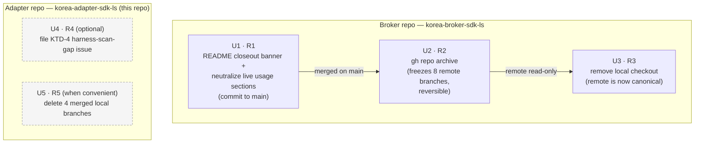

# chore: Broker SDK decommission closeout (external-ops half)

## Summary

Execute the external-ops closeout that ADR 0014 deliberately left out of the
adapter repo. Three required steps run in strict order against the old
`korea-broker-sdk-ls`: put a decommission banner on its README and neutralize
the stale install/usage sections so they no longer read as live instructions
(U1), archive the repo on GitHub to make it read-only and freeze its 8
remote-only branches (U2), then remove the now-redundant local checkout (U3).
Two opportunistic follow-ups run in the adapter repo when convenient: a KTD-4
harness-scan-gap tracking issue (U4) and deletion of 4 already-merged local
branches (U5). No code or audit changes — the decommission gate is already
TRUSTWORTHY-GREEN and recomputed in CI.

**Spans two repos.** U1–U3 target the **broker** repo (`korea-broker-sdk-ls`)
— its `main` branch, its GitHub remote, and its local checkout. U4–U5 target
the **adapter** repo (`korea-adapter-sdk-ls`, this document's home). Each unit
names its target repo explicitly.

---

## Problem Frame

The adapter repo has fully decommissioned `korea-broker-sdk-ls` as a migration
source. The audit reached TRUSTWORTHY-GREEN (26/26 rows confirmed, 0
acceptances), the evidence is frozen under `docs/migration-source/audit/`, and
`docs/adr/0014-migration-source-decommissioned.md` records the closed posture.

ADR 0014 is explicit: *"Physically deleting or archiving the sibling repository
is an external operations act and is out of scope for this repo."* This effort
is that out-of-scope external half (see origin:
`docs/brainstorms/2026-06-18-broker-sdk-decommission-closeout-requirements.md`).
The in-repo work is done; what remains is communicating and enforcing that the
old repo is no longer ordinary reference material.

Ground truth, re-verified at plan time:

- The old repo is hosted remotely at `git@github.com:sunkeunchoi/korea-broker-sdk-ls`,
  and `gh` is authed as the repo owner (`sunkeunchoi`) with archive rights.
- The broker `README.md` still opens as a live SDK (`# ls-sdk`, `ls-sdk = "0.3"`,
  quickstart) with **no** closeout notice. Its live "how to use" sections are
  Installation, Quickstart, Configuration, Manual construction, Convenience API,
  Numeric Parsing, WebSocket Quotes, and Low-level API.
- The local broker checkout has only `main` locally (clean, in sync). Its **8
  other branches are remote-only** — archiving freezes them.
- **No active workflow reads the live sibling checkout.** The audit validator
  `crates/ls-trackers/tests/decommission_audit.rs` recomputes the gate from
  frozen in-repo records. Every remaining `korea-broker-sdk-ls` mention in active
  code is either a guard test-fixture string (in `decommission_audit.rs`) or a
  "Ported from…" attribution comment (`crates/ls-trackers/src/fetch.rs:3`,
  `crates/ls-core/src/lib.rs:3`). → Removing the local checkout is verifiably safe.

---

## Requirements

Execute in order; each required step gates the next.

- **R1** *(required)* — Add a top-of-README closeout banner to the broker repo
  stating the maintained SDK is `korea-adapter-sdk-ls`, this repo is historical
  only, and the audit is recorded in PR #18 / `docs/migration-source/audit/`.
  Also neutralize the live install/usage sections with a short
  "historical — do not use" redirect note so a reader cannot follow stale steps.
  Commit to broker `main`.
- **R2** *(required, after R1)* — Make `sunkeunchoi/korea-broker-sdk-ls`
  read-only via GitHub Archive. Freezes the 8 remote-only branches, disables new
  issues/PRs, fully reversible. Must land after R1 so the notice is the first
  thing an archived visitor sees.
- **R3** *(required, after R2)* — Remove the local sibling checkout at
  `/Users/mini/dev/korea-broker-sdk-ls`. Safety is verified; the archived remote
  is the canonical historical copy. Order after R2 so a read-only remote exists
  before the local copy goes.
- **R4** *(optional, non-blocking)* — File a small issue in the adapter repo
  tracking KTD-4: the decommission guard does not scan agent-harness dirs
  (`.claude/`, `.agents/`, `.compound-engineering/`), so a future hardcoded
  broker path or "consult the old source" instruction added there would be
  invisible to the guard.
- **R5** *(when convenient)* — In the adapter repo, delete the 4 local branches
  already merged into `main`.

---

## Key Technical Decisions

- **Strict R1→R2→R3 ordering, gated.** The banner must exist before the archive
  (so archived visitors see it first), and the read-only remote must exist before
  the local checkout is deleted (so a canonical copy always survives). The order
  is a safety property, not a preference — do not parallelize the spine.
- **Neutralize by redirect note, not deletion (R1).** Each live usage section
  gets a short "Historical — do not use. See `korea-adapter-sdk-ls`." note rather
  than being deleted. Preserves the historical content for reference while making
  it unmistakably non-live. Full deletion is not required (origin R1).
- **Archive, don't delete the GitHub repo (R2).** GitHub Archive freezes all
  remote branches for free, is reversible, and keeps history publicly readable
  behind the closeout notice. Deleting the remote would be irreversible and would
  destroy the canonical historical copy R3 relies on.
- **R3 deletes only the local checkout, after the remote is frozen.** The
  archived remote becomes the single canonical copy. R3's safety rests on the
  verified fact that no active adapter workflow reads the local sibling — the
  audit recomputes from frozen in-repo records.
- **R4 default: file the issue only; do not extend the guard now.** Per origin
  Outstanding Questions, leave the harness-scan gap as a documented gap and
  revisit only if product logic is added under the harness dirs. Extending the
  guard is deferred follow-up work.
- **R5 deletes exactly the 4 `--merged main` branches.** Plan-time verification
  confirmed `git branch --merged main` lists exactly the 4 named branches; a 5th
  local branch (`docs/paper-live-smoke-evidence-cleanup`) is **not** merged and
  must be left untouched.

---

## High-Level Technical Design

The required spine is a strictly-ordered gate chain; the two opportunistic units
hang off the adapter repo independently and can run any time.



Gates are the load-bearing detail: U2 waits on U1 being merged to broker `main`;
U3 waits on U2 producing a read-only remote. U4/U5 have no dependency on the
spine or each other.

---

## Implementation Units

### U1. README closeout notice + neutralize live usage (broker repo)

**Target repo:** `korea-broker-sdk-ls` (commit to `main`)

**Goal:** A reader landing on the old repo's README immediately learns it is
historical and where the maintained SDK lives, and cannot follow stale
install/usage steps.

**Requirements:** R1

**Dependencies:** none (first step of the spine)

**Files:**
- `README.md` (broker repo) — add top banner; add redirect note under each live
  usage section

**Approach:**
- Insert a closeout banner as the first content block, above the `# ls-sdk`
  title or immediately under it, conveying: maintained SDK is
  `korea-adapter-sdk-ls`; this repo is **historical only**; decommission audit
  recorded in PR #18 / `docs/migration-source/audit/`. Banner shape (final
  wording is a writing detail):

  ```
  > ⚠️ DECOMMISSIONED — historical only.
  > The maintained SDK is korea-adapter-sdk-ls.
  > Decommission audit: PR #18 / docs/migration-source/audit/.
  ```
- Add a short redirect note ("Historical — do not use. See
  `korea-adapter-sdk-ls`.") under each live "how to use this SDK" section:
  **Installation, Quickstart, Configuration, Manual construction, Convenience
  API, Numeric Parsing, WebSocket Quotes, Low-level API**. Do not delete the
  section bodies — neutralize, don't remove.
- Leave non-usage sections (Features, Roadmap & Deferred Scope, Support, License)
  as-is unless they read as live instructions.
- Commit to broker `main` (clean, in sync at plan time).

**Test scenarios:** Test expectation: none — documentation-only change in an
external repo with no test suite for README content.

**Verification:**
- The README's first screen shows the closeout banner naming
  `korea-adapter-sdk-ls` and the audit location.
- Each of the 8 named usage sections carries a visible "historical / do not use"
  redirect; none reads as a live, followable instruction.
- The change is committed and pushed to broker `main` (precondition for U2).

---

### U2. Archive the GitHub repo (broker repo)

**Target repo:** `sunkeunchoi/korea-broker-sdk-ls` (GitHub remote)

**Goal:** The old repo is enforced read-only so it cannot drift back into being
live, and its remote-only branches are frozen.

**Requirements:** R2

**Dependencies:** U1 (banner must be merged to `main` first)

**Files:** none (GitHub repo-settings operation, e.g. `gh repo archive
sunkeunchoi/korea-broker-sdk-ls --yes` — `--yes` skips the interactive
confirmation prompt so the step runs non-interactively)

**Approach:**
- Confirm U1 is merged on broker `main` and visible on GitHub before archiving —
  the archived state must present the closeout notice first.
- Archive the repo via GitHub Archive (owner-level `gh` auth with archive rights
  confirmed at plan time). This freezes the 8 remote-only branches, disables new
  issues/PRs, and is fully reversible.

**Test scenarios:** Test expectation: none — external repo-settings change with
no code under test.

**Verification:**
- `sunkeunchoi/korea-broker-sdk-ls` shows as **Archived** on GitHub.
- The remote rejects pushes (read-only).
- The 8 remote-only branches are preserved/frozen, not deleted.

---

### U3. Remove the local sibling checkout (broker repo)

**Target repo:** local checkout `/Users/mini/dev/korea-broker-sdk-ls`
(machine-local path, not a tracked file)

**Goal:** The redundant local sibling checkout is gone; the archived remote is
the canonical historical copy.

**Requirements:** R3

**Dependencies:** U2 (read-only remote must exist first)

**Files:** none (deletes the local working tree at the path above)

**Approach:**
- Confirm U2 has produced a read-only archived remote.
- Re-confirm the local broker checkout is clean and in sync (it was at plan time)
  so nothing unpushed is lost.
- Delete the local checkout directory.

**Execution note:** Before deletion, re-run the adapter repo's audit/CI to
establish the green baseline that R3 must preserve; re-run after deletion to
prove nothing depended on the checkout.

**Test scenarios:** Test expectation: none for new tests — but R3's safety is
**verified by re-running the existing adapter audit validator**
(`crates/ls-trackers/tests/decommission_audit.rs`) and full CI before and after
deletion. Expected: identical pass result both times (the validator recomputes
from frozen in-repo records and never reads the sibling checkout).

**Verification:**
- `/Users/mini/dev/korea-broker-sdk-ls` no longer exists locally.
- The adapter repo's CI / audit validator still passes after deletion (it never
  depended on the checkout).

---

### U4. File the KTD-4 harness-scan-gap issue (adapter repo) — *optional*

**Target repo:** `korea-adapter-sdk-ls` (this repo)

**Goal:** The accepted decommission-guard gap is tracked so it is not silently
forgotten, without blocking the closeout.

**Requirements:** R4

**Dependencies:** none (independent of the spine; non-blocking)

**Files:** none (creates a GitHub issue in the adapter repo)

**Approach:**
- File a small issue in the **adapter** repo (broker issues are disabled by U2,
  and the guard lives here) describing KTD-4: the guard in
  `crates/ls-trackers/tests/decommission_audit.rs` does not scan the agent-harness
  dirs (`.claude/`, `.agents/`, `.compound-engineering/`), so a future hardcoded
  `~/dev/korea-broker-sdk-ls` path or "consult the old source" instruction added
  there would be invisible to the guard.
- Reference the accepted-gap record in
  `docs/plans/2026-06-18-002-feat-physical-decommission-migration-source-plan.md`
  (Open Questions).
- Default scope per origin: track the gap only; do **not** extend the guard now
  (see Deferred to Follow-Up Work).

**Test scenarios:** Test expectation: none — issue-tracking only, no code change.

**Verification:**
- One tracking issue exists in the adapter repo for KTD-4, linking the accepted-gap
  record.

---

### U5. Clean stale merged local branches (adapter repo) — *when convenient*

**Target repo:** `korea-adapter-sdk-ls` (this repo)

**Goal:** No merged-but-undeleted local branches linger in the adapter repo.

**Requirements:** R5

**Dependencies:** none (independent of the spine)

**Files:** none (local branch deletion)

**Approach:**
- Delete the 4 local branches already merged into `main`:
  `docs/maintenance-two-stage-foundation`, `feat/sdk-first-vertical-slice`,
  `feat/t1101-recommended`, `feat/t1101-stage2-expansion`.
- **Do not** delete `docs/paper-live-smoke-evidence-cleanup` — plan-time
  `git branch --merged main` confirmed it is not merged.
- `/ce-clean-gone-branches` can assist. The broker repo has no stale local
  branches (only `main`); its remote branches are frozen by U2.

**Test scenarios:** Test expectation: none — local branch hygiene, no code change.

**Verification:**
- `git branch --merged main` in the adapter repo no longer lists the 4 named
  branches.
- `docs/paper-live-smoke-evidence-cleanup` and all unmerged branches remain.

---

## Scope Boundaries

**In scope:** R1–R5 as above — README notice + neutralization, GitHub archive,
local-checkout removal, and (opportunistically) the KTD-4 issue and merged-branch
cleanup.

**Non-goals (origin Non-Goals — do not do):**
- Re-running or re-auditing the decommission gate — it is already
  TRUSTWORTHY-GREEN and recomputed in CI.
- Editing ADR 0010/0014 or any frozen audit/ledger artifacts.
- Code changes in the adapter repo.
- Deleting the broker GitHub remote (archive, not delete) or deleting its remote
  branches (archive freezes them).

### Deferred to Follow-Up Work

- **Extend the decommission guard to scan the agent-harness dirs** (`.claude/`,
  `.agents/`, `.compound-engineering/`). Per origin Outstanding Questions, the
  default is to leave KTD-4 as a documented/tracked gap (U4) and revisit only if
  product logic is added under those dirs. Not part of this closeout.

---

## Risks & Dependencies

**Dependencies / assumptions:**
- Push access to broker `main` and `gh` auth with archive rights on
  `sunkeunchoi/korea-broker-sdk-ls` — both confirmed at plan time (owner account,
  `repo` scope).
- Broker `main` is the branch that should carry the notice — verified clean and
  in sync with origin.
- The audit gate precondition is already satisfied and CI-recomputed; this effort
  cites it, does not re-run it.

**Risks & mitigations:**
- *Archiving before the banner merges* would show visitors a live-looking README
  behind a read-only repo. → Hard gate: U2 only after U1 is on `main` (verified
  in U2 approach).
- *Deleting the local checkout before a canonical copy is safe* would risk losing
  history. → Hard gate: U3 only after U2 produces the archived remote; re-confirm
  the checkout is clean/in-sync first.
- *Deleting an unmerged branch in U5.* → Restrict deletion to the 4 verified
  `--merged main` branches; explicitly exclude `docs/paper-live-smoke-evidence-cleanup`.
- *Archive is reversible*, so U2 carries low blast radius; if anything looks
  wrong, un-archive and re-evaluate before proceeding to U3.

---

## Success Criteria

- Opening the old repo's README (locally or on GitHub) shows the closeout notice
  at the top, and its install/usage sections no longer read as live instructions.
  *(U1)*
- `sunkeunchoi/korea-broker-sdk-ls` shows as **Archived** on GitHub and rejects
  pushes. *(U2)*
- `/Users/mini/dev/korea-broker-sdk-ls` no longer exists locally, and the adapter
  repo's CI / audit validator still passes (it never depended on the checkout).
  *(U3)*
- If R4 taken: one tracking issue exists in the adapter repo for KTD-4. *(U4)*
- Adapter repo has no merged-but-undeleted local branches. *(U5)*
