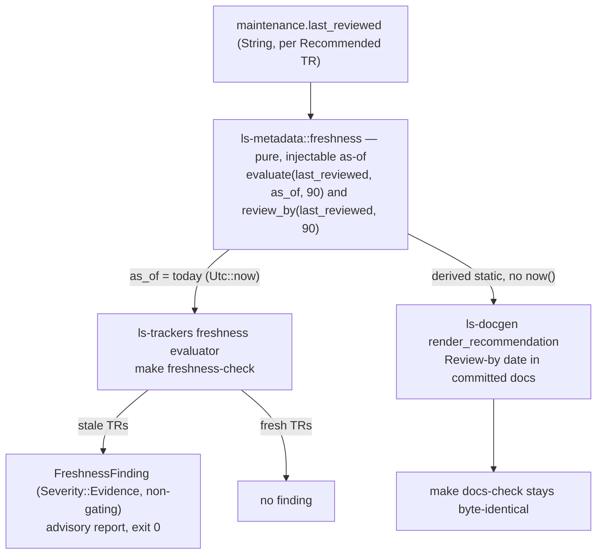

# feat: Evidence-Freshness Evaluator (90-day backstop)

## Summary

Make the documented-but-unenforced 90-day evidence-freshness backstop operative for
the six Recommended TRs. A single pure freshness function in `ls-metadata` computes,
from `maintenance.last_reviewed` and an injectable as-of date, whether a Recommended
TR's Focused Evidence is stale (> 90 days). A new operator-invoked `ls-trackers`
subcommand (`make freshness-check`) evaluates against today, emits a non-gating
`Severity::Evidence` finding per stale TR, and mutates nothing. `ls-docgen` renders a
deterministic "review-by" date derived from the same function. Re-attestation stays
human.

## Problem Frame

`metadata/EVIDENCE-FRESHNESS.md` and the rendered `REVOCATION_POLICY` both state the
freshness contract and then admit "no code enforces any of the controls." That was
acceptable when nothing was recommended; now six TRs (`token`, `t1101`, `t1102`,
`t8412`, `S3_`, `CSPAQ12200`) carry a user-facing recommendation whose only backing
control is a maintainer remembering to re-attest. The 90-day backstop is the cheap
half of the deferred evaluator and the single piece that gives a Recommended claim any
automated revocation signal. `Severity::Evidence` already exists in the ladder but is
declared unreachable, and `gates_for` already excludes it — this work is what finally
reaches that variant.

---

## Key Technical Decisions

- **Docgen stays byte-deterministic; the live verdict lives in the evaluator (resolves
  the origin's Resolve-before-planning item).** `ls-docgen`'s `check_docs` is a
  byte-for-byte comparison guarded by a golden regeneration test
  (`crates/ls-docgen/tests/determinism.rs`), and the generator emits no wall-clock by
  contract. A computed "stale today" marker in committed docs would make the same
  metadata render differently across calendar dates and break `make docs-check`.
  Resolution: committed docs render a **deterministic review-by date** (`last_reviewed`
  + 90 days), a pure function of stored metadata. The time-relative stale verdict and
  the `Severity::Evidence` finding are produced only by the evaluator run (as-of today),
  never baked into committed docs. This refines origin R8/R9: the committed-doc signal
  becomes the review-by date (which a reader compares against today), and the live
  "stale (Nd)" verdict moves to the evaluator report — a trade-off forced by the
  determinism invariant, not the in-page stale marker R8/R9 first envisioned. A reader
  who only ever reads committed docs and never runs `make freshness-check` sees the
  review-by date but not an explicit "stale" word; closing that residual is the
  deferred cadence-wiring follow-up. `support.recommended` is never mutated either way.

- **One shared freshness function in `ls-metadata` (resolves the origin's open
  question).** `ls-metadata` is the leaf crate both `ls-docgen` and `ls-trackers`
  already depend on, so a pure function there is reachable by both with no dependency
  cycle (the alternative, `ls-trackers`, is not reachable from `ls-docgen`). This
  mirrors the repo's single-source discipline for `gates_for` and
  `example_change_severity` — there is no second copy of the 90-day rule. `chrono` is
  added to `ls-metadata` (already a pinned workspace dependency) for `NaiveDate` math.

- **A dedicated finding type, not a structural-`Change` finding (resolves the origin's
  finding-representation question).** `TrackerFinding` / `DriftFinding` both carry a
  required structural `Change` a time-based finding has no value for. The evaluator emits
  a lightweight `FreshnessFinding` (TR code, `last_reviewed`, age in days, severity) and
  prints it through a freshness report that mirrors `print_spec_report` — the existing
  always-advisory report with no GATE column. The payload carries only structural
  descriptors, never raw evidence content.

- **Advisory by construction.** The evaluator is a new subcommand on the existing
  `ls-trackers` binary, operator-invoked like `api-drift-check` / `spec-doc-check`, and
  exits `0` even when evidence is stale (`Severity::Evidence` sits below
  `Severity::Maintenance`, so `gates_for` never trips). It mutates nothing — metadata,
  evidence files, baselines, and docs are byte-identical after a run.

- **Injectable as-of, no wall-clock in tests.** The pure function takes `as_of:
  NaiveDate`. The evaluator defaults it to `Utc::now().date_naive()`; tests inject a
  fixed future date to exercise staleness, and the default-today path is verified by
  asserting the no-arg result equals the function called with a single captured date —
  never two independent clock reads (which flake across the UTC midnight boundary).

- **Read `last_reviewed` only; add no freshness field.** The validator already enforces
  `evidence.date == maintenance.last_reviewed`, so the freshness date is unambiguously
  `last_reviewed`. Recommended TRs are selected by `meta.support.recommended == true`
  directly (they also satisfy `implemented`, so `SupportState` projects them to
  `Implemented` — the boolean is the correct selector).

---

## High-Level Technical Design

One freshness rule, two consumers — the live verdict and the deterministic doc surface
draw from the same function but differ in what date they evaluate against.

Prose is authoritative where it and the diagram differ.

---

## Requirements Trace

Origin requirements (see origin: `docs/brainstorms/2026-06-19-evidence-freshness-evaluator-requirements.md`):

- R1, R2, R3, R4 (freshness computation) → U1, U2
- R5, R6, R7 (finding emission, non-gating, non-mutation) → U2, U3
- R8, R9 (generated-doc surface — refined to a deterministic review-by date per KTD) → U4
- R10 (`REVOCATION_POLICY` per-clause candor), R11 (`EVIDENCE-FRESHNESS.md`) → U5
- R12 (human re-attestation, recompute-on-invocation) → U2 (AE4 test: re-attestation re-evaluates fresh); no code change beyond the evaluator clearing on the next run
- AE1–AE7 → test scenarios in U1–U4 (linked per unit)

---

## Implementation Units

### U1. Pure freshness function in `ls-metadata`

- **Goal:** A single pure, as-of-injectable function computing freshness, plus a
  deterministic review-by-date derivation, with explicit date-parse handling.
- **Requirements:** R1, R2, R3, R4.
- **Dependencies:** none.
- **Files:**
  - `crates/ls-metadata/src/freshness.rs` (new)
  - `crates/ls-metadata/src/lib.rs` (module export)
  - `crates/ls-metadata/Cargo.toml` (add `chrono` workspace dep)
- **Approach:** Define `FreshnessState` (`Fresh`, or `Stale { age_days }`). Implement
  `evaluate(last_reviewed: &str, as_of: NaiveDate, window_days: i64) -> Result<FreshnessState, FreshnessError>`:
  parse `last_reviewed` with `NaiveDate::parse_from_str(s, "%Y-%m-%d")`, compute
  `(as_of - last_reviewed).num_days()`, return `Stale { age_days }` when `> window_days`
  else `Fresh`. Implement `review_by(last_reviewed: &str, window_days: i64) -> Result<NaiveDate, FreshnessError>`
  returning `last_reviewed + window_days` for the docgen surface (no `now()`). The
  function is agnostic to support state — caller filters Recommended TRs.
- **Patterns to follow:** `NaiveDate` arithmetic as in `crates/ls-sdk/tests/live_smoke.rs`
  (note: that file parses `%Y%m%d`; `last_reviewed` is dashed ISO `%Y-%m-%d`). Error
  type mirrors `thiserror` usage already in `ls-metadata`.
- **Test scenarios:**
  - Fresh within window: `last_reviewed 2026-06-17`, `as_of 2026-08-01` → `Fresh`. `Covers AE1.`
  - Boundary: `as_of 2026-09-15` (exactly 90) → `Fresh`; `as_of 2026-09-16` (91) → `Stale { age_days: 91 }`. `Covers AE2.`
  - Stale with correct age reported.
  - Unparseable / malformed `last_reviewed` → `Err`, not a panic and not a silent "fresh".
  - `review_by` derivation: `last_reviewed 2026-06-17`, window 90 → `2026-09-15`; deterministic across calls.
- **Verification:** `cargo test -p ls-metadata` green; no `Utc::now()` in any assertion.

### U2. Freshness evaluator and finding type in `ls-trackers`

- **Goal:** Load metadata, select Recommended TRs, evaluate each against an injectable
  as-of, and collect `Severity::Evidence` findings — making the previously-unreachable
  variant reachable.
- **Requirements:** R4, R5, R6, R12.
- **Dependencies:** U1.
- **Files:**
  - `crates/ls-trackers/src/freshness.rs` (new — evaluator + `FreshnessFinding`)
  - `crates/ls-trackers/src/lib.rs` (module export)
  - `crates/ls-trackers/src/types.rs` (update the `Severity::Evidence` candor comment — now reachable)
- **Approach:** `FreshnessFinding { tr_code: String, last_reviewed: String, age_days: i64, severity: Severity }`
  with `severity = Severity::Evidence` always. An `evaluate_recommended(trs, evidence,
  as_of) -> Vec<FreshnessFinding>` filters `meta.support.recommended == true`, calls
  `ls_metadata::freshness::evaluate`, and emits a finding for each `Stale`. Default
  as-of helper reads `Utc::now().date_naive()`; the pure path takes `as_of`. Do not
  route through `gates_for` for emission; rely on `Severity::Evidence < Maintenance` so
  any later gate check is automatically false. Both the selector (`support.recommended`)
  and the freshness input (`maintenance.last_reviewed`) are fields on `TrMetadata`, read
  from `validate_dir(...).trs`; the evaluator consumes no Focused Evidence records (the
  existing `load_metadata` helper already projects to `.trs`).
- **Patterns to follow:** `support_state_for` / direct `support.recommended` checks in
  `crates/ls-trackers/src/api_drift.rs`; `load_metadata` in `crates/ls-trackers/src/cli.rs`;
  `example_change_severity` as the precedent for an advisory severity computed separately
  from `gates_for`.
- **Test scenarios:**
  - Recommended + fresh → no finding. `Covers AE1.`
  - Recommended + stale (injected `as_of 2026-09-16`) → exactly one `FreshnessFinding`, `severity == Evidence`, correct `age_days` and `last_reviewed`. `Covers AE3.`
  - A `gates_for`-style check over the emitted finding returns false (non-gating). `Covers AE3.`
  - Implemented-but-not-recommended TR (e.g. `revoke`) → no finding regardless of any date. `Covers AE5.`
  - Tracked-only and untracked TRs → no finding. `Covers AE5.`
  - Default-as-of path: no-arg evaluator result equals the injectable evaluator called with a single captured `date_naive()` (no second clock read). `Covers AE7.`
  - Re-attestation clears it: a TR stale at an injected `as_of`, after advancing its `last_reviewed` to that `as_of`, re-evaluates fresh with no finding (recompute-on-invocation — pins R12 against any future finding-persistence regression). `Covers AE4.`
- **Verification:** `cargo test -p ls-trackers` green; stale behavior proven with injected dates only.

### U3. CLI subcommand, advisory report, and make target

- **Goal:** Expose the evaluator as `cargo run -p ls-trackers -- freshness check` behind
  `make freshness-check`, printing an advisory report and exiting 0.
- **Requirements:** R5, R6, R7.
- **Dependencies:** U2.
- **Files:**
  - `crates/ls-trackers/src/cli.rs` (new `freshness` family in `parse_args`/`dispatch`, `Command` variant, exit mapping)
  - `Makefile` (`freshness-check` target)
  - `docs/MAINTENANCE_RUNBOOK.md` (document the new operator checkpoint)
- **Approach:** Add a `freshness` family alongside `api-drift` / `spec-doc`. Implement
  `print_freshness_report` mirroring `print_spec_report` — per-TR line (`evidence <tr>
  <age>d past review`) with no GATE column — plus a summary line ("N of M Recommended TRs
  stale"). Exit always `0` for stale findings (advisory), `2` for metadata-load errors,
  mirroring `spec_exit_for`. Reuse `Paths` for tempdir-driven tests. Make target:
  `cargo run -q -p ls-trackers -- freshness check`, `.PHONY`, excluded from default CI
  like the other checkpoints.
- **Patterns to follow:** `spec-doc` target (`Makefile`), `print_spec_report` and
  `spec_exit_for` (`crates/ls-trackers/src/cli.rs`), `Paths::defaults()`.
- **Test scenarios:**
  - CLI over a tempdir with a stale Recommended TR: report lists it, exit code 0. `Covers AE3.`
  - CLI with all-fresh metadata: empty/"0 stale" report, exit 0.
  - Metadata-load error path → exit 2.
  - **Non-mutation:** capture metadata, evidence files, baselines, and generated docs before a stale-TR run; assert all byte-for-byte identical after. `Covers AE6.`
- **Verification:** `make freshness-check` runs; `cargo test -p ls-trackers` green; non-mutation assertion passes.

### U4. Deterministic review-by date in `ls-docgen`

- **Goal:** Render a deterministic review-by date in each Recommended TR's contract
  without introducing wall-clock, keeping `make docs-check` byte-stable.
- **Requirements:** R8, R9 (as refined by the determinism KTD).
- **Dependencies:** U1.
- **Files:**
  - `crates/ls-docgen/src/lib.rs` (`render_recommendation` adds a review-by line)
  - `crates/ls-docgen/tests/determinism.rs` (golden regeneration still green)
- **Approach:** In `render_recommendation`, call `ls_metadata::freshness::review_by(
  meta.maintenance.last_reviewed, 90)` and render a `Review by: \`<date>\`` line next to
  the existing `Freshness date:` line. Pure function of `last_reviewed` — no clock, so
  byte-determinism holds. `support.recommended` and the Recommended banner are unchanged
  (no demotion). Regenerate committed docs so `docs-check` matches.
- **Patterns to follow:** `render_recommendation` rendering `last_reviewed` verbatim; the
  module determinism contract ("emit no wall-clock") in `crates/ls-docgen/src/lib.rs`.
- **Test scenarios:**
  - A Recommended TR page renders the review-by line as `last_reviewed` + 90 days (the docgen surface for R8/R9 as refined — a deterministic derivation, not an origin AE boundary test).
  - Page still renders as Recommended, banner unchanged and `support.recommended` untouched (the doc-surface half of AE3; the stale verdict itself is the evaluator's per the determinism KTD, not the committed page).
  - Regeneration is byte-identical to committed docs and stable across two runs — the determinism guard (extends `tests/determinism.rs`). Non-mutation of the evaluator run is AE6, verified in U3, not here.
  - A non-Recommended TR page renders no review-by line. `Covers AE5.`
- **Verification:** `cargo test -p ls-docgen` and `make docs-check` green after regenerating docs.

### U5. Doc-truthfulness updates (per-clause candor)

- **Goal:** Bring the rendered revocation policy and the freshness policy doc in line with
  what is now enforced — the backstop is operative; change-driven invalidation stays
  deferred.
- **Requirements:** R10, R11.
- **Dependencies:** U4.
- **Files:**
  - `crates/ls-docgen/src/lib.rs` (`REVOCATION_POLICY` const + its guarding comment)
  - `crates/ls-docgen/src/lib.rs` tests (`recommended_page_states_policy_not_enforcement` and siblings)
  - `metadata/EVIDENCE-FRESHNESS.md` ("What is operative today" section)
- **Approach:** Reword `REVOCATION_POLICY` to per-clause candor: the 90-day backstop is
  described as enforced (computed by the evaluator and surfaced as a review-by date); the
  structural-change clause stays "stated policy, not enforced" until the change-driven
  increment ships. Update the guarding comment so it no longer says "not enforced by code
  today" wholesale. Update `EVIDENCE-FRESHNESS.md` so its operative-today section reflects
  the computed backstop while keeping change-driven invalidation in the deferred section.
  Regenerate docs.
- **Patterns to follow:** the existing split-candor framing already present in
  `metadata/EVIDENCE-FRESHNESS.md`; the contract-text tests in `crates/ls-docgen/src/lib.rs`.
- **Test scenarios:**
  - The recommendation contract test asserts the backstop clause reads as enforced and the structural-change clause still reads as stated-not-enforced.
  - `make docs-check` green after regenerating docs with the new policy text.
  - Test expectation for `EVIDENCE-FRESHNESS.md`: none — prose policy doc, no behavioral change. Covered by the validator/docgen suites staying green.
- **Verification:** `cargo test -p ls-docgen` and `make docs-check` green; `EVIDENCE-FRESHNESS.md` reads consistently with the rendered policy.

---

## Scope Boundaries

**Deferred for later** (carried from origin):
- Change-driven invalidation: a maintained-TR Structural API Shape change staling Focused
  Evidence and firing `Severity::Evidence`. The next increment; shares the same finding
  surface and `ls-metadata` function built here.
- Per-class freshness tightening (e.g. a shorter window for `orders`) — uniform 90-day
  default holds until those classes have Recommended TRs.

**Outside this work's identity** (carried from origin):
- Staleness as a CI gate or build failure — `Severity::Evidence` is advisory by design.
- Any evaluator-driven mutation of metadata, evidence, baselines, or docs.
- `revoke` promotion (new smoke harness, session-token invalidation concerns) and order
  runtime (ADR 0008 — waits for the full safety package).

**Deferred to Follow-Up Work** (plan-local):
- Wiring `make freshness-check` into a scheduled run or release hook so the on-demand
  signal surfaces on a cadence rather than only when an operator runs it. The evaluator is
  the surfacing path; automating its cadence is separate work.
- README "token is currently the only Recommended TR" correction and the CONTEXT.md
  glossary commit — prerequisite pre-work the origin explicitly held out of scope; not
  tracked as requirements here. This plan assumes generated docs already reflect the six
  Recommended TRs.

---

## Risks & Dependencies

- **Determinism regression (primary risk).** Any accidental use of `Utc::now()` in the
  docgen path (U4/U5) would flake `make docs-check` at the 90-day boundary. Mitigation:
  all clock access lives in the `ls-trackers` evaluator; docgen calls only `review_by`,
  which takes no clock. The existing `tests/determinism.rs` golden guard catches a
  regression.
- **Date-parse fragility.** `last_reviewed` is a free-form `String`. A malformed date must
  return an error, not panic or silently read as fresh (U1 test). The validator already
  enforces `evidence.date == last_reviewed`, bounding the surface to authored dates.
- **`chrono` added to `ls-metadata`.** A new dependency on a leaf crate; `ls-docgen`
  inherits it transitively only through `review_by`. Low risk — `chrono` is already a
  pinned workspace dependency used in three crates.

---

## Open Questions (Deferred to Implementation)

- Exact wording of the review-by line and the per-clause `REVOCATION_POLICY` text —
  settled against the contract tests during implementation.
- Whether the freshness report's summary line should enumerate stale TRs or only count
  them — decided when `print_freshness_report` is written against the spec-doc precedent.

---

## Sources & Research

- Origin requirements: `docs/brainstorms/2026-06-19-evidence-freshness-evaluator-requirements.md`
- `crates/ls-trackers/src/types.rs` — `Severity` (Evidence variant + candor comment), `gates_for` (excludes Evidence).
- `crates/ls-metadata/src/schema.rs` — `Maintenance.last_reviewed`, `EvidenceRecord.date`, `Support`.
- `crates/ls-metadata/src/validator.rs` — `validate_dir`, `check_recommendation` (enforces `evidence.date == last_reviewed`).
- `crates/ls-docgen/src/lib.rs` — `render_recommendation`, `REVOCATION_POLICY`, `check_docs` (byte-for-byte), determinism contract.
- `crates/ls-docgen/tests/determinism.rs` — golden regeneration / `make docs-check` guard.
- `crates/ls-trackers/src/cli.rs` — `parse_args`/`dispatch`, `print_spec_report`, `spec_exit_for`, `load_metadata`, `Paths`.
- `Makefile` — `api-drift-check`, `spec-doc-check`, `docs`, `docs-check` targets and the tiered exit contract.
- `crates/ls-sdk/tests/live_smoke.rs` — `NaiveDate` / `Utc::now().date_naive()` precedent.
- `metadata/EVIDENCE-FRESHNESS.md` — the freshness policy being made operative.
- `docs/solutions/architecture-patterns/change-tracker-baseline-clean-self-diff.md` — determinism-as-precondition learning.
- ADR `docs/adr/0005-staged-snapshots-for-change-tracking.md` — advisory-not-gating posture.
