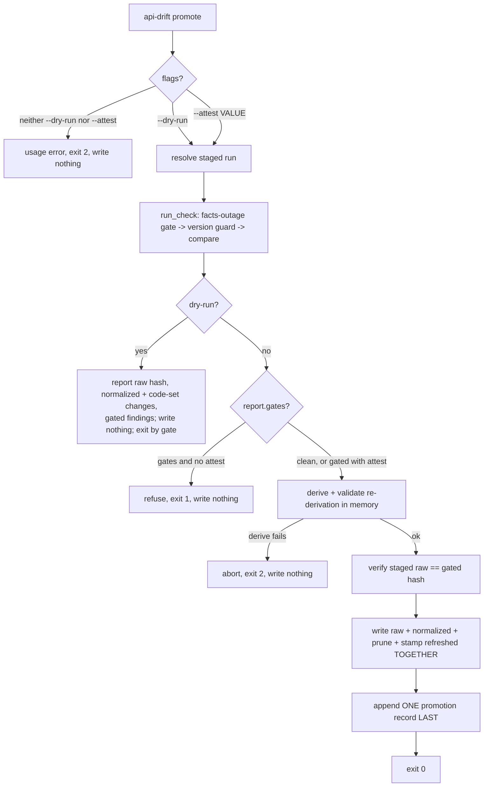
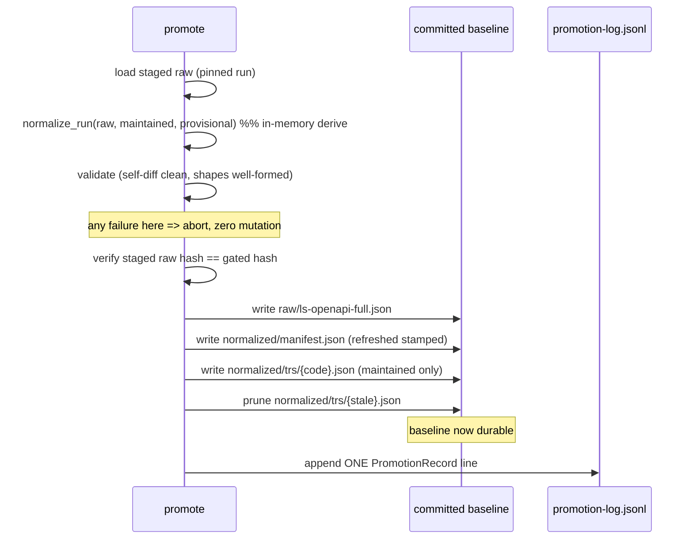

# feat: API Drift Baseline Promotion (mutating `api-drift promote`)

## Summary

Add a mutating `api-drift promote` command that performs a reviewed **Baseline Promotion**: it pins a reviewed **Staged Snapshot**, runs the existing drift gate, and — only with `--attest <operator-or-issue>` — replaces the committed API Drift raw **Reviewed Baseline** wholesale, re-derives the committed normalized baselines from that raw (maintained codes only, preserving `provisional`, pruning stale shapes), and appends exactly one structured record to a committed append-only promotion log. A clean diff promotes directly under attestation; a diff carrying gated **Tracker Findings** refuses without attestation. The command reuses the existing single-sourced gate (`run_check` / `gates_for`) and `renormalize`-style re-derivation rather than inventing new surfaces, and deliberately touches nothing else — no TR metadata, evidence dates, recommendation state, generated docs, or `code-set.json` admission.

This closes the refresh lifecycle that today has no maintained command: `promote` is currently parse-blocked to `--dry-run` and writes nothing.

---

## Problem Frame

The API Drift refresh lifecycle has a gap. `fetch` stages a raw snapshot plus normalized shapes under `target/ls-trackers/api-drift/runs/{timestamp}/` and updates a `latest.txt` pointer. `renormalize` re-reads the *already-committed* raw and rewrites normalized baselines from it. But `promote` is parse-blocked to `--dry-run` (`crates/ls-trackers/src/cli.rs` `parse_api_drift`, around lines 207–221) — it prints what a promotion *would* touch and writes nothing.

So no maintained command moves a reviewed staged raw snapshot into the committed baseline at `crates/ls-trackers/baselines/api-drift/raw/`. An operator who has reviewed a staged run cannot advance the comparison point without hand-editing committed files, and there is no durable record of when, from what, and on whose review a promotion happened.

This plan builds the mutating path, gated and attested, with a machine-readable trace that spec-doc automation can later watch.

---

## Key Technical Decisions

- **KTD1 — Reuse the single-sourced gate, don't invent a review surface.** Promote calls the existing `run_check` (`cli.rs` ~427) which already runs the facts-outage/completeness gate before `compare`, refuses cross-normalizer-version comparison, and produces gated findings via `gates_for` (`types.rs` ~292). Promote refuses to mutate when `report.gates()` is true unless `--attest` is present. This realizes the brainstorm's "reuse Support-Aware Severity gating" decision and ADR 0005's "promote only after review." (origin: R6, R7; see `docs/adr/0005-staged-snapshots-for-change-tracking.md`)
- **KTD2 — Derive-then-write with log-last ordering, honest crash posture.** Compute and validate the full re-derivation from the staged raw *in memory* before writing any committed file; a re-derivation failure aborts with **zero mutation** — that is the guarantee promote provides. The subsequent write set (raw + re-derived normalized shapes + prunes, then `manifest.refreshed` stamp) is a sequence of per-file `fs::write`/`remove_file` calls (matching `renormalize_committed`); it is **not** crash-atomic, because the crate has no transaction or atomic-swap primitive. A process crash mid-write can leave a torn committed baseline; the recovery model is `git diff`/`git checkout` of the working tree plus a re-run of promote, not in-process rollback. The promotion-log record appends **last**, after the baseline files are written, so the one self-detecting inconsistency — a baseline advanced without its log record — is re-appendable rather than a silent loss. Promote is assumed to be invoked serially by a single operator; concurrent invocations are out of scope (see Risks). A temp-dir-write-then-directory-swap hardening is possible but deferred (see Deferred to Follow-Up Work). (origin: R5)
- **KTD3 — Pin the staged run; capture the raw hash at resolve time and re-verify the file is unchanged before writing.** Promote resolves the staged-run path first (`--staged <run>` or the `latest.txt` default) and runs the drift check against that exact run, never a live fetch. Note the gate (`run_check`) evaluates the staged run's **persisted normalized shapes**, not the raw — it computes no raw hash. So promote itself computes `whole_raw_hash` over the staged `raw/ls-openapi-full.json` bytes at resolve time (the value recorded in the log, R14), and immediately before writing re-reads the same pinned file and re-hashes it to confirm the bytes are unchanged. This guards an in-process TOCTOU on the pinned file between gate and write; it does not (and cannot) re-check "what the gate saw," because the gate never read the raw. (origin: R2; ADR 0005)
- **KTD4 — Whole-raw hash over the on-disk file bytes, via the existing FNV-1a-hex convention.** R14's raw snapshot hash is a new whole-raw digest computed by FNV-1a-hex (`api_drift.rs` ~1008) over the **raw file's on-disk bytes** — read the staged `raw/ls-openapi-full.json` as bytes and hash those directly. Do **not** re-serialize the in-memory `RawInventory`: its `groups`/`trs` are insertion-ordered `Vec`s (not BTree-backed), so re-serialization is order-sensitive and would make the hash mismatch for semantically identical data. Hashing the file bytes is content-stable regardless of struct ordering and matches the bytes promote actually writes. `fnv1a_hex` is the codebase's deliberate cross-machine/cross-Rust-version deterministic hash; no `sha2`/crypto dependency is added — this is an audit/integrity digest for detecting accidental mutation, not a defense against an adversary who controls the staged run. It is **distinct** from the per-TR `maintenance.source_spec_hash` (hand-authored, left stale by R12). *(Call-out resolved: FNV-1a over sha2.)*
- **KTD5 — Promotion log is append-only JSONL.** Each successful promote appends one single-line JSON record to `crates/ls-trackers/baselines/api-drift/promotion-log.jsonl` via append-mode I/O (`OpenOptions::new().create(true).append(true)`). This is the crate's first append-mode writer — every existing write is whole-file `fs::write`; the unit documents that. JSONL gives clean append semantics and compact reviewer diffs. `SEED-ATTESTATION.md` is unchanged. *(Call-out resolved: JSONL over pretty-JSON array.)* (origin: R14, R15)
- **KTD6 — Attested-by is free-form, non-empty.** `--attest <value>` carries an operator string or issue reference, validated only as non-empty. No operator-identity registry exists to validate against; free-form matches the brainstorm's `<operator-or-issue>` framing. *(Call-out resolved.)* (origin: R7, Outstanding Question 2)
- **KTD7 — Narrowed write set.** Promote writes only raw + re-derived normalized (manifest + per-TR shapes) + prunes. It does **not** touch the `metadata_fields` / `generated_docs` that `promote_targets` (`stages.rs` ~227) enumerates as the advisory superset, nor admit new TRs into `code-set.json`. Those are the human follow-up. (origin: R10, R11, R12)
- **KTD8 — Stamp `manifest.refreshed` on promote.** Promote is a baseline-update path, so it must stamp `manifest.refreshed` with today's date via the injected `as_of` clock seam (operator passes today; tests pass a fixed date), exactly as `renormalize_committed` does. This obligation post-dates the brainstorm (added by the just-landed change-driven evidence invalidation work) — missing it would leave the advanced baseline reading falsely fresh. (see `docs/plans/2026-06-20-001-feat-change-driven-evidence-invalidation-plan.md`)

---

## High-Level Technical Design

*Directional guidance for reviewers — not implementation specification.*

### Control flow: dry-run vs. gated vs. attested

### Mutation ordering (derive-then-write, log-last)

The two-phase shape — derive+validate fully (a derive failure mutates nothing), then write the baseline files, then append the log as the final step — bounds the failure modes: a *derive* failure leaves the old baseline intact, and a crash *after* the baseline write but before the log append leaves an advanced baseline with a self-detecting, re-appendable missing-log inconsistency. A crash *during* the multi-file baseline write is not prevented (the writes are not crash-atomic, per KTD2); it is recovered via the git working tree, not in-process rollback.

---

## Implementation Units

### U1. Promote argument parsing and dispatch variant

**Goal:** Replace the `--dry-run`-only parse block with one that accepts `--dry-run`, `--attest <value>`, and `--staged <run>`, and errors when neither `--dry-run` nor `--attest` is given.

**Requirements:** R4 (origin); AE6.

**Dependencies:** none.

**Files:**
- `crates/ls-trackers/src/cli.rs` — `Command` enum (~56–102): add `Command::Promote { staged: Option<PathBuf>, attest: String }`; keep `PromoteDryRun { staged }`. Replace the `Some("promote") => { ... requires --dry-run ... }` block (~207–221) with branch logic. Update the usage string (~229–230). Add an `--attest` token consumer mirroring `parse_staged` (~254–270).
- `crates/ls-trackers/src/cli.rs` (tests) — `#[cfg(test)] mod tests`.

**Approach:** Hand-rolled parsing (no clap), matching the existing style. Precedence: if `--dry-run` present → `PromoteDryRun`; else if `--attest <value>` present → `Promote { staged, attest }`; else → `Err` usage error. `--attest` consumes a following non-empty value token; an empty/missing value is a usage error (KTD6). `--staged <run>` is parsed in both branches via the existing `parse_staged` helper. Wire both variants into `dispatch`.

**Patterns to follow:** `parse_staged` (`cli.rs` ~254) for two-token consume; the existing `Some("promote")` block being replaced; `Fetch { seed }` parse/dispatch (~194–203, ~921–930) for the variant-add shape.

**Test scenarios:**
- `promote --dry-run` parses to `PromoteDryRun { staged: None }`. (happy path)
- `promote --attest ENG-123` parses to `Promote { staged: None, attest: "ENG-123" }`. (happy path)
- `promote --attest ENG-123 --staged <dir>` parses with both fields populated.
- `promote --dry-run --staged <dir>` parses to `PromoteDryRun` with staged set.
- Covers AE6. `promote` with neither `--dry-run` nor `--attest` returns a usage `Err` (maps to exit 2) and writes nothing.
- `promote --attest` with no following value (or empty string) returns a usage `Err`.
- `--dry-run` takes precedence: `promote --dry-run --attest X` routes to the non-mutating preview.

### U2. Staged-run resolution with `latest.txt` reader

**Goal:** Resolve the staged run promote operates on — explicit `--staged <run>` or, by default, the run named by `latest.txt`. The `latest.txt` *reader* is net-new (the file is written today but read by nothing).

**Requirements:** R2 (origin).

**Dependencies:** none (consumed by U5, U6).

**Files:**
- `crates/ls-trackers/src/cli.rs` — add a `resolve_staged_run(paths, staged: Option<PathBuf>) -> Result<PathBuf, String>` helper near `update_latest` (~892–902) and `run_check` (~427). Reuse the run-root layout (`run_root`/`runs/` ~127).
- `crates/ls-trackers/src/cli.rs` (tests).

**Approach:** If `--staged` is `Some`, resolve and validate that path exists as a staged run directory (contains `raw/ls-openapi-full.json`). If `None`, read `<run_root>/latest.txt`, which holds a relative `runs/{name}\n` path (`update_latest` ~892), trim it, join against `run_root`, and validate. Missing `latest.txt`, an empty/whitespace pointer, or a non-existent target is a clear `Err` (no live fetch fallback — promote pins, never fetches). This resolved path is then handed to `run_check` so the gate and the write operate on the same pinned run.

**Patterns to follow:** `update_latest` (`cli.rs` ~892) for the `runs/{name}` relative-path contract; `run_check`'s staged-path branch (~427–491); file-name constants `RAW_FILE` etc. (~276–280).

**Test scenarios:**
- Explicit `--staged <dir>` resolves to that directory. (happy path)
- Default resolution reads `latest.txt` (`runs/2026-...Z\n`) and resolves to the pointed run. (happy path)
- Missing `latest.txt` → `Err` naming the missing pointer. (error path)
- `latest.txt` present but pointing at a non-existent run dir → `Err`. (error path)
- Empty/whitespace-only `latest.txt` → `Err`. (edge case)
- `--staged` path that exists but lacks `raw/ls-openapi-full.json` → `Err`. (edge case)

### U3. Whole-raw hash

**Goal:** A deterministic whole-raw digest computed over the canonical serialized raw bytes, used in the promotion record (R14) and the pre-write byte verification (R2).

**Requirements:** R2, R14 (origin).

**Dependencies:** none (consumed by U4, U5, U6).

**Files:**
- `crates/ls-trackers/src/api_drift.rs` — add `pub(crate) fn whole_raw_hash(raw_bytes: &[u8]) -> String` near `fnv1a_hex` (~1008–1017); promote `fnv1a_hex` to `pub(crate)` if not already reachable.
- `crates/ls-trackers/src/api_drift.rs` (tests) or `cli.rs` tests.

**Approach:** FNV-1a-hex the **on-disk bytes** of the staged `raw/ls-openapi-full.json` (read the file with `fs::read`, hash the bytes). Hash file content, **not** a re-serialization of the in-memory `RawInventory`: `RawInventory.groups` and `RawGroup.trs` are insertion-ordered `Vec`s, so re-serializing is order-sensitive and would spuriously mismatch for semantically identical data — only `property_types` is BTree-backed. Hashing file bytes is content-stable regardless of struct ordering and matches the bytes promote writes (KTD4). Keep it **distinct** from `description_hash`/`source_spec_hash`.

**Patterns to follow:** `fnv1a_hex` (`api_drift.rs` ~1008) and its determinism rationale (the doc comment explaining why `DefaultHasher` was rejected); `hash_description` (~305) for the "normalize then FNV" shape.

**Test scenarios:**
- Hashing the same file bytes twice yields the identical hex string. (determinism)
- Two raw files differing in one byte yield different hashes. (sensitivity)
- A raw whose in-memory `groups`/`trs` would re-serialize in a different order than the on-disk file still hashes from the file bytes — i.e. the hash is taken from file content, not a struct round-trip. (order-independence — guards the U5 pre-write verification against the Vec-ordering trap)
- `Test expectation` note: assert the hash is not equal to any per-TR `description_hash` for a fixture raw, documenting the distinctness invariant.

### U4. Promotion record type and append-only log writer

**Goal:** Define the structured promotion record and a writer that appends exactly one single-line JSON record to the committed append-only log, preserving all prior records.

**Requirements:** R14, R15 (origin); AE3.

**Dependencies:** U3 (record carries the whole-raw hash).

**Files:**
- `crates/ls-trackers/src/types.rs` — add `#[derive(Serialize, Deserialize)] PromotionRecord` near `PromoteReport` (~172–180): fields for promotion timestamp, source staged-run identity, raw snapshot hash, attested-by value, accepted gated findings (if any), affected TR codes, and an optional free-form note.
- `crates/ls-trackers/src/cli.rs` — add `append_promotion_record(paths, record: &PromotionRecord) -> Result<(), String>` near `write_json` (~309–316).
- `crates/ls-trackers/src/cli.rs` (tests).

**Approach:** Path is `<baseline_dir>/promotion-log.jsonl`. Serialize each record with `serde_json::to_string` (single line, no pretty), append `\n`, and append via `OpenOptions::new().create(true).append(true)`. Document that this is the crate's first append-mode writer (every other write is whole-file `fs::write`). **One-line-per-record integrity:** every field — including the free-form `attested-by` and optional `note` — is populated only as a typed Rust `String` on the record and serialized **exclusively** through `serde_json::to_string` on the whole record; never construct the JSONL line by manual string concatenation. This makes `serde`'s escaping the single guarantor that an operator value containing a newline or JSON metacharacter cannot inject a spurious log line. **Secret-safety:** the `accepted findings` and `affected TR codes` fields carry only codes, severities, and finding-kind labels derived from the drift report — never raw `serde_json::Value` payloads or `TrShape` scalar values (the structural types already discard scalars). The accepted-findings field is auto-derived from the gated `DriftReport`, not named by a separate flag (R8). `SEED-ATTESTATION.md` is never touched.

**Patterns to follow:** `freshness::report_to_json` (`freshness.rs` ~482) for the serde-DTO → JSON contract; `upsert_attested_fields` (`cli.rs` ~815) for the "append while preserving prior content, no accumulation of duplicates" discipline; `write_json` (~309) for the trailing-newline convention.

**Test scenarios:**
- Appending to a non-existent log creates it with exactly one line. (happy path)
- Appending a second record yields exactly two lines; the first line is byte-identical to before. (append-preserves-prior)
- Each line round-trips: `serde_json::from_str::<PromotionRecord>` of every line succeeds. (serialization contract)
- Covers AE3. A record built from a gated report carries the accepted-findings field naming the breaking change plus the attested-by value, auto-derived from the report (no separate naming flag).
- A record with no gated findings serializes the accepted-findings field as empty/absent, not a fabricated entry. (edge case)
- An `attested-by` (or `note`) value containing an embedded newline and JSON metacharacters serializes as exactly one valid JSONL line and round-trips cleanly via `from_str`. (injection resistance)
- Secret-safety: a record built from a fixture whose raw contains secret-looking scalars contains none of those scalar values in its serialized bytes. (security)

### U5. Mutating promote orchestration (derive-then-write, log-last)

**Goal:** The core mutating dispatch: gate the pinned run, refuse-or-proceed on attestation, derive and validate the re-derivation in memory, confirm the pinned raw file is unchanged since gating, write raw + normalized + prunes with `refreshed` stamped, then append one promotion record last.

**Requirements:** R1, R2, R5, R6, R7, R8, R9, R10, R11, R12, R13 (origin); AE1, AE2, AE3, AE4, AE5.

**Dependencies:** U1, U2, U3, U4.

**Files:**
- `crates/ls-trackers/src/cli.rs` — `dispatch` arm for `Command::Promote` (near the `PromoteDryRun` arm ~957–972); a `promote_committed(paths, staged, attest, today)` orchestration fn near `renormalize_committed` (~570–610).
- `crates/ls-trackers/src/cli.rs` (tests).

**Approach (ordering is load-bearing, KTD2):**
1. Resolve the pinned run (U2). Run `run_check(paths, Some(run))` (~427) — this applies the facts-outage/completeness gate, the version guard, and `compare`.
2. If `report.gates()` and `attest` is absent → refuse, exit 1, write nothing. U1's parse guarantees `attest` is populated whenever this arm is entered, so this is a defensive guard, not a dispatch-reachable branch; keep it as a `debug_assert`-plus-explicit-check and test it by calling `promote_committed` directly with an empty attest (not through the CLI parse).
3. Derive the re-derivation in memory: `normalize_run(&staged_raw, &maintained, provisional)` preserving the committed `provisional` flag (default `true` on bootstrap), exactly as `renormalize_committed`. **Validate** by two concrete checks: (a) the shapes are well-formed, and (b) the re-derivation is **idempotent and matches what the gate reviewed** — re-deriving is byte-equal to the staged run's *persisted* normalized shapes that `run_check` evaluated (`load_normalized` of the staged dir). Note this is **not** "compare the new baseline to the old yields no findings" — that is false by construction for an attested breaking promote, where the new baseline deliberately differs from the old. Any validation failure → abort, exit 2, **zero mutation**.
4. Re-read the pinned staged `raw/ls-openapi-full.json` and confirm its `whole_raw_hash` (U3) still equals the value computed at resolve time (KTD3) — guarding an in-process TOCTOU on the pinned file between gate and write. Mismatch → abort, zero mutation. (The gate never read the raw, so this is a same-file unchanged-since-resolve check, not a re-check of gate-evaluated bytes.)
5. Write together: copy staged `raw/ls-openapi-full.json` into `<baseline_dir>/raw/`; `write_normalized` the re-derived manifest + per-TR shapes with `manifest.refreshed` stamped to `today` (KTD8); `prune_stale_shapes` to remove `trs/{code}.json` for codes no longer maintained.
6. Append one `PromotionRecord` (U4) — **last**, after the baseline is durable.
7. Do **not** touch `metadata/`, `docs/`, `code-set.json` admission, evidence dates, recommendation state, or `attested_shape`/`last_reviewed` (KTD7). New TRs in the promoted raw stay unmaintained.

**Execution note:** Implement the mutation path test-first against a `scratch`-dir baseline — a green `--dry-run` suite proves decision logic, not that the mutating path writes and exits correctly. Cover the real path: file mutations *and* exit codes.

**Patterns to follow:** `renormalize_committed` (`cli.rs` ~570) for the read-raw → `normalize_run` → `write_normalized` → `prune_stale_shapes` sequence and `provisional` preservation; `run_check` (~427) for the gate-before-write ordering; `promote_affected_codes` (~1146) for deriving affected codes from the report (filtering the `(facts)` marker); the `scratch`/`Paths`/`write_normalized`/`empty_run` test harness (~1354–1373).

**Test scenarios:**
- Covers AE1 / R1 / R6. Clean drift + `--attest` → the gate ran before any write, the committed raw is replaced (byte-equal to the staged raw), normalized is re-derived, and exactly one promotion record is appended; exit 0.
- Covers AE2. Gated (breaking shape change) + no attest → refuse; raw and normalized byte-identical before/after; no log line written; exit 1.
- Covers AE3. Same gated run + `--attest` → proceeds; the record's accepted-findings names the breaking change with the attested-by value; exit 0.
- Covers AE4 / R9, R11. Staged raw with a new upstream TR → committed raw contains it, the maintained set / `code-set.json` is unchanged, and the new TR still surfaces as a finding on a follow-up check.
- Covers AE5 / R12, R13. Re-derivation changes a Recommended TR's shape → no TR metadata, evidence date, recommendation state, or `attested_shape` touched; resulting staleness left for the freshness evaluator.
- Derive-then-write: a forced re-derivation failure (e.g. malformed staged raw) aborts with the committed baseline byte-identical to before and no log line; exit 2.
- Hash-mismatch guard: the pinned raw file is mutated between resolve and write → abort, zero mutation. (TOCTOU edge case)
- Re-derivation matches gate input: the in-memory re-derivation in step 3 is byte-equal to the staged run's persisted normalized shapes that the gate evaluated. (gate/write consistency — AE-implicit)
- `refreshed` stamping: post-promote `manifest.refreshed` equals the injected `today`, not a stale date. (R10/KTD8)
- Self-diff invariant (clean path): re-running the drift check immediately after a *clean* promote yields zero findings. (Does not apply to the attested-breaking path, where the new baseline intentionally differs from the prior one.)
- Prune pass: a code dropped from the maintained set has its `normalized/trs/{code}.json` removed (no ghost file). (R10)
- No-accumulation: two sequential promotes append exactly two log lines and leave one raw/manifest, not duplicates.

### U6. Align `promote --dry-run` with the new report surface

**Goal:** Make `--dry-run` report the new whole-raw hash, normalized shape changes, code-set changes, and gated findings, and apply the completeness/facts-outage gate before reporting — consistent with `fetch` — instead of unconditionally returning Ok over the `promote_targets` superset.

**Requirements:** R3 (origin); AE-adjacent (F4).

**Dependencies:** U2, U3.

**Files:**
- `crates/ls-trackers/src/cli.rs` — `PromoteDryRun` dispatch (~957–972); `print_promote` (~1155–1166) extended or a new dry-run reporter.
- `crates/ls-trackers/src/cli.rs` (tests).

**Approach:** Resolve the pinned run (U2), run `run_check` so the facts-outage/completeness gate fires before reporting (today's dry-run returns Ok unconditionally and does not gate). Report: the staged whole-raw hash (U3), the normalized shape changes and code-set changes the drift report surfaces, and the gated findings. Still write nothing. Exit code follows the gate (clean → 0, gated → 1, facts-outage → 2) so dry-run mirrors `check`/`fetch` semantics. Keep the "writes nothing" framing. **Behavior-change note:** this changes `promote --dry-run`'s exit code from the current always-`0` to a gate-derived code; any existing caller that treats dry-run as unconditionally exit-0 must be updated. No such caller exists in-repo today, but the change should be called out in the PR description.

**Patterns to follow:** `run_check` (~427) and its facts-outage gate (~449–471); `exit_for` (~908) for mapping the report to an exit code; the existing `print_promote` (~1155) output shape.

**Test scenarios:**
- Covers F4. `promote --dry-run` on a clean staged run reports the raw hash and "no gated findings", writes nothing, exit 0; baseline byte-identical before/after.
- `promote --dry-run` on a gated run reports the gated findings and exits 1 without writing.
- Facts-outage on the staged run is reported before shape changes and yields exit 2. (R3 consistency with `fetch`)
- Dry-run reports code-set changes (e.g. a new TR present in staged) without admitting it. (edge case)

---

## Scope Boundaries

### In scope
- Mutating `api-drift promote` with `--dry-run`, `--attest <value>`, `--staged <run>`; the gate-and-attest path; narrowed re-derivation (raw + normalized + prune); the append-only JSONL promotion log; the whole-raw hash; the `latest.txt` reader.

### Deferred to Follow-Up Work
- Wiring promote into a Makefile target or CI watcher. If added later, apply the stubbed-binary + assert-exit-and-call-log discipline from `docs/solutions/workflow-issues/shell-script-live-path-needs-stubbed-binary-tests.md`.
- A crash-atomic baseline write (temp-dir-write-then-directory-swap) if the git-working-tree recovery model (KTD2) proves insufficient in practice.
- Re-projecting the Specification Document Tracker example baseline after a promote (see the shared-raw risk below) — left to a separate `spec-doc renormalize`, not chained into promote.

### Deferred for later (from origin)
- Orchestrating downstream SDK-maintenance steps (metadata stamping, evidence/recommendation updates, doc regeneration) that a promotion's derived changes may warrant.
- Automating new-TR admission into `code-set.json` as part of, or triggered by, promotion.

### Outside this product's identity (from origin)
- Promotion of the Specification Document Tracker baseline. This command promotes the API Drift baseline only.
- Any SDK maintenance effect — promote advances the comparison point; it does not change the Maintained SDK Surface or its supporting metadata and evidence.

---

## Risks & Dependencies

- **Torn baseline on mid-write crash (not fully eliminable).** The write set is per-file `fs::write`/`remove_file` with no transaction (KTD2), so a crash *during* the baseline write can leave raw advanced but normalized partially old. This is **not** self-detecting like the missing-log case. Mitigation is bounded, not absolute: derive-before-write removes the derive-failure class entirely (tested by the forced-derive-failure scenario in U5), and the recovery model for a mid-write crash is an explicit `git diff`/`git checkout` + re-run. A crash-atomic temp-dir-swap is deferred (see Deferred to Follow-Up Work).
- **Single-operator-serial assumption.** All atomicity reasoning is single-threaded. Two concurrent `promote --attest` runs, or a `fetch` rewriting `latest.txt` while a promote resolves the default run (U2), can interleave writes or shift the pinned target. Promote is assumed to be invoked serially by one operator; concurrency is explicitly out of scope. A future CI watcher (Deferred) reintroduces this risk and would need an advisory file lock around resolve→gate→write→log.
- **Falsely-fresh baseline.** The brainstorm predates the `manifest.refreshed` stamping obligation. Mitigated by KTD8 and the explicit `refreshed`-stamping test in U5.
- **Case-insensitive filesystem collisions (macOS APFS).** Per-TR `normalized/trs/{code}.json` files can silently overwrite if two maintained codes differ only by case. The current maintained set is collision-free; U5's prune-pass test guards against ghost files, and the plan flags confirming no maintained code collides case-insensitively. (see `docs/solutions/architecture-patterns/change-tracker-baseline-clean-self-diff.md`)
- **Shared raw advances the spec-doc baseline out from under it.** The Specification Document Tracker has no raw of its own — its `reproject_examples_from_raw` reads the *api-drift* `raw/ls-openapi-full.json` (`paths.baseline_dir`). A promote advancing that raw therefore leaves the committed spec-doc example baseline self-diffing dirty until a separate `spec-doc renormalize`. This is expected, non-gating follow-up (consistent with R13's "leave staleness for the evaluator"), but it must be surfaced so operators are not surprised by spec-doc findings after a clean api-drift promote. Captured in Deferred to Follow-Up Work; the implementer should confirm the shared-raw read path before relying on this framing.
- **Credential-like values in the committed raw.** `RawTr.req_example`/`res_example` carry verbatim payload strings (the seed baseline already contains appkey-shaped and JWT-shaped values). Promote copies the staged raw whole (R9), so these land in committed history unscrubbed. The U4 secret-safety constraint covers only the *log* and the value-discarding normalized shapes, **not** the raw file. The operating assumption is that these are LS documentation placeholders, not live secrets; the operator's pre-attest review obligation includes verifying that assumption. If a fetch ever captures a live credential in these fields, promote would commit it — a scrub step on the raw copy is the mitigation if that assumption ever breaks.
- **Secret leakage into the log.** LS payloads carry real-looking secrets. Mitigated by U4's secret-safety constraint: the promotion record carries only codes/severities/labels via value-discarding structural types, never raw payload values, and all string fields serialize only through `serde_json`. Tested by U4's secret-safety and injection-resistance scenarios.
- **Gate divergence.** Reusing `run_check` / `gates_for` (KTD1) keeps the exit-1 drift rule and exit-2 facts-outage rule single-sourced; promote must not introduce a third review surface. The facts-outage gate joins on TR code, not group UUID.
- **Normalizer-version transition.** Promote does not bump `NORMALIZER_VERSION`; `run_check`'s version guard refuses cross-version compares. The plan notes promote must not silently mask a version transition (governed by the change-driven evidence invalidation work).
- **Unverifiable attestation (accepted).** Free-form `--attest` (KTD6) records intent, not verified authorization — there is no identity binding. Accepted as a known limitation; the committed log plus git authorship is the audit trail.
- **Dependency:** builds on `fetch` staging, the `run_check` drift gate, and `renormalize`-style re-derivation. The `latest.txt` reader (U2) and whole-raw hash (U3) are net-new.

---

## Requirements Traceability

| Requirement | Covered by |
| --- | --- |
| R1 (replace raw + re-derive normalized) | U5 |
| R2 (pin run, default via `latest.txt`, verify hash before write) | U2, U3, U5 |
| R3 (dry-run reports + applies gate) | U6 |
| R4 (mutation requires `--attest`; neither flag = usage error) | U1, U5 |
| R5 (derive-then-write, log last, abort on failure) | U5 |
| R6 (gate before mutate; refuse without attest) | U5 |
| R7 (`--attest` carries attested-by, triggers log) | U1, U5, U4 |
| R8 (accepted findings auto-derived) | U4, U5 |
| R9 (raw promoted whole) | U5 |
| R10 (maintained-only re-derive, preserve provisional, prune) | U5 |
| R11 (no new-TR admission) | U5 |
| R12 (no metadata/evidence/recommendation/docs touched) | U5 |
| R13 (does not clear staleness) | U5 |
| R14 (one structured record appended) | U3, U4, U5 |
| R15 (`SEED-ATTESTATION.md` unchanged) | U4 |
| AE1 | U5 |
| AE2 | U5 |
| AE3 | U4, U5 |
| AE4 | U5 |
| AE5 | U5 |
| AE6 | U1 |

---

## Sources & Research

- Origin: `docs/brainstorms/2026-06-20-api-drift-baseline-promotion-requirements.md` (R1–R15, F1–F4, AE1–AE6).
- `crates/ls-trackers/src/cli.rs` — `promote` parse block, `PromoteDryRun` dispatch, `run_check`, `renormalize_committed`, `prune_stale_shapes`, `fetch_and_stage`, `update_latest`, `write_normalized`/`write_json`, `parse_staged`, `promote_affected_codes`, `print_promote`, the `scratch`/`empty_run` test harness.
- `crates/ls-trackers/src/api_drift.rs` — `fnv1a_hex`, `compare`, `facts_outage_decision`, `normalize_run`, `DriftReport::gates`.
- `crates/ls-trackers/src/stages.rs` — `promote_targets` (advisory superset; promote's real write set is narrower), severity ladder.
- `crates/ls-trackers/src/types.rs` — `gates_for`, `CodeSet`, `Manifest`, `PromoteReport`.
- `crates/ls-trackers/src/fetch.rs` — `completeness_gate`, `RawInventory`.
- `crates/ls-trackers/baselines/api-drift/` — committed layout (`raw/`, `code-set.json`, `normalized/manifest.json`, `normalized/trs/`, `SEED-ATTESTATION.md`).
- `crates/ls-trackers/tests/api_drift.rs` and `cli.rs` unit tests — gate behavior and mutation-test conventions.
- `docs/adr/0005-staged-snapshots-for-change-tracking.md` — promote only after review; pin staged runs, never live-fetch.
- `docs/plans/2026-06-16-004-feat-api-drift-truthfulness-closeout-plan.md` — `renormalize` precedent, normalizer-version tripwire, single-sourced gating.
- `docs/plans/2026-06-20-001-feat-change-driven-evidence-invalidation-plan.md` — `manifest.refreshed` stamping obligation; freshness interaction (R13).
- `docs/solutions/architecture-patterns/change-tracker-baseline-clean-self-diff.md` — clean self-diff invariant, case-insensitive collision trap, prune pass, secret-safety as a type guarantee.
- `docs/solutions/workflow-issues/shell-script-live-path-needs-stubbed-binary-tests.md` — dry-run coverage ≠ mutating-path coverage.
- Tech: Rust 2021 (MSRV 1.75), `serde`/`serde_json`, `chrono`; `Result<T, String>` orchestration errors; FNV-1a-hex for deterministic hashes (no `sha2`/`anyhow` in this crate).
