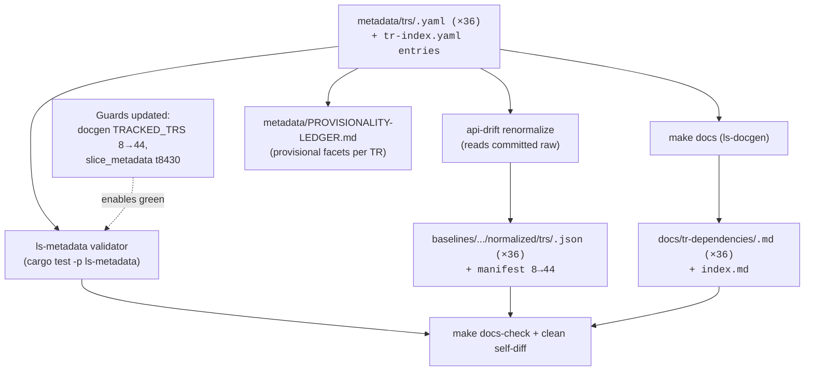

# feat: Bulk Tracked-Only TR Expansion (36 read-only stock TRs)

## Summary

Bring 36 read-only stock TRs into full structural maintenance ownership in one batch: author a per-TR metadata file and routing-index entry for each, generate the committed API Drift normalized baseline for each via the existing `api-drift renormalize` path, regenerate the TR Dependency Docs, and record provisional facets in a committed batch-level ledger. None becomes callable, recommended, or evidence-backed. The shape data is sourced from the already-committed raw snapshot. Items 2–4 and the orders deferral are out of scope (see origin).

## Problem Frame

The maintained surface tracks 8 TRs today (7 implemented, 1 tracked-only). The committed API Drift raw snapshot already carries the 36 target codes, so inventory-level drift detects their add/remove — but with no metadata they classify as `Untracked` (report-only, low-gating), and their request/response fields are not diffed at all, because structural drift runs only over TRs with a committed normalized shape. Adding metadata + a normalized baseline for each promotes them to `tracked`/maintained, so field-level structural drift becomes visible and correctly severity-classified.

The 36 were chosen as the low-risk read-only stock set so coverage can grow without touching order safety or callable behavior, and to seed the candidate pool the later implemented expansions draw from. The mechanics are well-trodden: `CSPAT00601` is the tracked-only precedent (metadata + normalized baseline, no recommendation block), and `renormalize_committed` already derives the maintained set from metadata keys, so authoring the files first makes one renormalize pass produce all 36 baselines.

---

## Requirements

Traceability to the origin (`see origin:` `docs/brainstorms/2026-06-21-bulk-tracked-only-tr-expansion-requirements.md`):

- R1. Per-TR metadata file at `metadata/trs/<code>.yaml` for each of the 36, `support: {tracked: true, implemented: false, recommended: false}`, no `recommendation` block. → U1
- R2. Routing entry in `metadata/tr-index.yaml` for each; validator asserts index fields equal the per-TR file. → U1
- R3. Committed API Drift normalized baseline at `crates/ls-trackers/baselines/api-drift/normalized/trs/<code>.json` for each, derived from the committed raw. → U3
- R4. Each TR appears in the generated TR Dependency Docs. → U5
- R5. Hard-accurate facets at commit time: `support`, `owner_class`, `protocol`, `instrument_domain`, `certification_path`, `paper_incompatible`, `account_state`, `self_paginated`, order/dependency risk fields. → U1
- R6. Provisional facets explicitly marked: `venue_session`, `caller_supplied_identifiers`, weak discovery relationships, and field-level `type` facets (HTTP-500 seed). → U1, U2
- R7. Provisionality recorded in a committed batch-level ledger so a later `tracked → implemented` promotion knows what to re-verify. → U2
- R8. No TR gains callable behavior, an SDK Reference page, a recommendation claim, or a Focused Evidence requirement. → U1, U4 (verification)
- R9. Batch passes the metadata validator and the API Drift tracker accepts the 36 baselines (no new structural drift). → U3, U5
- R10. Tracked-count test guards updated (fixture 8→44, test name and assertion message de-counted); implemented/recommended counts unchanged. → U4

---

## Key Technical Decisions

- **Generation via `api-drift renormalize`, not new tooling.** `renormalize_committed` (`crates/ls-trackers/src/cli.rs`) derives the maintained set from `load_metadata().keys()`, reads the committed raw, and writes `normalized/trs/<code>.json` for every maintained code. Authoring the 36 metadata files first means a single `make api-drift-renormalize` produces all 36 baselines and rewrites the manifest (`maintained_tr_count` 8→44, `refreshed` to run date). No bulk-add generator is built.
- **Provisionality ledger is a committed sidecar, not a schema change.** A new `metadata/PROVISIONALITY-LEDGER.md` (mirroring the existing committed sidecar `metadata/EVIDENCE-FRESHNESS.md`) records, per TR, which facets are provisional. It is NOT a per-TR schema field and NOT an entry in `tr-index.yaml` (which is closed-set parsed and would reject an unknown key). No validator scans `metadata/` for stray files, so the sidecar is accepted by all gates. (R7, origin Key Decision.)
- **owner_class: starter-classify then verify.** Each code gets a starter dependency class from snapshot-derivable signals (`instrument_domain`, `self_paginated`, protocol), then is verified per-TR before commit. `owner_class` is R5 hard-accurate — it drives index routing, dependency-doc rendering, and the validator cross-check — so verification is the accuracy gate, not the starter guess.
- **t8430 is included as tracked-only; its exclusion guard is updated.** `crates/ls-metadata/tests/slice_metadata.rs` currently asserts `t8430` is absent from metadata. The array-shape blocker gates *implementation* (Item 2), not *tracking* — tracking pulls shape from the committed raw, which already contains `t8430`. The assertion is updated to reflect tracked-only inclusion while preserving the not-implemented/not-recommended intent.
- **Sequencing: land on the current raw; defer the type re-pin.** `renormalize` rewrites every maintained shape from the raw, so it is additive (existing 8 unchanged) only while the raw is unchanged. The R6 field-`type` re-pin (a future clean system-codes fetch) is a separate later PR; landing it before this batch would mix unrelated drift into the existing 8 baselines.
- **Only tracked-count guards move.** The docgen `TRACKED_TRS` fixture and its count test go 8→44; the implemented-reference banner test stays at 7 and `EVIDENCE-FRESHNESS.md`'s "six Recommended TRs" is untouched, since no TR becomes implemented or recommended.

---

## High-Level Technical Design

The per-TR metadata is the single source of truth; three downstream surfaces are derived from it. Directional, not prescriptive.

---

## Implementation Units

### U1. Author per-TR metadata and routing-index entries for the 36

- **Goal:** Create the 36 per-TR metadata files and their `tr-index.yaml` routing entries, with the tiered facet-accuracy bar applied.
- **Requirements:** R1, R2, R5, R6, R8.
- **Dependencies:** none.
- **Files:**
  - Create `metadata/trs/<code>.yaml` for each of the 36: `t3102, t3320, t3341, t1640, t1662, t1601, t1615, t1664, t1958, t1964, t1988, t8431, t9905, t9907, t9942, t1531, t1537, t8425, t1825, t1826, t1852, t1856, t1866, t1859, t1860, t1441, t1452, t1463, t1466, t1481, t1482, t1489, t1492, t1403, t8430, t8436`
  - Modify `metadata/tr-index.yaml` (add 36 routing entries)
  - Pattern source: `metadata/trs/CSPAT00601.yaml` (tracked-only shape), `metadata/trs/t8412.yaml` (read-only data TR), `metadata/trs/token.yaml`
- **Approach:**
  - Each file mirrors the `CSPAT00601` tracked-only shape: `support: {tracked: true, implemented: false, recommended: false}`, no `recommendation` block. `maintenance.last_reviewed` = today. `maintenance.source_spec_hash` is a required String with no computed-derivation path in the codebase — existing values are hand-authored opaque hex, left stale, and the field is not format-validated. Author a stable per-TR hex marker for each (e.g. a short digest of the TR's normalized shape); do not block on deriving it.
  - Hard-accurate facets (R5): for these read-only stock TRs the common profile is `protocol: rest`, `instrument_domain: stock`, `rate_bucket: market_data`, `account_state: false`, `paper_incompatible: false`, `certification_path: none`, empty `dependencies.strong_order_fields`. `self_paginated` set true only for codes whose snapshot shape carries continuation fields. These are confirmed per TR against the raw shape, not assumed.
  - `owner_class` (R5, hard-accurate): starter-classify from snapshot signals — single-shot quote/list reads → `standalone`; continuation/multi-row chart or list reads → `paginated`; session/timing-bound reads → `market_session` — then verify each against the TR's actual shape before commit. Valid values: `standalone`, `market_session`, `paginated`, `account`, `orders`, `realtime`, `paper_incompatible`.
  - Provisional facets (R6): `venue_session` and `caller_supplied_identifiers` set best-effort and recorded in the ledger (U2). Index routing duplicates `file`, `owner_class`, `protocol`, `instrument_domain`, `venue_session` — these must equal the per-TR file (validator cross-check).
- **Patterns to follow:** Per-TR schema and enums in `crates/ls-metadata/src/schema.rs`; index/per-TR routing cross-check in `crates/ls-metadata/src/validator.rs` (`check_routing`). Snake_case enum values.
- **Test scenarios:**
  - `cargo test -p ls-metadata` passes over the full 44-TR tree (validator `validate_dir`): every index key has a file, every `tr_code` matches its index key, all five routing fields (`file`, `owner_class`, `protocol`, `instrument_domain`, `venue_session`) match, all enum facets parse.
  - Negative guard already covered by validator: a `recommended: false` file with no `recommendation` block validates clean (the `(false, None)` arm); confirm none of the 36 carries a stray `recommendation` block (would trip `RecommendationOnUnrecommended`).
  - Covers R8: assert each of the 36 has `implemented: false` and `recommended: false`.
- **Verification:** `cargo test -p ls-metadata` green; `metadata/tr-index.yaml` lists 44 TRs; no per-TR file carries a recommendation/evidence block.

### U2. Create the batch-level provisionality ledger

- **Goal:** Record, per TR, which facets are provisional so a later `tracked → implemented` promotion knows what to re-verify.
- **Requirements:** R6, R7.
- **Dependencies:** U1 (facet values exist).
- **Files:** Create `metadata/PROVISIONALITY-LEDGER.md` (committed sidecar, mirroring `metadata/EVIDENCE-FRESHNESS.md`).
- **Approach:** A committed `metadata/`-level ledger (standalone, the origin's pinned R7 shape — kept separate from accepted metadata facts so it is a clean obligation list, not buried in YAML comments tooling can drop). One row per (TR, provisional facet), each row naming: the **TR code**, the **facet**, its **provisional value**, the **source basis** (e.g. best-effort from snapshot, HTTP-500 `type` fallback), and **what must be re-verified before implementation**. Covers `venue_session`, `caller_supplied_identifiers`, weak discovery-style relationships, and the field-level `type` facets that inherit the HTTP-500 system-codes provisionality. Note that the field-`type` re-pin lands as a separate later PR after a clean system-codes fetch. Not a schema field; not referenced from `tr-index.yaml`. The future `tracked → implemented` promotion recipe consumes or retires ledger rows explicitly.
- **Patterns to follow:** `metadata/EVIDENCE-FRESHNESS.md` (committed non-schema Markdown sidecar under `metadata/`); seed context in `crates/ls-trackers/baselines/api-drift/SEED-ATTESTATION.md`.
- **Test scenarios:** `Test expectation: none -- documentation sidecar, no behavioral change. Validated indirectly: no gate scans metadata/ for stray files, so cargo test -p ls-metadata and make docs-check stay green with the file present.`
- **Verification:** Ledger lists all 36 codes with their provisional facets; `cargo test -p ls-metadata` and `make docs-check` remain green.

### U3. Generate committed normalized baselines via renormalize

- **Goal:** Produce the 36 committed normalized structural baselines and update the manifest, additively (existing 8 unchanged).
- **Requirements:** R3, R9.
- **Dependencies:** U1 (metadata keys drive the maintained set).
- **Files:**
  - Create `crates/ls-trackers/baselines/api-drift/normalized/trs/<code>.json` for each of the 36 (written by the tool)
  - Modify `crates/ls-trackers/baselines/api-drift/normalized/manifest.json` (`maintained_tr_count` 8→44, `refreshed` to run date)
- **Approach:** Run `make api-drift-renormalize` (`cargo run -q -p ls-trackers -- api-drift renormalize`). It reads the committed `raw/ls-openapi-full.json`, normalizes the maintained set (now 44), writes the 36 new per-TR shapes, prunes none (no codes removed), and stamps the manifest. The CLI hardcodes the `refreshed` date to today (no flag) — acceptable. The self-diff mechanism is a network-free `git diff`, not `api-drift check`: `renormalize` rewrites the committed baseline in place and produces no staged run, and the default `api-drift check` live-fetches, so it is not used here. Confirm the diff is additive — the existing 8 shape files byte-identical, exactly 36 shapes added, and the manifest changed only in `maintained_tr_count` (8→44) and `refreshed` (run date), with no `source_urls`/shape changes. The facts-outage exit-2 path applies only to a live `api-drift check` carrying a fetch report; `renormalize` and this git-diff inspection never raise it, so on these paths any non-additive diff or error is a real problem, not a tolerated outage. R9 "acceptance" is validator-green + `docs-check`-green + an additive baseline diff.
- **Patterns to follow:** `renormalize_committed` in `crates/ls-trackers/src/cli.rs`; the single-TR additive precedent (`t1101` admission) in `crates/ls-trackers/baselines/api-drift/SEED-ATTESTATION.md`; `docs/MAINTENANCE_RUNBOOK.md` for drift exit semantics.
- **Test scenarios:**
  - After renormalize, `normalized/trs/` contains 44 shape files; the 36 new codes each have a JSON shape; the existing 8 are unchanged (diff is additions-only plus the manifest).
  - `maintained_tr_count` in the manifest equals 44.
  - Case-collision check: assert the 36 codes (and the existing 8) have no case-insensitive collisions, since the per-TR baseline layout silently overwrites on case-insensitive filesystems (the lowercase `t####` set is expected clean — assert it rather than assume).
  - Additive-diff check: `git diff` on `crates/ls-trackers/baselines/api-drift/normalized/` shows the existing 8 shapes byte-identical, 36 shapes added, and the manifest changed only in `maintained_tr_count` (8→44) and `refreshed` (run date).
- **Verification:** 36 new shape files committed; manifest count 44 with only the refreshed-date otherwise changed; existing 8 baselines byte-identical (git diff is additions-only).

### U4. Update the count-test guards

- **Goal:** Move the tracked-count guards 8→44 and remove the t8430 exclusion so the suite goes green; leave implemented/recommended guards untouched.
- **Requirements:** R10, R8 (implemented/recommended counts unchanged), supports t8430 inclusion.
- **Dependencies:** U1 (the 36 must exist for the counts to be correct).
- **Files:**
  - Modify `crates/ls-docgen/src/lib.rs`: extend the `TRACKED_TRS` const array (8→44 codes); rename the test fn `every_tracked_tr_gets_a_page_and_the_index_lists_all_eight` to drop the embedded count; update the assertion message string (`"index + 8 pages"`).
  - Modify `crates/ls-metadata/tests/slice_metadata.rs`: update the `t8430`-exclusion assertion (lines ~59-63) to reflect tracked-only inclusion (present in metadata, `implemented: false`/`recommended: false`) rather than absence.
- **Approach:** `TRACKED_TRS` is the source of the per-page count via `TRACKED_TRS.len() + 1`, so growing the array auto-satisfies the numeric assertion; the rename and message edits exist only to remove stale count text (R10). The banner test `reference_covers_seven_implemented_with_banner_and_omits_unimplemented` and its `reference.len() == 8` assertion are NOT touched — the 36 are tracked-only and correctly appear in Dependency Docs only, like `CSPAT00601`. For `slice_metadata.rs`, replace the "must not be in slice metadata" assertion with one asserting `t8430` is tracked-only (or remove the exclusion and assert its support booleans), preserving the original intent that it is not implemented.
  - **Sequencing (avoid red-CI intermediate state):** the existing guards (`TRACKED_TRS.len() + 1 == 9`, `t8430` absent) fail the moment the 36 metadata files exist, so land the U4 guard edits in the same commit as — or before — the U1 metadata files. Authoring the guards first on the branch keeps every intermediate commit green.
- **Patterns to follow:** Existing docgen tests in `crates/ls-docgen/src/lib.rs:674-832`; the tracked-vs-implemented distinction encoded in `render_dependency_docs` vs reference rendering.
- **Test scenarios:**
  - `cargo test -p ls-docgen` green: the dependency-page count test passes at 44; the implemented-reference banner test still asserts 7 implemented + index = 8 and still excludes the tracked-only TRs from Reference.
  - `cargo test -p ls-metadata` green: the updated `slice_metadata.rs` assertion passes with `t8430` present as tracked-only.
  - Covers R8: the banner/reference test continuing to pass at 7 is the guard that no TR leaked into implemented/recommended.
- **Verification:** Full `cargo test` green; banner test unchanged at 7; `t8430` guard reflects tracked-only.

### U5. Regenerate dependency docs and run the full verification gate

- **Goal:** Regenerate the committed TR Dependency Docs and confirm the whole batch lands green.
- **Requirements:** R4, R9.
- **Dependencies:** U1, U4 for the docs regeneration (docs render from metadata keys, not baselines, so this step does not depend on U3; U3 can run in parallel). The final workspace gate runs last, after all units including U3.
- **Files:**
  - Create `docs/tr-dependencies/<code>.md` for each of the 36 (written by `make docs`)
  - Modify `docs/tr-dependencies/index.md`
  - No new files under `docs/reference/` (tracked-only TRs get no reference page)
- **Approach:** Run `make docs` to regenerate, then `make docs-check` to confirm committed docs match metadata (bidirectional, including the orphan sweep over `docs/tr-dependencies/`). Confirm 36 new dependency pages and zero new reference pages. Final gate: `cargo test` (workspace) + `make docs-check` both green.
- **Patterns to follow:** `render_dependency_docs` / `render_all` in `crates/ls-docgen/src/lib.rs`; gate targets in the `Makefile` (`docs`, `docs-check`).
- **Test scenarios:**
  - `make docs-check` passes (no drift between metadata and committed docs; no orphan `.md`).
  - `docs/tr-dependencies/` gains exactly 36 `<code>.md` pages; `docs/reference/` gains none.
  - Covers R4: each of the 36 codes has a dependency-doc page.
- **Verification:** `make docs-check` green; 36 new dependency pages; workspace `cargo test` green.

---

## Scope Boundaries

**Deferred for later** (see origin):
- The `tracked → implemented` promotion recipe — the shared path Items 2–4 need; a separate design item.
- Items 2–4: instrument discovery (`t8436`, then `t8430`), market list/discovery cluster, ranking/list screens.
- Orders runtime (`CSPAT00601`) stays deferred (ADR 0008).
- The field-`type` re-pin: a future clean system-codes fetch resolves the HTTP-500 fallback types and emits a planned one-time `type` drift wave — lands as a separate PR after this batch.

**Outside this work item's identity** (see origin):
- Callable SDK APIs, SDK Reference pages, recommendation claims, and Focused Evidence for any of the 36 — tracking is structural ownership only.

**Deferred to Follow-Up Work:**
- Hardening the per-TR baseline layout against case-insensitive-filesystem collisions (flagged in `docs/solutions/architecture-patterns/change-tracker-baseline-clean-self-diff.md`); this batch only asserts the 36 are collision-free, it does not change the layout.

---

## Risks & Dependencies

- **Facts-outage exit code (R9 definition).** Normalizer v2 may exit 2 when the type-fallback was served and a maintained TR is in the run. Mitigation: define R9 acceptance as validator + `docs-check` green + no new structural drift, and confirm the exact exit behavior against `docs/MAINTENANCE_RUNBOOK.md` during U3 rather than assuming exit 0.
- **owner_class accuracy.** Wrong dependency class mis-routes the index and dependency docs and is hard-accurate per R5. Mitigation: starter-classify then per-TR verify before commit (U1); the validator cross-check catches index/file divergence but not a wrong-but-consistent class, so verification is manual.
- **Sequencing against the raw.** A clean system-codes re-fetch landing before this batch would make renormalize rewrite the existing 8 baselines too. Mitigation: land this batch on the current committed raw; the type re-pin is a separate later PR (KTD).
- **t8430 guard.** The `slice_metadata.rs` exclusion must be updated in lockstep with U1, or the suite fails. Captured as U4.
- **Batch size.** 36 metadata files + per-TR owner_class verification is the bulk of the effort; if verification on a subset proves heavy, the batch can split into clusters (Open Question), but the brainstorm committed to all 36.

---

## Open Questions

**Deferred to planning / execution:**
- Whether the 36 land as one PR or smaller clustered batches — a sequencing choice; does not change the unit content. Recommended: one batch unless owner_class verification on a subset proves heavy.

**Carried from origin review (product/scope notes, not blockers):**
- The drift-visibility value loop: who reviews and acts on a field-level drift finding for a tracked-only TR with no caller. Recommended to name the intended response (e.g., route to the next promotion review) in the ledger or maintenance runbook, not in this batch's code.
- All-36-now vs. tracking only the ~13 roadmap-bound codes first — resolved in favor of all 36 by the brainstorm; recorded here so the trade-off stays visible.

---

## Sources & Research

- Origin requirements: `docs/brainstorms/2026-06-21-bulk-tracked-only-tr-expansion-requirements.md` (R1–R10, the 36 codes, sequencing constraint, provisionality ledger decision).
- Per-TR schema and enums: `crates/ls-metadata/src/schema.rs`. Validator + routing cross-check: `crates/ls-metadata/src/validator.rs`. Real-tree validation + t8430 guard: `crates/ls-metadata/tests/slice_metadata.rs`.
- Tracked-only precedent: `metadata/trs/CSPAT00601.yaml` + `crates/ls-trackers/baselines/api-drift/normalized/trs/CSPAT00601.json`.
- Renormalize path: `crates/ls-trackers/src/cli.rs` (`renormalize_committed`, maintained-from-metadata, hardcoded `today()` date); manifest `crates/ls-trackers/baselines/api-drift/normalized/manifest.json`.
- Docgen tests + `TRACKED_TRS` + dependency-doc generation: `crates/ls-docgen/src/lib.rs:359-378, 550-619, 674-832`.
- Gate targets: `Makefile` (`docs`, `docs-check`, `api-drift-renormalize`).
- Seed provisionality (HTTP-500 system-codes): `crates/ls-trackers/baselines/api-drift/SEED-ATTESTATION.md`. Drift exit semantics + re-pin: `docs/MAINTENANCE_RUNBOOK.md`.
- Case-collision risk in per-TR baseline layout: `docs/solutions/architecture-patterns/change-tracker-baseline-clean-self-diff.md`.
- ADRs: 0003 (per-TR metadata + routing index), 0008 (defer order runtime), 0012 (Rust-owned metadata schema authority).
- Ledger sidecar precedent: `metadata/EVIDENCE-FRESHNESS.md`.
