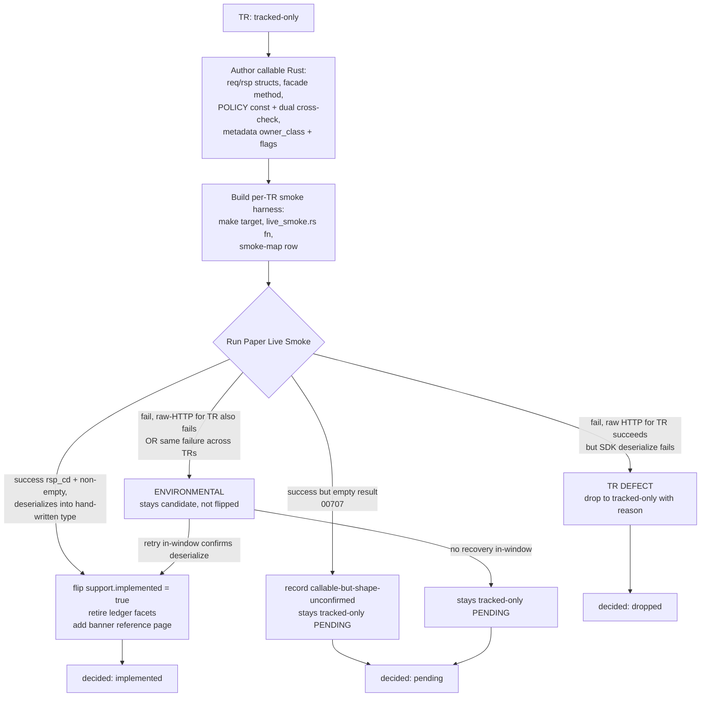
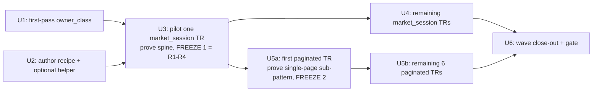

# feat: Consumer-Bound Implemented Expansion Wave

## Summary

Build the reusable `tracked → implemented` recipe (the durable deliverable) and exercise it by promoting 11 consumer-bound read-only stock TRs from tracked-only to Implemented: each gains callable Rust SDK behavior, is gated by a Paper Live Smoke, and stays non-recommended (no Focused Evidence, no recommendation claim). The recipe is proven and frozen on one pilot TR before the other ten run. The wave is variable-size: it completes when the recipe is proven and each of the 11 reaches a decided end state.

---

## Problem Frame

After PR #27 the maintained surface tracks 44 TRs but only 7 are callable; the 36 read-only stock TRs landed tracked-only — drift visibility with no callable behavior. The shared path every roadmap promotion needs — a `tracked → implemented` recipe — does not exist. The existing recipe (`.agents/skills/promote-tr/SKILL.md`) only covers `implemented → recommended`, and it explicitly bails on a tracked-only TR with `HELD <tr> — not implemented; needs ce-plan`.

Until that path exists, no tracked-only TR can become callable. Building the recipe in the abstract risks designing for cases that never arrive, so this wave builds the path and proves it on the subset with named callers in the PR #27 roadmap (the predecessor's consumer-bound Items 2–4, minus the blocked `t8430`). The recipe is exercised by real SDK-facing work the first time it runs.

The 11 TRs: `t8436`, `t8425`, `t1531`, `t1537`, `t1403`, `t1441`, `t1452`, `t1463`, `t1466`, `t1489`, `t1492`.

---

## High-Level Technical Design

The recipe is a per-TR loop with a gating state machine. Each TR is authored into callable Rust, then a Paper Live Smoke decides its end state. The smoke gates implementation but is never recorded as Focused Evidence — that line is what keeps these Implemented, not Recommended.

Recipe sequencing across the wave — the pilot proves and freezes the recipe spine before the rest run:

The recipe stops one tier earlier than `promote-tr`: it sets `support.implemented: true`, leaves `support.recommended: false`, writes no `recommendation` block, creates no `metadata/evidence/<tr>.yaml`, and does not touch `metadata/EVIDENCE-FRESHNESS.md`.

---

## Key Technical Decisions

- **The recipe ships as a skill mirroring `promote-tr`; a per-TR helper is optional.** A new skill under `.agents/skills/` (e.g. `implement-tr/`) follows the proven `promote-tr` structure — preconditions → author → build harness → run smoke → secret-safety blocking check → flip metadata → docgen/ledger edits → gate → commit — but stops at Implemented. The skill-directory form (not an inline recipe doc) is chosen so the recipe is path-discoverable by agents the same way `promote-tr` is, and a future `tr-implementer` subagent can be dispatched against it. A reusable scaffolding helper stays optional — add a smoke-stub generator only if per-TR toil proves high after U3 (see Deferred to follow-up work). This makes the recipe repeatable per TR and a real co-equal deliverable, not a by-product.

- **Two-phase freeze: spine first, paginated sub-pattern second.** Because the recipe is authored against the same 11 it first runs on, a late recipe defect could unsettle already-decided states. The freeze is two-staged: (1) U3 proves the recipe spine — R1–R4 (gate definition, metadata flip, secret-safety, no-evidence rule) — end-to-end on one non-paginated TR and freezes it before U4/U5; (2) the paginated authoring sub-pattern is a materially different SDK shape (see the paginated-continuation decision below), so it is frozen only after U5's first paginated TR passes, and the remaining six paginated TRs depend on that second freeze, not on U3. This sequences the wave; it does not split it.

- **Paginated TRs are Implemented at single-page scope; body-field continuation is deferred.** `ls-core`'s pagination machinery (`HasPagination`, `impl_has_pagination!`, `post_paginated`, `collect_all`) only threads the header-based `tr_cont`/`tr_cont_key` cursor that `t8412` uses. The seven paginated TRs instead carry a request-body `idx` continuation field, for which no core machinery exists — multi-field body continuation is a new `ls-core` contract, not a per-TR wiring tweak. This wave does not build that contract: each paginated TR is promoted at single-page scope (one `post_paginated` call with empty `tr_cont` headers and `idx` modeled as an ordinary in-block field), which the existing dispatch path already supports. Multi-page collection (a `chart_all`-equivalent over body-`idx`) is deferred to follow-up work. The first-page `idx` convention (empty, `0`, or `1`) is confirmed per TR against the spec/gateway.

- **Pilot is a no-caller-identifier `market_session` TR — default `t8425` (전체테마/all themes).** It is the simplest pattern (non-paginated, no caller input, reliably non-empty), and its response yields theme codes (`tmcode`) that become the representative caller inputs for `t1531`/`t1537`. Proving the spine on the simplest TR first de-risks the rest.

- **owner_class first-pass: reassign the 4 currently-`standalone` TRs to `market_session`.** `standalone` is the OAuth-only class (token/revoke). `t8436`, `t8425`, `t1531`, `t1537` are non-paginated market-data reads — their current `standalone` value is a tracked-only placeholder. First-pass reassigns them to `market_session`; the 7 paginated TRs stay `paginated` (mirroring `t8412`). Each assignment is confirmed or corrected per-TR during implementation (R5 is a hard-accurate facet driving index routing and the validator cross-check).

- **Every new endpoint policy const is registered in BOTH hardcoded cross-check lists.** `crates/ls-core/tests/policy_index_crosscheck.rs` (the policies array) AND the `slice_rest_policies_are_non_order_rest` list in `crates/ls-core/src/endpoint_policy.rs`. Neither auto-discovers a new const; an unregistered const is silently skipped by the cross-check. This is a recipe step, not an afterthought.

- **The smoke does not retire field-type facets.** A clean deserialize passes on null, absent, or permissively-typed fields, so it does not confirm the HTTP-500-seeded field types. Only facets a paper call genuinely confirms (`venue_session`, `caller_supplied_identifiers`) retire from the ledger. Field-level `type` retirement stays with the separate clean-fetch re-pin PR (see origin: `docs/brainstorms/2026-06-21-consumer-bound-implemented-expansion-requirements.md`).

- **Credential-freedom is a hard blocking gate before any committed smoke record.** Any committed smoke line, gate output, or drop/pending reason must contain no OAuth token, appkey, secret, or account number — only lengths, business `rsp_cd`, public tickers/dates/ports, and structural counts. Drop `rsp_msg` (localized/account-bearing); ensure the Err-path emits no capturable `LIVE-SMOKE` line. The recipe cites this check explicitly.

- **Block-and-drop on TR-defect; hold-the-flip-and-retry on proven-environmental.** A failure isolated to the TR (raw HTTP for the TR also fails, or the same failure reproduces across TRs in the window) is environmental — the TR stays a candidate but is not flipped until a retry confirms request construction, a non-empty success response, and deserialization. A failure where raw HTTP succeeds but the SDK deserialize fails is a TR defect → drop to tracked-only. No deserialize confirmation, no Implemented TR — the tier boundary holds even for environmental failures.

- **One wave, one PR, with the recipe-freeze checkpoint sequenced inside it.** The whole point is a proven recipe across the consumer-bound set; clustering into per-class batch PRs would fragment that. Keep all 11 in one wave; the pilot freeze is a gate, not a PR boundary.

---

## Requirements

Carried from the origin document and grouped by concern. IDs preserve the origin's R-numbering.

**The conversion recipe**

- R1. A documented `tracked → implemented` recipe exists, repeatable per TR and distinct from the existing `implemented → recommended` recipe.
- R2. The recipe defines a per-TR Implemented gate: callable request/response types exist; the request constructs through the public SDK path; a paper LS call returns a recognized success `rsp_cd` and a non-empty result; the response deserializes into the hand-written response type. A successful deserialize of an empty result set (e.g. `00707`) confirms callability but not response shape → recorded pending, not flipped.
- R3. The smoke result is recorded only as promotion notes or gate output, never as a Focused Evidence record.
- R3a. Any committed record of a smoke result (notes, gate output, drop/pending reason) first passes the same credential-freedom check `promote-tr` applies before recording a LIVE-SMOKE line. The recipe cites this check explicitly.
- R4. The recipe sets `support.implemented: true`, leaves `support.recommended: false`, creates no recommendation block and no evidence-freshness record.

**Per-TR promotion (applied to the 11)**

- R5. Each promoted TR gains callable Rust SDK behavior: request struct, response struct, a public method on the SDK facade, dependency-class registration. A per-TR paper-smoke harness (make target, `live_smoke.rs` test function, `references/smoke-map.md` row) is built for the TR — the recipe (R1) produces it before R6's gate can run, mirroring how `promote-tr` treats a missing smoke target as a hard hold.
- R6. A failed TR-level paper smoke leaves the TR tracked-only. A failure counts as environmental only when proven to reproduce outside the TR (raw-HTTP probe for the TR also fails, or other TRs' smokes fail the same way in the same window); raw HTTP succeeds + SDK deserialize fails is a TR defect, never environmental. The classification is captured in the credential-safe drop record (R3a). An environmental failure keeps the TR a candidate but does not flip `support.implemented` until a retry confirms request construction, a non-empty success response (R2), and deserialization; no in-window recovery → ships as tracked-only, recorded pending.
- R7. Provisional facets a paper call genuinely confirms (caller-supplied identifiers accepted, venue/session observed) retire from `metadata/PROVISIONALITY-LEDGER.md`, or are corrected, before promotion. Field-level `type` retirement is NOT in scope — a successful deserialize does not confirm the HTTP-500-seeded types; it stays with the separate clean-fetch re-pin PR.

**Wave outcome and gates**

- R8. The wave completes when the recipe (R1–R4) is proven and each of the 11 ends decided: implemented-with-passing-smoke, or dropped to tracked-only with a recorded reason. Drop/pending reasons live in a wave close-out section in `metadata/PROVISIONALITY-LEDGER.md` listing each non-promoted TR with its classification: TR-defect, environmental-pending, or input-unresolved.
- R9. The change-scoped gate passes on the wave's promoted TRs, and the metadata validator stays green (support flags, index/per-TR consistency, routing cross-check).
- R10. Count-bearing artifacts pinned to the implemented-TR set move to match the number actually promoted: the docgen reference-page count test moves from `reference.len() == 8` (index + 7) toward `reference.len() == 19` (index + 18) if all 11 pass, adjusted down for any dropped TR. The count-bearing test function name (`reference_covers_seven_implemented_with_banner_and_omits_unimplemented`) and any assertion-message string embedding the count are updated to carry no stale ordinal. Each promoted TR gets a reference page carrying the "Implemented, not yet recommended" banner. The tracked-TR-count doc test is unaffected (no new tracked TRs).
- R11. Recommended-tier artifacts stay unchanged: no SDK Reference recommendation claim for any of the 11, and `metadata/EVIDENCE-FRESHNESS.md` stays at six Recommended TRs.

---

## Implementation Units

### U1. First-pass owner_class assignment for the 11

**Goal:** Produce a defensible first-pass `owner_class` (dependency class) for all 11 from the snapshot's `instrument_domain`/`self_paginated` signals, so per-TR domain research can't silently balloon mid-wave. No metadata flips yet — this is a bounded pre-work decision the per-TR units confirm or correct.

**Requirements:** R5 (the hard-accurate facet), supports R9.

**Dependencies:** none.

**Files:**
- `metadata/trs/t8436.yaml`, `metadata/trs/t8425.yaml`, `metadata/trs/t1531.yaml`, `metadata/trs/t1537.yaml` (read; reassignment applied in U3/U4)
- `metadata/trs/t1403.yaml`, `metadata/trs/t1441.yaml`, `metadata/trs/t1452.yaml`, `metadata/trs/t1463.yaml`, `metadata/trs/t1466.yaml`, `metadata/trs/t1489.yaml`, `metadata/trs/t1492.yaml` (read)
- The plan itself records the first-pass table; actual `owner_class`/index edits land per-TR in U3–U5.

**Approach:** First-pass assignment:

| TR | first-pass owner_class | rationale |
|----|------------------------|-----------|
| t8425, t8436 | `market_session` | non-paginated stock reads, no caller input; `standalone` is OAuth-only placeholder |
| t1531, t1537 | `market_session` | non-paginated stock reads keyed by `tmcode` (caller-supplied identifier) |
| t1403, t1441, t1452, t1463, t1466, t1489, t1492 | `paginated` | all `self_paginated: true` with `idx` continuation; mirror `t8412` |

Confirm the actual continuation mechanism per paginated TR against the spec before implementing — these declare a body field `idx`, whereas `t8412` uses HTTP-header `tr_cont`/`tr_cont_key`. Re-verify `venue_session` for `t1489`/`t1492` (call-auction screens flagged possibly `krx_extended` in the ledger).

**Patterns to follow:** `OwnerClass` enum in `crates/ls-metadata/src/schema.rs`; class assignments of existing implemented TRs (`t1102`→`market_session`, `t8412`→`paginated`).

**Test scenarios:** Test expectation: none — this unit produces a first-pass assignment decision (no code or metadata change). Validation of each assignment happens in U3–U5 via the routing cross-check and the live smoke.

**Verification:** All 11 have a recorded first-pass `owner_class` with rationale; the two patterns (non-paginated `market_session`, paginated) are each represented; session re-verify flags noted for `t1489`/`t1492`.

---

### U2. Author the `tracked → implemented` recipe and reusable per-TR helper

**Goal:** Create the durable recipe that converts a tracked-only TR into an Implemented TR, mirroring `promote-tr` structure but stopping one tier earlier. This is the wave's co-equal deliverable. No TR is flipped in this unit.

**Requirements:** R1, R2, R3, R3a, R4; defines the procedure for R5–R7.

**Dependencies:** none — the recipe is authored independently of the first-pass assignments. U1's `owner_class` table feeds U3+ (the recipe's step 6 applies/corrects `owner_class` at promotion time), not the recipe's authoring.

**Files:**
- `.agents/skills/implement-tr/SKILL.md` (new — the recipe)
- `.agents/skills/implement-tr/references/` (new — author-pattern notes and credential-free line shapes; per-class skeletons inline in `SKILL.md` unless a second consumer emerges). Smoke-map rows are NOT duplicated here: the smoke-map stays the single shared registry at `.agents/skills/promote-tr/references/smoke-map.md`, which U3–U5 and the existing `promote-tr` recipe both consume.
- A credential-safe raw-HTTP probe (a `reqwest`-based bare POST per TR, reusing the harness's `.env` sourcing and the R3a record guard) used only to classify smoke failures as environmental vs TR-defect (R6).
- Optionally a reusable per-TR helper (a make target or small script that scaffolds a smoke harness stub), if it reduces per-TR toil without hiding judgment.

**Approach:** Recipe steps, mirroring `promote-tr/SKILL.md`:
1. Preconditions: bail if already implemented, or if the TR is paper-incompatible/account-state/order/realtime (out of scope).
2. Author callable Rust: request/response structs in the owner-class module, `::new(...)` constructor, public facade method, `{TR}_POLICY` const in `endpoint_policy.rs`, register the const in BOTH cross-check lists. Add a cross-check assertion tying each const's `has_pagination` to `facets.self_paginated` (the existing cross-check does not cover this flag — `T1102_POLICY` already carries a stale `has_pagination: true`), so a mis-set pagination flag fails CI rather than shipping silently.
3. Build the per-TR smoke harness (make target, `live_smoke.rs` fn, smoke-map row) — a hard prerequisite; missing harness = hold. The smoke fn opens with `paper_sdk()` (never `paper_guard()` alone — `paper_sdk()` adds the resolved-environment defense-in-depth check).
4. Run the Paper Live Smoke; interpret per the R2/R6 state machine (success+non-empty / `00707` empty / TR-defect / environmental). On failure, run the raw-HTTP probe (a bare `reqwest` POST for the TR reusing the harness `.env` sourcing) to classify: raw HTTP succeeds + SDK deserialize fails = TR defect; raw HTTP also fails (or peers fail in-window) = environmental. Before classifying any 403, compare credential lengths (never print secrets) to rule out `.env` quote contamination; the probe's output is subject to the R3a check.
5. Secret-safety blocking check on any line about to be committed (R3a): never reference `rsp_msg` (localized/account-bearing) in a committed line — capture only `rsp_cd`, lengths, public tickers/dates, and structural counts; no token/appkey/secret/account number. The Err-path must emit no capturable `LIVE-SMOKE` line — mirror `live_smoke_account`'s `SMOKE-FAIL` (stderr) pattern so a panic/error body can't pattern-match as evidence. Each new `live_smoke_*` fn carries an offline test asserting its Err branch emits no `LIVE-SMOKE` line.
6. Flip metadata: `support.implemented: true`, `support.recommended: false`, correct `owner_class`/index if reassigned; write NO `recommendation` block, NO `metadata/evidence/<tr>.yaml`.
7. Retire confirmed ledger facets (`venue_session`, `caller_supplied_identifiers`); do NOT retire field-`type` facets.
8. Docgen: add the TR to `banner_trs` and bump the `reference.len()` literal — but only after the TR's live smoke has returned success+non-empty+deserialize, and in the SAME commit as the `support.implemented` flip. A pending/environmental TR contributes nothing to `banner_trs` or the count until its deferred retry succeeds (then a follow-up commit bumps the count at flip time). Regen docs.
9. Run the change-scoped gate; commit the TR's files only.

Frame the recipe so the gate boundary is explicit: Implemented = a representative paper call builds/sends/deserializes; Recommended (recorded Focused Evidence) is out of scope.

**Patterns to follow:** `.agents/skills/promote-tr/SKILL.md` (structure, secret-safety step, smoke-map resolution); `.agents/skills/promote-tr/references/`.

**Test scenarios:** Test expectation: none — the recipe is a skill document; its correctness is proven end-to-end by the U3 pilot. (If a per-TR helper script ships, it carries the live-path test caveat from `docs/solutions/workflow-issues/shell-script-live-path-needs-stubbed-binary-tests.md`: test the real I/O path, not a dry-run mock.)

**Verification:** The recipe is complete and self-contained, cites the credential-freedom check explicitly, names the smoke-harness build as a hard prerequisite, and stops at Implemented (no evidence file, no recommendation block, no freshness edit).

---

### U3. Pilot: prove the recipe end-to-end on one market_session TR and freeze R1–R4

**Goal:** Run the U2 recipe end-to-end on the pilot TR (default `t8425`), promoting it to Implemented, and freeze R1–R4 before the remaining ten. This is the recipe-stability checkpoint — a recipe defect surfaces here, not after other states are decided.

**Requirements:** R1–R7 (proven on one TR), R10 (first reference-count move + test rename). Covers AE1.

**Dependencies:** U1, U2.

**Files:**
- `crates/ls-sdk/src/market_session/mod.rs` (pilot request/response structs, `::new`, public method)
- `crates/ls-sdk/src/lib.rs` (reuse the existing `market_session()` accessor — no new accessor needed)
- `crates/ls-core/src/endpoint_policy.rs` (`T8425_POLICY` const + `slice_rest_policies_are_non_order_rest` list entry)
- `crates/ls-core/tests/policy_index_crosscheck.rs` (register the const in the policies array)
- `crates/ls-sdk/tests/live_smoke.rs` (pilot smoke fn)
- `Makefile` (pilot `live-smoke-*` target + `.PHONY`)
- `.agents/skills/promote-tr/references/smoke-map.md` (pilot smoke-map row)
- `metadata/trs/t8425.yaml`, `metadata/tr-index.yaml` (flip `implemented`, correct `owner_class` to `market_session`)
- `metadata/PROVISIONALITY-LEDGER.md` (retire pilot's `venue_session` row)
- `crates/ls-docgen/src/lib.rs` (rename `reference_covers_seven_implemented_with_banner_and_omits_unimplemented` to drop the `seven` ordinal; add pilot to `banner_trs`; move `reference.len()` from `8` to `9`; update the `"index + seven implemented reference pages"` message string)
- `tests/` regenerated reference + dependency docs for the pilot + index pages

**Approach:** Execute U2's recipe verbatim on `t8425`. Response is the all-themes list (non-empty, no caller input). Note `t8425`/`t8436` take no caller input — their in-block is a new pattern (model `T1102` minus the identifier fields), since every existing in-block carries a caller identifier. Capture the `tmcode` values from the smoke result — they become representative inputs for `t1531`/`t1537` in U4. Numeric response fields use `ls_core::string_or_number`; structs `#[serde(default)]`; model a representative subset of fields, not every field. After a green run and a clean gate, declare R1–R4 (the spine) frozen.

If `t8425` ships pending/dropped, the freeze still requires a green pilot — fall back to `t8436` (also no-caller-input `market_session`) as the pilot. The `tmcode` for `t1531`/`t1537` then comes from a fallback source independent of the pilot (a documented well-known stable theme code, or a one-off `t8425` call), so the freeze-gate role and the data-provider role are not coupled to a single smoke.

**Execution note:** Start with an offline deserialize test against a representative captured response shape before running the live smoke, so a struct-shape error is caught without burning a gateway call.

**Patterns to follow:** `T1102Request`/`T1102OutBlock`/`T1102Response` and the `quote` method in `crates/ls-sdk/src/market_session/mod.rs`; `T1102_POLICY` in `endpoint_policy.rs`; `live_smoke_book` in `crates/ls-sdk/tests/live_smoke.rs`; the predecessor's de-counting rename precedent (`every_tracked_tr_gets_a_page_and_the_index_lists_all_eight` → ordinal dropped).

**Test scenarios:**
- Offline deserialize: a representative success response body deserializes into the hand-written response type AND at least one modeled non-key field is populated with a real (non-default) value — proving the representative subset round-trips, not just that `serde(default)` returned `Ok`. Numeric-bearing fields parse via `string_or_number` from both string and number JSON. (Covers R2, R5.)
- Offline deserialize: an empty result set (`rsp_cd 00707`, empty out-block array) deserializes without error and is recognized as the empty/pending case. (Covers R2.)
- Request construction: `::new(...)` builds a request that serializes with the in-block under the correct `serde(rename)` key and no caller-supplied fields leaking. (Covers R5.)
- Policy cross-check: `T8425_POLICY` is present in the policies array; `slice_policies_mirror_metadata_index` passes (tr_code in index, protocol/category match `facets.rate_bucket`); `slice_rest_policies_are_non_order_rest` includes it. (Covers R9.)
- Metadata validator: `t8425` index entry and per-TR file agree on `owner_class: market_session`, `protocol`, `instrument_domain`, `venue_session`; `support.implemented: true`, `support.recommended: false`; no `recommendation` block and no evidence file required. (Covers R4, R9.)
- Docgen count: after the edit, `reference.len() == 9`; `t8425` reference page contains "Implemented, not yet recommended"; no recommendation claim rendered; the renamed test carries no `seven` ordinal. (Covers R10, R11.)
- Err-path safety: the pilot's `live_smoke_*` fn, on a simulated gateway error, emits no line matching `LIVE-SMOKE` (mirrors `live_smoke_account`'s `SMOKE-FAIL`). (Covers R3a.)
- Live (ignored, run via make): paper smoke returns a success `rsp_cd` with a non-empty result; the captured `LIVE-SMOKE` line is credential-free (no token/appkey/secret/account, `rsp_msg` never referenced). Covers AE1.

**Verification:** `t8425` is Implemented with a passing paper smoke and a banner reference page; the full workspace gate (`cargo test`, `cargo test -p ls-core`, `make docs-check`) is green; R1–R4 are declared frozen. `EVIDENCE-FRESHNESS.md` is unchanged.

---

### U4. Promote the remaining market_session TRs (t8436, t1531, t1537)

**Goal:** Apply the frozen recipe to the three remaining non-paginated TRs. `t1531`/`t1537` use a `tmcode` captured from the U3 pilot's all-themes response as their representative caller-supplied identifier.

**Requirements:** R5, R6, R7, R8, R9, R10, R11. Covers AE1, AE2, AE3, AE4.

**Dependencies:** U3 (recipe spine frozen). `t1531`/`t1537` need a representative `tmcode` — sourced from the pilot's all-themes response when available, else from a documented well-known theme code (the input source is decoupled from the pilot's smoke outcome).

**Files (per TR, mirroring U3):**
- `crates/ls-sdk/src/market_session/mod.rs`, `crates/ls-sdk/src/lib.rs`
- `crates/ls-core/src/endpoint_policy.rs`, `crates/ls-core/tests/policy_index_crosscheck.rs`
- `crates/ls-sdk/tests/live_smoke.rs`, `Makefile`, `.agents/skills/promote-tr/references/smoke-map.md`
- `metadata/trs/t8436.yaml`, `metadata/trs/t1531.yaml`, `metadata/trs/t1537.yaml`, `metadata/tr-index.yaml`
- `metadata/PROVISIONALITY-LEDGER.md` (retire each TR's `venue_session` and, for t1531/t1537, `caller_supplied_identifiers` rows)
- `crates/ls-docgen/src/lib.rs` (extend `banner_trs`, bump `reference.len()` per passing TR)
- regenerated docs per TR

**Approach:** One recipe pass per TR. For `t1531`/`t1537`, confirm the `tmcode` is accepted (retiring the `caller_supplied_identifiers` provisional facet, AE4) and that the response is non-empty for the chosen theme. Apply the R6 state machine to any failure: TR-defect → drop with a recorded reason (AE2); proven-environmental → hold-the-flip and retry, ship pending if no in-window recovery (AE3). Each promotion is its own focused commit keeping the tree green.

**Execution note:** Offline deserialize test per TR before the live smoke.

**Patterns to follow:** U3; for `tmcode`-keyed requests, the caller-supplied-identifier handling in `T1101`/`T1102` request structs.

**Test scenarios (per TR):**
- Offline deserialize of a representative success response and of an empty (`00707`) response. (Covers R2.)
- For t1531/t1537: request constructs with a valid `tmcode`; serialized body carries the identifier in the correct block. (Covers R5, AE4.)
- Policy cross-check and metadata validator pass for the TR (both cross-check lists, routing fields agree, support flags correct). (Covers R9.)
- Docgen: TR reference page carries the banner; `reference.len()` matches the running promoted count; no recommendation claim. (Covers R10, R11.)
- Drop path: a simulated TR-defect (raw HTTP succeeds, SDK deserialize fails) leaves `support.implemented: false` and produces a credential-free drop record. (Covers R6, AE2.)
- Live (ignored): paper smoke success + non-empty + credential-free line. Covers AE1.

**Verification:** Each of the three reaches a decided state (implemented / dropped / pending) with a recorded reason; gate green after each commit; ledger rows retired for confirmed facets only.

---

### U5. Promote the paginated TRs (t1403, t1441, t1452, t1463, t1466, t1489, t1492)

**Goal:** Promote the seven `self_paginated` stock-rank/screen TRs at single-page scope, mirroring `t8412`'s dispatch and out-row shapes. The first paginated TR proves and freezes the paginated single-page sub-pattern (second freeze); the remaining six follow.

**Requirements:** R5, R6, R7, R8, R9, R10, R11. Covers AE1, AE2, AE3, AE4.

**Dependencies:** U3 (recipe spine R1–R4 frozen). The remaining six paginated TRs additionally depend on the second freeze — the paginated single-page sub-pattern declared frozen after U5's first paginated TR passes. A needed correction on that first TR is a recipe edit; it must land before the second freeze and before the remaining six run.

**Files (per TR, mirroring U3 with paginated additions):**
- `crates/ls-sdk/src/paginated/mod.rs`, `crates/ls-sdk/src/lib.rs`
- `crates/ls-core/src/endpoint_policy.rs` (const with `has_pagination: true`), `crates/ls-core/tests/policy_index_crosscheck.rs`
- `crates/ls-sdk/tests/live_smoke.rs`, `Makefile`, `.agents/skills/promote-tr/references/smoke-map.md`
- `metadata/trs/t1403.yaml` … `metadata/trs/t1492.yaml`, `metadata/tr-index.yaml`
- `metadata/PROVISIONALITY-LEDGER.md`, `crates/ls-docgen/src/lib.rs`, regenerated docs

**Approach:** Promote at single-page scope per the paginated-continuation decision: `ls-core` has no body-`idx` continuation machinery, so do not attempt a `chart_all`-equivalent. Each TR issues one `post_paginated` call with empty `tr_cont`/`tr_cont_key` headers and `idx` modeled as an ordinary in-block request field; `de_vec_or_single` tolerates the single-or-array out-rows. Confirm each TR's first-page `idx` convention (empty, `0`, or `1`) against the spec/gateway before wiring — the baseline marks `idx` required, length 4. Multi-page body-`idx` collection is deferred to follow-up work and excluded from any later recommendation. The first paginated TR validates this single-page sub-pattern; once green, declare it frozen (second freeze) before the remaining six. Re-verify `venue_session` for `t1489`/`t1492` (possible `krx_extended`) and pin a trading-day date for the `date_sensitive` `t1403` (mirror `t8412`'s weekday/`01715` handling).

**Execution note:** Offline deserialize test per TR before the live smoke; for the first paginated TR, also test that `idx` serializes as an in-block field at its first-page convention.

**Patterns to follow:** `T8412Request`/`T8412OutBlock`/`T8412Response` and `chart_page` (single-page via `post_paginated`) for the dispatch and out-row shapes; the `01715` trading-day retry in `live_smoke_chart`. Note the divergence: `t8412`'s `tr_cont`/`tr_cont_key` are `#[serde(skip)]` header cursors, whereas `idx` here is a serialized in-block field — do not apply `#[serde(skip)]` to it. All in `crates/ls-sdk/src/paginated/mod.rs` and `crates/ls-sdk/tests/live_smoke.rs`.

**Test scenarios (per TR):**
- Offline deserialize of a representative single-page success response and of an empty (`00707`) response; out-row array tolerates single-or-array. (Covers R2.)
- Single-page wiring: `idx` serializes as an in-block field at its first-page convention; one `post_paginated` call dispatches with empty `tr_cont`/`tr_cont_key` headers; out-rows deserialize via `de_vec_or_single`. (Covers R5.)
- For t1403: request pins a valid trading-day; offline weekday/not-future validation passes; gateway `01715` triggers the prior-weekday retry. (Covers R6 environmental-vs-defect on non-trading-day.)
- For t1489/t1492: confirmed `venue_session` matches index and per-TR file (corrected to `krx_extended` if observed). (Covers R7, R9, AE4.)
- Policy cross-check: const registered in both lists; the added `has_pagination` ↔ `facets.self_paginated` assertion passes for the TR. Metadata validator, docgen count + banner per TR. (Covers R9, R10, R11.)
- Err-path safety: each paginated `live_smoke_*` fn, on a simulated gateway error, emits no `LIVE-SMOKE` line. (Covers R3a.)
- Live (ignored): single-page paper smoke success + non-empty + credential-free line. Covers AE1; failure paths covered by AE2/AE3 per the R6 state machine.

**Verification:** Each of the seven reaches a decided state; the paginated single-page sub-pattern is documented and frozen after the first; gate green after each commit.

---

### U6. Wave close-out and final gate

**Goal:** Record every non-promoted TR with its classification, run the final change-scoped gate on the wave's promoted set, and confirm the recommended tier is untouched.

**Requirements:** R8, R9, R10 (final count reconciliation), R11.

**Dependencies:** U3, U4, U5.

**Files:**
- `metadata/PROVISIONALITY-LEDGER.md` (new wave close-out section)
- `crates/ls-docgen/src/lib.rs` (final `reference.len()` reconciliation to the actual promoted count, if any TR dropped/pended)
- `metadata/EVIDENCE-FRESHNESS.md` (read-only confirmation — must remain at six Recommended TRs)

**Approach:** Append a wave close-out section to the ledger listing each of the 11 with its end state: implemented, or dropped/pending with classification (TR-defect, environmental-pending, or input-unresolved). Note that field-`type` facets (ledger section 4) stay flagged for the separate re-pin PR. Reconcile the docgen count to `8 + (number promoted)` and ensure the test name/message carry no stale ordinal. Run the full gate.

**Test scenarios:**
- Docgen count equals `8 + k` where `k` = number of TRs actually promoted; `banner_trs` contains exactly the promoted set; no promoted TR renders a recommendation claim. (Covers R10, R11.)
- Metadata validator green across all touched TRs (support flags, index/per-TR consistency, routing cross-check). (Covers R9.)
- `EVIDENCE-FRESHNESS.md` still states six Recommended TRs; no `metadata/evidence/<tr>.yaml` created for any of the 11. (Covers R11.)
- Ledger close-out: each of the 11 appears with a decided state; field-`type` facets explicitly noted as still deferred. (Covers R8.)

**Verification:** Every one of the 11 is in a decided end state with a recorded reason; full workspace gate (`cargo test`, `cargo test -p ls-core`, `make docs`, `make docs-check`) is green; recommended-tier artifacts unchanged.

---

## Scope Boundaries

**Deferred for later**

- `t8430` — promotion gated on the unresolved array-shape blocker; stays tracked-only.
- `t1481`, `t1482` — read-only, but pull in the provisional `krx_extended` vs `krx_regular` session question; a wave-2 session-semantics cluster.
- The ~23 consumer-less tracked-only TRs — stay tracked-only until a real caller or a drift incident pulls them in.

**Outside this wave's identity**

- Focused Evidence and Recommended TR promotion for any of the 11.
- Any change to `metadata/EVIDENCE-FRESHNESS.md`.
- Orders, account-state, realtime/WebSocket, paper-incompatible, and overseas/futures TRs.
- The clean system-codes re-fetch and field-`type` re-pin (a separate later step per PR #27 sequencing, which would also rewrite existing implemented baselines).

**Deferred to follow-up work**

- A reusable per-TR scaffolding helper richer than a smoke-stub generator (e.g. struct codegen from baselines) — only pursue if per-TR toil proves high; out of scope unless it earns its place.
- Multi-page collection over body-field `idx` continuation (a `chart_all`-equivalent for the 7 paginated TRs) — needs a new `ls-core` body-continuation contract; these TRs are promoted single-page in this wave.

---

## Acceptance Examples

- AE1. Covers R2, R5, R6, R8. A TR's request constructs through the public SDK path, a paper LS call returns a recognized success `rsp_cd` with a non-empty result, and the response deserializes into the hand-written type → `support.implemented` flips to true; it gets a reference page with the not-recommended banner. An empty result set (`00707`) → recorded callable-but-shape-unconfirmed (pending), not flipped.
- AE2. Covers R6, R8. A TR's paper smoke fails, isolated to that TR (other TRs smoke clean, raw HTTP for this TR also fails) → stays tracked-only with a recorded reason; the wave still completes.
- AE3. Covers R6. A TR's paper smoke fails but the same failure reproduces across TRs or the raw HTTP path is down → classified environmental; the TR stays a candidate, not flipped. A retry after recovery confirms the deserialize and flips it; no in-window recovery → ships tracked-only, recorded pending.
- AE4. Covers R7. A TR's paper call confirms its caller-supplied identifiers are accepted and its venue/session assumption → those facets retire from the ledger. Field-level `type` facets do not retire and stay flagged for the separate re-pin PR.

---

## Risks & Dependencies

- **HTTP-500-seeded field types.** The 11 structs derive from a provisional snapshot captured while LS's system-codes endpoint returned HTTP 500; some field types fell back to raw codes. A clean deserialize does not validate these types — which is exactly why the paper-smoke gate exists and why field-`type` retirement is deferred. Mitigation: model a representative subset, use `string_or_number` and `#[serde(default)]`, and the offline test asserts a modeled non-key field is actually populated so a permissive `serde(default)` deserialize can't yield a false-Implemented. Do not over-claim shape from a passing deserialize.
- **Quote-contaminated 403s masquerading as TR defects.** A misleading gateway 403 from `.env` quote contamination must never become a smoke result or a drop reason. Mitigation: source credentials via `set -a; . ./.env; set +a` (never make `include`); diagnose auth 403s by comparing value lengths, never printing secrets (`docs/solutions/integration-issues/makefile-include-env-quotes-gateway-403.md`).
- **Silent cross-check skips.** A new policy const not registered in both lists is silently skipped — the TR ships without runtime↔metadata cross-check coverage. Mitigation: dual-registration is an explicit recipe step (U2) and a U3/U4/U5 test scenario.
- **Red-CI sequencing.** Count guards and exclusion lists fail the moment new metadata/SDK surface exists. Mitigation: land guard edits in the same commit as the surface they guard; keep every intermediate commit green (predecessor precedent in `docs/plans/2026-06-21-002-feat-bulk-tracked-only-tr-expansion-plan.md`).
- **Paginated continuation mismatch.** These TRs carry a body `idx` field, but `ls-core` only threads `t8412`'s header cursor — no body-`idx` machinery exists. Mitigation: promote at single-page scope (one `post_paginated` call, `idx` as an in-block field), confirm the first-page `idx` convention per TR, and defer multi-page body-`idx` collection to follow-up (Scope Boundaries).
- **Failure-classifier tooling.** R6's environmental-vs-defect call depends on a raw-HTTP probe that does not exist today. Mitigation: U2 builds it as a credential-safe `reqwest` bare-POST artifact subject to R3a; it is never improvised with hand-built auth headers (which would risk the credential leaks R3a guards).
- **Docgen count vs block-and-drop.** The count assertion is a hardcoded literal bumped per commit; a page added before a later drop would break per-commit greenness. Mitigation: the count bump + banner entry land in the same commit as the flip and only after a passing smoke; pending/environmental TRs contribute nothing until a deferred retry succeeds (U2 step 8).
- **Recipe-defect blast radius.** A late recipe defect could unsettle earlier decided states. Mitigation: the two-phase freeze — spine R1–R4 frozen at U3, paginated single-page sub-pattern frozen after U5's first paginated TR, with the remaining six gated on the second freeze.
- **Dependency:** the `tracked → implemented` recipe (U2) is a prerequisite for U3–U5; the 11 TRs' committed metadata and normalized baselines from PR #27 are assumed present.

---

## Open Questions

- **Interim consumer of an Implemented-but-not-Recommended TR.** Each promoted method is publicly callable, carries a "not yet recommended" banner, and is built from provisional snapshot data. Who calls these in the interim — internal workflow composition, or external callers expected to wait for Recommended? Naming the interim consumer makes the banner a deliberate positioning choice. Does not block implementation; resolve before any of the 11 is promoted to Recommended. (Parked in origin Deferred / Open Questions.)
- **Reusable helper depth.** Whether U2 ships a smoke-stub scaffolder only, or something richer, depends on observed per-TR toil after U3–U4. Defaulted to minimal; revisit if toil is high.

---

## Sources / Research

- Support model and three-boolean schema: `crates/ls-metadata/src/schema.rs` (`Support` struct, `OwnerClass` enum, `Facets`, index shape). Validator routing + recommendation checks: `crates/ls-metadata/src/validator.rs`.
- Implemented-TR mechanics — non-paginated exemplar `crates/ls-sdk/src/market_session/mod.rs` (`T1102` structs + `quote`); paginated exemplar `crates/ls-sdk/src/paginated/mod.rs` (`T8412` + `chart_page`/`chart_all`); facade `crates/ls-sdk/src/lib.rs`.
- Endpoint policy + dual cross-check: `crates/ls-core/src/endpoint_policy.rs` (`{TR}_POLICY` consts, `slice_rest_policies_are_non_order_rest`); `crates/ls-core/tests/policy_index_crosscheck.rs` (policies array).
- Paper Live Smoke harness: `crates/ls-sdk/tests/live_smoke.rs` (`record` credential-free guard, `paper_guard`, `01715` retry); `Makefile` (`run_smoke`); `.agents/skills/promote-tr/references/smoke-map.md`.
- Existing recommended-promotion recipe to mirror (stops one tier later): `.agents/skills/promote-tr/SKILL.md`.
- Docgen count + banner test: `crates/ls-docgen/src/lib.rs` (`reference_covers_seven_implemented_with_banner_and_omits_unimplemented` ~line 831, `reference.len() == 8` ~line 867; tracked-count test `every_tracked_tr_gets_a_page_and_the_index_lists_all_tracked`, `TRACKED_TRS`).
- Ledger and freshness: `metadata/PROVISIONALITY-LEDGER.md` (provisional-facet sections 1–4; field-`type` section deferred); `metadata/EVIDENCE-FRESHNESS.md` ("six Recommended TRs", ~line 109).
- Closest prior exemplar (tracked→callable→smoke): `docs/plans/2026-06-17-001-feat-t1101-stage2-expansion-plan.md`; per-TR hardening + credential-free smoke lines: `docs/plans/2026-06-17-002-feat-harden-implemented-trs-plan.md`; immediate predecessor + de-counting rename precedent: `docs/plans/2026-06-21-002-feat-bulk-tracked-only-tr-expansion-plan.md`.
- Institutional learnings: `docs/solutions/architecture-patterns/change-tracker-baseline-clean-self-diff.md` (case-collision + secret-safety-by-type); `docs/solutions/integration-issues/makefile-include-env-quotes-gateway-403.md` (false-403 diagnosis); `docs/solutions/workflow-issues/shell-script-live-path-needs-stubbed-binary-tests.md` (live-path test caveat for any new bash).
- Origin requirements: `docs/brainstorms/2026-06-21-consumer-bound-implemented-expansion-requirements.md`.
