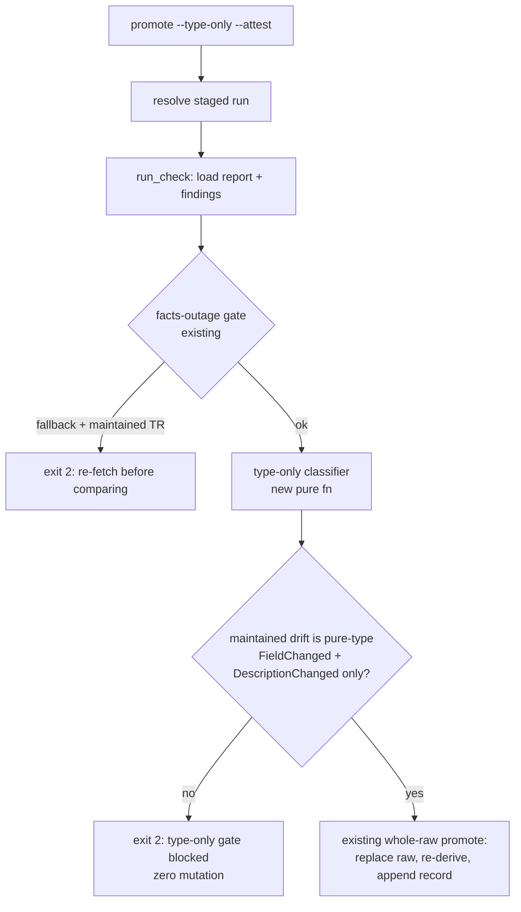

# feat: Type-only promotion gate for clean baseline field-type re-pin

## Summary

Add an opt-in `--type-only` mode to `api-drift promote` that refuses unless the staged fetch was clean (`property_type_fallback_served == false`) and the maintained-shape drift is only a pure-type `FieldChanged` plus `DescriptionChanged`. To classify "pure type change" reliably, enrich the drift model with structured field-attribute deltas instead of parsing the display string. Document the operator procedure (clean fetch → gated promote → per-facet ledger retirement) and provide the §4 ledger rewrite template. The live re-pin run itself is operator execution downstream of this plan.

## Problem Frame

The 36 normalized baselines were seeded under a `system-codes` HTTP-500 fallback, so their field `type` values came from a hardcoded table rather than a live authoritative source (`metadata/PROVISIONALITY-LEDGER.md` §4). Resolving that requires re-deriving the types from a clean fetch via a reviewed Baseline Promotion. The `api-drift promote --attest` lifecycle exists, but promote is whole-raw: a clean fetch can carry unrelated structural drift that would ride into the Reviewed Baseline. This plan builds the guardrail that keeps the re-pin surgical — a code-enforced gate that lets only a clean, type-scoped refresh through — plus the procedure to run it. The brainstorm (see origin) settled the behavior; this plan settles how it is built.

---

## Requirements

**Gate enforcement**

- R1. `api-drift promote` gains an opt-in `--type-only` mode. When set, promotion refuses unless the maintained-shape drift — findings on TRs where `support_state.is_maintained()` — consists only of pure-type `FieldChanged` and `DescriptionChanged` (origin R3, R5).
- R2. The gate distinguishes a pure-type `FieldChanged` from a length/required change via structured attribute deltas carried on the finding, not by parsing the `detail` display string. A `FieldChanged` carrying any non-type attribute change blocks, even when it also carries a type change (origin R4).
- R3. The gate refuses independently of `--attest` — attesting cannot satisfy it. Promotion without `--type-only` behaves exactly as today; the gate adds no restriction to general baseline promotion (origin R3).
- R4. A clean fetch is a precondition, enforced by the existing facts-outage gate: a fallback-served run with a maintained TR already exit-2s in `run_check` before promotion (and the §4 batch always carries maintained TRs). This slice adds no new fallback block in the type-only gate; it reads `property_type_fallback_served` only at ledger retirement (origin R1).
- R5. The promoted normalized shapes are typed from the clean live mapping captured in the staged run and reused at re-derivation — no live re-resolution at promote time, no fetch-vs-promote TOCTOU (origin R2).
- R6. A `--type-only` promotion that passes the gate performs the existing whole-raw promote: replace raw, re-derive normalized, append one promotion record — unchanged (origin R6, R7).

**Operator procedure and ledger**

- R7. `docs/MAINTENANCE_RUNBOOK.md` documents the clean-fetch → gated-promote → per-facet ledger-retirement procedure, including a post-promote clean self-diff check (origin R8, R9, R10; F1).
- R8. The runbook carries the §4 Retired / Still-provisional table template the operator fills during the run — retiring only facets the clean fetch proves, each residual naming its reason (origin R8, R9, R10).

---

## Key Technical Decisions

- KTD1. **Enrich the drift model with structured field-attribute deltas; do not string-parse `detail`.** `attribute_change_detail` (`crates/ls-trackers/src/api_drift.rs:793-817`) joins `type X→Y`, `length X→Y`, `required X→Y` with `", "` using a Unicode arrow — parsing it back is brittle. Carrying the changed attributes as structured data on `FieldChanged` lets the gate match on structure and keeps the display formatter a derived view. Caveat: the classify match sites (`change_kind` at `crates/ls-trackers/src/cli.rs:872-887`, `change_severity` at `api_drift.rs:560`, `is_qualifying` at `types.rs:349`) match `FieldChanged { .. }` with a rest-pattern, so a new field is silently absorbed there — only the two construction sites (`api_drift.rs:730`, `857`) fail to compile. Compiler-guidance therefore does NOT surface the gate's read site; represent the attribute set as a small enum the gate destructures exhaustively, so the gate logic is compiler-total over attribute kinds. Mirrors the repo's single-source convention for `gates_for` / `change_severity`.
- KTD2. **Type-only is an opt-in `--type-only` flag, not always-on.** General baseline promotion must stay unrestricted — a future non-type promote should not be locked to type-only. The flag composes with `--attest` (mutate) and `--dry-run` (preview).
- KTD3. **Layer the gate as an additional pure classifier on `run_check` findings; reuse existing gating; do not re-block on fallback.** The classifier consumes the maintained findings of `report.findings` (already classified by `gates_for` / `change_severity`) — it does not replace `gates_for`. The fallback precondition is left to the existing facts-outage gate, which already exit-2s a fallback-served run with maintained TRs in `run_check` (`cli.rs:547-552`) before `promote_committed` proceeds; the type-only gate adds no second fallback check (a redundant one would be unreachable for the §4 batch, which always carries maintained TRs). The fallback flag is read only in U4's retirement procedure.
- KTD4. **Ledger §4 retirement is a data-dependent operator act, not a code change.** The Retired / Still-provisional split depends on what the live fetch actually resolves, which is unknowable at plan time. The plan ships the template and procedure; the actual `metadata/PROVISIONALITY-LEDGER.md` edit happens during the operator run.

---

## High-Level Technical Design

The `--type-only` gate sits between the drift check and any mutation in `promote_committed`. Directional — the prose and unit fields are authoritative.

---

## Implementation Units

### U1. Structured field-attribute deltas on FieldChanged

- **Goal:** Carry which attributes changed (type / length / required) as structured data on a `FieldChanged` finding so downstream consumers classify without parsing the display string.
- **Requirements:** R2
- **Dependencies:** none
- **Files:**
  - `crates/ls-trackers/src/types.rs` — `DriftChange::FieldChanged` variant (add structured attribute-change data)
  - `crates/ls-trackers/src/api_drift.rs` — the two `FieldChanged` emit sites (exact-identity path ~`730-736`, reorder-reconciliation path ~`857-864`); `attribute_change_detail` (~`793-817`) re-expressed to derive the display string from the structured data; `change_severity` match (~`560-600`)
  - `crates/ls-trackers/src/cli.rs` — `change_kind` exhaustive match (~`872-887`)
  - `crates/ls-trackers/tests/api_drift.rs` — extend `compare()` tests
- **Approach:** Represent the changed attribute set as a small enum the gate can destructure exhaustively (no wildcard), carried on `FieldChanged`. Keep `attribute_change_detail` as a derived formatter over that data so the human-readable string is unchanged. The two construction sites (`api_drift.rs:730`, `857`) must populate the new data and will fail to compile until they do. The classify match sites (`change_kind` at `cli.rs:872-887`, `change_severity` at `api_drift.rs:560`, `is_qualifying` at `types.rs:349`) match `FieldChanged { .. }` with a rest-pattern, so they need no change and the compiler will NOT flag them — the gate's read of the new data (U2) is therefore an explicit, separately-tested obligation, not compiler-surfaced.
- **Patterns to follow:** the single-source classifier convention (`gates_for`, `change_severity`); the exhaustive no-wildcard match in `change_kind`.
- **Test scenarios:**
  - Happy path: a field whose only change is its type produces a `FieldChanged` whose structured delta marks type-changed and nothing else.
  - Edge: a field whose type and length both change marks both attributes.
  - Edge: a field whose required flag flips (type unchanged) marks required only.
  - Regression: the rendered `detail` string is byte-identical to today for each case (`type X→Y`, `type X→Y, length A→B`, etc.) — covers the existing `detail.contains("length 4→8")` assertion at `tests/api_drift.rs:1827`.
- **Verification:** `cargo test -p ls-trackers` passes; the new structured field is populated at both emit sites; `detail` output unchanged.

### U2. Type-only gate classifier (pure function)

- **Goal:** A pure, independently testable function that decides whether the maintained-shape drift is admissible for a type-only promotion. The fallback precondition is handled upstream by the facts-outage gate (R4) and is not re-checked here.
- **Requirements:** R1, R2, R3
- **Dependencies:** U1
- **Files:**
  - `crates/ls-trackers/src/api_drift.rs` or `crates/ls-trackers/src/types.rs` — new pure classifier (e.g. `type_only_gate(findings) -> TypeOnlyDecision`)
  - inline `#[cfg(test)]` tests beside the function
- **Approach:** Input the report findings. Filter to maintained findings (`support_state.is_maintained()`), ignoring untracked-only findings (including the appended `FactsDegraded`). Admit only when every maintained finding is either a `DescriptionChanged` (admitted by rule — `gates_for` returns false for it, so it must be admitted explicitly, not by filter omission) or a `FieldChanged` whose structured delta (from U1) is type-only. Any other `DriftChange` kind, or a `FieldChanged` carrying a non-type attribute, returns a block with a reason. Do not read the fallback flag here. Single-source pure function mirroring `gates_for`; match attribute kinds and `DriftChange` kinds exhaustively (no wildcard) so a future variant forces a deliberate admit/block choice.
- **Patterns to follow:** `gates_for` (`types.rs:335`) — pure, total, documented single-source rule with a matrix test.
- **Test scenarios:**
  - Happy path: pure-type `FieldChanged` across maintained TRs + `DescriptionChanged` → admit.
  - Block: `FieldAdded`, `FieldRemoved`, `FieldReordered`, `FieldMovedAcrossBlock`, `TrAdded`/`TrRemoved`, `EndpointChanged`, `ProtocolChanged`, `RateLimitChanged`, `FactsDegraded` on a maintained TR → each blocks.
  - Block: `FieldChanged` with required-flag or length detail → block (covers AE4).
  - Block: combined type+required `FieldChanged` → block (pure-type only).
  - Edge: a maintained `DescriptionChanged` is admitted by the explicit rule (not by filter omission).
  - Edge: an untracked-TR `FieldAdded` co-present with pure-type maintained drift → admit (untracked drift ignored).
  - Edge: empty/zero maintained drift → admit (near-zero drift still resolves provisionality; origin F4).
- **Verification:** classifier unit tests pass; every `DriftChange` kind has an explicit admit/block assertion; the maintained-vs-untracked filter is exercised.

### U3. Wire `--type-only` into the promote command

- **Goal:** Parse and thread `--type-only` through promote, run the gate after the drift check, and refuse before any mutation when it blocks.
- **Requirements:** R1, R3, R6
- **Dependencies:** U2
- **Files:** `crates/ls-trackers/src/cli.rs` — `parse_promote` (~`238-282`), the `Promote` / `PromoteDryRun` variants (~`65-77`), promote dispatch (~`1254-1312`), `promote_committed` (~`745-865`)
- **Approach:** Add a `--type-only` boolean to both promote variants and parse it in the hand-rolled loop before the `--dry-run`/`--attest` resolution branch (mirror `--json` at `cli.rs:166-177`; value-less flag). Thread it into `promote_committed`. After `run_check` returns the report (`cli.rs:754`) — which already enforces the fallback precondition (R4) — when `--type-only` is set, call the U2 classifier over `report.findings`; on block, return a distinct refusal (new `PromoteOutcome` reason → `Exit::Error` / exit 2, the established refuse-with-zero-mutation code, not `Exit::Gated`, which means "attest to proceed" and the type-only gate is non-attestable) with a type-only-specific message, before step 2's mutation. Dry-run with `--type-only` reports the gate result without writing. Do not re-load or re-check the fallback flag here.
- **Patterns to follow:** `--attest` / `--staged` value parsing and the `PromoteOutcome` → `Exit` mapping (`cli.rs:1278-1312`); the existing `promote_committed` step ordering.
- **Test scenarios:**
  - Parse: `promote --type-only --attest ENG-1` parses; `--type-only --dry-run` parses; mirror `parses_promote_attest_and_rejects_bare_invocation` (`cli.rs:1581-1622`).
  - Happy path: a staged run whose maintained drift is pure-type `FieldChanged` (+ `DescriptionChanged`), with `--type-only --attest` → promotes, raw replaced, one record appended (mirror `promote_clean_run_advances_baseline_and_appends_record` at `cli.rs:2628`).
  - Block: staged run with a `FieldAdded` on a maintained TR + `--type-only --attest` → refuses with exit 2, zero mutation (mirror `promote_gated_without_attest_refuses_and_writes_nothing` at `cli.rs:2696`).
  - Covers AE1: a fallback-served staged run is rejected by the existing facts-outage gate (exit 2, "re-fetch before comparing") before the type-only gate is reached — assert exit 2 and zero mutation; no new code path exercises this case.
  - Regression: promote `--attest` without `--type-only` behaves exactly as today (general promote unaffected).
- **Verification:** `cargo test -p ls-trackers` green; `cargo fmt` / `cargo clippy` clean; `make api-drift-promote-dry-run` still works.

### U4. Operator runbook procedure and ledger §4 template

- **Goal:** Document the end-to-end re-pin procedure and give the operator the concrete §4 rewrite target.
- **Requirements:** R7, R8
- **Dependencies:** U3
- **Files:** `docs/MAINTENANCE_RUNBOOK.md` — new subsection under `## API Drift review` (after the dry-run note at ~line 119)
- **Approach:** Add a "Field-type re-pin (clean baseline refresh)" subsection: (1) run a fresh `api-drift fetch` and confirm `property_type_fallback_served == false` — note that a fallback-served fetch is rejected by the facts-outage gate with exit 2 and the "re-fetch before comparing" message (read it as "system-codes was unhealthy, retry the fetch", not a type-only-gate failure); (2) `api-drift promote --type-only --dry-run` to review the drift; (3) if the gate blocks on non-type drift, stop and open a separate Maintenance Review Decision (do not force); (4) on a clean type-only gate, `promote --type-only --attest <op-or-issue>`; (5) run `api-drift check` to confirm a clean self-diff post-promote; (6) hand-edit `metadata/PROVISIONALITY-LEDGER.md` §4 into the Retired / Still-provisional split using the template below, retiring only facets the clean fetch proves. Include the §4 table template (mirror the `End state` framing of ledger §5): a Retired table (TR/facet, resolved type source) and a Still-provisional table (TR/facet, reason: untyped / raw-coded after clean fetch / blocked path).
- **Test expectation:** none — documentation only.
- **Verification:** `make docs-check` (or the repo's docs gate) passes; the subsection cross-links the ledger §4 and the origin brainstorm.

---

## Scope Boundaries

**Deferred to Follow-Up Work**
- The live re-pin operator run (fetch against live `system-codes`, attested `--type-only` promote, the data-dependent §4 ledger edit). This plan ships the gate, procedure, and template; the run is operator-executed downstream.
- Assisted ledger retirement tooling that emits the per-facet split from the drift + fallback report (origin deferred).

**Outside this product's identity** (carried from origin)
- The other ledger provisionality — `venue_session` (§1), `caller_supplied_identifiers` (§2), discovery relationships (§3) — needs live behavior verification, not a fetch.
- New-TR admission into `code-set.json` and any non-type structural drift — routed to a separate Maintenance Review Decision; whole-raw promotion does not smuggle them in.
- The `implemented → recommended` (`Promotion: ready`) flips and further TR expansion themselves — this work unblocks them, it does not perform them.

---

## Open Questions

**Deferred to Operator Run / Process**
- Stall backstop: when the clean fetch carries non-type drift the gate blocks and routes to a separate Maintenance Review Decision. How that decision is triggered and time-boxed — and whether the re-pin re-runs automatically once it resolves — is an operator-process question, not code (origin From-review deferred).

---

## Risks & Dependencies

- **Clean self-diff invariant** (`docs/solutions/architecture-patterns/change-tracker-baseline-clean-self-diff.md`): a baseline refresh can silently break the zero-finding self-diff. Mitigation: U4's procedure runs `api-drift check` post-promote to confirm a clean self-diff over the maintained inventory.
- **Case-collision trap** (same learning): per-TR shape files (`normalized/trs/{code}.json`) collide on case-insensitive filesystems. Not triggered here — the 36 §4 codes are all `t`+digits (e.g. `t1481`, `t8430`), no case-colliding pairs. Noted so a future inventory expansion re-checks before adding colliding codes.
- **Enriching `FieldChanged` is not fully compiler-guarded.** Only the two construction sites (`api_drift.rs:730`, `857`) fail to compile on the new field; the classify match sites (`change_kind` at `cli.rs:872-887`, `change_severity` at `api_drift.rs:560`, `is_qualifying` at `types.rs:349`) use `{ .. }` rest-patterns and are silently absorbed — they need no change, but the gate's read of the new data is an explicit, separately-tested obligation (see KTD1, U2). Serialization-safe: `DriftChange` is never persisted to a committed/staged artifact (only printed); the promotion log stores the `change_kind` label, not the variant payload.
- **Live `system-codes` health** is a precondition for the operator run (origin assumption); if it stays unhealthy the gate's fallback check blocks and the run waits.

---

## Sources / Research

- `crates/ls-trackers/src/cli.rs` — `parse_promote` (`238-282`), promote variants (`65-77`), dispatch (`1254-1312`), `promote_committed` (`745-865`), `run_check` (`508-572`), `load_fetch_report` (`1137`), `change_kind` exhaustive match (`872-887`), inline promote tests (`2628`, `2696`, `2741`), parse test (`1581-1622`), `write_staged_from_raw` stamping `property_type_fallback_served: false` (`2582-2597`).
- `crates/ls-trackers/src/api_drift.rs` — `compare` (`445`), `change_severity` (`560-600`), `attribute_change_detail` (`793-817`), `FieldChanged` emit sites (`730-736`, `857-864`).
- `crates/ls-trackers/src/types.rs` — `DriftChange` enum (`460-527`), `gates_for` (`335`), `is_qualifying` (`349`), `FetchReport.property_type_fallback_served` (`424-429`).
- `crates/ls-trackers/tests/api_drift.rs` — `compare()` test patterns (`154-183`, `1827`).
- `metadata/PROVISIONALITY-LEDGER.md` — §4 single-row table (`117-133`); §5 `End state` framing as the Retired/Still-provisional precedent.
- `docs/MAINTENANCE_RUNBOOK.md` — `## API Drift review` (`89`), dry-run promote note (`114-119`).
- `docs/brainstorms/2026-06-20-api-drift-baseline-promotion-requirements.md` — the `promote --attest` capability this builds on.
- `docs/solutions/architecture-patterns/change-tracker-baseline-clean-self-diff.md` — self-diff invariant and case-collision trap.
