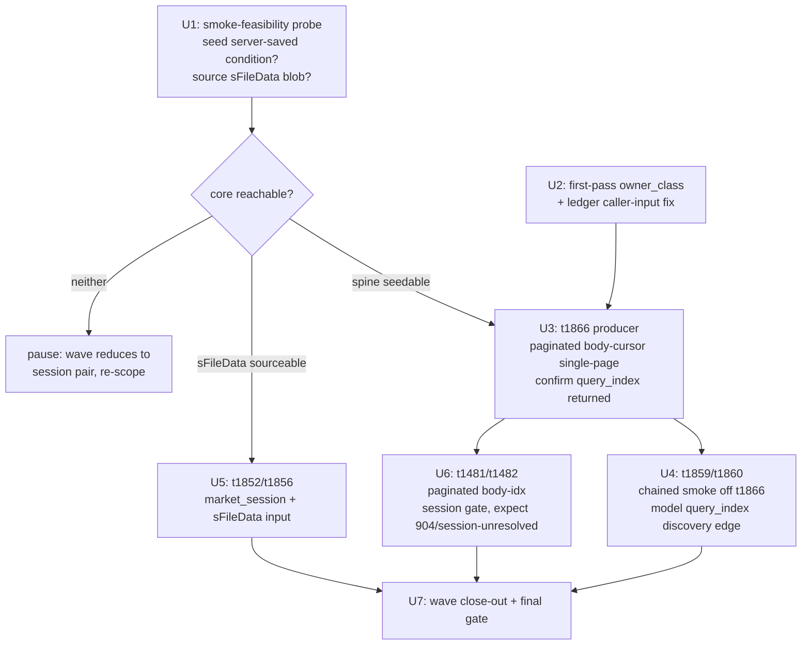

# feat: Saved-Condition Screening Implemented Expansion Wave

## Summary

Promote 7 read-only stock TRs from tracked-only to Implemented as one saved-condition screening capability, using the frozen `implement-tr` recipe unchanged: the `t1866 → t1859/t1860` server-saved-condition `query_index` spine, the `t1852`/`t1856` file-saved screens, and the session-gated `t1481`/`t1482` ranking pair. A smoke-feasibility probe runs first to resolve the two preconditions the brainstorm flagged (can a paper account seed a server-saved condition; can a representative `sFileData` blob be sourced) — its outcome decides how much of the core is smoke-feasible. Each TR ends Implemented-not-Recommended; the wave is variable-size and ships as one PR.

---

## Problem Frame

After the consumer-bound wave the maintained surface tracks 44 TRs with 18 callable. The 7 TRs here are tracked-only — structural drift visibility with no callable behavior — and compose a single screening capability the predecessor held back. The conversion path now exists: `.agents/skills/implement-tr/SKILL.md` is frozen and was proven on 11 TRs, so this wave authors no recipe; it applies the recipe per TR (see origin: `docs/brainstorms/2026-06-22-discovery-screening-implemented-expansion-requirements.md`).

Two things make this wave more than a recipe replay. First, the spine is a producer→consumer chain: `t1859`/`t1860` take a `query_index` produced by `t1866`, so their smoke must call `t1866` first and feed its output in — the same self-sourcing shape `live_smoke_t1531`/`t1537` already use against `t8425`, not a new mechanic. Second, the core's smoke-feasibility is genuinely uncertain: the spine smoke needs at least one server-saved condition to exist on the paper account (else `t1866` returns `00707` with no `query_index`), and `t1852`/`t1856` each require a ~26.8 KB caller-supplied `sFileData` screening-condition blob that may only come from the LS ThinQ desktop app. The brainstorm flagged both as resolve-before-planning; this plan front-loads them in a probe unit so the wave learns early whether the core is reachable or must re-scope to the session pair.

The 7 TRs: `t1866`, `t1859`, `t1860`, `t1852`, `t1856`, `t1481`, `t1482`.

---

## High-Level Technical Design

The wave is a precondition-gated per-TR loop. A feasibility probe decides which core TRs are reachable; each reachable TR then runs the frozen recipe's gating state machine (success+non-empty → flip; `00707` → pending; raw-HTTP-ok + deserialize-fail → TR-defect drop; reproduces-across-TRs → environmental hold-and-retry). The spine producer (`t1866`) is implemented before its consumers so their chained smoke can self-source a live `query_index`.

Per-TR end states follow the recipe state machine verbatim (`.agents/skills/implement-tr/SKILL.md` §4) — this plan does not redraw it. The wave-specific shapes are the precondition gate above and the spine's chained smoke.

---

## Key Technical Decisions

- **The recipe is frozen; this wave only applies it.** `.agents/skills/implement-tr/SKILL.md` exists and was proven on the consumer-bound 11. No recipe authoring, no recipe-freeze checkpoint. Each TR is one recipe pass: author callable Rust → build smoke harness → offline deserialize test → paper smoke → secret-safety check → flip metadata → retire confirmed facets → docgen count+banner (same commit) → gate → commit.

- **The chained spine smoke reuses the existing self-sourcing pattern.** `t1859`/`t1860` smokes call `t1866` first and feed `t1866OutBlock1.query_index` into the keyed read — the same self-sourcing shape as `live_smoke_t1531`/`t1537` (which source a `tmcode` from `t8425`, `crates/ls-sdk/tests/live_smoke.rs:343-364`), one step larger here because the producer is `paginated` and the consumers `market_session`, both vended by the shared `LsSdk` facade. The `query_index ← t1866OutBlock1.query_index` discovery edge (recorded in `metadata/PROVISIONALITY-LEDGER.md` §3) is modeled when these implement. `t1859`/`t1860` are never smoked with a fabricated index.

- **Smoke-feasibility is probed first and gates the core.** The spine needs a seeded server-saved condition; `t1852`/`t1856` need a sourced `sFileData` blob. U1 resolves both before per-TR authoring spends effort. If a precondition cannot be met, the affected TRs ship pending (`spine-input-unavailable` / `input-unresolved`) under block-and-drop rather than being assumed smokeable; if *neither* core precondition holds, the wave pauses to re-scope (the core collapses to the session pair, itself likely `session-unresolved`).

- **Routing: two corrections; all paginated TRs use a body cursor.** `t1859`/`t1860`/`t1852`/`t1856` carry placeholder `owner_class: standalone` (the OAuth-only class) and correct to `market_session` (non-paginated reads). `t1866` stays `paginated` with a request-body cursor (`cont`/`cont_key`, per its `self_continuation_fields`) — the same body-cursor single-page shape as `t1481`/`t1482` (body `idx`), i.e. the `t1452` `rank_screen` pattern, **not** `t8412`'s header cursor. All three model the cursor as an ordinary in-block field plus empty `#[serde(skip)]` `tr_cont`/`tr_cont_key` to satisfy `post_paginated`'s `HasPagination` bound. No multi-page collection (no `ls-core` body-cursor collection machinery exists; deferred to follow-up).

- **`t1852`/`t1856` model `sFileData` as a required caller input; the ledger row is corrected.** Both baselines carry a required `sFileData` String (length 26779); the provisionality ledger mis-records both as `caller_supplied_identifiers: []`. R7 fixes that to `[sFileData]` and models the field in the in-block. The blob never reaches a committed smoke line (credential-freedom).

- **The session gate is evidentiary; `904` is a timing skip, not a defect.** No SDK/core response field carries session phase, and the predecessor's call-auction smokes (`t1489`/`t1492`) ran off-session and could not resolve `krx_regular` vs `krx_extended`. `t1481`/`t1482` resolve their `venue_session` only via an in-session live-run window diffed against a regular-session run; absent that, `session-unresolved` is the expected default and they stay tracked-only without failing the wave. A market-closed `904` off-window is a session-timing skip, classified distinct from a hard failure (`docs/design/ls-gateway-response-semantics.md`).

- **No field-type retirement; the smoke does not confirm types.** A clean deserialize passes on null/absent/permissive fields. Only `venue_session` and `caller_supplied_identifiers` retire from the ledger on a confirming paper call. Field-`type` facets are already retired inventory-wide by the clean-fetch re-pin (ledger §4); nothing to do here. Each TR's offline test asserts a modeled non-key field is actually populated, so a permissive `serde(default)` deserialize can't yield a false-Implemented.

- **One PR, per-TR commits, count bump in the flip commit.** The wave ships as a single PR (capability coherence; mirrors the consumer-bound precedent). Each TR is its own focused commit keeping the tree green; the docgen `reference.len()` bump + `banner_trs` entry land in the same commit as the `support.implemented` flip, only after a passing smoke.

---

## Requirements

Carried from the origin document, grouped by concern; IDs preserve the origin R-numbering.

**Wave membership**

- R1. The wave promotes exactly 7 TRs: spine `t1866`/`t1859`/`t1860` (core), file-saved `t1852`/`t1856` (core), session-gated `t1481`/`t1482` (variable).
- R2. Each promoted TR satisfies the membership rule (on the spine, a file-saved screening screen, or ranks the screened set) — settled in origin; the plan does not re-litigate membership.

**Per-TR promotion (frozen recipe)**

- R3. Each TR gains callable Rust via `.agents/skills/implement-tr/SKILL.md`: request/response structs, public facade method, policy const + dual cross-check registration, per-TR smoke harness. The per-TR path is unchanged.
- R4. The promotion sets `support.implemented: true`, leaves `support.recommended: false`, writes no recommendation block, creates no evidence file. Each gets a reference page with the "Implemented, not yet recommended" banner.
- R5. The Implemented gate: request constructs through the public path, a paper call returns a success `rsp_cd` with a non-empty result, the response deserializes. An empty `00707` → recorded pending, not flipped. Committed smoke records pass the credential-freedom check first.

**Smoke preconditions**

- R6. The spine's chained smoke requires `t1866` to return a non-empty `query_index`, which requires ≥1 server-saved condition on the paper account. The wave seeds one; if none can be created, the spine is recorded `spine-input-unavailable` and `t1866`/`t1859`/`t1860` ship pending without failing the wave.
- R7. `t1852`/`t1856` require a caller-supplied `sFileData` blob (~26.8 KB) as a required request input; the ledger's `caller_supplied_identifiers: []` for both is corrected to record it. Each smoke depends on sourcing a representative `sFileData`; if none can be produced in-window, each is recorded `input-unresolved` (pending).

**The discovery spine**

- R8. The wave models the cross-TR discovery edge `query_index ← t1866OutBlock1.query_index` for `t1859`/`t1860` (recorded unmodeled in the ledger). Their gate is satisfied by a chained smoke: a live `t1866` call supplies the `query_index`; they have no standalone smoke input.
- R9. The discovery edge retires from the ledger only when the chained smoke confirms `t1866`'s `query_index` is accepted by `t1859`/`t1860`.

**Session gate**

- R10. `t1481`/`t1482` promote only if live behavior resolves their `venue_session` facet; an off-session smoke that merely deserializes does not satisfy it. Unresolved in-window → recorded `session-unresolved`, stays tracked-only, wave still completes.

**Provisionality and outcome**

- R11. Every TR that reaches implemented records a `venue_session` disposition (confirmed for `t1481`/`t1482`, or annotated unconfirmable-by-smoke for the non-session core), so no ledger row is left silently live. Field-`type` retirement is out of scope (already handled by the re-pin).
- R12. The wave completes when each of the 7 ends decided — implemented, or dropped/pending with a recorded reason (TR-defect, environmental-pending, input-unresolved, spine-input-unavailable, session-unresolved) in a ledger close-out section. The core 5 are the target subject to R6/R7; the session pair may end pending.
- R13. Count-bearing artifacts move to match the number promoted: docgen `reference.len()` from 19 toward 24 (core 5) or 26 (all 7), and the 12-element `banner_trs` array gains each promoted TR code — both updated in the same commit as each flip. (`reference.len()` counts the index page plus implemented pages, so it equals the implemented count — 18 today, toward 23/25 — plus one; the origin's "18 toward 23/25" counts implemented TRs, the same move.) The tracked-TR-count test is unaffected.
- R14. Recommended-tier artifacts stay unchanged: no recommendation claim for any of the 7, and `metadata/EVIDENCE-FRESHNESS.md` stays at six Recommended TRs.

---

## Implementation Units

### U1. Smoke-feasibility probe: spine seeding and sFileData sourcing

**Goal:** Resolve the two preconditions before per-TR authoring. Determine (a) whether a paper account can have a server-saved screening condition so `t1866` returns a non-empty `query_index`, and (b) whether a representative `sFileData` blob can be sourced for `t1852`/`t1856`. Record the outcome; it decides which core TRs are smoke-feasible. No metadata flips.

**Requirements:** R6, R7; gates R5 for U3/U4/U5.

**Dependencies:** none (lead unit).

**Files:**
- `metadata/PROVISIONALITY-LEDGER.md` (record probe outcome as a note; no facet retirement yet)
- `.env` / paper-gateway access (read-only probe; reuses harness `.env` sourcing)
- The plan/close-out records the decision; no source files change in this unit.

**Approach:** Investigation only — this unit runs against the paper gateway, so it is execution-time work, not plan-time. For the spine: call `t1866` (server-saved condition list) against the paper account and inspect whether any `query_index` is returned; if empty (`00707`), determine whether a condition can be created (via the LS web/app, or a paper-side create path) to seed one. For `sFileData`: determine whether a representative ~26.8 KB blob can be reconstructed from the spec, a prior capture, or the ThinQ desktop export. Source credentials via `set -a; . ./.env; set +a` (never make `include`), and diagnose any 403 by comparing credential lengths, never printing secrets. Record each outcome as: seedable / not-seedable, sourceable / not-sourceable. If **neither** core precondition holds, stop and surface a re-scope decision (the core collapses to the session pair) rather than authoring unreachable TRs.

**Execution note:** This is the wave's first action and a hard gate for the core — run it before any U3/U5 authoring so effort isn't spent on an unreachable smoke.

**Patterns to follow:** `raw_http_probe` and the `.env` sourcing in `crates/ls-sdk/tests/live_smoke.rs`; false-403 length diagnosis (`docs/solutions/integration-issues/makefile-include-env-quotes-gateway-403.md`).

**Test scenarios:** Test expectation: none — this unit produces a feasibility decision, not code. Its findings are validated by the live smokes in U3/U4/U5.

**Verification:** Both preconditions have a recorded outcome (seedable/not, sourceable/not); if neither core precondition holds, a re-scope decision is surfaced before U3/U5 begin.

---

### U2. First-pass owner_class and ledger caller-input reconciliation

**Goal:** Assign a defensible first-pass `owner_class` for the 7 and correct the two ledger caller-input rows the baselines contradict, so per-TR routing and input modeling can't silently balloon mid-wave. No metadata flips; corrections land per-TR in U3–U6.

**Requirements:** R3 (routing), R7 (sFileData ledger fix), supports R12.

**Dependencies:** none.

**Files:**
- `metadata/trs/t1866.yaml`, `t1859.yaml`, `t1860.yaml`, `t1852.yaml`, `t1856.yaml`, `t1481.yaml`, `t1482.yaml` (read)
- `metadata/PROVISIONALITY-LEDGER.md` (correct `caller_supplied_identifiers` rows for `t1852`/`t1856`)

**Approach:** First-pass assignment:

| TR | first-pass owner_class | rationale |
|----|------------------------|-----------|
| t1859, t1860, t1852, t1856 | `market_session` | non-paginated reads; current `standalone` is the OAuth-only placeholder |
| t1866 | `paginated` (body cursor) | `self_paginated: true` with a request-body `cont`/`cont_key` cursor, the `t1452` `rank_screen` shape (not `t8412`'s header cursor) |
| t1481, t1482 | `paginated` (body-`idx`) | `self_paginated: true` with request-body `idx`, the `t1452` shape |

`t1481`/`t1482`/`t1866` already carry `owner_class: paginated` (confirm-only); only `t1859`/`t1860`/`t1852`/`t1856` need the `standalone → market_session` correction. Correct the ledger: `t1852`/`t1856` `caller_supplied_identifiers` from `[]` to `[sFileData]` (the baseline marks it required). Note `t1859`/`t1860` already record `[query_index]` and the `t1866 → t1859/t1860` discovery edge in §3. Each assignment is confirmed or corrected per-TR during implementation.

**Patterns to follow:** `OwnerClass` enum in `crates/ls-metadata/src/schema.rs`; consumer-bound first-pass table (`docs/plans/2026-06-21-003-feat-consumer-bound-implemented-expansion-plan.md` U1).

**Test scenarios:** Test expectation: none — a first-pass decision and a ledger note, no code change. Validated per-TR via the routing cross-check and live smoke.

**Verification:** All 7 have a recorded first-pass `owner_class`; the `t1852`/`t1856` ledger rows record `sFileData`; the three routing sub-patterns (market_session, header-cursor paginated, body-`idx` paginated) are each represented.

---

### U3. Spine producer: implement t1866 (body-cursor single-page)

**Goal:** Implement `t1866` (server-saved condition list) to Implemented via the recipe, confirming it returns a usable `query_index` — the producer the chained consumers self-source from.

**Requirements:** R3, R4, R5, R6, R11, R13. Covers AE2 (producer leg), AE3.

**Dependencies:** U1 (spine seedable), U2 (owner_class).

**Files (recipe set):**
- `crates/ls-sdk/src/paginated/rank_screen.rs` (body-cursor shape) — `T1866` request/response structs, `::new()`, public method
- `crates/ls-sdk/src/lib.rs` (reuse existing `paginated()` accessor)
- `crates/ls-core/src/endpoint_policy.rs` (`T1866_POLICY` + `slice_rest_policies_are_non_order_rest` entry)
- `crates/ls-core/tests/policy_index_crosscheck.rs` (register in policies array)
- `crates/ls-sdk/tests/live_smoke.rs` (`live_smoke_t1866`), `Makefile` (`live-smoke-t1866` + `.PHONY`), `.agents/skills/promote-tr/references/smoke-map.md` (row, Promotion `implemented-only`)
- `metadata/trs/t1866.yaml`, `metadata/tr-index.yaml` (flip implemented, confirm `owner_class: paginated`)
- `metadata/PROVISIONALITY-LEDGER.md` (retire `venue_session` on confirm)
- `crates/ls-docgen/src/lib.rs` (add `t1866` to `banner_trs`, bump `reference.len()` to 20), regenerated docs

**Approach:** One recipe pass. `t1866` uses a request-body cursor: model `cont`/`cont_key` as ordinary serialized in-block fields (the `t1452` `rank_screen` shape), plus empty `#[serde(skip)]` `tr_cont`/`tr_cont_key` to satisfy `post_paginated`'s `HasPagination` bound — a single `post_paginated` call at single-page scope, not `t8412`'s header cursor. The response out-block exposes `query_index`; confirm at least one is returned (depends on U1 seeding). If `t1866` returns `00707` with no `query_index`, record `spine-input-unavailable` and ship `t1866`/`t1859`/`t1860` pending (AE3). Model a representative field subset; numeric fields use `string_or_number`, structs `#[serde(default)]`.

**Execution note:** Offline deserialize test against a representative captured response before the live smoke.

**Patterns to follow:** the body-cursor single-page shape in `crates/ls-sdk/src/paginated/rank_screen.rs` (`T1452` request/response — in-block cursor field plus empty `#[serde(skip)]` `tr_cont`/`tr_cont_key`); `T1452_POLICY` in `endpoint_policy.rs`; `live_smoke_t1452` harness shape. (`t8412`'s `chart_page` is the header-cursor shape — not applicable to `t1866`.)

**Test scenarios:**
- Offline deserialize: a representative success response deserializes and a modeled non-key field (incl. `query_index`) holds a real non-default value; numeric fields parse via `string_or_number` from string and number JSON. (Covers R5.)
- Offline deserialize: an empty `00707` response deserializes and is recognized as the empty/`spine-input-unavailable` case. (Covers R6, AE3.)
- Single-page wiring: `cont`/`cont_key` serialize as in-block fields at their first-page (empty) convention; one `post_paginated` call dispatches with empty `#[serde(skip)]` `tr_cont`/`tr_cont_key`; out-rows tolerate single-or-array via `de_vec_or_single`. (Covers R5.)
- Policy cross-check: `T1866_POLICY` present in both lists; `has_pagination ↔ self_paginated` assertion passes; routing fields match index. (Covers R3.)
- Metadata validator: index/per-TR agree on `owner_class: paginated`, support flags correct, no recommendation block / evidence file. (Covers R4.)
- Docgen: `reference.len() == 20`; `t1866` page carries the banner; no recommendation claim. (Covers R13, R14.)
- Err-path safety: `live_smoke_t1866` on a simulated gateway error emits no `LIVE-SMOKE` line. (Covers R5 credential-freedom.)
- Live (ignored): paper smoke returns success + non-empty `query_index`; captured line is credential-free. Covers AE2 (producer leg).

**Verification:** `t1866` is Implemented with a passing smoke and a banner page, or recorded `spine-input-unavailable` and pending; gate green; `EVIDENCE-FRESHNESS.md` unchanged.

---

### U4. Spine consumers: t1859, t1860 (chained smoke, modeled discovery edge)

**Goal:** Implement `t1859` (condition search) and `t1860` (realtime condition search) as `market_session` reads whose smoke chains off a live `t1866` call, and model the `query_index` discovery edge.

**Requirements:** R3, R4, R5, R8, R9, R11, R13. Covers AE2.

**Dependencies:** U3 (`t1866` returns a usable `query_index`).

**Files (recipe set, per TR):**
- `crates/ls-sdk/src/market_session/mod.rs` (correct `owner_class` from `standalone`), `crates/ls-sdk/src/lib.rs`
- `crates/ls-core/src/endpoint_policy.rs` (`T1859_POLICY`, `T1860_POLICY` + non-order list), `crates/ls-core/tests/policy_index_crosscheck.rs`
- `crates/ls-sdk/tests/live_smoke.rs` (`live_smoke_t1859`, `live_smoke_t1860`), `Makefile`, `smoke-map.md`
- `metadata/trs/t1859.yaml`, `t1860.yaml`, `metadata/tr-index.yaml` (flip implemented, correct `owner_class: market_session`)
- `metadata/PROVISIONALITY-LEDGER.md` (retire `venue_session`, `caller_supplied_identifiers: [query_index]`, and the §3 discovery edge on confirm)
- `crates/ls-docgen/src/lib.rs` (banner + count bump per TR), regenerated docs

**Approach:** One recipe pass per TR. Model `query_index` (and for `t1860`, its `sSysUserFlag`/`sFlag`/`sAlertNum` flags) in the in-block. The smoke calls `sdk.paginated().<t1866 method>()` first, extracts `t1866OutBlock1.query_index`, and keys the read — mirroring `live_smoke_t1531` self-sourcing from `t8425`. On an empty source the smoke emits `SMOKE-FAIL` (stderr), never a fabricated index. Apply the R6 state machine to any failure. Retire the `caller_supplied_identifiers` and discovery-edge facets only on a confirming call (AE2).

**Execution note:** Offline deserialize test per TR before the live smoke; assert the `query_index` serializes in the in-block.

**Patterns to follow:** `live_smoke_t1531`/`live_smoke_t1537` self-sourcing (`crates/ls-sdk/tests/live_smoke.rs:341-409`); `T1531`/`T1102` request/response shapes for `market_session`.

**Test scenarios (per TR):**
- Offline deserialize of a representative success response (a modeled non-key field populated) and of an empty `00707`. (Covers R5.)
- Request construction: `::new(query_index, ...)` serializes the in-block under the correct `serde(rename)` key with the `query_index` present. (Covers R5, R8.)
- Chained-smoke wiring (offline): given a stubbed `t1866` response with a `query_index`, the consumer request is keyed with it; given an empty `t1866` response, the smoke takes the no-index `SMOKE-FAIL` path, not a fabricated key. (Covers R8, AE2.)
- Policy cross-check + metadata validator pass (both lists, routing fields, support flags). (Covers R3.)
- Docgen banner + count bump per TR; no recommendation claim. (Covers R13, R14.)
- Err-path safety: each fn emits no `LIVE-SMOKE` line on error. (Covers R5.)
- Live (ignored): chained smoke — live `t1866` `query_index` feeds the consumer; success + non-empty + deserialize; credential-free line (no `query_index` value, no account). Covers AE2.

**Verification:** `t1859`/`t1860` reach a decided state; the discovery edge retires from the ledger only on a confirming chained smoke; gate green per commit.

---

### U5. File-saved screens: t1852, t1856 (sFileData input)

**Goal:** Implement `t1852` (file-saved realtime search) and `t1856` (file-saved search) as `market_session` reads taking the required `sFileData` screening-condition blob.

**Requirements:** R3, R4, R5, R7, R11, R13. Covers AE1.

**Dependencies:** U1 (`sFileData` sourceable), U2.

**Files (recipe set, per TR):**
- `crates/ls-sdk/src/market_session/mod.rs` (correct `owner_class`), `crates/ls-sdk/src/lib.rs`
- `crates/ls-core/src/endpoint_policy.rs` (`T1852_POLICY`, `T1856_POLICY`), `crates/ls-core/tests/policy_index_crosscheck.rs`
- `crates/ls-sdk/tests/live_smoke.rs`, `Makefile`, `smoke-map.md`
- `metadata/trs/t1852.yaml`, `t1856.yaml`, `metadata/tr-index.yaml`
- `metadata/PROVISIONALITY-LEDGER.md` (retire `venue_session`; reconcile `caller_supplied_identifiers` to `[sFileData]`)
- `crates/ls-docgen/src/lib.rs`, regenerated docs

**Approach:** One recipe pass per TR. Model the required `sFileData` String (and `t1852`'s `flag`/`sservergb`) in the in-block; the smoke supplies the representative blob sourced in U1. If no blob can be sourced, record `input-unresolved` and ship pending. The `sFileData` blob, being caller-supplied and large, must never reach a committed smoke line — capture only `rsp_cd`, lengths, and structural counts (credential-freedom, escalated by the blob).

**Execution note:** Offline deserialize test per TR before the live smoke.

**Patterns to follow:** `T1102`/`T1531` `market_session` request/response shapes; credential-free `record` guard in `live_smoke.rs`; secret-safety-by-type (`docs/solutions/architecture-patterns/change-tracker-baseline-clean-self-diff.md`).

**Test scenarios (per TR):**
- Offline deserialize of a representative success response (modeled non-key field populated) and of an empty `00707`. (Covers R5.)
- Request construction: `::new(sFileData, ...)` serializes the in-block with the `sFileData` field present under the correct key. (Covers R5, R7.)
- Credential-freedom (offline): the smoke's recorded line contains no `sFileData` content, only `rsp_cd`/lengths/counts. (Covers R5.)
- Policy cross-check + metadata validator pass. (Covers R3.)
- Docgen banner + count bump per TR. (Covers R13, R14.)
- Err-path safety: no `LIVE-SMOKE` line on error. (Covers R5.)
- Live (ignored): paper smoke with a sourced `sFileData` returns success + non-empty + deserialize. Covers AE1; the no-blob path → `input-unresolved` pending.

**Verification:** `t1852`/`t1856` reach a decided state (implemented / `input-unresolved` pending); ledger `caller_supplied_identifiers` reconciled to `[sFileData]`; gate green.

---

### U6. Session-gated ranking: t1481, t1482 (body-idx, session gate)

**Goal:** Implement `t1481` (after-hours rate-of-change leaders) and `t1482` (after-hours volume leaders) as single-page body-`idx` paginated reads, promoting only if the session facet resolves.

**Requirements:** R3, R4, R5, R10, R11, R13. Covers AE4.

**Dependencies:** U2.

**Files (recipe set, per TR):**
- `crates/ls-sdk/src/paginated/mod.rs` (or `paginated/rank_screen.rs`), `crates/ls-sdk/src/lib.rs`
- `crates/ls-core/src/endpoint_policy.rs` (`T1481_POLICY`, `T1482_POLICY`, `has_pagination: true`), `crates/ls-core/tests/policy_index_crosscheck.rs`
- `crates/ls-sdk/tests/live_smoke.rs`, `Makefile`, `smoke-map.md`
- `metadata/trs/t1481.yaml`, `t1482.yaml`, `metadata/tr-index.yaml`
- `metadata/PROVISIONALITY-LEDGER.md` (`venue_session` confirmed → retire, or `session-unresolved` recorded)
- `crates/ls-docgen/src/lib.rs`, regenerated docs

**Approach:** One recipe pass per TR, single-page body-`idx` per the `t1452` `rank_screen` shape: `idx` is an ordinary in-block field via `string_as_number` at its first-page convention (confirm empty/`0`/`1` per TR), with `tr_cont`/`tr_cont_key` as `#[serde(skip)]`. The session gate (R10) is evidentiary: promote only if an in-session live-run window resolves `krx_extended` vs `krx_regular`; absent that, record `session-unresolved` and leave tracked-only. Expect `904` (market-closed) off-window — classify as a session-timing skip, not a TR defect.

**Execution note:** Offline deserialize test per TR; assert `idx` serializes as an in-block field at its first-page convention.

**Patterns to follow:** `T1452InBlock`/`rank_screen.rs` single-page body-`idx`; `live_smoke_t1452`; session-semantics precedent (`docs/design/release-readiness-and-residual-lessons.md`, consumer-bound `t1489`/`t1492` off-session outcome).

**Test scenarios (per TR):**
- Offline deserialize of a representative single-page success and of an empty `00707`. (Covers R5.)
- Single-page wiring: `idx` serializes as an in-block field at its first-page convention; one `post_paginated` call with empty `tr_cont`/`tr_cont_key`. (Covers R5.)
- Policy cross-check: const in both lists; `has_pagination ↔ self_paginated` assertion passes. Metadata validator passes. (Covers R3.)
- Session disposition: on an unresolved session, `venue_session` is recorded `session-unresolved` and the TR stays `support.implemented: false`; on a confirmed in-session observation, the facet retires and the value matches index and per-TR file. (Covers R10, R11, AE4.)
- `904` handling: a market-closed off-window response is classified a session-timing skip, not a TR defect or environmental failure. (Covers R10.)
- Docgen banner + count bump only on a flipped TR. (Covers R13.)
- Live (ignored): in-session smoke success + non-empty + session-resolved → flip; off-session → `session-unresolved` pending. Covers AE4.

**Verification:** `t1481`/`t1482` reach a decided state; a flip happens only with a resolved `venue_session`; gate green.

---

### U7. Wave close-out and final gate

**Goal:** Record every TR's end state with classification, reconcile the docgen count to the actual promoted set, and confirm the recommended tier is untouched.

**Requirements:** R11, R12, R13, R14.

**Dependencies:** U3, U4, U5, U6.

**Files:**
- `metadata/PROVISIONALITY-LEDGER.md` (wave close-out section; final `venue_session` dispositions)
- `crates/ls-docgen/src/lib.rs` (final `reference.len()` reconciliation to the actual promoted count)
- `metadata/EVIDENCE-FRESHNESS.md` (read-only confirmation — stays at six Recommended TRs)

**Approach:** Append a close-out section listing each of the 7 with its end state — implemented, or pending/dropped with classification (TR-defect, environmental-pending, input-unresolved, spine-input-unavailable, session-unresolved). Confirm every promoted TR recorded a `venue_session` disposition (R11). Reconcile the docgen count to `19 + (number promoted)` with `banner_trs` containing exactly the promoted set. Run the full gate.

**Test scenarios:**
- Docgen count equals `19 + k` (k = TRs promoted); `banner_trs` contains exactly the promoted set; no promoted TR renders a recommendation claim. (Covers R13, R14.)
- Metadata validator green across all touched TRs (support flags, index/per-TR consistency, routing cross-check). (Covers R12.)
- `EVIDENCE-FRESHNESS.md` still states six Recommended TRs; no `metadata/evidence/<tr>.yaml` created. (Covers R14.)
- Ledger close-out: each of the 7 appears with a decided state and a `venue_session` disposition; field-`type` facets noted as already retired. (Covers R11, R12.)

**Verification:** Every one of the 7 is in a decided end state with a recorded reason; full workspace gate (`cargo test`, `cargo test -p ls-core`, `make docs`, `make docs-check`) green; recommended-tier artifacts unchanged.

---

## Scope Boundaries

**Deferred for later (roadmap waves, per origin)**

- ThinQ-smart / caller-input wave: `t1826` (produces `search_cd`) with its consumer `t1825`, plus `t1958`/`t1964`/`t3102`/`t3320`.
- ELW / underlying discovery wave: `t1988`/`t9905`/`t9907`/`t8431`/`t9942` (confirm `t1988`/`t9905` distinct vs collapse).
- Financial-ranking / investor-aggregate analytics wave: `t3341` + `t1601`/`t1615`/`t1664`/`t1640`/`t1662`.
- `t8430` (array-shape blocker); `CSPAT00601` and order-safety surface.

**Outside this wave's identity**

- Focused Evidence and Recommended promotion for any of the 7; any change to `metadata/EVIDENCE-FRESHNESS.md`.
- Authoring or revising the `implement-tr` recipe core — frozen; consumed unchanged.
- Field-`type` re-pin (already done inventory-wide).

**Deferred to follow-up work**

- Multi-page collection over body-`idx` (`t1481`/`t1482`) or header-cursor (`t1866`) — these promote single-page; a `*_all`-equivalent needs a new `ls-core` continuation contract.
- A reusable per-TR scaffolding helper beyond what the recipe provides — only if per-TR toil proves high.

---

## Acceptance Examples

- AE1. Covers R5, R7, R13. A file-saved screen (`t1852`/`t1856`) with a sourced `sFileData` constructs through the public path, a paper call returns success + non-empty, and deserializes → `support.implemented` flips; it gets a banner page. No sourceable `sFileData` → `input-unresolved` (pending), not flipped.
- AE2. Covers R6, R8, R9. With a seeded condition, a live `t1866` call returns a `query_index`; fed into `t1859`'s request, which constructs/sends/deserializes → the discovery edge retires and `t1859` flips. `t1859`/`t1860` are never smoked with a fabricated index.
- AE3. Covers R6, R12. No server-saved condition can be created, so `t1866` returns `00707` with no `query_index` → spine recorded `spine-input-unavailable`; `t1866`/`t1859`/`t1860` ship pending and the wave still completes on its other TRs.
- AE4. Covers R10, R12. A `t1481` paper smoke returns data but does not resolve `krx_extended` vs `krx_regular` → recorded `session-unresolved`, stays tracked-only; the wave completes with the core decided.
- AE5. Covers R5, R12. A TR's smoke fails, isolated to that TR (raw HTTP also fails) → stays tracked-only with a recorded reason. The same failure across TRs → environmental; the TR stays a candidate, ships pending if no in-window recovery.

---

## Risks & Dependencies

- **Both core preconditions could fail.** If the paper account cannot seed a server-saved condition AND no `sFileData` can be sourced, the core collapses and the wave reduces to the session pair (itself likely `session-unresolved`) — a near-empty wave. Mitigation: U1 probes both first and surfaces a re-scope decision before authoring; the plan does not assume either precondition.
- **Empty spine cascades to three TRs, not one.** A `00707` from `t1866` blocks the chained smoke for `t1859`/`t1860` as well. Mitigation: U3 confirms a usable `query_index` before U4; an empty spine records `spine-input-unavailable` and ships all three pending (AE3), not a defect.
- **`sFileData` sourcing may be ThinQ-only.** The 26.8 KB blob may only come from the desktop app. Mitigation: U1 determines sourceability; `input-unresolved` pending is the honest fallback. The blob must never reach a committed smoke line (credential-freedom, escalated).
- **Session facet likely unresolvable in-window.** Precedent (`t1489`/`t1492`) shows off-session smokes can't resolve it, and no response field carries session phase. Mitigation: R10 makes `session-unresolved` the expected default; `904` off-window is a timing skip, not a defect.
- **Silent policy cross-check skips.** A new `{TR}_POLICY` not registered in both lists is silently skipped. Mitigation: dual registration is a recipe step and a per-TR test scenario; the `has_pagination ↔ self_paginated` one-way assertion guards the pagination flag.
- **Quote-contaminated 403s masquerading as TR defects.** Mitigation: source `.env` via `set -a; . ./.env; set +a`; diagnose 403s by length comparison, never printing secrets (`docs/solutions/integration-issues/makefile-include-env-quotes-gateway-403.md`).
- **Red-CI sequencing on the docgen count.** The count literal is bumped per commit. Mitigation: the count + banner land in the same commit as each flip, only after a passing smoke; pending TRs contribute nothing (recipe §8).
- **Gate-over-diff blind spot.** New TR shapes touch the metadata validator / tracker surface. Mitigation: assert on the specific reviewed fields and use asymmetric fixtures so a new TR can't ride in un-evaluated (`docs/solutions/architecture-patterns/gate-over-diff-inherits-diff-scope-blind-spot.md`).
- **New chained-smoke bash, if any.** If the spine smoke adds make/bash glue, test the real I/O path with a stubbed binary, not a dry-run mock (`docs/solutions/workflow-issues/shell-script-live-path-needs-stubbed-binary-tests.md`).
- **Dependency:** the `implement-tr` recipe (`.agents/skills/implement-tr/`) and the 7 TRs' committed metadata + clean-re-pinned baselines are assumed present.

---

## Open Questions

- **Spine seeding mechanism (R6).** Whether a paper account can create a server-saved screening condition, and how — resolved empirically in U1. Determines if the spine is implementable or ships `spine-input-unavailable`.
- **`sFileData` sourcing (R7).** Whether a representative blob can be reconstructed outside the ThinQ desktop app — resolved in U1. Determines if `t1852`/`t1856` implement or ship `input-unresolved`.
- **In-session window for the session pair (R10).** Whether an after-hours live-run window is available to resolve `t1481`/`t1482`'s session facet, or whether `session-unresolved` is accepted as their end state for this wave.

---

## Sources / Research

- Frozen recipe (authoritative step list): `.agents/skills/implement-tr/SKILL.md`, `.agents/skills/implement-tr/references/author-patterns.md`.
- Non-paginated exemplar `crates/ls-sdk/src/market_session/mod.rs` (`T1102`, `T1531`); paginated exemplars `crates/ls-sdk/src/paginated/` (`T8412` header-cursor, `T1452` body-`idx` `rank_screen`); facade `crates/ls-sdk/src/lib.rs`.
- Self-sourcing chained-smoke precedent: `crates/ls-sdk/tests/live_smoke.rs` (`live_smoke_t1531`/`live_smoke_t1537` self-source a `tmcode` from `t8425`); `raw_http_probe` failure classifier.
- Endpoint policy + dual cross-check: `crates/ls-core/src/endpoint_policy.rs` (`{TR}_POLICY`, `slice_rest_policies_are_non_order_rest`); `crates/ls-core/tests/policy_index_crosscheck.rs` (policies array, `has_pagination ↔ self_paginated`).
- Docgen count + banner test: `crates/ls-docgen/src/lib.rs` (`reference_covers_implemented_with_banner_and_omits_unimplemented`, `reference.len() == 19`, 12-element `banner_trs`); `TRACKED_TRS` unaffected.
- Gateway response semantics (`00707`/`00136` = success-no-records; `904` market-closed skip): `docs/design/ls-gateway-response-semantics.md`. Session semantics: `docs/design/release-readiness-and-residual-lessons.md`.
- Provisionality ledger (the 7's `venue_session`, `caller_supplied_identifiers`, and the `query_index ← t1866OutBlock1.query_index` §3 edge; `sFileData` mis-recorded as `[]`): `metadata/PROVISIONALITY-LEDGER.md`.
- Institutional learnings: `docs/solutions/architecture-patterns/ls-sdk-pagination-modeling.md` (single-page body-`idx`, register const in both lists); `docs/solutions/integration-issues/makefile-include-env-quotes-gateway-403.md` (false-403); `docs/solutions/architecture-patterns/gate-over-diff-inherits-diff-scope-blind-spot.md` (asymmetric fixtures); `docs/solutions/workflow-issues/shell-script-live-path-needs-stubbed-binary-tests.md` (live-path tests); `docs/solutions/integration-issues/fault-tolerant-fallback-masked-wrong-endpoint-bug.md` (field-type re-pin context).
- Direct template (same recipe, 11 TRs): `docs/plans/2026-06-21-003-feat-consumer-bound-implemented-expansion-plan.md`.
- Origin requirements: `docs/brainstorms/2026-06-22-discovery-screening-implemented-expansion-requirements.md`.
