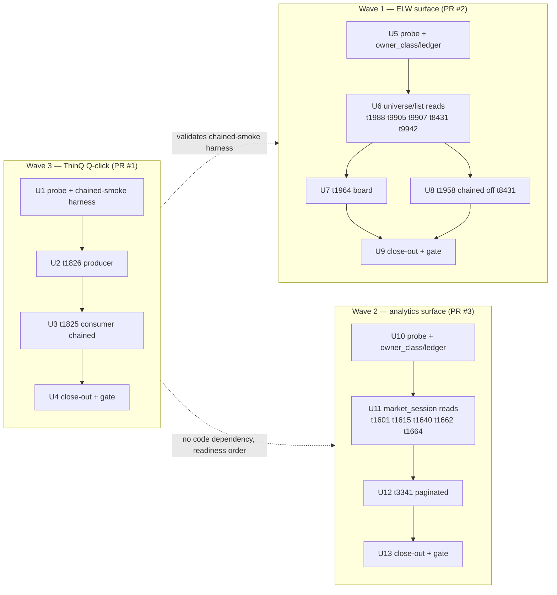
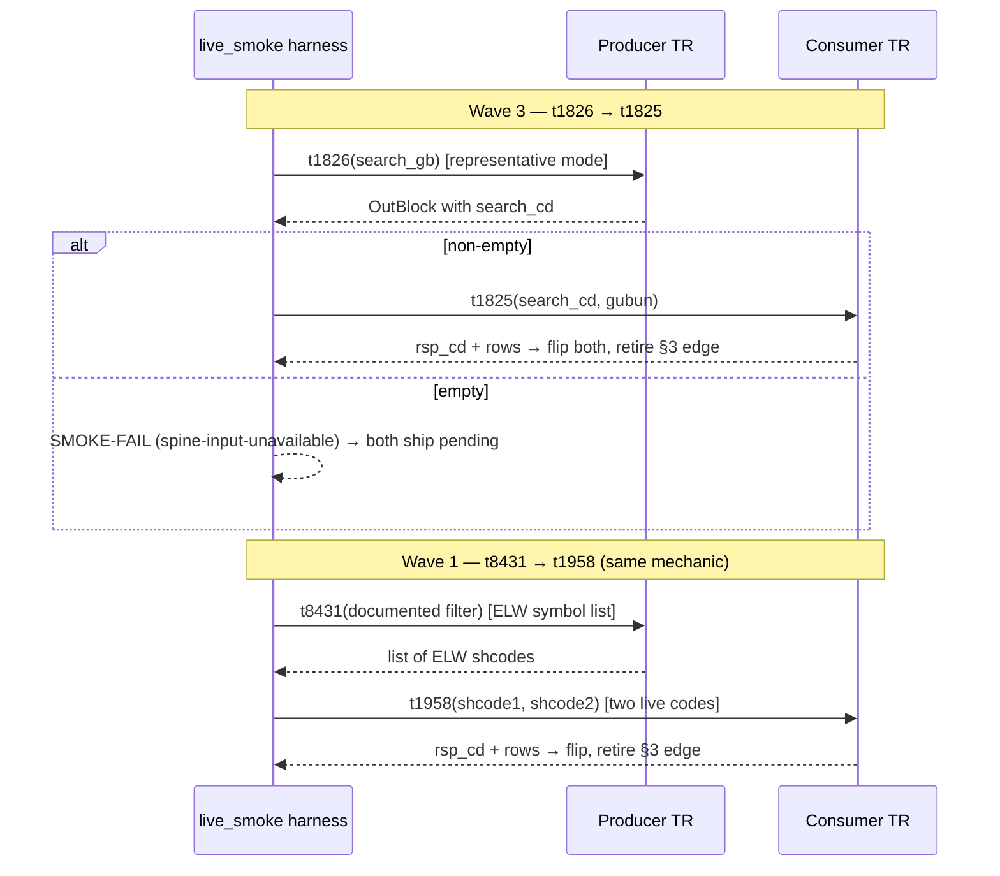
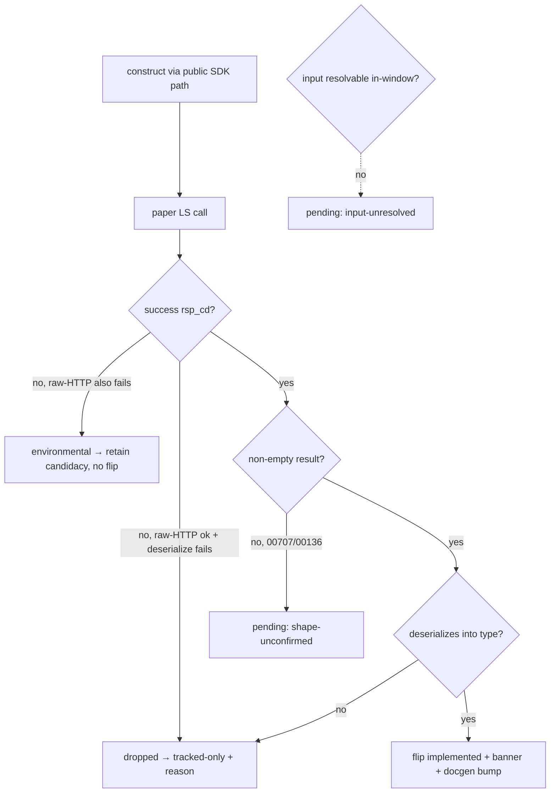

# feat: Capability-Closed Implemented Expansion Waves

Promote 15 tracked-only read-only LS-securities TRs to **Implemented-not-Recommended** across three serial PRs, each bounded by one named market-data capability, through the frozen `implement-tr` recipe and gated on a passing Paper Live Smoke. Sequence **Wave 3 first** (ThinQ chained pair) to validate the chained-smoke harness, then Wave 1 (ELW surface), then Wave 2 (market-flow analytics).

> **Origin:** `docs/brainstorms/2026-06-23-capability-closed-tr-expansion-waves-requirements.md`. Two premise questions deferred to planning are resolved in Key Technical Decisions (KTD-1, KTD-2) and revise the origin's R6/R10 smoke strategy.

---

## Problem Frame

The saved-condition screening wave (2026-06-22) held exactly these 15 TRs as consumer-less — "stay tracked-only until a real caller or a drift incident pulls them in" — and set the bar that promotion is justified only when each TR composes a *named capability*, not by completing drift coverage or amortizing the recipe. That hold still stands.

This campaign clears it not by relaxing the bar but by meeting it per wave, with one revision to *how* the bar is argued (see KTD-2): each wave is a **bounded market-data capability surface** proven by strict membership and live paper smokes, not by an internal producer→consumer edge. Only Wave 3 has a genuine producer→consumer chain (`t1826` yields the `search_cd` that `t1825` consumes); Waves 1 and 2 are capability *surfaces* — an ELW universe/instrument-lookup surface and an investor-flow/program-trading analytics surface — and the plan does not pretend every member has a downstream consumer.

Each TR ends `support.implemented: true`, `support.recommended: false`, with no Focused Evidence and no Recommended promotion. The campaign is a recipe-replay of the documented predecessor (`docs/plans/2026-06-22-001-feat-saved-condition-screening-expansion-plan.md`) at larger scale.

---

## Requirements Traceability

Carried from the origin requirements doc. "Status" notes where planning revises the origin.

| R-ID | Requirement (abbrev) | Where addressed | Status |
|---|---|---|---|
| R1 | Three separate PRs, serial campaign, per-wave close-out, no cross-wave dependency | Phased delivery; U4 / U9 / U13 | As written |
| R2 | Each wave bounded by one named capability, not coverage | KTD-2; Problem Frame | Revised framing (surface, not consumer-edge) |
| R3 | Wave 1 (ELW) ≤7: t1988, t9905, t9907, t8431, t9942, t1964, t1958 | Phase 2 (U5–U9) | As written |
| R4 | Wave 2 (analytics) ≤6: t1601, t1615, t1640, t1662, t1664, t3341 | Phase 3 (U10–U13) | As written |
| R5 | Wave 3 (ThinQ) ≤2: t1826 producer, t1825 consumer | Phase 1 (U1–U4) | As written |
| R6 | t1958/t1964 are ELW members, not producer-blocked caller-input TRs | KTD-1; U7, U8 | Revised sourcing (KTD-1) |
| R7 | Each TR gains callable Rust via frozen recipe; recipe core unmodified | All implement units | As written |
| R8 | implemented:true, recommended:false, no evidence, banner page | All implement units | As written |
| R9 | Implemented gate: construct + success rsp_cd + non-empty + deserialize | KTD-4; U-gate decision | As written |
| R10 | Wave 1/2 smoke as standalone reads, full required InBlock | KTD-1 | **Revised**: Wave 1 gains a discovery spine + no-fabricated-codes rule |
| R11 | Wave 3 chained smoke (t1826→t1825), author then retire §3 edge | U2, U3 | As written |
| R12 | Per-wave ledger close-out; venue_session disposition per member | U4, U9, U13 | As written |
| R13 | Bump docgen reference.len() (21) + banner_trs (14) per promoted TR | Every implement unit + close-out reconcile | As written |
| R14 | Block-and-drop; ≥1 flip to merit a PR; counts are ceilings | KTD-4; close-out units | As written |
| AE1 | Standalone read flips on non-empty success; empty 00707 → pending | U6, U11 test scenarios | As written |
| AE2 | Live t1826 search_cd feeds t1825; edge retires; t1825 flips | U2, U3 test scenarios | As written |
| AE3 | t1958 smokes with a representative ELW code; flips as ELW member | U8 (now via t8431 self-source, KTD-1) | Revised mechanism |
| AE4 | Isolated smoke failure → tracked-only with reason; wave still completes | KTD-4; close-out units | As written |

---

## Key Technical Decisions

### KTD-1. Wave 1 gains a small ELW discovery spine; **no fabricated ELW codes** (resolves origin Outstanding Question; revises R6/R10)

The origin defaulted to caller-supplied representative ELW tickers and stated "no chained producer smoke for Wave 1." Planning revises this. Wave 1 is **not** pure standalone reads — it is an ELW universe surface with a small discovery spine. The rule:

- **Where a member needs an ELW code, source it live from an in-wave producer.** `t1958` (ELW comparison) requires `shcode1`/`shcode2`; it self-sources **two** live ELW codes from `t8431` (ELW symbol list, an in-wave member), mirroring the Wave 3 spine mechanic. Its discovery edge is modeled in the ledger §3 and retired on the confirming chained smoke; `t1958.caller_supplied_identifiers` `[shcode1, shcode2]` corrects to `[]`.
- **Where a member is a universe/list query, use documented all/default filter values** — never a fabricated code. `t1988` (price/volume-filtered underlying list), `t9905` (full underlying list, `dummy` input), `t9907` (expiry month), `t8431` (ELW symbol), `t9942` (ELW master) smoke standalone with documented broad/default inputs, and the gate requires a **non-empty** result.
- **`t1964` (ELW board) is filter-driven, and its `item` field is an underlying-asset code (`기초자산코드`) — the same value the underlying-list reads (`t9905`/`t1988`) emit** (confirmed in `crates/ls-trackers/baselines/api-drift/normalized/trs/t1964.json`). So its likely producer is the underlying list, **not** `t8431`. The U5 probe resolves the sourcing: if a documented broad/all sentinel for `item` plus defensible defaults for the other 10 fields (`issuercd`, `lastmonth`, `elwopt`, `atmgubun`, `elwtype`, `settletype`, `elwexecgubun`, `fromrat`, `torat`, `volume`) returns rows, smoke standalone with those documented values; if `item` needs a real underlying code, **chain `t1964` off `t9905`/`t1988`** (self-source one underlying code), mirroring the `t1958`←`t8431` mechanic.
- **Filter enums count as codes under the no-fabrication rule.** A value is a "documented default" only if its source is named in U5 (vendor TR spec, an observed LS HTS request payload, or a baseline capture). An invented `atmgubun`/`elwtype`/`settletype` value carries the same false-pending risk as a fabricated code — if no source exists, the field is `input-unresolved` and the member ships pending. No invented enum values.

Rationale: self-sourcing live codes is more robust than pinning stale ELW tickers in a harness, and it better satisfies the named-capability bar (the surface discovers its own instruments). This deviation from R10 is in-bounds — the origin's own Key Decisions flagged producer-sourcing as "a deferred smoke-design choice," and this is its resolution.

### KTD-2. Waves 1 & 2 are capability *surfaces*, a different bar from the predecessor's consumer test (resolves origin premise question)

Hold the brainstorm's capability framing, but tighten how it is argued. Do **not** name an interim in-wave consumer per wave (risks inventing relationships) and do **not** reopen whether Waves 1/2 ship (out of scope). Instead:

- **Wave 1** = ELW universe and instrument-lookup surface. **Wave 2** = investor-flow / program-trading analytics surface.
- Each wave's ledger close-out states plainly that these waves clear the consumer-less hold by being **bounded market-data capabilities with strict membership and live paper smokes**, *not* by an internal producer→consumer edge — explicitly a different bar from the predecessor's screening-workflow consumer test.
- **Only Wave 3** carries a genuine producer→consumer edge, which is why it ships first (KTD-3).

This avoids the circularity the review flagged (Wave 1/2 named consumers being themselves promoted members) by not asserting a consumer edge at all for those waves.

The predecessor's exclusion had a **second prong** beyond the consumer-edge one — it excluded `t3341` and the analytics aggregates for *emitting analytics*. This campaign drops that prong deliberately, and the close-out (U13) states the reason rather than merely noting the divergence: the analytics-class exclusion was a *screening-workflow-consumption* test, and membership here is defined by **capability-surface coherence**, not workflow-consumption. The accepted trade is the standing maintenance cost of a coherent read-only analytics surface (see Risk Analysis). This is the same affirmative bar for every wave; it is load-bearing only because each member must be a coherent part of *one named surface* with a passing live smoke — a TR that cannot be written into that one-sentence surface claim is the relabel risk the review warned about and ships pending, not flipped.

### KTD-3. Sequence Wave 3 → Wave 1 → Wave 2 (revises campaign order; R1/R2 allow readiness ordering)

Wave 3 ships first: it is the smallest (2 TRs), has the cleanest non-circular dependency story, and its chained smoke (`t1826`→`t1825`) validates the chained-smoke harness pattern that Wave 1's `t8431`→`t1958` spine (KTD-1) then reuses. Wave 1 follows, then Wave 2. There is no cross-wave code dependency — each is an independent PR; the order is a readiness/validation choice, not a hard gate.

**Contingency (the validation is conditional).** The chained-smoke *pattern* is already proven in production (`t1859`←`t1866`, `t1537`←`t8425`); what Wave 3 newly exercises is *this pair's live data availability*. If `t1826` returns empty (resolved in U1), the mechanic is never run end-to-end and Wave 3 may ship zero flips (re-scope per R14) — in that case the Wave 1 `t8431`→`t1958` spine becomes the **first** live exercise of the mechanic, and U5/U8 must not assume it is pre-validated. To decouple "is the harness code correct" from "does this account have seeded data," U1 also adds an **offline captured-chain deserialize fixture** so harness correctness is validated independently of live data.

### KTD-4. Per-TR flip/pending/drop/held gate is the recipe's, applied unchanged (R9, R14)

The frozen recipe's decision boundary governs every member. A member flips `implemented` only when a representative paper call **constructs through the public SDK path, returns a recognized success `rsp_cd`, yields a non-empty result, and deserializes** into the hand-written type. Otherwise:

- Empty result (e.g. `00707`/`00136`) → **pending** (callable, shape-unconfirmed); ships, does not flip.
- Input cannot be resolved in-window (no live code, no defensible default) → **pending** (`input-unresolved`).
- Raw-HTTP probe succeeds but SDK deserialize fails, isolated to that TR → **dropped** to tracked-only with a recorded reason.
- Environmental failure (raw HTTP also fails) → candidacy retained, no flip.

A wave ships a PR only if ≥1 member flips with a passing smoke (R14); the 7/6/2 counts are ceilings. **The ≥1 flip must be a capability-*defining* member, not merely a supporting list read** — otherwise a trivially-non-empty list query (e.g. `t9905`) could carry the flip while every member that *defines* the capability ships pending. Capability-defining members: Wave 1 — `t1958` (comparison) and/or `t1964` (board); Wave 2 — the investor-flow / program-trading aggregates (`t1601`/`t1615`/`t1640`/`t1662`); Wave 3 — `t1825` (the consumer). If only supporting list reads flip and every capability-defining member ships pending, the close-out **downgrades** its claim from "capability proven" to "surface partially callable, capability-defining members pending" and does not assert the headline capability.

### KTD-5. Paginated members follow the body-`idx` single-page sub-pattern (t3341)

`t3341` (재무순위종합) is `self_paginated: true`, `self_continuation_fields: [idx]`. Per `docs/solutions/architecture-patterns/ls-sdk-pagination-modeling.md`: model `idx` as an **ordinary body field** serialized as a number at first-page convention (confirm `"0"`/`"1"` per baseline), **not** `#[serde(skip)]` (that is reserved for `t8412`'s header cursors). Promote at **single-page scope** only (a non-empty first-page success satisfies the gate); no multi-page collection. Enforce `self_paginated ⟹ has_pagination` (one-way, never equality). Register the policy const in **both** crosscheck lists. Model after `T1452` in `crates/ls-sdk/src/paginated/rank_screen.rs` (`T1452` lives in `rank_screen.rs`; the pagination-modeling learning doc's `paginated/mod.rs` reference is stale — trust this path).

### KTD-6. Smoke harness hygiene carried from documented learnings

- Source `.env` via `set -a; [ -f .env ] && . ./.env; set +a` in the recipe shell — **never** Makefile `include` (quote-contamination → spurious gateway 403; see `docs/solutions/integration-issues/makefile-include-env-quotes-gateway-403.md`). Require `LS_TRADING_ENV=paper`.
- Struct field types derive from the **clean-pinned** baseline (`crates/ls-trackers/baselines/api-drift/normalized/trs/<tr>.json`, post field-type re-pin / PR #32), not any HTTP-500-seeded snapshot.
- Secret-safety (recipe R3a): no token/appkey/secret/account id/`rsp_msg` in any committed line; record only `rsp_cd` + a count. `LS_PAPER_USER_ID` (if ever needed) is read from env and never recorded — though note the Wave 3 and Wave 1 spines self-source from a producer call, not from a user id.
- **Chained-value classification.** `search_cd` is a server-assigned ThinQ **account-scoped** key — treat it like the predecessor's `query_index`: never record it in a `record()` call or a ledger disposition row (write `search_cd accepted`, not the value). ELW `shcode`s from `t8431` are **public** market identifiers and may appear in the `inputs` field (like a public `symbol`). The `record()` `inputs=` field carries only public identifiers and env metadata — never raw OutBlock field values.
- **Non-2xx body surfacing** (per `makefile-include-env-quotes-gateway-403.md`) stays a manual raw-`curl` diagnostic this campaign; it is **not** wired into SDK-layer capture. If anyone surfaces a gateway body during a smoke, it must route to the `SMOKE-FAIL`/`panic` (stderr) path, never to `record()`.

### KTD-7. owner_class placeholder correction is per-TR on flip

Six non-paginated members (`t1988`, `t9905`, `t1964`, `t1958`, `t1826`, `t1825`) carry the `standalone` placeholder owner_class. Each corrects to `market_session` on its flip (recipe §6, predecessor precedent). `t3341` already carries `paginated`. The remaining Wave 1/2 members get a defensible first-pass owner_class assigned in the feasibility/reconciliation units (U5, U10) before authoring, so routing cannot silently balloon mid-wave.

---

## High-Level Technical Design

Directional guidance for review — prose and per-unit fields remain authoritative where they disagree.

### Campaign sequence (three serial PRs, readiness-ordered)

### Chained-smoke data flow (Wave 3 spine, and Wave 1's reuse of the mechanic)

### Per-TR gate (recipe decision, applied unchanged — KTD-4)

---

## Scope Boundaries

### In scope

All 15 members across three waves, promoted to Implemented-only (ceilings 7 / 6 / 2), via the frozen recipe; per-wave ledger close-outs; per-commit docgen count/banner bumps; the Wave 3 and Wave 1 chained-smoke spines.

### Deferred for later (still tracked-only, blocker-gated) — carried from origin

- `t1852` / `t1856` — require a caller-supplied `sFileData` screening-condition blob; promotable once a representative file can be sourced.
- `t1481` / `t1482` — promotable only when their `venue_session` facet resolves under an in-session live window.
- `t3102` / `t3320` — caller-input TRs with no defined producer for their required inputs.
- `t1860` (realtime condition search) and `t8430` (upstream array-shape blocker) — a future realtime wave and an upstream-clarification fix.

### Outside this campaign's identity — carried from origin

- Recommended tier, Focused Evidence, and any `metadata/EVIDENCE-FRESHNESS.md` edit for any member — these waves are Implemented-only.
- `CSPAT00601` and any order-capable surface — out until the order-safety package is the target work item.
- Revising the `implement-tr` recipe core — it is frozen; the chained smokes are harness extensions on top of it, not recipe changes.

### Deferred to follow-up work (plan-local)

- Multi-page collection for `t3341` (a `*_all` accessor) — single-page scope only this campaign (KTD-5).
- Capturing a `/ce-compound` learning for the novel surfaces this campaign introduces (chained producer→consumer smoke, `00707` empty-result semantics, ELW/analytics/ThinQ TR families) — the learnings search found these undocumented.

---

## Dependencies / Prerequisites

- The `implement-tr` recipe (`.agents/skills/implement-tr/`) exists and is frozen — prerequisite for R7.
- All 15 members are tracked-only with committed metadata and clean-pinned normalized baselines (post field-type re-pin / PR #32).
- Current implemented count is 20; docgen asserts `reference.len() == 21` (index + 20 pages) with a 14-element `banner_trs` array.
- A working paper account (`.env`: appkey/secret; `LS_TRADING_ENV=paper`) reachable at the LS paper gateway.
- All members read against `krx_regular`, carry no `account_state` / `paper_incompatible` flags — assumed paper-callable read-only stock TRs; any that turns out otherwise surfaces through the KTD-4 gate, not assumed in.

---

## Phase 1 — Wave 3: ThinQ Q-click search (ships first, PR #1)

### U1. Wave 3 feasibility probe + chained-smoke harness extension

**Goal:** Resolve Wave 3 preconditions and scaffold the chained smoke before any flip. No metadata changes.
**Requirements:** R5, R11, AE2.
**Dependencies:** none.
**Files:**
- `crates/ls-sdk/tests/live_smoke.rs` (scaffold `live_smoke_t1826`, `live_smoke_t1825` — extension, no recipe-core change)
- `crates/ls-trackers/baselines/api-drift/normalized/trs/t1826.json`, `.../t1825.json` (read-only: confirm field names)
**Approach:**
- Confirm `t1826`'s required InBlock (`search_gb` — the mode that selects which search list / `search_cd` set), the `search_cd` OutBlock field name, and `t1825`'s required InBlock (`search_cd` + `gubun`) from the clean baselines.
- Confirm `t1826` returns a non-empty `search_cd` on a paper call with a representative `search_gb`. If empty, Wave 3 ships pending (R11) — record and proceed to close-out.
- Mirror the `t1866`→`t1859` harness mechanic (`crates/ls-sdk/tests/live_smoke.rs:720-817`): consumer smoke self-sources from the producer call, never a fabricated key; on empty producer output emit `SMOKE-FAIL` to stderr.
**Patterns to follow:** `live_smoke_t1859` self-sourcing `query_index` from `t1866`; `live_smoke_t1531`/`t1537` self-sourcing `tmcode` from `t8425`.
**Test scenarios:**
- Offline captured-chain fixture: a recorded `t1826` body → extract `search_cd` → a recorded `t1825` body deserializes — validates the chained-smoke harness *code* independently of live data (KTD-3 contingency), so harness correctness does not depend on `t1826` being non-empty.
- (Live behavioral coverage lands in U2/U3.)
**Verification:** Probe answers recorded (field names, producer non-empty Y/N, representative `search_gb`); offline chain fixture passes; harness compiles; no metadata flipped.

### U2. Implement t1826 (Wave 3 producer)

**Goal:** Make `t1826` callable and flip it implemented so the consumer can self-source `search_cd`.
**Requirements:** R5, R7, R8, R9, R13, AE2.
**Dependencies:** U1.
**Files:**
- `crates/ls-sdk/src/market_session/mod.rs` (`T1826InBlock`, `T1826Request::new(search_gb)`, `T1826OutBlock`/`Vec`, `T1826Response`, public method)
- `crates/ls-core/src/endpoint_policy.rs` (`T1826_POLICY` const + add to `slice_rest_policies_are_non_order_rest`)
- `crates/ls-core/tests/policy_index_crosscheck.rs` (register in `policies` array)
- `crates/ls-sdk/tests/live_smoke.rs` (`live_smoke_t1826`)
- `Makefile` (`live-smoke-t1826` target + `.PHONY`)
- `.agents/skills/promote-tr/references/smoke-map.md` (row, Promotion = `implemented-only`)
- `metadata/trs/t1826.yaml` + `metadata/tr-index.yaml` (`implemented: true`, owner_class `standalone`→`market_session`)
- `crates/ls-docgen/src/lib.rs` (`banner_trs` += `t1826`, `reference.len()` += 1 → 22) — **same commit as flip**
**Approach:** Recipe order: author Rust → harness → offline deserialize test → paper smoke → secret-safety → flip → docgen → gate → commit. KTD-6/KTD-7 apply.
**Patterns to follow:** non-paginated market_session members in `crates/ls-sdk/src/market_session/mod.rs`; dual policy registration per `ls-sdk-pagination-modeling.md`.
**Test scenarios:**
- Offline: a captured `t1826` success body deserializes into `T1826Response`; the `search_cd` field is populated.
- `Covers AE2.` Paper smoke: `t1826(search_gb)` returns success `rsp_cd` + non-empty `search_cd` list → flips implemented.
- Empty result → pending (no flip), recorded.
- Policy: `T1826_POLICY` present in both crosscheck lists (silent-skip guard); `has_pagination: false`.
- Docgen: with `t1826` added, `reference.len() == 22` and its page carries the "Implemented, not yet recommended" banner.
**Verification:** `make live-smoke-t1826` passes (1 passed); `make docs && cargo test && cargo test -p ls-core && make docs-check` green; one focused commit, tree green.

### U3. Implement t1825 (Wave 3 consumer, chained)

**Goal:** Make `t1825` callable, smoke it by chaining off a live `t1826` `search_cd`, flip it, and retire the discovery edge.
**Requirements:** R5, R7, R8, R9, R11, R13, AE2.
**Dependencies:** U2 (producer must be implemented to self-source).
**Files:**
- `crates/ls-sdk/src/market_session/mod.rs` (`T1825InBlock`, `T1825Request::new(search_cd, gubun)`, `T1825OutBlock`/`Vec`, `T1825Response`, public method)
- `crates/ls-core/src/endpoint_policy.rs`, `crates/ls-core/tests/policy_index_crosscheck.rs` (dual registration)
- `crates/ls-sdk/tests/live_smoke.rs` (`live_smoke_t1825` — calls `t1826` first, extracts `search_cd`, feeds `t1825`)
- `Makefile`, `.agents/skills/promote-tr/references/smoke-map.md`
- `metadata/PROVISIONALITY-LEDGER.md` (§3: **author** the `search_cd ← t1826OutBlock.search_cd` discovery edge mirroring the t1860 `query_index` row, then **retire** it on the confirming smoke; §2: correct `t1825.caller_supplied_identifiers` `[search_cd]` → `[]`)
- `metadata/trs/t1825.yaml` + `metadata/tr-index.yaml` (`implemented: true`, owner_class correction, `caller_supplied_identifiers: []`)
- `crates/ls-docgen/src/lib.rs` (`banner_trs` += `t1825`, `reference.len()` += 1 → 23) — same commit as flip
**Approach:** Author the §3 edge row first (it does not yet exist), then implement and smoke. `t1825` is **never** smoked with a fabricated `search_cd`. On a non-empty chained success, flip and retire both the §3 edge and the §2 `caller_supplied_identifiers` row — retirement is atomic with the **consumer's** flip, never the producer's. If `t1826` returned empty in U1/U2, both rows are retained and `t1825` ships pending. The close-out disposition row must read `(chained off t1826; search_cd accepted)` — **never** the `search_cd` value (KTD-6).
**Patterns to follow:** `live_smoke_t1859` chained off `t1866` (`crates/ls-sdk/tests/live_smoke.rs:770-817`); the t1860 §3 edge-row format.
**Test scenarios:**
- Offline: a captured `t1825` success body deserializes into `T1825Response`.
- `Covers AE2.` Chained paper smoke: live `t1826` `search_cd` feeds `t1825(search_cd, gubun)`; returns non-empty success → `t1825` flips, §3 edge + §2 row retire.
- Producer empty → `t1825` ships pending, §3 edge + §2 row **retained** (no silent retirement).
- `t1825` request rejects/constructs-fails with a fabricated `search_cd` is never exercised (harness self-sources only).
- Author-then-retire invariant: a chained member must not end with `caller_supplied_identifiers: []` in metadata while its §3 edge or §2 row is still present/live — assert no metadata/ledger contradiction (the §2 row and metadata agree).
- Docgen: `reference.len() == 23` after this flip.
**Verification:** `make live-smoke-t1825` passes; full gate green; ledger shows the edge authored-then-retired (or retained-if-pending); commit tree green.

### U4. Wave 3 close-out + PR

**Goal:** Append the Wave 3 ledger close-out, reconcile the docgen count, confirm Recommended tier untouched, run the full gate, open PR #1.
**Requirements:** R1, R12, R13, R14, AE4.
**Dependencies:** U2, U3.
**Files:**
- `metadata/PROVISIONALITY-LEDGER.md` (new §7 "ThinQ Q-click search wave — close-out (2026-06-23)")
- `crates/ls-docgen/src/lib.rs` (verify `reference.len()` reconciles to 21 + members flipped)
**Approach:** Mirror the §6 close-out template — prose summary (which plan, decided-state counts), per-TR disposition table, "spine proven end-to-end" prose naming the §1/§2/§3 rows retired, per-member `venue_session` disposition (confirmed or annotated-unconfirmable, R12), residual-provisionality and follow-up-roadmap subsections. State that Wave 3 carries a **genuine** `t1826`→`t1825` producer→consumer edge (KTD-2's surface framing applies to Waves 1/2 and is stated in U9/U13 — not here). Confirm `metadata/EVIDENCE-FRESHNESS.md` and the six Recommended TRs are untouched.
**Test scenarios:** Test expectation: none — documentation + gate reconciliation; coverage lives in U2/U3.
**Verification:** `make docs && cargo test && cargo test -p ls-core && make docs-check` green; ledger §7 present with a row per member and a `venue_session` disposition each; ≥1 member flipped (else re-scope per R14); PR #1 opened.

---

## Phase 2 — Wave 1: ELW universe & instrument surface (PR #2)

### U5. Wave 1 feasibility probe + owner_class / ledger reconciliation

**Goal:** Resolve Wave 1 preconditions (the discovery-spine feasibility and documented-default inputs) and assign defensible owner_class before authoring. No flips.
**Requirements:** R3, R6, R10 (revised per KTD-1), R12, KTD-1, KTD-7.
**Dependencies:** none (no code dependency on Wave 3; sequenced after for harness validation).
**Files:**
- `crates/ls-trackers/baselines/api-drift/normalized/trs/{t1988,t9905,t9907,t8431,t9942,t1964,t1958}.json` (read-only: confirm request InBlock field sets, `shcode` OutBlock field on t8431)
- `metadata/PROVISIONALITY-LEDGER.md` (§2: reconcile contradicted caller-input rows where a documented-default or self-sourced reading is now defensible)
**Approach:**
- Confirm `t8431`'s required input and that it returns a non-empty list of ELW `shcode`s, **with an underlying/`expcode` field usable to group a valid comparison pair** for `t1958` (the producer for `shcode1`/`shcode2`).
- For each universe query (`t1988` price/volume filter InBlock; `t9905` `dummy`; `t9907`; `t9942`), confirm a **named-source** documented broad/default input set (vendor TR spec, observed LS HTS payload, or baseline capture) that returns non-empty — no invented enum values (KTD-1).
- **Resolve `t1964` sourcing (the one genuinely open Wave 1 question).** Its `item` is `기초자산코드` (underlying-asset code). Determine whether a documented broad/all sentinel for `item` exists (→ standalone with sourced defaults) or `item` must be a real underlying code (→ chain `t1964` off `t9905`/`t1988`, and pre-scaffold its `live_smoke_t1964` in U7). Record the decision and confirm which OutBlock carries `t1964`'s ELW-code payload.
- Confirm which of `t1958`'s three OutBlocks carries the **comparison payload** (the non-empty gate target for U8).
- Confirm `t1988` vs `t9905` remain distinct (different `source_spec_hash` + request blocks) — do not collapse.
- Assign first-pass owner_class: `market_session` for all six non-paginated members (the `standalone` placeholders).
**Test scenarios:** Test expectation: none — investigation + reconciliation; behavioral coverage lands in U6–U8.
**Verification:** For each member: documented inputs recorded and non-empty-confirmed (or flagged input-unresolved → pending in its unit); t8431 self-source feasibility recorded; t1964 sourcing decision recorded; owner_class assigned; t1988/t9905 distinctness reconfirmed.

### U6. Implement Wave 1 universe/list reads (t1988, t9905, t9907, t8431, t9942)

**Goal:** Implement the five ELW universe/list queries as standalone reads with documented all/default filters; flip each that returns non-empty. `t8431` must land here (producer for U8).
**Requirements:** R3, R7, R8, R9, R10 (revised), R13, AE1, KTD-1.
**Dependencies:** U5.
**Files (per TR, one focused commit each):**
- `crates/ls-sdk/src/market_session/mod.rs` (request/response structs + public method per TR)
- `crates/ls-core/src/endpoint_policy.rs` + `crates/ls-core/tests/policy_index_crosscheck.rs` (dual registration per TR)
- `crates/ls-sdk/tests/live_smoke.rs` (`live_smoke_<tr>` per TR), `Makefile`, `.agents/skills/promote-tr/references/smoke-map.md`
- `metadata/trs/<tr>.yaml` + `metadata/tr-index.yaml` (flip + owner_class), `crates/ls-docgen/src/lib.rs` (`banner_trs` += tr, `reference.len()` += 1) — **the docgen bump lands in the same commit as that TR's flip, never batched** (so the count never drifts from state if a later TR in the batch goes pending)
**Approach:** Recipe order per TR, one focused commit each. Each smoke supplies the **full required InBlock with documented broad/default values** (no fabricated codes; filter enums need a named source per KTD-1) and gates on a non-empty success. `t8431` returns the ELW `shcode` list consumed by U8 — implement it before U8.
**Patterns to follow:** market_session non-paginated members; `ls-sdk-pagination-modeling.md` dual registration; KTD-6 env/secret hygiene.
**Test scenarios:**
- Offline per TR: captured success body deserializes into the response type (handle array out-blocks via `de_vec_or_single`).
- `Covers AE1.` Paper smoke per TR with documented defaults: success `rsp_cd` + non-empty → flips; empty `00707` → pending (no flip), recorded.
- `t9905` `dummy`-input full list and `t1988` price/volume-filtered list both construct and return distinct shapes (distinctness guard).
- Policy dual-registration present per TR; `has_pagination: false`.
- Docgen count increments by exactly the number flipped in this unit.
**Verification:** `make live-smoke-<tr>` passes for each flipped TR; `t8431` confirmed returning non-empty `shcode`s (gates U8); full gate green; per-TR commits, tree green.

### U7. Implement t1964 (ELW board)

**Goal:** Implement `t1964`; flip on a non-empty result that returns live ELW codes. Sourcing of its `item` (underlying-asset code) field is resolved by U5 (KTD-1).
**Requirements:** R3, R6, R7, R8, R9, R13, KTD-1.
**Dependencies:** U5; **and U6 if the U5 probe found `item` (or another field) needs a produced underlying-asset code** — then chain off `t9905`/`t1988` (implemented in U6), self-sourcing one underlying code. If U5 found defensible documented defaults, no U6 dependency.
**Files:** same per-TR set as U6, for `t1964` (docgen bump same-commit-as-flip); if chained, add a `live_smoke_t1964` that self-sources the underlying code from `t9905`/`t1988` (mirroring U8) and a `metadata/PROVISIONALITY-LEDGER.md` §3 edge; §2 disposition for `t1964.caller_supplied_identifiers` `[item, issuercd]` (retire only on a confirming live call, else annotate retained).
**Approach:** Per the U5 decision: either supply all 11 fields as **sourced** documented defaults (`item`, `issuercd`, `lastmonth`, `elwopt`, `atmgubun`, `elwtype`, `settletype`, `elwexecgubun`, `fromrat`, `torat`, `volume`) and prove a non-empty ELW-code response, **or** chain `item` off the underlying-list reads. Remember `item` is `기초자산코드` — an underlying-asset code, the thing `t9905`/`t1988` produce — so the chained path is the more likely one; do not assert a "broad default" for `item` without a named source (KTD-1 no-fabrication).
**Patterns to follow:** market_session members; `live_smoke_t1859` chaining for the producer path; KTD-1 sourcing rule.
**Test scenarios:**
- Offline: captured `t1964` success deserializes into `T1964Response`.
- Paper smoke with documented 11-field defaults: non-empty success that includes ELW codes → flips implemented.
- Empty result → pending, recorded; input-unresolved (a field cannot be defaulted) → pending.
- §2 `caller_supplied_identifiers` disposition recorded (retired or annotated) — no silent retirement.
- Docgen: count increments by 1 on flip.
**Verification:** `make live-smoke-t1964` passes; ledger §2 disposition present; gate green; commit tree green.

### U8. Implement t1958 (ELW comparison, chained off t8431)

**Goal:** Implement `t1958`, smoke it by self-sourcing two live ELW `shcode`s from `t8431`, flip it, and model-then-retire the discovery edge.
**Requirements:** R3, R6, R7, R8, R9, R10 (revised), R13, AE3, KTD-1.
**Dependencies:** U6 (`t8431` implemented).
**Files:** same per-TR set as U6, for `t1958`; `crates/ls-sdk/tests/live_smoke.rs` (`live_smoke_t1958` calls `t8431`, extracts two `shcode`s, feeds `t1958`); `metadata/PROVISIONALITY-LEDGER.md` (§3: author then retire `shcode1/shcode2 ← t8431Out….shcode` edge; §2: correct `t1958.caller_supplied_identifiers` `[shcode1, shcode2]` → `[]` on confirming smoke).
**Approach:** Mirror the Wave 3 spine. Extract two ELW `shcode`s that form a **valid comparison pair** — e.g. share an underlying, by grouping `t8431`'s output on its underlying/`expcode` field — not merely the first two distinct codes (an ELW *comparison* of two unrelated ELWs may return a recognized `rsp_cd` with degenerate/empty comparison blocks, which would not exercise the capability). Feed as `shcode1`/`shcode2`. `t1958` returns **three** OutBlocks (`t1958OutBlock`/`OutBlock1`/`OutBlock2`); define the non-empty gate against the OutBlock that carries the **comparison payload** (confirm which in U5), not just a header block. Never smoke `t1958` with fabricated codes. On non-empty chained success, flip and retire both rows; if `t8431` is empty, returns <2 codes, or yields no valid pair, `t1958` ships pending and both rows retained.
**Patterns to follow:** `live_smoke_t1859` chained-off-`t1866`; KTD-1.
**Test scenarios:**
- Offline: captured `t1958` success deserializes into `T1958Response`, covering all three OutBlocks (`de_vec_or_single` per block).
- `Covers AE3.` Chained paper smoke: two live `t8431` `shcode`s forming a valid comparison pair feed `t1958(shcode1, shcode2)`; the **comparison-payload** OutBlock (not just the header block) is non-empty → flips as ELW member, §3 edge + §2 row retire.
- `t8431` returns <2 codes, no valid pair, or empty → `t1958` ships pending; rows retained.
- Author-then-retire invariant (as U3): no metadata/ledger contradiction on the `[shcode1, shcode2]` → `[]` correction.
- `t1958` is never exercised with fabricated codes (harness self-sources).
- Docgen: count increments by 1 on flip.
**Verification:** `make live-smoke-t1958` passes; ledger shows edge authored-then-retired (or retained); gate green; commit tree green.

### U9. Wave 1 close-out + PR

**Goal:** Append the Wave 1 ledger close-out, reconcile docgen count, confirm Recommended tier untouched, full gate, open PR #2.
**Requirements:** R1, R12, R13, R14, AE4.
**Dependencies:** U6, U7, U8.
**Files:** `metadata/PROVISIONALITY-LEDGER.md` (new §8 "ELW universe & instrument surface wave — close-out (2026-06-23)"); `crates/ls-docgen/src/lib.rs` (reconcile count).
**Approach:** §6-template close-out: per-TR disposition table (implemented/pending/dropped), `venue_session` disposition per member (R12), the discovery-edge retirements (`t1958`←`t8431`), residual provisionality, follow-up roadmap. State KTD-2 framing: ELW universe/instrument-lookup surface, cleared by strict membership + live smokes, not a consumer edge. Confirm `EVIDENCE-FRESHNESS.md` untouched.
**Test scenarios:** Test expectation: none — documentation + gate reconciliation.
**Verification:** full gate green; §8 present with per-member rows + `venue_session` dispositions; ≥1 flip (else re-scope, R14); PR #2 opened.

---

## Phase 3 — Wave 2: market-flow analytics surface (PR #3)

### U10. Wave 2 feasibility probe + owner_class / ledger reconciliation

**Goal:** Resolve Wave 2 preconditions — documented default inputs for the market_session reads and the `t3341` paginated `idx` convention — and assign owner_class. No flips.
**Requirements:** R4, R10, R12, KTD-5, KTD-7.
**Dependencies:** none.
**Files:**
- `crates/ls-trackers/baselines/api-drift/normalized/trs/{t1601,t1615,t1640,t1662,t1664,t3341}.json` (read-only)
- `metadata/PROVISIONALITY-LEDGER.md` (§2 reconciliation as needed)
**Approach:** Confirm documented default inputs and non-empty returns for the five market_session reads (`t1601`, `t1615` investor aggregates; `t1640`, `t1662` program-trading aggregates; `t1664` investor chart). For `t3341`, confirm the first-page `idx` convention (`"0"`/`"1"`, length 4) and that a non-empty first page returns. Assign `market_session` owner_class to the five; confirm `t3341` is `paginated`.
**Test scenarios:** Test expectation: none — investigation + reconciliation.
**Verification:** documented inputs recorded per member (or flagged input-unresolved → pending); `t3341` first-page convention recorded; owner_class assigned.

### U11. Implement Wave 2 market_session reads (t1601, t1615, t1640, t1662, t1664)

**Goal:** Implement the five non-paginated analytics reads as standalone reads with documented default inputs; flip each that returns non-empty.
**Requirements:** R4, R7, R8, R9, R13, AE1.
**Dependencies:** U10.
**Files (per TR, one focused commit each):** same per-TR set as U6, in `crates/ls-sdk/src/market_session/mod.rs`.
**Approach:** Recipe order per TR; documented default inputs; non-empty-success gate. KTD-6/KTD-7 apply.
**Patterns to follow:** market_session members; dual policy registration.
**Test scenarios:**
- Offline per TR: captured success deserializes into the response type (array out-blocks via `de_vec_or_single`).
- `Covers AE1.` Paper smoke per TR: non-empty success → flips; empty `00707` → pending.
- Policy dual-registration per TR; `has_pagination: false`.
- Docgen count increments by the number flipped.
**Verification:** `make live-smoke-<tr>` passes per flipped TR; full gate green; per-TR commits, tree green.

### U12. Implement t3341 (financial ranking, paginated single-page)

**Goal:** Implement `t3341` via the paginated body-`idx` sub-pattern at single-page scope; flip on a non-empty first-page success.
**Requirements:** R4, R7, R8, R9, R10, R13, KTD-5.
**Dependencies:** U10.
**Files:**
- `crates/ls-sdk/src/paginated/rank_screen.rs` (`T3341InBlock` with body `idx`, `T3341Request::new(...)`, `T3341OutBlock`/`Vec`, `T3341Response`, public method via `Inner::post_paginated`)
- `crates/ls-core/src/endpoint_policy.rs` (`T3341_POLICY`, `has_pagination: true`) + `crates/ls-core/tests/policy_index_crosscheck.rs`
- `crates/ls-sdk/tests/live_smoke.rs`, `Makefile`, `.agents/skills/promote-tr/references/smoke-map.md`
- `metadata/trs/t3341.yaml` + `metadata/tr-index.yaml` (flip; owner_class already `paginated`), `crates/ls-docgen/src/lib.rs` (docgen bump same-commit-as-flip)
**Approach:** Model `idx` as an ordinary body field serialized as a number at first-page convention (KTD-5), **not** `#[serde(skip)]`; empty `tr_cont`/`tr_cont_key` headers are `#[serde(skip)]`. Single-page scope; no `*_all`. Enforce `self_paginated ⟹ has_pagination`. Model after `T1452`.
**Patterns to follow:** `T1452` in `crates/ls-sdk/src/paginated/rank_screen.rs`; `docs/solutions/architecture-patterns/ls-sdk-pagination-modeling.md`.
**Test scenarios:**
- Offline: captured first-page `t3341` success deserializes into `T3341Response`.
- Paper smoke: non-empty first page success → flips.
- `idx` serializes as a JSON number at first-page convention (not `#[serde(skip)]`); empty cursor headers are skipped.
- Policy: `T3341_POLICY.has_pagination == facets.self_paginated == true`; present in both crosscheck lists.
- Empty first page → pending.
- Docgen: count increments by 1 on flip.
**Verification:** `make live-smoke-t3341` passes; cross-check assertion green (`has_pagination` mirrors `self_paginated`); full gate green; commit tree green.

### U13. Wave 2 close-out + PR

**Goal:** Append the Wave 2 ledger close-out, reconcile docgen count, confirm Recommended tier untouched, full gate, open PR #3.
**Requirements:** R1, R12, R13, R14, AE4.
**Dependencies:** U11, U12.
**Files:** `metadata/PROVISIONALITY-LEDGER.md` (new §9 "Market-flow analytics surface wave — close-out (2026-06-23)"); `crates/ls-docgen/src/lib.rs` (reconcile count).
**Approach:** §6-template close-out; per-TR disposition table; `venue_session` disposition per member (R12); residual provisionality; follow-up roadmap. State KTD-2 framing: investor-flow/program-trading analytics surface, cleared by strict membership + live smokes, not a consumer edge — and note this is a different bar from the predecessor that had excluded `t3341` for "emitting analytics." Confirm `EVIDENCE-FRESHNESS.md` untouched.
**Test scenarios:** Test expectation: none — documentation + gate reconciliation.
**Verification:** full gate green; §9 present with per-member rows + `venue_session` dispositions; ≥1 flip (else re-scope, R14); PR #3 opened. Campaign-end docgen count = 21 + total members flipped across all three waves.

---

## Risk Analysis & Mitigation

| Risk | Likelihood | Impact | Mitigation |
|---|---|---|---|
| Spurious gateway 403 mistaken for dead paper creds | Medium | Wave time burned | KTD-6: shell-source `.env`, require `LS_TRADING_ENV=paper`, diagnose by value length-delta, read non-2xx body (`makefile-include-env-quotes-gateway-403.md`). |
| `t1826` (Wave 3) or `t8431` (Wave 1) returns empty → spine input unavailable | Medium | Consumer ships pending | KTD-4: consumer ships pending, §3 edge + §2 row retained, never fabricated; wave still completes on other flips (R14). |
| ELW universe query returns empty off-session (e.g. ELW board outside trading) | Medium | Member ships pending | Documented-default inputs + non-empty gate; empty → pending (callable, shape-unconfirmed), recorded; not a wave failure. |
| `t3341` `idx`/cursor mismodeled (skip vs body number) → always page one or malformed request | Medium | Silent wrong behavior | KTD-5: body `idx` as number, never `#[serde(skip)]`; cross-check `has_pagination` mirror; model after `T1452`. |
| Policy const registered in only one crosscheck list → silent skip | Low | Undetected stale policy | Dual registration is a recipe step **and** a per-TR test scenario (silent-skip guard). |
| `t1988`/`t9905` collapsed as a duplicate | Low | Lost coverage | U5 reconfirms distinct `source_spec_hash` + request blocks; both stay in. |
| Struct field types taken from a 500-era snapshot | Low | Deserialize failures | KTD-6: derive from clean-pinned baseline (post PR #32). |
| Ledger close-out retires a facet a paper call did not actually confirm | Low | Stale "re-verify" silently dropped | R12: retire only paper-confirmed facets; pending/dropped keep rows; record `venue_session` disposition per member (confirmed or annotated-unconfirmable). |
| A member is secretly order-capable / paper-incompatible | Low | Wrong assumption | KTD-4 gate surfaces it via R9/R14 block-and-drop; never assumed in. |
| **Standing cost: up to 15 new consumer-less live-smoke targets + 15 drift-detection structs that must stay green** (~40% increase in the live-smoke surface) | High (certain if waves ship) | Ongoing toil for a small team | **Accept explicitly with a disposition rule:** consumer-less smokes are allowed to go **pending (not red)** off-session; a drift failure on a consumer-less Implemented TR is **triage-P3**, not a release blocker. Record this disposition in each close-out so the first off-session red or upstream drift is budgeted, not a surprise. This is the symmetric cost of the drift-readiness benefit (KTD-2). |

---

## Open Questions (deferred to implementation)

- Exact representative `search_gb` value for `t1826` and whether it yields a non-empty `search_cd` on the paper account (resolved in U1).
- Whether `t1964`'s `item` (`기초자산코드`, an underlying-asset code) has a documented broad/all sentinel, or must be sourced from the underlying-list reads (`t9905`/`t1988`) — making `t1964` a chained consumer (resolved in U5; baseline evidence leans toward chained).
- Whether named-source documented defaults exist for the universe queries' filter enums, or any field is `input-unresolved` → pending (resolved in U5).
- Which of `t1958`'s three OutBlocks carries the comparison payload, and how to derive a valid `shcode1`/`shcode2` comparison pair from `t8431` (resolved in U5).
- `t3341` first-page `idx` literal convention (`"0"` vs `"1"`) (resolved in U10).
- Which universe/analytics members return non-empty on a paper account off-session vs ship pending (resolved per member at smoke time).
- The `search_cd` and `shcode` OutBlock field names (read from clean baselines in U1/U5).

---

## Sources & Research

- Frozen recipe: `.agents/skills/implement-tr/SKILL.md`, `.agents/skills/implement-tr/references/author-patterns.md`.
- Chained-smoke precedent: `crates/ls-sdk/tests/live_smoke.rs` (`live_smoke_t1866` 720-759, `live_smoke_t1859` 770-817; `t1531`/`t1537` self-sourcing).
- Docgen count-bearing test: `crates/ls-docgen/src/lib.rs` (`reference_covers_implemented_with_banner_and_omits_unimplemented`, 831-883; `reference.len() == 21`, 14-element `banner_trs`).
- Ledger structure + close-out template: `metadata/PROVISIONALITY-LEDGER.md` (§1 venue_session, §2 caller_supplied_identifiers, §3 discovery edges incl. t1860 `query_index`, §4 retired field-types, §5/§6 prior close-outs).
- Predecessor plan (literal template): `docs/plans/2026-06-22-001-feat-saved-condition-screening-expansion-plan.md`; earlier: `docs/plans/2026-06-21-003-feat-consumer-bound-implemented-expansion-plan.md`.
- TR metadata: `metadata/trs/<tr>.yaml`, `metadata/tr-index.yaml`; clean baselines: `crates/ls-trackers/baselines/api-drift/normalized/trs/<tr>.json`.
- Smoke registry: `.agents/skills/promote-tr/references/smoke-map.md` (Promotion = `implemented-only`).
- Learnings: `docs/solutions/architecture-patterns/ls-sdk-pagination-modeling.md` (KTD-5); `docs/solutions/integration-issues/makefile-include-env-quotes-gateway-403.md` (KTD-6); `docs/solutions/integration-issues/fault-tolerant-fallback-masked-wrong-endpoint-bug.md` (clean baseline); `docs/solutions/architecture-patterns/gate-over-diff-inherits-diff-scope-blind-spot.md` (ledger discipline).
- Response semantics: `docs/design/ls-gateway-response-semantics.md` (`904`, `00707`, `00136`).
- Origin requirements: `docs/brainstorms/2026-06-23-capability-closed-tr-expansion-waves-requirements.md`.
