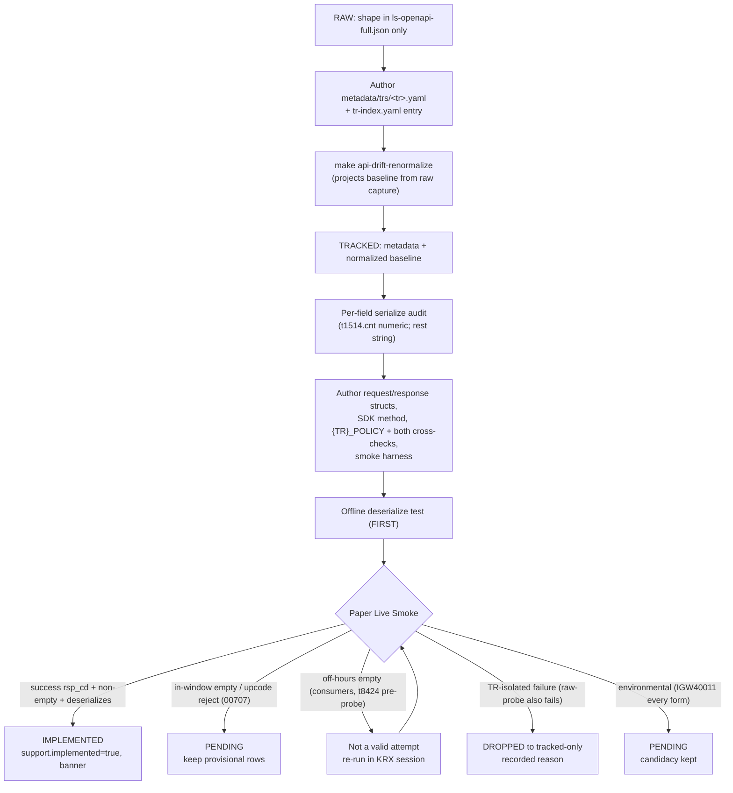

# feat: Sector Cluster Raw→Implemented Wave (Wave A)

## Summary

Bring the five-TR 업종/sector cluster (`t8424` + `t1511`/`t1514`/`t1516`/`t1485`) from **raw**
(no metadata, no baseline) through **Tracked** (authored metadata + pinned baseline) to
**Implemented** (callable Rust gated on a Paper Live Smoke) in one PR. The Tracked rung is a
mechanical re-normalization of the already-committed raw OpenAPI capture, not hand-authored JSON;
the wave also freezes that loop as a reusable `track-tr` skill for the remaining ~75 candidates.
Implemented-only — no Recommended tier, no Focused Evidence.

---

## Problem Frame

Every prior wave operated on **Tracked → Implemented**: members already had `metadata/trs/<tr>.yaml`
and a normalized baseline, so the `implement-tr` recipe derived structs from a pinned wire shape.
The sector cluster has neither — the five TRs exist only in the raw capture
(`crates/ls-trackers/baselines/api-drift/raw/ls-openapi-full.json`), `code-set.json`, and the
migration-source dependency map. There is no `track-tr` recipe in `.agents/skills/`. So this wave
inherits the **Tracked rung** as net-new prerequisite work, and getting it right once on a small
coherent cluster forges the path the rest of the ~80 candidates reuse (see origin).

Research resolved two premises the origin had to hedge:

- **The Tracked rung is mechanical.** The normalizer projects shapes only for TRs in the
  *maintained set*, which is the keys of authored metadata (`crates/ls-trackers/src/cli.rs`
  `maintained_codes`). So authoring the five `metadata/trs/*.yaml` and running
  `make api-drift-renormalize` (network-free) emits the five baselines from the committed raw
  capture. No hand-authoring, no live fetch.
- **`upcode` is the numeric-string `"001"`, not alpha.** The raw `req_example` for all four
  consumers uses `upcode: "001"` and field docs enumerate numeric sector codes (코스피@001,
  코스닥@301, KRX100@501…). The alpha `BMT/BM_/IJ_` came only from the migration-source WEAK
  heuristic (`producing_tr: null`), which is not the accepted request shape. The consumers smoke
  **standalone** with `"001"`; sourcing `upcode` from `t8424` is optional convenience. `upcode`
  stays string-serialized — a fixed-width code, never `string_as_number`.

A second pressure remains real: all five carry `session_class: dependent` / `market_hours` in the
migration source, so an off-hours smoke can return empty and read as a shape failure.

---

## Key Technical Decisions

- **Track rung = author metadata then `make api-drift-renormalize`.** The five baselines are
  *projected* from the committed raw capture, not authored. Expect the five
  `normalized/trs/*.json` plus `normalized/manifest.json` (`maintained_tr_count` +5) in the diff;
  `code-set.json` stays unchanged (already lists the full raw inventory). This three-step loop (author
  metadata → renormalize → commit baseline) is the core the `track-tr` skill freezes (origin R3).

- **`owner_class` split, `instrument_domain: sector_index`.** `t1514` is self-paginated
  (`self_continuation_fields: [cts_date]`) → `owner_class: paginated`, mirroring `t1452`/`t3341`.
  The other four → `market_session`, mirroring `t1102`/`t1101`. All five use
  `instrument_domain: sector_index` (the enum variant that exists for 업종/index TRs) and
  `venue_session: krx_regular`.

- **Per-field serialization audit precedes every smoke.** Numeric request slots serialize as JSON
  numbers via `string_as_number` to avoid `IGW40011`; string identifiers stay bare. For this
  cluster the only numeric request field is **`t1514.cnt`** (spec serializes it as `1`). `upcode`,
  `cts_date`, `shcode`, and the `gubun*` fields stay string-serialized. Confirm with
  `make raw-probe LS_PROBE_PATH=/indtp/market-data` before each live smoke.

- **`t8424` is the intended anchor; the guarantee rests on an in-window flip.** `t8424` (전체업종)
  is the static-ish all-sectors list and the intended ≥1-flip anchor, but it shares the consumers'
  `session_class: dependent` flag. A planning-gate probe settles whether it returns non-empty
  off-hours; until confirmed, the ship-floor is *any* in-window flip, not an off-hours `t8424`
  result (origin R6, R12).

- **`t8424` output is an array.** `t8424OutBlock` is an Object Array (`hname`, `upcode`) — model
  as `Vec` with `#[serde(deserialize_with = "ls_core::de_vec_or_single")]`. `t1514`/`t1516`/`t1485`
  each also carry an array `…OutBlock1`; `t1511` is a single 65-field `OutBlock`.

- **Both policy cross-check lists, every const.** Each new `{TR}_POLICY` must be registered in
  `crates/ls-core/tests/policy_index_crosscheck.rs` (import block **and** `policies[]` array) and
  in `slice_rest_policies_are_non_order_rest` in `crates/ls-core/src/endpoint_policy.rs`. Neither
  auto-discovers it; an unregistered const is silently skipped. `t1514` needs
  `has_pagination: true` (its `self_paginated`), the four others `false`.

- **Implemented-only.** `support.implemented: true`, `recommended: false`, no recommendation block,
  no evidence record. The `implement-tr` recipe core is unmodified.

---

## High-Level Technical Design

Per-member pipeline and the block-and-drop end states (origin R12). Each member runs the same
raw→Tracked→Implemented path; the verdict differs by smoke outcome.

Anchor rule: the wave ships if ≥1 member reaches IMPLEMENTED via an in-window smoke; zero flips →
re-scope, not an empty PR.

---

## Requirements Trace

Origin requirements (`see origin` for full text) map to units as follows:

| Origin | Intent | Unit(s) |
|---|---|---|
| R1 | Single PR, exactly the five sector TRs, capability-bounded | All; close-out U9 |
| R2 | Each member raw→Implemented; wire-shape completeness gate before list locks | U1, U2, U4–U8 |
| R3 | Reusable track-then-implement path as first-class deliverable | U3 |
| R4 | Callable Rust per member; numeric-field `string_as_number` / `string_or_number` | U1, U4–U8 |
| R5 | Implemented gate (constructs, success rsp_cd, non-empty, deserializes) | U4–U8 |
| R6 | `t8424` anchor; window-independence settled by probe | U1, U4 |
| R7 | Four consumers smoke in-session; `t1516` needs `shcode` too | U1, U5–U8 |
| R8 | `t1514` self-paginated path | U8 |
| R9 | Implemented-only bookkeeping + banner | U4–U8 |
| R10 | Per-member disposition + `venue_session` rows in ledger | U9 |
| R11 | Docgen count + banner update; Recommended/tracked counts untouched | U9 |
| R12 | Block-and-drop; ships only on ≥1 in-window flip | U4–U8, U9 |

---

## Implementation Units

Grouped in four phases: **Gate** (U1), **Track rung** (U2–U3), **Implement** (U4–U8),
**Close-out** (U9).

### U1. Resolve-before-planning probes and per-field serialization audit

- **Goal:** Settle the three empirical premises before any struct work: does `t8424` return
  non-empty off-hours (anchor window-independence), is the raw-spec `upcode` value `"001"`
  accepted by a consumer (confirm, with a fallback if it rejects), and which request fields are
  genuinely numeric. Record results to drive U4–U8.
- **Requirements:** R2 (completeness), R4 (serialization), R6 (anchor), R7 (consumer input).
- **Dependencies:** none.
- **Files:** none authored — this is a live-probe gate. Findings recorded in the U9 ledger section
  and carried into U4–U8 approach notes. Probes run via `make raw-probe` and ad-hoc paper calls.
- **Approach:** Use `make raw-probe LS_PROBE_TR_CD=<tr> LS_PROBE_PATH=/indtp/market-data
  LS_PROBE_BODY=…` (credential-safe; prints only `http`/`rsp_cd`/`body_len`). (a) Probe `t8424`
  off-hours: non-empty → it anchors window-free; empty → it falls to the in-session bar. (b) Probe
  one consumer (e.g. `t1511`) with `{"t1511InBlock":{"upcode":"001"}}` → confirm `"001"` (the raw
  `req_example` value, which **supersedes** the origin's alpha-form hedge `BMT/BM_/IJ_` — that came
  only from the migration-source WEAK heuristic) is accepted and non-empty in-window. If `"001"`
  unexpectedly rejects, fall back to the field-doc codes (코스닥=301, KRX100=501) and the alpha
  sample before recording any "upcode rejected" verdict or locking the U5–U8 smoke bodies.
  (c) A/B `t1514`'s `cnt` as string vs number to confirm the `IGW40011` boundary. Verify each member's raw shape (request + response blocks) is complete
  enough to pin a baseline; research confirms all five are complete, but re-check before the list
  locks — an incomplete member is held/dropped pre-PR. Record the KRX session clock at every smoke
  run so an empty `00707` (a *success* rsp_cd that deserializes — only the non-empty arm fails) is
  dispositioned mechanically: off-hours → re-run, in-window → pending. Don't leave the off-hours
  vs in-window branch a judgment call.
- **Patterns to follow:** `docs/solutions/integration-issues/ls-gateway-igw40011-numeric-request-fields.md`
  (raw-probe A/B method); `Makefile` `raw-probe` target.
- **Test scenarios:** Test expectation: none — this is a diagnostic gate; its outputs are recorded
  probe results, not committed code. Findings feed the offline + smoke tests in U4–U8.
- **Verification:** Three probe results recorded: t8424 off-hours emptiness verdict, consumer
  `upcode:"001"` acceptance, and the `cnt` numeric-serialization confirmation. Five members
  confirmed shape-complete or explicitly held.

### U2. Track rung — author metadata and project baselines for all five

- **Goal:** Bring all five TRs to Tracked: author `metadata/trs/<tr>.yaml` + `tr-index.yaml`
  entries, then project the normalized baselines from the committed raw capture.
- **Requirements:** R2.
- **Dependencies:** U1 (shape-complete confirmation).
- **Files:**
  - Create `metadata/trs/t8424.yaml`, `metadata/trs/t1511.yaml`, `metadata/trs/t1514.yaml`,
    `metadata/trs/t1516.yaml`, `metadata/trs/t1485.yaml`
  - Modify `metadata/tr-index.yaml` (add five routing entries under `trs:`)
  - Generated (commit the output, do not hand-edit): `crates/ls-trackers/baselines/api-drift/normalized/trs/{t8424,t1511,t1514,t1516,t1485}.json`,
    `crates/ls-trackers/baselines/api-drift/normalized/manifest.json`. Note: `code-set.json`
    already enumerates the full raw inventory (these five codes are present today), so it stays
    byte-identical — do **not** expect a `code-set.json` change.
- **Approach:** Author each metadata yaml per the schema (`crates/ls-metadata/src/schema.rs` enums,
  all `snake_case`): `owner_class: market_session` for the four, `paginated` for `t1514`;
  `instrument_domain: sector_index`; `venue_session: krx_regular`; `self_paginated: true` +
  `self_continuation_fields: [cts_date]` for `t1514`, `false`/`[]` for the rest;
  `caller_supplied_identifiers: [upcode]` for the consumers (`[upcode, shcode]` for `t1516`, `[]`
  for `t8424`); `support: {tracked: true, implemented: false, recommended: false}`;
  `maintenance.source_spec_hash` from the renormalize output (expected `238beb842b1a`, the
  migration-source `spec_hash`). Add the five `tr-index.yaml` routing duplicates (file,
  owner_class, protocol, instrument_domain, venue_session — validator cross-checks these). Then run
  `make api-drift-renormalize` to emit the five baselines (the normalizer projects only
  maintained-set TRs, which are now these). Commit the five generated baselines + `manifest.json`
  (`maintained_tr_count` +5); `code-set.json` is unchanged (it already enumerates the full raw
  inventory). **Drift guard:** `renormalize` re-projects *every* maintained TR's shape from the
  current raw capture — `git diff --stat crates/ls-trackers/baselines/api-drift/normalized/trs/`
  and confirm **only the five new files** changed. Any modified pre-existing baseline means the
  raw capture drifted since it was pinned; diagnose it (per the wrong-endpoint learning) before
  committing — do not smuggle unrelated shape changes into this PR.
- **Patterns to follow:** `metadata/trs/t1452.yaml` (paginated read, closest analog for `t1514`),
  `metadata/trs/t1101.yaml` (market_session read with a caller identifier);
  `crates/ls-trackers/src/cli.rs` `maintained_codes` / `write_normalized`; `Makefile`
  `api-drift-renormalize`.
- **Test scenarios:**
  - `cargo test -p ls-core` passes — metadata validation accepts all five (enum values legal,
    tr-index routing fields match per-TR yaml).
  - **Clean self-diff:** re-projecting raw and comparing to the committed baseline yields zero
    findings for the five new TRs (per `docs/solutions/architecture-patterns/change-tracker-baseline-clean-self-diff.md`).
  - `t1514` baseline carries `cts_date` in `request_blocks` and an `Object Array` `t1514OutBlock1`.
- **Verification:** Five TRs present in `metadata/trs/`, registered in `tr-index.yaml`, with
  committed baselines; `make docs-check` and `cargo test -p ls-core` green; `manifest.json`
  `maintained_tr_count` increased by five.

### U3. Freeze the track-then-implement path as a `track-tr` skill

- **Goal:** Capture the raw→Tracked loop (U2) as a reusable, frozen recipe so the remaining ~75
  candidates inherit it (origin R3, first-class deliverable).
- **Requirements:** R3.
- **Dependencies:** U2 (the loop must be proven on the five before it is frozen).
- **Files:** Create `.agents/skills/track-tr/SKILL.md` (and `references/` if needed); modify
  `AGENTS.md` (list `track-tr` alongside `implement-tr` in the skills inventory).
- **Approach:** Document the three-step loop as a state-driven recipe mirroring
  `.agents/skills/implement-tr/SKILL.md`'s shape: (1) author `metadata/trs/<tr>.yaml` from the raw
  capture's field set (map `endpoint_path`→`policy.path`, `source_group_name`→`policy.group`,
  Object-Array blocks → `Vec`); (2) `make api-drift-renormalize`; (3) verify clean self-diff and
  commit the projected baseline + `code-set.json` + `manifest.json`. State the precondition (TR
  present in the raw capture with complete request + response blocks) and the output states
  (TRACKED / HELD-incomplete-shape). Per R1, if this skill dir is the deliverable, it ships inside
  Wave A's single PR as an explicitly-flagged non-TR deliverable.
- **Patterns to follow:** `.agents/skills/implement-tr/SKILL.md` (recipe structure, step/state
  shape); `.agents/skills/implement-tr/references/author-patterns.md` (baseline→struct mapping).
- **Test scenarios:** Test expectation: none — documentation/recipe artifact, no behavioral code.
  Its correctness is demonstrated by U2 having executed the same loop.
- **Verification:** `.agents/skills/track-tr/SKILL.md` exists, describes the author→renormalize→
  commit loop end to end, and is referenced from `AGENTS.md`.

### U4. Implement `t8424` (anchor, market_session, array output)

- **Goal:** Callable `t8424` (전체업종) — the anchor and `upcode` source; flip Implemented on a
  non-empty 업종 list.
- **Requirements:** R4, R5, R6, R9, R12.
- **Dependencies:** U2 (baseline), U1 (probe verdicts).
- **Files:** Modify `crates/ls-sdk/src/market_session/mod.rs` (request/response structs + facade
  method), `crates/ls-core/src/endpoint_policy.rs` (`T8424_POLICY` + cross-check list),
  `crates/ls-core/tests/policy_index_crosscheck.rs` (import + `policies[]`),
  `crates/ls-sdk/tests/live_smoke.rs` (`live_smoke_t8424`), `Makefile` (`live-smoke-t8424`),
  `.agents/skills/promote-tr/references/smoke-map.md` (row, `implemented-only`). Add an offline
  deserialize test in the `market_session` test module.
- **Approach:** `T8424InBlock { gubun1 }` (bare String), request wrapper renamed `t8424InBlock`,
  `::new()`. Response: `t8424OutBlock` as `Vec<T8424OutBlockRow>` via `de_vec_or_single`, rows
  `{ hname, upcode }` (both String — `upcode` stays string). Envelope `{ rsp_cd, rsp_msg, outblock }`.
  Facade `sectors()` (or similar) on the `MarketSession` handle calling
  `inner.post(&T8424_POLICY, req)`. `T8424_POLICY`: path `/indtp/market-data`, group `[업종] 시세`,
  `has_pagination: false`, `rate_limit_per_sec: 1`, `corp_rate_limit_per_sec: 3`. Register the
  const in **both** cross-check lists.
- **Patterns to follow:** `crates/ls-sdk/src/market_session/mod.rs` `t1102` (struct + facade);
  `de_vec_or_single` usage in `crates/ls-sdk/src/paginated/rank_screen.rs` `t1452OutBlock1`.
- **Test scenarios:**
  - **Offline (FIRST):** a captured `t8424` success body deserializes into the envelope; the
    `outblock` `Vec` has ≥1 row with non-empty `hname` and a `"001"`-style `upcode`.
  - Single-object form (one sector) also deserializes via `de_vec_or_single` (not only arrays).
  - **Covers R6, R12.** Paper Live Smoke (`make live-smoke-t8424`): success `rsp_cd`, non-empty
    list, deserializes → flips Implemented and anchors the wave. Off-hours behavior per the U1
    probe (window-free if confirmed; else in-window).
- **Verification:** `cargo test` deserialize test green; a paper smoke returns a non-empty sector
  list that deserializes; `support.implemented: true` on `t8424`.

### U5. Implement `t1511` (업종현재가, market_session, single OutBlock)

- **Goal:** Callable `t1511` index snapshot; smoke standalone with `upcode: "001"`.
- **Requirements:** R4, R5, R7, R9, R12.
- **Dependencies:** U2; U1.
- **Files:** Modify `crates/ls-sdk/src/market_session/mod.rs`, `crates/ls-core/src/endpoint_policy.rs`
  (`T1511_POLICY` + cross-check), `crates/ls-core/tests/policy_index_crosscheck.rs`,
  `crates/ls-sdk/tests/live_smoke.rs`, `Makefile`, `.agents/skills/promote-tr/references/smoke-map.md`;
  offline test in the market_session module.
- **Approach:** `T1511InBlock { upcode }` (bare String). Response: single `t1511OutBlock` (~65
  numeric fields, each `#[serde(deserialize_with = "ls_core::string_or_number")]`, struct
  `#[serde(default)]`). Envelope single object (no `de_vec_or_single`). Facade
  `sector_quote()`-style. `T1511_POLICY`: `has_pagination: false`, rate `10/5`. Both cross-check
  lists.
- **Patterns to follow:** `crates/ls-sdk/src/market_session/mod.rs` `t1102` response (single
  OutBlock, `string_or_number` on numerics).
- **Test scenarios:**
  - **Offline (FIRST):** captured success body deserializes; numeric fields tolerate both string
    and number wire forms (`string_or_number`).
  - **Covers R7.** Paper smoke in KRX session with `upcode:"001"`: non-empty → Implemented. An
    off-hours empty is not a valid attempt → re-run in-window (U9 records if still empty → pending).
- **Verification:** deserialize test green; in-window paper smoke non-empty + deserializes;
  `implemented: true` or recorded pending with reason.

### U6. Implement `t1485` (예상지수, market_session, OutBlock + array)

- **Goal:** Callable `t1485` expected-index read; smoke with `upcode:"001"`, `gubun`.
- **Requirements:** R4, R5, R7, R9, R12.
- **Dependencies:** U2; U1.
- **Files:** Same file set as U5 with `T1485_POLICY` / `live_smoke_t1485` / `live-smoke-t1485`.
- **Approach:** `T1485InBlock { upcode, gubun }` (bare Strings). Response: summary `t1485OutBlock` +
  array `t1485OutBlock1` (`Vec` via `de_vec_or_single`), numerics `string_or_number`.
  `T1485_POLICY`: `has_pagination: false`, rate `1/3`. Both cross-check lists. Note this is an
  expected/auction screen — higher chance of off-hours emptiness; lean on the in-window bar.
- **Patterns to follow:** `t1102` (summary block) + `t1452OutBlock1` (array via `de_vec_or_single`).
- **Test scenarios:**
  - **Offline (FIRST):** captured body deserializes; `OutBlock1` array (and single-object form)
    both deserialize.
  - **Covers R7.** In-window paper smoke with `upcode:"001"`, `gubun` → non-empty → Implemented;
    in-window empty → pending with reason (U9).
- **Verification:** deserialize test green; in-window smoke result recorded (implemented or pending).

### U7. Implement `t1516` (업종별종목시세, market_session, two inputs, OutBlock + array)

- **Goal:** Callable `t1516` per-sector stock board; smoke needs `upcode` **and** `shcode`.
- **Requirements:** R4, R5, R7, R9, R12.
- **Dependencies:** U2; U1.
- **Files:** Same file set as U5 with `T1516_POLICY` / `live_smoke_t1516` / `live-smoke-t1516`.
- **Approach:** `T1516InBlock { upcode, gubun, shcode }` — all three bare Strings (`shcode` is a
  6-char ticker, string). Response: summary `t1516OutBlock` + array `t1516OutBlock1` (per-stock
  rows, `de_vec_or_single`), numerics `string_or_number`. `T1516_POLICY`: `has_pagination: false`,
  rate `1/3`. Both cross-check lists. Smoke supplies `upcode:"001"` + a representative liquid
  `shcode` (e.g. `005930`) for a non-empty board (the raw `req_example` leaves `shcode` empty, but
  `requireYn: Y` and a non-empty board needs a real ticker).
- **Patterns to follow:** `t1102` request with multiple in-block fields; array OutBlock via
  `de_vec_or_single`.
- **Test scenarios:**
  - **Offline (FIRST):** captured body deserializes; per-stock `OutBlock1` rows deserialize.
  - **Covers R7.** In-window paper smoke with `upcode:"001"` + representative `shcode` → non-empty →
    Implemented; missing/empty `shcode` or in-window empty → pending with reason.
- **Verification:** deserialize test green; in-window smoke with both inputs non-empty +
  deserializes, or recorded pending.

### U8. Implement `t1514` (업종기간별추이, paginated, `cnt` numeric, `cts_date` cursor)

- **Goal:** Callable self-paginated `t1514` period-trend read; single-page smoke.
- **Requirements:** R4, R5, R7, R8, R9, R12.
- **Dependencies:** U2; U1 (the `cnt` numeric verdict).
- **Files:** Modify `crates/ls-sdk/src/paginated/rank_screen.rs` (or a sibling `paginated`
  module), `crates/ls-sdk/src/paginated/mod.rs` (facade), `crates/ls-core/src/endpoint_policy.rs`
  (`T1514_POLICY`, `has_pagination: true`, + cross-check), `crates/ls-core/tests/policy_index_crosscheck.rs`,
  `crates/ls-sdk/tests/live_smoke.rs`, `Makefile`, `.agents/skills/promote-tr/references/smoke-map.md`;
  offline test in the paginated module.
- **Approach:** `T1514InBlock { upcode, gubun1, gubun2, cts_date, cnt, rate_gbn }`. Strings:
  `upcode`, `gubun1`, `gubun2`, `cts_date` (the continuation cursor, default `""`/first-page),
  `rate_gbn`. **`cnt` is numeric** → `#[serde(serialize_with = "ls_core::string_as_number")]`
  (per U1 probe). Request wrapper with `impl_has_pagination!`, header cursors `#[serde(skip)]`,
  cursor rides the body (`cts_date`). Response: `t1514OutBlock { cts_date }` + array
  `t1514OutBlock1` (26 fields, `de_vec_or_single`, numerics `string_or_number`). Facade on the
  `Paginated` handle calling `inner.post_paginated(&T1514_POLICY, req)`. `T1514_POLICY`:
  `has_pagination: true`, rate `1/1`. Both cross-check lists — and `has_pagination: true` must
  mirror `self_paginated: true` or `policy_index_crosscheck` fails.
- **Patterns to follow:** `crates/ls-sdk/src/paginated/rank_screen.rs` `t1452`/`t3341`
  (`impl_has_pagination!`, body cursor, `string_as_number` on the numeric field,
  `de_vec_or_single` rows); `docs/solutions/architecture-patterns/ls-sdk-pagination-modeling.md`.
- **Test scenarios:**
  - **Offline (FIRST):** captured first-page body deserializes; `OutBlock1` rows deserialize;
    serialized request emits `cnt` as a JSON **number** and `cts_date` as a **string**
    (`assert!(v[...]["cnt"].is_number())`, `assert!(v[...]["cts_date"].is_string())`).
  - **Covers R8.** Single-page paper smoke (`cts_date` first-page): non-empty first page success →
    Implemented under the paginated path.
  - `IGW40011` guard: a string-serialized `cnt` is the failing form the probe (U1) ruled out.
  - **Registration guard:** assert `T1514_POLICY` is present in the `policies[]` array in
    `policy_index_crosscheck.rs` (e.g. a `policies.len()` bump or a membership check). The
    `self_paginated ⟹ has_pagination` mirror only fires for consts *in* that array, so a missed
    registration would let `t1514` ship `has_pagination: false` (single-page dispatch on a
    paginated TR) with the whole gate green — the registration must fail a test, not be silently
    skipped.
- **Verification:** deserialize + serialization-shape tests green; single-page paper smoke
  non-empty + deserializes; `has_pagination`/`self_paginated` consistent in cross-check.

### U9. Wave close-out — ledger, docgen, gate, PR

- **Goal:** Record every member's end state, update the count-bearing docgen test, and ship the
  single PR with a green gate.
- **Requirements:** R1, R10, R11, R12.
- **Dependencies:** U4–U8.
- **Files:** Modify `metadata/PROVISIONALITY-LEDGER.md` (new per-wave close-out section),
  `crates/ls-docgen/src/lib.rs` (`reference.len()` literal + `banner_trs` array), generated
  `docs/reference/` (via `make docs`).
- **Approach:** Add a close-out section mirroring the latest (§9 market-flow analytics): opening
  tally (`N implemented, M pending`), a per-member table (`TR | class | end state | credential-free
  disposition`), and a `venue_session disposition (R12)` paragraph — retire each flipped member's
  §1 `krx_regular` row (returned non-empty in-window), retain rows for pending/dropped members. For
  the `upcode` WEAK edges (and `t1516`'s `shcode` edge): retire on a confirming smoke, retain for
  pending members. Bump `reference.len()` from `34` to `34 + N` (N = members that flipped
  Implemented), append each flipped TR to the 27-entry `banner_trs` array, and update the count
  comment block. Recommended-tier artifacts and the tracked-TR count stay untouched. Run the full
  gate.
- **Delivery strategy:** keep the single PR (R1) reviewable by committing atomically per phase —
  one commit for the Track rung (U2, so the generated baseline diff is reviewed apart from
  hand-authored code), one for the `track-tr` skill (U3), one per implemented TR (U4–U8), and one
  for this close-out (U9). This isolates generated-baseline noise from struct-logic commits, the
  way prior waves surfaced live-path bugs only at review.
- **Patterns to follow:** `metadata/PROVISIONALITY-LEDGER.md` §9 (close-out template);
  `crates/ls-docgen/src/lib.rs` `reference_covers_implemented_with_banner_and_omits_unimplemented`.
- **Test scenarios:**
  - **Covers R11.** `cargo test -p ls-docgen` — the count test passes with the bumped
    `reference.len()` and each flipped TR in `banner_trs`; pending/dropped members are absent.
  - `make docs-check` — generated docs match committed; each flipped member has an
    "Implemented, not yet recommended" reference page.
  - Full gate green: `make docs && cargo test && cargo test -p ls-core && make docs-check`.
- **Verification:** Ledger close-out section present with every member decided; docgen count
  matches the flipped count; full gate green; one PR covering the five TRs + the `track-tr` skill.

---

## Scope Boundaries

**Deferred for later (roadmapped cluster-waves, from origin)**

- The remaining domestic read-only clusters — stock quote/time-series, ETF, remaining ELW
  (t195x/t196x/t197x), investor/program/foreign flows — ship as their own capability-closed waves,
  not here.

**Outside this wave's identity (from origin)**

- Recommended tier, Focused Evidence, and any `metadata/EVIDENCE-FRESHNESS.md` edit — Implemented-only.
- A coverage-driven justification for the campaign — excluded by decision; would require a separate ADR.
- Account, order, realtime/WebSocket, futures/options, overseas, and side-effectful TRs — out of the
  entire ~80 read-only campaign.

**Deferred to Follow-Up Work (plan-local)**

- A `docs/solutions/` learning capturing the off-hours-empty → pending classification for
  market-hours-dependent reads (no such doc exists; both research agents flagged the gap). Capture
  after the wave via `/ce-compound`.
- Modeling `t8424 → consumers` as an explicit producer→consumer discovery edge (origin Outstanding
  Question). Default this wave: consumers smoke standalone with `upcode:"001"`; the edge is optional
  convenience, not required.

---

## Risks & Dependencies

- **Off-hours emptiness zeroes the wave.** All five are `session_class: dependent`. If the U1 probe
  shows `t8424` empty off-hours and no in-window window is available, the wave can reach zero flips
  and re-scope (R12). Mitigation: schedule the smoke pass during the KRX regular session; `t8424`
  (static-ish list) is the most likely window-free flip.
- **`api-drift-renormalize` rewrites shared files.** It also touches `code-set.json` and
  `manifest.json`; review the diff so unrelated drift is not committed. The clean-self-diff
  invariant must hold for the five new TRs.
- **`source_spec_hash` mismatch.** If the raw capture's hash differs from the migration-source
  `238beb842b1a`, take the value the renormalize output writes; do not hardcode.
- **Wrong-endpoint masking.** Per `docs/solutions/integration-issues/fault-tolerant-fallback-masked-wrong-endpoint-bug.md`,
  a chronic 500 or a stuck "fallback served" during baseline work is a wrong-URL/parser bug signal
  in `fetch.rs`, not an outage — diagnose with `make raw-probe`, don't assume environmental.
- **Do not `cargo fmt` the whole `ls-trackers` crate** (AGENTS.md) — `main` is intentionally
  unformatted there; a blanket format produces a huge spurious diff.

---

## Open Questions (deferred to implementation)

- Exact facade method names per TR (`sectors()`, `sector_quote()`, etc.) — settle against existing
  `MarketSession` / `Paginated` naming when authoring.
- Whether `t1514` lands in `paginated/rank_screen.rs` or a new `paginated/sector.rs` sibling —
  decide by file size/cohesion at author time.
- The representative `shcode` for `t1516`'s smoke — pick a liquid KOSPI ticker in-window (e.g.
  `005930`); confirm it yields a non-empty board.

---

## Sources & Research

- Origin requirements: `docs/brainstorms/2026-06-23-sector-cluster-raw-to-implemented-wave-requirements.md`.
- Grounding dossier (verified `file:line` quotes): `/tmp/compound-engineering/ce-brainstorm/tr-wave-80/grounding.md`.
- Recipe + cross-check lists: `.agents/skills/implement-tr/SKILL.md`,
  `.agents/skills/implement-tr/references/author-patterns.md`,
  `crates/ls-core/tests/policy_index_crosscheck.rs`, `crates/ls-core/src/endpoint_policy.rs`.
- Struct exemplars: `crates/ls-sdk/src/market_session/mod.rs` (`t1101`/`t1102`),
  `crates/ls-sdk/src/paginated/rank_screen.rs` (`t1452`/`t3341`).
- Track-rung mechanism: `crates/ls-trackers/src/cli.rs` (`maintained_codes`, `write_normalized`),
  `crates/ls-trackers/src/api_drift.rs` (`normalize_run`), `Makefile` `api-drift-renormalize`.
- Metadata schema + exemplars: `crates/ls-metadata/src/schema.rs`, `metadata/trs/t1452.yaml`,
  `metadata/trs/t1101.yaml`, `metadata/tr-index.yaml`.
- Docgen count test: `crates/ls-docgen/src/lib.rs` (`reference.len() == 34`, 27-entry `banner_trs`).
- Ledger + smoke registry: `metadata/PROVISIONALITY-LEDGER.md` (§9 close-out template),
  `.agents/skills/promote-tr/references/smoke-map.md`.
- Learnings: `docs/solutions/integration-issues/ls-gateway-igw40011-numeric-request-fields.md`
  (numeric-request serialization, raw-probe), `docs/solutions/architecture-patterns/ls-sdk-pagination-modeling.md`,
  `docs/solutions/architecture-patterns/change-tracker-baseline-clean-self-diff.md`,
  `docs/solutions/integration-issues/fault-tolerant-fallback-masked-wrong-endpoint-bug.md`.
- Raw wire shapes (all five complete, request + response): `crates/ls-trackers/baselines/api-drift/raw/ls-openapi-full.json`.
