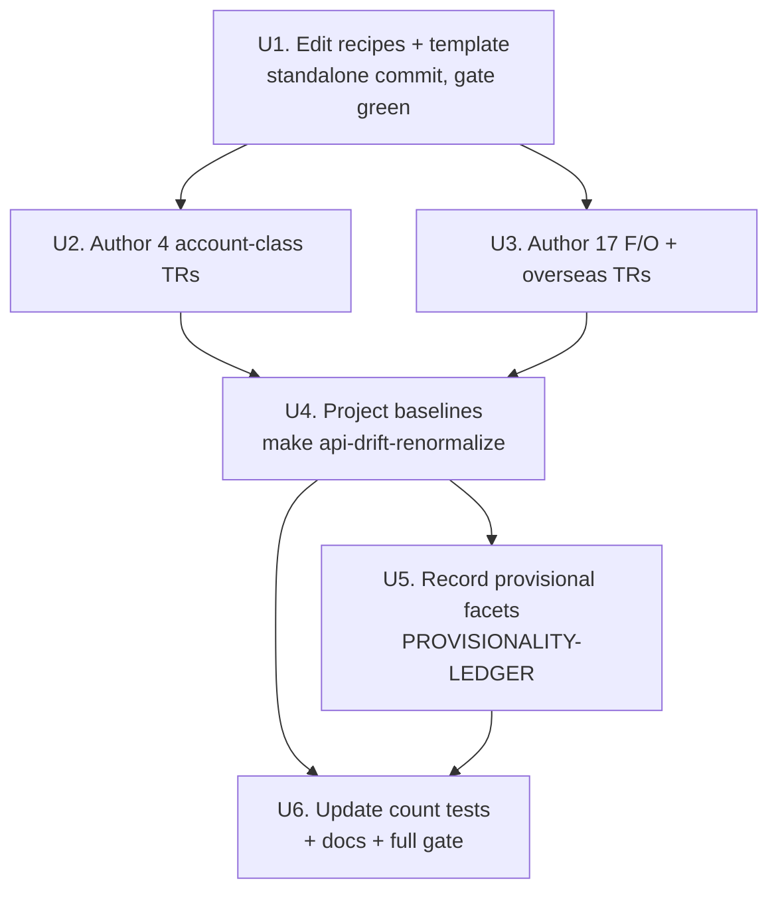

# feat: Wave 0 — recipe edits + bulk-track 21 read-only TRs to Tracked

## Summary

Bring 21 currently-Raw read-only LS TRs to the **Tracked** rung in one bulk wave,
preceded by editing two frozen recipes to admit read-only account-state reads.
The wave authors `metadata/trs/<tr>.yaml` + `tr-index.yaml` entries for all 21,
projects their normalized baselines, records unconfirmed facets in the
Provisionality Ledger, and updates the tracked-tier count tests. No callable Rust;
nothing flips Implemented.

## Problem Frame

All 21 TRs exist only in the raw OpenAPI capture — no committed metadata, no
normalized baseline — so they are not observed for drift and the implement
recipes cannot derive structs for them. The brainstorm chose to track the whole
cohort first as the cheap uncertainty reducer, so the later per-domain implement
waves work from reviewed shapes (see origin: `docs/brainstorms/2026-06-23-readonly-tr-raw-to-implemented-sequence-requirements.md`).
Four of the 21 are read-only account-state reads, which the frozen `track-tr` /
`implement-tr` recipes currently scope out as a single coarse safety boundary;
that boundary must be narrowed to read-only-account-in / side-effectful-out before
the account TRs can be authored.

## Requirements

**Recipe edits (precondition)**

- R1. The `track-tr` and `implement-tr` recipes admit read-only account-state REST
  TRs; order, side-effectful, registration, and realtime/WebSocket TRs stay
  `HELD — out of scope`. The edited gate states the read-only test explicitly: a
  request block with no order number, no registration field, and no mutation field
  is read-only and eligible. `implement-tr` additionally gains an `account`
  owner_class branch and an account smoke-pattern stub so it is action-complete for
  the Wave 1 account implement work (origin R9).
- R2. The `track-tr` authoring template gains an `account` owner_class branch and
  sets `account_state: true` / `rate_bucket: account` for account TRs, citing
  `metadata/trs/CSPAQ12200.yaml` as the exemplar (origin R9).
- R3. The recipe edits ship in a standalone commit with `cargo test -p ls-core`
  green before any TR is authored (origin R9).

**Tracking the 21 TRs**

- R4. All 21 TRs reach Tracked: a committed `metadata/trs/<tr>.yaml`, a
  `tr-index.yaml` routing entry, and a projected `normalized/trs/<tr>.json`
  baseline, with `support: {tracked: true, implemented: false, recommended: false}`
  and no `recommendation` block (origin R3).
- R5. No callable Rust is authored and no TR flips Implemented in this wave
  (origin R2, R3).
- R6. The four account TRs (CSPAQ12300, CSPAQ22200, CCENQ90200, CFOBQ10500) carry
  account-class metadata mirroring `CSPAQ12200.yaml`; the other 17 route through
  `market_session` or `paginated` per their wire shape (origin R8, TR Inventory).
- R7. Unconfirmed facets — CCENQ90200's night-session `venue_session` and the
  overseas o31xx/g31xx caller-supplied identifiers — are authored best-effort and
  recorded as provisional rows in `metadata/PROVISIONALITY-LEDGER.md` rather than
  held back (origin Dependencies/Assumptions).

**Baselines, counts, and gate**

- R8. Normalized baselines are projected via `make api-drift-renormalize` (never
  hand-authored); the full maintained inventory self-diffs clean afterward, and the
  21 added shapes pass through the full promote path, not `--type-only` (origin R3).
- R9. Tracked-tier count assertions are updated to 70: `TRACKED_TRS` array + length,
  `api_drift.rs` `maintained_tr_count`, the `api_drift.rs` `checked` lower bound
  (`>= 44` → `>= 70`, matching the new maintained count), and the four `cli.rs`
  shape-count literals. Implemented-tier counts (`banner_trs`,
  `reference.len()`) stay untouched, and the manifest `refreshed` date stays at the
  last raw-refresh date (origin R10).
- R10. The full gate is green before merge: `make docs`, `cargo test` (workspace),
  `cargo test -p ls-core`, `make docs-check` (origin R10, `AGENTS.md`).

## Key Technical Decisions

- **Recipe edits are a separate precondition unit, committed before any TR
  authoring.** This keeps R3's sequencing gate honest — a 21-TR authoring PR can't
  silently depend on unreviewed recipe changes.
- **Account owner_class needs no schema or validator change.** `OwnerClass::Account`
  and `RateBucket::Account` already exist in `crates/ls-metadata/src/schema.rs`, and
  the validator enforces only routing consistency and recommendation rules — it does
  not gate on read-vs-side-effect. The read-only/side-effectful boundary lives
  entirely in the recipe (SKILL.md) gate, so account TRs validate cleanly at the
  Tracked rung.
- **Mirror the bulk-tracked-only wave (commit `2d7e569`), not the sector single-PR
  fused wave.** Wave 0 is tracked-only by design; `2d7e569` is the direct precedent
  for the metadata + baseline + count-test shape.
- **Baselines are projected, never hand-authored.** `make api-drift-renormalize`
  emits the normalized shapes; the maintained set auto-discovers from authored
  metadata (`maintained_codes` reads `metadata/trs/`), so no production-code edit is
  needed beyond the count-test literals.
- **Author facet values from the baseline `korean_name`, not English identifiers.**
  Account-state reads with several similar balance/quantity fields are exactly the
  trap where an English-name read mismodels a field; record any unconfirmed value as
  provisional rather than guessing.

## High-Level Technical Design

The wave is a gated sequence: recipe edits land and gate first, then metadata
authoring, then mechanical baseline projection and count-test updates.

**Count-test impact map** (current maintained inventory 49 → 70):

| Assertion | File | Move? |
|-----------|------|-------|
| `TRACKED_TRS` array + `[&str; N]` length | `crates/ls-docgen/src/lib.rs` | Yes — add 21 codes, 49→70 |
| dependency page count (`TRACKED_TRS.len() + 1`) | `crates/ls-docgen/src/lib.rs` | No — derived, auto-follows |
| `maintained_tr_count` | `crates/ls-trackers/tests/api_drift.rs` | Yes — 49→70 |
| `checked >= N` lower bound | `crates/ls-trackers/tests/api_drift.rs` | Yes — bump to keep meaningful |
| four `run.shapes.len()` / `maintained_shapes` / `committed.shapes.len()` literals | `crates/ls-trackers/src/cli.rs` | Yes — 49→70 (+ message string) |
| `banner_trs` array | `crates/ls-docgen/src/lib.rs` | No — implemented-tier, nothing flips |
| `reference.len()` | `crates/ls-docgen/src/lib.rs` | No — implemented-tier, nothing flips |
| manifest `refreshed` date | `normalized/manifest.json` | Revert — renormalize stamps today; restore to the pinned raw-refresh date |
| `refreshed` round-trip pin (`== "2026-06-22"`) | `crates/ls-trackers/tests/api_drift.rs` | No — kept green by reverting the stamped date above |

## Implementation Units

### U1. Edit the frozen recipes and authoring template

- **Goal:** Narrow the account-out-of-scope gate in both recipes to read-only
  account-state-in, teach the `track-tr` template to author account-class metadata,
  and add the account authoring skeleton + smoke pattern to `implement-tr`. Lands as
  a standalone commit, gated, before any TR authoring.
- **Requirements:** R1, R2, R3.
- **Dependencies:** none.
- **Files:** `.agents/skills/track-tr/SKILL.md`, `.agents/skills/implement-tr/SKILL.md`.
- **Approach:** In `track-tr/SKILL.md`, edit the out-of-scope precondition (the
  "order/account/realtime/WebSocket → HELD" line) so read-only account-state REST is
  eligible and only order/registration/mutation/realtime/WebSocket stay HELD, with
  the explicit read-only test (no order number, no registration field, no mutation
  field). Add an `account` branch to the owner_class decision rule, and make the
  metadata-field defaults conditional so account TRs get `account_state: true`,
  `rate_bucket: account`, `venue_session: unspecified`, citing `CSPAQ12200.yaml`.
  In `implement-tr/SKILL.md`, apply the parallel narrowing to the out-of-scope
  precondition, then add an `account` branch to the route-by-owner_class section
  (mirroring the `market_session` skeleton) and an account smoke-pattern stub citing
  `metadata/trs/CSPAQ12200.yaml` and the existing `live_smoke_account` pattern, so
  the recipe is action-complete for the Wave 1 account implement work without a
  further edit. Do not modify the recipes' baseline-projection or self-diff steps.
- **Patterns to follow:** the existing exemplar references in the recipe (market /
  paginated) for tone; `metadata/trs/CSPAQ12200.yaml` as the new account exemplar.
- **Test scenarios:** `Test expectation: none -- recipe docs carry no executable
  assertions.` Verification is that the edited gate text is internally consistent
  (read-only account in, side-effectful out) and `cargo test -p ls-core` stays green.
- **Verification:** `cargo test -p ls-core` green; the two edited gates name the
  read-only test; committed as its own commit before U2/U3 begin.

### U2. Author the four account-class TRs

- **Goal:** Bring CSPAQ12300, CSPAQ22200, CCENQ90200, CFOBQ10500 to Tracked with
  account-class metadata.
- **Requirements:** R4, R5, R6.
- **Dependencies:** U1.
- **Files:** `metadata/trs/CSPAQ12300.yaml`, `metadata/trs/CSPAQ22200.yaml`,
  `metadata/trs/CCENQ90200.yaml`, `metadata/trs/CFOBQ10500.yaml`,
  `metadata/tr-index.yaml`.
- **Approach:** Mirror `metadata/trs/CSPAQ12200.yaml`: `owner_class: account`,
  `account_state: true`, `rate_bucket: account`, `venue_session: unspecified`,
  `support: {tracked: true, implemented: false, recommended: false}`, no
  `recommendation` block. Source block/field names and `caller_supplied_identifiers`
  from the raw capture's `properties` (`required=Y` req_b inputs become identifiers;
  mode/filter flags excluded), resolving canonical fields by `korean_name`. Add the
  matching five-field `tr-index.yaml` routing entry for each. For CCENQ90200, set
  `venue_session` best-effort (night-session unconfirmed — flagged in U5).
- **Patterns to follow:** `metadata/trs/CSPAQ12200.yaml` (account exemplar);
  `metadata/tr-index.yaml` account entry shape.
- **Test scenarios:**
  - `cargo test -p ls-metadata` parses all four files into `TrMetadata` and passes
    the tr-index routing cross-check.
  - Each file's `support` block has `implemented: false` / `recommended: false` and
    no `recommendation` block (Tracked rung).
  - `account_state: true` and `rate_bucket: account` present on all four.
- **Verification:** `cargo test -p ls-metadata` green with the four files committed.

### U3. Author the 17 F/O and overseas TRs

- **Goal:** Bring the 12 futures/options reads and 5 overseas reads (o3101, o3121,
  g3101, g3104, g3106) to Tracked.
- **Requirements:** R4, R5, R6.
- **Dependencies:** U1.
- **Files:** `metadata/trs/{t2301,t2522,t8401,t8426,t8433,t8435,t8467,t9943,t9944,t8455,t8460,t8463}.yaml`,
  `metadata/trs/{o3101,o3121,g3101,g3104,g3106}.yaml`, `metadata/tr-index.yaml`.
- **Approach:** Mirror `metadata/trs/t1101.yaml` (market_session) or `t1452.yaml`
  (paginated, when the raw body carries a self-continuation cursor like `idx`).
  Set `owner_class` via the recipe rule, `account_state: false`,
  `rate_bucket: market_data`, `venue_session` from the read's session, and
  `caller_supplied_identifiers` from required req_b inputs by `korean_name`. The
  night F/O reads (t8455, t8460, t8463) are market-data/investor endpoints — route
  `market_session`, not account. Overseas o31xx/g31xx identifiers (market/symbol)
  are authored best-effort (flagged in U5). Add each `tr-index.yaml` entry.
- **Patterns to follow:** `metadata/trs/t1101.yaml`, `metadata/trs/t1452.yaml`.
- **Test scenarios:**
  - `cargo test -p ls-metadata` parses all 17 and passes the routing cross-check.
  - Pagination facet obeys the one-way implication: `self_paginated: true` only when
    the baseline carries a body cursor.
  - No account-class fields leak onto these 17 (`account_state: false`).
- **Verification:** `cargo test -p ls-metadata` green with all 17 files committed.

### U4. Project normalized baselines

- **Goal:** Generate the 21 `normalized/trs/<tr>.json` baselines and bump the
  manifest, verifying a clean self-diff over the full inventory.
- **Requirements:** R4, R8.
- **Dependencies:** U2, U3.
- **Files:** `crates/ls-trackers/baselines/api-drift/normalized/trs/<tr>.json` (21,
  machine-generated), `crates/ls-trackers/baselines/api-drift/normalized/manifest.json`.
- **Approach:** Run `make api-drift-renormalize` (network-free) to project the 21
  shapes from the raw capture; the maintained set auto-discovers from the new
  metadata. Renormalize stamps today's date into `manifest.refreshed` — restore that
  field to the committed raw-refresh date (`2026-06-22`) before committing, so the
  `refreshed` round-trip pin in `api_drift.rs` stays green. Confirm
  `maintained_tr_count` advanced 49→70. Verify the added shapes route through the
  full promote path (the set-membership guard recognizes added codes), not
  `--type-only`.
- **Patterns to follow:** the bulk-tracked-only wave (commit `2d7e569`) baseline +
  manifest changes; `docs/solutions/architecture-patterns/change-tracker-baseline-clean-self-diff.md`.
- **Test scenarios:**
  - `Covers R8.` A self-diff (re-projecting committed raw against the committed
    baseline) yields zero drift findings over the whole maintained inventory.
  - Manifest `maintained_tr_count == 70`; `refreshed` unchanged.
  - No case-collision overwrite among the 21 normalized filenames.
- **Verification:** clean self-diff; manifest reflects 70 with the date pinned.

### U5. Record provisional facets in the Provisionality Ledger

- **Goal:** Record unconfirmed facet bets so nothing is silently treated as
  confirmed at the Tracked rung.
- **Requirements:** R7.
- **Dependencies:** U4.
- **Files:** `metadata/PROVISIONALITY-LEDGER.md`.
- **Approach:** Add rows for CCENQ90200 (night-session `venue_session`, unconfirmed —
  from raw capture only) and for the overseas o3101/o3121/g3101/g3104/g3106
  caller-supplied identifiers and session/gateway shape (uncharted). Each row names
  the facet, why it's provisional, and what a later implement must re-verify.
- **Patterns to follow:** the bulk-tracked-only wave's `PROVISIONALITY-LEDGER.md`
  additions (commit `2d7e569`).
- **Test scenarios:** `Test expectation: none -- ledger is a documentation sidecar.`
- **Verification:** ledger has a row for each unconfirmed facet identified in U2/U3.

### U6. Update count-coupled tests, regenerate docs, run the gate

- **Goal:** Make the tracked-tier count assertions reflect 70 and bring the full
  gate green.
- **Requirements:** R9, R10.
- **Dependencies:** U4, U5.
- **Files:** `crates/ls-docgen/src/lib.rs` (`TRACKED_TRS` array + length),
  `crates/ls-trackers/tests/api_drift.rs` (`maintained_tr_count`, `checked` bound),
  `crates/ls-trackers/src/cli.rs` (four shape-count literals + message string),
  generated `docs/tr-dependencies/` pages.
- **Approach:** Add all 21 codes to `TRACKED_TRS` and bump its length 49→70; update
  `maintained_tr_count` to 70 and the `checked` lower bound `>= 44` → `>= 70`; update
  the four `cli.rs` literals and the "forty-nine maintained shapes" message. Leave `banner_trs` and
  `reference.len()` untouched (implemented-tier). Run `make docs` to regenerate the
  dependency pages (one new page per TR, derived from `TRACKED_TRS`), then the full
  gate.
- **Patterns to follow:** the sector cluster wave's 44→49 literal bumps (the same
  `cli.rs` set); `AGENTS.md` gate sequence.
- **Test scenarios:**
  - `Covers R9.` `cargo test` (workspace) passes with all count assertions at 70.
  - `Covers R10.` `make docs-check` confirms generated docs match committed after
    `make docs`.
  - `banner_trs` / `reference.len()` assertions unchanged and still green.
- **Verification:** `make docs` → `cargo test` → `cargo test -p ls-core` →
  `make docs-check` all green; tree clean.

## Scope Boundaries

### Deferred to Follow-Up Work

- The implement waves (account → anytime F/O → night F/O → overseas-futures →
  overseas-stock) — each its own plan once Wave 0's baselines exist.
- The overseas raw-probe spike (origin R12) — a prerequisite of the overseas
  implement waves, not of tracking.

### Outside this plan

- Any callable Rust, request/response structs, or `{TR}_POLICY` registration — those
  belong to the implement rung, not tracking.
- Promotion to Recommended and any Focused Evidence.
- Side-effectful, order, registration, and realtime/WebSocket account TRs.

## Risks & Dependencies

- **Recipe-edit precision (R1/R2).** The narrowed gate is the only thing separating
  read-only account reads from side-effectful ones; imprecise wording could admit an
  order-capable account TR later. Mitigation: the explicit no-order/no-registration/
  no-mutation test in U1.
- **CCENQ90200 night-session facet unconfirmed.** Authored best-effort and laddered
  through the Provisionality Ledger (U5); confirmed when the account implement wave
  smokes it in-window.
- **Overseas gateway/session uncharted.** o31xx/g31xx facets are best-effort; the
  ledger records what the overseas implement wave must re-verify after its spike.
- **Count-test churn.** Adding 21 Tracked TRs perturbs the `cli.rs` and `api_drift.rs`
  literals (the same set the sector wave moved); the impact map above enumerates
  every assertion so none is missed.

## Open Questions

**Deferred to implementation**

- Exact `venue_session` and `self_paginated` per TR — resolved by reading each
  baseline's `properties` / `korean_name` during authoring (U2, U3).
- Whether any F/O read carries a body cursor warranting `owner_class: paginated`
  vs `market_session` — determined from the raw body shape at authoring time.

## Sources & Research

- Origin: `docs/brainstorms/2026-06-23-readonly-tr-raw-to-implemented-sequence-requirements.md`.
- Recipes: `.agents/skills/track-tr/SKILL.md` (out-of-scope gate, owner_class rule,
  template defaults, renormalize step), `.agents/skills/implement-tr/SKILL.md`
  (out-of-scope precondition).
- Metadata: `crates/ls-metadata/src/schema.rs` (`OwnerClass::Account`,
  `RateBucket::Account`), `metadata/trs/CSPAQ12200.yaml` (account exemplar),
  `metadata/trs/t1101.yaml` + `t1452.yaml` (market/paginated exemplars),
  `metadata/tr-index.yaml`.
- Count tests: `crates/ls-docgen/src/lib.rs` (`TRACKED_TRS`, `banner_trs`,
  `reference.len()`), `crates/ls-trackers/tests/api_drift.rs`,
  `crates/ls-trackers/src/cli.rs`.
- Raw capture: `crates/ls-trackers/baselines/api-drift/raw/ls-openapi-full.json`.
- Precedent: bulk-tracked-only wave (commit `2d7e569`), sector cluster Tracked rung
  (commit `f5f5e9d`).
- Learnings: `docs/solutions/architecture-patterns/change-tracker-baseline-clean-self-diff.md`,
  `docs/solutions/architecture-patterns/gate-over-diff-inherits-diff-scope-blind-spot.md`,
  `docs/solutions/conventions/sdk-struct-field-from-baseline-korean-name.md`,
  `docs/solutions/conventions/market-hours-read-empty-result-disposition.md`,
  `docs/solutions/integration-issues/ls-gateway-igw40011-numeric-request-fields.md`.
