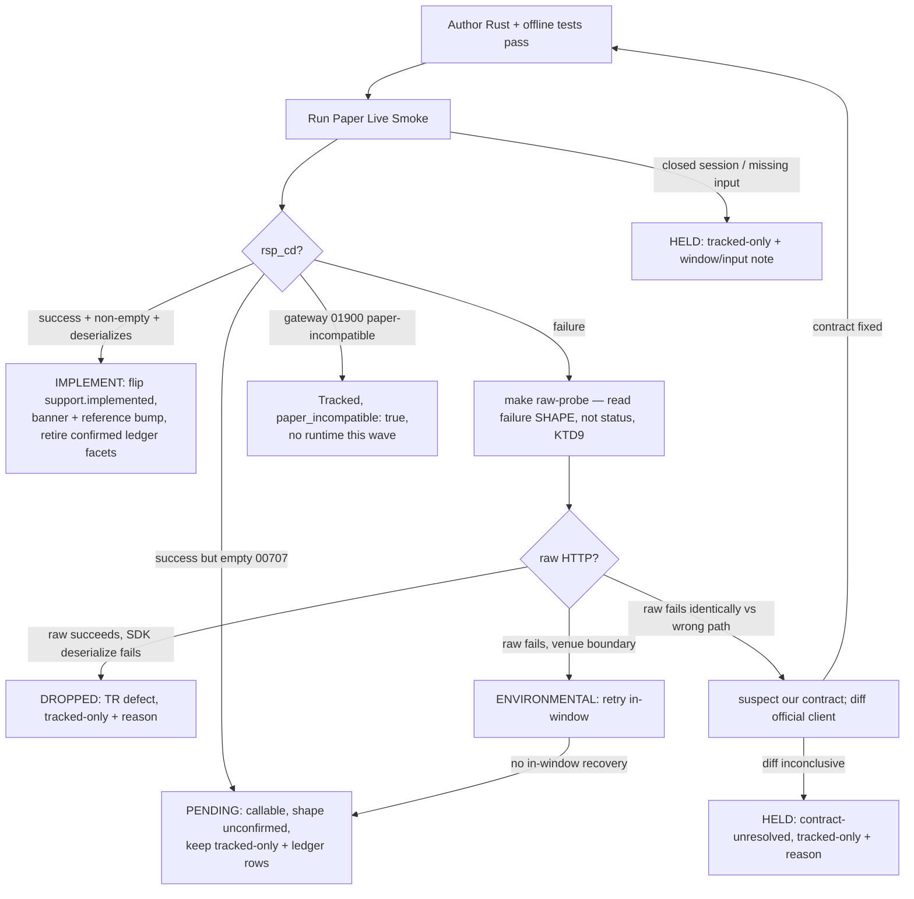

# feat: Read-only REST reach wave — open 7 uncharted lanes to Implemented

## Summary

Open the three REST domains the breadth wave deferred to their own lanes —
overseas-stock, overseas-futures, night-derivatives — plus the account/F&O,
F/O-quote, paginated, and standalone reads, bringing each lane to callable
Implemented surface. ~29 read-only TRs across **one foundation step + 7
per-domain lane PRs**. The foundation batch-tracks all 15 still-raw P3 reads in a
single renormalize (maintained-count 70→85 once); each lane then runs a bounded
reachability spike that gates *runtime only* before implementing its reachable
members via the frozen `implement-tr` recipe. Implemented is the ceiling — no
promotion to Recommended. For the three uncharted lanes (overseas-stock,
overseas-futures, night-derivatives), a Tracked-only or PENDING disposition for
some or all members is a successful in-scope outcome — the spike, not the plan,
decides how many flips each lane lands.

---

## Problem Frame

The breadth wave (PR-A #43 / PR-B #44, merged 2026-06-23) flipped 12
domestic-reachable Tracked reads to Implemented and held three REST domains to
their own lanes because their **paper reachability was uncharted** — not because
metadata was missing. This wave opens those lanes. Two facts shape it:

- **The P0 set is implement-only; the P3 set is a raw lift.** All 14 P0 TRs are
  Tracked with projected baselines (`support.implemented: false`). All 15 P3 TRs
  are raw — no `metadata/trs/<tr>.yaml`, no baseline — so they need the full
  raw→Tracked→Implemented lift, which bumps `maintained_tr_count` and ripples
  through the count-coupled literals. P0 members skip that.
- **Tracked ≠ paper-reachable.** Overseas-stock, overseas-futures, and
  night-derivatives have uncharted reachability; the paper gateway may reject
  them (`01900`) or answer only in a night window. A cheap probe verifies
  reachability before any runtime is authored.

The breadth wave maximized callable surface within one already-charted,
already-Tracked batch. This wave pushes into *uncharted* domains, so reachability
spikes and a raw-tracking lift are first-class parts of the work. Every
non-structural decision (disposition state machine, IGW40011 audit,
Korean-name canonical field, raw-capture out-block shape, 00707 disposition, no
ship-floor) carries forward unchanged from the breadth wave (see origin:
`docs/brainstorms/2026-06-23-readonly-rest-breadth-wave-requirements.md`).

---

## Requirements

**Wave structure**

- R1. Deliver the wave as one foundation step plus 7 per-domain lane PRs. Each
  lane PR self-gates, runs its own reachability spike, smokes its own TRs, and
  bumps its own per-flip docgen literals.
- R2. The rung target is Implemented for every reachable in-scope TR. No
  promotion to Recommended; no Focused Evidence, no `recommendation` block, no
  `metadata/evidence/<tr>.yaml`.
- R3. Every TR flips on its own green smoke. A non-green TR ships dispositioned
  without blocking its lane — no anchor TR, no ship-floor.

**Foundation raw lift**

- R4. One foundation step batch-tracks all 15 raw P3 TRs before any raw-bearing
  lane implements: author each `metadata/trs/<tr>.yaml` + routing entry, run a
  single `make api-drift-renormalize`, and bump the maintained-count literals
  once (`maintained_tr_count` 70→85 and siblings). Tracking is unconditional on
  reachability — all 15 become Tracked even where their runtime is later
  deferred.
- R5. After renormalize, revert `manifest.refreshed` to the last raw-refresh
  date; verify `git diff` shows only the count bump plus the 15 new
  `normalized/trs/<tr>.json` files.

**Reachability spike (per lane, before runtime)**

- R6. Each lane begins with a bounded probe — `make raw-probe` for the domain's
  prefix with representative identifiers (overseas-stock `g`, overseas-futures
  `o`, anytime F/O), or an in-window probe for krx_extended lanes (CCENQ90200,
  t8455/t8460/t8463). The probe gates **runtime only**, never tracking.
- R7. Disposition each TR by probe + smoke outcome: reachable → Implemented;
  `01900` (paper-incompatible) → Tracked, `implemented:false`,
  `paper_incompatible:true`; closed-session/wrong-window → Tracked, HELD with the
  required window documented; input-unresolved → Tracked, HELD with the
  caller-input note; empty success `00707` → PENDING (callable, shape
  unconfirmed), tracked-only; raw probe succeeds but SDK deserialize fails →
  DROPPED (TR defect), tracked-only with a reason.

**Per-TR implement**

- R8. For each implemented TR, follow the frozen `implement-tr` recipe: author
  InBlock/OutBlock + facade method + `{TR}_POLICY` const registered in BOTH
  cross-check lists, add the offline deserialize test, add the `live_smoke_<tr>`
  test + `make live-smoke-<tr>` target + `smoke-map.md` row
  (Promotion = `implemented-only`).
- R9. Numeric request-body fields serialize as JSON numbers
  (`string_as_number`) to avoid `IGW40011`. Audit each TR's request fields
  against the solution doc, starting with `t1988`.
- R10. Wire field names, types, and array-vs-single shapes come from the raw
  capture, never guesswork — read each out-block key from
  `crates/ls-trackers/baselines/api-drift/raw/ls-openapi-full.json`, not the
  normalized baseline.

**Count-coupled tests**

- R11. The foundation step bumps the maintained-count literals once
  (`TRACKED_TRS` array + length, `maintained_tr_count`, the four `cli.rs`
  shape-count literals). Each Implemented flip appends to `banner_trs` and bumps
  `reference.len()` by one in the SAME commit, then regenerates docs. Only TRs
  that actually flip contribute to the banner/reference bumps.

---

## Key Technical Decisions

- KTD1. **Batch-track all 15 raw P3 reads in one foundation step, before any
  lane implements.** Tracking is a maintenance-ownership decision independent of
  reachability (origin Key Decisions), so all 15 are tracked unconditionally in a
  single renormalize. This collapses R11's serialization problem: the heavy
  maintained-count collision (`70→85` across six literals) happens exactly once,
  up front; the implement lanes afterward touch only the lighter, per-flip
  `banner_trs`/`reference.len()` literals, so they no longer collide on the
  tracked-count surface. They remain coupled only on those two per-flip literals,
  so parallel lanes must still land sequentially or rebase those lines forward
  (HTD count map) — but the heavy maintained-count serialization is gone. The
  alternative — per-lane track-raw inside each raw-bearing lane — would re-impose
  the maintained-count collision on every lane and force strict stacking;
  batch-tracking in U1 collapses it to a single upfront renormalize.

- KTD2. **The reachability spike gates runtime, never tracking.** A failing or
  uncharted probe decides only whether callable Rust is authored this wave;
  metadata is authored regardless (in U1). A lane whose probe returns `01900` or
  a closed window still leaves all its members Tracked, dispositioned HELD/PENDING
  with the venue/window/input requirement recorded.

- KTD3. **Route by `owner_class`; no new SDK module.** CCENQ90200 / CFOAQ10100 /
  CCENQ10100 route through `account`; overseas-stock (`g`), overseas-futures
  (`o`), F/O-quote, and night-derivatives route through `market_session`;
  t1481/t1482 route through `paginated`. The standalone-lane reads (t1988, t3102,
  t3320) carry a placeholder `owner_class: standalone`, but the `standalone`
  module is OAuth-only (token/revoke) and cannot host a data read — route them
  through `market_session` (non-paginated, `category: MarketData`), correcting
  `owner_class` from `standalone` to `market_session` at flip time per
  `implement-tr` §6; their metadata (`rate_bucket: market_data`,
  `self_paginated: false`) confirms the market-data class. The `overseas`/`night`
  distinction lives in `facets.instrument_domain` + `facets.venue_session`, not in
  a module.

- KTD4. **IGW40011 is a wire-type defect, not a value problem.** Model each
  numeric request field (cursor, count, index, price/volume bound) as Rust
  `String` but serialize with `#[serde(serialize_with = "ls_core::string_as_number")]`
  so it emits `"idx":0` not `"idx":"0"`; add an offline `…["idx"].is_number()`
  assertion. Audit every raw TR's request body, starting with `t1988` (known
  prior IGW40011). A TR that returns IGW40011 for *every* request form after the
  type is correct is environmental → ship PENDING, do not flip; diagnose by
  A/B-ing quoted-vs-unquoted body with `make raw-probe`, never by rebuilding the
  SDK
  (`docs/solutions/integration-issues/ls-gateway-igw40011-numeric-request-fields.md`).

- KTD5. **Out-block key and array-ness come from the RAW capture; gate every
  `00707` smoke on non-empty before recording.** The normalized baseline
  collapses Object-Array blocks to the literal `response_body`, erasing the true
  `#[serde(rename)]` key and array shape — the breadth wave mis-guessed 4 of 9
  F/O TRs as single when they were arrays. Read the true key/shape from
  `…/raw/ls-openapi-full.json`; model arrays as `Vec<…>` with
  `ls_core::de_vec_or_single`. A `00707` empty body still deserializes, so a
  smoke that doesn't assert non-empty before `record(...)` will falsely flip an
  empty result to Implemented
  (`docs/solutions/conventions/tr-out-block-shape-from-raw-capture.md`).

- KTD6. **Assert each out-block's canonical field by baseline `korean_name`,
  with an exact value from a non-collapsing fixture.** Resolve the representative
  field from `normalized/trs/<tr>.json` `korean_name`, not the English field
  name, and pin its exact value (not `!is_empty()`). Acute for the overseas
  index/quote reads with multiple similar numeric fields; never build a fixture
  from a single composite instrument whose distinct fields collapse to equal
  values and mask a mislabel (Wave A `firstjisu`/`pricejisu` P1;
  `docs/solutions/conventions/sdk-struct-field-from-baseline-korean-name.md`).

- KTD7. **krx_extended members flip Implemented venue-provisional; the night
  window is not the regular window.** CCENQ90200 and t8455/t8460/t8463 may flip
  on a reachable probe while keeping their `venue_session` Provisionality Ledger
  rows open — in-window venue confirmation is a later facet pass (Scope
  Boundaries). The documented empty-result session clock is keyed on
  `krx_regular` ~09:00–15:30 KST; establish the krx_extended night window before
  dispositioning any night-lane empty result — do not reuse the regular window
  (`docs/solutions/conventions/market-hours-read-empty-result-disposition.md`).

- KTD8. **Register each `{TR}_POLICY` const in both cross-check lists; respect
  the one-way pagination implication.** A const is silently skipped unless it
  appears in both the `policies` array in
  `crates/ls-core/tests/policy_index_crosscheck.rs` and
  `slice_rest_policies_are_non_order_rest` in
  `crates/ls-core/src/endpoint_policy.rs`. Account consts use
  `category: RateLimitCategory::Account`; market-data consts use `MarketData`.
  `has_pagination` drives no runtime branching; assert `self_paginated ⟹
  has_pagination`, never equality
  (`docs/solutions/architecture-patterns/ls-sdk-pagination-modeling.md`).

- KTD9. **For uncharted lanes, read the failure *shape*, not the status code,
  before declaring a domain unreachable.** A 500/identical-failure across a
  valid, a param-less, and a deliberately-wrong path points at *our*
  path/contract, not the venue; a clean 4xx localizes the real boundary. Before
  concluding `01900`/paper-incompatible for overseas `g`/`o`, A/B a deliberately
  wrong path against the intended one; if a clearly-wrong path fails identically,
  suspect the contract and diff against what the official client sends. A
  confident misdiagnosis propagates into committed metadata and mis-scopes the
  lane
  (`docs/solutions/integration-issues/fault-tolerant-fallback-masked-wrong-endpoint-bug.md`).

---

## High-Level Technical Design

### Lane roster and routing

`Track` = the lane carries raw P3 members tracked in U1 (depends on the
foundation). `Implement-only` = all members already Tracked. Reachability is the
spike's job; the status column is the *expectation* going in, not a verdict.

| Unit | Lane (PR) | Tracked (P0) | Raw P3 (tracked in U1) | Route | Probe | Reachability |
|------|-----------|--------------|------------------------|-------|-------|--------------|
| U2 | Paginated | t1481, t1482 | — | `paginated` | charted | charted |
| U3 | Standalone | t1988, t3102, t3320 | — | by `owner_class` | caller-input | charted, input-gated |
| U4 | Account/F&O | CCENQ90200 | CFOAQ10100, CCENQ10100 | `account` | account / in-window | mostly charted; CCENQ90200 krx_extended |
| U5 | F/O quote | — | t2111, t2112, t2106, t8402, t8403, t8434 | `market_session` | anytime F/O | charted |
| U6 | Night-derivatives | t8455, t8460, t8463 | — | `market_session` | in-window | uncharted window |
| U7 | Overseas-stock | g3101, g3104, g3106 | g3102, g3103, g3190 | `market_session` | one `g`-probe | uncharted |
| U8 | Overseas-futures | o3101, o3121 | o3105, o3106, o3125, o3126 | `market_session` | one `o`-probe | uncharted |

One domain probe covers both the Tracked and raw members of that domain (one
`g`-probe for all six overseas-stock codes; one `o`-probe for all six
overseas-futures codes).

### Count-coupled literal map

The foundation lift (U1) and the per-flip bumps touch disjoint literal sets —
that disjointness is what KTD1 buys.

| When | Literal | Location | Change |
|------|---------|----------|--------|
| U1 foundation, once | `TRACKED_TRS: [&str; 70]` | `crates/ls-docgen/src/lib.rs:677` | +15 entries → `[&str; 85]` |
| U1 foundation, once | `maintained_tr_count` assert `70` | `crates/ls-trackers/tests/api_drift.rs:106` | → 85 |
| U1 foundation, once | `shapes.len()`/`maintained_shapes` `70` ×4 | `crates/ls-trackers/src/cli.rs:1811, 1876, 2779, 2787` | → 85 |
| U1 foundation, once | `manifest.refreshed` | `…/normalized/manifest.json` | revert to last raw-refresh date |
| Per Implemented flip | `banner_trs` array (44) | `crates/ls-docgen/src/lib.rs:865` | +1 per flip |
| Per Implemented flip | `reference.len()` assert (51) | `crates/ls-docgen/src/lib.rs:912` | +1 per flip |

Read the current `banner_trs`/`reference.len()` literal before the first bump in
each lane PR rather than trusting 44/51 — if any other flip lands between now and
implementation, the baseline moves and the first commit's count test fails.

### Per-TR disposition state machine

Every TR runs the same gate after authoring; the terminal state decides whether
it flips, pends, drops, or holds. No anchor TR — each resolves independently and
a non-green TR never blocks its siblings.

### Shared per-TR test contract

Each feature-bearing TR's offline tests (plain `cargo test`, no `#[ignore]`),
mirroring `account_tests.rs` / `market_session_tests.rs`:

1. A representative success body deserializes and the canonical field (KTD6)
   holds its exact expected value (proves the subset round-trips, not just
   `serde(default)`).
2. Numeric-bearing out-block fields parse via `ls_core::string_or_number` from
   BOTH string and number JSON; numeric request fields assert `.is_number()` on
   the serialized body (KTD4).
3. An empty result (`rsp_cd 00707`, empty out-block) deserializes and is
   recognized as the empty/PENDING case.
4. `::new(...)` serializes the in-block under the correct `#[serde(rename)]` key
   with no caller fields leaking (account: account number never in the body).
5. The `live_smoke_<tr>` Err-path emits no capturable `LIVE-SMOKE` line (mirror
   the `live_smoke_account` `SMOKE-FAIL`-to-stderr pattern).
6. (array out-blocks) a single-object body deserializes to a one-element `Vec`
   via `de_vec_or_single`; a multi-row body to a multi-element `Vec`.
7. **Secret-safety (recipe §5):** no committed line — the `LIVE-SMOKE`/`RAW-PROBE`
   line, a PENDING/DROP reason, or the commit body — references `rsp_msg` or
   contains an OAuth token, appkey, secret, or account number. Only lengths, the
   business `rsp_cd`, public tickers/dates, and structural counts are allowed.
   Bites hardest on the account reads (CCENQ90200/CFOAQ10100/CCENQ10100), whose
   gateway `rsp_msg` carries account-identifying text.

Each lane unit below lists only its TR-specific particulars; the seven items
above are the shared baseline, and every unit's verification additionally
confirms any committed smoke/PENDING/DROP line is credential-free per item 7.

---

## Implementation Units

Units are dependency-ordered. U1 is the foundation; the raw-bearing lanes
(U4, U5, U7, U8) depend on it for their tracked metadata. The implement-only
lanes (U2, U3, U6) depend on nothing. Within each lane, each TR lands as its own
commit (its `support.implemented` flip + `banner_trs`/`reference.len()` bump
together). Develop lanes sequentially, or rebase the two per-flip docgen literals
forward — the heavy maintained-count collision is gone after U1.

### U1. Foundation — batch-track all 15 raw P3 reads

- **Goal:** Bring all 15 raw P3 TRs to Tracked in one renormalize, lifting
  `maintained_tr_count` 70→85 and the sibling literals exactly once, with no
  Rust and no banner/reference change.
- **Requirements:** R4, R5, R11.
- **Dependencies:** none. Blocks U4, U5, U7, U8. Order-independent w.r.t. the
  implement-only lanes (U2, U3, U6): U1 touches only the maintained-count literal
  set, disjoint from the per-flip `banner_trs`/`reference.len()` literals those
  lanes bump, so it may land before, after, or between their flips without count
  interaction.
- **Files:** `metadata/trs/{CFOAQ10100,CCENQ10100,g3102,g3103,g3190,o3105,o3106,o3125,o3126,t2106,t2111,t2112,t8402,t8403,t8434}.yaml`,
  the tr-index routing file, `crates/ls-trackers/baselines/api-drift/normalized/trs/*.json`
  (generated), `crates/ls-trackers/baselines/api-drift/normalized/manifest.json`,
  `crates/ls-docgen/src/lib.rs` (`TRACKED_TRS`),
  `crates/ls-trackers/tests/api_drift.rs`, `crates/ls-trackers/src/cli.rs`.
- **Approach:** Follow the frozen `track-tr` recipe per TR — author
  `metadata/trs/<tr>.yaml` (`support: {tracked: true, implemented: false,
  recommended: false}`, `owner_class`, `facets` with `venue_session: unspecified`
  for the overseas `g`/`o` raws to match their Tracked siblings) + routing entry,
  reading shape from the raw capture (KTD5). First run the `track-tr` §0
  raw-shape eligibility check for all 15 — each needs complete request and
  response blocks in the raw capture (verified present, but confirm before fixing
  the count target). The 70→85 delta and the literal values below assume all 15
  pass; if any is HELD incomplete, the delta is the passing count and that TR stays
  raw (its lane ships Tracked-only). Then a single
  `make api-drift-renormalize` projects all 15 `normalized/trs/<tr>.json` and
  moves manifest `maintained_tr_count` 70→85. Revert `manifest.refreshed` to the
  last raw-refresh date (KTD9 sibling / `api-drift-renormalize-preserves-refreshed-date.md`).
  Bump the six maintained-count literals per the count map. No `banner_trs` /
  `reference.len()` change — those are Implemented-only.
- **Patterns to follow:** `.agents/skills/track-tr/SKILL.md`; the Wave 0
  bulk-track (PR #42) and the sector-cluster Tracked rung as precedent for
  count-literal sweeps.
- **Test scenarios:** `Test expectation: none — metadata-and-baseline lift, no
  behavioral Rust.` Gate-verified instead: `cargo test -p ls-metadata -p ls-core`
  and the ls-trackers tests pass with the bumped literals; the api-drift round-trip
  test passes (proves `manifest.refreshed` was reverted, not left at today).
- **Verification:** `git diff` on the manifest shows only `maintained_tr_count`
  70→85 plus 15 new `normalized/trs/<tr>.json` (refreshed date unchanged); all six
  literals read 85; `make docs-check` green; no `support.implemented` flipped, no
  banner/reference change. If the renormalize diff touches any of the 70
  pre-existing baselines, halt and diagnose the raw drift before committing — do
  not absorb it into the foundation commit (this blocks the four dependent lanes
  until resolved).

### U2. Paginated lane — t1481, t1482

- **Goal:** Flip t1481 and t1482 to Implemented through `paginated` (charted,
  implement-only).
- **Requirements:** R2, R3, R7, R8, R9, R10, R11.
- **Dependencies:** none (both already Tracked).
- **Files:** `crates/ls-sdk/src/paginated/mod.rs`,
  `crates/ls-core/src/endpoint_policy.rs`,
  `crates/ls-core/tests/policy_index_crosscheck.rs`,
  `crates/ls-sdk/tests/live_smoke.rs`, the paginated offline-test file,
  `Makefile`, `.agents/skills/promote-tr/references/smoke-map.md`,
  `metadata/trs/t1481.yaml`, `metadata/trs/t1482.yaml`,
  `crates/ls-docgen/src/lib.rs`, `metadata/PROVISIONALITY-LEDGER.md`.
- **Approach:** Mirror an existing single-page `paginated` read. Body-`idx`
  cursor (if present) is an ordinary in-block field serialized via
  `string_as_number` at single-page scope — not `#[serde(skip)]`, which is only
  for header-cursor TRs (KTD8 / pagination doc). Out-block shape/key from the raw
  capture (KTD5); `category: MarketData`; both cross-check lists (KTD8).
- **Patterns to follow:** the single-page body-idx read in
  `crates/ls-sdk/src/paginated/mod.rs`; `docs/solutions/architecture-patterns/ls-sdk-pagination-modeling.md`.
- **Test scenarios:** Shared contract. Per-TR: `::new` serializes the cursor as a
  JSON number (`.is_number()`); canonical row field by Korean name; single→one-element
  `Vec` if the row block is an array.
- **Verification:** Offline tests green; `make live-smoke-t1481` / `-t1482` return
  deserializing success; `support.implemented: true`; `banner_trs` + `reference.len()`
  bumped in the same commit per flip; gate green.

### U3. Standalone lane — t1988, t3102, t3320

- **Goal:** Flip the three standalone reads to Implemented, or disposition each
  HELD/PENDING when its caller input can't be resolved.
- **Requirements:** R2, R3, R7, R8, R9, R10, R11.
- **Dependencies:** none (all already Tracked).
- **Files:** `crates/ls-sdk/src/market_session/mod.rs` (route here per KTD3 —
  correct the placeholder `owner_class: standalone` to `market_session`),
  `crates/ls-core/src/endpoint_policy.rs`,
  `crates/ls-core/tests/policy_index_crosscheck.rs`,
  `crates/ls-sdk/tests/live_smoke.rs`, the matching offline-test file, `Makefile`,
  `.agents/skills/promote-tr/references/smoke-map.md`,
  `metadata/trs/t1988.yaml`, `metadata/trs/t3102.yaml`, `metadata/trs/t3320.yaml`,
  `crates/ls-docgen/src/lib.rs`, `metadata/PROVISIONALITY-LEDGER.md`.
- **Approach:** Route through `market_session` (KTD3), correcting each TR's
  placeholder `owner_class` from `standalone` to `market_session` at flip time per
  `implement-tr` §6 — the `standalone` module is OAuth-only and cannot host these
  reads. Discover a representative caller input per TR before smoking
  (execution-time — see Open Questions). **t1988 first:** audit its request body
  for numeric fields and serialize via `string_as_number` (KTD4); it previously
  returned IGW40011, so if it recurs for every request form after the type fix,
  ship PENDING, do not brute-force values. Out-block shape from raw capture
  (KTD5); register consts in both lists.
- **Patterns to follow:** the IGW40011 solution doc; the breadth wave's
  per-TR single-struct implement units.
- **Test scenarios:** Shared contract. Per-TR: t1988 asserts its numeric request
  field serializes as a JSON number; canonical field by Korean name; explicitly
  cover the input-unresolved path as a HELD disposition (no flip) where input
  can't be discovered.
- **Verification:** Per TR — green smoke → flip + banner/reference bump; IGW40011
  persisting after type-fix → PENDING; input-unresolved → HELD with the caller-input
  note; gate green in every case.

### U4. Account/F&O lane — CCENQ90200, CFOAQ10100, CCENQ10100

- **Goal:** Flip the three account-gated read-only orderable-quantity / night
  balance reads to Implemented (CCENQ90200 venue-provisional).
- **Requirements:** R2, R3, R6, R7, R8, R9, R10, R11.
- **Dependencies:** U1 (CFOAQ10100, CCENQ10100 tracked there).
- **Files:** `crates/ls-sdk/src/account/mod.rs`,
  `crates/ls-core/src/endpoint_policy.rs`,
  `crates/ls-core/tests/policy_index_crosscheck.rs`,
  `crates/ls-sdk/tests/live_smoke.rs`, `crates/ls-sdk/tests/account_tests.rs`,
  `Makefile`, `.agents/skills/promote-tr/references/smoke-map.md`,
  `metadata/trs/CCENQ90200.yaml`, `metadata/trs/CFOAQ10100.yaml`,
  `metadata/trs/CCENQ10100.yaml`, `crates/ls-docgen/src/lib.rs`,
  `metadata/PROVISIONALITY-LEDGER.md`.
- **Approach:** Begin with the account probe; CCENQ90200 (krx_extended) needs an
  in-window probe (KTD7). Route through `account` with `CSPAQ12200`'s
  account-identity discipline — account number from config, never a caller field;
  plain `Inner::post`, `has_pagination: false`. CFOAQ10100 / CCENQ10100 are
  read-only orderable-quantity reads (account-gated, **not** order mutation —
  in scope as reads). Out-block shape from raw capture (KTD5); `category: Account`,
  both lists. CCENQ90200 flips venue-provisional — keep its `venue_session` ledger
  row.
- **Patterns to follow:** `CSPAQ12200` in `crates/ls-sdk/src/account/mod.rs`;
  `live_smoke_account`; breadth wave U1–U3.
- **Test scenarios:** Shared contract (secret-safety acute — account `rsp_msg`).
  Per-TR: account number absent from each serialized in-block; canonical OutBlock
  field by Korean name; CCENQ90200 empty off-window → PENDING by the krx_extended
  clock, not a defect (KTD7).
- **Verification:** Offline tests green — including the item-4 account-number-absence
  assertion on each serialized in-block for CCENQ90200/CFOAQ10100/CCENQ10100,
  confirmed present before tests are marked green; `make live-smoke-<tr>` per TR
  returns deserializing success → flip + banner/reference bump; CCENQ90200 may ship
  venue-provisional; secret-safety confirmed on every committed line; gate green.

### U5. F/O quote lane — t2111, t2112, t2106, t8402, t8403, t8434

- **Goal:** Flip the six anytime F/O quote/master reads to Implemented through
  `market_session`. One lane PR; clean cut along TR boundaries if review size
  demands a split during implementation.
- **Requirements:** R2, R3, R6, R7, R8, R9, R10, R11.
- **Dependencies:** U1 (all six tracked there).
- **Files:** `crates/ls-sdk/src/market_session/mod.rs`,
  `crates/ls-core/src/endpoint_policy.rs`,
  `crates/ls-core/tests/policy_index_crosscheck.rs`,
  `crates/ls-sdk/tests/live_smoke.rs`,
  `crates/ls-sdk/tests/market_session_tests.rs`, `Makefile`,
  `.agents/skills/promote-tr/references/smoke-map.md`,
  `metadata/trs/{t2111,t2112,t2106,t8402,t8403,t8434}.yaml`,
  `crates/ls-docgen/src/lib.rs`, `metadata/PROVISIONALITY-LEDGER.md`.
- **Approach:** One anytime F/O probe covers the lane. Mirror `T1102`
  (non-paginated). **Read each out-block key and array-ness from the raw capture**
  (KTD5) — F/O quote reads are exactly where the breadth wave mis-guessed single
  vs array; count-header + row-array TRs carry two distinct wire keys the
  normalized baseline hides. Numeric request fields via `string_as_number` (KTD4).
  `category: MarketData`, both lists.
- **Patterns to follow:** `T1102`; breadth wave U4–U12 (F/O masters incl. the
  array-out-block units U7/U8/U11/U12).
- **Test scenarios:** Shared contract incl. the single→one-element-`Vec` case for
  array out-blocks. Per-TR: canonical field by Korean name with an exact value;
  `::new(...)` rename; numeric request fields assert `.is_number()`.
- **Verification:** Offline tests green; `make live-smoke-<tr>` per TR returns
  deserializing success → flip + banner/reference bump (record KRX session clock;
  off-session empty → re-run in-window per KTD7); gate green.

### U6. Night-derivatives lane — t8455, t8460, t8463

- **Goal:** Flip the three krx_extended night-derivatives reads to Implemented
  venue-provisional, or PENDING where the night window can't be hit
  (implement-only, no raw lift).
- **Requirements:** R2, R3, R6, R7, R8, R9, R10, R11.
- **Dependencies:** none (all already Tracked).
- **Files:** `crates/ls-sdk/src/market_session/mod.rs`,
  `crates/ls-core/src/endpoint_policy.rs`,
  `crates/ls-core/tests/policy_index_crosscheck.rs`,
  `crates/ls-sdk/tests/live_smoke.rs`,
  `crates/ls-sdk/tests/market_session_tests.rs`, `Makefile`,
  `.agents/skills/promote-tr/references/smoke-map.md`,
  `metadata/trs/{t8455,t8460,t8463}.yaml`, `crates/ls-docgen/src/lib.rs`,
  `metadata/PROVISIONALITY-LEDGER.md`.
- **Approach:** Establish the krx_extended **night window** first — the regular
  ~09:00–15:30 KST clock does not apply (KTD7). Run the in-window probe in that
  window. Mirror `T1102`; out-block shape from raw capture (KTD5); `category:
  MarketData`, both lists. Members flip venue-provisional on a reachable in-window
  probe, keeping their `venue_session` ledger rows; an empty off-window result is
  not a valid attempt (re-run in-window, do not DROP, do not flip).
- **Patterns to follow:** `T1102`; the market-hours empty-result disposition doc;
  breadth wave KTD5 (off-session provisionality).
- **Test scenarios:** Shared contract. Per-TR: canonical field by Korean name;
  explicitly cover the empty-off-window result as a re-run-in-window disposition
  (not a flip, not a DROP).
- **Verification:** Offline tests green; in-window `make live-smoke-<tr>` returns
  deserializing non-empty success → flip venue-provisional + banner/reference
  bump; no-window-reached → PENDING with the night-window requirement recorded;
  gate green either way.

### U7. Overseas-stock lane — g3101, g3104, g3106, g3102, g3103, g3190

- **Goal:** Flip the reachable overseas-stock reads to Implemented; disposition
  the rest by the spike outcome.
- **Requirements:** R2, R3, R6, R7, R8, R9, R10, R11.
- **Dependencies:** U1 (g3102, g3103, g3190 tracked there).
- **Files:** `crates/ls-sdk/src/market_session/mod.rs`,
  `crates/ls-core/src/endpoint_policy.rs`,
  `crates/ls-core/tests/policy_index_crosscheck.rs`,
  `crates/ls-sdk/tests/live_smoke.rs`,
  `crates/ls-sdk/tests/market_session_tests.rs`, `Makefile`,
  `.agents/skills/promote-tr/references/smoke-map.md`,
  `metadata/trs/{g3101,g3104,g3106,g3102,g3103,g3190}.yaml`,
  `crates/ls-docgen/src/lib.rs`, `metadata/PROVISIONALITY-LEDGER.md`.
- **Approach:** **Lead with one `g`-probe using a representative overseas-stock
  identifier; read the failure shape, not just the status (KTD9).** If the probe
  returns `01900`, set `paper_incompatible: true` on the affected members
  (Tracked, no runtime). If a deliberately-wrong path fails identically to the
  intended one, suspect the contract and diff against the official client before
  concluding unreachable. For reachable members: mirror `T1102`; out-block shape
  and the canonical index/price field from the raw capture + `korean_name` (KTD5,
  KTD6 — overseas index reads are the highest mislabel risk); numeric request
  fields via `string_as_number`; `category: MarketData`, both lists.
- **Patterns to follow:** `T1102`; the wrong-endpoint-bug solution doc; the
  Korean-name canonical-field doc.
- **Test scenarios:** Shared contract. Per-TR: canonical index/price field
  asserted by Korean name with an exact value from a non-collapsing fixture;
  `::new(...)` rename; cover the `01900` paper-incompatible disposition explicitly
  (member stays Tracked, no flip).
- **Verification:** `g`-probe outcome recorded with failure-shape reasoning;
  reachable members flip on green deserializing smokes + banner/reference bump;
  unreachable members dispositioned `paper_incompatible`/HELD with a recorded
  reason; gate green.

### U8. Overseas-futures lane — o3101, o3121, o3105, o3106, o3125, o3126

- **Goal:** Flip the reachable overseas-futures reads to Implemented; disposition
  the rest by the spike outcome.
- **Requirements:** R2, R3, R6, R7, R8, R9, R10, R11.
- **Dependencies:** U1 (o3105, o3106, o3125, o3126 tracked there).
- **Files:** `crates/ls-sdk/src/market_session/mod.rs`,
  `crates/ls-core/src/endpoint_policy.rs`,
  `crates/ls-core/tests/policy_index_crosscheck.rs`,
  `crates/ls-sdk/tests/live_smoke.rs`,
  `crates/ls-sdk/tests/market_session_tests.rs`, `Makefile`,
  `.agents/skills/promote-tr/references/smoke-map.md`,
  `metadata/trs/{o3101,o3121,o3105,o3106,o3125,o3126}.yaml`,
  `crates/ls-docgen/src/lib.rs`, `metadata/PROVISIONALITY-LEDGER.md`.
- **Approach:** Same shape as U7 with one `o`-probe. `venue_session: unspecified`
  for these (uncharted); read failure shape before declaring unreachable (KTD9).
  Reachable members mirror `T1102`; out-block shape/canonical field from raw
  capture + `korean_name` (KTD5, KTD6); numeric request fields via
  `string_as_number`; `category: MarketData`, both lists.
- **Patterns to follow:** U7; `T1102`; the wrong-endpoint-bug and Korean-name docs.
- **Test scenarios:** Shared contract. Per-TR: canonical field by Korean name with
  an exact value; `::new(...)` rename; cover the `01900`/unreachable disposition
  explicitly.
- **Verification:** `o`-probe outcome recorded with failure-shape reasoning;
  reachable members flip on green deserializing smokes + banner/reference bump;
  unreachable members dispositioned with a recorded reason; gate green.

---

## Scope Boundaries

**Deferred for later**

- Promotion of any of these TRs to Recommended (Focused Evidence +
  `recommendation` blocks) — a separate effort after Implemented.
- In-window krx_extended venue-facet *confirmation* beyond what a reachability
  probe yields (CCENQ90200, t8455/t8460/t8463) — they may flip Implemented
  venue-provisional; confirmation is a later facet pass, not a blocker here.

**Deferred to follow-up work (this wave's own sequencing)**

- Whether the 6-TR F/O-quote lane (U5) ships as one PR or splits by out-block
  complexity (array vs single struct). Modeled as one PR; the split is a clean cut
  along TR boundaries if review size demands it once the first 2–3 are authored.

**Held to separate efforts (out of this wave)**

- **Realtime/WebSocket market-data (P1)** — K3_, H1_, HA_, S2_, US3, UH1, US2,
  GSC, GSH, OVC, OVH, OC0, OH0, FC9, FH9. All 15 raw; the `implement-tr` recipe
  HELDs realtime out of scope (SKILL.md §0); only `S3_` exists as a realtime
  reference. Needs a generic WebSocket-lifecycle-smoke methodology (connect →
  subscribe → unsubscribe) built first.
- **Order-lifecycle observation (P2)** — SC0–SC4, C01, O01, H01, AS0–AS4,
  TC1–TC3. All 14 raw; side-effect-adjacent realtime feeds; folded into the same
  deferred realtime effort, observation-only, never REST order runtime.

---

## Open Questions

These are execution-time discoveries the spikes and smokes resolve — they do not
block planning, but each shapes how many flips a lane lands.

- **Reachability verdict per uncharted domain** (overseas-stock, overseas-futures,
  night-derivatives). Resolved by each lane's probe (U6, U7, U8); decides whether
  runtime is authored or the member ships Tracked-only. Tracking is unaffected —
  all 15 raw are tracked in U1 regardless.
- **Caller-supplied input shapes for the standalone lane** (t1988, t3102, t3320).
  Each needs a representative identifier discovered before a smoke can run (U3);
  unresolved input → HELD disposition, not a flip.
- **The krx_extended night window** for U6's in-window probe — must be established
  before any night-lane empty result is dispositionable (KTD7); the regular-session
  clock does not apply.

---

## Risks & Dependencies

- **Uncharted reachability drives how many lanes author runtime.** The overseas
  `g`/`o` and night-derivatives probes (U6, U7, U8) may return `01900`, a closed
  window, or an identical-failure that actually points at our contract (KTD9).
  Some members will legitimately ship Tracked-but-not-Implemented; that is a
  dispositioned outcome, not a wave failure (R3).
- **Misreading an uncharted-domain failure mis-scopes the lane.** A confident
  "paper-incompatible" verdict propagates into committed metadata; always A/B a
  deliberately-wrong path and diff against the official client before concluding
  unreachable (KTD9).
- **`manifest.refreshed` re-stamp (U1).** `api-drift-renormalize` re-stamps the
  date even when raw didn't change, tripping the round-trip test as a
  serialization failure; revert it and confirm `git diff` shows only the count
  bump + new `trs/json`.
- **F/O-quote out-block mis-guess (U5) and overseas field mislabel (U7/U8).** The
  highest-risk shape and canonical-field spots; read from the raw capture and pin
  exact values from non-collapsing fixtures (KTD5, KTD6).
- **Paper-gateway availability gates every smoke.** A 403 at token acquisition
  contradicting a known-good paper key is most likely `.env` quote
  contamination — compare credential value *lengths* (never print secrets),
  source `.env` in the recipe shell, confirm `LS_TRADING_ENV=paper`
  (`docs/solutions/integration-issues/makefile-include-env-quotes-gateway-403.md`).
- **Rate throttle, not defect.** `IGW00201` during a tight smoke loop is
  self-inflicted — pace the runs.
- **Dependencies:** all 14 P0 candidates confirmed Tracked and all 15 P3
  candidates confirmed raw (grounding scout against `metadata/trs/`); the
  account-state implement path opened by the Wave 0 recipe edit is in place, so
  the account-class reads route cleanly.

---

## Sources / Research

- `.agents/skills/track-tr/SKILL.md` — the raw→Tracked recipe (metadata authoring,
  single renormalize, count bump) driving U1.
- `.agents/skills/implement-tr/SKILL.md` — the Tracked→Implemented recipe
  (read-only gate §0, dual-registration, raw-probe decision tree, banner/reference
  bump) driving U2–U8.
- `docs/plans/2026-06-23-004-feat-readonly-rest-breadth-wave-plan.md` — the merged
  predecessor; per-TR authoring patterns, the disposition state machine, and the
  shared test contract carry forward.
- `crates/ls-sdk/src/account/mod.rs` (`CSPAQ12200`),
  `crates/ls-sdk/src/market_session/mod.rs` (`T1102`),
  `crates/ls-sdk/src/paginated/mod.rs` — owner-class exemplars and facade dispatch.
- `crates/ls-core/src/endpoint_policy.rs`,
  `crates/ls-core/tests/policy_index_crosscheck.rs` — `{TR}_POLICY` const shape and
  the two registration lists + the `self_paginated ⟹ has_pagination` cross-check.
- Count-coupled literals (current values, see HTD map):
  `crates/ls-docgen/src/lib.rs:677` (`TRACKED_TRS` len 70), `:865` (`banner_trs`
  44), `:912` (`reference.len()` 51); `crates/ls-trackers/tests/api_drift.rs:106`
  (`maintained_tr_count` 70); `crates/ls-trackers/src/cli.rs:1811,1876,2779,2787`
  (shape count 70).
- `crates/ls-trackers/baselines/api-drift/raw/ls-openapi-full.json` — true wire
  out-block keys and array-ness (KTD5).
- `crates/ls-trackers/baselines/api-drift/normalized/trs/<tr>.json` — per-TR
  request/response field shapes and `korean_name` (KTD6).
- `docs/solutions/integration-issues/ls-gateway-igw40011-numeric-request-fields.md`
  (KTD4),
  `docs/solutions/conventions/tr-out-block-shape-from-raw-capture.md` (KTD5),
  `docs/solutions/conventions/sdk-struct-field-from-baseline-korean-name.md` (KTD6),
  `docs/solutions/conventions/market-hours-read-empty-result-disposition.md` (KTD7),
  `docs/solutions/architecture-patterns/ls-sdk-pagination-modeling.md` (KTD8),
  `docs/solutions/integration-issues/fault-tolerant-fallback-masked-wrong-endpoint-bug.md`
  (KTD9),
  `docs/solutions/conventions/api-drift-renormalize-preserves-refreshed-date.md`
  (U1 refreshed-date revert),
  `docs/solutions/integration-issues/makefile-include-env-quotes-gateway-403.md`
  (gateway-403 diagnosis).
- `CONCEPTS.md` — Raw / Tracked / Implemented ladder, Paper Live Smoke,
  Provisionality Ledger, Pending.
- `metadata/PROVISIONALITY-LEDGER.md` — provisional venue/caller-input facet rows
  retired only on genuine paper confirmation (never field-type facets).
