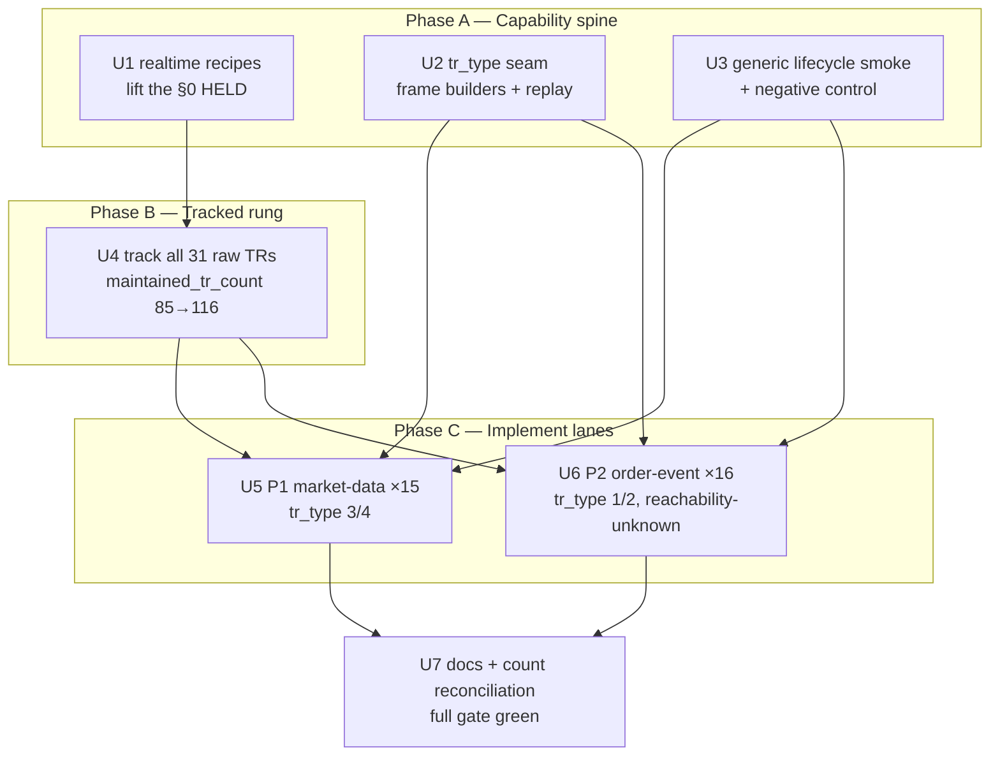

# feat: Realtime WebSocket Market-Data Lane

## Summary

Track and implement all 31 realtime WebSocket TRs — 15 P1 market-data feeds and 16 P2 order-lifecycle observation feeds — by extending the `S3_` pattern. Build a capability spine first (a realtime-capable recipe, a `tr_type`-parameterized frame path, and a generic lifecycle smoke with a negative control), then bring all 31 to Tracked, then flip the reachable ones to Implemented on a paper lifecycle smoke. Implemented is the ceiling; Recommended is deferred.

---

## Problem Frame

The realtime SDK surface is one TR wide: `S3_` (KOSPI 체결) is the only `owner_class: realtime` TR implemented, so a consumer can subscribe to nothing but KOSPI trades. The transport stack (`WsManager` lifecycle, reconnect replay, type-erased decode dispatch) and the metadata/baseline machinery already exist and generalize — what is missing is per-TR wiring plus one transport seam. Both the `track-tr` and `implement-tr` recipes explicitly HELD realtime out of scope (their §0 clauses), so this wave must first lift that hold. The prior REST reach-wave plan deferred exactly these 31 TRs to "a separate realtime effort" and named the prerequisite: a generic WebSocket-lifecycle-smoke methodology built first (see origin: `docs/brainstorms/2026-06-24-realtime-websocket-market-data-lane-requirements.md`).

---

## Key Technical Decisions

- KTD1. **Author realtime-capable sibling recipes rather than running the stock ones.** Both `track-tr` (§0) and `implement-tr` (§0) HELD realtime/WebSocket out of scope, and the REST implement path (`InBlock`/`OutBlock`/`Inner::post`, dual policy-list registration) does not apply to a WebSocket push TR. New `track-realtime-tr` / `implement-realtime-tr` recipes keep the one-recipe-per-rung convention and leave the REST recipes untouched. The `S3_` metadata + `S3_POLICY` + `realtime/frame.rs` struct + `live_smoke_ws` quartet is the authoritative template.

- KTD2. **Lifecycle (Transport) reachability is the Implemented gate, on a fresh manager per smoke.** A clean connect→subscribe→unsubscribe with no immediate protocol error opens the gate; a row is bonus. Each certification-like smoke uses a fresh/isolated `WsManager` — the Phase 83/84 root cause was a shared manager whose sender died after the first TR, poisoning later TRs.

- KTD3. **Parameterize `tr_type` for the order-event lane.** `build_frame` already takes `tr_type: &str`; the hardcoding lives in `build_subscribe_msg`/`build_unsubscribe_msg` ("3"/"4") and the `WsManager` call sites. Thread `tr_type` from subscribe through to the builders so P1 market-data registers with "3"/"4" and P2 order-event with "1"/"2", and persist the per-subscription `tr_type` so reconnect replay rebuilds the right frame.

- KTD4. **Per-TR runtime authoring is the `S3_` quartet — no decode-dispatch-table edit.** Decode is generic over the caller's type at the `subscribe_typed::<Row>(tr_cd, tr_key)` call site, so adding a TR means: a push-row struct in `realtime/frame.rs`, a re-export in `realtime/mod.rs`, a WebSocket `{TR}_POLICY` mirroring `S3_POLICY`, and registration in `policy_index_crosscheck.rs` **only** (not the REST-only `slice_rest_policies_are_non_order_rest` list), plus a lifecycle smoke.

- KTD5. **Model each push-row struct from the RAW capture, not the normalized baseline.** The normalized baseline collapses out-block structure (relabels arrays to `response_body`, erases the real wire key and array-ness). Read the literal `res_example` from `crates/ls-trackers/baselines/api-drift/raw/ls-openapi-full.json`; `[ {...} ]` → `Vec` with the true `#[serde(rename)]` key, bare `{...}` → single struct. All fields use `string_or_number`. A struct whose key or array-ness can't be confirmed from the raw capture is marked structurally-unverified.

- KTD6. **The spine includes a negative control, and resolving it gates Phase C/D.** The current subscribe path sends fire-and-forget and never reads the gateway ACK, so a valid and an invalid `tr_cd` produce the identical `Ok` — there is no live signal distinguishing them today, and `MockWsServer` is a passive echo server with no rejection path. The negative control is therefore inexecutable as the naive "invalid `tr_cd` stays Tracked-only" assertion. Make it real two ways: teach `MockWsServer` a rejection path for the deterministic test, and on the live path either read the subscribe ACK frame so acceptance is observable, or — if the gateway emits no observable rejection — label every flip connection-reachable-only with a stronger provisional flag than the standard lifecycle claim. This is a precondition for any flip, not a per-TR detail.

- KTD7. **Split the count-test bookkeeping across rungs, and revert `manifest.refreshed`.** Tracking all 31 bumps `maintained_tr_count` (85→116), `TRACKED_TRS` (length + sorted insert), and the `ls-trackers` CLI shape-count literals. Implementing bumps `reference.len()` and `banner_trs` per *reachable* TR only (the implemented total is data-dependent). After `make api-drift-renormalize`, revert `manifest.refreshed` to the last raw-refresh date — renormalize re-stamps it with today and breaks the byte-identical round-trip test. Never `cargo fmt` the whole `ls-trackers` crate.

- KTD8. **Disposition the unreachable faithfully; don't call IGW40011 environmental prematurely.** A member whose subscribe is rejected, errors, or lacks a representative `tr_key` ships Tracked-only (`paper_incompatible` / pending / held). IGW40011 (numeric-request-field typing) is documented for REST bodies only and is untested for WS subscribe frames; if a subscribe frame carries a numeric slot, reach for `string_as_number` first rather than dispositioning environmental.

---

## High-Level Technical Design

Four phases, dependency-ordered. The spine (Phase A) unblocks everything; tracking (Phase B) is a prerequisite for any flip; the two implementation lanes (Phase C, D) differ only by the `tr_type` path and the reachability risk.

**Per-TR authoring quartet (directional, not a spec):** for each TR — `XxRow` struct in `realtime/frame.rs` (fields + array-ness from raw `res_example`, all `string_or_number`) → re-export in `realtime/mod.rs` → `{TR}_POLICY` in `endpoint_policy.rs` (`path:"/websocket"`, `protocol: WebSocket`, `is_order:false`, no rate limits) → add `{TR}_POLICY` to `policy_index_crosscheck.rs` → thin lifecycle smoke. No `dispatch.rs` change.

**`tr_type` gate:** subscribe resolves the register/deregister pair from the TR's lane — market-data → `("3","4")`, order-event → `("1","2")` — and the chosen pair is what reconnect replay must persist and reuse.

---

## Requirements

### Capability spine

- R1. A `track-realtime-tr` and `implement-realtime-tr` recipe exist (or the existing recipes gain a realtime branch), lifting the §0 realtime-HELD, and the methodology is frozen for reuse (origin R2).
- R2. A generic lifecycle smoke parameterized by `tr_cd`, `tr_key`, and `tr_type` proves connect→subscribe→unsubscribe on an isolated manager per TR, and includes a negative control that a deliberately-invalid `tr_cd` stays Tracked-only (origin R1, R1a).
- R3. The frame builders and `WsManager` support `tr_type` "1"/"2" for order-event channels, with the per-subscription `tr_type` persisted so reconnect replay rebuilds the correct frame (origin R1).

### Tracking and implementation

- R4. All 31 raw TRs are Tracked — `metadata/trs/<tr>.yaml` + `tr-index.yaml` entry + projected normalized baseline — with `owner_class: realtime` and `protocol: websocket` (origin R3).
- R5. Each reachable TR flips to Implemented on a green lifecycle smoke; the gate for `owner_class: realtime` is Transport reachability, distinct from the REST non-empty-result gate, and trusted only once the negative control (R2) holds (origin R4, R5).
- R6. Each implemented TR ships the `S3_` quartet — push-row struct, WebSocket policy const, crosscheck registration, lifecycle smoke (origin R6).
- R7. Field correctness is recorded provisional; a struct whose out-block key or array-vs-single shape can't be confirmed from a raw capture is marked structurally-unverified (origin R7).

### Dispositioning, gate, and ceiling

- R8. A member whose subscribe is rejected, errors, or has no representative `tr_key` ships Tracked-only with a recorded reason; P2 feeds are observation-only with no order runtime (origin R8, R9).
- R9. Tracked-rung count assertions bump for all 31 (`maintained_tr_count` 85→116, `TRACKED_TRS`, CLI shape literals); implemented-rung assertions (`reference.len()`, `banner_trs`) bump per reachable TR; `manifest.refreshed` is reverted; the full gate stays green (origin R10).
- R10. No TR is promoted to Recommended in this wave (origin R11).

---

## Implementation Units

### U1. Realtime-capable recipe(s)

- **Goal:** Lift the §0 realtime-HELD by authoring `track-realtime-tr` and `implement-realtime-tr` sibling recipes that encode the `S3_` quartet authoring shape.
- **Requirements:** R1.
- **Dependencies:** none.
- **Files:** `.agents/skills/track-realtime-tr/SKILL.md` (new), `.agents/skills/implement-realtime-tr/SKILL.md` (new); reference `.agents/skills/track-tr/SKILL.md` and `.agents/skills/implement-tr/SKILL.md` for structure.
- **Approach:** Mirror the REST recipes' step shape (preconditions, author metadata, project baseline, gate, commit) but substitute the WS authoring shape: realtime metadata facets, WebSocket `{TR}_POLICY`, push-row struct, single-list policy registration, lifecycle smoke. Carry the KTD5 raw-capture rule and the KTD7 count-bump/`manifest.refreshed` rule into the recipe text.
- **Patterns to follow:** `metadata/trs/S3_.yaml`, `S3_POLICY` at `crates/ls-core/src/endpoint_policy.rs:1289`.
- **Test scenarios:** Test expectation: none — recipe markdown; validated by U4/U5/U6 executing it.
- **Verification:** A fresh reader can take one P1 and one P2 TR from raw to Implemented using only the new recipes.

### U2. `tr_type` parameterization and reconnect-replay persistence

- **Goal:** Make the frame path register/deregister with the correct `tr_type` per lane and survive reconnect.
- **Requirements:** R3.
- **Dependencies:** none.
- **Files:** `crates/ls-sdk/src/realtime/frame.rs` (builders + unit tests at `frame.rs:138-153`), `crates/ls-sdk/src/realtime/mod.rs` (the `subscribe`/`subscribe_typed`/`unsubscribe_typed`/`replay_subscriptions`/`has_subscription` sites, the `subscriptions` insert at `mod.rs:148`, and the record-before-send test at `mod.rs:597-608`); audit every read of `self.subscriptions` across `connection.rs`, `dispatch.rs`, `overflow.rs`, `stream.rs` before changing its value type. Update the `live_smoke_ws` call site that passes `("S3_", &symbol)`.
- **Approach:** Pass `tr_type` explicitly as a new argument on the public `subscribe`/`subscribe_typed` entry points — `WsManager` is built from `Inner`'s components with no back-edge and holds no metadata index, so it cannot resolve the lane itself; the caller (recipe/smoke) supplies "3"/"4" or "1"/"2". Change the `subscriptions` value from `String` (tr_cd only) to a `(tr_cd, tr_type)` pair so `replay_subscriptions` rebuilds the right frame instead of the hardcoded "3"; this value-type change is a breaking internal edit that must compile across all five realtime submodules.
- **Patterns to follow:** existing `build_frame(.., tr_type)` signature; the module doc note in `frame.rs:18` / `mod.rs:24` already records the "1"/"2" intent.
- **Test scenarios:**
  - `build_subscribe_msg` emits `tr_type "3"` for a market-data TR and `"1"` for an order-event TR; `build_unsubscribe_msg` emits `"4"`/`"2"` respectively.
  - A subscription registered with `tr_type "1"` is replayed after a simulated reconnect with `tr_type "1"`, not "3" (mock-WS, mirror `crates/ls-sdk/tests/realtime_tests.rs` reconnect-replay test).
  - Existing `frame.rs` unit tests updated to assert the parameterized values.
- **Verification:** `cargo test -p ls-sdk` green; reconnect-replay test proves per-subscription `tr_type` survives.

### U3. Generic lifecycle smoke + negative control

- **Goal:** A reusable lifecycle smoke (tr_cd, tr_key, tr_type) on an isolated manager, plus a negative control proving the gate can fail.
- **Requirements:** R2.
- **Dependencies:** U2.
- **Files:** `crates/ls-sdk/tests/live_smoke.rs` (generalize `live_smoke_ws`), `crates/ls-sdk/tests/realtime_tests.rs` (mock-WS deterministic coverage), `Makefile` (`live-smoke-<tr>` targets + `.PHONY`), `.agents/skills/promote-tr/references/smoke-map.md`.
- **Approach:** Extract a shared helper (env-driven inputs like the `LS_PROBE_*` pattern, or thin per-TR wrappers) that asserts the `29443` port, subscribes via a fresh manager, timeboxes a row as bonus, and unsubscribes cleanly. Because `subscribe_typed` is generic, lifecycle-only smokes may decode into a permissive row type. Make the negative control executable: teach `MockWsServer` to reject an unknown `tr_cd` for the deterministic test, and establish on the live paper path whether an unknown `tr_cd` produces an observable rejection (reading the subscribe ACK if needed). If no live rejection is observable, the wave proceeds with flips labeled connection-reachable-only rather than per-TR-reachable — it does not block, but the weaker claim is recorded.
- **Patterns to follow:** `live_smoke_ws` (`live_smoke.rs:1648-1691`), `MockWsServer` (`crates/ls-sdk-test-support/src/mock_ws.rs`).
- **Test scenarios:**
  - Mock-WS: subscribe→push-nothing→unsubscribe lifecycle completes cleanly for a `tr_type "1"` channel and a `tr_type "3"` channel.
  - Negative control (deterministic): `MockWsServer` taught to reject an unknown `tr_cd`; the smoke observes the rejection and does not flip.
  - Negative control (live precondition): establish whether the paper gateway emits an observable rejection for an unknown `tr_cd`; record the answer, since it decides whether flips are per-TR-reachable or connection-reachable-only.
  - Port assertion: a non-`29443` resolved URL fails fast.
  - `Covers AE1.` lifecycle-only flip — clean subscribe/unsubscribe with no row records bonus-not-required.
  - `Covers AE2.` subscribe rejected → Tracked-only, no flip.
- **Execution note:** Fresh/isolated `WsManager` per smoke (Phase 83/84). No raw-frame logging — ACK frames can carry credentials.
- **Verification:** Mock-WS tests green in `cargo test`; the negative control demonstrably fails when fed a bad code.

### U4. Track all 31 raw TRs to Tracked

- **Goal:** Bring all 31 raw codes to Tracked with projected baselines and correct count bumps.
- **Requirements:** R4, R9.
- **Dependencies:** U1.
- **Files:** `metadata/trs/<31 codes>.yaml` (K3_, H1_, HA_, S2_, US3, UH1, US2, GSC, GSH, OVC, OVH, OC0, OH0, FC9, FH9; SC0–SC4, C01, O01, H01, AS0–AS4, TC1–TC3), `metadata/tr-index.yaml`, `crates/ls-trackers/baselines/api-drift/normalized/trs/*.json` (generated), `…/normalized/manifest.json`, `crates/ls-trackers/tests/api_drift.rs:106`, `crates/ls-trackers/src/cli.rs:1811` and `:1876`, `crates/ls-docgen/src/lib.rs:677` (`TRACKED_TRS`).
- **Approach:** Author each yaml from the `S3_` shape with `support: {tracked: true, implemented: false, recommended: false}` and the right lane facets (`instrument_domain`, `venue_session`). Run `make api-drift-renormalize`, then revert `manifest.refreshed` to the last raw-refresh date (KTD7). Confirm a clean self-diff — only new `normalized/trs/<tr>.json` files plus the `maintained_tr_count` bump.
- **Patterns to follow:** `track-tr` recipe; the field-type-repin clean-self-diff convention (`docs/solutions/architecture-patterns/change-tracker-baseline-clean-self-diff.md`).
- **Test scenarios:**
  - `cargo test -p ls-metadata -p ls-core` green (metadata validates; `tr-index.yaml` cross-check passes).
  - `git diff` of `normalized/trs/` shows only new files; `manifest.json` shows only `maintained_tr_count` changed (refreshed date unchanged).
  - `make docs-check` green; `maintained_tr_count == 116` and `TRACKED_TRS` length/contents updated.
- **Verification:** All 31 appear in the maintained set; gate green; no pre-existing baseline modified.

### U5. Implement the P1 market-data lane (15 TRs)

- **Goal:** Flip the reachable P1 TRs to Implemented via the `tr_type "3"/"4"` path.
- **Requirements:** R5, R6, R7, R8, R10.
- **Dependencies:** U2, U3, U4.
- **Files:** `crates/ls-sdk/src/realtime/frame.rs` (per-TR structs), `…/realtime/mod.rs` (re-exports), `crates/ls-core/src/endpoint_policy.rs` (`{TR}_POLICY` ×15), `crates/ls-core/tests/policy_index_crosscheck.rs:141` (register consts), `crates/ls-sdk/tests/live_smoke.rs` + `Makefile` (per-TR smokes), `crates/ls-docgen/src/lib.rs` (`banner_trs`, `reference.len()` at `:951-955`).
- **Approach:** For each TR, author the quartet (KTD4), modelling the struct from the raw `res_example` (KTD5). Run the per-TR paper lifecycle smoke; on green, flip `implemented: true`. Disposition any unreachable member Tracked-only with a recorded reason (KTD8). Defer the `reference.len()`/`banner_trs` literal reconciliation to U7 — run once after both lanes settle, since the implemented total is data-dependent and an incremental bump would flap the docgen gate mid-wave.
- **Patterns to follow:** `S3Trade` (`frame.rs:82`), `S3_POLICY`, `live_smoke_ws`.
- **Test scenarios:**
  - Per-TR struct decodes a fixture hand-authored from the raw `res_example` in `ls-openapi-full.json` — no live realtime capture exists and the lifecycle smoke never observes a row, so the fixture, not a live frame, exercises decode; array-vs-single matches that raw shape.
  - `Covers AE1.` each flipped TR passes the lifecycle smoke (execution-time, paper).
  - `banner_trs` contains each implemented-not-recommended TR. (The `reference.len()`/`banner_trs` literals — a hand-maintained array in `ls-docgen/src/lib.rs:880-891` — are reconciled once in U7, not bumped incrementally per lane, since the implemented total is data-dependent.)
  - `policy_index_crosscheck` passes for each new WebSocket `{TR}_POLICY` (registered in the crosscheck list only, absent from the REST-only list).
- **Execution note:** The per-TR paper lifecycle smoke is the flip gate; row absence is bonus, not failure.
- **Verification:** Reachable P1 TRs `implemented: true` with passing smokes; unreachable members dispositioned; gate green.

### U6. Implement the P2 order-event lane (16 TRs)

- **Goal:** Flip the reachable P2 order-lifecycle TRs to Implemented via the `tr_type "1"/"2"` path, observation-only.
- **Requirements:** R5, R6, R7, R8, R10.
- **Dependencies:** U2, U3, U4.
- **Files:** same set as U5, exercising the order-event `tr_type` path from U2.
- **Approach:** Run a cheap reachability spike first — subscribe one representative P2 channel (e.g. `SC0`) via the U3 smoke before authoring any quartets — to confirm bare-paper order-event subscribability and surface IGW40011-style numeric-typing issues early (KTD8). Then, for each reachable TR, the same quartet as U5 registering with `tr_type "1"/"2"`. Discover the account-bound `tr_key` shape (empty string vs account number) before each smoke. Subscribe as an event observer only — never place, amend, or cancel an order. Expect a meaningful share to land Tracked-only since paper reachability for order-event channels is unestablished (the cited certs cover ws-stock/F-O, not order-event).
- **Patterns to follow:** U5; the order-event `tr_type "1"/"2"` intent in `frame.rs:18`.
- **Test scenarios:**
  - Order-event subscribe builds a `tr_type "1"` frame (mock-WS), unsubscribe `"2"`.
  - Per-TR struct decodes a fixture hand-authored from the raw `res_example`; structurally-unverified flag set where the raw shape is unconfirmable.
  - `Covers AE4.` a subscribe with no order placed still proves the lifecycle; the smoke never forces an event.
  - `Covers AE2 / AE3.` rejected subscribe or absent `tr_key` records a Tracked-only disposition, no flip.
- **Execution note:** Observation-only — no order runtime. Reachability unknown; Tracked-only is a valid outcome, not a wave failure.
- **Verification:** U6 closes when all 16 P2 TRs carry a recorded disposition — `implemented: true` with a passing smoke, or `implemented: false` with a recorded reason — regardless of how many flip; no order placed; gate green.

### U7. Docs and count reconciliation

- **Goal:** Reconcile the data-dependent implemented counts and prove the full gate green.
- **Requirements:** R9.
- **Dependencies:** U5, U6.
- **Files:** `docs/reference/*`, `docs/tr-dependencies/*` (generated), `crates/ls-docgen/src/lib.rs` (`reference.len()`, `banner_trs`), `crates/ls-trackers/tests/api_drift.rs`.
- **Approach:** This unit exists because the implemented count is data-dependent — U5/U6 defer their `reference.len()`/`banner_trs` edits here so the docgen gate is touched once, after both lanes settle, rather than flapping mid-wave. `banner_trs` is a hand-maintained array literal (`ls-docgen/src/lib.rs:880-891`); insert each implemented-not-recommended TR, bump the coupled `reference.len()` literal, and add its per-wave comment line. Run `make docs`, reconcile to the actual implemented subset, and run the full gate. Format only touched lines (never `cargo fmt` the `ls-trackers` crate).
- **Test scenarios:**
  - `make docs && cargo test && cargo test -p ls-core && make docs-check` all green.
  - `reference.len()` matches the implemented count exactly; no drift between committed and generated docs.
- **Verification:** Clean gate; doc counts match the realized tracked/implemented totals.

---

## Scope Boundaries

**Deferred for later** (origin)

- Promotion of any TR to Recommended — Focused Evidence + recommendation blocks, a separate effort after Implemented.
- FrameDecode-level proof — observing/validating a real row's field contents during a market-open or guarded-event window; retires the provisional decode-field ledger rows.

**Held out of this wave** (origin)

- REST order runtime (placing, amending, cancelling orders) for the P2 lane — observation only.
- Reconnection-correctness-per-venue and gapless-delivery guarantees — `DropNewest`/`LatestOnly` are not gapless claims.

**Deferred to Follow-Up Work** (plan-local)

- A `/ce-compound` capture of the two documentation gaps this wave creates: the WS `tr_type` "1"/"2" frame path and WS subscribe-frame numeric typing (IGW40011 is REST-only today).
- Promotion of the reachable subset to Recommended once Focused Evidence is gathered.

---

## Risks & Dependencies

- **P2 order-event reachability on paper is unknown.** The cited Transport certs cover 65 ws-stock + 6 F/O TRs, not the order-event channels, which the migration source reached only via a guarded order lineage. A meaningful share of the 16 may land Tracked-only. *Mitigation:* R8 disposition path; this is a dispositioned outcome, not a failure.
- **The `tr_type` "1"/"2" frame path and WS subscribe-frame numeric typing are undocumented.** IGW40011 is documented for REST request bodies only. *Mitigation:* reach for `string_as_number` on any numeric subscribe slot before concluding environmental (KTD8); diagnose with the raw-probe failure classifier.
- **Shared-manager poisoning (Phase 83/84).** A reused manager's sender can die after the first TR. *Mitigation:* fresh/isolated manager per smoke (KTD2).
- **Count-test churn across many surfaces.** Tracking 31 touches `maintained_tr_count`, `TRACKED_TRS`, and CLI literals; implementing touches `reference.len()`/`banner_trs`. *Mitigation:* the KTD7 rung split, the `manifest.refreshed` revert, and never `cargo fmt`-ing the `ls-trackers` crate.
- **Account-bound P2 `tr_key`.** If the P2 key is an account number, confirm it does not reclassify those TRs from realtime-class to account-class (open question).

---

## Open Questions

**Resolve in U3 before any flip (gates flip trust)**

- Does the paper gateway emit an observable rejection for an unknown `tr_cd`, given the subscribe path never reads the ACK today? This is load-bearing, not a per-TR detail: if the answer is no, R5's per-TR Implemented claim is unprovable and every flip in U5/U6 downgrades to connection-reachable-only (KTD6). U3 resolves it by reading the subscribe ACK or recording the weaker claim — the wave proceeds either way, but the claim it can make differs.

**Deferred to implementation / execution discovery**

- Representative `tr_key` per domain — stock `shcode`, overseas symbol, F/O code, and the P2 account-bound key (empty string vs account number). Resolved per-TR before its smoke; an unresolved key drives an R8 disposition.
- Which P2 order-event channels are subscribable on a bare paper account without order entitlements.
- Whether to opportunistically prove a real decoded SC0/SC1 row (FrameDecode via a guarded order lineage) as a pattern anchor, without REST order runtime.

---

## Sources / Research

- `metadata/trs/S3_.yaml`, `crates/ls-sdk/src/realtime/{mod.rs,frame.rs,dispatch.rs,stream.rs}` — the realtime template: `S3Trade` at `frame.rs:84`, type-erased dispatch (no registry), composite key at `frame.rs:35`.
- `crates/ls-sdk/src/realtime/frame.rs:55-73` — the `build_subscribe_msg`/`build_unsubscribe_msg` "3"/"4" hardcoding and `build_frame(.., tr_type)`.
- `crates/ls-sdk/tests/live_smoke.rs:1648-1691` (`live_smoke_ws`), `crates/ls-sdk-test-support/src/mock_ws.rs`, `crates/ls-sdk/tests/realtime_tests.rs` — smoke + mock-WS patterns.
- `crates/ls-core/src/endpoint_policy.rs:1289` (`S3_POLICY`), `crates/ls-core/tests/policy_index_crosscheck.rs:141` — WS policy const + the crosscheck-only registration.
- Count surfaces: `crates/ls-trackers/tests/api_drift.rs:106`, `crates/ls-trackers/src/cli.rs:1811/1876`, `crates/ls-docgen/src/lib.rs:677` (`TRACKED_TRS`), `:951-955` (`reference.len`), `:880-905` (`banner_trs`).
- `crates/ls-metadata/src/schema.rs` — `OwnerClass::Realtime`, `Protocol::Websocket`, `Support` bools.
- `docs/design/websocket-certification-findings.md` — Transport vs FrameDecode, Phase 83/84 fresh-manager lesson, no-raw-frame-logging.
- `docs/solutions/conventions/tr-out-block-shape-from-raw-capture.md` — model out-block key/array-ness from the raw capture (KTD5).
- `docs/solutions/integration-issues/ls-gateway-igw40011-numeric-request-fields.md` — REST-only numeric-typing trap (KTD8).
- `docs/solutions/conventions/api-drift-renormalize-preserves-refreshed-date.md` — revert `manifest.refreshed` after renormalize (KTD7).
- `.agents/skills/track-tr/SKILL.md`, `.agents/skills/implement-tr/SKILL.md` — the recipes whose §0 realtime-HELD this wave lifts (U1).
