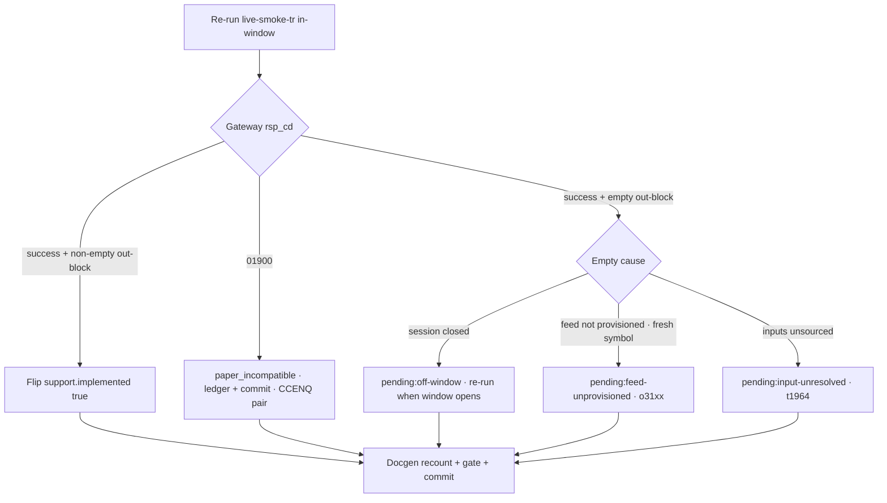

# feat: Implement wave — 17 Tracked TRs (KRX-night, F/O, overseas, ELW)

## Summary

Flip up to 10 of 17 already-Tracked TRs to Implemented by re-running their existing
Paper Live Smokes in-window and flipping only on a clean non-empty result, while
recording the 7 expected non-flips under their correct disposition. The callable
Rust, dual-registered `{TR}_POLICY` consts, and `live_smoke_<tr>` harnesses are
verified present on `main` for all 17 — this wave authors no structs; it smokes,
flips metadata + docgen counts, and dispositions the rest.

---

## Problem Frame

23 candidate TRs are already Tracked (metadata, `tr-index` entries, normalized
baselines, callable Rust, policy consts, and smoke harnesses all exist). The 6 not
in this wave are dispositioned under Scope Boundaries. For the recommended 17, the
only rung left is Tracked → Implemented: re-run each Paper Live Smoke in-window and
flip the metadata + docgen counts on a non-empty result.

Three facts shape the yield. **Timing-bound:** the KRX-night trio
(`t8455`/`t8460`/`t8463`) only returns data during the `krx_extended` window
(~18:00–05:00 KST), and the six overseas-stock reads only during the US regular
session — so the wave must run while both windows are open, and off-window empties
are a re-run condition, not a defect. **Two settled non-flips:** `CCENQ10100` and
`CCENQ90200` return a terminal gateway `01900` regardless of window (ledger §12);
they are authored for callability but carry no flip expectation. **Five PENDING-risk
reads:** the old generated SDK at `korea-broker-sdk-ls` certified `o31xx` and `t1964`
at Transport level only — request shapes are clean but no data frame was ever
decoded — so the empty overseas-futures feed and empty ELW board are real, not
wire-shape bugs.

This plan was preceded by a brainstorm (see `origin`); its WHAT (which 17, the
disposition policy, the success bar) is carried forward. This plan adds the HOW: the
smoke-and-flip sequence, the o31xx symbol refresh pre-flight, and the docgen-count
mechanics.

---

## Requirements

**Scaffolding (verified present on `main` — verify, do not re-author)**

- R1. Callable Rust for all 17 (request/response structs matching each TR's
  normalized baseline, in the owner_class module) exists. `account` holds the CCENQ
  pair; `market_session` holds the F/O, overseas, and `t1964` ELW reads. Verify; do
  not author a second copy.
- R2. Each `{TR}_POLICY` const is registered in **both** policy cross-check lists —
  the `policies` array in `crates/ls-core/tests/policy_index_crosscheck.rs` and the
  `slice_rest_policies_are_non_order_rest` list in
  `crates/ls-core/src/endpoint_policy.rs`. Verify; do not duplicate.
- R3. Numeric request-body fields serialize as JSON numbers via `string_as_number`
  (`t8463.cnt`, `g3102.readcnt`/`cts_seq`, `g3190.readcnt`); response fields use the
  tolerant `string_or_number`. Verify.

**Smoke and flip discipline (the actionable work)**

- R4. Each `make live-smoke-<tr>` / `live_smoke_<tr>` harness re-runs against the real
  LS paper gateway with smoke-map inputs. Stale inputs (the o31xx 2023-expiry symbols)
  are refreshed before re-running.
- R5. A TR flips to `support.implemented: true` only on a smoke that returns a
  non-empty data-bearing response; the smoke asserts non-empty before calling
  `record()`.
- R6. A TR whose smoke returns empty lands PENDING (callable, never dropped),
  recorded with the cause that determines its recovery path: `pending:off-window`
  (recovers on an in-window re-run — KRX-night trio, overseas-stock);
  `pending:feed-unprovisioned` (a re-run does not recover it — o31xx);
  `pending:input-unresolved` (needs new inputs, not a re-run — `t1964` filter enums).
- R7. A TR whose gateway response is `01900` is dispositioned `paper_incompatible`
  (the `facets.paper_incompatible: true` already set on the CCENQ pair), distinct
  from PENDING.

**Gate and docs**

- R8. `make docs`, `cargo test`, `cargo test -p ls-core`, and `make docs-check` pass
  before any commit; the tree never commits red.
- R9. Docgen counts move consistently with the number of TRs actually flipped:
  `reference.len()` (currently 94) increments by one per flip, and each flipped TR
  code is added to the `banner_trs` list (they stay non-recommended this wave).

---

## Key Technical Decisions

- **Smoke-and-flip, verify don't author.** Research confirmed all 17 are fully
  scaffolded on `main` (callable Rust, dual-registered consts, smoke harnesses + make
  targets). The wave re-runs smokes and flips what returns non-empty; it writes no new
  structs. If verification finds a gap, that TR drops out of the flip set and is
  flagged — it does not trigger authoring inside this wave.
- **The Implemented bar is "clean non-empty smoke."** No TR flips on an empty board or
  empty out-block to grow the count. The smoke asserts non-empty before `record()`;
  empty results route to PENDING per R6.
- **The flip is surgical.** Only `metadata/trs/<tr>.yaml` `support.implemented: false →
  true` changes per flip (`recommended` stays false, no recommendation block, no
  evidence YAML). PENDING and `paper_incompatible` carry **no** metadata field beyond
  the already-set `paper_incompatible` facet — their cause is recorded in
  `metadata/PROVISIONALITY-LEDGER.md` and the commit message, matching the existing
  convention.
- **Refresh o31xx symbols via the `o3101` master before dispositioning.** The
  registered `CUSN23`/`ADM23`/`HSIM23` are 2023-expiry; an expired symbol returns
  success + empty, indistinguishable from an unprovisioned feed. Resolve current
  front-month symbols from `o3101` (`overseas_futures_master`, non-empty on paper)
  first — only then does an empty o31xx out-block justify `pending:feed-unprovisioned`.
- **`t1964` keeps its standalone placeholder owner_class this wave.** The KTD3
  `market_session` correction lands only on a confirming non-empty smoke; the expected
  `pending:input-unresolved` outcome leaves the placeholder in place.
- **Docgen recount is a single consolidation step.** `reference.len()` and `banner_trs`
  depend on the actual flip total, known only after all contingent smokes resolve, so
  the count bump + `make docs` regen happen once at the end, not per flip.

---

## High-Level Technical Design

The per-TR decision gate (R5/R6/R7), applied by each smoke re-run:

The wave splits into two judged-separately sets (per U8's success-bar evaluation):
**contingent flips (10)** — the KRX-night trio, `t2106`, six overseas-stock — and **expected
non-flips (7)** — the CCENQ pair (`paper_incompatible`), four o31xx
(`feed-unprovisioned`), and `t1964` (`input-unresolved`).

---

## Implementation Units

Units are dependency-ordered. U1 is a pre-flight gate; U2–U4 are the contingent
flips; U5–U7 are the faithful dispositions; U8 consolidates docgen + gate + the
success-bar evaluation. Each flip/disposition unit independently edits metadata or the
ledger; U8 is the single docgen recount.

### U1. Verify scaffolding and refresh o31xx symbols

**Goal:** Confirm the verify-don't-author premise per TR and resolve current
front-month overseas-futures symbols so the o31xx smokes are diagnostic.

**Requirements:** R1, R2, R3, R4

**Dependencies:** none

**Files:**
- `crates/ls-sdk/src/market_session/mod.rs` (read — confirm structs + handles)
- `crates/ls-sdk/src/account/mod.rs` (read — confirm CCENQ structs + handles)
- `crates/ls-core/src/endpoint_policy.rs` (read — confirm consts + non-order list)
- `crates/ls-core/tests/policy_index_crosscheck.rs` (read — confirm `policies` array)
- `crates/ls-sdk/tests/live_smoke.rs` (read — confirm 17 `live_smoke_<tr>` fns; update
  o31xx symbol inputs)
- `.agents/skills/promote-tr/references/smoke-map.md` (update o31xx symbol rows)

**Approach:** For all 17, confirm the callable handle, dual-registered policy const,
and smoke harness exist; any TR with a gap drops from the flip set and is flagged in
the wave notes (does not trigger authoring here). Then run `make live-smoke-o3101` (or
the `overseas_futures_master` handle) to fetch a non-empty master list and read
current front-month `symbol` codes for the o31xx products (crude, the ADM/HSIM
underlyings). Replace the stale `CUSN23`/`ADM23`/`HSIM23` inputs wherever the o31xx
smokes source them (`live_smoke.rs` literals and/or `smoke-map.md`). The exact
mechanism — env var vs. literal — follows how each o31xx smoke currently reads its
symbol; resolve at implementation time.

**Patterns to follow:** the `o3101` smoke at `crates/ls-sdk/tests/live_smoke.rs`
(`overseas_futures_master`) for the master-read shape; existing o31xx smoke input
wiring for where the symbol enters.

**Test scenarios:**
- `o3101` master read returns a non-empty out-block on paper; at least one current
  front-month symbol per o31xx product is extracted. Verification: the resolved symbols
  are not 2023-expiry.
- Covers R1/R2/R3. Each of the 17 has a confirmed handle, a `{TR}_POLICY` const in both
  cross-check lists, and a `live_smoke_<tr>` fn. Any missing item is listed in the wave
  notes.
- The numeric-field TRs (`t8463`, `g3102`, `g3190`) carry `string_as_number` on the
  flagged fields. Verification: grep confirms the serializer attribute is present.
- Test expectation: no new behavioral tests — this unit verifies existing scaffolding
  and updates smoke inputs; the smoke re-runs in later units exercise the change.

**Verification:** `cargo test -p ls-core` stays green (consts validate against the
metadata index); the o31xx smoke inputs reference current contracts.

### U2. KRX-night trio smoke-and-flip (t8455, t8460, t8463)

**Goal:** Flip `t8455`, `t8460`, `t8463` to Implemented on in-window non-empty smokes.

**Requirements:** R4, R5, R6

**Dependencies:** U1

**Files:**
- `metadata/trs/t8455.yaml`, `metadata/trs/t8460.yaml`, `metadata/trs/t8463.yaml`
  (`support.implemented: false → true` on a clean smoke)
- `crates/ls-sdk/tests/live_smoke.rs` (re-run only; no edit unless a smoke assertion is
  wrong)

**Approach:** Run `make live-smoke-t8455` (`gubun=NF`), `make live-smoke-t8460`
(`yyyymm`=near month, `gubun=G`), `make live-smoke-t8463` (`tm_rng=N`/`fot_clsf_cd=F`/
`bsc_asts_id=101`, `cnt` numeric) while the `krx_extended` window is open. Each smoke
asserts a non-empty out-block before `record()`. On a non-empty result, flip
`support.implemented` to `true`. On empty (window closed at run time), leave Tracked
and record `pending:off-window` per R6.

**Patterns to follow:** the `implement-tr` recipe Step 4 gate boundary; sibling
night-derivatives smoke assertions already in `live_smoke.rs`.

**Test scenarios:**
- Covers AE1. `t8460` smoked in-window returns a non-empty option board → flips. The
  same smoke after ~05:00 KST returns empty → stays Tracked, `pending:off-window`,
  not a failure.
- `t8463` smoke serializes `cnt` as a JSON number (no `IGW40011`); a non-empty
  investor-timeslot block flips it.
- `t8455` non-empty master block flips it; empty master block off-window → PENDING.
- Test expectation: the live smokes are the behavioral check; no offline test changes
  unless a non-empty assertion is found missing.

**Verification:** each flipped TR shows `support.implemented: true`; each non-flip is
recorded `pending:off-window`. `cargo test -p ls-core` green after metadata edits.

### U3. t2106 F/O price-memo smoke-and-flip

**Goal:** Flip `t2106` to Implemented only on a populated price-memo out-block.

**Requirements:** R4, R5, R6

**Dependencies:** U1

**Files:**
- `metadata/trs/t2106.yaml` (`support.implemented: false → true` on a populated memo)
- `crates/ls-sdk/tests/live_smoke.rs` (re-run; confirm the non-empty-memo assertion)

**Approach:** Run `make live-smoke-t2106`; the smoke self-sources contract `code` from
`t8467` and is anytime-F/O. The flip gate is a populated memo out-block (memo-row count
> 0), not a bare `rsp_cd=00000`. On an empty memo array, leave Tracked and record
PENDING.

**Patterns to follow:** the existing `t2106` smoke's `outblock1.is_empty()` guard
before `record()`.

**Test scenarios:**
- Covers AE5. `t2106` with a populated price-memo (memo-row count > 0) → flips. A
  success response with an empty memo array → stays PENDING, never flips.
- The `t8467 → t2106` discovery edge resolves a contract `code` at smoke time.
- Test expectation: live smoke is the behavioral check; verify the memo-count guard
  exists before `record()`.

**Verification:** `t2106` either shows `support.implemented: true` (populated memo) or
stays Tracked with a recorded empty-memo PENDING; the empty-memo path never flips.

### U4. Overseas-stock sextet smoke-and-flip (g3101–g3104, g3106, g3190)

**Goal:** Flip the six overseas-stock reads on in-window non-empty smokes.

**Requirements:** R4, R5, R6

**Dependencies:** U1

**Files:**
- `metadata/trs/g3101.yaml`, `g3102.yaml`, `g3103.yaml`, `g3104.yaml`, `g3106.yaml`,
  `g3190.yaml` (`support.implemented: false → true` per clean smoke)
- `crates/ls-sdk/tests/live_smoke.rs` (re-run)

**Approach:** Run `make live-smoke-g3101`..`g3106` and `g3190` while the US regular
session is open, with `82`/`TSLA` (and US exchange `2` / monthly `gubun=4` per the
smoke map). `g3102` carries numeric `readcnt`/`cts_seq`; `g3190` carries numeric `readcnt`. Each
smoke asserts its
canonical non-empty field (`price`, `korname`, Object-Array rows) before `record()`.
Flip each that returns non-empty; off-window empties stay Tracked
(`pending:off-window`).

**Patterns to follow:** the per-field non-empty guards already in the g31xx smokes
(`trd_p`/`price`/`korname`/array-len checks).

**Test scenarios:**
- Covers AE4. `g3101` smoked with `82`/`TSLA` in US session → non-empty `price` →
  flips.
- `g3102` (`readcnt`/`cts_seq`) and `g3190` (`readcnt`) serialize their numeric fields
  as JSON numbers (no `IGW40011`); non-empty Object-Array rows flip them.
- `g3103` monthly bars, `g3104` `korname`, `g3106` order-book `price` each flip on
  their non-empty canonical field.
- Each read smoked off US-session returns empty → `pending:off-window`, no flip.
- Test expectation: live smokes are the behavioral check.

**Verification:** count of flipped overseas-stock reads is recorded (the ≥4/6 success
bar is evaluated in U8); each non-flip carries `pending:off-window`.

### U5. o31xx feed-unprovisioned disposition (o3105, o3106, o3125, o3126)

**Goal:** Re-run the four overseas-futures smokes with refreshed symbols and record
`pending:feed-unprovisioned` on an empty out-block.

**Requirements:** R4, R6

**Dependencies:** U1 (refreshed symbols)

**Files:**
- `metadata/PROVISIONALITY-LEDGER.md` (record the four `pending:feed-unprovisioned`
  rows)
- `crates/ls-sdk/tests/live_smoke.rs` (re-run with refreshed symbols)

**Approach:** With the current front-month symbols from U1, run `make live-smoke-o3105`
(`trd_p`), `o3106` (`price`), `o3125` (`mktgb=F`, `trd_p`), `o3126` (`mktgb=F`,
`price`). An empty out-block now means the paper feed is unprovisioned (not a stale
symbol) → record `pending:feed-unprovisioned`; these do **not** flip. If any unexpectedly
returns non-empty, it flips per R5 (the bar is the same).

**Patterns to follow:** the PROVISIONALITY-LEDGER o31xx rows; `implement-tr` Step 4
PENDING boundary.

**Test scenarios:**
- Covers AE3. `o3105` with a current front-month symbol returns an empty out-block →
  `pending:feed-unprovisioned`, callable, no flip. With a stale 2023 symbol the empty
  result is uninformative and must not be recorded as feed-unprovisioned — U1 prevents
  this.
- Each of the four stays Tracked; the ledger records the cause.
- Test expectation: no metadata flip; live smoke + ledger entry are the artifacts.

**Verification:** none of the four flips; each carries a `pending:feed-unprovisioned`
ledger row keyed to a fresh symbol; metadata `support.implemented` stays false.

### U6. t1964 input-unresolved disposition

**Goal:** Re-run the ELW-board smoke and record `pending:input-unresolved`, keeping the
standalone placeholder owner_class.

**Requirements:** R4, R6

**Dependencies:** U1

**Files:**
- `metadata/PROVISIONALITY-LEDGER.md` (retain/record the `t1964` input-unresolved row)
- `crates/ls-sdk/tests/live_smoke.rs` (re-run)

**Approach:** Run `make live-smoke-t1964`; it self-sources `item` from `t9905` and uses
the broad `"0"` filter defaults. The expected result is an empty board (as the old SDK
saw) → record `pending:input-unresolved`, leave Tracked, keep the standalone
placeholder owner_class (no KTD3 `market_session` flip without a non-empty smoke).
Retain the `t9905 → t1964` discovery edge unconfirmed.

**Patterns to follow:** the PROVISIONALITY-LEDGER `t1964` filter-default row.

**Test scenarios:**
- Covers AE2. `t1964` with broad `"0"` filter defaults → empty board → ships PENDING
  (input-unresolved), callable, discovery edge retained unconfirmed.
- owner_class stays the standalone placeholder; no `market_session` flip.
- Test expectation: no flip; ledger row + retained edge are the artifacts.

**Verification:** `t1964` stays Tracked with `pending:input-unresolved`; owner_class
unchanged; `t9905 → t1964` edge retained.

### U7. CCENQ pair paper_incompatible confirmation

**Goal:** Confirm `CCENQ10100` and `CCENQ90200` remain Tracked `paper_incompatible`
with no flip.

**Requirements:** R7

**Dependencies:** none

**Files:**
- `metadata/trs/CCENQ10100.yaml`, `metadata/trs/CCENQ90200.yaml` (verify
  `facets.paper_incompatible: true`; no flip)
- `crates/ls-sdk/tests/live_smoke.rs` (optional single re-confirm run — see Open
  Questions)

**Approach:** Both return terminal `01900` regardless of the night window (ledger §12).
Verify `facets.paper_incompatible: true` is set and `support.implemented` stays false.
Whether to re-run each smoke once to re-confirm the `01900` or to verify the facet
without a live call is an Open Question; either way, no metadata change and no flip.

**Patterns to follow:** PROVISIONALITY-LEDGER §12.

**Test scenarios:**
- Covers R7. Each CCENQ smoke (if re-run) returns `01900` → `paper_incompatible`, not
  PENDING, no flip.
- Both stay Tracked with the facet set.
- Test expectation: no flip; verification only.

**Verification:** both show `paper_incompatible: true`, `support.implemented: false`;
neither is in the flip set.

### U8. Docgen recount, gate, and success-bar evaluation

**Goal:** Bump docgen counts to match the actual flip total, regenerate docs, pass the
full gate, and evaluate the wave against the success bar.

**Requirements:** R8, R9

**Dependencies:** U2, U3, U4, U5, U6, U7

**Files:**
- `crates/ls-docgen/src/lib.rs` (`reference.len()` literal at ~`:997`; `banner_trs`
  list at ~`:911-927`)
- `docs/reference/*.md`, `docs/tr-dependencies/*.md` (regenerated by `make docs`)
- `metadata/PROVISIONALITY-LEDGER.md` (ledger entries finalized)

**Approach:** After all contingent smokes resolve, count the actual flips. Increment
`reference.len()` by that count (from 94) and add each flipped TR code to `banner_trs`
(all stay non-recommended). Run `make docs` to regenerate, then the full gate:
`cargo test`, `cargo test -p ls-core`, `make docs-check`. Evaluate the success bar:
the wave succeeds when the KRX-night trio **and** ≥4/6 overseas-stock flipped
in-window, with every non-flip recorded under a correct R6/R7 cause. Fewer contingent
flips triggers a re-window retry (see Open Questions for partial-window landing), not a
closeout.

**Patterns to follow:** prior implement-wave docgen count bumps; the gate sequence in
AGENTS.md.

**Test scenarios:**
- `reference.len()` equals 94 + (flip count); the docgen count test passes.
- Each flipped TR code appears in `banner_trs`; the banner test passes.
- Covers R8. `make docs-check` reports no drift; `cargo test` and `cargo test -p
  ls-core` green.
- Success bar: KRX trio (3/3) + ≥4/6 overseas flipped → wave succeeds; otherwise
  re-window.
- Test expectation: the gate is the behavioral check; count literals must match the
  actual flip total exactly.

**Verification:** the full gate passes green; docgen counts match the flip total; the
success bar verdict (succeed / re-window) is recorded.

---

## Acceptance Examples

- AE1. Covers R5, R6. A KRX-night TR (`t8460`) smoked in-window returns a non-empty
  option board → flips to Implemented. The same smoke after ~05:00 KST returns empty →
  lands `pending:off-window`, not Implemented and not a failure.
- AE2. Covers R6. `t1964` smoked with the broad `"0"` filter defaults returns an empty
  board → ships `pending:input-unresolved`, callable, with the `t9905 → t1964` edge
  retained unconfirmed.
- AE3. Covers R6. An overseas-futures TR (`o3105`) smoked with a **current front-month
  symbol** returns an empty out-block → ships `pending:feed-unprovisioned`. Smoked with
  a stale 2023-expiry symbol the empty result is uninformative and must not be recorded
  as feed-unprovisioned — refresh the symbol and re-run.
- AE4. Covers R5. An overseas-stock TR (`g3101`) smoked with `82`/`TSLA` while the US
  regular session is open returns a non-empty out-block → flips to Implemented.
- AE5. Covers R5. `t2106`'s non-empty gate is the populated price-memo out-block
  (memo-row count > 0), not a bare `rsp_cd=00000`. A success response with an empty
  memo array → lands PENDING, never flips.

---

## Scope Boundaries

This wave covers the recommended 17 TRs: 10 contingent flips and 7 faithfully-recorded
non-flips. It authors no new Rust — all 17 are verified scaffolded on `main`.

### Deferred to Follow-Up Work

- `t1852` / `t1856` — require an unsourced `sFileData` screening blob (~26.8 KB); stay
  Tracked PENDING until the blob is sourced.
- `t3102` (news body) and `t8430` (stock list) — unblocked standalone reads, simply not
  in this batch; eligible for a later wave.
- Cracking the o31xx paper feed or sourcing the `t1964` ELW-board filter enums — the
  old source confirms neither is solvable from existing material.

### Outside this wave

- `t1860` — HELD: a side-effectful realtime-subscription control, not a read-only
  query; not part of any read wave.
- `CSPAT00601` — cash-equity order submission; deferred to the order-safety package.

---

## Open Questions

- **Partial-window landing.** If the success bar is not met (KRX-night trio and ≥4/6
  overseas-stock in-window), do the TRs that did flip still land this wave, or does the
  whole wave hold for one clean re-window? The brainstorm says "re-window retry, not
  closeout" but does not settle whether successful flips ship in the meantime. Resolve
  before U8 commits.
- **CCENQ verification depth (U7).** Re-run each CCENQ smoke once to re-confirm the
  terminal `01900`, or verify `paper_incompatible` is already set and skip the live
  call? Either way no flip; this only affects whether a confirming smoke line is
  recorded.
- **o31xx front-month selection (U1).** The rule for picking the *current front-month*
  contract per underlying (crude, ADM, HSIM) from the `o3101` master is unspecified — a
  wrong pick silently mis-files an o31xx as `feed-unprovisioned` (AE3's failure mode).
  The `o3101` normalized baseline carries structured listing-month fields (`LstngYr`,
  `LstngM`, `ApplDate`), but `O3101OutBlock` does not currently decode them — so two
  paths exist: (a) string-parse the `(YYYY.MM)` suffix from `symbol_nm`, or (b) extend
  `O3101OutBlock` to decode `LstngYr`/`LstngM` and re-project via
  `make api-drift-renormalize`. Pick one as the U1 heuristic before the o31xx smokes
  re-run.
- **`t2106` reachability.** Whether `t2106` ever returns a populated price-memo in paper
  is a confirm-against-live check (the empty-memo disposition is settled as PENDING per
  AE5). Resolved at smoke time in U3.

---

## Dependencies / Assumptions

- **Session windows must be open at smoke time.** KRX-night TRs need the `krx_extended`
  window (~18:00–05:00 KST); overseas-stock reads need the US regular session. This
  gates Implemented yield, not correctness; off-window empties are re-run conditions.
- **o31xx smoke symbols are stale and must be refreshed (U1) before dispositioning.**
  The registered `CUSN23`/`ADM23`/`HSIM23` are 2023-expiry; an expired symbol returns
  success + empty, indistinguishable from an unprovisioned feed.
- **Numeric request-body fields must serialize as JSON numbers** (`t8463.cnt`,
  `g3102.readcnt`/`cts_seq`, `g3190.readcnt`) via `string_as_number`, or the gateway
  returns `IGW40011`. Use `make raw-probe` to A/B a request shape if an `IGW40011`
  appears (see Sources).
- **Old-SDK port source.** `korea-broker-sdk-ls` generated structs corroborate the
  o31xx/`t1964` **request** shapes; both are Transport-only there (no data frame ever
  decoded), so the request serialization is clean but the response structs rest on the
  normalized baseline, with no expectation of non-empty data.

---

## Sources / Research

- `metadata/trs/<tr>.yaml`,
  `crates/ls-trackers/baselines/api-drift/normalized/trs/<tr>.json` — per-TR metadata
  and wire-shape source of truth for all 17.
- `.agents/skills/implement-tr/SKILL.md` — the Tracked → Implemented recipe: surgical
  `support.implemented` flip (Step 6), Paper Live Smoke gate boundary (Step 4), dual
  cross-check registration (Step 1).
- `.agents/skills/promote-tr/references/smoke-map.md` — smoke targets and registered
  inputs; the o31xx symbol rows updated in U1.
- `crates/ls-docgen/src/lib.rs` — `reference.len()` test (~`:997`, currently 94) and
  `banner_trs` list (~`:911-927`); the counts moved in U8.
- `crates/ls-core/tests/policy_index_crosscheck.rs` +
  `crates/ls-core/src/endpoint_policy.rs` — the two policy cross-check lists validated
  by `cargo test -p ls-core`.
- `crates/ls-sdk/tests/live_smoke.rs` — the 17 `live_smoke_<tr>` fns; the non-empty
  guards before `record()` that enforce R5; the `o3101` master read used to refresh
  o31xx symbols.
- `metadata/PROVISIONALITY-LEDGER.md` — disposition convention (PENDING sub-causes,
  CCENQ §12, `t1964` filter-default block, discovery edges).
- `korea-broker-sdk-ls` — `crates/core/src/generated/{overseas_futures,stock}.rs`
  (ported wire shapes), `RELEASE_CERTIFICATION_STATUS.md` + `CONCEPTS.md`
  (Transport-only certification for o31xx/`t1964`),
  `scripts/certification_fixture_overrides.json` (`t1964` default-`0` filter values).
- `docs/solutions/integration-issues/ls-gateway-igw40011-numeric-request-fields.md` —
  numeric request-body serialization gotcha + `make raw-probe` A/B usage.
