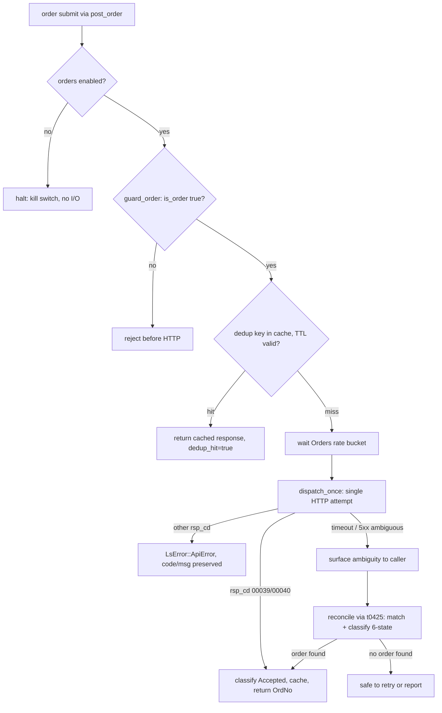
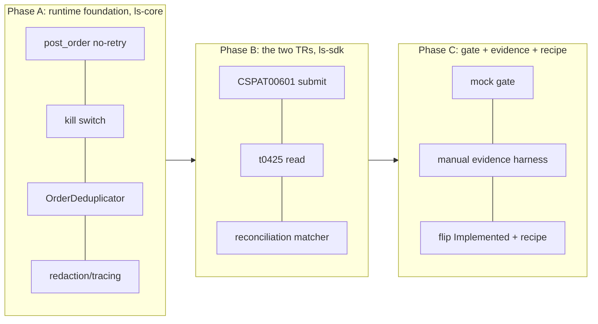

# feat: Order Runtime — First Package (CSPAT00601 + t0425)

## Summary

Build the first order-execution runtime: a no-retry `post_order` dispatch path, an `OrderDeduplicator`, a global kill switch, reconciliation, the order redaction/tracing contract, and a guarded manual-evidence harness — behind two TRs that ship together, `CSPAT00601` (domestic-stock cash submit) and `t0425` (order/execution inquiry). Both earn Implemented through a live guarded paper-order matrix, not the automated Paper Live Smoke. The work retires the ADR 0008 deferral on a successful in-window evidence run (see origin: `docs/brainstorms/2026-06-25-order-runtime-first-package-requirements.md`).

---

## Problem Frame

Every Implemented TR to date is read-only and rides `Inner::post` / `Inner::post_paginated`, which retry up to four times on 5xx/transport errors via `backon`. That retry loop is exactly the hazard for orders: a transport timeout on a submit is ambiguous — the exchange may or may not have filled — so a blind retry risks a double fill. The runtime carries only the seam today (`EndpointPolicy.is_order`, `guard_non_order()`); none of the machinery the safety contract (`docs/design/order-safety-design.md`, ADR 0008) requires exists. `CSPAT00601` is Tracked-not-implemented; its reconciliation companion `t0425` is not even Tracked. This plan builds the package and flips both TRs.

---

## Requirements

Traced to the origin requirements doc (R1–R13). IDs below mirror origin R-IDs.

**Order dispatch runtime**

- R1. `post_order` issues exactly one network attempt (no `backon` retry), charges `RateLimitCategory::Orders`, and rejects a non-order policy before any HTTP call; an ambiguous failure surfaces to caller and reconciliation rather than retrying.
- R2. A global kill switch halts all order dispatch before dedup, rate limiting, or HTTP I/O; non-order dispatch is unaffected; reconciliation must not silently re-enable it.
- R3. `OrderDeduplicator` keys on `SHA256(account_no + ":" + tr_code + ":" + canonical request JSON)` (granularity pending the §2 Open Question), 300s TTL, per-client; cache hit bypasses rate limiting and HTTP; serialization failure is fail-closed; eviction is an opportunistic write-path sweep holding no per-entry guard.
- R4. An order success predicate distinct from the read predicate classifies an acknowledgement as Accepted, keeps a rejected order as `LsError::ApiError` with code/message preserved; built and mock-gated against the `00039`/`00040` seed, then confirmed-or-amended by the evidence run, with a widened set forcing a mock-gate re-run.
- R5. Order dispatch uses `instrument(skip_all)`; spans record only `tr_code`/`path`/`category`/`dedup_hit`, never credentials or request body; response types are fail-closed by default (no logging sink unless an operator surfaces them); the reconciliation local-evidence record carries the same at-rest posture (account redacted/hashed, known location, retention bound).

**The two TRs**

- R6. `CSPAT00601` is callable as a domestic-stock cash submit, `owner_class: orders`, policy `is_order: true`, routed exclusively through `post_order`.
- R7. `t0425` is raised raw→Tracked then Implemented as the read-only order/execution inquiry used for reconciliation.
- R8. A reconciliation path, after an ambiguous send, queries `t0425` and matches candidate orders by account, symbol, side, quantity, price, time window, and any order number, classifying the outcome as Accepted / Rejected / Duplicate / Modified / Canceled / Unknown; it retries only after proving no matching order was accepted, or on explicit operator override.

**Gate and manual evidence**

- R9. The automated gate proves order logic — no-retry, dedup and eviction, the predicate, reconciliation, the kill switch — entirely against mocks; it never submits a live order.
- R10. The manual-evidence harness fails closed: explicit TR selection with no default, parameters validated before SDK construction, invalid params / missing order numbers produce structured "not certified" evidence, runs are paper-only, recorded evidence excludes credentials and account-sensitive data.
- R11. Both TRs flip to Implemented only after a guarded paper-order evidence run covering the matrix (resting far-from-market limit buy and sell, one marketable order, one deliberate rejection), following an owned place→observe→teardown sequence with cleanup and an unexpected-fill branch.

**Metadata and recipe**

- R12. Each new `is_order: true` REST policy registers in the policy-index crosscheck only; the `t0425` non-order policy registers in both the crosscheck and `slice_rest_policies_are_non_order_rest`. (This sharpens origin R12, whose phrasing read ambiguously; an `is_order: true` policy must be excluded from the non-order list or that test fails.)
- R13. A frozen `implement-order-tr` recipe captures the order-class path (no automated smoke, guarded manual evidence, no-retry dispatch), mirroring `implement-tr` and `implement-realtime-tr`.

---

## Key Technical Decisions

- KTD1. **`post_order` is a separate dispatch path, not a flag on `post`.** `Inner::post` calls `post_with_retry` (`backon::ExponentialBuilder`, 4 attempts, retries 5xx/transport per `is_retryable`). `post_order` makes exactly one `dispatch_once` call, waits `RateLimitCategory::Orders` once, calls a new `guard_order()` (verifies `is_order == true`, the inverse of `guard_non_order`), and uses `instrument(skip_all)`. **`dispatch_once` must be modified, not merely reused:** it currently hard-codes `rsp_cd_is_success` and converts any non-match to `ApiError` *before* `Res` deserializes, so the order predicate must be threaded into that classify step (a predicate parameter or a `policy.is_order` branch) — otherwise every `00039`/`00040` ack becomes a spurious rejection. Keeping the path separate leaves all non-order dispatch untouched. (origin R1; `crates/ls-core/src/inner.rs:242-257,276-368`)
- KTD2. **Distinct order success predicate, seeded on `00039`/`00040`, fail-safe toward Unknown.** The read predicate `rsp_cd_is_success` accepts `{00000, "", 00136, 00707}` — orders must not reuse it. The order predicate accepts the acknowledgement codes `00039` (sell) / `00040` (buy) as Accepted and a recognized rejection code as `ApiError`. **An unrecognized 2xx `rsp_cd` (including `00000`) classifies ambiguous/Unknown → reconciliation, never Rejected** — so an accepted-but-uncoded order is never resubmitted (a double-fill guard, since the read path trusts `00000`). The seed is the mock-gate baseline; the evidence run confirms or amends it, a widened live set forces a mock-gate re-run, and if the run lands Pending the shipped predicate is marked seed-only/unconfirmed (KTD7). Whether `00000` is a true accept is the central unresolved code (Open Questions). (origin R4; `crates/ls-core/src/inner.rs:56-61`, `docs/design/ls-gateway-response-semantics.md`)
- KTD3. **Global kill switch for v1; per-account deferred.** An `AtomicBool` on the client/`Inner`, checked as the first step of `post_order` before dedup, rate limiting, and I/O. Global is the correct emergency-halt default (one operator "stop" halts everything); per-account blast control is a follow-up. Reconciliation reads but never re-enables it. (origin R2; resolves origin Outstanding Question)
- KTD4. **`OrderDeduplicator` per the §2 contract.** `DashMap` keyed `SHA256(account_no:tr_code:canonical-request-JSON)` (the leading default; the §2-granularity Open Question may narrow the key to `strong_order_fields`, and U3's test asserts whichever identity is chosen), 300s TTL, per-client; cache hit returns the cached response (`dedup_hit=true`) and bypasses rate limiting + HTTP; serialization failure is fail-closed. Eviction is an opportunistic write-path sweep (`insert` calls a monotonic `sweep_expired_if_due`; one thread wins an atomic timestamp and runs one bounded `retain`) that **holds no per-entry guard during `retain`** — the carried-over deadlock rule. (origin R3; `docs/design/order-safety-design.md` §2 — note that §2 is authoritative; the solution-doc path it cites does not exist in-repo)
- KTD5. **`t0425` routes through the existing `post_paginated`, exposed on the order handle.** It is a read (`is_order: false`, `owner_class: paginated`, `market_data` bucket, self-paginated via `cts_ordno`) but surfaced as a reconciliation method on the new `Orders` handle so the order package stays cohesive. `CSPAT00601_POLICY` (`is_order: true`) registers in `policy_index_crosscheck` only; `T0425_POLICY` registers in both crosscheck and `slice_rest_policies_are_non_order_rest`. (origin R7, R12; resolves origin Outstanding Question)
- KTD6. **Numeric request fields serialize as JSON numbers.** `CSPAT00601`'s numeric *request* fields are `OrdQty` and `OrdPrc`; without `#[serde(serialize_with = "ls_core::string_as_number")]` the gateway returns `IGW40011`. (`RecCnt` is a numeric *response* field — decode it with `string_or_number`, not `string_as_number`.) Read out-block keys and array-ness from the raw capture, not the normalized baseline. (origin R6; `docs/solutions/integration-issues/ls-gateway-igw40011-numeric-request-fields.md`)
- KTD7. **Implemented gate for orders is a live guarded paper order, not an automated smoke.** Deferral-retirement is conditional: a successful in-window matrix flips both TRs and marks ADR 0008 superseded; if the run lands Pending, the machinery ships but ADR 0008 stays open as machinery-complete, evidence-pending. `order-safety-design.md` is updated to record this gate. (origin R11, Key Decisions)
- KTD8. **The evidence harness fetches the daily price band via `t1101` to build valid resting orders.** Korean equities reject an order priced outside the daily limit band (`uplmtprice` / `dnlmtprice`). `t1101` (Implemented + Recommended, input `shcode`) returns both — already surfaced by the existing T1101 response struct (`crates/ls-sdk/src/market_session/mod.rs`), no remodeling needed. Resting orders are priced inside the band near the far edge (valid yet won't fill — buy near `dnlmtprice`, sell near `uplmtprice`); the deliberate-rejection scenario uses an out-of-band price for a deterministic price-limit rejection code. This resolves origin's "resting-limit price offset" open question.

---

## High-Level Technical Design

The order dispatch decision path is the load-bearing safety logic. A non-order TR never enters it; an order TR never leaves it.

Package layering — the runtime foundation lands before the TRs, which land before the gate/evidence:

---

## Implementation Units

Phased A (runtime foundation) → B (TRs + reconciliation) → C (gate, evidence, recipe).

### U1. No-retry `post_order` dispatch path + order success predicate

- **Goal:** A dedicated single-attempt order dispatch method with an order-specific success predicate.
- **Requirements:** R1, R4
- **Dependencies:** none
- **Files:** `crates/ls-core/src/inner.rs`, `crates/ls-core/src/endpoint_policy.rs`
- **Approach:** Add `Inner::post_order` mirroring `post` but dispatching once (no `post_with_retry`/`backon`), waiting `RateLimitCategory::Orders` once, and using `instrument(skip_all)`. Parameterize `dispatch_once`'s `rsp_cd` classification (predicate fn or `policy.is_order` branch) so the order path applies the order predicate inside `dispatch_once`, before `Res` deserialization — not after. Add `EndpointPolicy::guard_order()` (the inverse of `guard_non_order` — error if `!is_order`). Add an order success predicate (`rsp_cd_is_order_success`) accepting the seed set `{00039, 00040}`; route a recognized non-success code to `LsError::ApiError { code, message }` (message preserved), and an unrecognized 2xx code to ambiguous/Unknown (KTD2 fail-safe), never silently Rejected. Apply the order predicate at **both** `dispatch_once` classification sites — the 2xx body path and the non-2xx-status path (which today converts any non-empty `rsp_cd` to `ApiError`) — so an order ack on a non-2xx status routes Unknown, not unconditional `ApiError`. Do not reuse `rsp_cd_is_success`.
- **Patterns to follow:** `Inner::post` (`crates/ls-core/src/inner.rs:319-328`), `rsp_cd_is_success` (`inner.rs:56-61`), `guard_non_order` (`endpoint_policy.rs:56-67`).
- **Test scenarios:**
  - Happy: a `200` response with `rsp_cd=00040` classifies Accepted and deserializes to `Res` (assert it is NOT `ApiError` — proves the predicate runs inside `dispatch_once`); `rsp_cd=00039` likewise.
  - Error: `rsp_cd=00136`/`00707` are NOT order-success — each returns `ApiError` (proves the read predicate is not reused). An unrecognized 2xx code (e.g. `00000` under the seed) classifies ambiguous/Unknown, not Rejected (KTD2 fail-safe).
  - Error: a non-order policy passed to `post_order` returns the `guard_order` error before any HTTP.
  - Failure (no-retry): a `503` then-would-succeed sequence is dispatched once and surfaces the `503` ambiguity — assert exactly one HTTP attempt (the defining difference from `post`).
  - Edge: an order ack `rsp_cd` arriving on a non-2xx HTTP status routes ambiguous/Unknown, not Rejected (covers the second classification site).
- **Verification:** `post_order` exists, charges the Orders bucket once, and a `503` produces a single wiremock hit.

### U2. Global kill switch

- **Goal:** An operator emergency halt that stops all order dispatch before any side effect.
- **Requirements:** R2
- **Dependencies:** U1
- **Files:** `crates/ls-core/src/inner.rs` (+ client/config surface for `set_orders_enabled`)
- **Approach:** An `AtomicBool` (default enabled) on `Inner`/client. `post_order` reads it first, before dedup lookup, rate limiting, or I/O, returning a structured "orders disabled" error when off. `set_orders_enabled(bool)` toggles it. Non-order `post`/`post_paginated` never consult it. Global scope; per-account deferred (Open Questions).
- **Patterns to follow:** existing `Inner` field wiring (`inner.rs:77-87`).
- **Test scenarios:**
  - Covers AE4. Happy: orders disabled → `post_order` halts before the wiremock endpoint is hit (assert zero HTTP), while a `post` market-data read on the same `Inner` still succeeds.
  - Edge: re-enabling restores dispatch; toggling mid-session is observed on the next call.
- **Verification:** with orders disabled, an order submit performs no dedup insert and no HTTP; a non-order read is unaffected.

### U3. `OrderDeduplicator` + `LsError::DuplicateOrder`

- **Goal:** Idempotent submission within a TTL window, with the §2 eviction contract.
- **Requirements:** R3
- **Dependencies:** U1
- **Files:** new `crates/ls-core/src/order_dedup.rs`, `crates/ls-core/src/error.rs`, `crates/ls-core/src/inner.rs`, `crates/ls-core/src/lib.rs`
- **Approach:** A `DashMap`-backed cache keyed `SHA256(account_no:tr_code:canonical-request-JSON)`, 300s TTL, per-client. `post_order` consults it after the kill switch, before rate limiting: a live hit returns the cached response with `dedup_hit=true` (no rate limit, no HTTP); a miss dispatches and inserts. Serialization failure building the key is fail-closed (error, no dispatch). `insert` calls a monotonic `sweep_expired_if_due`; when the interval elapses one thread wins an atomic timestamp and runs one bounded `retain` — **with no DashMap entry guard held** (deadlock rule). Re-add `LsError::DuplicateOrder`.
- **Patterns to follow:** `string_or_number`/serde helpers (`crates/ls-core/src/lib.rs`); `docs/design/order-safety-design.md` §2 (authoritative).
- **Test scenarios:**
  - Covers AE1. Happy: identical request within 300s → cached response, `dedup_hit=true`, zero second HTTP.
  - Edge: a request differing only in `OrdQty` is a cache miss (distinct order).
  - Edge: TTL expiry → re-dispatch; an expired entry is evicted on the next write-path sweep.
  - Failure: a request whose canonical-JSON build fails returns an error and dispatches nothing.
  - Integration (concurrency): the `retain` sweep runs without holding a per-entry guard — a contended insert+sweep does not deadlock.
  - Security: the dedup key is never logged, traced, or persisted — only the `dedup_hit` bool is observable (the key embeds `account_no`).
- **Verification:** dedup hit bypasses rate limit and HTTP; sweep bounds memory without a background worker.

### U4. Order redaction / tracing contract (spans + responses)

- **Goal:** Credentials never reach spans; order response bodies are fail-closed by default.
- **Requirements:** R5
- **Dependencies:** U1
- **Files:** `crates/ls-core/src/inner.rs`
- **Approach:** `post_order` uses `instrument(skip_all)`; the order span records only `tr_code`/`path`/`category`/`dedup_hit`, never credentials or request body. Order response bodies reach no logging/tracing sink by default; surfacing them for evidence is an explicit operator action. (The reconciliation-record at-rest posture lives in U7, where the record is actually written.)
- **Patterns to follow:** `Self::record_request_span` (`inner.rs`), `docs/design/order-safety-design.md` §5.
- **Test scenarios:**
  - Happy: an order dispatch span carries `tr_code`/`path`/`category`/`dedup_hit` and none of app key, account number, access token, or request body.
  - Edge: a response body is not auto-emitted to any tracing sink absent an explicit surface call.
- **Verification:** span field inspection shows only the four allowed structural fields.

### U5. Raise `t0425` raw→Tracked

- **Goal:** `t0425` gains metadata + a projected baseline so it is observed for drift and implementable.
- **Requirements:** R7
- **Dependencies:** none (can land before U6/U7)
- **Files:** `metadata/trs/t0425.yaml`, `metadata/tr-index.yaml`, `crates/ls-trackers/baselines/api-drift/normalized/trs/t0425.json` (projected), `crates/ls-trackers/baselines/api-drift/manifest.json`, `crates/ls-docgen/src/lib.rs` (TRACKED_TRS), `crates/ls-trackers/tests/api_drift.rs`, `crates/ls-trackers/src/cli.rs`
- **Approach:** Follow `.agents/skills/track-tr/SKILL.md`. Author `metadata/trs/t0425.yaml` (mirror a paginated read exemplar; `owner_class: paginated`, `self_paginated: true` via `cts_ordno`, `rate_bucket: market_data`) and the `tr-index.yaml` entry, then `make api-drift-renormalize` to project the baseline (never hand-author it). Bump the five `116→117` count assertions: `TRACKED_TRS` array length in `crates/ls-docgen/src/lib.rs:677`, `maintained_tr_count` in `crates/ls-trackers/tests/api_drift.rs:106`, and `shapes.len()` at `crates/ls-trackers/src/cli.rs:1811,1876,2787`.
- **Execution note:** verify `git diff` on `normalized/trs/` shows only the new `t0425.json` before committing.
- **Test scenarios:** `cargo test -p ls-metadata -p ls-core` (metadata validation + policy crosscheck) passes; the five count assertions pass at 117; `make docs-check` clean. Test expectation: metadata/count validation, no behavioral test (tracking adds no callable code).
- **Verification:** `t0425` is Tracked; baseline projected; gate green.

### U6. `CSPAT00601` submit TR + `Orders` handle + policy

- **Goal:** A callable domestic-stock cash order submit routed through `post_order`.
- **Requirements:** R6, R12
- **Dependencies:** U1, U2, U3, U4
- **Files:** new `crates/ls-sdk/src/orders/mod.rs`, `crates/ls-sdk/src/lib.rs`, `crates/ls-core/src/endpoint_policy.rs`, `crates/ls-core/tests/policy_index_crosscheck.rs`
- **Approach:** Mirror the account module shape (`crates/ls-sdk/src/account/mod.rs`): a `CSPAT00601InBlock1` with `#[serde(rename)]` fields, a request wrapper, a response with `OutBlock1`/`OutBlock2` (carrying `OrdNo`) using `string_or_number` + `de_vec_or_single`. Model all nine required InBlock1 fields from the raw capture (`IsuNo`, `OrdQty`, `OrdPrc`, `BnsTpCode`, `OrdprcPtnCode`, `MgntrnCode`, `LoanDt`, `OrdCndiTpCode`, `MbrNo`) — the four `strong_order_fields` are only the dedup-identity subset, not the full body. The numeric request fields `OrdQty` and `OrdPrc` use `string_as_number` (KTD6). Add an `Orders` facade handle with `submit()` dispatching via `Inner::post_order`. Declare `CSPAT00601_POLICY` (`is_order: true`, `category: Orders`) and register it in `policy_index_crosscheck` **only** (not `slice_rest_policies_are_non_order_rest`), adding the const to both the `use` import block and the `policies` array in that test. Read wire field names/array-ness from the raw capture.
- **Patterns to follow:** `crates/ls-sdk/src/account/mod.rs:61-103,112-237,1344-1370`; `TOKEN_POLICY` const shape (`endpoint_policy.rs:85-96`); raw `CSPAT00601` in-block/out-block.
- **Test scenarios:**
  - Happy (offline): a captured `00040` buy-ack response deserializes; `OrdNo` is read from the out-block.
  - Edge: `OrdQty`/`OrdPrc` serialize as JSON numbers (assert the wire body has unquoted numbers — guards IGW40011).
  - Error: a rejection response (`rsp_cd != 00039/00040`) surfaces as `ApiError` with the broker code/message.
  - Integration: `submit()` flows through `post_order` (the guard, dedup, kill switch are exercised), never `post`.
- **Verification:** `Orders::submit` dispatches via `post_order`; `policy_index_crosscheck` passes with the new order policy; `slice_rest_policies_are_non_order_rest` does not include it.

### U7. `t0425` reconciliation read + reconciliation matcher

- **Goal:** A read to observe order/execution state, plus the 6-state reconciliation logic.
- **Requirements:** R5, R7, R8, R12
- **Dependencies:** U4, U5, U6
- **Files:** `crates/ls-sdk/src/orders/` (t0425 structs + reconciliation + the redacting record writer), `crates/ls-core/src/endpoint_policy.rs` (new `T0425_POLICY` const + the `slice_rest_policies_are_non_order_rest` list edit), `crates/ls-core/tests/policy_index_crosscheck.rs`
- **Approach:** Add `t0425` request/response structs (lowercase wire fields: `expcode`, `chegb`, `medosu`, `sortgb`, `cts_ordno`; out-blocks `t0425OutBlock1` array + `t0425OutBlock` summary) read from the raw capture, with `de_vec_or_single` on the row array. Expose an inquiry method on the `Orders` handle dispatching via `Inner::post_paginated` (`is_order: false`). Declare `T0425_POLICY` and register it in **both** crosscheck and `slice_rest_policies_are_non_order_rest`. Implement the reconciliation matcher: after an ambiguous send, match candidate orders by account, symbol, side, quantity, price, time window, and order number, classifying Accepted / Rejected / Duplicate / Modified / Canceled / Unknown; retry only after proving no accepted match, or on explicit operator override. Pin the `t0425` row order-number field name/type from the raw capture and normalize it to a canonical form before comparing against `CSPAT00601OutBlock2.OrdNo` (a `Number`), so cross-TR equality matching cannot silently fail. (`OutBlock2` also carries `SpareOrdNo`/`RsvOrdNo`, both `Number`; only `OrdNo` is the live submit's order number.) Write the reconciliation local-evidence record through a single redacting serializer (never the raw response struct): the account identifier is fully redacted or HMAC/keyed-hashed (never bare `SHA256` — account numbers are low-entropy and reversible), to a known location with a stated retention bound. The record's "request hash" field (§3) equals the dedup key and embeds `account_no`, so it is redacted or keyed-hashed too — the bare dedup key is never written.
- **Patterns to follow:** paginated read modeling (`docs/solutions/architecture-patterns/ls-sdk-pagination-modeling.md`); `docs/design/order-safety-design.md` §3; raw `t0425` blocks.
- **Test scenarios:**
  - Covers AE2. Happy: an ambiguous submit triggers a reconciliation `t0425` query; a matching order classifies Accepted (not resubmitted).
  - Edge: no matching order in `t0425` classifies the send safe-to-retry / Unknown per the rule.
  - Edge: a `dedup_hit` send classifies Duplicate without a new dispatch.
  - Error: a malformed/empty `t0425` response is handled (fails toward Unknown, never silent Accepted).
  - Edge: `CSPAT00601.OrdNo` (Number) matches the normalized `t0425` order-number representation — assert cross-TR equality on a captured pair.
  - Security: a written reconciliation record contains no cleartext account number, is not `SHA256(account_no)`, and contains no `SHA256(account_no:tr_code:…)` dedup-key value (the request-hash field is redacted/keyed).
- **Verification:** reconciliation never resubmits a proven-accepted order; both crosscheck lists pass with `t0425` in each; the at-rest record holds no reversible account identifier.

### U8. Mock-gated order-logic gate

- **Goal:** Prove order logic against wiremock without ever submitting a live order.
- **Requirements:** R9
- **Dependencies:** U1, U2, U3, U4, U6, U7
- **Files:** `crates/ls-sdk-test-support/`, `crates/ls-sdk/tests/` (and/or `crates/ls-core` tests)
- **Approach:** wiremock-backed tests covering: single-attempt no-retry on order 5xx, dedup hit + write-path eviction, the order success predicate (`00039`/`00040` accept, others `ApiError`), kill-switch halt, and the six reconciliation classifications. The gate asserts no live gateway is touched.
- **Patterns to follow:** existing `ls-sdk-test-support` wiremock helpers.
- **Test scenarios:** the five categories above, each as an offline wiremock test; an assertion that no test targets the real paper gateway.
- **Verification:** `cargo test` proves order logic offline; CI never submits an order.

### U9. Guarded manual-evidence harness + paper smoke

- **Goal:** A fail-closed operator harness that captures the real order-response surface and gates Implemented.
- **Requirements:** R10, R11
- **Dependencies:** U6, U7, U8
- **Files:** the live-smoke harness (e.g. `crates/ls-sdk/tests/live_smoke.rs` or its order sibling), `Makefile`
- **Approach:** An operator-initiated, paper-only harness: explicit TR selection (no default), parameters validated before SDK construction, structured "not certified" evidence on invalid params / missing order numbers, credential-free recorded evidence. Before placing, fetch the daily price band via `t1101` (`shcode → uplmtprice`/`dnlmtprice`, KTD8) and validate it (`uplmtprice > dnlmtprice`, both non-zero); a degenerate band (halted / limit-locked / newly-listed symbol) records "not certified" or selects a different liquid symbol rather than placing on a bad band. Run the matrix: resting buy near `dnlmtprice` and resting sell near `uplmtprice` (valid, won't fill, observable by `t0425`), one marketable order, one deliberate out-of-band-price rejection. Follow the owned sequence — confirm account order-capable → place → observe via `t0425` → teardown — with cleanup by paper reset (the only verified teardown; cancel TRs are deferred) and an unexpected-fill branch (record fill, flag the run for review, operator unwinds out-of-band). Capture every `rsp_cd`/`rsp_msg` to confirm-or-amend the R4 predicate.
- **Execution note:** paper-only; production order testing is prohibited. A missing in-window clearing mechanism is a blocking Pending condition, not a silent gap.
- **Test scenarios:**
  - Fail-closed: an unset TR selection produces "not certified", never a default submit.
  - Fail-closed: invalid operator params are rejected before SDK construction.
  - Fail-closed: a degenerate `t1101` band (`uplmtprice == dnlmtprice` or zero — halted/limit-locked symbol) records "not certified", never places.
  - Covers AE3. Edge: re-running an identical scenario hits the dedup cache → each scenario uses distinct order params (a varied dedup-identity value) to regenerate fresh broker codes.
  - Evidence completeness: the recorded artifact includes TR, classification, request summary, `rsp_cd`/`rsp_msg`, any order number/time, reconciliation observation, and a "production not run" statement, with credentials/account data redacted.
  - Covers AE5. Pending: if the paper account cannot place an order in-window, the harness records Pending — both TRs stay callable-but-unconfirmed, no flip.
- **Verification:** a clean in-window matrix produces a reproducible credential-free evidence artifact pinning the predicate; otherwise an honest Pending record.

### U10. Frozen `implement-order-tr` recipe

- **Goal:** Capture the order-class implementation path as a frozen recipe — unconditional, lands regardless of the U11 evidence outcome.
- **Requirements:** R13
- **Dependencies:** U6, U7 (the seams the recipe documents; U9 is an ordering preference, not a deliverability blocker)
- **Files:** new `.agents/skills/implement-order-tr/SKILL.md`
- **Approach:** Author a frozen `implement-order-tr` recipe mirroring `implement-tr`/`implement-realtime-tr` but encoding the order-class differences (no automated smoke gate, guarded manual evidence, no-retry dispatch, the two-crosscheck-list rule with the order policy excluded from the non-order list). The recipe depends only on the package design, not on U9's evidence result.
- **Test scenarios:** the recipe is self-contained and references real seams. Test expectation: none — recipe authoring, no runtime behavior.
- **Verification:** the recipe exists and a reader can follow it end-to-end.

### U11. Flip TRs + update safety contract

- **Goal:** Flip both TRs to Implemented (or record Pending) and reconcile the safety contract with the evidence outcome.
- **Requirements:** R11
- **Dependencies:** U9, U10
- **Files:** `metadata/trs/CSPAT00601.yaml`, `metadata/trs/t0425.yaml`, `docs/design/order-safety-design.md`, `crates/ls-docgen/` (reference/banner)
- **Approach:** On a successful in-window evidence run, flip `CSPAT00601` and `t0425` to `implemented: true`, update `order-safety-design.md` to record the live-paper-order Implemented gate, and mark ADR 0008 superseded. If Pending, ship the machinery and leave ADR 0008 open as machinery-complete, evidence-pending — with the order predicate marked seed-only/unconfirmed (KTD2/KTD7). Regenerate docgen.
- **Test scenarios:** `make docs` / `make docs-check` clean; docgen banner/reference counts reflect the flips (or Pending); `cargo test` green. Test expectation: docs + count validation (no new runtime behavior).
- **Verification:** the gate is green; support tiers reflect the evidence outcome honestly.

---

## Scope Boundaries

**Deferred for later** (carried from origin)

- Modify/cancel TRs (`CSPAT00701`, `CSPAT00801`) — after this package; their absence is why the test order's only teardown is paper reset.
- Recommended promotion of the order TRs (separate act, needs Focused Evidence ≤7 days).
- Field-level order-number dependency edges (e.g. `OrgOrdNo <- CSPAT00601.OrdNo`).

**Outside this wave** (carried from origin)

- Overseas, futures, and options order classes.
- Production (non-paper) order testing — prohibited by the safety contract.
- A background dedup sweeper thread — the design rejects it.

**Deferred to Follow-Up Work** (plan-local)

- Fixing the dead `order-dedup-cache-opportunistic-eviction.md` citation inside `docs/design/order-safety-design.md` §2 (the contract text itself is intact; only its provenance pointer is stale).
- Per-account kill-switch scope (KTD3 ships global).

---

## Open Questions

Deferred to implementation — none block starting.

- Whether `00000` should count as order success alongside `00039`/`00040`; the seed excludes it and treats it as ambiguous→reconciliation pending the evidence run (KTD2 fail-safe).
- Dedup key granularity: `order-safety-design.md` §2 states both a concrete `SHA256(account_no:tr_code:canonical-request-JSON)` key and a conceptual `account_no + tr_code + strong_order_fields` identity. Full-JSON misses the cache when incidental fields differ (more re-submit exposure); a `strong_order_fields`-only key dedups economically-identical orders. Resolve which §2 intends and make U3's test assert the chosen identity.
- `t0425` final `owner_class` — `paginated` (its `cts_ordno` cursor) vs `account`; lean `paginated`, confirm against the projected baseline (U5).
- The concrete retention bound and redact-vs-hash choice for the reconciliation record (a salted/keyed hash, not an unsalted one, since account numbers are low-entropy) (U7).

---

## System-Wide Impact

- First `is_order: true` policy in the repo — exercises the `guard_order`/`guard_non_order` split and the `RateLimitCategory::Orders` bucket in production for the first time.
- Adds a Tracked TR (`t0425`), bumping the maintained count `116→117` across five assertions (U5).
- New `ls-core` module (`order_dedup`) and a re-added `LsError::DuplicateOrder` variant.
- New `ls-sdk` `orders/` module and `Orders` facade handle.

---

## Risks & Dependencies

- **Paper gateway order-capability in-window.** If it cannot place orders in the smoke window, both TRs land Pending (AE5) — the machinery still ships. Mitigate with `t1101` band fetch and `make raw-probe` to classify failures.
- **IGW40011 on numeric fields.** The numeric *request* fields `OrdQty`/`OrdPrc` must serialize as JSON numbers; one quoted field keeps returning IGW40011. Mitigate with `string_as_number` on every numeric request slot and `make raw-probe` A/B. (`RecCnt` is a response field — decode with `string_or_number`, not serialized.)
- **Order predicate uncertainty.** The `00039`/`00040` seed may be incomplete; the evidence run confirms-or-amends, and a widened set forces a mock-gate re-run before any flip (KTD2).
- **Dedup deadlock.** A `retain` sweep holding a per-entry guard would deadlock; the §2 no-guard rule is a correctness constraint, not taste (U3).
- **Dependency:** `docs/design/order-safety-design.md` §1–§5 is the authoritative contract for U1–U4, U9; `t1101` (Implemented) is a prerequisite of U9.

---

## Acceptance Examples

Carried from origin; each maps to a unit and its test scenarios.

- AE1. Identical request within 300s → cached response, `dedup_hit=true`, no second dispatch. (U3)
- AE2. Ambiguous submit → no retry, ambiguity surfaced, reconciliation invoked via `t0425`. (U1, U7)
- AE3. Re-running an identical evidence scenario hits the dedup cache → each scenario needs a distinct request body (the harness varies order params; the dedup key is the full canonical request body, with `strong_order_fields` the identity concept). (U3, U9)
- AE4. Orders disabled via the kill switch → submit halts before dedup and HTTP; a market-data read on the same client still succeeds. (U2)
- AE5. Paper account cannot place an order in-window → TRs stay Pending, not Implemented. (U9)

---

## Sources / Research

- `docs/brainstorms/2026-06-25-order-runtime-first-package-requirements.md` — origin (R1–R13, AE1–AE5, three review rounds).
- `docs/design/order-safety-design.md` §1–§5 — no-retry dispatch, dedup eviction (§2 authoritative), reconciliation state model (§3), guarded manual evidence (§4), redaction/tracing (§5).
- `docs/design/ls-gateway-response-semantics.md` — order success codes `00039`/`00040` (and `00462`/`00463` for the deferred modify/cancel).
- `docs/adr/0008-defer-order-runtime-until-safety-package-is-complete.md` — the deferral this work aims to retire.
- `crates/ls-core/src/inner.rs:56-61,276-368` — `rsp_cd_is_success`, `post`/`post_paginated`/`post_with_retry` (the retry path `post_order` avoids).
- `crates/ls-core/src/endpoint_policy.rs:56-67,85-96,1825-1911` — `guard_non_order`, policy const shape, `slice_rest_policies_are_non_order_rest`.
- `crates/ls-core/src/rate_limiter.rs:22-31,84-89` — `RateLimitCategory::Orders` and bucket mapping.
- `crates/ls-core/src/error.rs:13-51` — `LsError` (no `DuplicateOrder` yet; `ApiError { code, message }`).
- `crates/ls-sdk/src/account/mod.rs:61-103,112-237,1344-1370` — facade/struct/handle exemplar for the new `orders/` module.
- `crates/ls-core/tests/policy_index_crosscheck.rs` — the policy crosscheck list (both TRs register here).
- `crates/ls-trackers/baselines/api-drift/normalized/trs/CSPAT00601.json` and raw `ls-openapi-full.json` (`t0425` ~line 106745) — wire field names/array-ness.
- `crates/ls-sdk/src/market_session/mod.rs` (t1101 response struct, fields `uplmtprice`/`dnlmtprice`) + raw `t1101OutBlock` — daily price-band source for the evidence harness (KTD8); the existing T1101 handle already surfaces both fields.
- `docs/solutions/integration-issues/ls-gateway-igw40011-numeric-request-fields.md` — numeric request serialization + `make raw-probe`.
- `docs/solutions/conventions/tr-out-block-shape-from-raw-capture.md` — read out-block keys/array-ness from raw, not normalized.
- `.agents/skills/track-tr/SKILL.md`, `.agents/skills/implement-tr/SKILL.md`, `.agents/skills/implement-realtime-tr/SKILL.md` — recipe patterns for U5 and the new U10 recipe.
- Count assertions to bump (U5): `crates/ls-docgen/src/lib.rs:677`, `crates/ls-trackers/tests/api_drift.rs:106`, `crates/ls-trackers/src/cli.rs:1811,1876,2787`.
