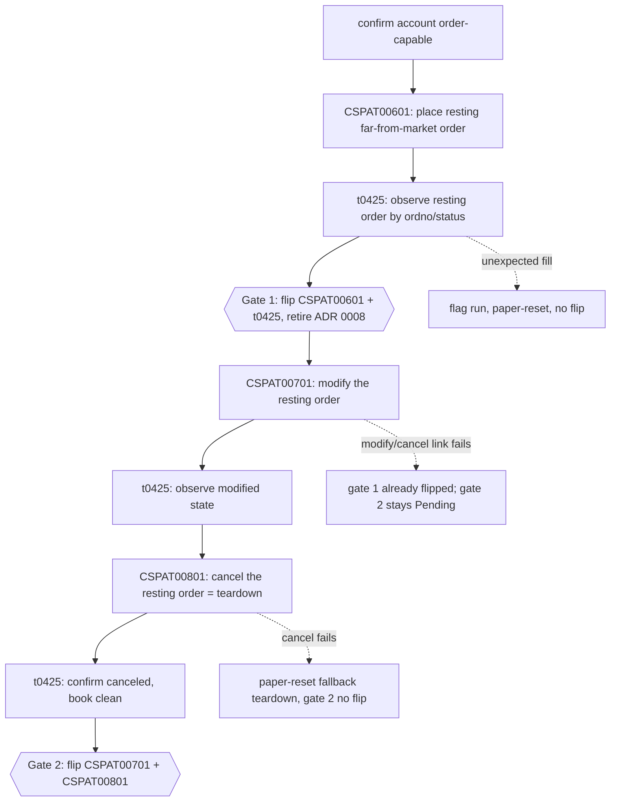
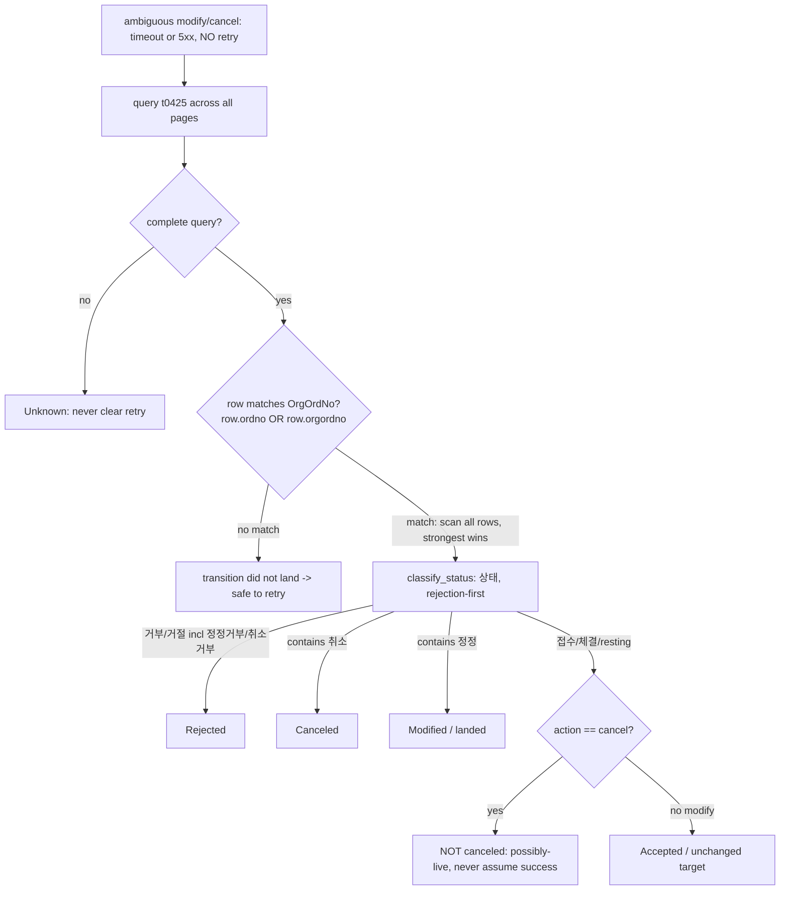

# feat: Order Wave 2 — Live Flip + Modify/Cancel (CSPAT00701 / CSPAT00801)

## Summary

Take the order class from machinery-complete to live-proven and round-trip-capable. Flip the first package's `CSPAT00601` (submit) + `t0425` (inquiry) from `implemented: false` to Implemented via a guarded paper run (retiring ADR 0008), and add `CSPAT00701` (현물정정주문, modify) + `CSPAT00801` (현물취소주문, cancel) so the SDK can place, amend, and pull a domestic-stock order. The wave ships in one piece but flips on **two independent gates**: gate 1 (submit pair) flips on a submit + reconcile run; gate 2 (modify/cancel) flips on the chained submit → modify → cancel run — so the ready pair is never held hostage to the newer build (see origin: `docs/brainstorms/2026-06-25-order-modify-cancel-wave-requirements.md`).

The defining constraint, confirmed by research: the first package's merged runtime already carries nearly all the machinery this wave needs — `Inner::post_order` (no-retry), the `OrderDeduplicator`, the global kill switch, the redaction/tracing contract, the HMAC-keyed `ReconciliationRecord`, and the six-state matcher whose `classify_status` **already** maps 정정→Modified, 취소→Canceled, 거부→Rejected. The genuinely new code is narrow: the two TRs' request/response structs + policies, widening the ack-code predicate, and teaching the matcher to key off the *referenced* order number (`OrgOrdNo`) with cancel's inverted "still-live unless proven canceled" direction.

---

## Problem Frame

The first order package shipped its full safety runtime and merged to `main`, but its two TRs are still `implemented: false` (`metadata/trs/CSPAT00601.yaml:26`, `metadata/trs/t0425.yaml:27`). The Implemented gate for orders is a real guarded paper order — an operator action not yet run in-window — so ADR 0008 sits open as "machinery-complete, evidence-pending" (`docs/adr/0008-defer-order-runtime-until-safety-package-is-complete.md:5`), and the order success predicate is seed-only (`00039`/`00040`), unconfirmed against live codes.

The first package also deliberately deferred modify and cancel — `CSPAT00701`/`CSPAT00801` exist only in the raw OpenAPI capture, no metadata. That deferral is exactly why the first package's test order "has no in-wave SDK cancel path and must be cleared by paper reset" — teardown was the loose end. Adding cancel closes it: the SDK gains a native way to pull a resting order, which doubles as the evidence run's teardown.

The danger profile is not uniform across the three actions. Submit ambiguity risks a **double fill** (guarded by dedup-on-request-body). Modify ambiguity risks a stale belief about whether the new price/quantity landed — `CSPAT00701` is **absolute** (it carries the full target `OrdQty`/`OrdPrc`, no delta field), so a blind re-send re-applies the same target rather than compounding. Cancel ambiguity **inverts** the risk: a cancel wrongly believed to have succeeded leaves a **live resting order** in the market. Submit's "did a brand-new order appear?" reconciliation does not fit actions that target an existing order number.

Why now: no external consumer is pulling for order placement — this is maintainer-initiated retirement of the order-class contract debt, consistent with the first package's framing.

---

## Requirements

Traced to the origin requirements doc (R1–R13). IDs mirror origin R-IDs.

**Live flip of the first order package**

- R1. `CSPAT00601` and `t0425` flip from `implemented: false` to Implemented on a clean guarded submit + reconcile run (gate 1, teardown via paper-reset), independent of the modify/cancel build. The flip marks ADR 0008 superseded; a Pending outcome leaves it open as machinery-complete, evidence-pending.
- R2. The order success predicate — seeded only on `00039`/`00040`, currently unconfirmed — is confirmed and, where needed, widened from the `rsp_cd` codes observed live. A widened set forces a mock-gate update and re-run, not a silent pass.

**Order modify + cancel TRs**

- R3. `CSPAT00701` (modify) and `CSPAT00801` (cancel) are raised raw→Tracked via `track-tr`, then Implemented via `implement-order-tr`.
- R4. Both are `owner_class: orders` with `is_order: true` policies, routed exclusively through `post_order`, reusing its no-retry dispatch, deduplication, global kill switch, and redaction/tracing contract unchanged.
- R5. Both reference an existing order number (`OrgOrdNo`) and serialize all required numeric request-body fields as JSON numbers (`string_as_number`) to avoid `IGW40011`.

**Order-state-aware reconciliation**

- R6. Reconciliation for modify/cancel queries `t0425` for the referenced order number and classifies by the lifecycle state field `status` (상태), corroborated by `ordrem`/`cheqty`, into resting / modified / filled / canceled / absent — distinct from submit's "a new order appeared" matching. This read inherits the redaction/tracing contract: its spans carry no raw `ordno`, account, or order state; any persisted evidence follows R10's at-rest posture.
- R7. After an ambiguous modify/cancel, no retry fires until reconciliation proves the intended transition did not land. A cancel of unknown outcome is treated as possibly-still-live, never assumed successful.
- R8. The accepted-ack set is extended with modify/cancel acknowledgement codes, each confirmed from the live run. An unrecognized 2xx (including `00000`) fails safe to Unknown → reconciliation, never a silent accept or reject.

**Evidence & gate**

- R9. The automated gate proves modify/cancel logic — no-retry, dedup, the extended predicate, and order-state reconciliation — entirely against mocks, and never submits a live order.
- R10. A single chained paper evidence run covers submit → modify → cancel: place a resting far-from-market order, amend it, then cancel it as the run's teardown — each observed via `t0425` and recorded with its `rsp_cd`/`rsp_msg` and order number. The artifact carries the first package's at-rest posture: the account identifier is HMAC-keyed (never bare), the record is written only to the known evidence location, and it carries a stated retention/deletion bound.
- R11. The two flip gates are independent. Gate 1 (`CSPAT00601` + `t0425`) flips on a clean submit + reconcile run, teardown via paper-reset. Gate 2 (`CSPAT00701` + `CSPAT00801`) flips on a clean chained submit → modify → cancel run, where cancel is the primary teardown and paper-reset the fallback. A gate whose run cannot execute in-window leaves only its own TRs Pending; gate 1 does not wait on gate 2.

**Metadata & recipe**

- R12. Each new `is_order: true` REST `{TR}_POLICY` (`CSPAT00701`, `CSPAT00801`) registers in the policy-index crosscheck list **only** — not the REST-only non-order list. Tracking the two TRs bumps the maintained-count assertions.
- R13. The frozen `implement-order-tr` recipe is reused; any modify/cancel-specific step it lacks (order-state reconciliation by referenced order number, chained teardown) is folded back into the recipe rather than improvised per-TR.

---

## Key Technical Decisions

- **KTD1. Reuse the merged runtime unchanged; the only new ls-core change is widening the ack predicate.** Research confirms `Inner::post_order` (`crates/ls-core/src/inner.rs:523`), the kill switch (`inner.rs:177`), `OrderDeduplicator` (`crates/ls-core/src/order_dedup.rs:58`), the redaction span, and `LsError::{AmbiguousOrder, DuplicateOrder}` all exist and are TR-agnostic. Modify/cancel route through `post_order` with no dispatch changes. The single ls-core edit is widening `classify_order_rsp_cd` (`inner.rs`) to accept the modify/cancel acknowledgement codes. (origin R4)

- **KTD2. Widen `classify_order_rsp_cd` with modify/cancel codes, seeded from the response-semantics doc, marked seed-only until the live run.** The current predicate accepts `00039`/`00040` as Accepted, treats `00000`/empty as Ambiguous (the double-fill guard), and everything else as Rejected. Seed the modify code `00462` and the cancel codes `00463`/`00156` as Accepted from `docs/design/ls-gateway-response-semantics.md:119-124`, mark them seed-only/unconfirmed, and confirm-or-widen from the live run — the same seed-then-confirm pattern the submit predicate uses. An unrecognized 2xx (incl. `00000`) still classifies Ambiguous → reconciliation, never silently Accepted or Rejected (R8 fail-safe). A live set wider than the seed forces a mock-gate re-run before any flip. (origin R2, R8; `docs/design/ls-gateway-response-semantics.md:119-124`)

- **KTD3. Extend the existing reconciliation matcher in place — do not add a parallel modify/cancel path.** The merged matcher (`crates/ls-sdk/src/orders/reconcile.rs`) already has the 6-state `OrderState` enum, `reconcile_rows` (gated on a *complete* `t0425` query before any safe-to-retry clearance), `classify_status` (maps 정정→Modified, 취소→Canceled, 거부/거절→Rejected, else→Accepted), page collection, and the HMAC-keyed `ReconciliationRecord`. The new logic: add an optional **referenced order number** (`OrgOrdNo`) and an **action discriminator** (Submit/Modify/Cancel) to `OrderIntent`; teach the matcher to find the referenced order across `row.ordno` (the original) **and** `row.orgordno` (modify-child rows); and apply cancel's fail-toward-still-live (a matched row not classified `Canceled` means possibly-live, never assumed successful). **This is a restructure of `row_matches`/`reconcile_rows`, not an additive branch — the existing code early-returns on the first row whose `ordno` matches (`reconcile.rs:145-147`) and `reconcile_rows` returns on the first matching row.** Two failure modes that restructure must close (flagged in review): (1) a landed modify can leave the original `OrgOrdNo` row at `접수`, which `classify_status` maps to `Accepted` — so a first-row early-return would falsely report an un-applied modify as "landed"; (2) for a cancel, the still-resting original row and a `취소` transition may both be present. The matcher must therefore **scan all matching rows and take the strongest classification** (a `취소`/`정정` row outranks a still-`접수` original row), and for a modify intent must prefer the `정정`/child-row evidence over a bare original-row `접수`. A parallel path would duplicate page-collection and record-writing for no gain. (origin R6, R7; `crates/ls-sdk/src/orders/reconcile.rs:138-164`)

- **KTD4. Modify is absolute and creates a new order number; reconciliation treats both "original modified" and "new child resting" as landed — but the linkage shape must be pinned from a real read first.** `CSPAT00701` carries the full target `OrdQty`/`OrdPrc` with no delta field (verified in the raw capture), and `CSPAT00701OutBlock2.OrdNo` is a **new** order number (the out-block also carries `PrntOrdNo`). After an ambiguous modify, reconciliation classifies Modified/landed if either the `OrgOrdNo` row shows a `정정` status **or** a child row exists with `orgordno == OrgOrdNo`; if neither, the modify did not land (and a re-send is safe because it is idempotent-by-target). **Two assumptions here are currently unverified and must be pinned before the matcher branch is trusted (review flag):** (a) whether a landed modify moves the original `OrgOrdNo` row to `정정확인` or leaves it at `접수` (which drives whether the original row can be trusted for a Modified verdict), and (b) whether `t0425.orgordno` carries the immediate parent (`OrgOrdNo`) vs a chain-root. Both are observable from a **non-ambiguous** `t0425` read taken right after a successful paper modify in the U6 chained run — this does not require fault injection. Pin them from that read (the captured raw success example is a rejection, so the success shape is inferred) before relying on the child-row branch. (origin Dependencies/Assumptions; raw `CSPAT00701` out-blocks `OrdNo`/`PrntOrdNo`)

- **KTD5. Cancel idempotency comes free from the existing dedup key — but only once the predicate is widened (U2 dependency).** The dedup key is `SHA256(account_no + ":" + tr_code + ":" + canonical-request-JSON)` and `OrgOrdNo` lives in the cancel request body, so an identical cancel re-sent within the 300s TTL hits the cache (AE6). Two preconditions, both verified against `post_order`: (1) `post_order` caches **only an `Accepted` response** — a cancel ack reaches the cache-insert line only after U2 widens `classify_order_rsp_cd` to accept `00463`/`00156` (today it classifies them `Rejected`, which short-circuits before caching), so **U4 depends on U2**; (2) the cache `get()` runs **before** the `try_reserve` reservation guard, so a *sequential* identical re-send returns the **cached response** (`dedup_hit=true`, zero HTTP), while a *concurrent* in-flight duplicate returns `LsError::DuplicateOrder` — both correct, distinct paths. This resolves the origin open question: the full body already covers `OrgOrdNo` identity, no key change needed. (origin R4, Outstanding Questions; `crates/ls-core/src/order_dedup.rs:130-142`, `crates/ls-core/src/inner.rs:553-595`)

- **KTD6. Numeric request fields serialize as JSON numbers.** `CSPAT00701`'s numeric request fields are `OrgOrdNo`, `OrdQty`, `OrdPrc`; `CSPAT00801`'s are `OrgOrdNo`, `OrdQty` — each needs `#[serde(serialize_with = "ls_core::string_as_number")]` or the gateway returns `IGW40011`. Read out-block keys and array-ness from the raw capture, not the normalized baseline. (origin R5; `docs/solutions/integration-issues/ls-gateway-igw40011-numeric-request-fields.md`)

- **KTD7. Two independent flip gates; both operator-gated, machinery lands regardless.** Gate 1 (`CSPAT00601` + `t0425`) flips on a clean submit + reconcile run and supersedes ADR 0008 the moment it lands; gate 2 (`CSPAT00701` + `CSPAT00801`) flips on the clean chained run. The chained run's first leg *is* gate 1's evidence, so one in-window session satisfies both — but gate 1 landing never depends on gate 2 (AE4). A gate that cannot execute in-window leaves only its own TRs Pending, honestly recorded. The supersession note scopes what the flip proves: a clean run confirms callability, the happy path, and the live ack-code surface — the inverted-cancel reconciliation (still-live vs canceled) stays **mock-proven**, since a clean run never produces an ambiguous outcome against a genuinely live order. (origin R1, R11, Key Decisions, Success Criteria)

- **KTD8. The chained evidence harness extends the existing `order_smoke`, reusing its `t1102` band fetch and fail-closed posture.** The merged `crates/ls-sdk/tests/order_smoke.rs` already fetches the daily price band (via `t1102`'s `uplmtprice`/`dnlmtprice`), validates it (degenerate band → "not certified"), and places resting far-from-market orders. Extend it with the modify and cancel legs keyed on the real order number returned by the submit leg, with paper-reset as the cancel-failure fallback teardown (R10/R11). The resting price/symbol stays an evidence-time operator parameter. (origin Key Decisions, Outstanding Questions; `crates/ls-sdk/tests/order_smoke.rs`)

---

## High-Level Technical Design

Two shapes carry this wave: the **chained evidence run with its two independent flip gates**, and the **modify/cancel reconciliation decision** (where cancel's risk inverts).

### Chained run + independent gates

The chained run is the load-bearing sequence; its first leg satisfies gate 1, and cancel doubles as gate 2's teardown. A failure after gate 1 never re-defers the submit flip.

### Modify/cancel reconciliation decision

After an ambiguous modify/cancel (transport timeout / 5xx — no retry fires), the matcher queries `t0425` for the referenced `OrgOrdNo` and classifies via `status`. Cancel fails toward still-live; modify is idempotent-by-target.

---

## Implementation Units

Phased: A (track) → B (modify/cancel-aware order logic) → C (the two TRs) → D (gate, evidence, flips, recipe). The flip units (U7, U8) are evidence-gated and may land Pending; every other unit lands unconditionally.

### U1. Raise `CSPAT00701` + `CSPAT00801` raw→Tracked

- **Goal:** Both TRs gain metadata + projected baselines so they are observed for drift and implementable.
- **Requirements:** R3 (track half), R12
- **Dependencies:** none
- **Files:** new `metadata/trs/CSPAT00701.yaml`, new `metadata/trs/CSPAT00801.yaml`, `metadata/tr-index.yaml`, projected `crates/ls-trackers/baselines/api-drift/normalized/trs/CSPAT00701.json` + `CSPAT00801.json`, `crates/ls-trackers/baselines/api-drift/manifest.json`, `crates/ls-docgen/src/lib.rs` (`TRACKED_TRS` array + its `[&str; N]` length), `crates/ls-trackers/tests/api_drift.rs`, `crates/ls-trackers/src/cli.rs`
- **Approach:** Follow `.agents/skills/track-tr/SKILL.md`. Author each `metadata/trs/<tr>.yaml` mirroring `metadata/trs/CSPAT00601.yaml` (`owner_class: orders`, `facets.is_order: true`, `rate_bucket: orders`, `tracked: true`, `implemented: false`, `recommended: false`) plus the `tr-index.yaml` entries, then `make api-drift-renormalize` to **project** the baselines (never hand-author them). Bump the maintained-count assertions `117 → 119`: `maintained_tr_count` (`crates/ls-trackers/tests/api_drift.rs:106`), the `shapes.len()` literals (`crates/ls-trackers/src/cli.rs:1811,1876,2779,2787`), and `TRACKED_TRS` length (`crates/ls-docgen/src/lib.rs:677`). Keep the manifest `refreshed` field at the last raw-refresh date (do not bump it).
- **Execution note:** verify `git diff` on `normalized/trs/` shows only the two new files before committing; do not `cargo fmt` the whole `ls-trackers` crate (main is intentionally unformatted there).
- **Patterns to follow:** the first package's t0425 tracking step; `metadata/trs/CSPAT00601.yaml`.
- **Test scenarios:**
  - `cargo test -p ls-metadata -p ls-core` (metadata validation + policy crosscheck) passes.
  - The count assertions pass at `119`; `make docs-check` clean.
  - Test expectation: metadata/count validation only — tracking adds no callable code.
- **Verification:** both TRs are Tracked; baselines projected (not hand-authored); gate green at count 119.

### U2. Widen the order ack predicate + extend order-state reconciliation

- **Goal:** Teach the runtime to classify modify/cancel acknowledgements and to reconcile an ambiguous modify/cancel by the referenced order number, with cancel failing toward still-live.
- **Requirements:** R6, R7, R8
- **Dependencies:** none (operates on the merged runtime and the existing `T0425OutBlock1`)
- **Files:** `crates/ls-core/src/inner.rs` (`classify_order_rsp_cd`), `crates/ls-sdk/src/orders/reconcile.rs` (`OrderIntent`, `row_matches`, cancel still-live classification)
- **Approach:**
  - **Predicate (inner.rs):** widen `classify_order_rsp_cd` so `00462` (modify) and `00463`/`00156` (cancel) classify `OrderAck::Accepted`, seeded from `docs/design/ls-gateway-response-semantics.md:119-124` and marked seed-only/unconfirmed in a comment. Leave `00000`/empty → `Ambiguous` and other codes → `Rejected` unchanged (R8 fail-safe).
  - **Matcher (reconcile.rs):** `OrderIntent` gains **two** new optional fields — `org_order_no: Option<String>` (the referenced order) and an **action discriminator** (e.g. `action: OrderAction { Submit, Modify, Cancel }`, defaulting to Submit so existing call sites are unaffected). The cancel still-live step keys off this action field, so it is not optional scope. **Restructure `row_matches`/`reconcile_rows` (do not just add a branch):** today the matcher early-returns on the first row whose `ordno` matches (`reconcile.rs:145-147`) and `reconcile_rows` returns on the first matching row — both must change to **scan all rows** for the referenced number (normalized via `normalize_ordno`) across `row.ordno` **and** `row.orgordno`, then take the **strongest classification** (a `취소`/`정정` row outranks a still-`접수` original row). Fall back to symbol/side/qty/price corroboration only when no referenced number is usable. Cancel-aware step: when the action is Cancel and the strongest matched row is **not** `Canceled`, the outcome is "still-live / not-canceled" (Unknown-toward-live), never `Accepted` (R7, AE1). Modify-aware step: do **not** classify a bare still-`접수` original row as landed for a Modify intent — require a `정정` row or a child row with `orgordno == OrgOrdNo` (KTD4). Reuse `reconcile_rows`' complete-query gate, `classify_status`, page collection, and `ReconciliationRecord` unchanged.
- **Patterns to follow:** existing `row_matches`/`classify_status`/`reconcile_rows` (`crates/ls-sdk/src/orders/reconcile.rs`); `normalize_ordno`; `docs/design/order-safety-design.md` §3.
- **Test scenarios:**
  - Covers AE2. A modify ack of `00462` classifies Accepted and deserializes (not `ApiError`); an unrecognized 2xx incl. `00000` on a modify classifies `AmbiguousOrder` → reconciliation, never silently Accepted.
  - A cancel ack `00463` and the spec-alternative `00156` both classify Accepted; a non-ack reject code is `ApiError` with code/message preserved.
  - Covers AE1. A cancel whose `t0425` row still shows a resting/접수 status with `ordrem > 0` classifies **not-canceled / still-live**, never Accepted; retry is not cleared.
  - A modify where the `OrgOrdNo` row shows a 정정 status classifies Modified; a modify where a child row exists with `orgordno == OrgOrdNo` also classifies Modified/landed (KTD4).
  - **Regression guard (review-flagged):** a modify whose original `OrgOrdNo` row is still `접수` with **no** 정정 row and **no** `orgordno` child classifies **not-landed / safe-to-retry**, NOT `Accepted` — proves the matcher does not early-return Accepted on a still-resting original row.
  - **Strongest-classification (review-flagged):** a cancel whose `t0425` page contains **both** a still-`접수` original row **and** a `취소` row for the referenced order classifies `Canceled`, not `Accepted` — proves the matcher scans all rows rather than returning on the first `ordno` hit.
  - Edge: an ambiguous modify/cancel with **no** matching row over a **complete** `t0425` query classifies safe-to-retry; over an **incomplete** query stays Unknown (never clears retry).
  - Edge: an empty/zero referenced `OrgOrdNo` falls back to symbol/side/qty/price corroboration (the merged fallback), resolving the origin open question.
  - Security: a reconciliation record written for a modify/cancel carries no cleartext account, no bare `SHA256(account)`, and no bare dedup-key value — only HMAC-keyed `account_ref`/`request_ref` (reused `ReconciliationRecord`).
- **Verification:** modify/cancel acks classify correctly; an ambiguous cancel never clears retry while the order may rest; the matcher matches by `OrgOrdNo` against both row fields.

### U3. `CSPAT00701` modify TR + policy + `Orders::modify`

- **Goal:** A callable domestic-stock order modify routed through `post_order`.
- **Requirements:** R3, R4, R5, R12
- **Dependencies:** U1, U2
- **Files:** `crates/ls-sdk/src/orders/mod.rs`, `crates/ls-core/src/endpoint_policy.rs`, `crates/ls-core/tests/policy_index_crosscheck.rs`
- **Approach:** Mirror `CSPAT00601` in `crates/ls-sdk/src/orders/mod.rs`. Author `CSPAT00701InBlock1` with all six required fields from the raw capture (`OrgOrdNo`, `IsuNo`, `OrdQty`, `OrdPrc`, `OrdprcPtnCode`, `OrdCndiTpCode`), the numeric fields `OrgOrdNo`/`OrdQty`/`OrdPrc` carrying `string_as_number` (KTD6). Add a request wrapper renaming the in-block under `CSPAT00701InBlock1`, and a response with `OutBlock1` (echo) + `OutBlock2` (carrying the **new** `OrdNo`, KTD4), modeled at true wire shape from the raw capture (single-vs-array per `A0003`/`A0005`), with `string_or_number` on numerics and a hand-written account-redacting `Debug`. Add `Orders::modify(&self, req)` dispatching via `Inner::post_order`, building the `OrderIntent` with `org_order_no = OrgOrdNo` for reconciliation. Declare `CSPAT00701_POLICY` (`is_order: true`, `category: RateLimitCategory::Orders`) in `crates/ls-core/src/endpoint_policy.rs` and register it in `policy_index_crosscheck` **only** — never `slice_rest_policies_are_non_order_rest` (R12).
- **Patterns to follow:** `CSPAT00601` structs/handle/policy in `crates/ls-sdk/src/orders/mod.rs` and `crates/ls-core/src/endpoint_policy.rs:703-714`; `.agents/skills/implement-order-tr/SKILL.md` §1.
- **Test scenarios:**
  - Happy (offline): a captured `00462` modify-ack response deserializes; the new `OrdNo` is read from `OutBlock2`.
  - Edge: `OrgOrdNo`/`OrdQty`/`OrdPrc` serialize as **unquoted JSON numbers** (guards IGW40011).
  - Error: a rejection response (e.g. `03181` price-band) surfaces as `ApiError` with the broker code/message.
  - Integration: `modify()` flows through `post_order` (guard, dedup, kill switch exercised), never `post`; the built `OrderIntent` carries `org_order_no`.
- **Verification:** `Orders::modify` dispatches via `post_order`; `policy_index_crosscheck` passes with `CSPAT00701_POLICY`; `slice_rest_policies_are_non_order_rest` does not include it.

### U4. `CSPAT00801` cancel TR + policy + `Orders::cancel`

- **Goal:** A callable domestic-stock order cancel routed through `post_order`, idempotent within the dedup TTL.
- **Requirements:** R3, R4, R5, R12
- **Dependencies:** U1, U2
- **Files:** `crates/ls-sdk/src/orders/mod.rs`, `crates/ls-core/src/endpoint_policy.rs`, `crates/ls-core/tests/policy_index_crosscheck.rs`
- **Approach:** Same shape as U3. Author `CSPAT00801InBlock1` with the three required fields (`OrgOrdNo`, `IsuNo`, `OrdQty`), numerics `OrgOrdNo`/`OrdQty` carrying `string_as_number`. Response `OutBlock1` (echo) + `OutBlock2` (new cancel order number) from the raw capture. Add `Orders::cancel(&self, req)` dispatching via `Inner::post_order`, building the `OrderIntent` with `org_order_no = OrgOrdNo` and a cancel action marker so U2's still-live classification applies. Declare `CSPAT00801_POLICY` (`is_order: true`, `category: Orders`) and register it in `policy_index_crosscheck` **only** (R12).
- **Patterns to follow:** U3; `CSPAT00601` exemplar; `.agents/skills/implement-order-tr/SKILL.md` §1.
- **Test scenarios:**
  - Happy (offline): a captured `00463`/`00156` cancel-ack deserializes; the cancel-order number is read from `OutBlock2`.
  - Edge: `OrgOrdNo`/`OrdQty` serialize as unquoted JSON numbers (IGW40011 guard).
  - Covers AE6. Integration: an identical cancel re-sent **sequentially** within the 300s TTL (after the first returned an `Accepted` `00463`/`00156` ack) returns the cached response with `dedup_hit=true` and **zero** second HTTP — idempotent cancel for free (KTD5; relies on U2's widened predicate so the first ack reaches the cache).
  - Edge: a **concurrent** identical cancel (second in flight before the first caches) returns `LsError::DuplicateOrder` via the reservation guard — distinct from the sequential cached-return path.
  - Error: a cancel rejection surfaces as `ApiError` with code/message.
  - Integration: `cancel()` flows through `post_order`, never `post`; the `OrderIntent` carries the cancel action marker.
- **Verification:** `Orders::cancel` dispatches via `post_order`; idempotent re-send hits dedup; both crosscheck registrations correct.

### U5. Mock-gate modify/cancel order logic

- **Goal:** Prove modify/cancel logic against wiremock without ever submitting a live order.
- **Requirements:** R9
- **Dependencies:** U2, U3, U4
- **Files:** `crates/ls-sdk/tests/order_logic_gate.rs` (and/or the `ls-core` `inner`/`orders::reconcile` unit suites), `crates/ls-sdk-test-support/`
- **Approach:** Extend the existing offline order gate so the modify and cancel TRs exercise: single-attempt no-retry on a 5xx (count the hits), dedup hit on identical re-send (zero second HTTP), the widened predicate (`00462`/`00463`/`00156` Accepted, an unrecognized 2xx/`00000` Ambiguous, a reject code `ApiError`), kill-switch halt, and the order-state reconciliation classifications (Modified, Canceled, still-live-not-canceled, safe-to-retry-on-no-match, Unknown-on-incomplete-query). Assert no test targets the real paper gateway.
- **Patterns to follow:** the first package's `order_logic_gate.rs`; `ls-sdk-test-support` wiremock helpers.
- **Test scenarios:**
  - The categories above, each as an offline wiremock test (no-retry, dedup, predicate, kill switch, reconciliation states).
  - An assertion that the gate never touches the live gateway.
- **Verification:** `cargo test` proves modify/cancel logic offline; CI never submits an order.

### U6. Chained evidence harness (submit → modify → cancel)

- **Goal:** Extend the guarded paper-order harness with the modify and cancel legs, capturing the real ack surface and reconciling each via `t0425`.
- **Requirements:** R10
- **Dependencies:** U3, U4
- **Files:** `crates/ls-sdk/tests/order_smoke.rs`, `Makefile`
- **Approach:** Extend the merged `order_smoke` harness (which already fetches + validates the `t1102` band, places resting far-from-market orders, and records credential-free evidence). Add the `select_order_tr()` allowlist entries for `CSPAT00701`/`CSPAT00801`, then the chained sequence: place a resting order (submit leg = gate 1 evidence) → observe via `t0425` → modify it keyed by the real `OrdNo` → observe → cancel it as teardown → confirm the book clean via `t0425`. Keep paper-reset as the fallback teardown when cancel itself fails or a resting order fills unexpectedly. Each leg records `rsp_cd`/`rsp_msg` + order number to confirm-or-amend the predicate (R2/R8). The record carries the at-rest posture (HMAC-keyed account, known location, stated retention bound) via the existing `ReconciliationRecord`. A `make live-smoke-order` target gated on `LS_TRADING_ENV=paper` + an explicit `LS_ORDER_SMOKE=1` opt-in. **At-rest hardening for the new legs (review-flagged):** the evidence HMAC key is sourced from the gitignored `.env` (never a committed value or CLI literal) and is never written to the evidence location; the modify/cancel legs stay on the merged stdout `record()` path (not a committed file) and reuse the existing `scrub_digit_runs` on `rsp_msg` so venue order numbers do not leak — and if any artifact is ever committed, its venue order numbers are stripped or HMAC-keyed, per `order-safety-design.md` §5's no-auto-redaction warning.
- **Execution note:** paper-only; production order testing is prohibited. A missing in-window clearing mechanism is a blocking Pending condition, not a silent gap. This unit ships the harness regardless of whether the live run executes.
- **Test scenarios:**
  - Fail-closed: an unset TR selection produces "not certified", never a default submit; invalid operator params rejected before SDK construction; a degenerate `t1102` band records "not certified", never places.
  - Each chained leg uses distinct order params so an identical re-run misses the dedup cache and regenerates fresh broker codes.
  - Evidence completeness: the recorded artifact includes TR, classification, request summary, `rsp_cd`/`rsp_msg`, order number/time, reconciliation observation, and a "production not run" statement, with credentials/account redacted (HMAC-keyed).
  - Pending (capability case): if the paper account cannot place/modify/cancel in-window, the harness records Pending for the affected gate's TRs — no flip.
  - Covers AE5. Teardown fallback: if the cancel link itself fails mid-run, the harness invokes paper-reset as fallback teardown, flags the run for review, and records gate 2 as not-flipped — gate 1 unaffected if submit + reconcile already succeeded.
- **Verification:** a clean in-window chained run produces a reproducible credential-free artifact pinning the modify/cancel ack codes; otherwise an honest Pending record.

### U7. Gate 1 flip — `CSPAT00601` + `t0425` Implemented + retire ADR 0008

- **Goal:** Flip the first package's submit pair to Implemented on a clean submit + reconcile run (or honestly record Pending), and retire ADR 0008.
- **Requirements:** R1, R2, R11
- **Dependencies:** the merged submit harness suffices; in practice run together with U6's chained run (gate 1 = the chained run's first leg). **Independent of U3/U4/U8** (AE4).
- **Files:** `metadata/trs/CSPAT00601.yaml`, `metadata/trs/t0425.yaml`, `docs/adr/0008-defer-order-runtime-until-safety-package-is-complete.md`, `docs/design/order-safety-design.md`, `crates/ls-docgen/src/lib.rs` (`banner_trs` + `reference.len()`)
- **Approach:** On a clean in-window submit + reconcile run, flip `CSPAT00601` and `t0425` to `implemented: true` (leave `recommended: false`), mark ADR 0008 **superseded** with a note scoping what the flip proves (callability + happy path + live ack-code surface; the inverted-cancel reconciliation stays mock-proven, KTD7), and update `order-safety-design.md` to record the live-paper-order Implemented gate. Confirm the observed accepted codes match the `00039`/`00040` seed; a wider live set forces a U5 mock-gate re-run before the flip (R2). Add both TRs to `banner_trs` and bump `reference.len()` accordingly; regenerate docgen. **If the run lands Pending:** leave both `implemented: false`, leave ADR 0008 open as machinery-complete/evidence-pending, mark the predicate seed-only, and record the credential-free reason.
- **Execution note:** evidence-gated and operator-initiated — this unit's flip is conditional on a clean run; the Pending branch is a first-class outcome, not a failure.
- **Test scenarios:** `make docs` / `make docs-check` clean; docgen banner/reference counts reflect the flips (or Pending); `cargo test` green. Test expectation: docs + count validation (no new runtime behavior).
- **Verification:** gate green; CSPAT00601/t0425 support tiers and ADR 0008 status reflect the evidence outcome honestly.

### U8. Gate 2 flip — `CSPAT00701` + `CSPAT00801` Implemented

- **Goal:** Flip the modify/cancel pair to Implemented on a clean chained run (or honestly record Pending), completing R3.
- **Requirements:** R11 (completes R3)
- **Dependencies:** U3, U4, U6; **independent of U7's outcome** (gate 2 may flip or pend regardless of gate 1).
- **Files:** `metadata/trs/CSPAT00701.yaml`, `metadata/trs/CSPAT00801.yaml`, `docs/design/order-safety-design.md`, `crates/ls-docgen/src/lib.rs` (`banner_trs` + `reference.len()`)
- **Approach:** On a clean chained submit → modify → cancel run where `t0425` confirms each transition and the book ends clean, flip `CSPAT00701` and `CSPAT00801` to `implemented: true` (leave `recommended: false`), per `.agents/skills/implement-order-tr/SKILL.md` §6-7. Confirm the modify/cancel ack codes against the KTD2 seed; a wider live set forces a U5 re-run first. Add both to `banner_trs`, bump `reference.len()`, regenerate docgen. **The flip note (in the metadata/`order-safety-design.md` record) must scope the evidence honestly: cancel's still-live / inverted-risk reconciliation is mock-attested-only at flip — a clean run proves the happy path, never the ambiguous-cancel path (KTD7) — so a downstream reader does not read "Implemented" as "inverted-risk proven live."** **If the modify or cancel link fails (AE4/AE5):** leave both `implemented: false`, invoke paper-reset as fallback teardown, flag the run for review, mark the predicate seed-only — gate 1 (U7) is unaffected.
- **Execution note:** evidence-gated; the Pending branch is first-class. A modify/cancel failure never re-defers the gate 1 flip.
- **Test scenarios:** `make docs` / `make docs-check` clean; banner/reference counts reflect the flips (or Pending); `cargo test` green. Test expectation: docs + count validation.
- **Verification:** gate green; CSPAT00701/CSPAT00801 tiers reflect the evidence outcome; a gate-2 Pending leaves gate 1 intact.

### U9. Fold modify/cancel steps into the `implement-order-tr` recipe

- **Goal:** Capture the modify/cancel-specific path in the frozen recipe so the next order TR does not improvise it.
- **Requirements:** R13
- **Dependencies:** U2, U3, U4 (the seams the recipe documents); lands regardless of the U7/U8 evidence outcome.
- **Files:** `.agents/skills/implement-order-tr/SKILL.md`
- **Approach:** Fold the modify/cancel-specific steps into the existing recipe (it already gestures at a "place → modify/cancel → observe sequence keyed by a real order number" in §2): the order-state reconciliation by **referenced** order number (`OrgOrdNo` matched against `t0425.ordno` *and* `orgordno`), cancel's fail-toward-still-live direction, the modify-creates-new-order-number semantic (KTD4), and the chained-teardown evidence sequence with paper-reset fallback. Record that modify/cancel ack codes seed from `ls-gateway-response-semantics.md` and confirm from the live run.
- **Test scenarios:** the recipe is self-contained and references real seams. Test expectation: none — recipe authoring, no runtime behavior.
- **Verification:** the recipe encodes the modify/cancel path end-to-end; a reader can implement the next order TR from it without improvisation.

---

## Scope Boundaries

**Deferred for later** (carried from origin)

- F&O order class (`CFOAT00100`/`00200`/`00300`) — needs a distinct F&O account and an F&O-specific order safety design.
- Recommended promotion of the order TRs — a separate act (Focused Evidence ≤7 days + a recommendation block).
- Field-level order-number dependency edges (e.g. `OrgOrdNo <- CSPAT00601.OrdNo`) — the coarse `strong_order_fields` + `prerequisite_producer_trs` contract is enough for now.

**Outside this wave** (carried from origin)

- Overseas order classes.
- Production (non-paper) order testing — prohibited by the safety contract.
- Modify/cancel for any non-stock class.

**Deferred to Follow-Up Work** (plan-local)

- Per-account kill-switch scope (the merged runtime ships global; unchanged here).
- Live-exercising the inverted-cancel reconciliation (still-live vs canceled) — a clean run never produces it, so it stays mock-proven (KTD7); a fault-injection paper exercise is a separate effort.

---

## Open Questions

Deferred to implementation — none block starting.

- The canonical resting-limit price offset and symbol for the chained run (far enough from market to rest unfilled, yet within exchange validation bounds) — an evidence-time operator parameter; the harness's `t1102` band fetch bounds it (KTD8).
- The exact modify-replace semantics (does the original `OrgOrdNo` row go to 정정확인 while a child resting row appears, or is the original superseded in place?) — pinned from the raw capture and confirmed in the live run (KTD4); the matcher handles both shapes.
- Whether any modify/cancel ack code beyond the `00462`/`00463`/`00156` seed appears live — confirmed from the run; a wider set forces a U5 mock-gate re-run before either flip (KTD2/R2/R8).

---

## System-Wide Impact

- First modify/cancel order TRs in the repo — exercises the `OrgOrdNo`-referenced reconciliation path and cancel's inverted-risk direction in production for the first time.
- Adds two Tracked TRs, bumping the maintained count `117 → 119` across the `api_drift`, `cli`, and `docgen` assertions (U1).
- Two new `is_order: true` policies (`CSPAT00701_POLICY`, `CSPAT00801_POLICY`), each crosscheck-only.
- Two new optional `OrderIntent` fields (`org_order_no` + an action discriminator) and a `row_matches`/`reconcile_rows` **restructure** (scan-all-rows, strongest-classification) in `crates/ls-sdk/src/orders/reconcile.rs`; a widened `classify_order_rsp_cd` in `crates/ls-core/src/inner.rs`.
- On a clean run: up to four TRs flip to Implemented, ADR 0008 is superseded, and `order-safety-design.md` records the live gate.

---

## Risks & Dependencies

- **Inverted cancel risk.** A cancel wrongly believed successful leaves a live resting order. Mitigated by U2's fail-toward-still-live classification (a matched non-`Canceled` row is never Accepted) and the complete-query gate before any safe-to-retry clearance (R7, AE1).
- **Paper gateway order-capability in-window.** If it cannot place/modify/cancel in-window, the affected gate's TRs land Pending — the machinery still ships (the gate-independence rule, R11; the capability case lives in Dependencies/Assumptions, distinct from AE4/AE5's link-failure cases). Mitigated by the `t1102` band fetch and `make raw-probe` failure classification.
- **IGW40011 on numeric fields.** `OrgOrdNo`/`OrdQty`/`OrdPrc` must serialize as JSON numbers; one quoted field returns IGW40011. Mitigated by `string_as_number` on every numeric request slot (KTD6) and `make raw-probe` A/B.
- **Modify/cancel ack-code uncertainty.** The `00462`/`00463`/`00156` seed may be incomplete; the live run confirms-or-widens, and a wider set forces a mock-gate re-run before any flip (KTD2).
- **Modify new-order-number semantic.** If modify's replace shape differs from KTD4's assumption, the matcher's child-row (`orgordno`) branch covers the new-child case and the original-row 정정 branch covers in-place; the live run disambiguates.
- **Dependencies:** the merged first-package runtime (`post_order`, `OrderDeduplicator`, kill switch, `reconcile.rs`, `order_smoke.rs`, `order_logic_gate.rs`) is the foundation U2–U6 extend; `docs/design/order-safety-design.md` §1–§5 is the authoritative contract; `docs/design/ls-gateway-response-semantics.md:119-124` is the ack-code seed source.

---

## Acceptance Examples

Carried from origin; each maps to a unit and its test scenarios.

- AE1. Cancel times out → no retry, reconciliation queries `t0425`, a still-resting order classifies not-canceled, never assumed successful. (U2)
- AE2. Modify returns an unrecognized 2xx (incl. `00000`) → fails safe to Unknown → reconciliation, not a silent accept. (U2)
- AE3. Clean chained run → gate 1 flips `CSPAT00601`/`t0425` + ADR 0008 retired; modify → cancel succeed and `t0425` confirms the book clean → gate 2 flips `CSPAT00701`/`CSPAT00801`. (U6, U7, U8)
- AE4. Submit + reconcile succeed but modify/cancel then fails → gate 1 still flips while `CSPAT00701`/`CSPAT00801` stay Pending. (U7, U8)
- AE5. Cancel link itself fails mid-run → paper-reset fallback teardown, run flagged, gate 2 does not flip; gate 1 unaffected. (U6, U8)
- AE6. Identical cancel re-sent within the dedup TTL → cached response, no second dispatch — idempotent cancel for free. (U4)

---

## Sources / Research

- `docs/brainstorms/2026-06-25-order-modify-cancel-wave-requirements.md` — origin (R1–R13, AE1–AE6, the two-gate framing).
- `docs/brainstorms/2026-06-25-order-runtime-first-package-requirements.md` + `docs/plans/2026-06-25-002-feat-order-runtime-first-package-plan.md` — the first order package this wave extends.
- `docs/adr/0008-defer-order-runtime-until-safety-package-is-complete.md:5-25` — the "machinery-complete, evidence-pending" deferral this wave retires.
- `docs/design/order-safety-design.md` §1–§5 — the authoritative order-safety contract (no-retry, dedup, reconciliation §3, guarded evidence §4, redaction §5).
- `docs/design/ls-gateway-response-semantics.md:119-124` — modify/cancel ack codes `00462` (modify), `00463`/`00156` (cancel); the predicate seed.
- `crates/ls-core/src/inner.rs:177,523` + `classify_order_rsp_cd` — kill switch, `post_order`, the order predicate to widen.
- `crates/ls-core/src/order_dedup.rs:58,130-142` — `OrderDeduplicator`, the full-body key (KTD5 idempotent cancel).
- `crates/ls-core/src/endpoint_policy.rs:703-714,723-734` — `CSPAT00601_POLICY`/`T0425_POLICY` shape, `guard_order`/`guard_non_order`.
- `crates/ls-sdk/src/orders/mod.rs` + `crates/ls-sdk/src/orders/reconcile.rs` — `CSPAT00601`/`t0425` structs, `Orders` handle, `OrderIntent`, `row_matches`, `classify_status`, `reconcile_rows`, `ReconciliationRecord` (HMAC-keyed).
- `crates/ls-trackers/baselines/api-drift/raw/ls-openapi-full.json` (`CSPAT00701` ~line 107827, `CSPAT00801` ~line 108817) + `normalized/trs/t0425.json` (`t0425OutBlock1`: `ordno`/`status`/`ordrem`/`cheqty`/`medosu`/`orgordno`) — wire field names/array-ness.
- Count assertions to bump `117→119` (U1): `crates/ls-trackers/tests/api_drift.rs:106`, `crates/ls-trackers/src/cli.rs:1811,1876,2779,2787`, `crates/ls-docgen/src/lib.rs:677`.
- `.agents/skills/track-tr/SKILL.md`, `.agents/skills/implement-order-tr/SKILL.md` — the recipes for U1 and the U9 fold-back.
- `docs/solutions/integration-issues/ls-gateway-igw40011-numeric-request-fields.md` — numeric request serialization + `make raw-probe`.
