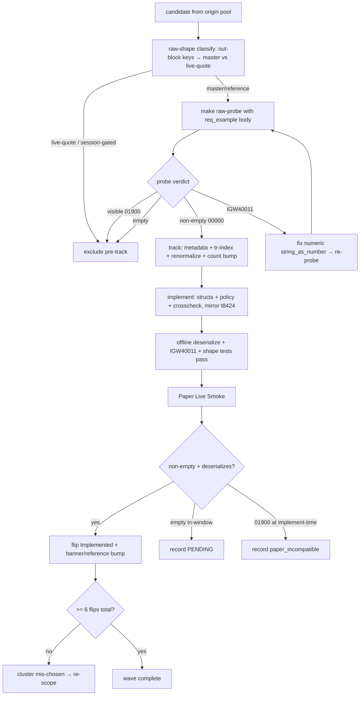

# feat: Breadth Wave — Domestic Stock Master/Reference Reads

## Summary

Raise ~10–14 raw-untracked **domestic stock master/reference read** TRs from raw → Tracked → Implemented in one wave, flipping each on a clean non-empty Paper Live Smoke. A pre-track `raw-probe` + raw-shape-classification sweep finalizes membership *before* any tracking tax is paid, so only candidates with a credible flip path are tracked. Reads route through the existing `Inner::post` / `post_paginated` dispatch, mirroring the `t8424` sector-read pattern — no `ls-core` change, no order-safety surface.

---

## Problem Frame

The SDK sits at 97 Implemented / 119 Tracked. The remaining tracked backlog is not new work (order gates, plan -001's window-gated re-runs), so breadth has to come from the 162-TR raw pool — and within it, *reliability of flip* is the binding constraint, not pool size. Master/reference reads convert in a single window because their non-emptiness depends on neither an open session nor account activity. This is maintainer-initiated coverage-debt retirement, bounded and sequenced ahead of the C-prefix capability-gap wave because these reads need no new safety surface and avoid the `01900` paper-incompatibility that sank the F&O account reads (see origin: `docs/brainstorms/2026-06-25-domestic-stock-master-reference-breadth-requirements.md`).

---

## Requirements

Traced to the origin requirements doc (R-IDs mirror origin where noted).

**Candidate selection & the pre-track gate**

- R1. Raise the raw-untracked domestic stock master/reference read TRs that pass R2 and the pre-track gate (R3) from raw → Tracked → Implemented — expected ~10–14, not a fixed count target (origin R1).
- R2. Select only reads whose non-emptiness depends on neither an open session nor account trade activity, established by raw-shape classification; exclude account-history, live-quote, overseas, and night-window reads (origin R2).
- R3. Each candidate is raw-shape-classified (out-block keys → master vs live-quote) and `raw-probe`d with a body built from the capture's `req_example`, before tracking. Probe verdict: non-empty `00000` admits; visible `01900` excludes pre-track; `IGW40011` triggers a numeric-serialization fix + re-probe (never auto-exclude); empty excludes as session-gated unless raw shape confirms a master (origin R3).

**Tracking & implementation**

- R4. Reads-only — every TR routes through the existing read dispatch, no order/control TRs, no new order-safety surface, no `ls-core` change (origin R4).
- R5. Each TR is raised raw→Tracked via `track-tr`: `metadata/trs/<tr>.yaml` + `tr-index.yaml` entry, baseline **projected** via `make api-drift-renormalize`, with `manifest.refreshed` reverted to the last raw-refresh date (origin R5).
- R6. Each Tracked TR is flipped to Implemented via `implement-tr`: callable Rust mirroring the `t8424` read pattern, gated on a clean **non-empty** Paper Live Smoke (origin R6).
- R7. `owner_class` and landing module are assigned per TR from wire shape: non-paginated reads → `market_session`; body-cursor reads → `paginated`; never assumed from the cluster (origin R7).
- R8. Each `{TR}_POLICY` registers in **both** `policy_index_crosscheck` and `slice_rest_policies_are_non_order_rest` (these are non-order REST reads, unlike order policies which are crosscheck-only).

**Dispositions & honesty**

- R9. An empty in-paper smoke → PENDING; a terminal `01900` surviving a clean probe to implement-time → `paper_incompatible`; partial completion with honestly-recorded remainders is success (origin R8, R9).
- R10. Flip floor: if fewer than **6** candidates flip Implemented, the cluster is treated as mis-chosen and re-scoped rather than shipped as a token wave (origin R10).
- R11. Recommended promotion is out of scope; every flip lands `implemented: true`, `recommended: false` (origin R11, R12).

---

## Key Technical Decisions

- KTD1. **Mirror the `t8424` sector-read pattern per TR.** It is the most recent non-order read flipped raw→Implemented and gives the exact file shape: request/response structs in `crates/ls-sdk/src/market_session/mod.rs`, a facade method on the same module, the `{TR}_POLICY` const in `crates/ls-core/src/endpoint_policy.rs`, crosscheck registration, and a smoke entry in `crates/ls-sdk/tests/live_smoke.rs`. Single-block reads mirror `T1102`; body-cursor reads mirror `T8412`/`T1452` via `Inner::post_paginated`.

- KTD2. **The pre-track probe is a wire-health + non-empty-now check, not a session-independence proof.** Raw-shape classification (out-block keys, read from the raw `res_example`) is the always-on signal; the probe catches `01900` and `IGW40011` before the tracking tax. A single in-window probe shows "non-empty now," so residual session-gated PENDING is still possible and owned in R9. Probe decision tree: `IGW40011` → audit/fix numeric request fields and re-probe; success+populated but SDK deserialize empty → out-block shape bug (fix `Vec`/`rename`); success+empty → session-clock branch (re-run; PENDING only if in-window).

- KTD3. **Read out-block shape (array-vs-single) and the true rename key from the raw capture, never the normalized baseline.** The normalized projection collapses Object-Array blocks to literal `response_body` and erases array-ness — 4 of 9 F/O TRs in prior waves were mis-guessed as single when all were arrays. Model arrays as `Vec<...>` via `ls_core::de_vec_or_single` with the literal `"<tr>OutBlock"` key from `res_example`. Header+row TRs carry two distinct keys (`...OutBlock` single + `...OutBlock1` array). Resolve each modeled field's *meaning* from the baseline `korean_name` (normalized is reliable for field meaning, just not block shape).

- KTD4. **Numeric request-body fields serialize as JSON numbers.** Any in-block numeric slot (`cnt`, `idx`, index/range bounds) needs `#[serde(serialize_with = "ls_core::string_as_number")]`, or the gateway returns `IGW40011`. A persistent `IGW40011` across input *values* is a wire-type defect (the `t1988` trap — it had two numeric fields and stayed red until the last was unquoted), not environmental.

- KTD5. **The count-assertion tax spans three crates.** Tracking N TRs bumps `crates/ls-trackers/tests/api_drift.rs:106`, `crates/ls-trackers/src/cli.rs:1811`/`1876`/`2779`/`2787` (all currently `119`), and `crates/ls-docgen/src/lib.rs:677` `TRACKED_TRS` length (+ add sorted codes). Flipping M to Implemented adds codes to `crates/ls-docgen/src/lib.rs:914` `banner_trs` and bumps `:1004-1008` `reference.len()` (currently `98`). Scope any formatting to changed files only — never `cargo fmt` the whole `ls-trackers` crate (`main` is intentionally unformatted there).

---

## High-Level Technical Design

Each candidate runs the same per-TR pipeline. The pre-track gate (U1) finalizes membership before any tracking, so a predictably-failing TR never pays the count-assertion tax.

---

## Implementation Units

Phased: gate (U1) → track survivors (U2) → implement by shape (U3, U4) → smoke, flip, and floor-check (U5). Membership and the U3/U4 split are finalized by U1's classification.

### U1. Pre-track probe & raw-shape classification sweep

- **Goal:** Finalize wave membership by classifying and probing each origin candidate before any tracking tax is paid.
- **Requirements:** R2, R3
- **Dependencies:** none
- **Files:** `crates/ls-trackers/baselines/api-drift/raw/ls-openapi-full.json` (read `res_example`/`req_example` per candidate); no source changes
- **Approach:** For each origin candidate (`t9945`, `t3518`, `t3521`, `t3401`, `t4203`, `t3202`, `MMDAQ91200`, and the master-leaning `t8450`–`t8466` entries): read the raw `res_example` to classify master/reference vs live-quote (drop live-quote), then `make raw-probe LS_PROBE_TR_CD=.. LS_PROBE_PATH=.. LS_PROBE_BODY=..` with a body built from `req_example`. Apply the KTD2 verdict tree. Record a per-candidate verdict (admit / exclude-`01900` / fix-`IGW40011`-then-reprobe / exclude-empty) and the resolved out-block shape (single vs header+rows) and landing module (`market_session` vs `paginated`). Output: the finalized tracked set and the U3/U4 shape split.
- **Execution note:** investigation/gating unit — produces decisions, not callable code. Probe is credential-safe (`make raw-probe` prints only `http`/`rsp_cd`/`body_len`).
- **Patterns to follow:** `docs/solutions/integration-issues/ls-gateway-igw40011-numeric-request-fields.md`; `docs/solutions/conventions/tr-out-block-shape-from-raw-capture.md`.
- **Test scenarios:** Test expectation: none — no callable code. Verification is the recorded per-candidate verdict set.
- **Verification:** every candidate carries a verdict; the admitted set is the tracked-wave membership with shape + module pinned per TR; if fewer than ~6 candidates are admittable, surface re-scope before proceeding (R10 pre-check).

### U2. Batch-track the admitted candidates raw→Tracked

- **Goal:** Bring the admitted set to Tracked so they are observed for drift and implementable.
- **Requirements:** R5, R7
- **Dependencies:** U1
- **Files:** new `metadata/trs/<tr>.yaml` per admitted TR, `metadata/tr-index.yaml`, projected `crates/ls-trackers/baselines/api-drift/normalized/trs/<tr>.json`, `crates/ls-trackers/baselines/api-drift/normalized/manifest.json`, `crates/ls-trackers/tests/api_drift.rs`, `crates/ls-trackers/src/cli.rs`, `crates/ls-docgen/src/lib.rs`
- **Approach:** Follow `.agents/skills/track-tr/SKILL.md`. Author each `metadata/trs/<tr>.yaml` mirroring a read exemplar (`metadata/trs/t8424.yaml`) with the correct `owner_class`/`instrument_domain`/landing from U1, plus the `tr-index.yaml` routing entry. Run `make api-drift-renormalize` to **project** the baselines (never hand-author), then **revert `manifest.refreshed`** to the last raw-refresh date (`2026-06-22`) — the renormalize re-stamps today and the round-trip test pins the old date. Bump the count assertions `119 → 119+N` at `api_drift.rs:106`, `cli.rs:1811`/`1876`/`2779`/`2787`, and `TRACKED_TRS` length + sorted codes at `docgen lib.rs:677`.
- **Execution note:** verify `git diff manifest.json` shows exactly the `maintained_tr_count` bump (refreshed unchanged); `git diff normalized/trs/` shows only the new files. Do not `cargo fmt` the whole `ls-trackers` crate.
- **Patterns to follow:** `metadata/trs/t8424.yaml` + `tr-index.yaml:482`; `docs/solutions/conventions/api-drift-renormalize-preserves-refreshed-date.md`.
- **Test scenarios:**
  - `cargo test -p ls-metadata -p ls-core` (metadata validation + policy crosscheck) passes.
  - Count assertions pass at `119+N`; `make docs-check` clean; the manifest round-trip test passes (refreshed reverted).
  - Test expectation: metadata/count validation only — tracking adds no callable code.
- **Verification:** all admitted TRs are Tracked; baselines projected; gate green at count `119+N`; manifest diff is count-only.

### U3. Implement single-out-block master/reference reads

- **Goal:** Callable Rust for the admitted TRs whose raw shape is a single out-block.
- **Requirements:** R4, R6, R7, R8
- **Dependencies:** U1, U2
- **Files:** `crates/ls-sdk/src/market_session/mod.rs` (or `crates/ls-sdk/src/paginated/` for any body-cursor TR), `crates/ls-core/src/endpoint_policy.rs`, `crates/ls-core/tests/policy_index_crosscheck.rs`, `crates/ls-sdk/tests/` offline fixtures
- **Approach:** For each single-block TR, mirror `t8424`/`T1102`: author the `InBlock` request (numeric slots carry `string_as_number`, KTD4), a request wrapper + `::new`, a response `OutBlock` with `string_or_number` on numeric fields and the literal `#[serde(rename)]` key read from the raw `res_example` (KTD3), a hand-written redacting `Debug` if any field is sensitive, and a facade method dispatching via `Inner::post`. Resolve each field's meaning from the baseline `korean_name` (KTD3). Declare `{TR}_POLICY` in `endpoint_policy.rs` and register it in **both** `policy_index_crosscheck` and `slice_rest_policies_are_non_order_rest` (R8).
- **Patterns to follow:** `t8424` structs/facade/policy in `crates/ls-sdk/src/market_session/mod.rs` and `crates/ls-core/src/endpoint_policy.rs:447-458`; crosscheck at `policy_index_crosscheck.rs:31`/`:101` + `endpoint_policy.rs:1963`; `.agents/skills/implement-tr/SKILL.md`.
- **Test scenarios:**
  - Happy (offline): a captured response deserializes; the canonical field reads the expected **exact value** (not just non-empty), cross-checked against `korean_name`.
  - Edge: every numeric in-block field serializes as an **unquoted JSON number** — `assert!(v["<tr>InBlock"]["<numeric>"].is_number())` per slot (guards `IGW40011`, KTD4).
  - Edge: a captured fixture with a structurally-different instrument deserializes (guards the `t1511` single-fixture trap).
  - Error: a rejection response surfaces as `ApiError` with the broker code/message preserved.
  - Integration: the facade method dispatches via `Inner::post`; `policy_index_crosscheck` passes with `{TR}_POLICY`; the TR appears in `slice_rest_policies_are_non_order_rest`.
- **Verification:** each single-block read is callable; offline tests green; both crosscheck registrations present.

### U4. Implement header+row-array reads

- **Goal:** Callable Rust for the admitted TRs whose raw shape is a header block plus a row array.
- **Requirements:** R4, R6, R7, R8
- **Dependencies:** U1, U2
- **Files:** same modules as U3
- **Approach:** Same shape as U3, but model the row array as `Vec<...>` via `ls_core::de_vec_or_single` with the literal array key (`...OutBlock1`) and the single header key (`...OutBlock`) read from the raw `res_example` (KTD3). Body-cursor TRs route to `crates/ls-sdk/src/paginated/` via `Inner::post_paginated`, mirroring `T8412`/`T1452`.
- **Patterns to follow:** `T8412`/`T1452` paginated reads; `de_vec_or_single` usage in existing array-shaped responses; `.agents/skills/implement-tr/SKILL.md`.
- **Test scenarios:**
  - Happy (offline): a captured multi-row response deserializes into a non-empty `Vec`; the header block's canonical field reads its expected value.
  - Edge: a **single-row** payload still deserializes via `de_vec_or_single` (guards the array-vs-single mis-model).
  - Edge: numeric in-block fields serialize as unquoted JSON numbers (`IGW40011` guard, KTD4).
  - Error: a rejection surfaces as `ApiError` with code/message.
  - Integration: dispatch via the correct seam (`post` or `post_paginated`); both crosscheck registrations present.
- **Verification:** each header+rows read is callable; array shape proven against the raw capture; offline tests green.

### U5. Paper Live Smoke, flip/PENDING/paper_incompatible disposition, and flip-floor check

- **Goal:** Run each implemented read against the paper gateway and flip Implemented on a clean non-empty result, or record an honest non-flip; then evaluate the flip floor.
- **Requirements:** R6, R9, R10, R11
- **Dependencies:** U3, U4
- **Files:** `crates/ls-sdk/tests/live_smoke.rs`, `Makefile`, `metadata/trs/<tr>.yaml` (per flipped TR), `crates/ls-docgen/src/lib.rs`
- **Approach:** Add a smoke entry per TR mirroring `t8424` (`live_smoke.rs:2130`). The smoke MUST `assert!(!resp.<outblock>.is_empty())` (or a canonical-field non-empty check for single-block TRs) **before** recording a flip — a success code with an empty out-block deserializes fine and would green-flip a TR on empty data (`00707` trap). Disposition per R9: non-empty + deserializes → `implemented: true`; empty in-window → PENDING with a recorded reason; terminal `01900` at implement-time → `paper_incompatible`. For each flip, add the code to `banner_trs` (`docgen lib.rs:914`) and bump `reference.len()` (`:1004-1008`), regen docs. After all smokes, evaluate the flip floor (R10): if fewer than 6 flipped, record the wave as mis-chosen and surface re-scope rather than shipping.
- **Execution note:** paper-only (`LS_TRADING_ENV=paper`); credential-safe evidence only. A flip is conditional on a clean non-empty in-window smoke; PENDING/`paper_incompatible` are first-class outcomes.
- **Patterns to follow:** `t8424` smoke at `crates/ls-sdk/tests/live_smoke.rs:2130`; `docs/solutions/conventions/market-hours-read-empty-result-disposition.md`.
- **Test scenarios:**
  - Covers AE1. A master/reference read returns non-empty in paper regardless of session → flips Implemented; gate green.
  - Covers AE4. A read that returns empty in-window → recorded PENDING, not flipped; the smoke's non-empty assertion prevents a green-flip on empty data.
  - Covers AE3. A read returning terminal `01900` at implement-time → recorded `paper_incompatible`; an `IGW40011` (should not occur post-U1) is treated as a numeric-field defect, not environmental.
  - `make docs-check` clean; `banner_trs`/`reference.len()` reflect the flips; `cargo test` green.
- **Verification:** flipped TRs are Implemented with non-empty evidence; non-flips honestly recorded; flip floor evaluated; docs/count assertions consistent.

---

## Scope Boundaries

**Deferred for later** (carried from origin)

- Account-history reads (`t0150`/`t0151`/`t0167`/`t0424`) — deferred to a wave that can seed a paper trade so they return non-empty.
- The C-prefix account-read inquiries (balance, buying-power, credit limit) — a separate capability-gap wave carrying `01900` risk.
- The rest of the 162-TR raw pool — subsequent breadth waves (t11xx–t19xx flow/analytics, t19xx ETF/warrant/bond, o31xx overseas futures, t2xxx F&O market data).
- Recommended promotion of any TR in this wave.

**Outside this wave** (carried from origin)

- Orders of any class; the overseas-stock and night-KRX reads (plan -001); any change to the order-safety runtime or non-read dispatch.

**Deferred to Follow-Up Work** (plan-local)

- A `docs/solutions/` capture for the count-assertion bump tax and the no-blanket-`cargo fmt` rule — currently only in `AGENTS.md`/`MEMORY.md` prose, easy for a future agent grepping `docs/solutions/` to miss.

---

## Risks & Dependencies

- **Probe proves non-empty-now, not always-on.** A session-gated read probed in-window could pass the gate falsely. Mitigated by making raw-shape classification (not the probe) the always-on signal (KTD2) and owning residual PENDING in R9.
- **Out-block shape mis-model.** Guessing single-vs-array wrong fails only at runtime/live-smoke. Mitigated by reading `res_example` directly (KTD3) and the single-row `de_vec_or_single` test (U4).
- **`IGW40011` on numeric fields.** One quoted numeric slot returns `IGW40011`. Mitigated by `string_as_number` on every numeric slot (KTD4), the U1 probe A/B, and the per-slot `.is_number()` offline assertion (U3/U4).
- **`manifest.refreshed` re-stamp.** `api-drift-renormalize` re-stamps today; the round-trip test pins the old date. Mitigated by the explicit revert step (U2).
- **Thin reliable set.** If U1 admits fewer than ~6 candidates, the wave is re-scoped (R10) rather than shipped token.
- **Dependencies:** the `track-tr` / `implement-tr` recipes; the existing read dispatch (`Inner::post` / `post_paginated`); the `t8424` exemplar; `make raw-probe`; the raw capture as wire-shape source of truth.

---

## Open Questions

Deferred to implementation — none block starting.

- Exact membership and the U3/U4 shape split — finalized by U1's classification.
- Which `t8450`–`t8466` entries are true masters vs live-quote variants — resolved from raw `res_example` in U1.
- Per-TR `owner_class`/landing (`market_session` vs `paginated`) — pinned in U1 from wire shape.

---

## Sources / Research

- `docs/brainstorms/2026-06-25-domestic-stock-master-reference-breadth-requirements.md` — origin (R1–R12, AE1–AE4, the flip-reliability framing and probe gate).
- `.agents/skills/track-tr/SKILL.md`, `.agents/skills/implement-tr/SKILL.md` — the recipes U2/U3/U4/U5 apply.
- `t8424` exemplar: structs `crates/ls-sdk/src/market_session/mod.rs:1730-1785`, facade `:5309`, policy `crates/ls-core/src/endpoint_policy.rs:447-458`, crosscheck `crates/ls-core/tests/policy_index_crosscheck.rs:31`/`:101` + `crates/ls-core/src/endpoint_policy.rs:1963`, smoke `crates/ls-sdk/tests/live_smoke.rs:2130`, metadata `metadata/trs/t8424.yaml`.
- Count-assertion sites: `crates/ls-trackers/tests/api_drift.rs:106`, `crates/ls-trackers/src/cli.rs:1811`/`1876`/`2779`/`2787`, `crates/ls-docgen/src/lib.rs:677` (`TRACKED_TRS`), `:914` (`banner_trs`), `:1004-1008` (`reference.len()` = 98).
- `make raw-probe`: `Makefile:391-397` → `raw_http_probe` (`crates/ls-sdk/tests/live_smoke.rs:2051-2120`); env `LS_PROBE_TR_CD`/`LS_PROBE_PATH`/`LS_PROBE_BODY`; runs before metadata exists.
- `docs/solutions/integration-issues/ls-gateway-igw40011-numeric-request-fields.md` — numeric request serialization + the `t1988` trap.
- `docs/solutions/conventions/tr-out-block-shape-from-raw-capture.md` — array-vs-single from the raw capture.
- `docs/solutions/conventions/market-hours-read-empty-result-disposition.md` — empty → PENDING vs flip; assert non-empty before recording.
- `docs/solutions/conventions/sdk-struct-field-from-baseline-korean-name.md` — canonical field from `korean_name` (the `t1511` P1).
- `docs/solutions/conventions/api-drift-renormalize-preserves-refreshed-date.md` — revert `manifest.refreshed`.
