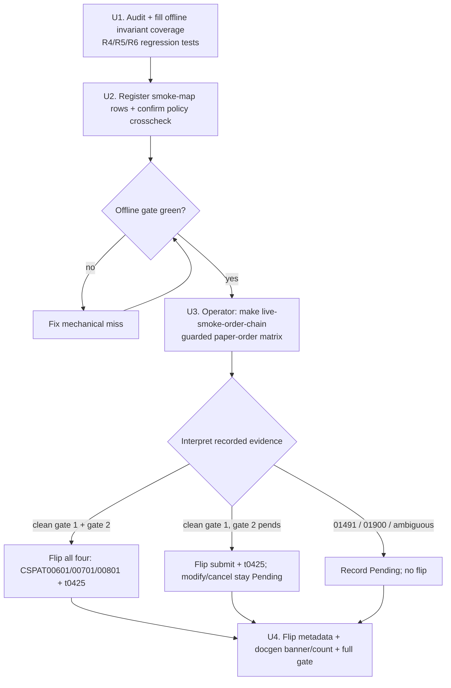

# feat: Certify and flip the four order TRs (order half of the reach wave)

## Summary

Flip `CSPAT00601` (submit), `CSPAT00701` (modify), `CSPAT00801` (cancel), and
`t0425` (inquiry) from Tracked→Implemented now that the paper account is
order-capable. The order runtime and the per-TR-certification, evidence-redaction,
and cancel-safety behaviors already ship; this is a **certify-and-flip** wave —
audit the offline invariant coverage, add the one missing registration
(`smoke-map.md` rows), then gate the metadata flip + docgen count bump on a clean
guarded `make live-smoke-order-chain` run. The breadth reads are out of scope (see
origin's Deferred / Open Questions).

## Problem Frame

The order machinery — `Inner::post_order`, `OrderDeduplicator`, the kill switch,
`classify_order_rsp_cd`, the six-state reconciliation matcher, and the guarded
`order_smoke` harness — landed across the first/second order packages (plans -002,
-003). All four order TRs are fully authored in `crates/ls-sdk/src/orders/mod.rs`
but stay `implemented: false`: the Implemented gate is a guarded live paper-order
run (ADR 0008 / order-safety §4), and prior attempts were blocked by gateway
`01491` (the paper account was provisioned read/inquiry-only). That account has
been replaced with an order-capable paper account, so the gate can now run. The
work left is to certify the invariants offline, complete the one missing
registration, and flip on a clean live matrix — not to build.

## Requirements

- R1. (origin R1) `CSPAT00601`, `CSPAT00701`, `CSPAT00801`, `t0425` flip
  Tracked→Implemented on a clean `live-smoke-order-chain` run exercising
  submit→modify→cancel + a `t0425` reconcile. Gate 1 (submit + inquiry) and gate 2
  (modify + cancel) are independent — gate 1 may flip while gate 2 records Pending.
- R2. (origin R2, R7) Each order TR gains a `smoke-map.md` row pointing at its
  smoke target, and the Makefile smoke targets carry a complete `.PHONY`
  declaration (`live-smoke-order-chain` is currently missing from it); the
  `{TR}_POLICY` consts are confirmed registered in the policy-index crosscheck
  (and absent from the non-order REST list per the order-lane inverse rule).
- R3. (origin R3) A `01491`/order-incapable gateway response during the chain
  records the affected TR(s) as Pending via `ls_core::is_paper_order_incapable` —
  never as evidence. (Already enforced; covered by audit, not new code.)
- R4. (origin R9) Each order TR's flip is certified by that TR's own response
  (`rsp_cd` success + expected out-block), not by a sibling leg or the `t0425`
  reconcile. Verified by offline regression coverage.
- R5. (origin R10) Order-chain evidence stays credential-free at the committed
  posture: account refs HMAC-keyed (not bare hash, not cleartext), `rsp_msg`
  digit-runs scrubbed, response account fields skipped, fixed location with a
  retention bound. Verified by offline regression coverage.
- R6. (origin R11, AE5) A chain that fails mid-sequence after a real submit
  attempts a best-effort cancel of any resting order and records all four order
  TRs Pending — never a partial flip — and an unknown-outcome cancel is treated as
  possibly-still-live (fail toward the safe direction). Verified by offline
  regression coverage of the matcher + chain disposition.
- R7. The full gate (`make docs` / `cargo test` / `cargo test -p ls-core` /
  `make docs-check`) is green, and on a clean matrix the docgen `banner_trs` +
  `reference.len()` and tracked/implemented counts move consistently for whichever
  TRs flipped.

## Key Technical Decisions

- **Certify-and-flip, not build (see origin: Summary).** Research confirmed the
  runtime and the R9/R10/R11 invariants already ship in `crates/ls-sdk/src/orders/`
  and `crates/ls-core/src/inner.rs`. The plan audits invariant coverage and adds
  regression tests only where the offline gate is thin — it does not re-author
  order logic. Net-new code is expected to be test code plus `smoke-map.md` rows.
- **The flip gates on an operator-run live matrix.** Placing real (paper) orders
  is an irreversible market action; `order_smoke` is `#[ignore]`d and runs only via
  `make live-smoke-order-chain` with `LS_TRADING_ENV=paper` + `LS_ORDER_SMOKE=1`.
  The implementer stages all autonomous work and the conditional flip recipe; the
  live run itself is an operator step (U3), and the flip (U4) is applied from its
  recorded evidence. This is not autonomously executable.
- **Independent flip gates.** Per the chained-smoke design, a failure after the
  submit leg flips only gate 1 (submit + `t0425`) and pends gate 2 (modify +
  cancel). U4 flips whatever the matrix certified rather than all-or-nothing.
- **Order TRs register in the crosscheck list only (order-lane inverse rule).**
  `CSPAT00601/00701/00801` are `is_order: true` → policy-index crosscheck only,
  never `slice_rest_policies_are_non_order_rest`. `t0425` is `is_order: false` →
  both lists. Research shows these are already registered; U2 confirms, not adds.

## High-Level Technical Design

The certify-and-flip sequence and its two independent gates:

## Implementation Units

### U1. Audit and fill offline invariant coverage (R4, R5, R6)

- **Goal:** Confirm the offline mock gate asserts each spec-hardening invariant
  (per-TR-own-response certification, evidence redaction, cancel-safety /
  mid-chain-failure disposition) and add regression tests where coverage is thin,
  so the invariants are pinned independent of the live run.
- **Requirements:** R3, R4, R5, R6 (origin R3/R9/R10/R11, AE2/AE5) — the offline
  coverage of the `01491` Pending-classification (R3) lives here alongside the
  other invariant tests.
- **Dependencies:** none.
- **Files:**
  - `crates/ls-sdk/tests/order_logic_gate.rs` (extend)
  - `crates/ls-sdk/src/orders/reconcile.rs` (unit tests — matcher classifications)
  - `crates/ls-core/src/order_dedup.rs`, `crates/ls-core/src/inner.rs` (unit tests
    — dedup, kill-switch, `classify_order_rsp_cd`, `is_paper_order_incapable`)
- **Approach:** Read each invariant's current coverage first; add only the missing
  cases. Per-TR certification (R4): assert a submit/modify/cancel is classified
  from its own response and a sibling leg's success does not certify a TR whose own
  response did not confirm. Redaction (R5): assert the reconciliation record is
  HMAC-keyed (fails closed below the 32-byte key floor), `rsp_msg` digit-runs are
  scrubbed, and response account fields are skipped. Cancel-safety (R6): assert
  cancel classifies `Canceled` only on an explicit `취소` row, a still-`접수`/
  `취소거부` original never clears retry, and the mid-chain-failure path records all
  four Pending with a best-effort cancel attempt.
- **Patterns to follow:** existing cases in `order_logic_gate.rs` and the
  `reconcile` unit suite; the six-state matcher in `reconcile.rs` (`reconcile_rows`
  scans all rows, strongest classification).
- **Test scenarios:**
  - Covers AE2. A `01491` (and `01900`) leg classifies Pending via
    `is_paper_order_incapable` / `is_paper_incompatible`, not Certified.
  - Per-TR certification: a modify whose own response acked but whose `t0425` shows
    only a still-`접수` original is **not** classified landed (safe to retry).
  - Per-TR certification: a submit is certified from its own ack code, and an
    unrecognized `2xx`/`00000` is `AmbiguousOrder`, never silently Accepted.
  - Redaction: `ReconciliationRecord::new` with a sub-32-byte key returns
    `LsError::Config`; account ref and request ref are keyed hashes, never
    cleartext or bare SHA256.
  - Redaction: `rsp_msg` containing a 6+ digit run is scrubbed to `***`; short
    qty/price numbers survive.
  - Covers AE5. Cancel classifies `Canceled` only on an explicit `취소` row; a
    `취소거부` or still-`접수` original classifies still-live and never safe-to-retry.
  - Covers AE5. A simulated mid-chain failure after submit records all four order
    TRs Pending (not a partial flip) and attempts a best-effort cancel.
- **Execution note:** Add characterization coverage for any invariant the gate
  does not already assert before declaring it verified — do not assume coverage
  from the runtime's existence.
- **Verification:** `cargo test` is green and each of R4/R5/R6 maps to at least one
  named offline test that fails if the invariant regresses.

### U2. Register order smoke targets and confirm policy crosscheck (R2)

- **Goal:** Close the missing registration — `smoke-map.md` rows for the four
  order TRs plus the `live-smoke-order-chain` `.PHONY` entry — and confirm (not
  re-add) the policy-index crosscheck membership and the existing Makefile target
  recipes so the TRs are recipe-promotable later.
- **Requirements:** R2 (origin R2/R7).
- **Dependencies:** none (parallel with U1).
- **Files:**
  - `.agents/skills/promote-tr/references/smoke-map.md` (add rows)
  - `crates/ls-core/tests/policy_index_crosscheck.rs` (confirm membership)
  - `crates/ls-core/src/endpoint_policy.rs` (confirm `is_order` flags + the
    non-order REST list excludes the three order consts)
  - `Makefile` (add `live-smoke-order-chain` to `.PHONY`; confirm both target
    recipes)
- **Approach:** Add a `smoke-map.md` row per order TR mapping it to its smoke
  target (`live-smoke-order` for submit + `t0425`; `live-smoke-order-chain` for
  modify + cancel), noting the guarded-harness nature (operator opt-in, paper
  only). Confirm the crosscheck list already carries all four consts and that the
  three `is_order: true` consts are absent from
  `slice_rest_policies_are_non_order_rest`.
- **Patterns to follow:** existing rows in `smoke-map.md`; the order-lane inverse
  registration rule in `.agents/skills/implement-order-tr/SKILL.md` §1.
- **Test scenarios:** `Test expectation: none -- registration/doc change; the
  policy crosscheck test (cargo test -p ls-core) already enforces correctness and
  is the verification.`
- **Verification:** `cargo test -p ls-core` green (policy crosscheck passes);
  `smoke-map.md` has a row for each of the four order TRs.

### U3. Operator: run the guarded paper-order chain matrix (R1, R3)

- **Goal:** Produce the live evidence matrix that gates the flip by running the
  chained submit→modify→cancel + reconcile against the order-capable paper account.
- **Requirements:** R1, R3 (origin R1, R3, AE1, AE2).
- **Dependencies:** U1, U2 (offline gate must be green first).
- **Files:** none authored — runs `crates/ls-sdk/tests/order_smoke.rs`
  (`order_chained_smoke`) via the Makefile.
- **Approach:** Operator runs `make live-smoke-order-chain` with `.env` carrying the
  order-capable paper credentials, `LS_TRADING_ENV=paper`, `LS_ORDER_SMOKE=1`. The
  harness fetches + validates the `t1102` band, places a resting far-from-market
  order, modifies it, cancels it (primary teardown; paper-reset fallback), and
  reconciles via `t0425`, capturing credential-free evidence and confirming/widening
  the observed `rsp_cd` set. If the observed accepted-code set is wider than the
  predicate seed, widen `classify_order_rsp_cd` and re-run U1's gate before U4.
- **Execution note:** **Operator-initiated, not autonomous** — this places real
  (paper) orders. Do not run it as part of automated implementation. Capture the
  recorded evidence (per-leg classification + `rsp_cd`) for U4's flip decision.
- **Test scenarios:** `Test expectation: none -- this is the live evidence run
  itself; its recorded matrix is the gate input for U4.`
- **Verification:** A recorded, credential-free evidence matrix exists with a
  per-leg classification (Certified / Pending / Ambiguous) for submit, modify,
  cancel, and the `t0425` reconcile.

### U4. Flip metadata, bump docgen, and gate (R1, R7)

- **Goal:** On the recorded matrix, flip the certified TRs to Implemented, move the
  docgen banner + counts consistently, and leave the tree green.
- **Requirements:** R1, R7.
- **Dependencies:** U3.
- **Files:**
  - `metadata/trs/CSPAT00601.yaml`, `CSPAT00701.yaml`, `CSPAT00801.yaml`,
    `t0425.yaml` (`support.implemented: true` for certified TRs;
    `recommended: false`; no `recommendation` block; no
    `metadata/evidence/<tr>.yaml`)
  - `metadata/tr-index.yaml`
  - `crates/ls-docgen/src/lib.rs` (`banner_trs` + `reference.len()` literal)
  - regenerated `docs/` (via `make docs`)
- **Approach:** Apply the flip per the matrix outcome — all four on a clean gate 1
  + gate 2; submit + `t0425` only if gate 2 pended; none on a `01491`/`01900`/
  ambiguous run (record the credential-free reason instead). Bump `banner_trs` and
  `reference.len()` by the count of TRs actually flipped, in the same change. Per
  the order recipe this stops at Implemented — `recommended` stays false, ADR 0008
  is retired by the flip but Recommended is a separate pass.
- **Patterns to follow:** `.agents/skills/implement-order-tr/SKILL.md` §6–§8; the
  count-maintenance sites in `crates/ls-docgen/src/lib.rs` and
  `crates/ls-trackers/src/api_drift.rs` (`maintained_tr_count` /
  `implemented_count`); keep the trackers manifest `refreshed` date unchanged.
- **Test scenarios:** `Test expectation: none -- metadata/docgen change; the
  workspace gate (cargo test, cargo test -p ls-core, make docs-check) is the
  verification.`
- **Verification:** `make docs` && `cargo test` && `cargo test -p ls-core` &&
  `make docs-check` all green; certified TRs show `implemented: true`; the
  reference count and banner match the number flipped; pended TRs carry a recorded
  reason and stay `implemented: false`.

## Scope Boundaries

### Out of scope (this plan)

- Breadth reads (origin R4/R5/R6) — deferred per the origin's Deferred / Open
  Questions (overlap with in-flight plan `docs/plans/2026-06-25-001-feat-night-overseas-elw-implement-wave-plan.md`,
  plus mis-classified candidates). They get a restructuring decision first.
- Promotion to Recommended for any order TR — a separate deliberate pass; this plan
  stops at Implemented.

### Deferred to Follow-Up Work

- Broader order abort-cleanup hardening: pre-flight force-cancel of resting orders
  on SDK init, and dedup-cache flush on kill-switch toggle. Not asked for by origin
  R11 (which the chain smoke + matcher already satisfy); worth a future hardening
  task.
- Pre-existing residual: `dispatch_once` in `crates/ls-core/src/inner.rs` can emit
  the raw request body + `rsp_msg` unscrubbed at trace level (account leak at debug;
  left to tracing-subscriber config). Driving live order traffic widens its blast
  radius. Not introduced by this wave; tracked as a separate follow-up.

## Risks & Dependencies

- **The order-capable paper account is unverified until U3 runs.** If it still
  returns `01491` (or `01900`), the entire flip pends — U3/U4 handle this as a
  recorded Pending, not a failure, but the wave's primary objective does not land.
- **Live-run timing.** U3 needs an in-window run with a non-degenerate `t1102` band
  (not halted / limit-locked); a degenerate band records "not certified" rather
  than placing.
- **Predicate widening.** If the live accepted-code set exceeds the seed
  (`00039`/`00040` submit, `00462` modify, `00463`/`00156` cancel), U3 must widen
  `classify_order_rsp_cd` and re-run U1's offline gate before U4 flips.

## Sources & Research

- Origin requirements: `docs/brainstorms/2026-06-25-order-flip-plus-breadth-reach-wave-requirements.md`.
- Order recipe: `.agents/skills/implement-order-tr/SKILL.md` (§1 authoring, §3 mock
  gate, §4 state machine, §5 secret-safety, §6–§8 flip/docgen/gate).
- Runtime + invariants (already shipped): `crates/ls-sdk/src/orders/mod.rs`
  (all four TRs + facade), `crates/ls-sdk/src/orders/reconcile.rs` (six-state
  matcher + HMAC-keyed `ReconciliationRecord`), `crates/ls-core/src/inner.rs`
  (`post_order`, `classify_order_rsp_cd`, `PAPER_ORDER_INCAPABLE_CODE` /
  `is_paper_order_incapable`), `crates/ls-core/src/order_dedup.rs`.
- Harness + targets: `crates/ls-sdk/tests/order_smoke.rs` (`order_chained_smoke`),
  `crates/ls-sdk/tests/order_logic_gate.rs`, `Makefile` (`live-smoke-order`,
  `live-smoke-order-chain`).
- Registration sites: `crates/ls-core/tests/policy_index_crosscheck.rs`,
  `crates/ls-core/src/endpoint_policy.rs`,
  `.agents/skills/promote-tr/references/smoke-map.md`, count sites in
  `crates/ls-docgen/src/lib.rs` and `crates/ls-trackers/src/api_drift.rs`.
- Prior order waves: plans `2026-06-25-002-feat-order-runtime-first-package-plan.md`,
  `2026-06-25-003-feat-order-modify-cancel-wave-plan.md`; `docs/adr/0008-defer-order-runtime-until-safety-package-is-complete.md`.
</content>
