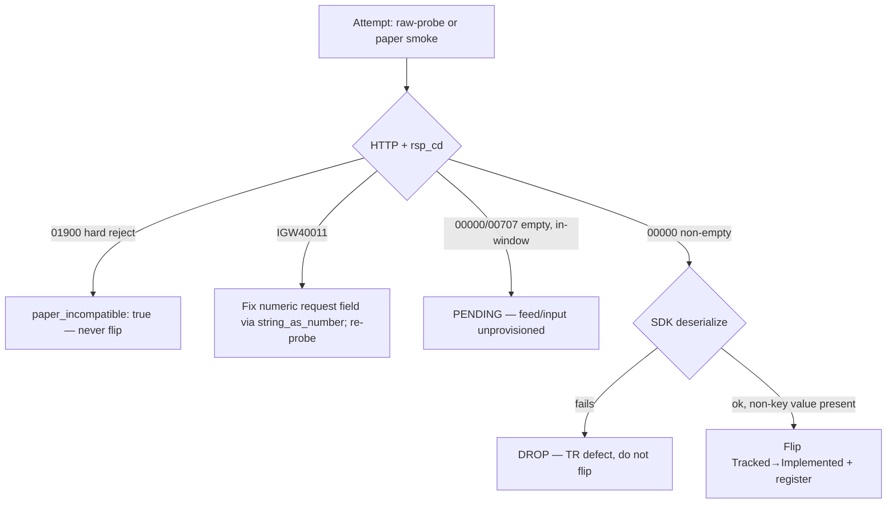
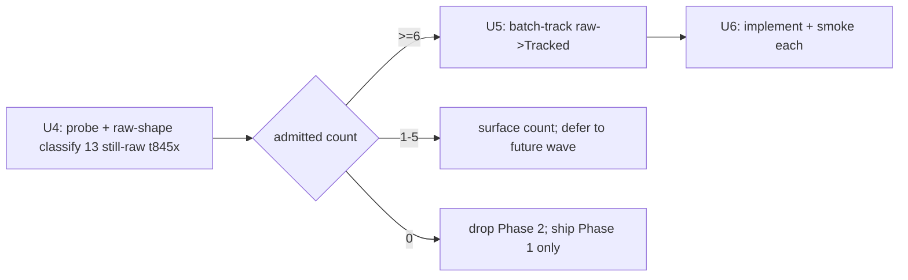

# feat: Tracked-and-Raw Flip Wave

## Summary

Flip TRs to Implemented along two phases, gated on clean paper smokes rather than
the trading window. Phase 1 dispositions the three attemptable already-Tracked
reads (`t8430` full implement; `t2106`/`t3102` raw-probe first, author SDK code
only if the response is populated). Phase 2 probes plan -004's still-raw
master-leaning `t845x` block, and — only if classification admits ≥6 — batch-tracks
and implements them. The wave may legitimately ship a disposition-heavy, low-flip
result; that is an accepted outcome (see origin).

## Problem Frame

The Tracked tier is nearly exhausted of easy wins. Of 18 Tracked-but-unimplemented
TRs, 11 are `paper_incompatible: true` and 4 are caveated, leaving 3 attemptable
reads — none window-gated (verified: `t8430` standalone stock-issue list, `t2106`
anytime F/O memo, `t3102` standalone news body). Real volume lives in the still-raw
master-leaning `t8450`/`t8452`–`t8466` block that plan -004 enumerated and that
remains raw on current `main` (only the illustrative subset was consumed by PR #54).

The wave is sequenced by readiness, not the KRX window. Flips gate on a clean paper
smoke returning non-empty data; everything else is recorded faithfully (PENDING /
`paper_incompatible: true`). The single planning gate carried from the brainstorm —
"do ≥6 of the still-raw candidates classify as pure master/reference?" — is a probe
gate, resolved by U4 below, not a product blocker.

## Key Technical Decisions

- KTD1. **Probe-first for likely-PENDING reads.** `t2106` (expected empty memo) and
  `t3102` (input-blocked on `sNewsno` with no producer) are raw-probed first via the
  credential-safe classifier; callable SDK code is authored only if the probe returns
  a populated body. `t8430` gets the full implement-tr treatment as the most likely
  clean flip (see origin; confirmed in planning).
- KTD2. **Admission is by raw-shape classification, not probe non-emptiness.** A
  single probe shows non-empty-now; the always-on session-independence signal is the
  out-block key shape. The probe screens `01900`/`IGW40011`/wire-health only
  (`docs/solutions/conventions/paper-unavailable-disposition-terminals.md`).
- KTD3. **Phase 2 is a hard gate before any tracking tax.** U4 classifies the 13
  still-raw candidates and emits an admitted set. Tracking (U5) runs only at ≥6
  admitted; 1–5 surfaces the count and defers; 0 drops Phase 2 — the wave ships
  Phase 1 dispositions alone (see origin R8).
- KTD4. **Disposition discipline.** Record the KRX session clock at every smoke;
  assert non-empty before recording a flip; an in-window empty `00707` is PENDING,
  not a drop (`docs/solutions/conventions/market-hours-read-empty-result-disposition.md`).
- KTD5. **Recommended untouched.** Every flip sets `implemented: true`,
  `recommended: false`; new smoke-map rows carry `Promotion: implemented-only`.

## High-Level Technical Design

The per-TR disposition state machine each implement/probe unit follows:

Phase 2 gate flow:

## Implementation Units

### U1. Implement and smoke t8430 (standalone stock-issue list)

- **Goal:** Author callable Rust for `t8430`, smoke it, and flip Tracked→Implemented
  on a non-empty result; record PENDING if the upstream array-shape blocker is real.
- **Requirements:** origin R1; AE1, AE2.
- **Dependencies:** none.
- **Files:** `crates/ls-sdk/src/market_session/mod.rs` (mirror `t1988`/`t3320`; the
  SDK `standalone/` module is OAuth-only `token`/`revoke` and cannot host a post-based
  read — reset `owner_class` from `standalone` to `market_session` at flip);
  `crates/ls-core/src/endpoint_policy.rs`
  (`T8430_POLICY` const + `slice_rest_policies_are_non_order_rest` list);
  `crates/ls-core/tests/policy_index_crosscheck.rs` (import + `policies` array);
  `crates/ls-sdk/tests/live_smoke.rs` (`live_smoke_t8430`); `Makefile`
  (`live-smoke-t8430` + `.PHONY`); `.agents/skills/promote-tr/references/smoke-map.md`
  (row, `Promotion: implemented-only`); `metadata/trs/t8430.yaml` (flip support,
  retire confirmed facets only); `crates/ls-docgen/src/lib.rs` (`banner_trs` +
  `reference.len()` 109→+1).
- **Approach:** Resolve the memory-vs-metadata blocker discrepancy first
  (`certification_path: none` in metadata vs memory's array-shape note) — if the
  out-block is an array-of-issues, model it as a `Vec<OutBlock>`; if a clean smoke
  succeeds, flip. Numeric request fields (if any in the baseline) serialize via
  `#[serde(serialize_with = "ls_core::string_as_number")]`; response numerics use
  `string_or_number`.
- **Patterns to follow:** the `market_session` reads `t1988`/`t3320` (the prior
  standalone-class flips); the implement-tr recipe
  (`.agents/skills/implement-tr/SKILL.md`); dual-registration convention
  (`docs/solutions/conventions/implement-tr-registration-sites.md`).
- **Test scenarios:**
  - Offline: success body with ≥1 issue deserializes; a non-key field holds a real
    value. Covers AE1.
  - Offline: empty `00707` body deserializes as the empty/pending case. Covers AE2.
  - Offline: every numeric request field serializes as a JSON number (assert
    `v["..InBlock"]["<field>"].is_number()`).
  - Offline: `::new()` serializes the in-block under its `serde(rename)` key; no
    caller fields leak.
  - Live: `make live-smoke-t8430` records a credential-safe `LIVE-SMOKE` line on
    non-empty success; on array-shape/deserialize failure, `SMOKE-FAIL` to stderr and
    the unit records PENDING (no flip).
- **Verification:** `t8430.yaml` shows `implemented: true` only after a non-empty,
  deserializing smoke; `T8430_POLICY` present in both cross-check lists; docgen banner
  page renders; or, if blocked, `t8430` stays Tracked with a recorded PENDING and the
  wave proceeds.

### U2. Raw-probe and disposition t2106 (F/O price-memo)

- **Goal:** Classify `t2106` via raw-probe; author callable Rust and flip only on a
  populated memo out-block; otherwise record PENDING with no SDK code.
- **Requirements:** origin R2, R4; AE3.
- **Dependencies:** none.
- **Files (conditional on a populated probe):** `crates/ls-sdk/src/market_session/mod.rs`
  (`t2106` request/response, mirroring the `t8424` header+array shape);
  `crates/ls-core/src/endpoint_policy.rs` + `crates/ls-core/tests/policy_index_crosscheck.rs`
  (`T2106_POLICY` both lists); `crates/ls-sdk/tests/live_smoke.rs` (already has a
  `t2106` harness per smoke-map); `metadata/trs/t2106.yaml`; `crates/ls-docgen/src/lib.rs`
  (`banner_trs` + `reference.len()`).
- **Approach:** `t2106` self-sources its contract `code` from `t8467` and is
  anytime-F/O; the flip gate is memo-row count > 0, not bare `rsp_cd=00000`. Run
  `make raw-probe LS_PROBE_TR_CD=t2106 ...` (or the existing `live-smoke-t2106`) and
  read the memo array length. Empty memo → PENDING, stop (do not author SDK code per
  KTD1). Populated → author the read and flip.
- **Patterns to follow:** `t8424` (header+array market_session read); raw-probe
  classifier (`crates/ls-sdk/tests/live_smoke.rs`, `make raw-probe`).
- **Test scenarios:**
  - Probe-gate: record memo-row count and KRX session clock; branch flip-vs-PENDING.
  - (If populated) Offline: populated memo deserializes; numeric fields parse from
    both string and number JSON via `string_or_number`.
  - Live: empty memo array → `t2106` stays Tracked (PENDING). Covers AE3.
- **Verification:** either `t2106.yaml` flips on a populated, deserializing smoke, or
  it stays Tracked with a recorded PENDING and no new SDK surface.

### U3. Raw-probe and disposition t3102 (standalone news body)

- **Goal:** Determine whether a valid `sNewsno` can be sourced within paper; flip only
  on a populated response; otherwise record an input-blocked PENDING with no SDK code.
- **Requirements:** origin R3, R4; AE4.
- **Dependencies:** none.
- **Files (conditional on a populated probe):** `crates/ls-sdk/src/market_session/mod.rs`
  (mirror `t1988`/`t3320`; not the OAuth-only `standalone/` module — reset
  `owner_class` standalone→market_session at flip);
  `crates/ls-core/src/endpoint_policy.rs` +
  `crates/ls-core/tests/policy_index_crosscheck.rs` (`T3102_POLICY` both lists);
  `crates/ls-sdk/tests/live_smoke.rs` (`live_smoke_t3102`); `Makefile`
  (`live-smoke-t3102` + `.PHONY`); `.agents/skills/promote-tr/references/smoke-map.md`;
  `metadata/trs/t3102.yaml`; `crates/ls-docgen/src/lib.rs`.
- **Approach:** `t3102` is keyed by `sNewsno`, which has no defined producer on paper
  (sourced only from a realtime WS feed). Attempt to source a valid `sNewsno`; if none
  is available, record the input-blocked PENDING and stop — this is the expected
  outcome. Do not author SDK code for an unreachable read (KTD1).
- **Patterns to follow:** standalone caller-input reads; the HELD disposition note
  already in docgen for `t3102`.
- **Test scenarios:**
  - Probe-gate: with no `sNewsno` producer, record input-blocked PENDING. Covers AE4.
  - (If a valid `sNewsno` is found) Offline: populated news body deserializes;
    live smoke records a credential-safe line and flips.
- **Verification:** `t3102` stays Tracked with an input-blocked PENDING unless a valid
  `sNewsno` produces a populated, deserializing smoke.

### U4. Probe and classify the still-raw t845x block (Phase 2 gate)

- **Goal:** Probe and raw-shape-classify the 13 still-raw candidates; emit an admitted
  set of pure master/reference reads and a go/no-go on the ≥6 floor. No tracking yet.
- **Requirements:** origin R5, R6, R8; AE5, AE6.
- **Dependencies:** none (independent of Phase 1).
- **Files:** none committed in this unit — classification output is recorded in the
  plan/PR description and drives U5/U6. Probes run via `make raw-probe`.
- **Approach:** Candidate pool (still raw on `main`): `t8450`, `t8452`, `t8453`,
  `t8454`, `t8456`, `t8457`, `t8458`, `t8459`, `t8461`, `t8462`, `t8464`, `t8465`,
  `t8466`. For each: raw-probe to screen `01900` (paper-incompatible, exclude) and
  `IGW40011` (numeric request field — note for the fix, not a disqualifier); then
  classify the out-block key shape from the raw capture as pure reference/master
  (session/account-independent) vs session-dependent. Admit only pure
  reference/master. Probe non-emptiness alone is not sufficient (KTD2). Exclude any
  overseas/night/account-history shapes.
- **Patterns to follow:** plan -004's probe + raw-shape-classification procedure;
  raw-probe classifier; `docs/solutions/conventions/paper-unavailable-disposition-terminals.md`.
- **Test scenarios:** `Test expectation: none -- classification/probe unit, no code change.`
  - Gate check: a candidate whose probe is non-empty but whose out-block shape is
    session-dependent is NOT admitted. Covers AE6.
  - Gate check: if fewer than 6 admit, record the count and stop Phase 2. Covers AE5.
- **Verification:** an enumerated admitted set with per-candidate disposition; a clear
  ≥6 / 1–5 / 0 verdict that gates U5.

### U5. Batch-track admitted candidates raw→Tracked

- **Goal:** Bring the admitted candidates to Tracked: author metadata, project
  baselines, and bump count assertions.
- **Requirements:** origin R7.
- **Dependencies:** U4 (admitted ≥6).
- **Files:** `metadata/trs/<tr>.yaml` per admitted TR; `metadata/tr-index.yaml`
  routing entries; baselines projected to
  `crates/ls-trackers/baselines/api-drift/normalized/trs/<tr>.json` via
  `make api-drift-renormalize`; `crates/ls-trackers/baselines/api-drift/normalized/manifest.json`
  (`maintained_tr_count` only); `crates/ls-trackers/tests/api_drift.rs:106`;
  `crates/ls-trackers/src/cli.rs` (`:1811`, `:1876`, `:2787` shapes.len);
  `crates/ls-docgen/src/lib.rs:677` (`TRACKED_TRS` length + sorted codes).
- **Approach:** Mirror metadata exemplars by shape (master/reference reads). Run
  `make api-drift-renormalize` to project baselines (never hand-author the JSON);
  the self-diff must show only new baseline files. **Revert `manifest.refreshed`** to
  the last raw-refresh date — renormalize stamps today and breaks the round-trip test
  (`docs/solutions/conventions/api-drift-renormalize-preserves-refreshed-date.md`).
  Bump every count literal by the admitted count N (126→126+N); leave
  `cli.rs:1812` `code_set.len()` 365 unchanged (full inventory, not maintained set).
- **Execution note:** keep `manifest.refreshed` reverted in the same change that runs
  renormalize.
- **Patterns to follow:** the track-tr recipe (`.agents/skills/track-tr/SKILL.md`).
- **Test scenarios:**
  - `cargo test -p ls-metadata -p ls-core` passes with the new metadata.
  - `git diff` over `normalized/trs/` shows only new files (no drift in existing
    baselines).
  - `manifest.json` diff shows only `maintained_tr_count` changed, not `refreshed`.
- **Verification:** admitted TRs at `tracked: true, implemented: false`; all count
  assertions green; `make docs-check` clean.

### U6. Implement and smoke admitted candidates

- **Goal:** Author callable Rust for each admitted candidate, smoke it, and flip
  clean ones to Implemented; PENDING the rest.
- **Requirements:** origin R6, R7, R8, R10; AE7.
- **Dependencies:** U5.
- **Files (per flipped TR):** SDK read module by shape —
  `crates/ls-sdk/src/market_session/mod.rs` (header+array, mirror `t8424`) or
  `crates/ls-sdk/src/paginated/mod.rs` (single-page `post_paginated`, mirror `t1514`);
  any `standalone` owner_class candidate routes to `market_session`, not the
  OAuth-only `standalone/` module;
  `crates/ls-core/src/endpoint_policy.rs` + `crates/ls-core/tests/policy_index_crosscheck.rs`
  (`{TR}_POLICY` both lists); `crates/ls-sdk/tests/live_smoke.rs` (`live_smoke_<tr>`);
  `Makefile` (target + `.PHONY`); `.agents/skills/promote-tr/references/smoke-map.md`
  (row, `Promotion: implemented-only`); `metadata/trs/<tr>.yaml` (flip);
  `crates/ls-docgen/src/lib.rs` (`banner_trs` + `reference.len()` per flip).
- **Approach:** Pick the mirror exemplar per TR from its out-block shape (single-block
  vs header+array vs self-paginated). Numeric request fields use `string_as_number`;
  response numerics use `string_or_number`. Offline deserialize test before the live
  smoke. Record the KRX session clock; assert non-empty before recording a flip
  (KTD4). An in-window empty `00707` is PENDING, not a drop.
- **Patterns to follow:** `t8424`, `t1514`; the implement-tr recipe and registration
  convention.
- **Test scenarios (per candidate):**
  - Offline: populated body deserializes with a real non-key value; empty `00707`
    deserializes as empty case; numeric request fields serialize as numbers; numeric
    response fields parse from both string and number JSON.
  - Live: clean non-empty smoke flips the TR and registers it in both cross-check
    lists; an empty/feed-unprovisioned smoke records PENDING. Covers AE7.
- **Verification:** every clean candidate flips with dual-list registration and a
  docgen banner page; PENDING candidates stay Tracked with a recorded disposition;
  if post-smoke clean flips fall below 6, ship the flips that passed (do not hold the
  cluster) per origin R8.

### U7. Gate green and docs regen

- **Goal:** Regenerate docs and run the full gate so the tree is green before commit.
- **Requirements:** origin R10, R11.
- **Dependencies:** U1, U2, U3, U6 (whatever flipped/dispositioned).
- **Files:** generated `docs/` (via `make docs`); no hand edits.
- **Approach:** `make docs` → `cargo test` (workspace) → `cargo test -p ls-core`
  (metadata + policy cross-check) → `make docs-check`. Confirm `recommended: false`
  unchanged for every TR (no `recommendation` block, no `metadata/evidence/<tr>.yaml`,
  no `EVIDENCE-FRESHNESS.md` touch).
- **Patterns to follow:** the AGENTS.md gate.
- **Test scenarios:** `Test expectation: none -- verification/gate unit.`
  - Full gate passes; `make docs-check` shows committed docs match generated.
- **Verification:** green workspace + `ls-core` + `docs-check`; Recommended tier
  untouched.

## Scope Boundaries

**In scope:** Phase 1 dispositions for `t8430`/`t2106`/`t3102`; Phase 2 probe/classify
+ track/implement for the admitted still-raw `t845x` candidates at ≥6.

**Out of scope (origin "Outside this product's identity"):**
- Wider session categories — additional F&O `t2xxx`, ETF/warrant/bond `t19xx` — and a
  maximal raw sweep.
- Overseas `t3518`/`t3521` and `01900` `MMDAQ91200` from plan -004's pool.
- The 11 `paper_incompatible: true` overseas/night Tracked TRs.

**Deferred for later (origin):**
- Recommended promotion for any Implemented TR, including the order chain.
- The caveated Tracked reads `t1852`, `t1856`, `t1860`, `t1964`.

**Deferred to Follow-Up Work:**
- If U4 admits 1–5 candidates, those survivors defer to a future wave rather than
  broaden this one.

## Risks & Dependencies

- **Low / zero net flips is an accepted outcome.** `t8430` may be array-shape-blocked;
  `t2106`/`t3102` are expected PENDING; Phase 2 drops if <6 admit. The wave's value
  may be faithful dispositions plus a sized reservoir (accepted — see origin).
- **Silent registration omissions.** `{TR}_POLICY` must land in BOTH cross-check lists
  and each TR needs a smoke-map row + Makefile `.PHONY`; none are asserted by a
  compile error. Follow the registration convention per unit.
- **IGW40011 numeric fields.** Any numeric request field sent as a string fails;
  a multi-numeric TR fails if even one is unquoted. Assert `is_number()` offline.
- **Count-assertion drift.** raw→Tracked bumps `maintained_tr_count` + `TRACKED_TRS`
  + `cli.rs` shapes literals by N; flips bump `reference.len()` + `banner_trs` per
  flip; `manifest.refreshed` must be reverted after renormalize.
- **`t8430` blocker discrepancy** (memory: array-shape; metadata: `certification_path:
  none`) — resolve at smoke time (U1).

## System-Wide Impact

Count-assertion and registration sites this wave touches:

- **raw→Tracked (N admitted, U5):** `crates/ls-trackers/tests/api_drift.rs:106`
  (`maintained_tr_count` 126→126+N); `crates/ls-trackers/src/cli.rs:1811`/`1876`/`2787`
  (`shapes.len()` 126→126+N; `:1812` `code_set.len()` 365 unchanged);
  `crates/ls-docgen/src/lib.rs:677` (`TRACKED_TRS` `[&str;126]`→`[&str;126+N]` + sorted
  codes); `manifest.json` `maintained_tr_count` only (`refreshed` reverted).
- **Tracked→Implemented (per flip, U1/U2/U3/U6):** `crates/ls-core/src/endpoint_policy.rs`
  (`{TR}_POLICY` const + `slice_rest_policies_are_non_order_rest` list, ~`:2033`–`2129`);
  `crates/ls-core/tests/policy_index_crosscheck.rs` (import + `policies` array,
  ~`:68`–`196`); `crates/ls-docgen/src/lib.rs` (`banner_trs` ~`:921`–`939`;
  `reference.len()` 109→109+flips, `:1020`). `maintained_tr_count` is NOT changed by a
  flip.

## Sources & Research

- Origin: `docs/brainstorms/2026-06-26-tracked-and-raw-flip-wave-requirements.md`.
- `docs/plans/2026-06-25-004-feat-domestic-stock-master-reference-breadth-plan.md` —
  enumerated still-raw pool, probe + raw-shape-classification procedure, flip floor.
- Recipes: `.agents/skills/track-tr/SKILL.md`, `.agents/skills/implement-tr/SKILL.md`.
- Gotchas: `docs/solutions/integration-issues/ls-gateway-igw40011-numeric-request-fields.md`;
  `docs/solutions/conventions/market-hours-read-empty-result-disposition.md`;
  `docs/solutions/conventions/api-drift-renormalize-preserves-refreshed-date.md`;
  `docs/solutions/conventions/implement-tr-registration-sites.md`;
  `docs/solutions/conventions/paper-unavailable-disposition-terminals.md`.
- Patterns: `t8424` (`crates/ls-sdk/src/market_session/mod.rs`), `t1514`
  (`crates/ls-sdk/src/paginated/mod.rs`); raw-probe classifier
  (`crates/ls-sdk/tests/live_smoke.rs`, `make raw-probe`).
- Smoke registry: `.agents/skills/promote-tr/references/smoke-map.md`; `Makefile`.
- Still-raw `t845x` pool (verified on `main`): `t8450`, `t8452`, `t8453`, `t8454`,
  `t8456`, `t8457`, `t8458`, `t8459`, `t8461`, `t8462`, `t8464`, `t8465`, `t8466`.
