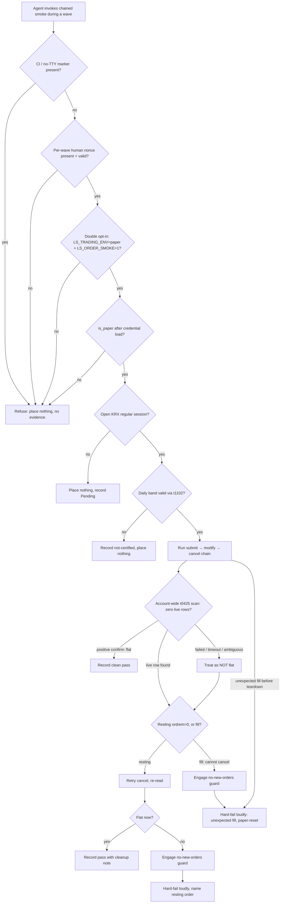
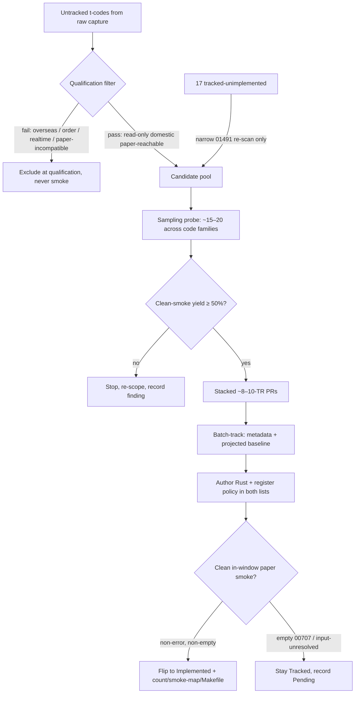

# feat: Order-Smoke Autonomy + Domestic Read-Breadth Sweep

## Summary

Two sequenced tracks. Track 1 makes the order live-smoke agent-runnable: drop the operator handoff, keep every fail-closed guard, add a fail-closed autonomy precondition, a post-run flat-account assertion with best-effort cleanup, and suppress the unscrubbed dispatch debug log for autonomous runs. Track 2 sweeps the untracked domestic `t`-read pool — qualify read-only paper-reachable candidates, gate the batch behind a sampling probe, and flip every clean-smoking read to Implemented with non-flips dispositioned Pending. Orders land first as a risk-sequencing choice; the reads sweep is independently deliverable.

---

## Problem Frame

The order surface is already callable and Implemented on paper (submit `CSPAT00601`, modify `CSPAT00701`, cancel `CSPAT00801`, reconcile `t0425`), and the fixed paper credentials clear the `01491` account-not-order-capable block. But the order live-smoke is deliberately operator-gated: a human runs `make live-smoke-order-chain` in-window and the agent waits. That forces a human into the loop on every order wave and re-certification — a recurring cost. Track 1 removes the handoff while converting the implicit human-present assumption into an explicit, committed safety invariant set.

Separately, only 126 of the ~700 raw TR codes are tracked, and just 17 of those are tracked-but-unimplemented — nearly all blocked for real reasons (paper-empty overseas/night feeds, unresolved request inputs, realtime-only control). The genuine breadth frontier is the untracked raw domestic `t`-read pool. The origin estimated this pool at ~270 `t`-prefixed codes; enumerating the current raw capture against existing metadata narrows the actual untracked-`t` count to ~101. Either figure is large enough to justify the sampling-gated sweep; the qualification filter (U6) shrinks it further to read-only paper-reachable candidates. The pool is reachable now via the standard track → implement → in-window-smoke loop while the KRX session is open.

Removing the operator gate is a conscious risk-acceptance: it trades a human pre-placement checkpoint for post-run detection (the flat-account assertion). The trade is acceptable only because placement stays paper-only and fail-closed, and the reversal cost of an unattended bad order is bounded by paper reset.

---

## High-Level Technical Design

Directional guidance for reviewers — not implementation specification.

### Track 1 — autonomous order-smoke run lifecycle

### Track 2 — domestic read-breadth sweep pipeline

---

## Requirements

Carried from the origin requirements doc; R-IDs preserved.

### Track 1 — order-smoke autonomy

- R1. The order live-smoke runs without an operator handoff — the agent invokes the chained smoke directly during a wave. Autonomy is bounded to interactive, human-present waves via a fail-closed refusal precondition the harness checks before any placement.
- R2. The existing fail-closed guards are retained unchanged: double opt-in, daily-band validation via `t1102`, and "not certified" evidence on unset selection or invalid params. Autonomous placement additionally asserts the resolved environment is paper *after* credential load via `is_paper()`, never trusting the env var alone.
- R3. After the chained run, the harness asserts the account is **flat** — an account-wide `t0425` working-orders scan returns zero live (resting or partially-resting) rows and no unexpected fill — and hard-fails loudly if not. A failed, timed-out, or ambiguous order-state read is treated as NOT flat — "flat" is concluded only from positive confirmation. A still-resting order triggers best-effort cleanup (retry cancel) before the hard-fail, and the failure names the order that may remain resting. A fill cannot be canceled, so it routes straight to hard-fail with paper-reset as the sole remediation. The order kill-switch is a "no new orders" guard, not a teardown mechanism (it halts dispatch and cannot cancel a resting order).
- R4. When invoked outside an open KRX regular session, the smoke places nothing and records Pending — no order is left resting unattended.
- R5. An unexpected fill is surfaced as a loud, actionable failure carrying the order identifiers, not a silent Pending. All autonomous-run output stays credential- and account-free, covering non-numeric secrets (bearer tokens, appkeys) and the account product suffix — not only digit runs. Loud-failure messages (NOT-flat, unexpected-fill, cleanup-failure) are constructed from already-scrubbed fields and routed through the scrubber — never raw `rsp_msg` or `LsError` text interpolated into a `panic!`/`assert!`. The unscrubbed `dispatch_once` whole-body/`rsp_msg` debug log is **suppressed** for autonomous runs, and the broker text propagated into returned `LsError` values is scrubbed before any output (suppressing the debug events alone is necessary but not sufficient).

### Track 2 — domestic read-breadth sweep

- R6. Qualify the untracked domestic `t`-read pool to read-only, paper-reachable candidates; exclude overseas (`g`/`o`), order/account-write, realtime, and night-only feeds.
- R7. Batch-track qualified candidates (metadata entry plus projected normalized baseline) before any flip. Gate the full batch behind a sampling probe: qualify and smoke ~15–20 candidates first; if the clean-smoke yield falls below 50%, stop and re-scope rather than batch-tracking all.
- R8. Flip every tracked candidate that returns a clean in-window paper smoke (non-error response, non-empty payload) to Implemented; the realized count is emergent.
- R9. Non-flips are tracked and faithfully dispositioned — Pending for input-unresolved or paper-empty results — and never silently dropped.
- R10. Each flipped TR carries its smoke-map row, Makefile target, and the emergent count-test updates, keeping the gate green.

### Cross-cutting — sequencing and delivery

- R11. The order-autonomy change lands first as a risk-sequencing choice, not a data dependency. The reads sweep is independently deliverable.
- R12. The reads sweep ships as stacked, reviewable PRs (~8–10 TRs each), not one mega-PR.

---

## Key Technical Decisions

- KTD1 — R1 refusal precondition is both checks, fail-closed on either: refuse if a CI/no-TTY marker is present (`CI`, `GITHUB_ACTIONS`, no TTY) OR if a per-wave human-issued nonce is absent/invalid. Passive CI detection alone cannot distinguish a human-present agent wave from an unmarked headless runner; the active nonce does. The nonce must be single-use or short-TTL-bound, never a static reusable constant — otherwise "valid nonce" degenerates to "env var present," which a cron, CI job, or cached agent loop satisfies, defeating the human-present guarantee the nonce exists to provide. The nonce is distinct from the standing `LS_ORDER_SMOKE` opt-in (which by itself cannot tell an agent wave from CI).

- KTD2 — Flat-account assertion is an account-wide `t0425` working-orders scan, not a per-intent reconcile. `reconcile_rows` matches only rows for a single `OrderIntent`, so it proves the smoke's own order reconciled — not that the account holds no other live order (e.g., a leftover from a prior aborted autonomous run). The flat check therefore queries `t0425` for all working orders and asserts zero live rows. It must distinguish 체결 (filled) from 접수 (resting): `classify_status` collapses both into `OrderState::Accepted`, so the flat check keys on `ordrem` (미체결잔량) — `ordrem > 0` is a cancelable resting remainder, a fully-filled row is a position. This stays within the `t0425` reconcile endpoint; no new position-inquiry TR is introduced. Positive-confirmation-only: a failed, timed-out, or ambiguous read is NOT flat.

- KTD3 — NOT-flat handling depends on the row type, and the order kill-switch is not a teardown. The kill-switch is `set_orders_enabled(false)`, which halts all order dispatch before any HTTP call — so a cancel issued after it is blocked, and it cannot remove a resting order. Resting-order removal comes only from repeated cancel attempts; the kill-switch's role is a "no new orders" guard, engaged so a wedged run places nothing further, not as a cleanup step. A still-resting order after retry-cancel hard-fails loudly naming the order. A fill cannot be canceled at all, so it routes straight to hard-fail with paper-reset documented as the sole remediation. Because autonomy removes the operator who previously cleared a failed teardown, a hard-fail with a still-resting order is the expected terminal when cancel cannot land — detection plus the no-new-orders guard, not a guaranteed clean teardown, is what bounds the unattended state.

- KTD4 — The autonomous-run output-safety mechanism is fail-closed and covers both the debug log and the returned error. The leak sites (`crates/ls-core/src/inner.rs` lines ~343 `rsp_msg` and ~353 raw `body`) log whole broker text the digit-run scrubber never sees, and the same `rsp_msg` is propagated into returned `LsError::ApiError`/`AmbiguousOrder` values. The autonomous harness installs a tracing subscriber that drops the `ls_core` dispatch debug events, and asserts the filter actually took effect (no foreign global subscriber already installed) — refusing the run otherwise, since `tracing` allows one global default per process and a silent install-failure would be fail-*open* on a known secret leak. Suppressing the debug events is necessary but not sufficient: any emitted `LsError` text is treated as untrusted broker text and run through the widened scrubber before output. A more robust source-level fix (a dispatch-level redaction flag) is the better long-term option but stays a separate follow-up; broader dispatch-log hardening for all callers also stays a follow-up.

- KTD5 — `is_paper()` after credential load is the enforceable runtime invariant. Account order-capability is orthogonal to environment (the `01491` history shows a paper env can hold an order-capable account), so "the configured account is a paper account, not real-money" is a credential-provisioning obligation recorded in Dependencies, not a runtime check.

- KTD6 — Qualification filter (R6): a candidate qualifies when `owner_class ∈ {market_session, paginated, account}` AND `instrument_domain ∈ {stock, sector_index, futures_options}` AND `paper_incompatible: false` AND `protocol: rest`, with no order-id / registration / mutation request markers and no `g`/`o` overseas prefix. Account reads (`account_state: true`) tolerate an empty `00707` (disposition Pending, not exclude).

- KTD7 — Emergent flip-all-clean count, no consumer-value gate. Flip what smokes clean this window rather than cherry-pick to a number; non-flips are dispositioned Pending. (The consumer-value-gate review question is resolved as no gate — see origin.)

- KTD8 — Sampling probe drawn across code families, 50% clean-yield floor. The ~15–20 probe candidates span code families (not a contiguous block) so the yield generalizes; below 50% clean (≈8 of 15–20) the sweep stops and re-scopes.

- KTD9 — Count-bump rule: `raw → tracked` increments `maintained_tr_count` (currently 126; auto-recomputed by `make api-drift-renormalize`); `tracked → implemented` does NOT. A flip bumps `banner_trs`, the `reference.len()` literal (`crates/ls-docgen/src/lib.rs`), the `.PHONY` smoke target, the smoke-map row, and registers `{TR}_POLICY` in both crosscheck lists (`crates/ls-core/tests/policy_index_crosscheck.rs` and the `slice_rest_policies_are_non_order_rest` list in `crates/ls-core/src/endpoint_policy.rs`). The manifest `refreshed` date stays at the last raw-refresh date.

- KTD10 — Orders-first sequencing is a process preference, not a technical gate. Read smokes are already agent-runnable and the reads sweep could run concurrently; orders land first to ship and verify the higher-risk change before fanning out.

---

## Implementation Units

### U1. Fail-closed autonomy precondition

- Goal: Add the R1 refusal precondition that bounds autonomy to interactive, human-present waves.
- Requirements: R1. Covers AE1.
- Dependencies: none.
- Files: `crates/ls-sdk/tests/order_smoke.rs`, `Makefile`.
- Approach: Add a precondition checked before any guard that could lead to placement. Refuse (place nothing, record no evidence) when a CI/unattended marker is detected (`CI`/`GITHUB_ACTIONS` env, or no TTY via `std::io::IsTerminal`) OR when a per-wave human-issued nonce is absent or invalid. The nonce must be single-use or short-TTL-bound (e.g., a time-boxed token the human mints fresh each wave) — a static reusable constant is explicitly rejected, since an env-var-present check alone is exactly what a headless runner can satisfy. Both conditions must pass; either failing refuses. Distinct from the standing `LS_ORDER_SMOKE` opt-in.
- Patterns to follow: existing `paper_guard()` / `order_smoke_guard()` fail-closed shape in `order_smoke.rs` (return `LsError::Config` before SDK construction).
- Test scenarios:
  - Covers AE1. CI marker present (`CI=true`) + valid nonce → refuses, places nothing.
  - No TTY detected + valid nonce → refuses.
  - Nonce absent, no CI marker, TTY present → refuses (active human gate missing).
  - Nonce present (fresh, in-window) + no CI marker + TTY present → precondition passes (proceeds to existing guards).
  - Expired-TTL nonce → refuses.
  - Replayed / already-consumed nonce, or a static well-known constant → refuses (env-var-present is not sufficient).
- Verification: invoking the smoke under a simulated CI env or without the nonce produces a refusal with no placement and no evidence line.

### U2. Post-credential-load paper assertion

- Goal: Assert the resolved environment is paper after credential load, retaining all existing guards (R2).
- Requirements: R2. Covers AE2.
- Dependencies: U1.
- Files: `crates/ls-sdk/tests/order_smoke.rs`, references `crates/ls-core/src/config.rs` (`Environment::is_paper()`).
- Approach: After `LsConfig::from_env()` resolves credentials, assert `config.environment.is_paper()` before any placement; refuse otherwise. Keep the existing double opt-in, `t1102` band validation, and not-certified evidence paths unchanged. The env var check stays as a first gate; the resolved `is_paper()` is the enforceable invariant.
- Patterns to follow: existing resolved-config check at `order_smoke.rs` (the `is_paper()` double-check after config load).
- Test scenarios:
  - Covers AE2. `LS_TRADING_ENV=paper` set in shell but credential load resolves a non-paper environment → placement refused.
  - Resolved paper environment → assertion passes, proceeds.
  - Existing guards still fire: missing `LS_ORDER_SMOKE` → not-certified; degenerate `t1102` band → not-certified, no placement.
- Verification: a non-paper resolved config refuses even with the paper env var set; paper config proceeds with all prior guards intact.

### U3. Post-run flat-account assertion + autonomous cleanup

- Goal: Assert the account is flat after the chained run via an account-wide `t0425` scan; on NOT-flat, retry-cancel a resting order or hard-fail a fill, and engage the no-new-orders guard (R3, R4).
- Requirements: R3, R4. Covers AE3, AE4.
- Dependencies: U2.
- Files: `crates/ls-sdk/tests/order_smoke.rs`, references `crates/ls-sdk/src/orders/reconcile.rs` (`reconcile_rows`, `OrderState`, `classify_status`), `crates/ls-sdk/src/orders/mod.rs` (`reconcile()`, `ordrem`, `set_orders_enabled`).
- Approach: After the submit → modify → cancel chain, run an account-wide `t0425` working-orders scan (not the per-intent `reconcile_rows`, which only matches the smoke's own order) and assert zero live rows. Distinguish row types by `ordrem`: `ordrem > 0` is a cancelable resting remainder; a fully-filled (체결, `ordrem == 0`) row is an unexpected fill. Treat a failed, timed-out, or ambiguous read as NOT flat (positive confirmation only). A resting order → retry cancel, re-read, and if still resting hard-fail naming the order. A fill → hard-fail immediately (cancel cannot undo it), paper-reset is the sole remediation. The kill-switch (`set_orders_enabled(false)`) is engaged as a "no new orders" guard on a wedged run — it halts dispatch and is not a cleanup step. Out-of-window invocation (gateway window-closed code, e.g. `01458`) places nothing and records Pending.
- Patterns to follow: the `t0425` page-exhausting scan in `reconcile.rs`; `ordrem` deserialization in `orders/mod.rs`; the chained-smoke post-cancel warning currently at `order_smoke.rs` (replace the advisory note with the asserting check).
- Test scenarios:
  - Covers AE3. Cancel link fails leaving a resting order (`ordrem > 0`) → retry cancel, then hard-fail reporting the order number, no clean pass recorded.
  - Covers AE4. Invoked outside an open KRX regular session → places nothing, records Pending.
  - A filled row (체결, `ordrem == 0`) in the scan → hard-fail immediately, no cancel attempt, paper-reset named.
  - Account-wide scan finds a live row that does NOT match the smoke's intent (leftover from a prior run) → NOT flat, hard-fail (the per-intent reconcile would have missed it).
  - Reconcile read times out / ambiguous → treated as NOT flat.
  - Clean teardown (all canceled, zero live rows) → flat confirmed, clean pass recorded.
  - Retry-cancel succeeds → pass recorded with cleanup note (not a hard-fail).
- Verification: a simulated resting order drives retry-cancel-then-hard-fail with the order identifier; a simulated fill drives immediate hard-fail; a clean chain records a positively-confirmed account-wide flat pass.

### U4. Autonomous-run output safety hardening

- Goal: Widen output scrubbing and suppress the unscrubbed dispatch debug log for autonomous runs; surface unexpected fills loudly (R5).
- Requirements: R5. Covers AE5.
- Dependencies: U2.
- Files: `crates/ls-sdk/tests/order_smoke.rs`, references `crates/ls-core/src/inner.rs` (dispatch debug log sites).
- Approach: Extend the existing digit-run scrubbing to also redact non-numeric secrets (bearer tokens, appkeys) and the account product suffix in any autonomous-run output line. Route every loud-failure message (NOT-flat, unexpected-fill, cleanup-failure) through the scrubber — build them from already-scrubbed fields, never interpolate raw `rsp_msg` or an `LsError` Display/Debug into a `panic!`/`assert!`. Suppress the whole-body/`rsp_msg` dispatch debug events (`inner.rs` ~343, ~353) by installing a tracing subscriber that drops those `ls_core` dispatch debug events, and assert the filter took effect (no foreign global subscriber already installed) — refuse the run otherwise, so suppression fails closed rather than silently fail-open. Suppressing the debug events is necessary but not sufficient: the same `rsp_msg` propagates into returned `LsError::ApiError`/`AmbiguousOrder`, so treat any emitted error text as untrusted and scrub it before output. An unexpected fill surfaces as a loud, actionable failure carrying the order identifiers, never a silent Pending.
- Patterns to follow: existing `scrub_digit_runs()` in `order_smoke.rs`; HMAC-keyed evidence record shape in `reconcile.rs` for account-free output.
- Test scenarios:
  - Covers AE5. Submit fills unexpectedly before teardown → loud failure carrying order identifiers, not a silent Pending.
  - A hard-fail message built under a synthetic account-bearing `rsp_msg` contains no account digit run, secret, or suffix.
  - An emitted `LsError` under an account-bearing `rsp_msg` is account-free in output.
  - Scrubber masks a bearer-token-shaped string and an account product suffix in an output line.
  - With dispatch debug logging enabled, an autonomous run emits no whole-body / `rsp_msg` line.
  - A foreign global tracing subscriber is already installed → the run refuses (suppression cannot be guaranteed) rather than proceeding.
  - Existing digit-run scrubbing still masks 6+ digit account runs.
- Verification: autonomous-run stdout under debug logging contains no secrets, account digits, suffix, or whole-body broker text; hard-fail and error paths are scrubbed; an unexpected fill fails loudly; a run with an uncontrolled subscriber refuses.

### U5. Remove operator handoff + wire agent-invoked chain

- Goal: Drop the documented operator gate and compose U1–U4 into an agent-invocable autonomous run (R1, R11).
- Requirements: R1, R11.
- Dependencies: U1, U2, U3, U4.
- Files: `Makefile`, `crates/ls-sdk/tests/order_smoke.rs`, `.agents/skills/implement-order-tr/SKILL.md`, `.agents/skills/promote-tr/references/smoke-map.md`.
- Approach: Replace the "operator runs this in-window" handoff with an autonomous entry that the agent invokes during a wave, gated by U1's precondition. Update the Makefile target comments/recipe to reflect agent-invocability (keep the double opt-in + paper env exports). Update the order-smoke recipe docs to describe the autonomy invariants (CI/nonce refusal, paper assertion, flat-account assertion, log suppression) as the new contract. This unit is documentation + wiring; the safety logic lives in U1–U4.
- Patterns to follow: existing `live-smoke-order-chain` target and `run_smoke` macro in `Makefile`.
- Test scenarios: Test expectation: none — wiring + docs; behavioral coverage lives in U1–U4. Verification is the gate (`make docs-check`, `cargo test`) plus a dry agent-invoked run that exercises the precondition.
- Verification: an agent can invoke the chained smoke during an interactive wave without a human handoff, and the recipe docs state the autonomy invariants.

### U6. Qualify the untracked domestic t-read pool

- Goal: Produce the read-only paper-reachable candidate list from the untracked `t`-pool and run the narrow `01491` re-check (R6).
- Requirements: R6. Covers AE6.
- Dependencies: none (independent of Track 1 — R11).
- Files: `crates/ls-trackers/baselines/api-drift/raw/ls-openapi-full.json` (read), `metadata/trs/` (read), produces a working candidate list (scratch, not committed).
- Approach: Enumerate `t`-codes present in the raw capture with no `metadata/trs/<tr>.yaml`. Apply KTD6's filter against the raw request/response shape and intended facets: drop overseas (`g`/`o` — none in the `t`-pool, but exclude any overseas-domain `t`), order/account-write (order-id, qty/price, register/deregister markers), realtime (`is_websocket`), and night-only feeds. Separately, re-scan only the 17 tracked-but-unimplemented TRs for any whose sole blocker was the `01491`-stalled placement path the new creds now clear; the overseas/night/input-unresolved/realtime classes stay deferred.
- Patterns to follow: recently-implemented domestic read metadata exemplars (`t8430` market_session, `t1514` paginated) for the qualifying facet shape.
- Test scenarios:
  - Covers AE6. A candidate requiring overseas data or an order-capable account is excluded at qualification (not in the candidate list).
  - A realtime (`is_websocket: true`) `t`-code is excluded.
  - A read-only domestic market-data `t`-code with `paper_incompatible: false` qualifies.
  - The 17-TR re-check yields only `01491`-class re-enables (or an empty set), not overseas/night/input-unresolved.
- Verification: the candidate list contains only read-only domestic paper-reachable `t`-codes; excluded classes are absent and the exclusion reason is recorded.

### U7. Sampling probe and yield-floor gate

- Goal: Track and smoke a ~15–20 cross-family probe and apply the 50% clean-yield gate before committing to the full sweep (R7).
- Requirements: R7.
- Dependencies: U6.
- Files: `metadata/trs/<tr>.yaml` (probe set), `metadata/tr-index.yaml`, `crates/ls-trackers/baselines/api-drift/normalized/trs/<tr>.json`, `crates/ls-trackers/baselines/api-drift/normalized/manifest.json`, `crates/ls-sdk/tests/live_smoke.rs`, `Makefile`.
- Approach: Select ~15–20 candidates spanning code families (not a contiguous block), batch-track them via the track-tr recipe (metadata + `make api-drift-renormalize` projected baseline; this moves `maintained_tr_count`), implement and smoke each in-window. Compute the clean-smoke yield (non-error, non-empty). If yield ≥ 50%, proceed to U8; if below, stop, record the finding, and re-scope rather than batch-tracking the rest. Log the probe composition and yield so the decision is auditable.
- Patterns to follow: track-tr recipe (`.agents/skills/track-tr/SKILL.md`); implement-tr smoke state machine (`.agents/skills/implement-tr/SKILL.md`).
- Test scenarios:
  - Each probe TR has an offline deserialize test (success body, numeric via `string_or_number`, empty `00707` case) before its smoke.
  - The probe set spans ≥3 code families (verifiable from the selected codes).
  - Yield computation counts only non-error non-empty smokes as clean.
  - Below-floor yield halts the sweep (no U8 batch-tracking) and records a re-scope note.
- Verification: a recorded probe-yield decision (proceed or re-scope) with the cross-family composition and the clean count.

### U8. Stacked-PR batch-track → flip → disposition loop

- Goal: Track, implement, smoke, and flip the qualified pool in stacked ~8–10-TR PRs, dispositioning non-flips Pending and keeping the gate green (R8, R9, R10, R12).
- Requirements: R8, R9, R10, R12. Covers AE7.
- Dependencies: U7 (gate must pass).
- Files: `metadata/trs/<tr>.yaml`, `metadata/tr-index.yaml`, `crates/ls-trackers/baselines/api-drift/normalized/trs/<tr>.json`, `crates/ls-trackers/baselines/api-drift/normalized/manifest.json`, `crates/ls-sdk/src/market_session/`, `crates/ls-sdk/src/paginated/`, `crates/ls-sdk/src/account/`, `crates/ls-core/src/endpoint_policy.rs`, `crates/ls-core/tests/policy_index_crosscheck.rs`, `crates/ls-docgen/src/lib.rs`, `crates/ls-trackers/src/cli.rs`, `crates/ls-sdk/tests/live_smoke.rs`, `Makefile`, `.agents/skills/promote-tr/references/smoke-map.md`.
- Approach: For each ~8–10-TR batch (one stacked PR): batch-track (if not already tracked in the probe), author the callable Rust routed by `owner_class`/`self_paginated` (mirror `t1102` non-paginated, `t1514` single-page paginated, `CSPAQ12200` account), register `{TR}_POLICY` in both crosscheck lists, add the offline deserialize tests, run the in-window paper smoke. Clean (non-error, non-empty) → flip to Implemented and apply every count-bump (KTD9): `banner_trs`, `reference.len()`, `.PHONY`, smoke-map row, `cli.rs` count literals. Empty `00707` or input-unresolved → stay Tracked, record Pending (never drop). Run the full gate before each PR.
- Patterns to follow: implement-tr recipe and `.agents/skills/.../conventions/implement-tr-registration-sites.md`; the per-TR mirror examples; the count-test sites enumerated in KTD9.
- Test scenarios:
  - Covers AE7. A tracked candidate returning non-error non-empty in-window flips to Implemented; one returning empty `00707` or input-unresolved stays Tracked and is recorded Pending.
  - Per flipped TR: offline deserialize test (success + numeric `string_or_number` + empty-result) passes before the smoke.
  - `{TR}_POLICY` registered in both crosscheck lists — `cargo test -p ls-core` policy cross-check green.
  - Count-bump completeness: `make docs-check` green after `banner_trs` + `reference.len()` bumps; `cli.rs` count literals updated.
  - `tracked → implemented` does not move `maintained_tr_count`; the probe-tracking in U7 already did.
- Verification: each stacked PR passes `make docs && cargo test && cargo test -p ls-core && make docs-check`; flipped TRs are Implemented, non-flips recorded Pending.

---

## Acceptance Examples

- AE1. Covers R1. Given the smoke is invoked in a CI or otherwise unattended context (no human nonce / detected CI marker), then it refuses and places nothing.
- AE2. Covers R2. Given credential load resolves a non-paper environment, then placement is refused even with `LS_TRADING_ENV=paper` set in the shell.
- AE3. Covers R3. Given the chained smoke runs and the cancel link fails leaving a resting order, then the harness attempts autonomous cleanup, then hard-fails reporting the order number, and records no clean pass.
- AE4. Covers R4. Given the smoke is invoked outside an open KRX regular session, then it places nothing and records Pending.
- AE5. Covers R5. Given a submit fills unexpectedly before teardown, then the run surfaces a loud, actionable failure carrying the order identifiers — not a silent Pending.
- AE6. Covers R6. Given a candidate requires overseas data or an order-capable account, then it is excluded at qualification and never smoked.
- AE7. Covers R8, R9. Given a tracked candidate read returns a non-error, non-empty response in-window, then it flips to Implemented; given it returns empty `00707` or is input-unresolved, then it stays Tracked and is recorded Pending.

---

## Scope Boundaries

### Deferred for later

- Orders → Recommended (separate ADR 0008 pass endorsing live order placement). This wave makes the smoke autonomous; it does not promote the order TRs.
- The 17 tracked-but-unimplemented TRs beyond the narrow `01491` re-check — any whose blocker the new creds + open window clear are flipped; the rest stay deferred pending their specific blocker.
- Resolving request-field inputs for input-unresolved domestic reads — those record Pending this wave.

### Outside this wave's identity

- Overseas stock and derivative feeds (`g`/`o` prefixes) — paper carries no data.
- Night-only derivative TRs and `krx_extended` account TRs (e.g. `CCENQ` family).
- Realtime registration / control TRs (`t1860`-class) — not read-only.

### Deferred to Follow-Up Work

- Broader `dispatch_once` log hardening for all callers (not just autonomous order runs) — this wave suppresses the leak for autonomous runs only (KTD4).
- A consumer-value gate on flips — explicitly not added this wave (KTD7); if Implemented-count-of-unused-reads becomes a concern, sequence as a separate implement-on-demand pass.
- Splitting the two tracks into separate plan docs — kept as one plan with orders-first sequencing; revisit only if the tracks diverge in delivery.

---

## Risks & Dependencies

### Dependencies / Assumptions

- The fixed paper credentials clear `01491` (order-capable account) — verified for the order surface; required for R1–R5 to certify rather than record Pending.
- The `.env` must point at a paper account, never a real-money one (R2). The runtime can only assert the *environment* is paper, not that the account is real-money-incapable — so not provisioning a real-money account is a credential-supply obligation, not a runtime guard (KTD5).
- An open KRX regular session during the sweep window — required for live read depth and order-band validity.
- Untracked candidates have no normalized baseline yet; baselines must be projected from the raw capture (`make api-drift-renormalize`) before tracking (R7).
- Unproven until sampled: a meaningful fraction of the untracked domestic `t`-codes are genuinely paper-reachable read-only TRs. The realized flip yield is unknown until U6/U7 run — U7's gate is the explicit guard against a low-yield pool.

### Risks

- Autonomy removes the human pre-placement checkpoint (conscious risk-acceptance). Mitigation: placement stays paper-only and fail-closed; the flat-account assertion + best-effort cleanup bound the post-run state; reversal cost is bounded by paper reset.
- Log-suppression via a tracing subscriber could be bypassed if a future caller installs its own subscriber. Mitigation: the suppression is scoped to the autonomous run entry; broader hardening is a tracked follow-up.
- Count-bump sites are numerous (KTD9) and easy to miss; a missed site reds the gate. Mitigation: the implement-tr registration-sites convention enumerates them; the gate runs before each stacked PR.

---

## Sources / Research

- Order smoke harness, guards, band validation, evidence: `crates/ls-sdk/tests/order_smoke.rs` (`order_chained_smoke`, `paper_guard`, `order_smoke_guard`, `validate_band` via `T1102Request`, `scrub_digit_runs`).
- Environment resolution: `crates/ls-core/src/config.rs` (`Environment::is_paper()`); classifiers `is_paper_incompatible` (01900), `is_paper_order_incapable` (01491) in `crates/ls-core/src/inner.rs`.
- Dispatch debug-log leak sites: `crates/ls-core/src/inner.rs` (`dispatch_once`, ~line 343 `rsp_msg`, ~line 353 raw `body`).
- Reconcile / 6-state classifier / kill-switch: `crates/ls-sdk/src/orders/reconcile.rs` (`reconcile_rows`, `OrderState`, `classify_status`), `crates/ls-sdk/src/orders/mod.rs` (`reconcile()`, `T0425Request`).
- Raw capture: `crates/ls-trackers/baselines/api-drift/raw/ls-openapi-full.json` (untracked `t`-code enumeration vs `metadata/trs/`).
- Recipes: `.agents/skills/track-tr/SKILL.md`, `.agents/skills/implement-tr/SKILL.md`, `.agents/skills/implement-order-tr/SKILL.md`.
- Count-test sites: `crates/ls-docgen/src/lib.rs` (`TRACKED_TRS`, `banner_trs`, `reference.len()`), `crates/ls-trackers/src/cli.rs`, `crates/ls-core/tests/policy_index_crosscheck.rs`, `crates/ls-core/src/endpoint_policy.rs` (`slice_rest_policies_are_non_order_rest`), manifest `maintained_tr_count`.
- Smoke registry: `.agents/skills/promote-tr/references/smoke-map.md`; per-TR `live-smoke-<tr>` targets in `Makefile` (`run_smoke` macro).
- Mirror exemplars: `t1102` (non-paginated market_session), `t1514` (single-page paginated, `paginated/sector_index.rs`), `CSPAQ12200` (account).

---

## Deferred / Open Questions

### From 2026-06-26 review

- Bounding the emergent flip count's recurring cost (product-lens, P1). Every flip is a permanent Makefile target + smoke-map row + count literals + crosscheck registration, and a 50%-yield window over a large pool could flip 100+ callable-but-unused reads — turning Implemented-count growth into standing every-gate smoke and re-attestation load. The no-consumer-value-gate decision is settled (KTD7); this is the orthogonal question of whether to bound the *recurring* cost without reopening that gate. Options: a per-wave flip ceiling; an explicit "breadth-flipped reads carry sampled (not every-gate) smoke obligations" posture; or accept the cost as-is. Decide before the sweep scales past the first stacked PR.
