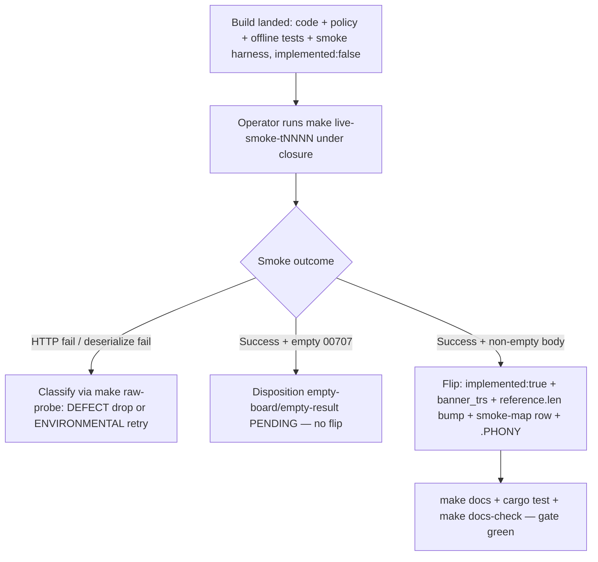

# feat: Closed-window TR flip wave — t1310/t1404 build + operator-gated flip

## Summary

Author callable Rust + offline tests + smoke harness + policy registrations for the two genuine closed-window candidates, `t1310` (historical tick/min chart) and `t1404` (administrative-designation board), then flip each to Implemented only when the operator's Paper Live Smoke returns a non-empty body. The five re-pointed TRs (`t1852`, `t1856`, `t3102`, `t1964`, `t1860`) get documentation-only disposition recording — no code, no smokes.

## Problem Frame

KRX is closed, so the certifying Paper Live Smoke can't get live data for session-dependent reads. Of the 21 Tracked TRs, only `t1310` and `t1404` are plausibly reachable under closure (a historical chart pull and a persistent designation board), and even that is unproven (see origin: load-bearing premise). The build work — structs, policy, offline tests, smoke harness — is fully doable now and independent of the market clock. Only the final metadata flip + docgen count bump depends on a non-empty smoke, which the operator runs. Splitting build from flip lets the code land green today and the flip complete the moment a clean smoke lands.

---

## Requirements

**Build (closure-independent)**

- R1. Author `t1310` as a single-page paginated read: request struct, response struct modeling the row array, `T1310_POLICY`, facade method, offline tests, and a `live_smoke_t1310` harness. (origin R1, R5)
- R2. Author `t1404` as a single-page paginated read with the same shape, modeling its designation-board rows. (origin R1, R5)
- R3. Both request structs serialize all fields as strings — no `string_as_number` / IGW40011 fix is required; confirm against the normalized baselines. (origin R5)
- R4. Response structs and offline tests model the out-block key names and array-ness from the **raw** capture (`res_example`), not the normalized baseline. Each offline test asserts at least one modeled non-key field holds a non-default value. (origin R3)
- R5. Each `live_smoke_<tr>` asserts the out-block is non-empty **before** recording; an empty `00707` must not record a success. (origin R3, R4)

**Operator-gated flip (closure-dependent)**

- R6. `t1310`/`t1404` flip to `support.implemented: true` (recommended stays false) only on a non-empty certifiable smoke. A smoke that returns empty `00707` dispositions to empty-board/empty-result PENDING and does not flip. (origin R3, R4, R7)
- R7. Each flip bumps the docgen `banner_trs` list and the `reference.len()` literal by one (114 → 115 → 116), adds a `smoke-map.md` row (`Promotion: implemented-only`), and a Makefile `.PHONY` entry for the smoke target. `maintained_tr_count` does NOT move on a tracked→implemented flip. (origin R8)
- R8. Before flipping, grep `crates/ls-trackers` and `crates/ls-docgen` for `t1310`/`t1404` used as a tracked-only *illustration* (e.g., the reference-exclusion assertion or a support-aware exemplar fixture); if found, repoint it to a durably tracked-only TR. Membership in `const TRACKED_TRS` (`crates/ls-docgen/src/lib.rs`, count 134) is NOT an exemplar trap — every tracked TR lives there regardless of implemented state, and it must stay unchanged on the flip. (convention: `docs/solutions/conventions/implement-tr-registration-sites.md`)
- R9. The full gate stays green after each landed change: `make docs`, `cargo test`, `cargo test -p ls-core`, `make docs-check`. (origin R9)

**Disposition of re-pointed TRs**

- R10. Record — documentation only — that `t1852`/`t1856` (`sFileData`-input), `t3102` (`sNewsno`-input, already built), `t1964` (empty-board, already built), and `t1860` (realtime-control HELD) are re-pointed to their real unblock paths this wave. Leave their metadata and PROVISIONALITY-LEDGER rows intact; author no smokes. (origin R1, R6)

---

## Key Technical Decisions

- **Build and flip are separate units.** U1/U2 land code + policy + registrations + offline tests + smoke harness while each TR stays `implemented: false` — the gate is green because docgen only generates a reference page for implemented TRs, and the policy crosscheck lists are test-only with no counts. The metadata flip + count bump (U3) is its own operator-gated unit. This is the only structure that completes under closure: the build can't wait for an open window, and the flip can't happen without a smoke.

- **Out-block shape comes from the raw capture, not the normalized baseline.** The normalized baseline flattens and collapses block structure; the authoritative wire key names and array-ness live in `crates/ls-trackers/baselines/api-drift/raw/ls-openapi-full.json` `res_example`. Both TRs have the same sibling shape as `t1514`: a summary block plus a top-level sibling row array. `t1310` = `t1310OutBlock` (`cts_time` cursor) + sibling `t1310OutBlock1` rows; `t1404` = `t1404OutBlock` (`cts_shcode` cursor) + sibling `t1404OutBlock1` rows. Model row arrays with `de_vec_or_single` to tolerate single-or-array.

- **Both TRs mirror `t1514`.** Each is a single-page self-paginated read like `t1514` (`crates/ls-sdk/src/paginated/sector_index.rs`) — `impl_has_pagination!` on the request only, one `post_paginated` call, no `*_all` collection, a summary-block body cursor (`cts_time` / `cts_shcode`) plus a sibling row array. `t1310` goes in a new `historical_chart.rs`; `t1404` goes in a new `designation_board.rs` — separate modules for readability, not because their shapes diverge (they don't). Reusing a single module is an acceptable alternative if file count matters more than domain separation.

- **Disposition recording is light.** The brainstorm fixed that the five re-pointed TRs keep their existing dispositions and get no new smokes. U4 records the re-point in the wave's artifacts and verifies their metadata/ledger rows are intact — it does not author ledger mutations or facet changes.

- **An off-hours empty smoke is handled by the non-empty gate, not a false flip.** The `docs/solutions` empty-result rule warns that empty + off-hours is not valid evidence. R5's pre-record non-empty assertion plus R6's disposition path mean an empty closed-window smoke dispositions to PENDING cleanly — it never records or flips.

---

## High-Level Technical Design

Per-TR certify-or-disposition gate the operator drives after U1/U2 land:

The two TRs run this gate independently — `t1310` may flip while `t1404` dispositions, or both flip, or neither.

---

## Implementation Units

### U1. Build t1310 (historical tick/min chart), implemented:false

- **Goal:** Author the callable `t1310` read and its smoke harness, leaving metadata `implemented: false`.
- **Requirements:** R1, R3, R4, R5
- **Dependencies:** none
- **Files:**
  - `crates/ls-sdk/src/paginated/historical_chart.rs` (new) — `T1310Request`, `T1310Response`, row struct
  - `crates/ls-sdk/src/paginated/mod.rs` — facade method (e.g., `daily_tick_chart`) + module export
  - `crates/ls-core/src/endpoint_policy.rs` — `T1310_POLICY` const + add to `slice_rest_policies_are_non_order_rest`
  - `crates/ls-core/tests/policy_index_crosscheck.rs` — add `T1310_POLICY` to the `policies` array
  - `crates/ls-sdk/tests/live_smoke.rs` — `live_smoke_t1310`
  - `Makefile` — `live-smoke-t1310` target
- **Approach:** Mirror `t1514` in `paginated/sector_index.rs` — single-page `post_paginated`, `impl_has_pagination!` on the request only. Read out-block keys/array-ness from the raw `res_example` for `t1310` (`t1310OutBlock` summary + `t1310OutBlock1` rows). Request fields (`daygb`, `timegb`, `shcode`, `endtime`, `cts_time`, `exchgubun`) are all strings — no numeric serialize.
- **Patterns to follow:** `crates/ls-sdk/src/paginated/sector_index.rs` (struct + facade + `post_paginated`); `T1452_POLICY`/`T1514_POLICY` in `endpoint_policy.rs` for the policy shape.
- **Test scenarios:**
  - Covers R4. Offline: a representative `t1310OutBlock1` row from the raw `res_example` deserializes and a modeled field (e.g., `price` or `volume`) holds a real non-default value.
  - `string_or_number` tolerance: a row where `price`/`volume` arrive as JSON string AND as JSON number both deserialize.
  - Request serialization: all six in-block fields emit as JSON strings (assert `is_string()`), no numeric slot.
  - Empty-page: a `00707` body with an empty `t1310OutBlock1` deserializes to an empty Vec without error.
  - Covers R5. Smoke harness: `live_smoke_t1310` asserts the row Vec is non-empty before `record()`; off-hours empty does not record.
- **Verification:** `cargo test -p ls-sdk` and `cargo test -p ls-core` pass; the new policy is registered in both crosscheck lists; `t1310` remains `implemented: false` and docgen counts are unchanged.

### U2. Build t1404 (administrative-designation board), implemented:false

- **Goal:** Author the callable `t1404` read and its smoke harness, leaving metadata `implemented: false`.
- **Requirements:** R2, R3, R4, R5
- **Dependencies:** none (parallel to U1)
- **Files:**
  - `crates/ls-sdk/src/paginated/designation_board.rs` (new) — `T1404Request`, `T1404Response`, row struct
  - `crates/ls-sdk/src/paginated/mod.rs` — facade method (e.g., `designation_board`) + module export
  - `crates/ls-core/src/endpoint_policy.rs` — `T1404_POLICY` const + add to `slice_rest_policies_are_non_order_rest`
  - `crates/ls-core/tests/policy_index_crosscheck.rs` — add `T1404_POLICY` to the `policies` array
  - `crates/ls-sdk/tests/live_smoke.rs` — `live_smoke_t1404`
  - `Makefile` — `live-smoke-t1404` target
- **Approach:** Single-page `post_paginated` mirroring `t1514` — `impl_has_pagination!` on the request only, a `cts_shcode` body cursor. Read out-block keys/array-ness from the raw `res_example`: `t1404OutBlock` is a `cts_shcode`-only summary and `t1404OutBlock1` is a top-level sibling row array (NOT nested), modeled with `de_vec_or_single`. Request fields (`gubun`, `jongchk`, `cts_shcode`) are all strings. Name the read by its designation-board meaning, not a `_v2` sibling suffix.
- **Patterns to follow:** `crates/ls-sdk/src/paginated/sector_index.rs` for the single-page skeleton; `paginated/rank_screen.rs` for a board-style row read.
- **Test scenarios:**
  - Covers R4. Offline: a representative `t1404OutBlock1` row from the raw `res_example` deserializes and a modeled field (e.g., `hname`, `reason`, or `date`) holds a real non-default value.
  - `string_or_number` tolerance on the numeric row fields (`price`/`change`/`volume`).
  - Request serialization: `gubun`/`jongchk`/`cts_shcode` emit as JSON strings.
  - Empty-board: a `00707` body with an empty row array deserializes to an empty Vec.
  - Covers R5. Smoke harness: `live_smoke_t1404` asserts non-empty rows before `record()`.
- **Verification:** `cargo test -p ls-sdk` and `cargo test -p ls-core` pass; `T1404_POLICY` registered in both crosscheck lists; `t1404` remains `implemented: false`; docgen counts unchanged.

### U3. Operator-gated flip on a non-empty smoke

- **Goal:** Flip each TR that returns a non-empty certifiable smoke to `implemented: true`; disposition the rest as PENDING.
- **Requirements:** R6, R7, R8, R9
- **Dependencies:** U1, U2
- **Files (per TR that certifies):**
  - `metadata/trs/t1310.yaml` / `metadata/trs/t1404.yaml` — `support.implemented: true`
  - `crates/ls-docgen/src/lib.rs` — add the TR to `banner_trs`; bump the `reference.len()` literal by one
  - `.agents/skills/promote-tr/references/smoke-map.md` — add a row (`Promotion: implemented-only`)
  - `Makefile` — add the smoke target to `.PHONY`
  - generated `docs/reference/` — regenerated by `make docs`
- **Approach:** The operator runs `make live-smoke-t1310` and `make live-smoke-t1404` under closure. Interpret per the certify-or-disposition gate (HTD): non-empty → flip; empty `00707` → PENDING (no flip); HTTP/deserialize failure → classify with `make raw-probe`. Before flipping, run R8's exemplar-trap grep — if `t1310`/`t1404` is a hard-coded tracked-only *illustration* (the docgen reference-exclusion assertion, or a support-aware exemplar fixture in `crates/ls-trackers/tests/classify.rs`), repoint it to a durably tracked-only TR (e.g., `t1964`). Leave `const TRACKED_TRS` untouched — membership there is not an exemplar trap. Land the metadata flip, docgen bumps, smoke-map row, and `.PHONY` entry for each certifying TR in one commit.
- **Execution note:** This unit is operator-driven and conditional per TR — yield may be 0, 1, or 2. The `reference.len()` target is `114 + (TRs that actually flip)`.
- **Test scenarios:** `Test expectation: none` for new behavior — this unit changes metadata + generated docs + count literals, not runtime code. Verification is the gate.
- **Verification:** `make docs` regenerates cleanly; `make docs-check` confirms generated docs match committed; `cargo test` + `cargo test -p ls-core` green; `reference.len()` matches the realized flip count; each flipped TR carries `implemented: true, recommended: false`.

### U4. Record re-pointed-TR dispositions (documentation only)

- **Goal:** Record that the five re-pointed TRs are out of scope this wave, with their real blockers, leaving their metadata intact.
- **Requirements:** R10
- **Dependencies:** none
- **Files:**
  - `docs/solutions/conventions/` — a short note (or extend an existing disposition convention) recording the re-point: `t1852`/`t1856` → `sFileData`-input (no SDK producer); `t3102` → `sNewsno`-input (realtime-NWS-only, already built); `t1964` → empty-board (already built); `t1860` → realtime-control HELD
  - (verify only) `metadata/trs/{t1852,t1856,t3102,t1964,t1860}.yaml` and `metadata/PROVISIONALITY-LEDGER.md` — confirm rows are intact, no edits
- **Approach:** Documentation-only. Do not author smokes, flip metadata, or mutate ledger rows. The note exists so a future wave doesn't re-litigate these five as fresh closed-window candidates.
- **Test scenarios:** `Test expectation: none -- documentation-only, no behavioral change.`
- **Verification:** The five TRs remain `implemented: false` with unchanged dispositions; the disposition note names each TR's real blocker and unblock path.

---

## Scope Boundaries

- The 14 window-gated / `paper_incompatible` TRs (`g31xx`, `t84xx` night, `CCENQ10100/90200`, `t1308`, `t2106`, `t8411`) — untouched; wait for an open window or never flip. (origin)
- A durable "closed-window flippable" classifier (facet/disposition) — out of scope; reachability stays a per-wave judgment. (origin)
- Recommended promotion for any flipped TR — separate pass, ADR 0008. (origin)

### Deferred to Follow-Up Work

- Unblocking the five re-pointed TRs (`sFileData`-sourcing wave for `t1852`/`t1856`; an `sNewsno` producer for `t3102`; `t1964` filter-default fix; the realtime-control effort for `t1860`).
- The open flip-cost / cadence decision — a 0–2-flip wave at full six-site cost makes it more pressing, but it is not resolved here. (origin)

---

## Risks & Dependencies

- **Closure-reachability is unproven (load-bearing).** If the paper gateway gates historical/board reads on an open session, even `t1310` returns empty `00707` and the wave yields 0. This is expected and handled (disposition PENDING, no false flip) — but it means the build (U1/U2) may land with zero flips this wave, and that is a correct outcome, not a failure.
- **`t1404` is a board, not a chart.** Its closure-reachability rests on the designation board being served and non-empty outside trading hours — a distinct premise from `t1310`'s chart exception. It may legitimately be empty.
- **Operator-gated smoke.** U3 cannot run autonomously — it needs `.env` paper credentials and `LS_TRADING_ENV=paper`, run by the operator. The plan delivers a ready-to-flip build; the flip waits on the operator.
- **Two un-asserted registration sites.** `smoke-map.md` rows and Makefile `.PHONY` entries are not covered by any test — easy to omit silently. R7 lists them explicitly.

---

## Sources & Research

- Origin requirements: `docs/brainstorms/2026-06-26-krx-closed-flip-wave-requirements.md`.
- Wire shapes: `crates/ls-trackers/baselines/api-drift/normalized/trs/t1310.json`, `t1404.json` (confirm all-string request fields); read out-block keys/array-ness from `crates/ls-trackers/baselines/api-drift/raw/ls-openapi-full.json` `res_example`.
- Single-page exemplar: `crates/ls-sdk/src/paginated/sector_index.rs` (`t1514`); facade dispatch in `crates/ls-sdk/src/paginated/mod.rs`.
- Policy shape + registration: `crates/ls-core/src/endpoint_policy.rs` (`T1452_POLICY`/`T1514_POLICY`, `slice_rest_policies_are_non_order_rest`); `crates/ls-core/tests/policy_index_crosscheck.rs`.
- Count assertion: `crates/ls-docgen/src/lib.rs:1033` (`reference.len()` == 114) and `banner_trs` list (lines ~929-948); the reference-exclusion assertion (~lib.rs:1037) is the genuine exemplar-trap site, distinct from `const TRACKED_TRS` membership.
- Smoke harness: `crates/ls-sdk/tests/live_smoke.rs` (`live_smoke_t1514`); `Makefile` `run_smoke` macro + `.PHONY`.
- Conventions: `docs/solutions/conventions/implement-tr-registration-sites.md` (registration sites, exemplar trap, count contrast); `docs/solutions/conventions/market-hours-read-empty-result-disposition.md` (non-empty-assert-before-record, off-hours rule); `docs/solutions/conventions/tr-out-block-shape-from-raw-capture.md` (read shape from raw); `docs/solutions/integration-issues/ls-gateway-igw40011-numeric-request-fields.md` (numeric-field defect; not expected here).
- Recipe: `.agents/skills/implement-tr/SKILL.md` (preconditions + state machine + flip steps).
