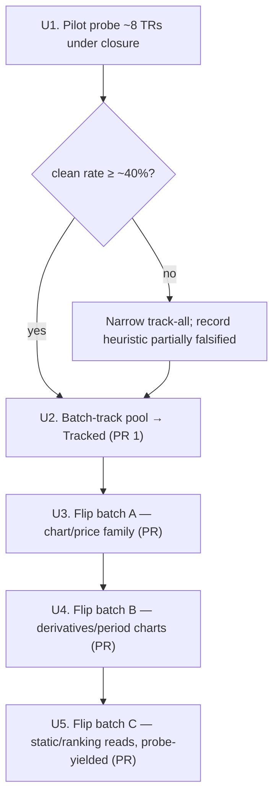
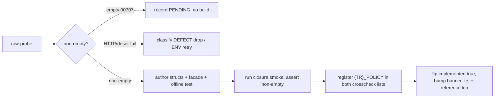

# feat: Closed-Window Breadth Flip Wave

## Summary

Pilot-probe the closure-yield premise, then batch-track the closure-viable raw-TR
pool to Tracked in one mechanical PR, then flip every TR that probes non-empty
under closure to Implemented across stacked per-build-template PRs. The market is
closed; the wave's value is that the targeted reads (historical/chart, master,
designation, ranking) return data regardless of session. Yield sets the flip
count — there is no target.

---

## Problem Frame

The raw OpenAPI capture carries ~93 unimplemented reads; ~60 are historical,
chart, master, or static-reference shapes that *plausibly* return data while KRX
is closed. They sit raw — not callable, not even Tracked. PR #60 (`f2887da`)
showed two hand-curated session-independent reads (t1310, t1404) flip clean under
closure, which is a suggestive precedent — not proof that ~60 title-heuristic
reads will. This plan turns that latent surface into callable SDK reads while
validating the premise before paying the full tracking cost (see origin).

---

## Requirements

**Pilot & gating**

- R1. Before tracking at scale, raw-probe ~8 representative closure-viable TRs
  (chart, master, designation, ranking) under closure and record the clean
  (non-empty) rate (origin R0).
- R2. If the pilot clean rate is below ~40%, narrow the track-all set and record
  the closure-viability heuristic as partially falsified rather than tracking the
  full ~60 (origin R0, success-floor decision).

**Tracking (PR 1)**

- R3. Batch-track every confirmed closure-viable raw TR to `support: tracked` via
  the `track-tr` recipe; project each normalized baseline with
  `make api-drift-renormalize`, never hand-authored (origin R1).
- R4. A sweep candidate that a per-TR re-read shows is intraday/quote/realtime is
  dropped from the flip set and recorded window-gated; the ~21 already-known
  window-gated reads are a distinct set, not part of this pool (origin R2).
- R5. PR 1 makes no flips: it bumps the tracking surface only and stays green
  through the full gate. Its success criterion is the Raw→Tracked surface bump
  itself (origin R3).

**Flipping (stacked PRs)**

- R6. Flip batch A is the proven-template chart/price family: t8411 (already
  Tracked), t1302, t8417, t8418, t8452, t8453 (origin R4).
- R7. Flip batch B is the derivatives and period-price chart family: t8405,
  t2216, t8464, t8465, t8466 (origin R5).
- R8. Flip batch C is every static reference/designation read that probes
  non-empty under closure — no curated cap; membership set by probe yield
  (origin R6).
- R9. Each flip authors callable Rust (request/response structs + facade) gated
  on a closure Paper Live Smoke; numeric request fields serialize as JSON numbers
  where the baseline shows numbers (origin R7).
- R10. Each new REST `{TR}_POLICY` registers in **both** crosscheck lists (origin
  R8).

**Yield & disposition**

- R11. Raw-probe each TR before building its struct: non-empty → build + flip;
  empty `00707` → record PENDING with a credential-free reason, no build; HTTP/
  deserialize failure → classify DEFECT (drop) vs ENVIRONMENTAL (retry) via
  `make raw-probe` (origin R9).
- R12. Each `live_smoke_<tr>` asserts its out-block is non-empty before recording
  success; an empty `00707` never records a flip (origin R10).

---

## Key Technical Decisions

- **Validate before scaling (R0 pilot first).** The ~60-TR tracking cost is
  non-trivial to reverse and the closed-window clean rate for this pool is
  unproven. The pilot (U1) gates U2; a low rate narrows the track-all set rather
  than tracking on faith.
- **Track-all in one PR, flip in stacked per-template PRs.** Tracking is
  mechanical and projectable; flipping needs per-TR build + smoke. The seam keeps
  PR 1 a single reviewable count-churn and each flip group an independently
  reviewable PR, instead of one ~60-TR mega-diff with every count site churning
  at once.
- **Probe gate per TR before any build.** Title heuristics overstate
  closure-viability; only a non-empty probe earns a struct. Empty `00707` is a
  zero-cost PENDING, not a build failure.
- **Module routing by `facets.self_paginated`.** `self_paginated: true` → the
  `paginated` module (single-page body-idx reads; exemplar t1514 in
  `crates/ls-sdk/src/paginated/sector_index.rs`); `self_paginated: false` →
  `market_session` (non-paginated; exemplar t1102). Charts are predominantly
  paginated.
- **Wire-type discipline.** Request numeric fields use
  `#[serde(serialize_with = "ls_core::string_as_number")]` (a string returns
  `IGW40011`); response numeric fields use `ls_core::string_or_number`; array
  out-blocks use `ls_core::de_vec_or_single` to tolerate single-or-array shape.
  The exact per-field types come from the normalized baseline, not guesswork.
- **Yield floor (~40%) as a stop-gate.** A wave that flips near zero means the
  heuristic was wrong, not that the wave succeeded; below the floor, stop
  tracking the remainder and record the heuristic as falsified.

---

## High-Level Technical Design

Per-TR flip pipeline (identical inside U3–U5):

---

## Implementation Units

### U1. Pilot probe and gate decision

- **Goal:** Establish the closed-window clean rate for this pool before paying
  the track-all cost.
- **Requirements:** R1, R2.
- **Dependencies:** none.
- **Files:** none authored — uses `make raw-probe LS_PROBE_TR_CD=.. LS_PROBE_PATH=.. LS_PROBE_BODY=..`
  (credential-safe classifier). Record results in the PR description / scratch,
  not in tracked files.
- **Approach:** Pick ~8 TRs spanning the categories — chart (t8417 or t8452),
  master/reference (t1444), designation (t1405), ranking (t1960), period
  (t1903), plus 2-3 others. Probe each under closure; tally non-empty vs `00707`.
  If the rate is below ~40%, narrow U2's track-all set to the categories that
  cleared and note the heuristic as partially falsified in the U2 PR.
- **Patterns to follow:** `docs/solutions/integration-issues/ls-gateway-igw40011-numeric-request-fields.md`
  for raw-probe body shaping; AGENTS.md raw-probe guidance.
- **Test scenarios:** Test expectation: none — diagnostic probe, no code authored.
- **Verification:** A recorded per-category clean rate and a go / narrow decision
  for U2.

### U2. Batch-track the closure-viable pool to Tracked (PR 1)

- **Goal:** Bring the confirmed closure-viable raw TRs to Tracked with projected
  baselines, no flips.
- **Requirements:** R3, R4, R5.
- **Dependencies:** U1.
- **Files:**
  - `metadata/trs/<tr>.yaml` (one per tracked TR; mirror `metadata/trs/t8411.yaml`
    for tracked-only flag values — `tracked: true` / `implemented: false`; use
    `t1452.yaml` only as a block-shape reference, since t1452 is `implemented: true`)
  - `metadata/tr-index.yaml` (routing entry per TR; file path, owner_class,
    protocol, instrument_domain, venue_session must match the yaml)
  - `crates/ls-trackers/baselines/api-drift/normalized/trs/<tr>.json` (projected
    by `make api-drift-renormalize`, never hand-authored)
  - `crates/ls-trackers/tests/api_drift.rs` (bump `maintained_tr_count`
    assertion at line 106 from 134 to 134 + N tracked)
  - `crates/ls-trackers/src/cli.rs` (four maintained-shape-count literals at
    lines 1811, 1876, 2779, 2787 — all `134`, all move to 134 + N)
  - `crates/ls-docgen/src/lib.rs` (append each tracked TR code to the
    `TRACKED_TRS` array at ~line 677 and bump its `[&str; 134]` size literal to
    134 + N; the `:849` assertion derives from it)
- **Approach:** Run the `track-tr` recipe per TR. Confirm closure-viability with a
  per-TR re-read (R4); drop intraday/quote/realtime candidates to the window-gated
  set. Keep the manifest `refreshed` date at the last raw-refresh date (do not
  bump it). Tracked-only TRs generate no reference page, so docgen `reference.len`
  and `banner_trs` are unchanged — but `TRACKED_TRS` (a by-name list of all
  maintained TRs) and the four `cli.rs` maintained-count literals **do** bump,
  alongside `api_drift.rs:106`.
- **Patterns to follow:** `.agents/skills/track-tr/SKILL.md`; exemplar metadata
  `metadata/trs/t1452.yaml`.
- **Test scenarios:** Test expectation: none — no behavioral change. The gate is
  `cargo test -p ls-core` (metadata validation + policy index cross-check) and
  the `api_drift.rs` count assertion.
- **Verification:** `make docs && cargo test && make docs-check` green; clean
  baseline self-diff (no pre-existing baseline files modified);
  `maintained_tr_count` matches the new total.

### U3. Flip batch A — proven-template chart/price family

- **Goal:** Flip the chart/price siblings whose templates are already Implemented.
- **Requirements:** R6, R9, R10, R11, R12.
- **Dependencies:** U2 (t1302/t8417/t8418/t8452/t8453 must be Tracked first;
  t8411 is already Tracked).
- **Files (per TR that probes non-empty):**
  - `crates/ls-sdk/src/paginated/<module>.rs` — request/response structs + facade
    method (charts route to `paginated`; mirror
    `crates/ls-sdk/src/paginated/sector_index.rs` for t1514)
  - `crates/ls-core/src/endpoint_policy.rs` — `{TR}_POLICY` const + entry in the
    `slice_rest_policies_are_non_order_rest` list (~line 2136)
  - `crates/ls-core/tests/policy_index_crosscheck.rs` — entry in the `policies`
    array (~line 70)
  - `crates/ls-sdk/tests/live_smoke.rs` — offline deserialize test + `live_smoke_<tr>`
  - `Makefile` — `live-smoke-<tr>` target + `.PHONY` entry
  - `.agents/skills/promote-tr/references/smoke-map.md` — row, Promotion =
    `implemented-only`
  - `crates/ls-docgen/src/lib.rs` — add TR to `banner_trs` (~line 929); bump
    `reference.len()` (line 1037) by one per flipped TR
  - `metadata/trs/<tr>.yaml` — `support.implemented: true`, `recommended: false`
- **Approach:** For each TR, raw-probe first (R11). On non-empty, author structs
  from the normalized baseline (numeric request fields via `string_as_number`;
  response via `string_or_number`; array out-blocks via `de_vec_or_single`),
  dispatch via `Inner::post_paginated` for paginated charts. Fire the typed smoke
  before adding the crosscheck registrations (the crosscheck lists are test-only,
  so the smoke does not depend on them). Empty `00707` → PENDING per R11, no flip.
- **Execution note:** Start each TR with the offline deserialize test against a
  captured success body, then wire the facade, then the smoke.
- **Patterns to follow:** `.agents/skills/implement-tr/SKILL.md`;
  `crates/ls-sdk/src/paginated/sector_index.rs` (t1514).
- **Test scenarios:**
  - Covers AE1. Offline: a captured non-empty success body deserializes and ≥1
    non-key field holds a real value.
  - Covers AE4. Offline: a numeric field parses from both string-JSON and
    number-JSON forms.
  - Covers AE2. Offline: an `rsp_cd 00707` empty body is recognized as empty.
  - Closure smoke: `live_smoke_<tr>` returns a non-empty out-block and records a
    credential-free `LIVE-SMOKE` line; empty `00707` is asserted before any
    success record.
- **Verification:** Per flipped TR, `make docs && cargo test && cargo test -p ls-core && make docs-check`
  green; `reference.len` and `banner_trs` bumped by the flip count; both
  crosscheck lists carry the new policy.

### U4. Flip batch B — derivatives and period-price charts

- **Goal:** Flip the derivatives/period chart family (no implemented sibling).
- **Requirements:** R7, R9, R10, R11, R12.
- **Dependencies:** U2, U3 (stacked).
- **Files:** same shape as U3, per TR (t8405, t2216, t8464, t8465, t8466).
  Module routing by `facets.self_paginated` from each baseline; period-price
  reads may route to `market_session` (mirror t1102) rather than `paginated`.
- **Approach:** Same per-TR pipeline as U3. These lack a one-to-one implemented
  sibling, so confirm the out-block key and array-vs-single shape from the
  normalized baseline before authoring (do not copy field names from a different
  family).
- **Patterns to follow:** U3; `.agents/skills/implement-tr/SKILL.md`.
- **Test scenarios:** Same four-scenario set as U3 (Covers AE1, AE4, AE2, plus the
  closure smoke), per TR that probes non-empty.
- **Verification:** Same as U3.

### U5. Flip batch C — static reference / designation reads (probe-yielded)

- **Goal:** Flip every static reference/designation read that probes non-empty.
- **Requirements:** R8, R9, R10, R11, R12.
- **Dependencies:** U2, U4 (stacked).
- **Files:** same shape as U3, per TR. Candidates: t1444, t1422, t1427, t1442,
  t1405, t1926, t1921, t1532, t1533, t1764, t1903, t1954, t1960, t1961, t1966 —
  membership set by probe yield, not pre-committed. Most route to `market_session`
  (non-paginated; mirror t1102); confirm per baseline.
- **Approach:** Same per-TR pipeline. Probe the ranking sub-group first
  (시가총액상위, 신고/신저가, ELW rankings) — these are the weakest closure
  bets and most likely to disposition PENDING; do not force a flip on an empty
  ranking board.
- **Patterns to follow:** U3; non-paginated exemplar t1102 in
  `crates/ls-sdk/src/market_session/`.
- **Test scenarios:** Same four-scenario set as U3, per TR that probes non-empty.
- **Verification:** Same as U3; the running batch-C clean rate is checked against
  the ~40% floor (R2) — if it collapses, stop and record the remainder PENDING.

---

## Scope Boundaries

**In scope:** R0 pilot, track-all of the closure-viable pool, stacked flips of
every non-empty-probing TR across batches A/B/C.

**Deferred for later** (open KRX window or a producer unblocks them):
- The ~21 window-gated reads (intraday 체결/시간대별, 호가, 현재가 quotes,
  체결강도); t2106 and t1964 (Tracked, need an open window); t1852/t1856 (sFileData
  input) and t3102 (sNewsno from realtime NWS) — input-blocked.

**Outside scope:**
- The 12 paper_incompatible reads (overseas g3101–g3190; night krx_extended
  t8455–t8463, CCENQ10100/CCENQ90200; account 잔고/평가) — never flip on paper.
- t1860 (realtime-control subscription, HELD).
- Recommended promotion — a separate `promote-tr` pass under ADR 0008; this wave
  stops at Implemented (`recommended: false`).

### Deferred to Follow-Up Work
- Re-scoping the track-all count downward if the U1 pilot falls below the floor
  is handled in-wave (U2), but a *second* breadth wave over any narrowed-out
  categories is follow-up, not this plan.

---

## Risks & Dependencies

- **Heuristic over-inclusion → many PENDING.** Title classification overstates
  closure-viability. Mitigated by U1 pilot, the per-TR probe gate (R11), and the
  ~40% floor (R2). Net effect of a miss is lower yield, not broken work.
- **Large track-all count churn.** U2 bumps **four** maintained-count families,
  all from 134 → 134+N: `api_drift.rs:106`, the `TRACKED_TRS` array + size literal
  (`crates/ls-docgen/src/lib.rs:677`), and four `cli.rs` literals (lines 1811,
  1876, 2779, 2787). Each flip separately bumps `reference.len`
  (`crates/ls-docgen/src/lib.rs:1037`, from 116) + `banner_trs` (line 929) + both
  crosscheck lists. Separating track (U2) from flips (U3–U5) contains the blast
  radius; a missed count site fails the gate loudly — sweep for stray `134` /
  `116` literals before declaring U2 green.
- **Exemplar-trap.** Before flipping any batch-A/B/C TR, grep `crates/ls-trackers`
  and `crates/ls-docgen` for that TR used as a tracked-only illustration (e.g. a
  reference-exclusion assertion or support-aware fixture) and repoint it to a
  durably tracked-only TR first.
- **Borrowed yield rate.** Do not resource the wave on the prior ~61% open-window
  rate — closed-window yield for this pool is unknown until U1.
- **Dependency:** real LS paper gateway with `LS_TRADING_ENV=paper` credentials in
  a gitignored `.env`; reused `track-tr` / `implement-tr` recipes and the PR #60
  closure-smoke pattern. No new infrastructure.

---

## Acceptance Examples

- AE1. **Non-empty closure smoke flips.** Given a tracked chart TR (e.g. t8417),
  when its closure smoke returns a populated out-block, then it flips
  `implemented: true` and `reference.len` bumps by one.
- AE2. **Empty `00707` dispositions PENDING.** Given a static read whose board is
  empty under closure, when its smoke returns success + empty `00707`, then it is
  recorded PENDING with a credential-free reason and does not flip; `reference.len`
  is unchanged.
- AE3. **Heuristic misclassification caught at probe.** Given a sweep candidate
  that a probe shows needs an open session, when it returns empty under closure,
  then it is reclassified window-gated and left Tracked, not forced to a flip.
- AE4. **Numeric request field.** Given a request struct whose baseline shows a
  numeric field, when it serializes that field as a string, then the gateway
  returns `IGW40011`; `string_as_number` is required before the smoke passes.

---

## Open Questions

**Deferred to implementation**
- Per-TR numeric request fields needing `string_as_number` (read from each
  normalized baseline at build time).
- Exact module routing per TR (`paginated` vs `market_session`) from
  `facets.self_paginated`.
- Final batch-C membership (set by U1/U5 probe yield).

**Scope decisions deferred from review** (recorded, not blocking — the user chose
maximal scope; the R0 pilot and yield floor are the agreed mitigations):
- Maximal breadth is not tied to a named consumer or demand ordering — consider
  ordering flips by demand and stopping at the subset with an identified caller.
- Track-all banks ~34 TRs (~60 tracked − ~26 flip-batch members) that no flip goal
  of this wave serves — decide whether that banking stays in scope.
- Scaling to ~60 spends the prior wave's still-open flip-cost/cadence decision at
  larger scale; consider resolving it (or treating batch A as the resolving data
  point) before batches B and C.

---

## Sources & Research

- `.agents/skills/track-tr/SKILL.md`, `.agents/skills/implement-tr/SKILL.md` —
  the reused recipes; per-module skeletons and count-bump steps.
- `crates/ls-sdk/src/paginated/sector_index.rs` (t1514) — paginated chart-family
  template: `string_as_number` request `cnt`, `string_or_number` response fields,
  `de_vec_or_single` arrays, `Inner::post_paginated`.
- `crates/ls-core/tests/policy_index_crosscheck.rs:70` +
  `crates/ls-core/src/endpoint_policy.rs:2136` — the two REST-policy crosscheck
  lists.
- `crates/ls-docgen/src/lib.rs:929` (`banner_trs`), `:1037` (`reference.len()` ==
  116); `crates/ls-trackers/tests/api_drift.rs:106` (`maintained_tr_count` == 134).
- `crates/ls-trackers/baselines/api-drift/raw/ls-openapi-full.json` — raw capture;
  source of the ~93 unimplemented reads.
- `docs/solutions/integration-issues/ls-gateway-igw40011-numeric-request-fields.md`
  — raw-probe body shaping + IGW40011 classification.
- PR #60 (`f2887da`) — the closure-flip precedent (t1310/t1404) this wave scales.
