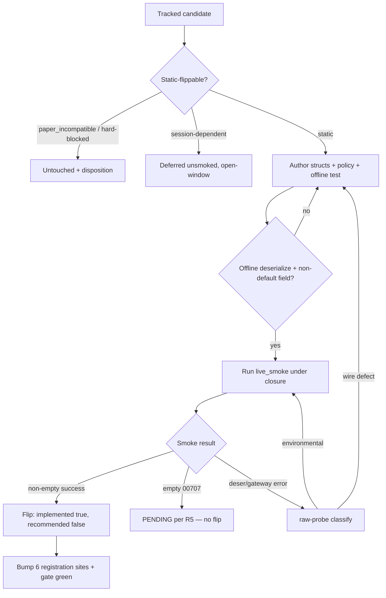

# feat: closed-window more-flips wave — flip tracked static reads under KRX closure

## Summary

Flip more TRs from Tracked → Implemented while KRX is closed, drawing candidates
from the existing tracked-only pool. Triage the 73 tracked-only TRs, flip the
static/persistent reads that certify non-empty under closure via the frozen
`implement-tr` recipe, opportunistically top up with new raw static reads, and
record a faithful disposition for everything that does not flip. No target count
— honest yield governs.

## Problem Frame

The support lifecycle climbs Raw → Tracked → Implemented → Recommended. 73 TRs
sit at Tracked, callable-in-spec but not yet flipped. Plan -003 and -004 proved
that static/persistent reads (master/reference, designation boards, rankings,
historical charts) certify non-empty under market closure, so a flip wave can run
today (Saturday, KRX closed) without waiting for an open window — but only for the
static subset. Session-dependent reads return empty `00707` under closure and
must wait.

Plan -004 already harvested the obvious closure-viable statics from the 79 it
tracked, so the residual tracked pool is partly -004 leftovers. Research narrowed
today's static-flippable bucket to ~22 candidates that are already tracked, which
the audit feeds directly into flips with no tracking work. The wave's honest yield
is whatever certifies non-empty; a near-dry result is an accepted outcome and also
a signal the static heuristic over-included (see origin).

---

## Requirements

Carried from `docs/brainstorms/2026-06-27-closed-window-more-flips-requirements.md`.

**Candidate selection**

- R1. Triage the 73 tracked-only TRs into static-flippable (smoke now),
  session-dependent (deferred to an open-window wave), paper_incompatible
  (excluded pre-candidacy), and hard-blocked (untouched).
- R2. Exclude the 11 `paper_incompatible: true` TRs and the hard-blocked TRs
  (t1860 realtime-control, t1852/t1856 sFileData, t3102 sNewsno, t1964
  empty-board) from candidacy.
- R3. Source candidates pool-first; add raw top-up only after the pool audit, and
  only for plausibly closure-viable static families.

**Flip gate**

- R4. A candidate flips only when its paper smoke, run under closure, returns a
  body that deserializes AND at least one modeled non-key field holds a
  non-default value. This certifies callability and shape, not freshness.
- R5. A candidate whose smoke returns empty (`00707`) does not flip. A
  static-classified read that unexpectedly smokes empty is recorded as
  open-window PENDING only on an independent session-dependent signal; otherwise
  classification-unconfirmed pending open-window re-test. Session-dependent reads
  are deferred unsmoked.
- R6. A smoke that fails to deserialize or returns a gateway error is classified
  before any flip via `make raw-probe`: a wire-type defect is fixed and re-smoked;
  an environmental failure is retried, not flipped.

**Disposition and bookkeeping**

- R7. Every candidate that does not flip carries a faithful, specific disposition
  so no TR is silently dropped and no flippable TR is permanently excluded.
- R8. Each flip updates all registration sites and count families the recipe
  requires; the full gate (`make docs`, `cargo test`, `cargo test -p ls-core`,
  `make docs-check`) stays green.
- R9. Flipped TRs land with `recommended: false` and no recommendation block;
  closure-flipped statics carry a deferred open-window freshness re-check note so
  a later Recommended pass inherits the obligation.

---

## Key Technical Decisions

- KTD1. Reuse the frozen `implement-tr` recipe unchanged
  (`.agents/skills/implement-tr/SKILL.md`). This wave is execution, not
  recipe-building. Each flip authors request/response structs + facade, registers
  a `{TR}_POLICY`, adds an offline deserialize test and a non-empty-asserting
  `live_smoke_<tr>`, and bumps the count families.
- KTD2. Honest-yield gate over a target count. The candidate set is a starting
  heuristic, confirmed per-TR by the smoke (R4/R5). A static-classified read that
  smokes empty is recorded as heuristic over-inclusion, not flipped — false
  positives are the cardinal failure.
- KTD3. Numeric request-field gotcha. TRs with numeric request-body fields (e.g.,
  `cnt`, `idx`) must serialize as JSON numbers via
  `#[serde(serialize_with = "ls_core::string_as_number")]` or the gateway returns
  `IGW40011`. t1308 is the known suspect in this batch; classify with `make
  raw-probe` before deciding defect-vs-environmental (see
  `docs/solutions/integration-issues/ls-gateway-igw40011-numeric-request-fields.md`).
- KTD4. Batch by owner_class as stacked PRs (mirrors plan -004's A/B/C shape):
  batch A = static `market_session` reads, batch B = paginated rankings/
  administrative reads. Paginated reads route via `post_paginated` (mirror
  `t1514`-style single-page paginated), a different facade path than non-paginated
  market_session reads.
- KTD5. Registration sites per flip (six): `{TR}_POLICY` const +
  `slice_rest_policies_are_non_order_rest` entry in
  `crates/ls-core/src/endpoint_policy.rs`; the policies array + import in
  `crates/ls-core/tests/policy_index_crosscheck.rs`; offline test +
  `live_smoke_<tr>` in `crates/ls-sdk/tests/live_smoke.rs`; `banner_trs` +
  `reference.len()` literal in `crates/ls-docgen/src/lib.rs`; a `smoke-map.md` row;
  a Makefile `.PHONY` entry. The last two are test-unchecked — silent misses if
  skipped.

---

## High-Level Technical Design

The per-candidate flip is a state machine gated on the closure smoke. The same
gate drives both the flip and the disposition, so no candidate is silently
dropped.

---

## Implementation Units

### U1. Triage the tracked-only pool and record dispositions

- Goal: produce the working candidate ledger — classify all 73 tracked-only TRs
  into static-flippable / session-dependent / paper_incompatible / hard-blocked,
  and record a faithful disposition for every non-candidate.
- Requirements: R1, R2, R3, R7.
- Dependencies: none.
- Files: `metadata/PROVISIONALITY-LEDGER.md` (disposition notes for
  non-candidates), candidate ledger captured in the batch units below. Read
  `metadata/trs/*.yaml` to confirm tier and facets.
- Approach: the static-flippable starting set from research is the ~22 already
  tracked candidates — `market_session`: t1308, t1449, t1621, t1638, t1906,
  t1950, t1956, t1959, t1969, t1971, t1972, t1974, t2106, t2545, t8406, t8407,
  t8450; `paginated`: t1410, t1411, t1488, t1636, t1809. Treat this as a
  candidacy heuristic, not a guaranteed flip list. Session-dependent reads are
  deferred unsmoked; the 11 paper_incompatible and the 5 hard-blocked stay
  untouched with their reasons recorded.
- Patterns to follow: disposition vocabulary and ledger format in
  `metadata/PROVISIONALITY-LEDGER.md`.
- Test scenarios: Test expectation: none — analysis and bookkeeping, no
  behavioral change. Verification is that every one of the 73 carries exactly one
  disposition.
- Verification: each tracked-only TR is in exactly one bucket; non-candidates have
  a recorded reason; the static bucket is the input to U2/U3.

### U2. Flip batch A — static market_session reads

- Goal: flip the static `market_session` candidates that certify non-empty under
  closure.
- Requirements: R4, R5, R6, R8, R9.
- Dependencies: U1.
- Files (per flipped TR): the `crates/ls-sdk/src/market_session/` module (add
  the TR's request/response structs + facade by mirroring an existing read —
  market_session is organized as a single module, not per-TR files),
  `crates/ls-core/src/endpoint_policy.rs`,
  `crates/ls-core/tests/policy_index_crosscheck.rs`,
  `crates/ls-sdk/tests/live_smoke.rs`, `crates/ls-docgen/src/lib.rs`,
  `.agents/skills/promote-tr/references/smoke-map.md`, `Makefile`; read wire
  shapes from `crates/ls-trackers/baselines/api-drift/normalized/trs/<tr>.json`;
  metadata flip in `metadata/trs/<tr>.yaml`.
- Approach: per-TR, follow the implement-tr recipe. Read wire field names/types/
  shapes from the normalized baseline, never guess. Fire the `live_smoke_<tr>`
  before registering the policy in the crosscheck lists (the crosscheck lists are
  test-only, so smoking first avoids a red test on a TR that will not flip). Watch
  t1308 for the IGW40011 numeric-field gotcha (KTD3). Note: t2106 is already
  partly wired (`T2106_POLICY`, request struct, facade, and `live_smoke_t2106`
  all exist) but stayed `implemented: false` — prior waves left it PENDING on an
  empty smoke. Treat it as finish-the-flip (re-smoke under closure + metadata flip
  + count bump), not author-from-scratch, and expect it may still smoke empty.
- Execution note: author the offline deserialize test before the live smoke for
  each TR.
- Patterns to follow: an existing non-paginated `market_session` read (e.g., a
  prior flipped ELW/quote read); `string_or_number` for tolerant response fields.
- Test scenarios (per flipped TR):
  - Covers R4. Offline: a representative success body from the normalized baseline
    deserializes into the response type and a modeled non-key field (e.g., a
    price/volume/name field) holds a non-default value.
  - Covers R4, R5. `live_smoke_<tr>` under closure returns a non-empty body and
    asserts at least one non-default modeled field before recording — an
    empty-asserting smoke must not record a flip.
  - Covers R6. A deserialize/gateway failure is classified via raw-probe and not
    flipped until resolved.
- Verification: each flipped TR has `implemented: true`, a passing non-empty
  smoke, both crosscheck lists updated, and the gate stays green; non-flips carry
  a disposition (R5/R7).

### U3. Flip batch B — paginated rankings and administrative reads

- Goal: flip the static paginated candidates (t1410, t1411, t1488, t1636, t1809)
  that certify non-empty under closure.
- Requirements: R4, R5, R6, R8, R9.
- Dependencies: U1. May land independently of U2 (separate stacked PR).
- Files: as U2 but request/response + facade in the appropriate themed file under
  `crates/ls-sdk/src/paginated/` (paginated reads are grouped by theme — e.g.
  `sector_index.rs` — not per-TR files; place each TR in or alongside its matching
  theme file); same registration sites and `metadata/trs/<tr>.yaml` flip.
- Approach: paginated reads route via `Inner::post_paginated`; mirror a
  single-page paginated read (`t1514` in `crates/ls-sdk/src/paginated/sector_index.rs`)
  rather than a non-paginated one. Numeric pagination/count request fields need
  `string_as_number` (KTD3).
- Execution note: offline deserialize test before the live smoke per TR.
- Patterns to follow: `t1514` single-page `post_paginated` read in
  `crates/ls-sdk/src/paginated/`.
- Test scenarios (per flipped TR):
  - Covers R4. Offline: a baseline success row deserializes with a non-default
    modeled field.
  - Covers R4, R5. `live_smoke_<tr>` asserts non-empty under closure before
    recording.
  - Covers R6. Failure path classified via raw-probe, not flipped.
- Verification: same as U2.

### U4. Raw top-up (bounded, opportunistic)

- Goal: track and flip a small bounded set of new raw static reads only if the
  pool audit leaves the wave thin and raw-probe pre-screening shows genuine
  closure-viability.
- Requirements: R3, R4, R5, R6, R8, R9.
- Dependencies: U2, U3 (pool first).
- Files: per the `track-tr` then `implement-tr` recipes — new
  `metadata/trs/<tr>.yaml` + `metadata/tr-index.yaml` entry + projected baseline, then the
  same flip sites as U2/U3. Tracking also bumps the maintained-count families
  (`crates/ls-trackers/tests/api_drift.rs`, `TRACKED_TRS` in
  `crates/ls-docgen/src/lib.rs`, and the `cli.rs` literals).
- Approach: pre-screen raw candidates with `make raw-probe` before committing to
  tracking, so duds do not incur tracking churn. Track only families plausibly
  closure-viable (master/reference, designation, ranking, historical chart). Keep
  this unit small — it is opportunistic, not a count-filler.
- Execution note: raw-probe pre-screen first; track only survivors.
- Patterns to follow: `track-tr` recipe (`.agents/skills/track-tr/SKILL.md`);
  baseline projected via `make api-drift-renormalize`, never hand-authored.
- Test scenarios (per flipped TR): same three as U2 (offline non-default field;
  non-empty smoke; raw-probe failure classification).
- Verification: any raw TR tracked has a projected baseline and a recorded
  disposition; flipped raw TRs meet the U2 verification bar; the maintained-count
  families are bumped consistently.

### U5. Count-family reconciliation, docs regen, and full gate

- Goal: reconcile every count family touched by the wave, regenerate docs, and
  prove the gate green before each stacked PR lands.
- Requirements: R8.
- Dependencies: U2, U3, U4.
- Files: `crates/ls-docgen/src/lib.rs` (`reference.len()` literal, `banner_trs`),
  `crates/ls-core/tests/policy_index_crosscheck.rs`,
  `crates/ls-core/src/endpoint_policy.rs`,
  `.agents/skills/promote-tr/references/smoke-map.md`, `Makefile`; if U4 tracked
  raw TRs, also `crates/ls-trackers/tests/api_drift.rs` and the `cli.rs` literals.
- Approach: after each batch, bump `reference.len()` by the number of flips in the
  batch, add `banner_trs` entries, run `make docs` then `make docs-check`, and run
  `cargo test` + `cargo test -p ls-core`. Confirm the smoke-map row and Makefile
  `.PHONY` entry exist for every flipped TR (test-unchecked sites). Do not blanket
  `cargo fmt` the `ls-trackers` crate.
- Patterns to follow:
  `docs/solutions/conventions/implement-tr-registration-sites.md`.
- Test scenarios: Test expectation: none beyond the gate itself — this unit's
  output is a green gate. The docgen count assertions and the policy crosscheck
  are the executable checks.
- Verification: `make docs`, `cargo test`, `cargo test -p ls-core`, and
  `make docs-check` all pass; counts match the number of flips landed.

---

## Scope Boundaries

- Session-dependent reads (live quote, chart-session) — deferred to a future
  open-window wave; recorded PENDING, not flipped.
- The 11 `paper_incompatible` and the 5 hard-blocked TRs — untouched.
- Recommended promotion — out of this wave (its own ADR-0008 pass); flips land
  `recommended: false`.

### Deferred to Follow-Up Work

- If U4's raw top-up shows poor raw-probe yield, drop it rather than forcing
  flips; the wave stands on the pool audit alone.
- The deferred open-window freshness re-check (R9) for closure-flipped statics is
  inherited by the later Recommended pass, not executed here.

---

## Risks & Dependencies

- IGW40011 on numeric request fields (KTD3) — t1308 and any paginated TR with
  numeric `cnt`/`idx` fields. Mitigation: `string_as_number` serialization;
  diagnose with `make raw-probe`.
- Heuristic over-inclusion — some static-classified candidates may smoke empty
  under closure (the static-vs-session line is a per-TR heuristic, not a law).
  Mitigation: R5 disposition path; a near-dry batch is an accepted outcome.
- Exemplar trap — before flipping a candidate, grep `crates/ls-trackers` and
  `crates/ls-docgen` for that TR used as a tracked-only illustration and repoint
  it to a durably tracked-only TR first (per plan -004's learning).
- Smoke prerequisite — smokes hit the real LS paper gateway with
  `LS_TRADING_ENV=paper` and credentials from a gitignored `.env`; all candidates
  are reads, so no order-capable account is needed.

---

## Open Questions

Deferred to planning resolution or follow-up — carried from the brainstorm's
deferred premise findings; the plan proceeds treating the wave as a go:

- Beneficiary of an Implemented (non-production-endorsed) TR — name the concrete
  downstream consumer, or accept the value as lifecycle-completeness.
- Supply-vs-demand — whether candidacy should eventually gate on a recorded
  consumer need rather than closure-reachability.
- Do-nothing vs open-window — whether flipping residual statics now beats folding
  them into the next open-window wave; relates to the open flip-cost/cadence
  decision.

---

## Sources / Research

- Origin: `docs/brainstorms/2026-06-27-closed-window-more-flips-requirements.md`.
- Flip recipe and smoke mechanics: `.agents/skills/implement-tr/SKILL.md`; empty
  `00707` success-code handling in `crates/ls-core/src/inner.rs`; smoke macro in
  `Makefile`; `live_smoke_<tr>` template + `record()` in
  `crates/ls-sdk/tests/live_smoke.rs`.
- Registration sites: `docs/solutions/conventions/implement-tr-registration-sites.md`;
  count literals at `crates/ls-docgen/src/lib.rs` (`reference.len()`, `banner_trs`)
  and `crates/ls-trackers/tests/api_drift.rs` (maintained count).
- Prior waves: `docs/plans/2026-06-26-004-feat-closed-window-breadth-flip-wave-plan.md`
  (count-bump + exemplar-trap learnings),
  `docs/plans/2026-06-26-003-feat-closed-window-flip-wave-plan.md` (closure premise).
- IGW40011: `docs/solutions/integration-issues/ls-gateway-igw40011-numeric-request-fields.md`.
- Current state (verified): maintained_tr_count 213, `reference.len()` 141, 140
  implemented + 73 tracked-only, 11 `paper_incompatible`.
