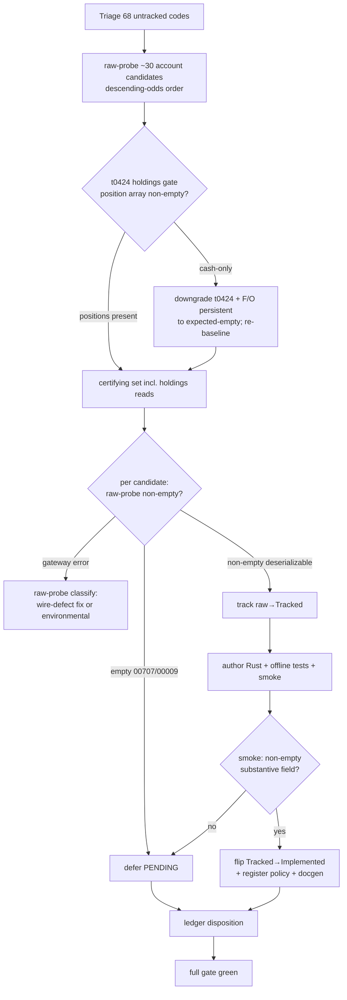

# Closed-Window Account-Lane Flip Wave - Plan

## Goal Capsule

- **Objective:** Flip more TRs from Tracked → Implemented while KRX is closed by prospecting the account lane — the one pool with closure-viable reads left — and flipping whatever certifies non-empty under closure.
- **Authority hierarchy:** Product Contract (this file) > this plan's Implementation Units > implementer judgment on details the plan leaves open. Repo owner (sunkeunchoi) is product authority; scope confirmed via brainstorm + doc-review 2026-06-28.
- **Execution profile:** Autonomous. Read-only paper smokes (`is_order: false`) carry no order surface and run in-session with `.env` paper creds — no operator gating. Each flip is its own struct + policy + facade + offline-tests + smoke increment.
- **Stop conditions:** Stop and surface if (a) the U2 pilot shows the account holds no positions and the positions sub-lanes collapse to expected-empty, OR the domestic cash/credit reads (`cspaq00600` / `cspbq00200` / `t0424` cash field) smoke with only zero/default fields and fail R5 — the "best odds" premise is then gone; re-baseline yield before continuing; (b) a candidate returns a gateway error that raw-probe classifies as a wire-type defect needing a fix outside the recipe; (c) the gate goes red and the cause is not a known count-family bump; (d) execution is not actually under KRX closure — assert market-closed at run start, since the closure framing licenses the autonomous, no-operator profile.
- **Tail ownership:** The implementer runs the gate green, writes the pool-retirement record (U5), and follows the repo's PR/landing conventions. Recommended-rung promotion is out of scope (separate ADR-gated pass).
- **Open blockers:** None. Yield is empirical (raw-probe outcomes), not a precondition; near-dry is an accepted terminal.

---

## Product Contract

### Summary

A closure-window raw-prospect-then-flip wave over the **account lane** — `account_state` reads, the only flippable material left after wave #62 drained the tracked market-data static pool. Raw-probe the full residual account-read candidate set under closure, track the codes that return non-empty bodies, and flip them via the frozen `implement-tr` recipe and the established R4/R5/R6 flip gate. Reads that smoke empty `00707` defer PENDING rather than flip. A near-dry result that retires the raw account pool is a legitimate terminal, not a failure.

### Problem Frame

Three consecutive closed-window waves (PRs #60/#61/#62) harvested the closure-viable *market-data* static reads. The June 27 wave (#62) was the close-out: 21 of 22 static tracked candidates flipped, `reference.len()` 141 → 162. The tracked-but-not-implemented pool that remains (52 TRs) is now entirely non-flippable under closure — 11 `paper_incompatible`, 5 hard-blocked, 35 session-dependent reads that guarantee empty `00707` while the market is shut, and `t2106` (the lone static-pool leftover wave #62 left PENDING).

The only place fresh closure-viable candidates can come from is the raw OpenAPI capture's untracked residue. A triage of the ~68 untracked codes shows the market-data families are exhausted there too: what remains is order TRs, overseas-stock charts, the KRX night-derivatives block, and — the one lane with reads left — **account-state queries** (balance, deposit, open-interest, execution-history, P&L). Account reads differ from every prior closure wave: they carry `account_state: true`, route through the `account` owner_class, and smoke against the paper account itself rather than a market feed. That account balance and positions persist regardless of market hours is exactly what makes a subset of them closure-viable.

### Key Decisions

- **Lane shift to account-state reads.** This is the first closure wave to flip `account_state` reads instead of market-data statics. De-risked by precedent: account reads are already a proven Implemented family (`CSPAQ12300`/`CSPAQ22200` are live), so the SDK pattern, owner_class routing, and smoke shape exist.
- **Breadth over odds.** Prospect the entire account candidate set including overseas-futures and overseas-stock account reads, despite overseas paper feeds having returned empty/`paper_incompatible` in every prior wave. One wave clears the whole account-lane question; the R5/R6 flip gate sorts winners from deferrals rather than a pre-emptive odds filter.
- **Raw-probe before tracking.** Tracking a TR bumps four count families, so tracking work is paid only for genuine flips. Each candidate is pre-screened credential-safe via `make raw-probe`; only codes that return a non-empty body get tracked and flipped.
- **Near-dry is a valid win.** Honest expected yield is low and skewed toward persistent-state reads. A thin certify-rate that documents the raw account pool as retired is an accepted outcome — the triage is part of the product, not just the flips.

### Requirements

**Candidate selection and triage**

- R1. Triage the ~68 untracked raw codes into account-read candidates vs excluded (orders, overseas-stock charts, night-derivatives market-data, known `paper_incompatible`), recording exactly one disposition per code so the audit is complete.
- R2. The candidate set is the full account lane — domestic stock account, F/O account, overseas-futures account, overseas-stock account, plus the loanable-stock reference list (`clnaq00100`) and server-time utility (`t0167`). See the Candidate Triage table.
- R3. Pre-screen every candidate with `make raw-probe` under closure before any tracking work — credential-safe, adding no count-family churn; only codes returning a non-empty deserializable body advance to track-and-flip. Probe in descending-odds order: domestic persistent-state first (the flip-bearing cohort), then F/O and history-dependent, then overseas last.
- R4. Gate the holdings/position sub-lanes on an account-holdings probe, run before those sub-lanes are committed. Probe `t0424` and key the decision on its **holdings array** (`t0424OutBlock1`), not the whole body — `t0424` always returns a populated cash-summary block (`t0424OutBlock`), so an empty-body check cannot detect a cash-only account. If the holdings array is empty, the account holds cash but no positions: downgrade `t0424` and the F/O persistent-state reads from "best odds" to expected-empty and re-baseline the yield estimate before tracking any sub-lane.

**Flip gate** (inherited from the established closure-wave recipe)

- R5. A candidate flips only when its paper smoke, run under closure, returns a body that deserializes AND at least one modeled non-key field holds a non-default value. This certifies callability and shape, not data freshness. For a holdings read, a non-default cash-summary field alone is not a holdings certify: if `t0424`'s holdings array is empty, record it as a cash-summary flip dispositioned distinctly (per R4), not a positions-bearing one.
- R6. A candidate whose smoke returns empty (`00707`) does not flip. A persistent-state read that unexpectedly smokes empty is recorded as classification-unconfirmed PENDING for an open-window or seeded-account re-test; history-dependent reads that smoke empty are the expected case and defer without ceremony.
- R7. A smoke that fails to deserialize or returns a gateway error is classified via `make raw-probe` before any flip: a wire-type defect (e.g. `IGW40011` from a numeric request field serialized as a string) is fixed and re-smoked; an environmental failure is retried, not flipped.

**Tracking and registration**

- R8. Each flipped TR is brought Tracked → Implemented via the frozen `.agents/skills/implement-tr/SKILL.md` recipe: metadata, projected baseline, callable Rust, offline tests, and an in-window typed paper smoke.
- R9. Each new REST `{TR}_POLICY` const registers in both cross-check lists; account reads route to the `account` owner_class, not `market_session`/`paginated`.
- R10. Keep the gate green throughout — `make docs`, `cargo test`, `cargo test -p ls-core`, `make docs-check`. Account the count-family bumps: tracking moves `maintained_tr_count` and the docgen/cli.rs literals; flipping moves `reference.len()` and `banner_trs`.

**Outcome and honesty**

- R11. Document the account raw pool as retired in `metadata/PROVISIONALITY-LEDGER.md` with per-code dispositions for every probed-empty/deferred candidate — regardless of overall yield — so a future wave does not re-prospect the same dry codes.

#### Candidate Triage

Account-read candidates (~30), grouped by sub-lane. Persistence skew predicts which certify under closure: *persistent-state* reads (balance, deposit, open-interest, credit-limit, loanable-list, server-time) hold values regardless of trading history; *history-dependent* reads (execution-history, P&L, trade-journal) need trades the paper account does not have.

| Sub-lane | Codes | Persistence skew | Closure expectation |
|---|---|---|---|
| Domestic stock account | `cspaq00600` `cspbq00200` `t0424` `clnaq00100` (persistent); `cspaq13700` `cdpcq04700` `foccq33600` `t0150` `t0151` (history) | Mixed | Best odds via cash/credit fields — `cspaq00600` (신용한도), `cspbq00200` (증거금 capacity), `clnaq00100` (loanable list) certify off cash/reference data; `t0424` (잔고2) certifies only if its cash field is non-default (holdings unconfirmed — see the R4 probe) |
| F/O account | `cfoaq50600` `cfoeq11100` `cfofq02400` `t0441` `cfobq10800` (persistent); `cfoaq00600` `cfoeq82600` `foccq33700` `t0434` (history) | Mixed | Persistent F/O reads certify only if the paper account carries F/O eligibility/positions — gated by the R4 holdings probe |
| Overseas-futures account | `cidbq01400` `cidbq01500` `cidbq01800` `cidbq02400` `cidbq03000` `cidbq05300` `cideq00800` | Mostly persistent | Low — overseas paper feeds historically empty |
| Overseas-stock account | `cosaq00102` `cosaq01400` `cosoq00201` `cosoq02701` | Mixed | Low — overseas paper feeds historically empty |
| Utility | `t0167` (server-time) | Persistent | Trivially closure-viable; a utility, not market data |

Excluded at triage (orders / overseas market-data / night-derivatives / known-incompatible): `cfoat*` `cidbt*` `cosat*` `cosmt*` `ccent*` (order TRs); `ccenq30100` (night-derivatives history); `g3202`–`g3204` `o3103`/`o3104`/`o3107`/`o3108` `t3518`/`t3521` (overseas market-data); `t8456`–`t8462` (KRX night-derivatives market-data); `mmdaq91200` (known `01900`).

### Acceptance Examples

- AE1. Persistent-state read certifies. **Covers R3, R5, R8.** **Given** `t0424` (주식잔고2), **when** raw-probed then smoked under closure, **then** it returns a deserializable body with a non-default cash/balance field → tracked and flipped Implemented.
- AE2. Empty-holdings probe re-baselines the positions sub-lanes. **Covers R4.** **Given** the `t0424` holdings probe returns a populated cash-summary block but an empty holdings array (`t0424OutBlock1`), **when** the gate evaluates it, **then** the account is treated as cash-only-no-positions: `t0424` and the F/O persistent-state reads are downgraded to expected-empty and not committed as positions-bearing flips.
- AE3. History-dependent read defers. **Covers R6.** **Given** `cspaq13700` (주문체결내역) on a paper account with no trades, **when** smoked under closure, **then** it returns empty `00707` → deferred PENDING, not flipped, no ceremony.
- AE4. Overseas read defers. **Covers R6.** **Given** `cosoq00201` (해외주식 종합잔고), **when** smoked under closure with no overseas positions, **then** empty `00707` → deferred PENDING.
- AE5. Wire-type defect, not environmental. **Covers R7.** **Given** a candidate that returns `IGW40011`, **when** classified via `make raw-probe`, **then** a numeric request field quoted as a string is re-serialized with `string_as_number` and re-smoked before any flip decision.
- AE6. Near-dry terminal. **Covers R11.** **Given** the wave certifies only a handful of domestic persistent-state reads, **when** the prospect completes, **then** the account raw pool is documented as retired in the ledger with per-code dispositions — recorded as a successful close-out.

### Success Criteria

- The full account-read candidate set is triaged and pre-screened; every candidate carries a flip-or-defer disposition with evidence.
- Every certifying candidate flips with a green gate (`make docs` / `cargo test` / `cargo test -p ls-core` / `make docs-check`) and an in-window typed smoke asserting a substantive modeled field.
- No false flip: nothing flips on an empty `00707` body.
- The wave's honest yield — whatever it is, including near-dry — is recorded so the raw account pool is not re-prospected dry.

### Scope Boundaries

**Deferred for later**

- The 35 session-dependent market-data reads + `t2106` — guarantee empty `00707` under closure; belong to a future open-window wave.
- Promotion of any flipped TR to Recommended — a separate ADR-gated attestation pass.
- Seeding paper positions to populate history-dependent account reads — declined for this wave; would require real paper orders and a session, breaking the pure-closure framing.

**Outside this wave**

- Order/transaction TRs (`cfoat*` `cidbt*` `cosat*` `cosmt*` `ccent*`) — not reads.
- Overseas-stock charts (`g3202`–`g3204`), overseas-futures quote/chart (`o3103`/`o3104`/`o3107`/`o3108`), overseas index (`t3518`/`t3521`) — market-data, not account reads, and overseas paper-incompatible.
- KRX night-derivatives market-data (`t8456`–`t8462`) and `ccenq30100` — night-family feeds.
- `mmdaq91200` — known `01900` paper-incompatible.

### Dependencies / Assumptions

- The paper credentials in `.env` are order-capable (cleared the `01491` 모의투자 주문 불가 block in a prior wave). Order-capability means the account *can* place orders, not that it *has* — a never-filled account holds cash but no securities. Cash/deposit balance is confirmed (a prior CSPAQ12200 smoke returned a row); securities holdings and F/O positions are **unverified**. Holdings/position reads therefore inherit the same expected-empty risk as history-dependent reads until the R4 holdings probe confirms otherwise.
- The `account` owner_class and its smoke shape are proven — `CSPAQ12300`/`CSPAQ22200` are already Implemented account reads to mirror.
- KRX is closed (2026-06-28, Sunday). Market-data reads return empty; account-state persistence is what makes the subset reachable.
- Wire field names, types, and array-vs-single shapes for each tracked candidate come from its projected normalized baseline, not guesswork.

### Outstanding Questions

**Deferred to planning**

- Exact `account` owner_class sub-routing and SDK module placement per certifying TR (mirror the nearest Implemented account sibling).
- Per-TR array-vs-single out-block shapes — read from the projected baseline during `implement-tr`, not assumed.

### Sources / Research

- `metadata/PROVISIONALITY-LEDGER.md` §15 — June 27 tracked-only pool triage (the 22+11+5+35 disposition) and the wave close-out note (`reference.len()` 141 → 162).
- `docs/plans/2026-06-27-001-feat-closed-window-more-flips-plan.md` — the R1–R6 candidate-selection + flip-gate recipe inherited here.
- `.agents/skills/implement-tr/SKILL.md` — frozen flip recipe (R8).
- `crates/ls-trackers/baselines/api-drift/raw/ls-openapi-full.json` — raw OpenAPI capture; the candidate triage derives from its `groups[].trs[]` classification.
- `crates/ls-trackers/tests/api_drift.rs:106` (`maintained_tr_count = 213`) and `crates/ls-docgen/src/lib.rs:1176` (`reference.len() = 162`) — current count baselines the wave moves.
- `docs/solutions/integration-issues/ls-gateway-igw40011-numeric-request-fields.md` — the `IGW40011` numeric-request-field fix referenced in R7/AE5.
- `crates/ls-sdk/src/account/mod.rs:257-407` (CSPAQ12300 structs + `:1378-1382` facade), `crates/ls-core/src/endpoint_policy.rs:1199-1210` (`CSPAQ12300_POLICY`), `crates/ls-sdk/tests/account_tests.rs` — the account-read exemplar this wave mirrors.
- `docs/solutions/conventions/implement-tr-registration-sites.md` (registration/crosscheck sites + the exemplar trap), `docs/solutions/conventions/market-hours-read-empty-result-disposition.md` (non-empty-witness gate), `docs/solutions/conventions/tr-out-block-shape-from-raw-capture.md` (array-vs-single from the raw capture).

---

## Planning Contract

Product Contract unchanged — this enrichment adds only Planning Contract, Implementation Units, Verification Contract, and Definition of Done. The R1–R11 / AE1–AE6 product scope is preserved verbatim.

### Key Technical Decisions

- KTD1. Mirror CSPAQ12300; do not invent. Each flip mirrors the already-Implemented `CSPAQ12300` account read (`crates/ls-sdk/src/account/mod.rs:257-407` structs + `:1378-1382` facade; policy `crates/ls-core/src/endpoint_policy.rs:1199-1210`; tests `crates/ls-sdk/tests/account_tests.rs`). The metadata facets mirror the nearest account sibling `metadata/trs/CSPAQ12200.yaml`; the Rust structs/policy/tests mirror `CSPAQ12300`. Reuse the `account` owner_class, the existing `sdk.account()` accessor, and the shared `/stock/accno` path for stock-account TRs (F/O and overseas reads take their own path from the baseline). Account reads are a proven Implemented family and the recipe is frozen.

- KTD2. Track and flip are separate commits — count-family asymmetry. Tracking raw→Tracked bumps `maintained_tr_count` (`crates/ls-trackers/tests/api_drift.rs:106`), the `TRACKED_TRS` array length + sorted insert (`crates/ls-docgen/src/lib.rs:677`), and four cli.rs test literals (`crates/ls-trackers/src/cli.rs:1811,1876,2779,2787`). Flipping Tracked→Implemented bumps only `reference.len()` (`crates/ls-docgen/src/lib.rs:1176`) and `banner_trs` (`:1008-1031`). Touching the maintained-count sites during a flip is a bug. After `make api-drift-renormalize`, revert `manifest.refreshed` to the last raw-refresh date.

- KTD3. The holdings determination reads `t0424`'s position out-block from its typed smoke, not from raw-probe. `make raw-probe` reports only http / rsp_cd / body_len — it cannot inspect a named out-block, and `t0424` always returns a populated cash-summary block (`t0424OutBlock`), so `body_len` is non-discriminating between a cash-only account and one holding positions. The determination therefore requires `t0424` modeled first: U2 takes `t0424` through the track + flip recipe as a pilot, then reads its deserialized holdings array (`t0424OutBlock1`) from the typed smoke. Model the array out-block as `Vec<…>` + `de_vec_or_single`, reading array-vs-single shape from the RAW capture's `res_example` (`crates/ls-trackers/baselines/api-drift/raw/ls-openapi-full.json`); the normalized baseline erases array-ness.

- KTD4. Numeric request fields serialize as JSON numbers. Any account read carrying cursor/count/index slots serializes those as numbers (`#[serde(serialize_with = "ls_core::string_as_number")]`) or the gateway returns `IGW40011`. Audit EVERY numeric request field with an offline `.is_number()` assertion — a persistent `IGW40011` means re-audit wire types, not "environmental" (the t1988 lesson).

- KTD5. A non-empty substantive-field witness gates every flip. The smoke records a flip only after asserting the substantive modeled field (balance / quantity / holdings count) is non-default — never an echoed account-no / date / header the gateway populates regardless. `00707` is a success code with an empty body; recording without the assertion falsely flips. AND multiple witnesses, never OR.

- KTD6. Repoint exemplars before flipping. Support-aware tests in `crates/ls-trackers/tests/` and `crates/ls-docgen/src/lib.rs` hard-code tracked-only TRs as fixtures. Grep `crates/ls-trackers` and `crates/ls-docgen` for each candidate code before flipping; if a flipped TR is an exemplar, repoint the fixture to a durably tracked-only TR (one with a blocking facet) — do not weaken the assertion.

- KTD7. Account-leak scrubbing in smokes AND dispatch logs. Account smokes never reference `rsp_msg` or account numbers in committed output; the Err path uses `SMOKE-FAIL` on stderr, never a capturable `LIVE-SMOKE` line. Field-level scrubbing does not cover the `ls_core` dispatch debug events (the dispatch path logs `rsp_msg` and the whole response body on error paths) — so before any autonomous account read runs, install the fail-closed process-global tracing subscriber the order wave uses (`docs/solutions/architecture-patterns/autonomous-order-smoke-fail-closed-contract.md` §5) to suppress/scrub those events. Each `live_smoke_*` fn gets an offline test asserting its Err branch emits no `LIVE-SMOKE` line; add a test asserting an errored account dispatch leaks no account number to captured logs.

### High-Level Technical Design

The wave is a pre-screen → gate → per-candidate flip loop → retire pipeline. Triage and probing are credential-safe and produce no committed code; only certifying candidates enter the track/flip loop.

### Assumptions

- The `.env` paper creds are order-capable (01491 cleared in a prior wave) and carry cash/deposit; securities holdings are unverified until the U2 gate resolves them.
- KRX is closed during execution. The account-lane candidates are persistent-board-shaped (balance/holdings/cash), so they are reachable under closure where session-dependent market-data reads would return `00707`.
- Read-only smokes (`is_order: false`) run autonomously — no order surface to guard, so no operator gating (a departure from the order waves).

### Sequencing

U1 (triage + pre-screen) → U2 (holdings gate) → U3 (track certifying) → U4 (flip certifying) → U5 (ledger + gate). U3 and U4 repeat per certifying candidate; the certifying set size is empirical (U1/U2 output).

---

## Implementation Units

### U1. Triage and raw-probe pre-screen

- Goal: Produce the certifying-candidate list by triaging the ~68 untracked raw codes and raw-probing the ~30 account candidates in descending-odds order.
- Requirements: R1, R2, R3.
- Dependencies: none.
- Files: read-only — `crates/ls-trackers/baselines/api-drift/raw/ls-openapi-full.json` (`groups[].trs[]` for candidate names, paths, and `req_example`). Produces a working triage note (scratch, uncommitted) of per-code dispositions.
- Approach: Triage all 68 untracked codes into account-read candidates vs excluded (orders / overseas-market-data / night-derivatives / known-`01900`) per the Candidate Triage table. For each candidate, `make raw-probe LS_PROBE_TR_CD=.. LS_PROBE_PATH=.. LS_PROBE_BODY='{"<tr>InBlock":{...}}'` in odds order (domestic persistent → F/O and history → overseas last), sourcing the body shape from the raw capture's `req_example`. Classify from raw-probe's http / rsp_cd / body_len: `rsp_cd=00000` with `body_len` beyond a bare envelope → certifying candidate (full deserialization is confirmed later at U4's typed reader — raw-probe does not deserialize); empty `00707` (or the `00009` 해당 자료가 없습니다 no-data variant) → defer PENDING; gateway error → flag for U4 wire-type classification (KTD4). raw-probe is credential-safe.
- Test scenarios: Test expectation: none — investigation step; produces no committed code.
- Verification: every candidate carries a flip-or-defer disposition with its raw-probe `rsp_cd`/`body_len`; the certifying set is identified for U3.

### U2. Pilot-flip t0424 as the holdings gate

- Goal: Determine whether the paper account carries securities positions by modeling `t0424` first and reading its holdings array from the typed smoke; gate the F/O positions cohort on the result.
- Requirements: R4.
- Dependencies: U1.
- Files: `t0424` track + flip artifacts — the U3 + U4 procedure applied to `t0424` ahead of the rest (see U3/U4 Files).
- Approach: Take `t0424` through the track + flip recipe before the remaining candidates (it is a domestic persistent-state candidate from U1). Its typed smoke deserializes `t0424OutBlock1` (the holdings array) — raw-probe cannot, since it reports only `body_len` and `t0424` always returns a populated cash-summary block (KTD3). If the holdings array is empty (cash-only account), record `t0424` as a cash-summary flip (R5, dispositioned distinctly) and downgrade the F/O persistent-state reads to expected-empty, re-baselining the yield estimate before the remaining sub-lanes are committed. Record the determination for U5.
- Test scenarios: covered by U4's per-TR scenarios applied to `t0424` (request serialization, fixture deserialize, single-vs-array on `t0424OutBlock1`, empty-holdings → cash-summary flip, Err-branch + dispatch-log scrub).
- Verification: `t0424` is Implemented (or PENDING if its body is empty `00707`); the holdings determination is recorded; no F/O positions-dependent read is queued for flip on a cash-only account.

### U3. Track each certifying candidate (raw → Tracked)

- Goal: Bring each remaining certifying candidate (the U2 pilot `t0424` aside) to Tracked: metadata + projected baseline + count-family bumps.
- Requirements: R8 (track stage).
- Dependencies: U1, U2.
- Files (per candidate): `metadata/trs/<tr>.yaml` (mirror `metadata/trs/CSPAQ12200.yaml`); `metadata/tr-index.yaml` (new entry); `crates/ls-trackers/baselines/api-drift/normalized/trs/<tr>.json` (projected via `make api-drift-renormalize`, never hand-authored). Count bumps: `crates/ls-trackers/tests/api_drift.rs:106`, `crates/ls-docgen/src/lib.rs:677`, `crates/ls-trackers/src/cli.rs:1811,1876,2779,2787`. Revert `manifest.refreshed`.
- Approach: For each certifying code, author the yaml with `owner_class: account`, `account_state: true`, `rate_bucket: account`, `self_paginated: false`, the correct `venue_session`, and `caller_supplied_identifiers: []` (mode flags are not identifiers). Add the matching tr-index entry (validator cross-checks exactly). Run `make api-drift-renormalize`; assert `git diff --stat .../normalized/trs/` shows only the new file (drift guard). Bump the count-family sites by the number of newly tracked codes.
- Test scenarios:
  - Metadata validation passes (`cargo test -p ls-core`) with the new yaml + tr-index entry.
  - The renormalize drift guard shows only new baseline files, no modified pre-existing baselines.
  - `maintained_tr_count` and `TRACKED_TRS` length equal the new total.
- Verification: `cargo test -p ls-core` green; each new TR is Tracked with a projected baseline; counts reconcile.

### U4. Flip each tracked candidate (Tracked → Implemented)

- Goal: Author callable Rust + offline tests + a certifying paper smoke for each tracked candidate, register the policy, and flip to Implemented when the smoke certifies (`t0424` itself is flipped first in U2 as the holdings pilot, by this same procedure).
- Requirements: R5, R6, R7, R8 (flip stage), R9.
- Dependencies: U3.
- Files (per candidate): `crates/ls-sdk/src/account/mod.rs` (InBlock + Request + OutBlock(s) + Response + facade method, mirroring CSPAQ12300); `crates/ls-core/src/endpoint_policy.rs` (`{TR}_POLICY` const near `:1199` + register in `slice_rest_policies_are_non_order_rest` near `CSPAQ12300_POLICY`, `endpoint_policy.rs` ~:2907); `crates/ls-core/tests/policy_index_crosscheck.rs` (the `use` import + the `policies` array `:147-149`); `crates/ls-sdk/tests/account_tests.rs` + `crates/ls-sdk/tests/fixtures/<TR>_resp.json`; `crates/ls-sdk/tests/live_smoke.rs` (`live_smoke_<tr>`); `Makefile` (`live-smoke-<tr>` target + `.PHONY` line `:18`); `.agents/skills/promote-tr/references/smoke-map.md` (row, Promotion=`implemented-only`); `crates/ls-docgen/src/lib.rs` (`banner_trs` `:1008-1031` + `reference.len()` `:1176`). Repoint any exemplar referencing this code (KTD6).
- Approach: Mirror CSPAQ12300. Model the position out-block as `Vec<…>` + `de_vec_or_single` (array-ness from the RAW capture, KTD3); serialize numeric request fields via `string_as_number` (KTD4). Run the smoke and apply the flip gate (R5): deserialize + non-default substantive field (KTD5) → flip; empty `00707` → leave Tracked/PENDING (R6); gateway error → raw-probe classify (R7). On flip: set `implemented: true`, append to `banner_trs`, bump `reference.len()`, register the policy in both crosscheck lists.
- Execution note: Write the offline wiremock tests before the smoke. Fire the typed smoke before adding the crosscheck registrations — the crosscheck lists are test-only, so this validates wire shape without a red gate mid-edit.
- Test scenarios (per flipped TR):
  - Covers AE1. Request serialization: the in-block serializes under the `#[serde(rename)]` key; every numeric request field asserts `.is_number()`.
  - Covers AE1. Fixture deserialize: a recorded non-empty response deserializes and the substantive field holds a non-default value.
  - Single-object-vs-array: the position out-block deserializes from both a single object and an array (`de_vec_or_single`).
  - Covers AE2. Empty-holdings / empty-body: an empty `00707` body (or empty position array) is classified non-flippable — the smoke records no flip.
  - Err-branch scrubbing: the smoke's Err path emits no capturable `LIVE-SMOKE` line and no account number / `rsp_msg` (KTD7).
  - Dispatch-log scrubbing: an errored account dispatch under debug logging emits no account number / `rsp_msg` to captured logs — the fail-closed tracing subscriber is installed (KTD7).
- Verification: offline tests green; the smoke records a non-empty substantive field for each flipped TR; both crosscheck lists and docgen counts updated; `cargo test` + `make docs-check` green.

### U5. Retire the account raw pool + full gate

- Goal: Record per-code dispositions for every probed candidate in the ledger, then run the full gate green.
- Requirements: R10, R11.
- Dependencies: U4.
- Files: `metadata/PROVISIONALITY-LEDGER.md` (new section: per-code disposition — flipped / PENDING-empty / deferred / excluded).
- Approach: Document the wave outcome with each candidate's disposition regardless of overall yield (R11 is unconditional) so a future wave does not re-prospect dry codes. Then run the full gate.
- Test scenarios: Test expectation: none — documentation + gate; the gate commands are the verification.
- Verification: the ledger records every candidate's disposition; the full gate is green.

---

## Verification Contract

| Gate | Command | Applies to | Done signal |
|---|---|---|---|
| Metadata + policy crosscheck | `cargo test -p ls-core` | U3, U4 | metadata validates; policy index mirrors metadata; non-order REST list includes new account consts |
| Workspace tests | `cargo test` | U4 | offline account tests (serialize / deserialize / array-edge / scrub) green |
| Docs regen + check | `make docs && make docs-check` | U4, U5 | generated docs match committed; `reference.len` + `banner_trs` reflect the flips |
| Baseline drift guard | `git diff --stat .../normalized/trs/` after `make api-drift-renormalize` | U3 | only new baseline files appear |
| Certify smoke (per TR) | `make live-smoke-<tr>` | U4 | non-empty substantive field recorded; empty → no flip |

Smokes hit the real LS paper gateway with `.env` creds (`LS_TRADING_ENV=paper`); they are read-only and run autonomously.

---

## Definition of Done

Global:

- Every account candidate (~30) carries a flip-or-defer disposition recorded in `metadata/PROVISIONALITY-LEDGER.md` (R11).
- Every certifying candidate is Implemented with offline tests + a certifying smoke; nothing flipped on an empty `00707` body.
- The holdings gate (U2) ran; no positions-dependent read flipped on a cash-only account.
- Full gate green: `make docs && cargo test && cargo test -p ls-core && make docs-check`.
- No exemplar test left broken — repointed, not weakened (KTD6).
- Abandoned-attempt code removed; no dead scaffolding in the diff.
- Recommended-rung promotion NOT attempted (out of scope, separate ADR-gated pass).

Per-unit: each unit's Verification clause is satisfied.
