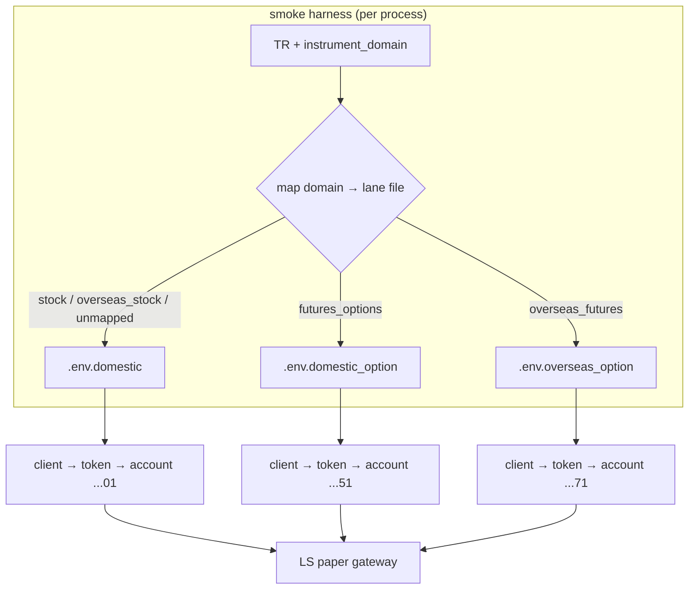
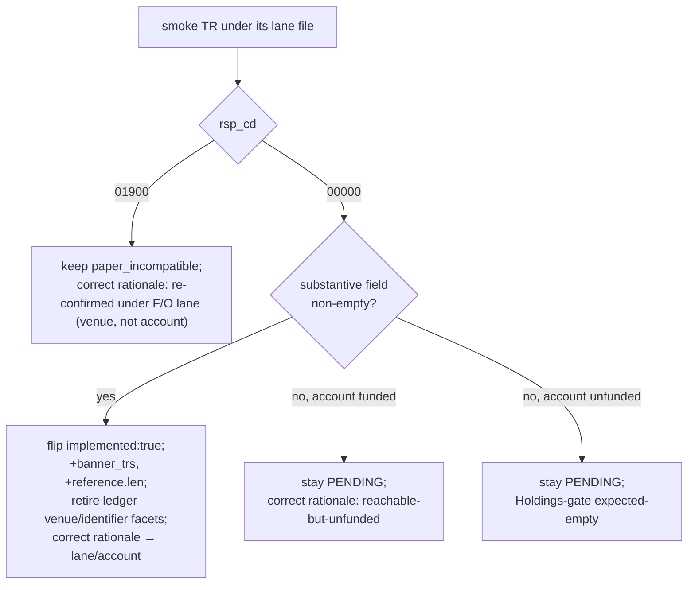

# Paper Account Credential Lanes - Plan

## Goal Capsule

- **Objective:** Give the SDK per-account paper credentials so F/O and overseas-F/O account reads authenticate as the *right* account, then flip the reads that were blocked only by wrong-account binding.
- **Product authority:** sunkeunchoi (repo owner).
- **Open blockers:** None. Credentials verified working (diagnostic 2026-06-28); routing model chosen (per-lane client).

## Product Contract

> **Product Contract preservation:** Changed during planning — R1, R3, R4, R5, R6 reframed from *runtime `instrument_domain` routing inside one client* to *per-lane client selection* (one client per lane file; the smoke harness sources the right lane file per TR). The user confirmed this model. Runtime single-client routing is deferred (see Scope Boundaries). All other requirements (R2, R2a, R7–R13, AEs) unchanged in intent.

### Summary

Rename the paper credential env var to `LS_PAPER_APIKEY` (with a real-money-alias guard), and let each client authenticate as one account by sourcing that account's lane file. With the F/O and overseas-F/O accounts now reachable per-lane, re-probe and flip the account-state reads that previously came back empty only because every request authenticated as the domestic cash account — the read structs already exist; only a non-empty smoke and the metadata flip remain.

### Problem Frame

The SDK reads one credential set (`config.rs:268-279`) and authenticates every request with its single OAuth token. The account number in `.env` is never sent on the wire — dispatch sets only `tr_cd`, continuation, content-type, and the bearer token (`inner.rs:261-271`), and LS's own request examples carry no account field. The account is therefore wholly determined by which account the token's appkey is bound to, as `account/mod.rs:11-21` documents.

Earlier waves smoked F/O and overseas-F/O account reads (`CFOEQ11100`, `t0441`, `CIDBQ01400`, and the night-derivative pair) against that one domestic-bound token. They returned empty `00707` and were deferred — recorded as "paper carries no data." A 2026-06-28 diagnostic disproved that: each account has its own appkey, and an F/O read authenticated with the F/O appkey resolves to the F/O account (`...51`) and returns a row. The reads were never touching their real account. The fix is per-account credentials plus routing, not a number change.

### Key Decisions

- **Account selection is token-bound; multi-account needs multiple credential sets.** Proven by the diagnostic — forcing the account *number* to the option value left the gateway resolving the domestic account, while swapping the *appkey* moved it. There is no per-request account field to add.
- **Per-lane client, not runtime routing.** Each client process authenticates as exactly one account, determined by which lane file is sourced before it runs — the SDK is already "one client = one account/token" and the diagnostic proved sourcing a lane file switches the resolved account. Multi-account is achieved by running a separate client/smoke per lane, not by multiplexing inside one client. This avoids adding `instrument_domain` to every endpoint policy, dispatch-time branching, four token managers, and WS-manager rework. Runtime single-client routing is deferred (Scope Boundaries).
- **Lane selection is a harness mapping by `instrument_domain`.** The smoke harness maps a TR to its lane file by the TR's `instrument_domain` facet (`stock`/`overseas_stock` → domestic, `futures_options` → domestic-option, `overseas_futures` → overseas-option; unmapped → domestic) and sources that file. The SDK itself is unchanged here — it never reads a `.env` file (the Makefile sources it), so the SDK stays single-config.
- **Credential env var is `LS_PAPER_APIKEY`** (with `LS_PAPER_SECRET`, `LS_PAPER_ACCOUNT`), renamed from `LS_PAPER_APPKEY`. The old `APPKEY`/`LS_REAL_APPKEY`/legacy `LS_APPKEY` names are accepted as back-compat aliases so existing setups and `.env.example` do not silently break.
- **The read structs already exist.** `CFOEQ11100`, `t0441`, `CIDBQ01400` were authored (structs, facade methods, offline tests, `live-smoke-*` targets, smoke-map rows) during PR #63 and left `implemented: false` only because their smokes ran on the wrong account. Flipping them is re-smoke-under-the-right-lane plus the metadata/docgen/ledger flip — not new Rust.
- **Night-derivatives: re-probe before assuming incompatibility.** `CCENQ10100`/`CCENQ90200` and the `t84xx` night reads were last seen returning a hard `01900` — but that observation was made under the *domestic* account, the same wrong-account condition this plan fixes. The `01900` may be account-capability-related, so they are re-probed under the domestic-option lane before the `paper_incompatible` disposition is kept (see R12).

### Requirements

**Credential configuration**

- R1. A client authenticates as one account, sourced from one lane file (`.env.domestic`, `.env.domestic_option`, `.env.overseas`, `.env.overseas_option`); each file is a `(apikey, secret, account_no)` triple. The SDK config layer is unchanged from today's single-credential model — the lane files differ only in which credential they carry. Multi-account access is multiple clients/processes, one per lane.
- R2. The credential env var is `LS_PAPER_APIKEY` (plus `LS_PAPER_SECRET`, `LS_PAPER_ACCOUNT`). The prior `LS_PAPER_APPKEY`, `LS_REAL_APPKEY`, and legacy `LS_APPKEY` names are accepted as back-compat aliases.
- R2a. A paper run must not authenticate with real-money credentials through the alias fallback. Config fails fast (clear error) when a lane-prefixed key and a legacy `LS_APPKEY`/`LS_REAL_*` name are both set, and the alias fallback never resolves a paper request to a real-money credential name.
- R3. When no lane file is sourced, the client uses the domestic credential (the default `.env`/`.env.domestic`), preserving current single-account behavior.
- R4. Each client holds its own OAuth token for its sourced lane, exactly as today (single token per process). No cross-lane token state is introduced.

**Routing**

- R5. The smoke harness maps a TR to its lane file by the TR's `instrument_domain` facet: `stock`/`overseas_stock` → domestic, `futures_options` → domestic-option, `overseas_futures` → overseas-option. Any other, absent, or unmapped value (e.g. `sector_index`, `misc`) → domestic. Lane selection happens in the harness (which file to source), not in runtime dispatch.
- R6. Order dedup and kill-switch keying is unchanged: each client keys on its own config `account_no`. No cross-lane seam is introduced (runtime multi-lane routing is deferred — see Scope Boundaries).
- R7. Credential and account values never appear in logs or `Debug` output, preserving the existing redaction discipline.

**Flip wave**

- R8. Re-probe the tracked-PENDING F/O and overseas-F/O `account_state` reads (`CFOEQ11100`, `t0441`, `CIDBQ01400`) against their correct lane, and flip to Implemented those that return real data on a paper smoke. Confirm the target lane's account is funded first (see the Holdings-gate precondition in Dependencies); an unfunded account yields a false reachable-but-empty result.
- R9. Optionally track-and-flip a bounded set — at most 8 — of currently-raw F/O / overseas-F/O account reads that the new lanes make reachable. The wave does not track the full raw candidate pool; if raw-probe yields more than the cap, the remainder is held for a separate wave rather than absorbed here.
- R10. Each flip is gated on a Paper Live Smoke that asserts a substantive modeled field, per the `implement-tr` recipe.

**Metadata correction**

- R11. TRs previously deferred as "paper carries no data" that were actually wrong-account-bound get their rationale corrected in `metadata/PROVISIONALITY-LEDGER.md` and the relevant facets. The corrected rationale names which lane and account the TR now resolves to (e.g. "was unreachable under the domestic credential; now resolves on the domestic-option lane, account `...51`"), so a future maintainer can verify post-fix behavior.
- R12. Night-derivatives (`CCENQ10100`/`CCENQ90200`, `t84xx` night reads) are re-probed under the domestic-option lane before disposition. If the `01900` rejection persists with an F/O-capable account, they stay `paper_incompatible` (venue rejection, not account); if it clears, they move into the R8/R9 flip wave.

**Test harness**

- R13. The live-smoke harness loads the per-lane credential files so each smoke runs under its TR's lane (it currently sources a single `.env`).

### Acceptance Examples

- AE1. **Covers R5.** When the harness runs a `futures_options` read, it sources `.env.domestic_option` first, so the client authenticates as account `...51` and the gateway echoes `...51` (not the domestic `...01`).
- AE2. **Covers R3.** When no lane file is sourced, the smoke runs under the domestic credential and behaves exactly as today.
- AE3. **Covers R8, R10.** When `CFOEQ11100` is smoked under the domestic-option lane and returns a non-empty deposit row, it flips to Implemented; if it still returns an empty `00707`, it stays PENDING with corrected rationale (reachable-but-unfunded, not wrong-account).
- AE4. **Covers R6.** A domestic order's dedup key is computed from the domestic client's own `account_no`; running an F/O smoke in a separate process does not affect it.

### Scope Boundaries

- **Runtime single-client `instrument_domain` routing** (one client transparently multiplexing four accounts/tokens) — deferred. Per-lane client selection covers the entire flip wave; revisit only if a real single-client multi-account consumer emerges. Deferring it avoids adding `instrument_domain` to every endpoint policy const, dispatch branching, and WS-manager rework.
- Real-money multi-account credentials and any account-capability auto-discovery — paper-only.
- Tracking the full ~40 raw F/O / overseas candidates — out of scope beyond the bounded R9 set.
- Unblocking overseas-**stock** reads — they run on the already-bound `...01` account, so their emptiness is genuine no-data and is not addressed here.
- Re-attempting night-derivatives as flips without a re-probe — see R12.

### Dependencies / Assumptions

- Credentials are verified working (diagnostic 2026-06-28): each lane's appkey resolves to its intended account — domestic `...01`, domestic-option `...51`, overseas `...01`, overseas-option `...71`.
- Overseas and domestic share account `...01`; there is no separate overseas-stock account. `.env.overseas` exists (its own appkey also resolves to `...01`), but R5 routes `overseas_stock` to the domestic lane, so `.env.overseas` is not separately used by the wave — both reach the same account.
- A reachable F/O/overseas account must carry positions or deposit to produce a non-empty read. The flip wave (R8) confirms the target lane's account is funded as a precondition — applying the existing holdings-gate convention — so an unfunded account is read as expected-empty, not a defect, and does not produce a false PENDING.
- The four lane files live at repo root and are covered by the existing `.env.*` `.gitignore` rule; they must stay untracked. Adding a lane file in a subdirectory would escape that rule.

### Outstanding Questions

**Deferred to implementation**

- The exact membership of the bounded R9 set (≤8) — depends on raw-probe yield against the live lanes; resolved when U5's raw-probe runs.
- Whether the night-derivatives clear under the F/O lane (R12) — resolved by U4's re-probe at execution time.

### Sources / Research

- **Diagnostic (2026-06-28):** a throwaway probe read the gateway-echoed `AcntNo` per credential file. Default appkey resolved `...01` for both domestic and F/O reads; forcing `LS_PAPER_ACCOUNT` to the option number did not change resolution; each per-account appkey resolved to its own account (`...01`/`...51`/`...01`/`...71`).
- Single-account env read: `crates/ls-core/src/config.rs:268-279`.
- No account on the wire: `crates/ls-core/src/inner.rs:261-271`; account-from-token documentation: `crates/ls-sdk/src/account/mod.rs:11-21`.
- LS request examples carry no account field: `crates/ls-trackers/baselines/api-drift/raw/ls-openapi-full.json` (`CFOEQ11100`, `CSPBQ00200`, `CSPAT00601`, `t0424` `req_example`).
- `instrument_domain` taxonomy and counts: `metadata/trs/*.yaml` (stock 137, futures_options 46, overseas_stock 13, overseas_futures 12).
- Prior dispositions this corrects/respects: PR #63 (the PENDING F/O set), PR #57 (overseas/night `paper_incompatible`), `metadata/PROVISIONALITY-LEDGER.md` §12–13.
- Credential-file typo found and fixed during this brainstorm: `.env.domestic_option`/`.env.overseas`/`.env.overseas_option` used `LS_PAPER_APIKEY` consistently after standardization (originally a mix of `APPKEY`/`APIKEY`).
- **Implementation surface (planning research, 2026-06-28):** single-credential read `crates/ls-core/src/config.rs:267-297` (`from_env`, `env_with_fallback` at 305-309, Debug redaction 311-330); the SDK never reads `.env` — the Makefile sources it (`.env.example` header; `Makefile` `run_smoke` macro ~21-26). The three target reads are authored in `crates/ls-sdk/src/account/mod.rs` with facade methods and `live-smoke-*` targets but `implemented: false`. Flip-count sites: `crates/ls-docgen/src/lib.rs` `banner_trs` (~1015-1049) and the `reference.len()` assertion (~1192). Policy crosscheck lists (only relevant to U5's new consts): `crates/ls-core/tests/policy_index_crosscheck.rs` (`policies` slice ~74) and the `slice_rest_policies_are_non_order_rest` list in `crates/ls-core/src/endpoint_policy.rs`. Relevant learnings: `docs/solutions/integration-issues/makefile-include-env-quotes-gateway-403.md` (source `.env` in recipe, never `include`), `docs/solutions/conventions/closed-window-account-capacity-reads-all-default.md` + the Holdings-gate concept (all-default rows on an unfunded account ≠ data), `docs/solutions/integration-issues/ls-gateway-igw40011-numeric-request-fields.md` (numeric request fields). Current ledger dispositions to correct: PROVISIONALITY-LEDGER §16 (CFOEQ11100/t0441/CIDBQ01400 all-default on cash-only acct), §12 (CCENQ pair `01900`), §14 (t8455/t8460/t8463 empty `00707`).

---

## Planning Contract

### Key Technical Decisions

- **KTD1. No runtime routing; the SDK stays single-config.** Per the confirmed per-lane-client model, the only `ls-core`/`ls-sdk` source change is the credential-var rename plus the real-money guard. Lane selection is entirely in the Makefile (which file to source). This honors the "SDK never reads `.env`" invariant and the existing "one client = one account/token" shape — no `EndpointPolicy` field, no `dispatch_once` branching, no multi-token `Inner`, no `WsManager` rework.
- **KTD2. `LS_PAPER_APIKEY` fallback chain with a paper/real interlock.** `from_env` reads `LS_PAPER_APIKEY` first, then the `LS_PAPER_APPKEY` alias, then legacy bare names — but a paper run never resolves to a real-money-capable name. When a paper-prefixed key and a bare-legacy/`LS_REAL_*` key are both present, fail fast with a clear error rather than silently shadowing (R2a). This closes the `.env.example`-documented hazard where a paper smoke could authenticate with real keys.
- **KTD3. The three target reads flip via metadata, not code.** Their structs/facades/offline tests/smoke targets already exist; U3 runs the smoke under the correct lane and, on a substantive non-empty row, edits only metadata + docgen counts + ledger. No crosscheck change (their policy consts already mirror the metadata index).
- **KTD4. Live smokes are operator-run; flips are gated on their result.** The flip-bearing units (U3/U4/U5) hit the real paper gateway under a lane file. The operator triggers each `make live-smoke-*`; `ce-work` performs the metadata/docgen/ledger edits only after a confirmed non-empty (or, for U4, a confirmed `01900`) result. Disposition branches per the decision flow below — a wrong guess dispositions to PENDING, never a false flip (the assert-non-empty-before-record gate).
- **KTD5. Funding is a precondition, not an outcome.** Before flipping any positions/deposit-dependent read, confirm the lane's account is funded (Holdings-gate: read the account's deposit/holdings first). An all-default deserializable row on an unfunded account is expected-empty → PENDING with corrected rationale, not a defect and not a flip.

### High-Level Technical Design

Per-TR disposition flow for the flip-bearing units (U3/U4/U5), applied to each read after it is smoked under its mapped lane:

### Implementation Units

### U1. Rename credential env var to `LS_PAPER_APIKEY` with a real-money guard
- **Goal:** The SDK reads `LS_PAPER_APIKEY`/`LS_PAPER_SECRET`/`LS_PAPER_ACCOUNT`, accepts the old names as aliases, and refuses to authenticate a paper run with real-money credentials.
- **Requirements:** R2, R2a, R7.
- **Dependencies:** none.
- **Files:** `crates/ls-core/src/config.rs` (`from_env`, `env_with_fallback`, the `#[cfg(test)]` block ~401-486), `.env.example`.
- **Approach:** Extend the paper branch of `from_env` to resolve `LS_PAPER_APIKEY` → `LS_PAPER_APPKEY` (alias) → legacy. Add the paper/real interlock from KTD2. Update `.env.example` to the `APIKEY` name and document the four lane files and the per-lane smoke usage. Preserve the existing Debug redaction (R7) unchanged.
- **Patterns to follow:** the existing `env_with_fallback(primary, legacy)` chain in `config.rs`; the redaction Debug impl already present.
- **Test scenarios:** `LS_PAPER_APIKEY` set → resolves; only `LS_PAPER_APPKEY` set → resolves via alias; neither set → clear error; paper run with both a paper key and a bare `LS_APPKEY`/`LS_REAL_*` set → fails fast (KTD2/R2a); Debug output still redacts apikey/secret/account (R7).
- **Verification:** `cargo test -p ls-core` green with the updated/added config tests; `.env.example` names `LS_PAPER_APIKEY`.

### U2. Per-lane smoke sourcing in the Makefile
- **Goal:** Each `live-smoke-*` target sources its TR's lane file (mapped by `instrument_domain`) before running; default stays domestic.
- **Requirements:** R3, R5, R13.
- **Dependencies:** U1.
- **Files:** `Makefile` (the `run_smoke` macro and the F/O / overseas-futures smoke targets), `.agents/skills/promote-tr/references/smoke-map.md` (note the lane per TR).
- **Approach:** Add a per-target lane selector (e.g. a `LS_SMOKE_LANE` variable consumed by `run_smoke`, sourcing `.env.$(LS_SMOKE_LANE)` when set, else `.env`). Set the lane on `futures_options` targets → `domestic_option` and `overseas_futures` targets → `overseas_option`. **Fail fast** if a set `LS_SMOKE_LANE` names a missing file (do not silently fall back to `.env`, which would re-introduce the wrong-account bug); a non-domestic smoke target must set its lane explicitly. Keep sourcing in the recipe shell (`set -a; . ./.env.<lane>; set +a`), never via `include` (per the makefile-env solution doc).
- **Patterns to follow:** the current `run_smoke` macro; the diagnostic's `set -a; . ./.env.<lane>; set +a` pattern proven in the brainstorm.
- **Test scenarios:** `Test expectation: none -- Makefile plumbing; validated functionally by U3/U4 smokes resolving the correct account (a funded F/O deposit row is only returned when authenticated as the F/O account, i.e. AE1).`
- **Verification:** running an F/O smoke target sources `.env.domestic_option` and the smoke authenticates as `...51` (evidenced by substantive F/O data, not the credential-free record line).

### U3. Re-smoke and disposition the three tracked F/O / overseas-F/O reads
- **Goal:** `CFOEQ11100`, `t0441`, `CIDBQ01400` are flipped to Implemented when their lane smoke returns substantive data, else kept PENDING with corrected rationale.
- **Requirements:** R8, R10, R11.
- **Dependencies:** U1, U2.
- **Files:** `metadata/trs/CFOEQ11100.yaml`, `metadata/trs/t0441.yaml`, `metadata/trs/CIDBQ01400.yaml`, `metadata/tr-index.yaml`, `crates/ls-docgen/src/lib.rs` (`banner_trs`, `reference.len()`), `metadata/PROVISIONALITY-LEDGER.md`.
- **Approach:** Operator runs `make live-smoke-cfoeq11100` / `-t0441` / `-cidbq01400` (now lane-sourced) after a Holdings-gate funding check (KTD5). For each non-empty result: set `support.implemented: true`, add to `banner_trs`, bump `reference.len()`, retire the confirmed ledger facets, and correct the §16 rationale to name the lane/account (R11). For each still-empty-but-funded result: keep PENDING, correct rationale to "reachable-but-unfunded."
- **Execution note:** Operator-run live smokes against the paper gateway under the correct lane; metadata flip is gated on a confirmed non-empty smoke (KTD4). No new Rust — structs/facades already exist.
- **Patterns to follow:** `.agents/skills/implement-tr/SKILL.md` §6–§9 (the metadata-flip + docgen + ledger steps only); prior flip waves' docgen count bumps.
- **Test scenarios:** offline deserialize tests already exist (no new); the live smoke asserts the substantive witness per TR — `CFOEQ11100` non-zero deposit field, `t0441` non-zero positions/eval, `CIDBQ01400` non-default orderable-qty; `make docs-check` matches after the count bump.
- **Verification:** `make docs && cargo test && cargo test -p ls-core && make docs-check` all green; flipped TRs show `implemented: true` and appear in `banner_trs`; ledger rationale corrected.

### U4. Re-probe and disposition the night-derivatives
- **Goal:** `CCENQ10100`/`CCENQ90200` and `t8455`/`t8460`/`t8463` are re-probed under the domestic-option lane; kept `paper_incompatible` with corrected rationale if `01900` persists, or moved into the flip path if they clear.
- **Requirements:** R12.
- **Dependencies:** U1, U2.
- **Files:** `metadata/trs/CCENQ10100.yaml`, `metadata/trs/CCENQ90200.yaml`, `metadata/trs/t8455.yaml`, `metadata/trs/t8460.yaml`, `metadata/trs/t8463.yaml`, `metadata/PROVISIONALITY-LEDGER.md` (§12, §14); `crates/ls-docgen/src/lib.rs` only if a flip occurs.
- **Approach:** Operator raw-probes/smokes each under `.env.domestic_option`. If `01900` persists → keep `paper_incompatible: true`, correct the rationale to record it was re-confirmed under an F/O-capable lane (venue rejection, not account). If a read returns `00000` with data → flip it inline following U3's disposition flow (struct/metadata/docgen). U4 flips are separate from and do not consume U5's ≤8 cap. (Verify each TR carries `instrument_domain: futures_options` so `.env.domestic_option` is the correct lane; note any exception.)
- **Execution note:** Operator-run re-probe; disposition branches on `rsp_cd` (KTD4 decision flow).
- **Patterns to follow:** `make raw-probe` failure classifier; the disposition decision flow above.
- **Test scenarios:** branch on `rsp_cd` — `01900` → metadata rationale only (no code); `00000`+data → assert the modeled witness field before any flip.
- **Verification:** ledger §12/§14 rationales corrected; if any flip, `make docs-check` matches; `cargo test -p ls-core` green.

### U5. Bounded track-and-flip of newly-reachable raw reads (≤8)
- **Goal:** Up to 8 currently-raw F/O / overseas-F/O account reads that return substantive data under their lanes are tracked and flipped; any overflow is logged and held.
- **Requirements:** R9, R10.
- **Dependencies:** U1, U2.
- **Files:** new `metadata/trs/<tr>.yaml` + `metadata/tr-index.yaml` entries; new structs/policy consts/facade methods/offline tests in `crates/ls-sdk/src/account/`; `crates/ls-core/src/endpoint_policy.rs` + `crates/ls-core/tests/policy_index_crosscheck.rs` (register each new REST policy const in BOTH lists); `crates/ls-docgen/src/lib.rs` (count bumps); `.agents/skills/promote-tr/references/smoke-map.md`; `Makefile` (per-TR smoke targets, lane-sourced).
- **Approach:** Operator raw-probes the F/O / overseas-F/O raw candidates (the June-28 triage pool, e.g. `cfoaq50600`, `cfoeq82600`, `cfofq02400`, `cfobq10800`, `cfoaq00600`, `foccq33700`, `cidbq01500/01800/02400/03000/05300`, `cideq00800`) under their lanes. Enumerate the qualifying set first, then pick up to 8; for each, run the full `implement-tr` recipe (struct + policy const + facade + offline tests + crosscheck registration in both lists + lane-sourced smoke + metadata + docgen + smoke-map row). If more than 8 qualify, record the held remainder (TR codes + rsp_cd) in this plan's Outstanding Questions as a named follow-up wave — not just an ephemeral log line.
- **Execution note:** Full `implement-tr` recipe per TR; bounded ≤8; operator-run smokes gate each flip. Fire the typed smoke before the crosscheck registrations (the crosscheck lists are test-only).
- **Patterns to follow:** `.agents/skills/implement-tr/SKILL.md` end-to-end; `.agents/skills/track-tr/SKILL.md` for the tracked rung; wire field names from `crates/ls-trackers/baselines/api-drift/normalized/trs/<tr>.json`; numeric request fields via `string_as_number` (IGW40011 solution doc).
- **Test scenarios:** per flipped TR — offline deserialize (success body, `00707` empty case, `::new`), numeric fields parse, serialize keys correct; live smoke asserts a substantive witness field before record.
- **Verification:** `make docs && cargo test && cargo test -p ls-core && make docs-check` green; each new policy const present in both crosscheck lists; held overflow logged.

### Verification Contract

| Gate | Command | Applies to |
|---|---|---|
| Docs regenerate | `make docs` | U3, U4, U5 |
| Workspace tests | `cargo test` | U1, U3, U5 |
| Metadata validation + policy crosscheck | `cargo test -p ls-core` | U1, U3, U4, U5 |
| Docs drift gate | `make docs-check` | U3, U4, U5 |
| Per-lane Paper Live Smoke (operator-run) | `make live-smoke-<tr>` under the mapped lane | U3, U4, U5 (flip gate) |

The four `make`/`cargo` gates run autonomously and must stay green. The live smokes are operator-run against the real paper gateway and gate the flips (KTD4) — they are not part of `cargo test`.

### Definition of Done

- `config.rs` reads `LS_PAPER_APIKEY` with the `APPKEY` alias and the paper/real interlock; `.env.example` updated; config tests green.
- F/O and overseas-futures `live-smoke-*` targets source their lane files; default stays domestic.
- `CFOEQ11100`, `t0441`, `CIDBQ01400` each dispositioned under the correct lane — flipped to Implemented on a substantive smoke, or kept PENDING with corrected (reachable-but-unfunded) rationale.
- Night-derivatives re-probed under the F/O lane and dispositioned — kept `paper_incompatible` with corrected rationale, or flipped if cleared.
- Up to 8 newly-reachable raw reads flipped via the `implement-tr` recipe; any overflow logged and held.
- All ledger rationales corrected to name the lane/account (no stale "paper carries no data" text for the reads this wave touched).
- Full gate green: `make docs`, `cargo test`, `cargo test -p ls-core`, `make docs-check`.
