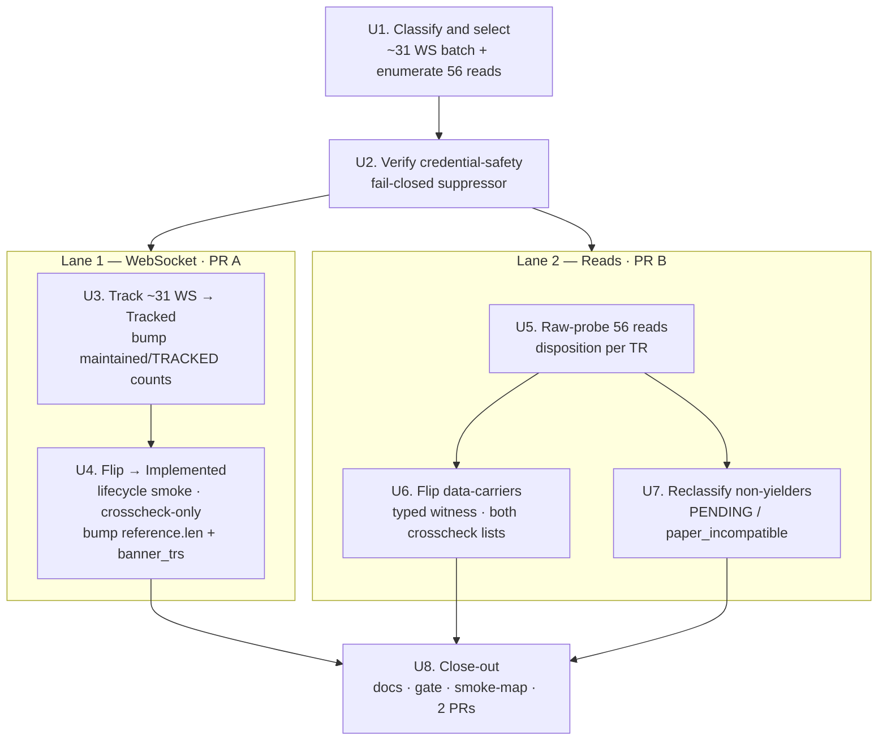

# Closure Flip Wave — WS Batch + Reads Sweep - Plan

## Goal Capsule

- **Objective:** Flip more TRs from raw/Tracked to Implemented under KRX closure across two lanes: a bounded ~31-channel WebSocket realtime batch (raw → Tracked → Implemented, connection-reachable-only) and a full sweep of the 56 tracked-only read TRs (raw-probe each under closure, flip what carries data, faithfully reclassify the rest).
- **Product authority:** Repo owner (sunkeunchoi). Wave shape pinned in brainstorm: bounded WS batch + full reads sweep.
- **Authority hierarchy:** the frozen recipes (`.agents/skills/{track,implement}-{realtime-,}tr/SKILL.md`) and the normalized baselines are authoritative over this plan for mechanical steps and wire shapes; this plan is authoritative over scope and sequencing; the repo owner is authoritative over both.
- **Execution profile:** two decoupled lanes, two stacked PRs (KTD7). The credential-safe `make raw-probe` / live smokes hit the **real LS paper gateway** with `LS_TRADING_ENV=paper`; run under KRX closure. The gate (`make docs` · `cargo test` · `cargo test -p ls-core` · `make docs-check`) must stay green at every commit.
- **Stop conditions:** stop and surface to the owner if (a) a baseline self-diff is dirty (pre-existing baseline modified, not just new files — KTD4), (b) the credential-safety suppressor cannot be installed (R12 / KTD6), or (c) a flip would require a `recommendation` block (Recommended is out of scope).
- **Tail ownership:** the implementer runs `make docs` + gate, authors the smoke-map rows and Makefile `.PHONY` targets, and opens the two PRs.
- **Open blockers:** none. The three brainstorm Outstanding Questions are resolved as planning decisions — OQ1 (batch composition) → U1 classify-first selection; OQ2 (PR structure) → two stacked PRs (KTD7); OQ3 (reads floor) → no floor, per-TR probe results (KTD3-adjacent, see U5).
- **Product Contract preservation:** Product Contract unchanged — all R-IDs, Acceptance Examples, and scope text carried verbatim from the requirements-only artifact (the four `ce-doc-review` edits were applied before enrichment).

## Product Contract

### Summary

Run a closed-window flip wave in two independent lanes. Lane 1 brings a bounded ~31-channel WebSocket realtime batch from raw through Tracked to Implemented, gated connection-reachable-only, with the remaining ~53 channels staged as identical follow-up PRs. Lane 2 raw-probes all 56 tracked-only read TRs under closure, flips every TR that returns substantive data, and reclassifies the rest (PENDING for session/funding-dependent empties, `paper_incompatible` for `01900`/proven-dead feeds). The gate stays green throughout.

### Problem Frame

The REST closure lane is effectively spent: PR #65 flipped 13 of the 14 remaining REST read candidates (the overseas-index + overseas-futures-chart + night-investor cluster), leaving only stragglers and two account-empty PENDINGs. The large untapped pool is the 84 untracked WebSocket realtime channels that PR #65 deliberately deferred to a follow-up realtime wave, plus 56 TRs that reached Tracked tier in prior waves but were never flipped to Implemented. KRX is closed (weekend), which is a viable — and for some feeds the *only* practical — window to smoke these reads: prior waves proved that many domestic and overseas reads serve last-session or static data on the paper gateway under closure. This wave converts that standing backlog into callable, Implemented surface.

### Key Decisions

- **Two independent lanes, decoupled.** The WS batch and the reads sweep do not gate each other and may ship as separate PRs. A stall in one lane (e.g. a WS smoke flake) must not hold the other.
- **WS batch is bounded to ~31 channels, not all 84.** Matches the proven PR #48/#50 cadence (31 tracked → 31 flipped) for a reviewable PR. The remaining ~53 channels stack as identical follow-up waves; this plan does not flip them.
- **WS flips are connection-reachable-only.** The realtime negative control (the realtime recipe's KTD6) is resolved NOT-OBSERVABLE — the paper gateway never signals per-channel rejection, and the invalid-channel control is silent. A clean connect → subscribe → unsubscribe lifecycle on paper port `29443` is the Implemented bar. Metadata and commit notes must state "connection-reachable-only"; `recommended` stays `false` for every WS flip. Re-running KTD6 is not required and is expected to stay inconclusive.
- **The reads sweep covers all 56, including already-flagged `paper_incompatible`.** Chosen for completeness — re-confirm the dead ones rather than carry an untested assumption. The owner has accepted that most of this lane re-confirms rather than yields new flips; the headline flip count comes from the WS batch.
- **Faithful reclassification over forced flips.** A read that returns empty (`00707`) is recorded PENDING (session/funding-dependent) or `paper_incompatible` (`01900` runtime, or a feed proven carrying no paper data); it is never flipped on an empty witness. Every flip asserts a substantive modeled field as the smoke witness, not merely a non-empty body.

### Requirements

**Lane 1 — WebSocket realtime batch**

- R1. Select a bounded batch of ~31 untracked WebSocket channels (`owner_class: realtime`, `protocol: websocket`) from the 84-channel deferred pool. The pool spans six instrument-domain groups — stock (52), futureoption (24), sector (1), overseas-futures (2), etc (2), investment-info (3) — and the batch is the highest-value subset across all six (expected to concentrate in stock + futureoption, but the smaller domains are eligible, not excluded by construction). Record the selected set and the deferral of the remainder.
- R2. Bring each selected channel to Tracked via the `track-realtime-tr` recipe: author `metadata/trs/<tr>.yaml` + `tr-index.yaml` entry and project its normalized baseline (`make api-drift-renormalize`); the baseline is projected, never hand-authored.
- R3. Flip each tracked channel to Implemented via the `implement-realtime-tr` recipe: callable Rust ported from the prior realtime pattern, a `{TR}_POLICY` const registered in the crosscheck array **only** (never the REST-only `slice_rest_policies_are_non_order_rest` list), and a thin lifecycle smoke mirroring `live_smoke_ws` against paper port `29443`.
- R4. Gate each WS flip on a clean connect → subscribe → unsubscribe lifecycle (connection-reachable-only). A channel whose lifecycle is clean flips to Implemented; a channel that cannot reach a clean lifecycle for environmental reasons is recorded PENDING.
- R5. Every WS flip sets `support.implemented: true`, `support.recommended: false`, carries no `recommendation` block, and states "connection-reachable-only" in its metadata/commit note.

**Lane 2 — Tracked-only reads sweep**

- R6. Raw-probe all 56 tracked-only read TRs under closure using the credential-safe classifier (`make raw-probe`), including the channels already flagged `paper_incompatible`, to obtain a current per-TR disposition. The exact 56 are derived at plan time — tracked TRs (`tracked: true`) with `implemented: false` and a read `owner_class` (`market_session` / `paginated` / `account`), reconciled against `docs/plans/notes/all-lane-flip-classification.md` so the §16/§17 dropped-not-tracked reads are unambiguously in or out — and the enumerated set is recorded before the sweep so "all 56" is verifiable.
- R7. Flip to Implemented every read TR whose probe returns substantive data. The smoke witness must be a **named modeled field carrying a non-sentinel, non-echoed value** (a real symbol, price, name, or timestamp) — not merely a non-empty body, and explicitly not an all-default deserializable row or a request field echoed back (the `00136`-success-with-no-data / all-default-row failure class from prior waves). Each flip is full: request/response structs, policy registered in **both** REST crosscheck lists, facade handle, offline tests, and an in-window/under-closure typed smoke.
- R8. Reclassify every non-flipping read faithfully: PENDING when empty (`00707`) and plausibly session/funding-dependent; `paper_incompatible: true` when the runtime returns `01900` or the feed is proven to carry no paper data. Re-confirm — do not silently retain — prior `paper_incompatible` flags from the probe result.
- R9. For any read with numeric request-body fields, serialize them as JSON numbers (`string_as_number`) to avoid `IGW40011`; response fields use the tolerant `string_or_number`.

**Cross-cutting**

- R10. Keep the gate green throughout: `make docs`, `cargo test`, `cargo test -p ls-core`, `make docs-check`. Never commit on a red gate.
- R11. Maintain all count sites when tracking/flipping: docgen `reference.len()` / `banner_trs` / `TRACKED_TRS`, the `ls-trackers` `cli.rs` literals, `api_drift.rs`, and (for REST flips) **both** crosscheck lists. Keep the api-drift manifest `refreshed` date at the last raw-refresh date.
- R12. Every smoke runs credential-safe with `LS_TRADING_ENV=paper`; the real-money interlock holds and no account identifiers leak into committed output. The fail-closed dispatch-log suppressor must be installed and active before any smoke produces committed output — `ls_core` dispatch debug-logs raw response `body` + `rsp_msg` unscrubbed, a path `scrub_secrets` does not cover, so the suppressor (not `scrub_secrets`) is the load-bearing control there. A smoke that cannot install the suppressor refuses to run rather than emit unscrubbed output.
- R13. Add a smoke-map row + Makefile `.PHONY` smoke target per newly Implemented TR (Tier-2 P1/P2 registration).

### Acceptance Examples

- AE1. **Covers R4.** When a selected WS channel completes a clean connect → subscribe → unsubscribe against paper port `29443`, it flips to Implemented with a connection-reachable-only note; when the lifecycle cannot complete for environmental reasons, it is recorded PENDING, not flipped.
- AE2. **Covers R7, R8.** When a tracked-only read probe returns a deserializable row whose named witness field carries a non-sentinel, non-echoed value, the TR flips to Implemented asserting that field; when the row is present but the witness field is an all-default/echoed value, it is treated as no-data (PENDING), not a flip; when the probe returns `00707` empty on a feed that is plausibly session-dependent, it is recorded PENDING; when the runtime returns `01900`, it is set `paper_incompatible: true`.
- AE3. **Covers R8.** When a read already flagged `paper_incompatible` is re-probed and still returns no paper data, the flag is re-confirmed against the fresh probe rather than retained untested.

### Scope Boundaries

**Deferred for later**
- The remaining ~53 WebSocket channels beyond the ~31-channel batch — staged as identical follow-up waves.
- The ~10 untracked REST read survivors and the o3107 / o3127 account-empty PENDINGs (no registered watchlist → stay PENDING).
- Recommended promotions for any TR flipped in this wave (`recommended: false` stands; promotion is a separate `promote-tr` pass).

**Outside this wave's scope**
- Order/mutation TRs (the 14 REST order codes excluded from the closure pool).
- Re-running or re-resolving the realtime negative control (the recipe's KTD6) — connection-reachable-only is the accepted WS bar.

### Dependencies / Assumptions

- Assumes the paper gateway is reachable with valid `.env` credentials and `LS_TRADING_ENV=paper`; the new creds clear the prior `01491`/`01458` order-account blocks (not relevant to reads/WS, but confirms gateway health).
- Assumes the `track-realtime-tr` and `implement-realtime-tr` recipes are current; the WS flip path is connection-reachable-only per KTD6 NOT-OBSERVABLE.
- Assumes overseas-futures-style reads that need a current contract use the live front-month, not the raw `req_example`'s stale contract (the CUSN26-vs-ADM23 lesson from PR #65) — applies to any such reads remaining in the 56-pool.
- Assumes closure is a valid smoke window for these feeds; reads that genuinely require an open session surface as PENDING, not failures.

### Outstanding Questions

**Resolve before planning**
- None blocking.

**Deferred to planning**
- OQ1. Which ~31 channels constitute the WS batch — the highest-value subset across the full 84-channel pool (all six domains), or a single clean domain group (e.g. stock-only)? Owner flagged willingness to bound to one domain group if preferred; select at plan time.
- OQ2. Whether the two lanes ship as one PR or two — decoupled per Key Decisions, so either is acceptable; choose based on review surface at plan time.
- OQ3. Expected reads-lane yield is small; confirm at plan time whether a flip-floor applies or the sweep proceeds purely on per-TR probe results.

### Sources / Research

- `docs/plans/notes/all-lane-flip-classification.md` — the 143-code pool split (REST 59 / WebSocket 84) and the 84-channel WS deferral that seeds Lane 1.
- `.agents/skills/implement-realtime-tr/SKILL.md` — WS flip recipe: connection-reachable-only gate, crosscheck-only policy registration, KTD6 negative control, port `29443` lifecycle smoke.
- `.agents/skills/track-tr/SKILL.md` and `.agents/skills/implement-tr/SKILL.md` — Tracked and Implemented rung recipes for the reads lane.
- `crates/ls-trackers/baselines/api-drift/normalized/trs/<tr>.json` — wire field names, types, and array-vs-single shapes (source of truth, not guesswork).
- Prior closure-wave learnings (PR #61–#65) and `docs/solutions/` — raw-probe pre-screen, non-empty smoke-witness discipline, `string_as_number` for `IGW40011`, the holdings/witness gate, and the count-site / crosscheck-list registration map.

---

## Planning Contract

### Key Technical Decisions

- KTD1. **WS flips register crosscheck-only and claim connection-reachable-only.** Each `{TR}_POLICY` (`Protocol::WebSocket`, `path: "/websocket"`, `RateLimitCategory::MarketData`, no rate limits) registers in the `policies` array of `crates/ls-core/tests/policy_index_crosscheck.rs` **only** — never in `slice_rest_policies_are_non_order_rest` (that list is REST-only). The realtime negative control (the realtime recipe's KTD6) is resolved NOT-OBSERVABLE: the lifecycle smoke proves transport reachability, not per-channel data, so metadata and commit notes state "connection-reachable-only" and `recommended` stays `false`. Mirrors `S3_POLICY` / `K3_POLICY` and `metadata/trs/S3_.yaml`. (See `docs/solutions/architecture-patterns/connection-reachable-only-websocket-flips.md`.)

- KTD2. **Reads witness must be a named, non-sentinel, non-account-identifying field.** A flip asserts a specific modeled field carrying a real value — not a non-empty body, and not an all-default or request-echoed row. `00707` empty and all-default rows are no-data (PENDING); this is the `00136`-success-with-no-data / all-default-row guard from prior waves. For `account` owner_class reads, the witness must be a **non-account-identifying** value (instrument symbol, market price, business/legal code, or date) — never an account number, account name, owner name, or holding identifier — because a witness literal asserted in committed test source is covered by neither the dispatch-log suppressor nor the `rsp_msg`-drop. (See `docs/solutions/conventions/tr-out-block-shape-from-raw-capture.md`.)

- KTD3. **Count-sites move at different rungs.** Tracking a TR (Lane 1 only — Lane 2 reads are already Tracked) bumps `maintained_tr_count` (`crates/ls-trackers/tests/api_drift.rs`, currently 237), `TRACKED_TRS` (`crates/ls-docgen/src/lib.rs`, currently `[&str; 237]`), and the four `237` count literals in the `crates/ls-trackers/src/cli.rs` test module (`run.shapes.len()` / `maintained_shapes` / `committed.shapes.len()` at ~:1811, :1876, :2779, :2787). Note `maintained_codes()` itself derives from the metadata dir and needs no edit. Flipping a TR (both lanes) bumps `reference.len()` (currently 182) and `banner_trs` (`crates/ls-docgen/src/lib.rs`). Tracked→Implemented does **not** move `maintained_tr_count`/`TRACKED_TRS`. Never `cargo fmt` the whole `ls-trackers` crate — `main` is intentionally unformatted there.

- KTD4. **Baseline is projected and the manifest stays clean.** New baselines come from `make api-drift-renormalize`, never hand-authored. After renormalize, revert `manifest.refreshed` to the last raw-refresh date — the only intended manifest change is `maintained_tr_count`. `git diff --stat .../normalized/trs/` must show **only new files**; a modified pre-existing baseline means the raw capture drifted (stop condition). (See `docs/solutions/conventions/api-drift-renormalize-preserves-refreshed-date.md`, `.../change-tracker-baseline-clean-self-diff.md`.)

- KTD5. **Numeric request-body fields serialize as JSON numbers.** Any reads request slot that is numeric uses `#[serde(serialize_with = "ls_core::string_as_number")]`; response fields use the tolerant `string_or_number`. A persistent `IGW40011` across input-value forms is a wire-type defect (re-audit types), not environmental. (See `docs/solutions/integration-issues/ls-gateway-igw40011-numeric-request-fields.md`.)

- KTD6. **Credential-safety is fail-closed.** `install_dispatch_log_suppressor()` (already present in `crates/ls-sdk/tests/live_smoke.rs:139`, `EnvFilter("error,ls_core=off")`, refuses to run on a foreign subscriber) must be active before any smoke produces committed output, because `ls_core` dispatch debug-logs raw `body`/`rsp_msg` unscrubbed. `scrub_secrets` (`crates/ls-sdk-test-support/src/secrets.rs`) covers the strings it is applied to; no committed line references `rsp_msg`. Each new `live_smoke_*` fn carries an offline test asserting its Err branch emits no `LIVE-SMOKE` line.

- KTD7. **Two decoupled, stacked PRs.** Lane 1 (WS track + flip) and Lane 2 (reads sweep) ship as separate PRs and do not gate each other. A stall in one lane does not hold the other.

### High-Level Technical Design

The two lanes share only U1 (classification) and U2 (credential-safety) as prerequisites, then proceed independently to U8. The decision gate inside U4 (clean lifecycle → Implemented, else PENDING) and U5/U6/U7 (data → flip; empty/01900 → reclassify) is the per-TR state machine the recipes define.

### Sequencing

U1 → U2 are prerequisites for both lanes. Lane 1 (U3 → U4) and Lane 2 (U5 → {U6, U7}) run independently. U8 closes out after each lane completes its flips. Within Lane 2, U6 and U7 partition the probe results from U5 and can proceed in parallel.

---

## Implementation Units

### U1. Classify the raw pool and enumerate the reads

- **Goal:** Produce the two authoritative work-lists this wave executes against — the ~31-channel WS batch and the enumerated 56 tracked-only reads — resolving OQ1.
- **Requirements:** R1, R6.
- **Dependencies:** none.
- **Files:** `docs/plans/notes/2026-06-28-closure-flip-ws-reads-worklists.md` (new); reads from `crates/ls-trackers/baselines/api-drift/raw/ls-openapi-full.json`, `metadata/tr-index.yaml`, `metadata/trs/*.yaml`.
- **Approach:** Partition the 84 deferred WS channels by `is_websocket_group` / `is_websocket` and `instrument_domain` (stock 52, futureoption 24, sector 1, overseas-futures 2, etc 2, investment-info 3). Select the ~31 highest-value subset across all six domains (expected to concentrate in stock + futureoption); record the selected set and the deferred remainder. Independently, enumerate the 56 reads as the set of `tracked: true` + `implemented: false` TRs whose `owner_class` ∈ {`market_session`, `paginated`, `account`}, reconciled against `docs/plans/notes/all-lane-flip-classification.md` so the §16/§17 dropped-not-tracked reads are explicitly in or out.
- **Patterns to follow:** the classification buckets in `docs/plans/notes/all-lane-flip-classification.md`.
- **Test scenarios:** Test expectation: none — this unit produces a planning notes artifact, no behavioral change.
- **Verification:** both lists are written and total to ~31 WS + exactly 56 reads; each entry carries its `instrument_domain` and prior disposition.

### U2. Verify fail-closed credential-safety scaffolding

- **Goal:** Confirm the credential-safety machinery every smoke depends on is present and fail-closed before any live smoke runs (R12 / KTD6).
- **Requirements:** R12.
- **Dependencies:** none (cross-cutting prerequisite for U4, U6).
- **Files:** `crates/ls-sdk/tests/live_smoke.rs` (suppressor install + offline Err-path test), `crates/ls-sdk-test-support/src/secrets.rs` (confirm `scrub_secrets` re-export).
- **Approach:** Confirm `install_dispatch_log_suppressor()` is invoked by the live-smoke harness and refuses to run on a foreign subscriber. For each new `live_smoke_*` fn added in U4/U6, add an offline test asserting the Err branch emits no `LIVE-SMOKE` witness line on its captured output — errors report via the existing `SMOKE-FAIL`-to-stderr pattern instead, which carries no payload. Confirm no committed smoke/probe line references `rsp_msg`.
- **Patterns to follow:** `install_dispatch_log_suppressor` at `crates/ls-sdk/tests/live_smoke.rs:139`; the order-smoke suppressor at `crates/ls-sdk/tests/order_smoke.rs:552`.
- **Test scenarios:**
  - Err-path offline test: a `live_smoke_*` fn whose dispatch returns Err emits no `LIVE-SMOKE` witness line on its captured output.
  - Suppressor fail-closed: installing over a pre-existing foreign subscriber panics/refuses rather than silently proceeding.
- **Verification:** `cargo test -p ls-sdk` passes the Err-path tests; the suppressor is demonstrably active in the smoke harness.

### U3. Track the ~31 WebSocket channels to Tracked

- **Goal:** Bring the selected WS channels from raw to Tracked via `track-realtime-tr`.
- **Requirements:** R1, R2.
- **Dependencies:** U1.
- **Files:** `metadata/trs/<tr>.yaml` (new, ×~31), `metadata/tr-index.yaml`, `crates/ls-trackers/baselines/api-drift/normalized/trs/<tr>.json` (projected), `crates/ls-trackers/baselines/api-drift/normalized/manifest.json`, `crates/ls-docgen/src/lib.rs` (`TRACKED_TRS`), `crates/ls-trackers/tests/api_drift.rs` (`maintained_tr_count`), `crates/ls-trackers/src/cli.rs` (the four `237` test-module count literals at ~:1811, :1876, :2779, :2787).
- **Approach:** Per channel, author `metadata/trs/<tr>.yaml` mirroring `metadata/trs/S3_.yaml` (`owner_class: realtime`, `facets.protocol: websocket`, `instrument_domain`, `venue_session`, `caller_supplied_identifiers` = the subscribe `tr_key` slot, `rate_bucket: market_data`); add the `tr-index.yaml` routing entry; run `make api-drift-renormalize` and revert `manifest.refreshed` (KTD4). Bump the three Tracked-rung count-sites by the batch size (KTD3).
- **Patterns to follow:** `metadata/trs/S3_.yaml`; `track-realtime-tr/SKILL.md` steps 1–4.
- **Test scenarios:**
  - `cargo test -p ls-metadata` validates each new yaml and its `tr-index.yaml` entry.
  - Baseline self-diff (`git diff --stat .../normalized/trs/`) shows only new files (KTD4).
  - `manifest.json` diff shows only `maintained_tr_count` changed; `refreshed` unchanged.
  - `cargo test -p ls-core` policy/metadata cross-check passes with the bumped counts.
- **Verification:** gate green (`cargo test -p ls-metadata -p ls-core` + `make docs-check`); counts reflect the batch size.

### U4. Flip the ~31 WebSocket channels to Implemented

- **Goal:** Flip each tracked channel to Implemented connection-reachable-only via `implement-realtime-tr` (R3, R4, R5).
- **Requirements:** R3, R4, R5.
- **Dependencies:** U2, U3.
- **Files:** `crates/ls-sdk/src/realtime/frame.rs` (push-row structs), `crates/ls-sdk/src/realtime/mod.rs` (re-exports), `crates/ls-core/src/endpoint_policy.rs` (`{TR}_POLICY`), `crates/ls-core/tests/policy_index_crosscheck.rs` (crosscheck array — **only**), `crates/ls-sdk/tests/live_smoke.rs` (lifecycle smokes), `metadata/trs/<tr>.yaml` (flip), `crates/ls-docgen/src/lib.rs` (`reference.len()`, `banner_trs`), `Makefile`, `.agents/skills/promote-tr/references/smoke-map.md`.
- **Approach:** Per channel, model the push-row struct from the raw `res_example` (every field `string_or_number` + `#[serde(default)]`; mark structurally-unverified where the out-block shape can't be confirmed); add the `{TR}_POLICY` and register it crosscheck-only (KTD1); add a lifecycle smoke mirroring `live_smoke_ws` asserting the resolved URL contains port `29443`, subscribing with the channel's `tr_key` via `WsLane::MarketData`. A clean connect→subscribe→unsubscribe flips the TR (`implemented: true`, `recommended: false`, no `recommendation` block, connection-reachable-only note); an unreachable lifecycle records PENDING. Bump `reference.len()` + `banner_trs` per flipped channel (KTD3).
- **Patterns to follow:** `S3Trade` struct and `S3_POLICY`; `live_smoke_ws` / the `K3_` example in `crates/ls-sdk/tests/live_smoke.rs`; `implement-realtime-tr/SKILL.md` steps 1–8.
- **Execution note:** fire each lifecycle smoke before its policy registration is added — the crosscheck lists are test-only and an unregistered policy won't fail the smoke, so a failed smoke surfaces before the count bump.
- **Test scenarios:**
  - Covers R4. A channel with a clean connect→subscribe→unsubscribe against port `29443` flips to Implemented with a connection-reachable-only note.
  - Covers R4. A channel whose lifecycle can't complete is recorded PENDING, not flipped.
  - Offline: each new push-row struct deserializes from a representative raw `res_example` frame.
  - `cargo test -p ls-core` policy cross-check passes with each `{TR}_POLICY` in the crosscheck array and absent from `slice_rest_policies_are_non_order_rest`.
- **Verification:** lifecycle smoke clean per flipped channel; full gate green; `recommended: false` on every flip.

### U5. Raw-probe the 56 reads and disposition each

- **Goal:** Obtain a current per-TR disposition for all 56 tracked-only reads under closure, resolving OQ3 (no flip-floor — proceed on per-TR results).
- **Requirements:** R6.
- **Dependencies:** U1.
- **Files:** `docs/plans/notes/2026-06-28-closure-flip-ws-reads-worklists.md` (append disposition table).
- **Approach:** Per read, run `make raw-probe LS_PROBE_TR_CD=<tr> LS_PROBE_PATH=<path> LS_PROBE_BODY=<json>` (credential-safe output: http / `rsp_cd` / body_len only). Classify: data-carrying (→ U6), `00707` empty (→ U7 PENDING), `01900` (→ U7 `paper_incompatible`), `IGW40011` (→ re-audit numeric request types per KTD5 before classifying environmental). Include the already-flagged `paper_incompatible` reads to re-confirm against a fresh probe.
- **Patterns to follow:** `raw_http_probe` at `crates/ls-sdk/tests/live_smoke.rs`; the IGW40011 A/B-body diagnosis in `docs/solutions/integration-issues/ls-gateway-igw40011-numeric-request-fields.md`.
- **Test scenarios:** Test expectation: none — probing produces a disposition table, no committed behavioral change.
- **Verification:** every one of the 56 has a recorded disposition; no committed line carries a token/appkey/account number/`rsp_msg`.

### U6. Flip the data-carrying reads to Implemented

- **Goal:** Flip each read whose probe returned substantive data via `implement-tr` (R7, R9). These TRs are already Tracked, so no track step is needed.
- **Requirements:** R7, R9, R13.
- **Dependencies:** U2, U5.
- **Files:** per TR by `owner_class` — `crates/ls-sdk/src/market_session/`, `crates/ls-sdk/src/paginated/`, or `crates/ls-sdk/src/account/`; `crates/ls-core/src/endpoint_policy.rs` (`{TR}_POLICY` + `slice_rest_policies_are_non_order_rest`), `crates/ls-core/tests/policy_index_crosscheck.rs` (crosscheck array), `crates/ls-sdk/tests/live_smoke.rs` (offline deserialize + typed smoke), `metadata/trs/<tr>.yaml` (flip), `crates/ls-docgen/src/lib.rs` (`reference.len()`, `banner_trs`), `Makefile`, `.agents/skills/promote-tr/references/smoke-map.md`.
- **Approach:** Per TR, author request/response structs from the raw `res_example` (numeric request slots `string_as_number` per KTD5; response fields `string_or_number`; `Vec<OutBlock>` via `de_vec_or_single` where array-shaped); add the facade method dispatching through `Inner::post` or `Inner::post_paginated`; add the `{TR}_POLICY` and register it in **both** REST crosscheck lists (KTD3); write an offline deserialize test plus a typed paper smoke asserting a **named non-sentinel witness field** (KTD2). For `account`-lane reads, choose a non-account-identifying witness (symbol / price / business code / date), never an account number/name/owner/holding id. Flip metadata (`implemented: true`, `recommended: false`); bump `reference.len()` + `banner_trs` per flip; add the smoke-map row + Makefile `.PHONY` (R13).
- **Patterns to follow:** `CSPAQ12200` (account read), `t1101` (market_session), `t1452` (paginated); `implement-tr/SKILL.md` steps 1–9.
- **Execution note:** offline deserialize test first (including the empty-`00707` case and string-and-number parsing of numeric fields), then the typed smoke, then registrations.
- **Test scenarios:**
  - Covers R7, AE2. A probe returning a row whose named witness field carries a non-sentinel value flips the TR asserting that field.
  - Covers R7, AE2. A row present but with an all-default/echoed witness value is treated as no-data (PENDING), not a flip.
  - Offline: numeric request fields serialize as JSON numbers (`.is_number()`); response numeric fields parse from both string and number JSON.
  - `cargo test -p ls-core` policy cross-check passes with each `{TR}_POLICY` in both REST lists and `has_pagination` matching `facets.self_paginated`.
- **Verification:** typed smoke clean with a substantive witness per flipped TR; full gate green.

### U7. Reclassify the non-yielding reads

- **Goal:** Faithfully disposition every read that did not flip — PENDING for session/funding-dependent empties, `paper_incompatible: true` for `01900`/proven-dead feeds — re-confirming prior flags against the fresh probe (R8).
- **Requirements:** R8.
- **Dependencies:** U5.
- **Files:** `metadata/trs/<tr>.yaml` (facet updates), `metadata/PROVISIONALITY-LEDGER.md` (if a facet retires).
- **Approach:** For each non-flipping read, set the disposition from U5: empty `00707` plausibly session/funding-dependent → leave PENDING (no metadata flip); runtime `01900` or proven no-paper-data → `paper_incompatible: true`. Re-confirm — do not silently retain — any prior `paper_incompatible` flag against the fresh probe result (AE3).
- **Patterns to follow:** the `paper_incompatible` dispositions in `docs/plans/notes/all-lane-flip-classification.md`; prior `00707`-vs-`01900` handling in `metadata/trs/g31*.yaml`.
- **Test scenarios:**
  - Covers R8, AE3. A read previously flagged `paper_incompatible` that still returns no paper data has its flag re-confirmed against the fresh probe.
  - `cargo test -p ls-metadata` validates every touched yaml.
- **Verification:** every non-flipping read has an explicit, probe-backed disposition; metadata validation green.

### U8. Close out — docs, gate, and two PRs

- **Goal:** Regenerate docs, run the full gate, and open the two decoupled PRs (R10, R11, R13, KTD7).
- **Requirements:** R10, R11, R13.
- **Dependencies:** U4 (Lane 1), U6, U7 (Lane 2).
- **Files:** generated `docs/` (via `make docs`); `.agents/skills/promote-tr/references/smoke-map.md`, `Makefile` (confirm rows/targets from U4/U6).
- **Approach:** Run `make docs`, then `cargo test`, `cargo test -p ls-core`, `make docs-check`. Confirm every flipped TR has a smoke-map row and Makefile `.PHONY` target. Open Lane 1 (WS) and Lane 2 (reads) as two stacked PRs; each carries its own count-bump and connection-reachable-only / witness notes in the body.
- **Patterns to follow:** the gate sequence in `AGENTS.md`; prior closure-wave PR bodies (#62–#65).
- **Test scenarios:** Test expectation: none beyond the gate — this unit runs the existing workspace gate, no new behavior.
- **Verification:** `make docs-check` clean (generated docs match committed); full `cargo test` green on each PR branch; both PRs open with green gate.

---

## Verification Contract

| Gate | Command | Applies to | Done signal |
|---|---|---|---|
| Docs regen | `make docs` | U3, U4, U6, U8 | docs regenerated from metadata |
| Workspace tests | `cargo test` | all units | green |
| Metadata + policy cross-check | `cargo test -p ls-core` | U3, U4, U6 | metadata validation + policy index cross-check pass |
| Metadata validation | `cargo test -p ls-metadata` | U3, U7 | every authored/edited yaml valid |
| Docs match committed | `make docs-check` | U8 | no diff between generated and committed docs |
| WS lifecycle smoke | `make live-smoke-<tr>` | U4 | clean connect→subscribe→unsubscribe (port 29443) per flipped channel |
| Reads typed smoke | `make live-smoke-<tr>` | U6 | non-sentinel witness field present per flipped read |
| Failure classifier | `make raw-probe LS_PROBE_TR_CD=.. LS_PROBE_PATH=.. LS_PROBE_BODY=..` | U5 | credential-free http/rsp_cd/body_len disposition |

All live smokes require `LS_TRADING_ENV=paper` and run under KRX closure. The baseline self-diff guard (`git diff --stat crates/ls-trackers/baselines/api-drift/normalized/trs/` shows only new files) gates U3.

---

## Definition of Done

**Global**
- The gate is green on each PR branch: `make docs` · `cargo test` · `cargo test -p ls-core` · `make docs-check`.
- Lane 1: the selected WS channels are Tracked, and each reachable channel is Implemented connection-reachable-only (`recommended: false`, no `recommendation` block); unreachable channels are PENDING. Count-sites (`maintained_tr_count`, `TRACKED_TRS`, `maintained_codes`, `reference.len()`, `banner_trs`) reflect the actual tracked + flipped counts.
- Lane 2: all 56 reads have a probe-backed disposition; every data-carrier is Implemented with a named non-sentinel witness; every non-yielder is PENDING or `paper_incompatible: true` (prior flags re-confirmed).
- Every flipped TR has a smoke-map row and Makefile `.PHONY` target.
- No committed line carries a token, appkey, secret, account number, or `rsp_msg`; the fail-closed suppressor is active in every smoke. No `account`-lane witness assertion carries an account-identifying value (account number/name/owner/holding id).
- `manifest.refreshed` is unchanged from the last raw-refresh date; the baseline self-diff is clean.
- Two stacked PRs are open (WS lane, reads lane), each with its count-bump and claim notes in the body.
- Abandoned-attempt code (half-modeled structs from channels/reads that did not flip) is removed, not left in the diff.

**Per-unit:** each unit's Verification line is satisfied.
