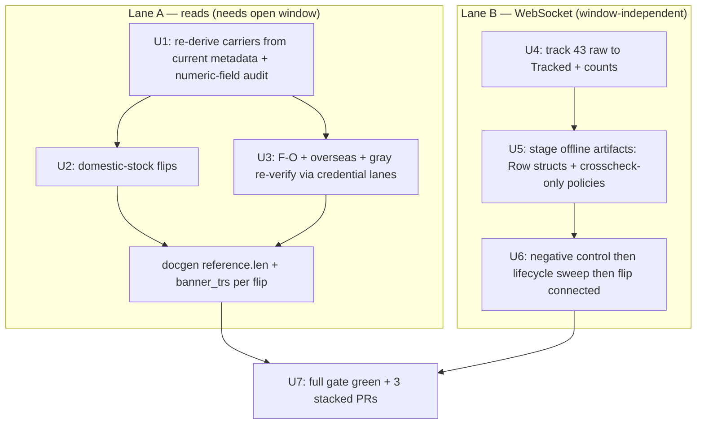

# Open-Window TR Flip Wave — Read Carriers + WS Track-All - Plan

## Goal Capsule

- **Objective:** While KRX is in-session, advance two TR lanes. Lane A flips the probe-proven read carriers Tracked→Implemented on in-session typed paper smokes. Lane B tracks all 43 remaining offline-trackable WebSocket channels raw→Tracked and flips every channel that connects to Implemented.
- **Product authority:** Repo owner (sunkeunchoi). Wave shape pinned in dialogue: read carriers + gray re-verify + track-all-43 WS, run live and autonomous this session.
- **Run model:** autonomous, live in-session. The read-lane smokes hit the real LS paper gateway (`LS_TRADING_ENV=paper`, creds in `.env`) and only pass while the market is open — the open window is the binding constraint. Read-only paper inquiries; no orders.
- **Open blockers:** none. The carrier set is re-derived from current metadata at execution time (intervening waves already flipped ~10 originally-teed-up carriers — see R2).
- **Product Contract preservation:** Product Contract unchanged — all R-IDs, Acceptance Examples, and scope carried verbatim from the requirements-only artifact (the four `ce-doc-review` edits were applied before enrichment).
- **Authority hierarchy:** the frozen recipes (`.agents/skills/implement-tr/SKILL.md`, `.agents/skills/track-realtime-tr/SKILL.md`, `.agents/skills/implement-realtime-tr/SKILL.md`) and the normalized baselines are authoritative over this plan for mechanical steps and wire shapes; this plan is authoritative over scope and sequencing; the repo owner is authoritative over both.
- **Execution profile:** autonomous, live in-session. Two decoupled lanes shipped as three stacked PRs (KTD7). The gate (`make docs` · `cargo test` · `cargo test -p ls-core` · `make docs-check`) stays green at every commit.
- **Stop conditions:** stop and surface to the owner if (a) a baseline self-diff is dirty (a pre-existing baseline modified, not just new files), (b) the WS negative control returns OBSERVABLE rejection (overturns the connection-reachable-only premise — KTD4), or (c) a flip would require a `recommendation` block (Recommended is out of scope).
- **Tail ownership:** the implementer runs `make docs` + gate, authors smoke-map rows and Makefile `.PHONY` targets, and opens the three PRs.

## Product Contract

### Summary

Run a two-lane TR flip wave live while KRX is open. Lane A re-derives the still-`implemented:false` read carriers from current metadata, intersects them with the 2026-06-29 in-session probe table, and flips each to Implemented on a typed smoke asserting a named witness — including re-verification of the gray cases. Lane B tracks all 43 remaining offline-trackable WS channels to Tracked, stages offline flip artifacts, runs the live lifecycle sweep, and flips every channel that connects. The gate stays green at every commit.

### Problem Frame

Most prior flip waves ran under KRX closure, where session-dependent reads return empty `00707` and cannot be flipped. PR #67 (merged 2026-06-29) raw-probed all 69 tracked-only reads *in-session* and found 44 data-carriers — far more than the closure era yielded — but only dispositioned them, teeing the flips up as follow-up PRs. Those flips are only achievable while the market is open: the typed smoke that witnesses a real field passes only when the gateway is serving live data. This wave executes that teed-up work inside the open window, and clears the remaining WS pool (which is connection-reachable-only and rides along).

### Requirements

**Lane A — read carriers (Tracked→Implemented)**

- R1. Flip the clean read carriers (probe `rsp_cd 00000`, body > 500B) that are still `implemented: false` to Implemented, each via the `implement-tr` recipe: request/response structs, facade handle, REST `{TR}_POLICY`, offline wiremock tests, and one in-session typed paper smoke. The clean target is ~26 reads — ≈23 domestic stock (including `t1716`, owner_class `stock` per the probe table), 2 F/O (`t2541`, `t8427`), and `o3127` (overseas, 5237B). The 44 in-session carriers in the probe table reconcile as: ~26 clean still-`implemented:false` (this requirement) + ~10 already flipped by intervening waves (R2) + ~7 gray re-verifies (R3) + 2 account carriers that stay PENDING (Scope Boundaries).
- R2. Derive the carrier set from **current** metadata, not the worklist table. The worklist's teed-up list is partly stale — verified-Implemented since it was written: `t1308`, `t1411`, `t1449`, `t1488`, `t1621`, `t1638`, `t1906`, `t1959`, `t8407`, `t8450`. Intersect "`tracked && !implemented` reads" with the probe table's carriers; flip only the intersection.
- R3. Re-verify each gray carrier on a real witness before flipping, never on body length alone: small-body F/O `t2210`/`t2214`/`t2424`/`t8428`, and prev-`paper_incompatible` `t8455`/`t8463`/`g3190`. Flip only those that return a named non-sentinel field; leave the rest Tracked-only.
- R4. When a gray carrier flips, retract its `paper_incompatible: true` flag in the same change (`t8455`, `t8463`, `g3190` currently carry it). Note the basis (carries in-session data; was dead under closure).
- R5. Each smoke witness is a named, non-sentinel, non-account-identifying field per KTD2. Numeric request-body slots serialize as JSON numbers (`string_as_number`) or the gateway returns `IGW40011` (KTD5).

**Lane B — WebSocket channels (raw→Tracked→Implemented)**

- R6. Track all 43 remaining offline-trackable WS channels raw→Tracked via `track-realtime-tr`: `AFR B7_ C02 CD0 DBM DBT DC0 DD0 DH0 DH1 DHA DK3 DS3 DVI ESN FX9 H02 H2_ HB_ I5_ JX0 NBM NPM NVI O02 OX0 SHC SHD SHI SHO UBM UBT UK1 UVI UYS YC3 YJC YJ_ Ys3 h3_ k1_ s2_ s3_`. Author each `metadata/trs/<code>.yaml` + `tr-index.yaml` entry; project baselines via `make api-drift-renormalize`.
- R7. Stage the offline flip artifacts for all 43 (mirroring the prior WS wave): one `<Code>Row` struct + offline decode test per channel in `crates/ls-sdk/src/realtime/frame.rs`, and a `{TR}_POLICY` registered **crosscheck-only** (never the REST-only `slice_rest_policies_are_non_order_rest` list).
- R8. Run the live WS lifecycle sweep and flip every channel whose connect→subscribe→unsubscribe succeeds to Implemented (connection-reachable-only — KTD6 NOT-OBSERVABLE applies). A channel whose lifecycle cannot open stays Tracked-only (PENDING).
- R9. The 10 empty-`res_example` WS channels stay HELD (no deserializable baseline offline): `DX0 DYC NPH NYS PM_ S4_ UPH UPM h2_ s4_`.

**Cross-lane**

- R10. Every flip keeps `recommended: false` with no `recommendation` block — Recommended promotion is out of scope.
- R11. Bump count-sites by what actually flips: Tracked→Implemented moves docgen `reference.len` (currently 213) and `banner_trs`. Tracking the 43 WS channels moves `maintained_tr_count`, docgen `TRACKED_TRS`, and the 4 `cli.rs` count literals; the subsequent WS flips then also move `reference.len`/`banner_trs`. Leave `maintained_tr_count`/`TRACKED_TRS` unchanged for the read flips (already Tracked).
- R12. The gate stays green at every commit: `make docs`, `cargo test`, `cargo test -p ls-core`, `make docs-check`.

### Key conventions referenced

These shorthand labels recur below and are established by the frozen recipes and prior plan -004; defined here so the doc reads standalone.

- KTD1 — WebSocket `{TR}_POLICY` consts register in the crosscheck list only, never the REST-only `slice_rest_policies_are_non_order_rest` list; offline flip artifacts (structs, decode tests, policies) are pre-stageable before the live smoke.
- KTD2 — a smoke witness is a named, non-sentinel field that reveals no account information: never an account number, name, owner, or holding identifier, **and never an account-state value** (balance, deposit, available cash, position quantity), since a witness literal in committed test source is covered by neither the dispatch-log suppressor nor the `rsp_msg` drop. For account reads, witness on an instrument symbol, market price, business/legal code, or date.
- KTD5 — numeric request-body slots serialize as JSON numbers (`#[serde(serialize_with = "ls_core::string_as_number")]`) or the gateway returns `IGW40011`.
- KTD6 — the WS gateway never signals subscription rejection, so a WS flip is "connection-reachable-only": a clean connect→subscribe→unsubscribe is the bar, not per-channel data proof.
- KTD7 — the two lanes are decoupled and ship as separate stacked PRs (reads / WS).

### Acceptance Examples

- AE1. Covers R1, R5. Given `t1771` is `implemented: false` and the in-session smoke returns a populated row, when the typed smoke asserts its named witness field non-empty, then `t1771` flips to `implemented: true` and `reference.len`/`banner_trs` increment by one.
- AE2. Covers R3, R4. Given `t8455` currently has `paper_incompatible: true` and the in-session re-probe returns a named witness (was 1498B), when the typed smoke passes, then `t8455` flips to `implemented: true` and its `paper_incompatible` flag is retracted in the same change. Given instead the re-probe returns only sentinel/all-default fields, then `t8455` stays Tracked-only and keeps its flag.
- AE3. Covers R8. Given WS channel `JX0` is tracked with staged offline artifacts, when its lifecycle sweep connects→subscribes→unsubscribes cleanly, then it flips to `implemented: true` (connection-reachable-only); if the lifecycle cannot open, it stays Tracked-only.
- AE4. Covers R3. Given gray carrier `t8428` probed at 421B, when re-verification finds no named non-sentinel witness, then it is NOT flipped and remains Tracked-only — body length alone never justifies a flip.

### Scope Boundaries

- Account no-data carriers stay PENDING (not flipped): `CSPBQ00200` (`00136` success-no-data), `t0441` (all-default).
- Session/funding-empty reads stay PENDING (already Tracked-not-Implemented): `o3107 t1950 t1951 t1954 t1956 t1969 t1971 t1972 t1973 t1974 t2106 t2212 t2407 t2545 t8404 t8406 t8460`.
- `paper_incompatible` re-confirmed, flag stands: `CCENQ10100`/`CCENQ90200` (`01900`); overseas-stock `g3101/g3102/g3103/g3104/g3106` (no paper feed).
- The 10 empty-`res_example` WS channels stay HELD (R9).
- Recommended promotion is out of scope for every TR (R10).

### Dependencies / Assumptions

- KRX must be in-session for Lane A smokes. Flips land per-TR independently; if the window closes mid-wave, the reads already flipped stay landed and the unflipped remainder stays Tracked-only PENDING and resumes in the next open window — no rollback. Do not begin Lane A within the session's closing buffer (too little runway to complete the gray re-verifies). Lane B (WS) is unaffected by closure and can proceed either way.
- `make` breaks inside spawned/eval shells (RTK hook + minimal PATH). Run the probe/smoke via cargo directly after `set -a; . ./.env` — e.g. `cargo test -p ls-sdk --test live_smoke -- --ignored --exact --nocapture raw_http_probe`.
- Wire field names, types, and array-vs-single shapes come from the normalized baseline (`crates/ls-trackers/baselines/api-drift/normalized/trs/<tr>.json`), not guesswork.
- The raw untracked **read** pool is exhausted (all 143 raw codes already dispositioned); "more Tracked" applies to the 43 WS channels only.

### Outstanding Questions

Deferred to planning:

- PR slicing within Lane A — ~26 read flips may warrant splitting into 2 batches by sub-lane (domestic stock / F-O+overseas) rather than one large PR. Lane B is its own PR (KTD7 stacked-PR pattern).
- Whether `o3127`/`g3190` need an overseas-account lane context to smoke cleanly (probe was clean for `o3127`; `g3190` is a gray re-verify).

### Sources / Research

- `docs/plans/notes/2026-06-28-closure-flip-ws-reads-worklists.md` — the 2026-06-29 in-session probe disposition table (lines 140-228) and the 43 deferred + 10 HELD WS lists (lines 64-69).
- `docs/plans/2026-06-28-004-feat-closure-flip-ws-batch-reads-sweep-plan.md` — the prior wave that probed and teed these up.
- `.agents/skills/implement-tr/SKILL.md`, `.agents/skills/track-realtime-tr/SKILL.md`, `.agents/skills/implement-realtime-tr/SKILL.md` — frozen recipes; authoritative over this plan for mechanical steps.
- Current-state verification (2026-06-29): `reference.len() == 213` (`crates/ls-docgen/src/lib.rs:1277`); 11 metadata files carry `paper_incompatible: true`; `t8455`/`t8463`/`g3190` carry the flag (`metadata/trs/<tr>.yaml:11`).
- Registration sites (research): REST structs in `crates/ls-sdk/src/{market_session,paginated,account}/`; `{TR}_POLICY` in `crates/ls-core/src/endpoint_policy.rs`; REST policy registers in BOTH `policies` array (`crates/ls-core/tests/policy_index_crosscheck.rs`) AND `slice_rest_policies_are_non_order_rest` (`crates/ls-core/src/endpoint_policy.rs`); WS Row structs in `crates/ls-sdk/src/realtime/frame.rs` (+ re-export `realtime/mod.rs`), WS policy in the crosscheck `policies` array ONLY; smokes in `crates/ls-sdk/tests/live_smoke.rs`. Exemplars: `T1102` (`crates/ls-sdk/src/market_session/mod.rs`), `T8412` (`crates/ls-sdk/src/paginated/chart.rs`).
- Solution learnings: `docs/solutions/conventions/implement-tr-registration-sites.md`, `.../ls-account-token-bound-credential-lanes.md`, `.../stale-smoke-symbol-masks-provisioned-feed.md`, `.../paper-unavailable-disposition-terminals.md`, `.../market-hours-read-empty-result-disposition.md`, `.../realtime-flip-artifacts-stageable-before-metadata-flip.md`, `docs/solutions/architecture-patterns/connection-reachable-only-websocket-flips.md`, `docs/solutions/integration-issues/ls-gateway-igw40011-numeric-request-fields.md`.

---

## Planning Contract

### Key Technical Decisions

- KTD1 — Witness gate. A read flips only when its in-session typed smoke asserts a **named, non-sentinel** field that is non-account-identifying **and** non-account-state (per KTD2 in the Product Contract). The witness is a substantive market-data field (price, volume, quantity, instrument symbol/name, date) — never a status/echo/count field (`rsp_cd`, `RecCnt`, `gubun`) — and must be non-default for a liquid instrument in-session (a zero price/volume on a liquid name in-window is a data failure, not a flip). Body length is never the witness — a large body can deserialize to an empty/all-default array (e.g., night masters). Empty in-window → PENDING; empty off-window is not a valid attempt (`market-hours-read-empty-result-disposition`).
- KTD2 — Numeric request fields. Audit each carrier's normalized baseline (`crates/ls-trackers/baselines/api-drift/normalized/trs/<tr>.json`); any numeric request slot (`idx`, `cnt`, rates, cursors) uses `#[serde(serialize_with = "ls_core::string_as_number")]` or the gateway returns `IGW40011`. A persistent `IGW40011` across input forms is a wire-type defect, not environmental — diagnose by A/B-ing the body with `make raw-probe` (credential-safe).
- KTD3 — Credential-lane routing. F/O carriers route to `.env.domestic_option`, overseas to `.env.overseas_option` (`ls-account-token-bound-credential-lanes`); a `00707`/all-default/`IGW40013` under the wrong lane is not "no data." For F/O and overseas reads, refresh the symbol to the current front-month from the live master before recording empty (`stale-smoke-symbol-masks-provisioned-feed`). A carrier that needs a lane the `.env` lacks stays Tracked-only PENDING — it never blocks the wave.
- KTD4 — WS connection-reachable-only. Run the negative control (`make live-smoke-ws-negative`, invalid `tr_cd`) **before** the sweep to confirm the rejection-observability class. The established result is NOT-OBSERVABLE, so a clean connect→subscribe→unsubscribe is the bar and metadata records "connection-reachable-only," never per-channel data proof. If the control returns OBSERVABLE, stop and surface (stop condition b).
- KTD5 — WS artifacts stage offline. Author the Row struct + decode test + crosscheck-only `{TR}_POLICY` while metadata stays `implemented: false` — the gate stays green (`realtime-flip-artifacts-stageable-before-metadata-flip`). Policy-const naming: trailing-underscore codes append `POLICY` (`BM_`→`BM_POLICY`); others get `_POLICY` (`NS3`→`NS3_POLICY`). WS policy registers in the crosscheck `policies` array only — never the REST `slice_rest_policies_are_non_order_rest` list.
- KTD6 — Count-site contract. A read flip (already Tracked) moves docgen `reference.len` + `banner_trs` only. Tracking the 43 WS channels moves `maintained_tr_count` (`crates/ls-trackers/tests/api_drift.rs`), `TRACKED_TRS` (`crates/ls-docgen/src/lib.rs`), and the 4 `cli.rs` literals (`crates/ls-trackers/src/cli.rs`); the later WS flips then move docgen `reference.len` + `banner_trs`. Do not `cargo fmt` the `ls-trackers` crate. Before any read flip, grep `crates/ls-trackers/tests/{classify,api_drift}.rs` for the TR code used as a tracked-only exemplar and repoint it to a durably-tracked TR (the "exemplar trap").
- KTD7 — Lane independence + PR slicing. Flips land per-TR independently; if KRX closes mid-wave the landed flips stay and the remainder stays Tracked-only PENDING (no rollback). Ships as three stacked PRs: domestic-stock reads / F-O+overseas reads / WS lane.

### High-Level Technical Design

### Sequencing

U1 gates Lane A (U2, U3). U4 → U5 → U6 is the Lane B chain. The two lanes are independent and parallelizable. WS work (U4–U6) does not need the open window and can run regardless of session state; reads (U2, U3) must run in-session. U7 opens **three independent PRs**, each gated on its own lane's completion (domestic reads after U2, F-O+overseas after U3, WS after U6) — a stall in one lane never blocks another's PR. To keep docgen count assertions consistent, land the PRs in a fixed order (domestic reads → F-O+overseas → WS) and re-run the full gate on the integration branch after all three land.

---

## Implementation Units

### U1. Re-derive the read carrier set and audit numeric request fields

- **Goal:** Produce the authoritative still-`implemented:false` carrier list and a per-carrier numeric-field map before any flip, so Lane A targets the real intersection (R2) and avoids `IGW40011` (KTD2).
- **Requirements:** R2, R5.
- **Dependencies:** none.
- **Files:** read-only — `metadata/trs/*.yaml`, `crates/ls-trackers/baselines/api-drift/normalized/trs/<tr>.json`; worksheet appended to `docs/plans/notes/2026-06-28-closure-flip-ws-reads-worklists.md`.
- **Approach:** Intersect `tracked && !implemented` reads with the probe table's carriers; confirm each of the ~26 clean + ~7 gray candidates is still `implemented:false` (≈10 already flipped) and record the explicit excluded-already-flipped list. For each carrier capture: `owner_class` (routes its struct to `market_session/` vs `paginated/` vs `account/`), `instrument_domain` + credential lane (KTD3), numeric request slots needing `string_as_number`, and the intended witness field from the baseline (KTD1). Also do three pre-flight checks once, up front: (a) grep `crates/ls-trackers/tests/{classify,api_drift}.rs` for any flip-set code used as a tracked-only exemplar and record a durable replacement (a carrier staying PENDING per Scope Boundaries) — the "exemplar trap"; (b) confirm the credential-lane files the carriers need (`.env.domestic_option`, `.env.overseas_option`) exist — carriers whose lane is absent are marked PENDING up front, not attempted; (c) for Lane B, precompute the 43 policy-const names per the KTD5 trailing-underscore rule. A numeric-field defect found here is surfaced (not silently fixed) and resolved during the carrier's flip, confirmed via `make raw-probe` A/B (KTD2).
- **Test scenarios:** Test expectation: none — analysis/worksheet unit, no behavioral change.
- **Verification:** A worksheet lists every carrier with current implemented-state, owner_class, instrument_domain, credential lane, numeric-field flags, intended witness field; the already-flipped ~10 are listed and excluded; the exemplar-repoint map, missing-lane PENDING list, and the 43 computed policy names are recorded.

### U2. Flip domestic-stock read carriers to Implemented

- **Goal:** Flip the ~23 clean domestic-stock carriers Tracked→Implemented via the `implement-tr` recipe.
- **Requirements:** R1, R5, R10, R11.
- **Dependencies:** U1.
- **Files:** `crates/ls-sdk/src/market_session/mod.rs` or `crates/ls-sdk/src/paginated/<module>.rs` (per owner_class); `crates/ls-core/src/endpoint_policy.rs` (`{TR}_POLICY` + `slice_rest_policies_are_non_order_rest`); `crates/ls-core/tests/policy_index_crosscheck.rs` (`policies` array + `use`); `crates/ls-sdk/tests/live_smoke.rs`; `crates/ls-docgen/src/lib.rs` (`reference.len`, `banner_trs`); `Makefile`; `.agents/skills/promote-tr/references/smoke-map.md`. Carriers: `t1109 t1301 t1471 t1475 t1486 t1602 t1603 t1617 t1631 t1632 t1633 t1637 t1665 t1702 t1716 t1717 t1752 t1771 t1902 t1904 t1927 t1941 t8454`.
- **Approach:** Per carrier — model request/response structs from the normalized baseline (array-vs-single shape from the out-block key), apply `string_as_number` to numeric request slots (KTD2), add the facade handle, register the policy in both REST crosscheck lists, write an offline wiremock deserialize test, and an in-session typed smoke asserting a named witness (KTD1). Repoint any tracked-only test exemplar pinned to a flipping code first (KTD6). Bump `reference.len`/`banner_trs` per flip; add smoke-map row (`implemented-only`) and `.PHONY` target.
- **Patterns to follow:** `T1102` (`crates/ls-sdk/src/market_session/mod.rs`) for non-paginated; `T8412` (`crates/ls-sdk/src/paginated/chart.rs`) for paginated.
- **Test scenarios:**
  - Happy path: offline wiremock fixture (real captured shape) deserializes into the typed response with the witness field populated.
  - Witness: in-session smoke asserts the named non-sentinel field non-empty before recording the flip. `Covers AE1.`
  - Edge: a paginated carrier deserializes a multi-row out-block (non-empty `Vec`), and an empty in-window response routes to PENDING (not flipped).
  - Error: numeric request field serialized as a JSON number — A/B raw-probe confirms no `IGW40011`.
- **Verification:** each flipped TR is `implemented: true` (`recommended: false`); its smoke witnesses a real field; `make docs` + gate green; docgen counts match the flip count.

### U3. Flip F-O + overseas read carriers; re-verify gray cases via credential lanes

- **Goal:** Flip the clean F-O/overseas carriers and re-verify the gray cases on a real witness, routing each through its instrument-domain credential lane; retract `paper_incompatible` on any gray that flips.
- **Requirements:** R1, R3, R4, R5, R10, R11.
- **Dependencies:** U1.
- **Files:** as U2 (structs under `market_session/`/`paginated/` per owner_class); plus `metadata/trs/{t8455,t8463,g3190}.yaml` (retract `paper_incompatible` on flip). Clean: `t2541 t8427 o3127`. Gray (verify witness): `t2210 t2214 t2424 t8428 t8455 t8463 g3190`.
- **Approach:** Route F-O smokes to `.env.domestic_option`, overseas to `.env.overseas_option` (KTD3); refresh F-O/overseas symbols to the current front-month before recording empty. For each gray carrier, re-probe in-session: flip only on a named non-sentinel witness (KTD1) — and when it flips, retract `paper_incompatible` in the same change (R4). Grays with no witness, or carriers needing an unavailable lane, stay Tracked-only PENDING.
- **Patterns to follow:** U2 mechanics; `paper-unavailable-disposition-terminals` for the `01900` vs `00707` vs `00136` classification.
- **Test scenarios:**
  - Happy path: `o3127` smoke (overseas lane, current front-month) witnesses a market-data field and flips. `Covers AE1.`
  - Gray flip: `t8455` re-probe under the F-O lane returns a named witness → flips and retracts `paper_incompatible`. `Covers AE2.`
  - Gray hold: `t8428` returns only sentinel/all-default fields → NOT flipped, stays Tracked-only, flag (if any) stands. `Covers AE4.`
  - Edge: a carrier returning `01900` is left `paper_incompatible` (re-confirmed), not flipped.
- **Verification:** flipped F-O/overseas carriers are `implemented: true` on a witnessed smoke; retracted flags only on flipped grays; held carriers remain Tracked-only; gate green.

### U4. Track all 43 WebSocket channels raw→Tracked

- **Goal:** Bring the 43 offline-trackable WS channels to Tracked via `track-realtime-tr` (R6).
- **Requirements:** R6, R9, R11.
- **Dependencies:** none.
- **Files:** `metadata/trs/<code>.yaml` ×43; `metadata/tr-index.yaml`; baselines via `make api-drift-renormalize`; count sites `crates/ls-trackers/tests/api_drift.rs` (`maintained_tr_count`), `crates/ls-docgen/src/lib.rs` (`TRACKED_TRS`), `crates/ls-trackers/src/cli.rs` (4 literals). Codes: `AFR B7_ C02 CD0 DBM DBT DC0 DD0 DH0 DH1 DHA DK3 DS3 DVI ESN FX9 H02 H2_ HB_ I5_ JX0 NBM NPM NVI O02 OX0 SHC SHD SHI SHO UBM UBT UK1 UVI UYS YC3 YJC YJ_ Ys3 h3_ k1_ s2_ s3_`.
- **Approach:** Author each metadata file + tr-index entry (`owner_class: realtime`, `protocol: websocket`, venue_session, tr_key slot) from the raw capture; project baselines with `make api-drift-renormalize` (never hand-author). Keep the 10 empty-`res_example` channels HELD (R9), not in this set. Bump the three tracked-rung count families by 43; leave manifest `refreshed` at the last raw-refresh date; do not `cargo fmt` `ls-trackers` (KTD6).
- **Test scenarios:** Test expectation: none for behavior — covered by `cargo test -p ls-core` metadata validation + policy crosscheck and the count-assertion tests; verify the baseline self-diff is clean (only new files).
- **Verification:** `cargo test -p ls-core` passes; the four tracked-rung counts reflect +43; baseline self-diff clean; gate green.

### U5. Stage offline WS flip artifacts for all 43

- **Goal:** Author the offline half of the realtime flip — Row structs, decode tests, and crosscheck-only policies — while metadata stays Tracked (KTD5).
- **Requirements:** R7, R11.
- **Dependencies:** U4.
- **Files:** `crates/ls-sdk/src/realtime/frame.rs` (one `<Code>Row` struct + decode test each); `crates/ls-sdk/src/realtime/mod.rs` (re-export); `crates/ls-core/src/endpoint_policy.rs` (`{TR}_POLICY` ×43); `crates/ls-core/tests/policy_index_crosscheck.rs` (`policies` array + `use` import).
- **Approach:** Model each Row from the channel's `res_example` (plain `String` + `ls_core::string_or_number` + `#[serde(default)]`; omit secret-shaped fields). Register each policy crosscheck-only (KTD5) — both the `policies` array and the `use` import; never the REST list. Apply the trailing-underscore naming rule. Do not bump `reference.len`/`banner_trs` yet (Implemented-rung surfaces — U6).
- **Test scenarios:**
  - Happy path: each `<Code>Row` decodes its `res_example` fixture via `subscribe_typed::<Row>` offline.
  - Edge: a numeric-bearing field deserializes from both a JSON number and a quoted string (`string_or_number`).
- **Verification:** offline decode tests pass for all 43; `cargo test -p ls-core` crosscheck passes with the new policies; gate green with metadata still `implemented: false`.

### U6. Negative control, lifecycle sweep, and flip connected WS channels

- **Goal:** Confirm the rejection-observability class, then flip every channel with a clean lifecycle to Implemented (connection-reachable-only).
- **Requirements:** R8, R10, R11.
- **Dependencies:** U5.
- **Files:** `crates/ls-sdk/tests/live_smoke.rs` (sweep + negative control); `metadata/trs/<code>.yaml` (flip `implemented: true`); `crates/ls-docgen/src/lib.rs` (`reference.len`, `banner_trs`); `.agents/skills/promote-tr/references/smoke-map.md`; `Makefile`.
- **Approach:** Run `make live-smoke-ws-negative` first (KTD4) and save the observability class. If OBSERVABLE, **stop**: flip no channel, leave all 43 Tracked-only, and escalate (stop condition b) — the connection-reachable-only premise is invalidated and a per-channel data-proof gate is deferred design work. If NOT-OBSERVABLE (expected), run the lifecycle sweep across all 43 on a fresh `WsManager` each; collect a per-channel pass/fail mask; flip channels with a clean connect→subscribe→unsubscribe to `implemented: true` (`recommended: false`, note "connection-reachable-only"). A channel that cannot open stays Tracked-only PENDING. Bump `reference.len`/`banner_trs` by the **actual** flipped count (the count of passing channels, not the 43 target); set smoke-map Promotion to `implemented-only` per flipped channel.
- **Test scenarios:**
  - Happy path: the sweep reports a clean lifecycle for a channel (e.g., `JX0`) → it flips. `Covers AE3.`
  - Negative control: an invalid `tr_cd` subscription is classified; the run records the observability class.
  - Edge: a channel whose lifecycle cannot open stays Tracked-only (not flipped). `Covers AE3.`
- **Verification:** negative control classified and recorded; flipped channels are `implemented: true`; docgen counts match the flipped count; gate green.

### U7. Close-out: full gate and stacked PRs

- **Goal:** Land the wave as three stacked PRs with a green gate throughout (R12, KTD7).
- **Requirements:** R12.
- **Dependencies:** U2, U3, U6.
- **Files:** none beyond regenerated `docs/`.
- **Approach:** Run `make docs` then the full gate (`cargo test`, `cargo test -p ls-core`, `make docs-check`) at each commit. Open three independent PRs landed in fixed order: (1) domestic-stock reads (U2), (2) F-O+overseas reads (U3), (3) WS lane (U4–U6); re-run the full gate on the integration branch after all three land to confirm cross-lane count consistency. Confirm no abandoned/experimental artifacts remain in the diff.
- **Test scenarios:** Test expectation: none — gate-and-ship unit; the gate commands are the verification.
- **Verification:** all four gate commands green on each PR; `docs-check` confirms generated docs match committed; counts consistent across docgen and ls-trackers.

---

## Verification Contract

- **Gate (every commit):** `make docs` · `cargo test` · `cargo test -p ls-core` (metadata validation + policy index crosscheck) · `make docs-check`. Never commit on a red gate.
- **Per read flip (U2/U3):** offline wiremock deserialize test passes; in-session typed smoke asserts a named non-sentinel, non-account-identifying/non-account-state witness (KTD1); numeric request fields confirmed serialized as JSON numbers (no `IGW40011`).
- **WS lane (U4–U6):** `cargo test -p ls-core` crosscheck + count assertions pass at Tracked; offline decode tests pass for all 43; negative control classified before the sweep; live sweep lifecycle clean for each flipped channel.
- **Count consistency:** docgen `reference.len`/`banner_trs` match total flips; `maintained_tr_count`/`TRACKED_TRS`/4 `cli.rs` literals match +43 tracked; baseline self-diff clean (only new files).
- **Credential safety:** no account number/name/owner/holding-id and no account-state value appears in committed smoke source or fixtures (KTD1/KTD2). Before committing any new offline fixture or smoke source, scrub it with the existing `scrub_secrets` support helper and grep for account patterns (6+ consecutive digits, balance/deposit/position field names); escalate any match rather than committing.

---

## Definition of Done

- The ~26 clean read carriers that re-derive as still-`implemented:false` and witness a real field in-session are `implemented: true` (`recommended: false`); empties stay Tracked-only PENDING.
- Gray carriers are re-verified on a witness: those that pass flip and retract `paper_incompatible` (`t8455`/`t8463`/`g3190` if witnessed); those that don't stay Tracked-only with flags intact.
- All 43 WS channels are Tracked with staged offline artifacts; every channel with a clean lifecycle is `implemented: true` (connection-reachable-only); non-opening channels stay Tracked-only; the 10 empty-`res_example` channels remain HELD.
- Account no-data carriers (`CSPBQ00200`, `t0441`) and session/funding-empty reads stay PENDING; `CCENQ10100`/`CCENQ90200` and `g31xx` keep `paper_incompatible`.
- Count sites consistent; full gate green on all three stacked PRs; `docs-check` clean.
- No abandoned-attempt or experimental code left in the diff.
