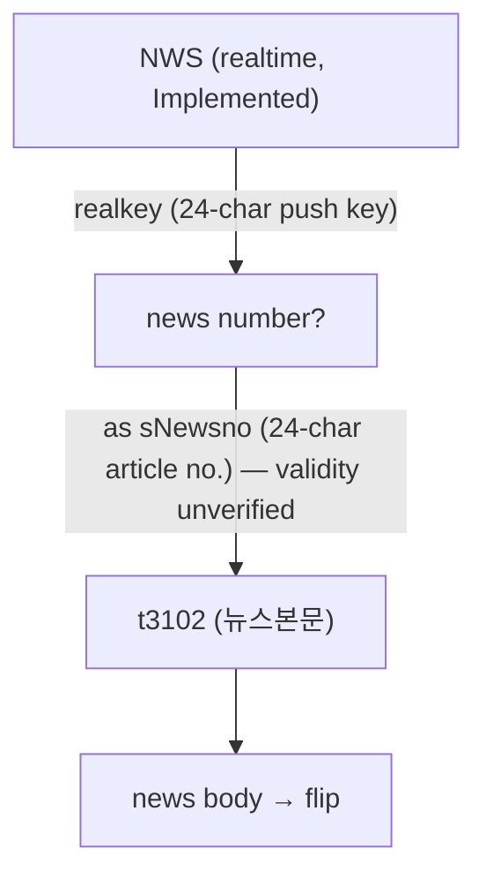
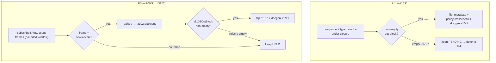

# KRX-Closed PENDING Salvage + t3102 Unblock - Plan

## Goal Capsule

- **Objective:** Capture the durable closed-window output — a documented pool-exhaustion record and the confirmed `NWS → t3102` feeder plus its ledger-reason update — and take two opportunistic flips (`t1631`, `t3102`) only where closure permits. Defer the session-gated PENDING re-probes to an open-window follow-up.
- **Product authority:** Repository owner (`sunkeunchoi`).
- **Execution profile:** Small, bounded wave under KRX closure. Two deterministic deliverables (ledger update, exhaustion record) plus two conditional flips gated on live re-probes. Each flip independently lands the full gate.
- **Stop conditions:** Surface a blocker rather than guessing if (a) `t1631` returns a gateway error other than empty `00707`, (b) the `NWS` paper feed cannot be subscribed at all, or (c) a flip would move the maintained-shape counts (it must not — flips move only docgen `reference.len`/`banner_trs`).
- **Open blockers:** None blocking planning. `t3102`'s flip is gated on a live `NWS` news event landing during the run — opportunistic, not guaranteed.

---

## Product Contract

**Product Contract preservation:** unchanged. Planning introduced no product-scope changes; R1–R7 carry forward verbatim from the ce-brainstorm + ce-doc-review pass.

### Summary

Under closure the durable output of this wave is twofold: (1) a documented pool-exhaustion record so future waves stop re-litigating the dead buckets, and (2) confirmation of the `NWS realkey → t3102.sNewsno` feeder plus the one-line ledger-reason update it enables. Two opportunistic flips ride along where closure allows: `t1631` (verify its actual status and flip if it carries — there is no serialize defect to fix) and `t3102` (only if a live `NWS` news event lands and its key is accepted). The session-gated PENDING re-probes, including the chart reads, are deferred to an open-window follow-up where they can actually carry.

### Problem Frame

The repo is at 307 Tracked / 278 Implemented / 0 raw remaining — the raw pool that fed every prior flip wave is exhausted. The 29 unflipped TRs are all dispositioned: 12 are paper_incompatible (never flip on paper), 4 are HELD on structural/input blockers, and 13 are PENDING (empty-board, session-gated, off-window, or input-unresolved). This is not the easy harvest the last several waves were, and under closure the PENDING bucket is the wrong thing to chase: it is dominated by session-gated reads that return empty `00707` while the market is shut. The genuinely closure-stable work is narrow — verifying `t1631`'s real status, the `NWS`-fed `t3102` ledger update, and writing the exhaustion record down. Naming this exhaustion explicitly is itself a deliverable: it keeps future waves from re-running known-empty sweeps.

### Key Decisions

- **Durable-deliverables-first, not flip-harvest.** Under closure the wave's value is the exhaustion record and the `NWS → t3102` ledger update, not a flip count. The two opportunistic flips are secondary and conditional.
- **`t1631` is not a serialize defect.** Its request block is all-String (`gubun`/`dgubun`/`sdate`/`edate`/`exchgubun`) — there is no numeric field to convert, so `string_as_number` cannot apply. Its recorded PENDING reason in the docgen banner is gateway-side `IGW40014` (not the `IGW40011` numeric-serialize class), so neither is a fixable request-shape defect. Its real status is unresolved: a 2026-06-28 probe recorded it as a data-carrier, while its facets (`venue_session: krx_regular`, `date_sensitive: true`) point to session-dependence. Verify which code (if any) recurs before flipping.
- **Defer session-gated re-probes to an open window.** Re-probing the PENDING chart/intraday reads under closure reproduces the empties the 2026-06-28 sweep already captured. They belong in an open-window follow-up, where they could carry.
- **The `NWS → t3102` chain is already documented.** `PROVISIONALITY-LEDGER §13` (the `t3102` HELD row, ledger line 628) and `crates/ls-sdk/src/market_session/mod.rs:7704–11538` already record that `NWS` is the sole producer of a news number. The remaining delta is a ledger-reason update, not a fresh documentation deliverable.

### Requirements

**Lane A — closed-window, session-independent**

- R1. Verify `t1631`'s actual status before any flip: re-probe it and confirm whether it carries a non-empty modeled out-block under closure (the 2026-06-28 probe suggests it may). Do not author a `string_as_number` fix — the request is all-String. Flip to Implemented only if it carries; otherwise record it as session-dependent and defer to the open-window follow-up.

**Lane B — t3102 unblock**

- R2. Update `t3102`'s ledger reason from "no REST source for the news number" to "feeder identified (`NWS`), awaiting a live news event," citing the existing `PROVISIONALITY-LEDGER §13` (t3102 row, ledger line 628) and `crates/ls-sdk/src/market_session/mod.rs:7704–11538` rather than re-authoring the chain.
- R3. Before committing the `t3102` flip attempt, pre-test that the paper `NWS` subscription emits any frame off-hours (a short subscribe-and-count). Only if it does, attempt the flip: capture a live `realkey`, pass it as `sNewsno`, and flip to Implemented only if `t3102` returns a real news body and the key is accepted as a valid `sNewsno`. If no frame or no news event lands, keep `t3102` HELD.

**Deferred to an open-window follow-up**

- R4. Re-probe the session-gated PENDING reads (including the chart/intraday reads such as `t1951`/`t1973`/`t2212`/`t2407`/`t8404`) in an open window, where they can carry; flip any that return a non-empty modeled out-block, asserting the substantive modeled field (never `body_len`) as witness. These reads carry Number/Object request fields (`cvolume`, `nmin`, `cnt`) that need `string_as_number` — a malformed-request `IGW40011` rejection must be distinguished from a genuine closure/empty result, not recorded as the latter.

**Cross-cutting**

- R5. Write the pool-exhaustion record: the raw pool is exhausted (0 remaining) and the 29 unflipped TRs are dispositioned (12 paper_incompatible, 4 HELD, 13 PENDING with reasons), so future waves do not re-run known-empty sweeps.
- R6. Every flip keeps the full gate green: docs regenerate (`make docs`), the workspace tests pass (`cargo test`), the `ls-core` metadata/policy crosscheck passes, and `make docs-check` is clean — including the docgen count bumps (`reference.len`, `banner_trs`) each flip implies.
- R7. No credential or account leakage in probe output or smoke witnesses: raw-probes print only `http` / `rsp_cd` / `body_len`, and any new live smoke uses the widened secret scrub.

### Acceptance Examples

- AE1. **Covers R1.** When `t1631` returns a non-empty modeled out-block under closure → flip to Implemented (no serialize fix involved). **When** it returns empty `00707` → record it as session-dependent and defer to the open-window follow-up.
- AE2. **Covers R3.** When the paper `NWS` subscription emits a news frame and `t3102` returns a real news body for the captured `realkey` → flip `t3102`. **When** no frame or no news event arrives, or `t3102` rejects the key → `t3102` stays HELD, with R2's ledger-reason update applied regardless.

### Scope Boundaries

- **Promotion (Implemented→Recommended)** — out. Re-attest smokes need an open window for session-gated TRs; wrong for this closed-window run.
- **Other HELD reads** — out. `t1852`/`t1856` need an unsourced ~27 KB `sFileData` blob; `t1860` is realtime-subscription control, not a read.
- **The 12 `paper_incompatible` reads** (`CCENQ10100`/`CCENQ90200`, `g3101`–`g3190`, `t8455`/`t8460`) — never flip on paper; not re-attempted.
- **`t1964`'s filter-enum sourcing** (KTD-1: no named source for the 10 underlying filter enums) — out.

#### Deferred to Follow-Up Work

- The R4 open-window re-probe lane is a separate follow-up, not active work in this plan. It runs when KRX is open and derives its exact target set from current metadata.

### Dependencies / Assumptions

- KRX market is closed for the run; paper gateway reached via the gitignored `.env` with `LS_TRADING_ENV=paper`.
- `NWS` is already Implemented (realtime/websocket); its `realkey` is a 24-char string and `t3102.sNewsno` is a 24-char string. The length match is **not** semantic validity — `realkey` is a push key (`키값`) and `sNewsno` is an article number (`뉴스번호`). Whether a paper `NWS` `realkey` is accepted by `t3102` end-to-end is unverified; R3's flip could fail after consuming the (rare) news event.
- News may or may not flow on `NWS` outside trading hours, and several paper feeds (night/overseas) carry no data at all — so the off-hours base rate may be ~zero. R3 pre-tests this before committing the flip attempt.
- The chart/intraday PENDING reads are session-dependent (empty `00707` under closure per the 2026-06-28 sweep); the prior closed-window chart-carrier precedent (`t1310`/`t1404`/`t1514`) is a different TR family and does not transfer to them. This is why R4 defers them to an open window rather than R1's closed-window lane.

The feeder chain Lane B depends on:

### Outstanding Questions

**Resolve before planning:** none — the lanes are determined.

**Deferred to planning (resolved here):**

- NWS subscription harness reuse → resolved: mirror the existing `ws_lifecycle` pattern in `crates/ls-sdk/tests/live_smoke.rs` using `subscribe_typed::<NwsRow>("NWS", …, WsLane::MarketData)`.

**Deferred to implementation:**

- The pre-test subscribe-and-count window length and the no-news timeout (R3) — pick a bounded value (tens of seconds), tunable.

### Deferred / Open Questions

#### From 2026-06-29 review

- The exact 13-member PENDING set is never enumerated; only ~7 are derivable from this document. Derive the live PENDING set from current `metadata/trs/*.yaml` (`implemented: false` minus paper_incompatible and HELD) before the open-window follow-up (R4) runs — do not hard-code a guessed list. (coherence, P2)

---

## Planning Contract

### Key Technical Decisions

- KTD1. **`t1631` flip is conditional on a carrying re-probe, not a code change.** Its baseline request block (`crates/ls-trackers/baselines/api-drift/normalized/trs/t1631.json`) is all-String, so `string_as_number` does not apply (`docs/solutions/integration-issues/ls-gateway-igw40011-numeric-request-fields.md`: only numeric cursor/count/index/price fields need it). The docgen banner records its PENDING reason as gateway-side `IGW40014`, not the `IGW40011` numeric class — so the flip turns on whether the read carries under closure, not on a request-shape fix. U1 re-probes and flips only if a modeled out-block returns non-empty; if a gateway code other than empty `00707` recurs, surface it as a blocker.
- KTD2. **The `t3102` flip witness is the REST out-block, not the WS leg.** The `NWS` subscribe is fire-and-forget (no ACK read), so the realtime leg is connection-reachable-only (`docs/solutions/architecture-patterns/connection-reachable-only-websocket-flips.md`, KTD6). The flip is justified only by `t3102`'s own REST response (`t3102OutBlock` non-empty for a real `realkey`); record the chain as "connection-reachable-only (chained NWS→t3102, fire-and-forget subscribe)."
- KTD3. **Implement-flip count-bump is narrow.** Each Tracked→Implemented flip independently moves only docgen `banner_trs` (+1) and `reference.len()` (+1) in `crates/ls-docgen/src/lib.rs` (currently 268 and 279), so the `reference.len()` end state is 279/280/281 for 0/1/2 flips landing this wave. The maintained-shape counts (`crates/ls-trackers/src/cli.rs`, `crates/ls-trackers/tests/api_drift.rs`, `TRACKED_TRS` — all at 307) do **not** move on a flip — touching them is a bug (`docs/solutions/conventions/implement-tr-registration-sites.md`).
- KTD4. **Run the exemplar-trap check before each flip.** Grep `crates/ls-trackers` and `crates/ls-docgen` for `t1631` / `t3102`; if either is a support-aware test's tracked-only exemplar, repoint that exemplar to a durably-tracked TR (e.g., a `paper_incompatible` one) so the flip doesn't break those tests.
- KTD5. **`t3102` and `t1631` are fully staged — flips are metadata + docgen only.** For both TRs the structs, facade (`news_body()` at `mod.rs:11538`; `program_trade_summary()` at `mod.rs:10880`), `{TR}_POLICY` (`endpoint_policy.rs`), and **both** crosscheck-list registrations already exist. So neither flip authors code: U3 adds only the chained smoke, and a landing flip for either TR touches only `metadata/trs/<tr>.yaml` (`implemented: true`), the docgen `banner_trs`/`reference.len` bump, regenerated docs, and (for t3102) the ledger reason. Verify each site is present; surface a blocker if any is missing rather than re-authoring.
- KTD6. **Probe credential-safe; witness on the modeled field.** Use `make raw-probe` (prints only `http`/`rsp_cd`/`body_len`) to A/B `t1631`'s wire shape, but gate any flip on a typed smoke asserting the substantive modeled field, never `body_len` (`docs/solutions/conventions/market-hours-read-empty-result-disposition.md`).

### High-Level Technical Design

The two opportunistic flips share a verify-then-flip-or-defer decision gate:

Prose is authoritative where the diagram and text differ.

### Sequencing

U2 (ledger update) and U1 (t1631) are independent and can land first. U3 (NWS→t3102) follows U2 so the ledger reflects the feeder before the flip attempt; a landing flip supersedes U2's reason with the implemented disposition. U4 (exhaustion record) lands last because it records U1's and U3's final dispositions.

---

## Implementation Units

### U1. Verify and conditionally flip t1631

- **Goal:** Establish `t1631`'s real status under closure and flip it to Implemented only if it carries a non-empty modeled out-block; otherwise record it session-dependent and defer to R4.
- **Requirements:** R1, R6, R7. **Covers AE1.**
- **Dependencies:** none.
- **Files:**
  - `crates/ls-sdk/tests/live_smoke.rs` — add `live_smoke_t1631` (typed smoke asserting a modeled `t1631OutBlock`/`t1631OutBlock1` field).
  - Verify-present (already authored — surface a blocker if any is missing, do not re-author): `T1631InBlock`/`Request`/`OutBlock`/`OutBlock1`/`Response` + facade `program_trade_summary()` in `crates/ls-sdk/src/market_session/mod.rs` (~10880), `T1631_POLICY` in `crates/ls-core/src/endpoint_policy.rs` (~388), and both crosscheck registrations (`crates/ls-core/tests/policy_index_crosscheck.rs`, `slice_rest_policies_are_non_order_rest()` at ~4897).
  - `crates/ls-sdk/tests/market_session_tests.rs` — confirm/extend offline struct-shape + `string_or_number` + empty-`00707` deserialize tests.
  - On a carrying flip only: `metadata/trs/t1631.yaml` (`support.implemented: true`), `crates/ls-docgen/src/lib.rs` (`banner_trs` +1, `reference.len()` +1), `docs/reference/t1631.md` (regenerated), `Makefile` (`.PHONY` + `live-smoke-t1631`), `.agents/skills/promote-tr/references/smoke-map.md` (row, `Promotion: implemented-only`).
- **Approach:** First grep current state — `t1631`'s structs, facade, policy, and crosscheck entries are already registered (Tracked-but-not-Implemented), so this is verify-and-flip, not build. Run `make raw-probe LS_PROBE_TR_CD=t1631 …` (credential-safe) to confirm the wire shape and which code (if any) recurs — empty `00707`, `IGW40014`, or a carrying response. Then run the typed smoke. If the modeled out-block returns non-empty, complete the flip (metadata + the narrow docgen count bump per KTD3). If it returns empty `00707`, do not flip — record it session-dependent and route to R4. If a different gateway code recurs, surface it as a blocker.
- **Execution note:** Re-probe before authoring any flip-side edit; the flip is conditional on the probe result.
- **Patterns to follow:** `T1102` market_session sibling; the recent multi-TR flip commit `671d91e` for the full site list.
- **Test scenarios:**
  - Offline: `t1631OutBlock` numeric fields deserialize via `string_or_number` (string input and number input).
  - Offline: empty result (`00707`) deserializes to an empty/default response without panic.
  - Offline: serialization round-trip of the all-String request block.
  - Covers AE1. Live smoke: a carrying response asserts a substantive modeled field non-empty (not `body_len`); an empty `00707` response is recorded as PENDING, not flipped.
- **Verification:** Either `t1631` is Implemented with the typed smoke asserting a real field and the gate green (docgen +1/+1, maintained counts unchanged), or it is recorded session-dependent and deferred to R4 with no metadata/docgen change.

### U2. Update t3102's ledger reason to feeder-identified

- **Goal:** Replace `t3102`'s "no REST source" HELD reason with "feeder identified (`NWS`), awaiting a live news event," citing the existing documentation.
- **Requirements:** R2, R6.
- **Dependencies:** none.
- **Files:** `metadata/PROVISIONALITY-LEDGER.md` (§13, the `t3102` block around lines 628 and 645–651).
- **Approach:** Rewrite the t3102 reason in place (resolve, don't stratify) to state that `NWS` is the identified feeder (`realkey` → `sNewsno`), cross-referencing `§628` and `crates/ls-sdk/src/market_session/mod.rs:7705`. Keep `t3102` `implemented: false`; this is a documentation-only change with no count movement. A landing U3 flip supersedes this text.
- **Patterns to follow:** existing §13 ledger entries and the facet-retirement process (ledger intro lines 23–31).
- **Test scenarios:** Test expectation: none — documentation-only ledger edit; covered by `make docs-check` and `cargo test -p ls-core` metadata validation.
- **Verification:** `make docs-check` clean and `cargo test -p ls-core` green with the updated reason; no count or metadata-shape change.

### U3. NWS emission pre-test + chained t3102 flip attempt

- **Goal:** Pre-test whether the paper `NWS` feed emits off-hours, and if so attempt the chained `NWS realkey → t3102.sNewsno` flip; flip `t3102` only on a non-empty REST out-block, else keep it HELD.
- **Requirements:** R3, R6, R7. **Covers AE2.**
- **Dependencies:** U2 (ledger reflects the feeder first).
- **Files:**
  - `crates/ls-sdk/tests/live_smoke.rs` — add `live_smoke_nws_t3102`: subscribe via `subscribe_typed::<NwsRow>("NWS", …, WsLane::MarketData)` (`crates/ls-sdk/src/realtime/mod.rs:289`), read a bounded number of `NwsRow` frames, extract `realkey` (`crates/ls-sdk/src/realtime/frame.rs:2117`), call `news_body()` with it, and assert the `t3102` out-block.
  - `Makefile` (`.PHONY` + `live-smoke-nws-t3102`), `.agents/skills/promote-tr/references/smoke-map.md` (row, `Promotion: implemented-only`).
  - On a landing flip only (`T3102_POLICY` and both crosscheck registrations already exist — do not re-add): `metadata/trs/t3102.yaml` (`support.implemented: true`), `crates/ls-docgen/src/lib.rs` (`banner_trs` +1, `reference.len()` +1), `docs/reference/t3102.md` (regenerated), and the §13 ledger reason updated to the implemented disposition (retiring the §1/§2 rows).
- **Approach:** Mirror the `ws_lifecycle` smoke pattern. First the pre-test: subscribe and count frames over a bounded window; if zero frames, record "no off-hours emission" and stop — `t3102` stays HELD (U2's reason stands). If a frame with a `realkey` arrives, thread it into `news_body()`; flip only if `t3102OutBlock` returns a real news body. Record the realtime claim as connection-reachable-only per KTD2. Never print `realkey` or account data (R7) — log only counts and `rsp_cd`.
- **Execution note:** Gate the flip-side edits behind a confirmed non-empty `t3102` REST out-block; the WS leg alone never justifies the flip.
- **Patterns to follow:** `ws_lifecycle_try` / `live_smoke_ws*` harness; `live_smoke_account` for the `SMOKE-FAIL` stderr shape.
- **Test scenarios:**
  - Offline: `t3102OutBlock`/`OutBlock1`/`OutBlock2` deserialize (already-authored structs) for a populated title/body and for an empty result.
  - Pre-test: zero-frame window → record HELD, no flip, no count change.
  - Covers AE2. Live: a frame yields a `realkey`, `t3102` returns a non-empty body → flip with the out-block field asserted; a rejected/empty `t3102` response → keep HELD.
  - Credential safety: smoke output contains no `realkey` value and no account identifiers.
- **Verification:** Either `t3102` is Implemented with the chained smoke asserting a non-empty body and the gate green (docgen +1/+1), or it stays HELD with the pre-test outcome recorded; in both cases no maintained-count movement and no credential leakage.

### U4. Write the pool-exhaustion record

- **Goal:** Capture the exhaustion finding so future waves stop re-litigating the dead buckets.
- **Requirements:** R5.
- **Dependencies:** U1, U3 (records their final dispositions).
- **Files:** `docs/solutions/conventions/tr-pool-exhaustion-and-closure-viability.md` (new, with the module/tags/problem_type frontmatter the directory uses).
- **Approach:** Document the state (raw pool exhausted at 0; 29 unflipped = 12 paper_incompatible + 4 HELD + 13 PENDING) and the closure-viability rule: under closure the PENDING bucket is dominated by session-gated reads that return empty `00707`, so a closed-window wave's yield is the durable records (exhaustion + `NWS → t3102` ledger), not a flip harvest. Fold in U1's and U3's outcomes — including the explicit "no off-hours emission" or "pre-test deferred" disposition when U3 does not flip. This record is the wave's primary deliverable and lands regardless of the opportunistic flips; do not block it on a live `t3102` flip.
- **Patterns to follow:** existing `docs/solutions/conventions/*.md` learnings (frontmatter shape, operative-rule framing).
- **Test scenarios:** Test expectation: none — documentation artifact; `make docs-check` covers generated-doc consistency (this file is hand-authored under `docs/solutions/`, not generated).
- **Verification:** The learning exists with the exhaustion accounting and the closure-viability rule, and reflects U1/U3 dispositions.

---

## Verification Contract

| Gate | Command | Applies to | Done signal |
|---|---|---|---|
| Docs regen | `make docs` | U1, U3 flips | Generated docs updated for any flipped TR |
| Workspace tests | `cargo test` | all units | Green, including offline deserialize tests |
| Metadata + crosscheck | `cargo test -p ls-core` | U1, U2, U3 | Policy/metadata crosscheck + validation pass |
| Docs match | `make docs-check` | all units | Committed docs equal generated |
| t1631 smoke | `make live-smoke-t1631` | U1 | Carrying → flip; empty `00707` → PENDING |
| NWS→t3102 smoke | `make live-smoke-nws-t3102` | U3 | Frame+body → flip; no frame/reject → HELD |

- If `make` breaks in a spawned/eval shell, call the underlying `cargo test … --ignored --exact --nocapture <fn>` directly (`docs/solutions/integration-issues/makefile-include-env-quotes-gateway-403.md`).
- Credential safety (R7): every probe/smoke prints only `http`/`rsp_cd`/`body_len` and counts — never `realkey`, account numbers, or response bodies.

---

## Definition of Done

**Global:**
- `make docs`, `cargo test`, `cargo test -p ls-core`, and `make docs-check` all green.
- The pool-exhaustion record (U4) is written and reflects the run's dispositions.
- `t3102`'s ledger reason is updated (U2) regardless of flip outcome.
- No credential or account leakage in any probe/smoke output.
- Any flip moved only docgen `reference.len`/`banner_trs`; maintained-shape counts are untouched.
- No dead-end or experimental code left in the diff (e.g., abandoned smoke scaffolding).

**Per-unit:**
- U1 — `t1631` either Implemented (typed smoke asserts a real field; gate green) or recorded session-dependent and deferred to R4.
- U2 — `t3102` ledger reason updated to feeder-identified; gate green; no count change.
- U3 — `t3102` either Implemented (chained smoke asserts a non-empty body; connection-reachable-only claim recorded) or HELD with the NWS pre-test outcome recorded.
- U4 — exhaustion learning present with the disposition accounting and closure-viability rule.
