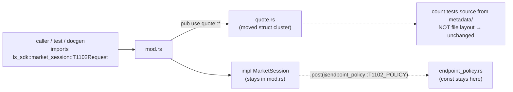
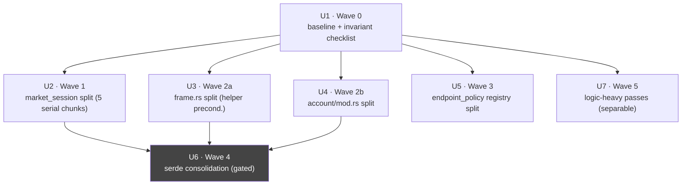

# refactor: Codebase-wide simplification — module decomposition + serde consolidation

## Summary

Decompose the `ls-*` workspace's per-TR monolith files into per-domain modules,
consolidate repeated serde coercion attributes where behavior-safe, and run targeted
quality passes on the genuinely logic-heavy files — **all without changing any
behavior or public API**. The work splits into six sequenced waves (~15–21 PRs).
Every chunk is gated on the existing test suite plus the invariant that the docgen
count tests (`reference.len`, `banner_trs`, `TRACKED_TRS`) and the policy crosscheck
lists stay green with **zero edits** — which holds because moves are re-exported with
`pub use submod::*`, leaving every public path identical.

**Product Contract preservation:** N/A — this is a `ce-plan-bootstrap` refactor with
no upstream requirements doc. The reviewed strategy doc
(`docs/plans/2026-06-29-002-refactor-codebase-simplification-split-plan.md`) is the
origin; this plan operationalizes its full-retro-split path into implementation units.

---

## Problem Frame

`crates/ls-sdk/src/market_session/mod.rs` is a single **11,789-line file holding 474
per-TR structs**; `realtime/frame.rs` (4,977 lines / 102 structs) and `account/mod.rs`
(2,406 lines / 73 structs) follow the same shape. `endpoint_policy.rs` is a flat
5,077-line registry of **297 policy constants** (`pub const …_POLICY`). Sitting next
to them, `paginated/` is already cleanly split into ~18 per-domain files — the target
shape the monoliths should match. The dominant cost is **structural boilerplate**, not
algorithmic complexity: ~650 single-purpose per-TR structs across three flat files
plus ~2,400 repeated serde-attr lines in those three files (with ~1,000 more in
`paginated/`, pulled into U6's scope), which makes navigation, review diffs, and
per-TR onboarding heavier than they need to be.

**Constraint that makes this tractable:** the gate's count tests key on public item
paths and metadata, not file locations (verified — docgen renders from `metadata/`,
no test enumerates structs by file). So moving a TR's struct cluster to a sibling
file and re-exporting it preserves every public path and keeps the gate green with no
count-test edits. This converts the bulk of the work into low-risk mechanical moves.

**Out-of-band risk this plan must actively manage:** the three monolith files are the
exact files the active TR add/flip loop edits on nearly every feature PR (#68–#71 all
landed 2026-06-29 touching them). A long-lived or parallel refactor branch will rot or
conflict against that loop. Sequencing and merge-window coordination are therefore
first-class requirements, not afterthoughts.

---

## Requirements

- **R1 — Behavior & public API preserved.** Every chunk leaves the public API
  byte-identical and all count tests unchanged. No TR struct/policy renames, no
  metadata/baseline edits, no generated-doc hand-edits.
- **R2 — `market_session` decomposed.** The 474 struct clusters move into per-family
  sibling modules; the `MarketSession` facade `impl` and module docs remain in `mod.rs`.
- **R3 — `frame.rs` & `account/mod.rs` decomposed** per channel-family / account-domain,
  with `frame.rs`'s shared helpers and inline tests handled correctly.
- **R4 — `endpoint_policy.rs` registry decomposed** by domain; both crosscheck lists
  resolve unchanged.
- **R5 — Serde attrs consolidated where behavior-safe**, preserving the `IGW40011`
  request(number)/response(tolerant) direction invariant; or the wave is skipped with
  recorded rationale rather than forcing an unsafe wrapper.
- **R6 — Logic-heavy files simplified** only where behavior is provably preserved;
  validation, error handling, secret-scrubbing, and status-classification branches are
  never thinned.
- **R7 — Churn-safe sequencing.** Within a wave, PRs touching the same file land
  strictly sequentially; each monolith's split is merge-window-coordinated against (or
  run during a confirmed lull in) the active TR loop.

---

## Key Technical Decisions

- **KTD1 — Re-export, don't relocate-and-rewire.** Each moved cluster is brought back
  into its original module path via `pub use submod::*`. This is the load-bearing
  decision: it keeps `ls_sdk::market_session::T1102Request` (and every other path)
  resolvable, so callers, the existing typed tests, and the count tests are untouched.
  Verified safe against the codebase: 297 `_POLICY` consts are unique by TR (no glob
  collision); docgen sources from `metadata/`, not file layout.
- **KTD2 — Move struct clusters only.** A `market_session` "section" is the doc comment
  + `…Request`/`…InBlock`/`…OutBlock` structs + `impl …Request`. The **facade methods**
  live in one bottom `impl MarketSession` block (≈line 10,695) and **cannot be
  glob-split** — they stay in `mod.rs`. The `{TR}_POLICY` consts live in
  `endpoint_policy.rs`, never in the SDK section. Wave 1 relocates struct clusters;
  facade + policy stay put.
- **KTD3 — Verification is the compile gate + count-test invariance, not a new
  snapshot.** `crates/ls-sdk/tests/market_session_tests.rs` imports ~30+ struct names,
  so a dropped re-export fails `cargo test` at compile time. Hand-rolled `grep pub`
  snapshots are rejected — they can't detect re-export/path drift and duplicate the
  compiler. A deterministic `cargo public-api` diff is used **only if** out-of-repo
  consumer drift is in scope (KTD added at wave start).
- **KTD4 — `frame.rs` is not a pure-move recipe.** It has shared helpers of two kinds:
  the private `build_frame` and `pub(crate)` `split_composite_key`/`build_subscribe_msg`/
  `build_unsubscribe_msg`, plus the **`pub fn composite_key` which is re-exported by
  name** in `realtime/mod.rs`'s `pub use frame::{ composite_key, … }` list and must
  stay in `frame.rs` and in that named list. It also has ~107 inline `#[test]`s in a
  tail `cfg(test)` block, and `realtime/mod.rs` re-exports ~110 channel structs by
  **explicit name** (not glob). The load-bearing bridge: after clusters move into
  `frames/<family>.rs`, `frame.rs` must `pub use frames::*;` so every name in
  `realtime/mod.rs`'s explicit list resolves transitively — any name not bridged
  fail-fast at compile time. These are resolved by a precondition step before any
  channel cluster moves (see U3).
- **KTD5 — Serde consolidation keeps the field type `String`, and is gated.** The
  consolidation mechanism is a `#[serde(with = "module")]` **field attribute** that
  bundles a direction's serialize+deserialize into one path — **not** a `WireNum`/
  `WireDec` newtype. A newtype retypes `pub field: String → WireNum`, which is a visible
  public-API change and **violates R1** even if serde tests pass; the only repetition
  being removed is the attribute string, so a `with =` path that leaves the field
  `String` is the R1-safe win. A single `with =` module still can't serve both
  directions (request `string_as_number` emits JSON numbers; response
  `string_or_number` is tolerant), so request and response get separate `with =`
  modules. Wave 4 runs a pre-check across families covering **all three** attr types
  (`string_as_number`, `string_or_number`, `string_as_decimal`) and an optional-numeric
  field — `paginated/` alone is unrepresentative (zero `string_as_decimal`, zero
  `Option<>` numerics; the only `string_as_decimal` fields live in `account/`), so the
  sample must include an `account/` domain. Outcome is per-attr-type: adopt the types
  that pass + meaningfully reduce, skip the rest, record the verdict.
- **KTD6 — Sequencing over parallelism.** Within-wave PRs that edit the same file are
  serial; cross-wave PRs on different files may parallelize. Each monolith split is
  merge-window-coordinated against the TR loop, or run as one atomic PR in a lull.

---

## High-Level Technical Design

### Module decomposition (before → after, `market_session` example)

```
BEFORE                                  AFTER
market_session/                         market_session/
└── mod.rs  (11,789 lines)              ├── mod.rs   (~1,150 lines: facade impl + docs + re-exports)
    ├── 474 struct clusters             ├── quote.rs        (price/order-book/multi-symbol clusters)
    ├── impl MarketSession (1,095 ln)   ├── investor_flow.rs(program-trade / foreign-institution)
    └── (no inline tests)               ├── charts.rs       (time-bucket / price-band / conclusion)
                                        ├── etf_masters.rs  (ETF NAV/PDF / ELW / masters-reference)
                                        └── ranking.rs      (sector / VP / rank-screen reads)
```

`mod.rs` retains `impl MarketSession { … }` and adds, per family:
`mod quote; pub use quote::*;` — so `ls_sdk::market_session::T1102Request` still
resolves. (Final family grouping is read off the actual `// ----` section headers; the
five above are the proposed cut.)

### Re-export keeps public paths invariant (why the gate stays green)



### Wave dependency & sequencing



Wave 0 precedes everything. Waves 1/2a/2b/3 touch different files and may proceed in
parallel **across** waves (serial **within** each). Wave 4 follows the splits it
consolidates over. Wave 5 is independent of the splits (different files) and may run
anytime after Wave 0.

---

## Output Structure

Target SDK layout after Waves 1–3 (new files marked `+`):

```
crates/ls-sdk/src/
  market_session/
    mod.rs            facade impl + module docs + re-exports
+   quote.rs
+   investor_flow.rs
+   charts.rs
+   etf_masters.rs
+   ranking.rs
  realtime/
    frame.rs          shared helpers + inline tests + re-exports
+   frames/
+     <channel-family>.rs   (≥2, sized to the ~1,500-line ceiling)
  account/
    mod.rs            facade + re-exports
+   balance.rs / holdings.rs / orders_inquiry.rs / capacity.rs
crates/ls-core/src/
  endpoint_policy/
    mod.rs            crosscheck test bodies + re-exports
+   <domain>.rs       (policy consts grouped by owner_class/domain)
```

The per-unit **Files** lists are authoritative; the tree is the scope shape. Family
file names are directional — the implementer may merge/rename to match the real
section grouping.

---

## Implementation Units

### Phase A — Foundation

#### U1. Wave 0 — baseline & invariant checklist

- **Goal:** Establish the behavior-preservation contract that every later chunk
  verifies against, folded into the first Wave-1 PR description (not a separate
  committed artifact).
- **Requirements:** R1, R7
- **Dependencies:** none
- **Files:** new `docs/plans/notes/2026-06-29-003-refactor-baseline.md` (committed,
  diffable record). No source changes.
- **Approach:** Run the full gate on a clean tree and record the count-test values
  (`reference.len`, `banner_trs`, `maintained_tr_count`, `TRACKED_TRS`) into the
  committed baseline note — they must be identical after every merge, and every later
  wave diffs against this file rather than an ephemeral PR description (matters most if
  U2 lands as one atomic PR). Capture the KTD1 re-export rule and the U2 TR→family map
  there too. **Resolve now (not "at wave start"):** decide whether out-of-repo consumer
  drift is in scope; if yes, add `cargo public-api` (rustdoc-json nightly) as an install
  step + per-chunk deterministic diff and record its baseline; if no, state that the
  compile gate per KTD3 is the agreed coverage. **If the starting tree is red,** stop
  and fix/triage before any move — U1 cannot establish a baseline on a red gate.
- **Patterns to follow:** the gate sequence in `AGENTS.md`
  (`make docs && cargo test && cargo test -p ls-core && make docs-check`).
- **Test expectation:** none — verification harness only; the gate IS the test. Confirm
  the recorded baseline gate run is green before any move.
- **Verification:** the committed baseline note holds the four count-test values, the
  re-export rule, the TR→family map, and the resolved cross-repo-scope decision.

---

### Phase B — Structural decomposition (pure moves)

#### U2. Wave 1 — split `market_session/mod.rs` into per-family modules

- **Goal:** Relocate all 474 TR struct clusters into per-family sibling files, leaving
  `mod.rs` with only the facade `impl` + docs + re-exports.
- **Requirements:** R1, R2, R7
- **Dependencies:** U1
- **Files:** `crates/ls-sdk/src/market_session/mod.rs` (edit: add `mod`/`pub use`,
  remove moved clusters); new `crates/ls-sdk/src/market_session/{quote,investor_flow,charts,etf_masters,ranking}.rs`;
  `crates/ls-sdk/tests/market_session_tests.rs` (unchanged — must still compile/pass).
- **Approach:** **Preferred — one atomic PR in a confirmed lull** (KTD6): least
  conflict surface against the TR loop. **Fallback if a lull can't be held:** one PR
  per family file, landed strictly sequentially (all edit `mod.rs`), each within ~24h
  of the last to minimize re-exposure. Either way: move struct clusters + their
  `impl …Request` verbatim; leave facade methods in the bottom `impl MarketSession`
  block and `_POLICY` consts in `endpoint_policy.rs` (KTD2); add
  `mod <family>; pub use <family>::*;` to `mod.rs`; and **start each new file with
  `use super::*;`** so the structs see the names the monolith got from its module-level
  `use` block (`serde::{Deserialize, Serialize}`, `ls_core::{…}`). **Family membership
  is per-TR classification, not a header lookup** — there are no family-level headers,
  only ~96 per-TR doc comments; classify each TR by its Korean functional name
  (proposed cut: price/order-book/multi-symbol → `quote.rs`; 프로그램매매 +
  외국인/기관 → `investor_flow.rs`; 시간대별/가격대별/체결 charts → `charts.rs`;
  ETF/ELW + masters/reference → `etf_masters.rs`; 업종/VP/순위 → `ranking.rs`).
  Mis-filing is silent (still compiles + gate-green via glob re-export), so capture the
  TR→family map in the U1 baseline artifact for review.
- **Patterns to follow:** the existing `crates/ls-sdk/src/paginated/` per-domain layout
  and its `mod.rs` re-export style.
- **Execution note:** characterization-first is unnecessary — the existing typed
  `market_session_tests.rs` already pins behavior; rely on it as the regression net.
- **Test expectation:** none — pure relocation. Verification is gate-green + count-test
  invariance + `market_session_tests.rs` passing unchanged.
- **Verification:** after each chunk, the full gate is green, the U1 count-test values
  are identical, and no diff appears in generated docs. `mod.rs` ends at ≈1,150 lines
  (facade `impl` + docs + re-exports); facade-split is out of scope.

#### U3. Wave 2a — split `realtime/frame.rs` (with shared-helper preconditions)

- **Goal:** Move per-channel struct clusters into `realtime/frames/<family>.rs`,
  re-exported from `frame.rs`, without breaking shared helpers or inline tests.
- **Requirements:** R1, R3, R7
- **Dependencies:** U1
- **Files:** `crates/ls-sdk/src/realtime/frame.rs` (edit); new
  `crates/ls-sdk/src/realtime/frames/<channel-family>.rs` (≥2);
  `crates/ls-sdk/src/realtime/mod.rs` (verify named re-exports still resolve);
  `crates/ls-sdk/tests/realtime_tests.rs` (unchanged).
- **Approach:** **Precondition first (KTD4):** make the private `build_frame`
  `pub(crate)`, add `use super::*;` to each new submodule, and add **`pub use frames::*;`
  to `frame.rs`** so the explicit ~110-name `pub use frame::{…}` list in
  `realtime/mod.rs` resolves transitively. Keep all shared helpers — including the
  named-exported `pub fn composite_key` — in `frame.rs`. Leave the ~107-test tail
  `#[cfg(test)] mod tests { use super::*; }` block in `frame.rs` (its `use super::*`
  resolves moved structs through the glob). Then move channel clusters per family.
  Sequential PRs (all edit `frame.rs`). Size families to clear the ~1,500-line ceiling —
  4,977 lines may need >2 families.
- **Patterns to follow:** `paginated/` layout; the existing `frame.rs` tail test module
  as the regression net.
- **Test expectation:** none — pure relocation + mechanical helper-visibility edits.
  Verification is gate-green + the `frame.rs` tail tests passing unchanged.
- **Verification:** gate green; `realtime_tests.rs` and the `frame.rs` inline tests
  pass; `realtime/mod.rs`'s explicit named re-export list compiles (fail-fast catches
  any unbridged name); count-test values unchanged. After the `build_frame` visibility
  bump, `grep -rn build_frame crates/ls-sdk/src/` confirms every call site stays within
  `realtime/` (the `pub(crate)` widening introduces no new external caller).

#### U4. Wave 2b — split `account/mod.rs` per account-domain

- **Goal:** Move the 73 account struct clusters into `account/<domain>.rs`,
  re-exported from `mod.rs`.
- **Requirements:** R1, R3, R7
- **Dependencies:** U1
- **Files:** `crates/ls-sdk/src/account/mod.rs` (edit); new
  `crates/ls-sdk/src/account/{balance,holdings,orders_inquiry,capacity}.rs`;
  `crates/ls-sdk/tests/account_tests.rs` (unchanged).
- **Approach:** Closer to the pure-move recipe — manual `Debug` impls move verbatim
  with their structs (confirm none reference a struct landing in a *different* domain
  file by bare path). **Verify there is no shared top-level helper** before treating a
  cluster as zero-edit (if one exists, apply the U3 helper-visibility pattern). Split
  per account-domain; start each new file with `use super::*;`; re-export via
  `pub use <domain>::*;`. 1–2 sequential PRs.
- **Patterns to follow:** `paginated/`; U3's helper-handling if a shared helper surfaces.
- **Test expectation:** none — pure relocation. Verification is gate-green +
  `account_tests.rs` passing unchanged.
- **Verification:** gate green; `account_tests.rs` passes; count-test values unchanged.

#### U5. Wave 3 — split `endpoint_policy.rs` registry by domain

- **Goal:** Decompose the flat 297-constant policy registry into
  `endpoint_policy/<domain>.rs` submodules, re-exported so every
  `endpoint_policy::FOO_POLICY` path is unchanged.
- **Requirements:** R1, R4, R7
- **Dependencies:** U1
- **Files:** `crates/ls-core/src/endpoint_policy.rs` → `endpoint_policy/mod.rs` + new
  `endpoint_policy/<domain>.rs`; `crates/ls-core/tests/policy_index_crosscheck.rs`
  (unchanged — must still pass).
- **Approach:** Group consts by `owner_class`/domain into submodules; start each
  submodule with `use super::*;` (the consts need `EndpointPolicy`/`Protocol`/
  `RateLimitCategory` from the old module scope); `mod.rs` does `pub use <domain>::*;`.
  **Crosscheck handling (the one breakage point):** keep both crosscheck bodies where
  they resolve consts by bare name — `slice_rest_policies_are_non_order_rest` (the
  in-source `#[test]`, already inside a `#[cfg(test)] mod tests { use super::*; }` block
  at `endpoint_policy.rs:4799` — verified; it stays in `endpoint_policy/mod.rs` where
  `pub use *` keeps names in scope) and `slice_policies_mirror_metadata_index` (the
  integration test in `policy_index_crosscheck.rs`, imports from
  `ls_core::endpoint_policy`, unchanged). Do **not** move a crosscheck body into a
  submodule. 1–2 sequential PRs.
- **Patterns to follow:** the existing const-block grouping comments in
  `endpoint_policy.rs` as the domain seams.
- **Test expectation:** none — pure relocation. Verification is gate-green + both
  crosscheck tests passing unchanged.
- **Verification:** `cargo test -p ls-core` green; both crosscheck lists resolve; count
  tests unchanged.

---

### Phase C — Boilerplate consolidation (behavior-sensitive)

#### U6. Wave 4 — serde-attr consolidation (gated on a pre-check)

- **Goal:** Reduce the ~2,400 repeated `string_as_number` / `string_or_number` /
  `string_as_decimal` attributes where behavior-safe — or skip the wave with rationale.
- **Requirements:** R1, R5
- **Dependencies:** U2, U3, U4 (smaller files first); benefits from U5 only indirectly.
- **Files:** new `with =` helper module(s) in `ls-core` (e.g. extend the existing
  serde-helper module) if adopted; the Wave-1/2 family files; `paginated/` family files
  (in-scope per the decision); offline decode/serialize tests under
  `crates/ls-sdk/tests/` (`paginated_tests.rs`, `market_session_tests.rs`,
  `account_tests.rs`, `realtime_tests.rs`).
- **Approach (decision gate — KTD5):** Prototype a `#[serde(with = "module")]` field
  attribute (field type stays `String`) across a sample that covers all three attr
  types and an optional-numeric field — **at minimum one `paginated/` family plus one
  `account/` domain** (the only `string_as_decimal` carrier). Run the existing
  decode/serialize tests. **Per-attr-type outcome:** for each of `string_as_number` /
  `string_or_number` / `string_as_decimal`, adopt the `with =` consolidation if it
  passes, preserves the `String` field type (R1), and meaningfully cuts attr strings;
  otherwise skip that type and record why. Any approach that changes a `pub … String`
  field to a wrapper type fails R1 and forces a skip. Record the realistic per-type
  reduction ceiling, size the chunks to it, and back-apply adopted types to `paginated/`
  so one convention exists workspace-wide. Apply per family-group, one chunk each, each
  gated on existing tests staying green.
- **Patterns to follow:** existing `string_as_number` (serialize/request) and
  `string_or_number` (deserialize/response) helpers in `ls-core`.
- **Test scenarios:**
  - Happy path: for each touched struct family, a request struct with numeric fields
    serializes to JSON **numbers** (not strings) — pins the `IGW40011` invariant.
  - Happy path: a response payload arriving with the field as a JSON **string** AND as
    a bare **number** both deserialize to the same value (tolerant `string_or_number`
    behavior preserved).
  - Edge: a null/absent optional numeric field round-trips unchanged.
  - Public-API guard: every consolidated field's declared type is still `String` (no
    newtype) — the struct's public signature is byte-identical (R1).
  - Regression: the full pre-existing offline decode/serialize suite passes byte-for-byte
    on at least one struct per touched family.
- **Verification:** gate green; the scenario classes above pass per touched family
  (including the `account/` `string_as_decimal` carrier); fields remain `String`; the
  recorded per-type ceiling (or skip rationale) is in the baseline note / PR
  description; no count-test drift.

---

### Phase D — Logic-quality passes (separable)

#### U7. Wave 5 — logic-heavy reuse/quality/efficiency passes

- **Goal:** Run the `ce-simplify-code` reviewer trio on the files with real control
  flow, applying only behavior-preserving fixes. **This unit is a standing backlog, NOT
  part of this plan's Definition of Done** — the plan completes at Wave 4. Activate
  these files **one defect/complexity signal at a time** as separately-justified tasks;
  the per-file detail below exists so each candidate is ready to pick up, not to gate
  completion of this plan.
- **Requirements:** R1, R6
- **Dependencies:** U1 (independent of the splits — different files)
- **Files (one chunk each):** `crates/ls-sdk/src/orders/reconcile.rs`,
  `crates/ls-core/src/inner.rs`, `crates/ls-metadata/src/validator.rs`,
  `crates/ls-trackers/src/freshness.rs` + `fetch.rs`,
  `crates/ls-trackers/src/cli.rs`; plus their existing tests.
- **Approach:** Per file, run the reuse/quality/efficiency reviewer trio; apply a fix
  only when output is identical for every input, same errors, same side effects. Never
  thin a status-classification branch in `reconcile.rs` (it carries the 취소/거부 P0
  history), and never remove validation, error handling, secret-scrubbing, or the
  dispatch log suppressor. `cli.rs` is a reuse pass only — **no blanket fmt** (the
  `ls-trackers` crate is intentionally unformatted on main). `cli.rs` holds the TR-count
  literals a track/flip bumps (≈lines 1811/1876/2779/2787) → before opening the `cli.rs`
  PR, confirm no open feature PR edits those literals; if one is in-flight, rebase onto
  its merge first.
- **Patterns to follow:** `docs/solutions/` learnings for each module; existing test
  suites as the behavior-preservation net.
- **Execution note:** characterization-first for any branch whose behavior isn't
  already pinned by an existing test before simplifying it.
- **Test scenarios:**
  - Regression: each file's existing test suite passes unchanged after every fix.
  - `reconcile.rs`: the offline order-state matcher tests (cancel/modify
    REJECTED-vs-landed classification) pass — explicitly assert no
    classification-branch behavior changed.
  - Efficiency fixes: assert the same observable output/side-effect ordering before and
    after (no dropped no-op guards, no reordered I/O).
- **Verification:** gate green; the reviewer trio reports no actionable findings left;
  no behavior delta in the named safety-sensitive paths.

---

## Verification Contract

- **Per-chunk gate (every PR):** `make docs && cargo test && cargo test -p ls-core &&
  make docs-check` is green.
- **Invariant (Waves 0–3):** the U1-recorded count-test values (`reference.len`,
  `banner_trs`, `maintained_tr_count`, `TRACKED_TRS`) are byte-identical after merge,
  with **no edits** to any count test. Generated docs show no diff.
- **Public-path invariant:** `crates/ls-sdk/tests/market_session_tests.rs`,
  `account_tests.rs`, `realtime_tests.rs`, and the `policy_index_crosscheck.rs`
  crosscheck compile and pass without modification. (Optional, if cross-repo scope:
  `cargo public-api` diff is empty.)
- **Behavior invariant (Wave 4):** `IGW40011` direction tests pass — requests serialize
  numerics as JSON numbers, responses tolerate string-or-number — per touched family.
- **Safety invariant (Wave 5):** `reconcile.rs` order-state matcher tests pass; no
  validation/secret-scrubbing/suppressor code removed.

---

## Scope Boundaries

### In scope
- Module decomposition of `market_session`, `frame.rs`, `account/mod.rs`,
  `endpoint_policy.rs`.
- Behavior-safe serde-attr consolidation (or a recorded skip).
- Behavior-preserving logic passes on the five named files.

### Deferred to Follow-Up Work
- Splitting the `MarketSession` facade `impl` itself (U2 leaves it intact at ~1,095
  lines) — only if it later becomes a navigation problem.
- Extending serde consolidation beyond the families touched here, if Wave 4's ceiling
  turns out larger than the initial chunks cover.

### Out of scope (non-goals)
- Any public API change, TR struct/policy rename, or metadata/baseline edit.
- Wire-serialization behavior changes beyond behavior-equivalent helper extraction.
- Reformatting `ls-trackers` beyond touched lines.
- Hand-editing generated docs (`docs/reference/`, `docs/tr-dependencies/`).

---

## Risks & Dependencies

- **Branch rot / merge conflicts against the active TR loop (highest).** The three
  monolith files change on nearly every feature PR. *Mitigation (R7/KTD6):* serial
  within-wave PRs, merge-window coordination, or single atomic split PRs in a confirmed
  lull. MEMORY notes the raw TR pool is exhausted as of 2026-06-29 — likely the lull.
- **`frame.rs` "move" doesn't compile (medium).** Shared private `build_frame` +
  inline tests + named re-exports break naive relocation. *Mitigation:* U3's explicit
  precondition step before any cluster moves.
- **Wave 4 yields little or breaks serde (medium).** The two-direction split caps the
  achievable reduction. *Mitigation:* KTD5 pre-check gate — adopt-or-skip on measured
  evidence, not optimism.
- **Wave 5 regresses behavior-sensitive logic (medium).** *Mitigation:* characterization-
  first, named safety invariants, no-blanket-fmt rule, and the separable framing
  (prefer defect-driven invocation).
- **Dependency:** a green starting tree and the `.env`-gated gate from `AGENTS.md`.

---

## Definition of Done

- Waves 0–4 landed (Wave 4 may be skipped/deferred per the KTD5 gate with recorded
  rationale), each PR gate-green. **Wave 5 (U7) is a standing backlog, not a completion
  gate** — the plan is Done with U7 untouched.
- No SDK source file exceeds ~1,500 lines except by genuine cohesion; `market_session/
  mod.rs` holds only the facade + re-exports.
- Count tests and crosscheck lists unchanged across the entire effort; generated docs
  show no diff.
- The `IGW40011` and `reconcile.rs` safety invariants demonstrably hold.
- No public API, metadata, or baseline change in the diff.

---

## Sources & Research

- Origin strategy + reviewed rationale:
  `docs/plans/2026-06-29-002-refactor-codebase-simplification-split-plan.md`
  (premise check, stop-the-bleeding alternative, per-wave gotchas; ce-doc-review-hardened).
- Codebase facts verified during review: facade span (1,095 lines @ `market_session/mod.rs:10695`);
  crosscheck functions (`endpoint_policy.rs:4832`, `tests/policy_index_crosscheck.rs:87`);
  `frame.rs` shared helpers + ~107 inline tests; docgen count anchors
  (`ls-docgen/src/lib.rs`: `TRACKED_TRS [&str;307]`, `banner_trs`, `reference.len()`);
  297 unique `_POLICY` consts; serde direction helpers in `ls-core`.
- Conventions: `AGENTS.md` (gate sequence, no-blanket-fmt rule, `IGW40011`),
  `crates/ls-sdk/src/paginated/` (target layout).
