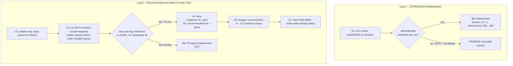

# Order Flip + Recommended Promotion Wave - Plan

## Goal Capsule

- **Objective:** While KRX is open, advance the order surface one rung up the support ladder — flip the last paper-compatible order TR (`CSPBQ00200`) to Implemented, and promote the four already-Implemented order TRs to Recommended using a clean in-window order-chain evidence run.
- **Product authority:** Repo owner (sunkeunchoi). Direction confirmed in brainstorm: "Both" — `CSPBQ00200` flip plus the Recommended promotion.
- **Open blockers:** None blocking planning. Three execution-time contingencies (not blockers): `CSPBQ00200`'s live row may be funding-gated (→ stays PENDING); the chain run must land cleanly in-window for promotion to certify; promotion also requires deliberately flipping each order TR's smoke-map Promotion column to `ready` (the promote-tr recipe HOLDs `implemented-only` TRs — see R5).

## Product Contract

### Summary

This wave moves the order surface up the support ladder during an open KRX window. It flips `CSPBQ00200` (orderable quantity by margin rate) from Tracked to Implemented on a live paper smoke, and promotes the four Implemented order TRs (`CSPAT00601` submit, `CSPAT00701` modify, `CSPAT00801` cancel, `t0425` reconciliation read) from `recommended: false` to Recommended — the live order-placement evidence ADR 0008 has been deferring until an in-window run was possible. The two legs are decoupled: each lands on its own evidence.

### Problem Frame

The raw OpenAPI pool that fed every prior flip wave is exhausted (307 Tracked / 278 Implemented / 0 raw). For orders specifically, the placement surface is already fully Implemented on paper and the only remaining paper-compatible Tracked order TR is `CSPBQ00200`; the other two order-account candidates (`CCENQ10100`/`CCENQ90200`, evening derivatives) are `paper_incompatible: true` and never flip on paper. So "more order TRs to Implemented" has a hard ceiling of one.

The larger unrealized value sits one rung higher. The four Implemented order TRs all carry `recommended: false`, held there by ADR 0008: the Recommended gate "endorses live order placement," and that endorsement was deferred until a live *in-window* order-placement evidence run could be done. KRX being open is precisely that precondition. The order-chain harness already exists and was run cleanly in-window during the Implemented certification (plan -005); promotion reuses it as ADR 0008's evidence rather than building anything new.

### Key Decisions

- **Decouple the two legs.** The `CSPBQ00200` flip and the Recommended promotion land on independent evidence. If `CSPBQ00200` returns no deserializable live row, it stays PENDING and the promotion proceeds regardless. Neither leg gates the other.
- **Recommended reuses the existing order harness, not a prior run's evidence.** The promotion runs a fresh in-window order smoke; "reuse" means the harness and its guards, not the plan -005 certification output (order-safety §4 imposes a 7-day evidence-freshness bar). One clean run exercises submit → modify → cancel → flat-assert with `t0425` reconciliation. Evidence *capture*, however, is not a drop-in of the promote-tr recipe: the order harness emits multi-line `ORDER-CHAIN` lines rather than the single `LIVE-SMOKE` line promote-tr records, and no order TR has a `metadata/evidence/<tr>.yaml` file yet — splitting one run into four per-leg evidence records is real work this wave owns (see Outstanding Questions).
- **`CSPBQ00200` is opportunistic, the promotion is the guaranteed yield.** Orderable-quantity-by-margin-rate is plausibly funding/session-gated even with the market open. The wave is shaped so its core value (4 TRs to Recommended) does not depend on the flip succeeding.
- **Promotion endorses live order placement.** Recommended on these four TRs is the first point at which the SDK says "this is safe to actually trade with." This is the intended outcome of this wave, not a separate later pass.

### Requirements

**CSPBQ00200 flip (Tracked → Implemented)**

- R1. `CSPBQ00200` (현물계좌증거금률별주문가능수량 / orderable quantity by margin rate) is already fully scaffolded — `CSPBQ00200_POLICY` is registered in both cross-check lists, the account facade dispatches it, and the smoke fn, Makefile target, and offline deserialize tests all exist. This leg's remaining work is therefore execute-and-flip only: run the existing in-window guarded smoke, then flip metadata + bump docgen counts. No new policy, facade, or registration is authored.
- R2. The flip records as Implemented only when the smoke returns a non-empty, deserializable row whose substantive modeled field (orderable quantity) is asserted present — an all-default or empty-`00707` response does not qualify.
- R3. If R2's witness is absent (funding-gated or empty), `CSPBQ00200` is dispositioned PENDING with a recorded reason, not forced to Implemented.

**Recommended promotion (Implemented → Recommended)**

- R4. Before any promotion, each of the four order TRs' smoke-map Promotion column is deliberately flipped `implemented-only` → `ready`. This is the recommendation-clearance gate: the promote-tr recipe (§0) HOLDs any `implemented-only` TR — "a passing smoke is not a recommendation mandate; the `ready` signal must be set deliberately first" — so a clean smoke alone promotes nothing. The basis for setting `ready` (what the in-window evidence proves, and any operator sign-off) is recorded.
- R5. Fresh clean in-window order smokes produce the live order-placement evidence. Per the smoke-map per-TR evidence pointers, the `live-smoke-order` matrix run yields the `CSPAT00601` submit + `t0425` reconciliation evidence, and the `live-smoke-order-chain` run yields `CSPAT00701` (modify) + `CSPAT00801` (cancel). Both targets run in the same window (see KTD-1).
- R6. With `ready` set (R4) and clean evidence, each TR flips `recommended: false` → Recommended, with credential-free Focused Evidence captured per the promote-tr recipe (response codes / valid rows, no account identifiers).
- R7. If a given leg's evidence row is missing from an otherwise-usable run, that TR stays Implemented and the remaining legs promote; promotion is per-TR on its own leg's evidence.
- R8. On successful promotion, ADR 0008's deferral is retired. ADR 0008's literal text ties supersession to the *Implemented* certification (which already ran in plan -005); this wave treats the same in-window evidence as also clearing the *Recommended* endorsement and updates the ADR status to say so. `docs/design/order-safety-design.md` ("machinery-complete, evidence-pending") is updated in the same pass.

**Gate and bookkeeping**

- R9. The full repository gate stays green: `make docs`, `cargo test`, `cargo test -p ls-core`, `make docs-check`.
- R10. Count families move consistently with the support-tier transitions: the `CSPBQ00200` flip (if it lands) bumps the Implemented-tier docgen counts as a tracked→implemented transition; the four promotions bump the Recommended-tier docgen banner / freshness counts. No count test is left stale.
- R11. `CSPBQ00200_POLICY` is already registered in both cross-check lists, so no new policy registration is authored; verify both lists still pass the crosscheck after the metadata flip rather than adding entries.

### Acceptance Examples

- AE1. **Covers R2, R3.** When the in-window `CSPBQ00200` smoke returns a row with a populated orderable-quantity field, the TR flips to Implemented and the smoke asserts that field non-empty before recording. When it instead returns empty/`00707` or an all-default row, the TR is left Tracked and dispositioned PENDING with the reason recorded.
- AE2. **Covers R4, R5, R6.** When the four TRs' Promotion column has been set `ready` and the in-window run returns valid submit (`00040`), modify (`00462`), cancel (`00463`) codes and a valid `t0425` reconciliation row, all four TRs promote to Recommended with Focused Evidence captured. With the Promotion column still `implemented-only`, the same clean run promotes nothing (the recipe HOLDs).
- AE3. **Covers R7.** When the run is clean for three of the four legs but one leg's evidence row is missing, the three witnessed TRs promote and the unwitnessed one stays Implemented — the run is not failed wholesale.
- AE4. **Covers R3, R7.** A wave in which `CSPBQ00200` stays PENDING and all four order TRs promote to Recommended is a fully successful outcome.
- AE5. **Covers R5.** If `CSPAT00601`'s evidence is sourced from the matrix run's marketable scenario and an open-market fill occurs, the run hard-fails and triggers a paper reset — the fill is not recorded as a clean promotion witness.

### Scope Boundaries

- `CCENQ10100` and `CCENQ90200` (KRX evening-derivatives orderable qty / position) stay `paper_incompatible: true` — out of scope, never flip on paper.
- No new raw tracking — the raw pool is exhausted; this wave does not prospect for new TRs.
- The 13 PENDING / 4 HELD non-order dispositioned TRs are untouched.
- No changes to the order safety machinery (no-retry post, deduplicator, kill switch, reconciliation matcher) — it is complete and reused as-is.

### Dependencies / Assumptions

- KRX is open and a human is present in an attended interactive shell. The order harness fail-closes unless stdin is a TTY and a fresh per-wave human-minted nonce is present (`export LS_ORDER_SMOKE_NONCE=$(date +%s)`, 600s TTL); a backgrounded / piped / no-TTY invocation refuses and places nothing. "Agent-invoked, no operator handoff" means the agent drives the run and cleanup without handing off to a separate operator — it does **not** mean unattended placement.
- A valid order-capable paper account is configured in `.env` (`LS_TRADING_ENV=paper`). Prior `01491` "모의투자 주문 불가 계좌" was resolved by new credentials; assume current creds are order-capable.
- The chain legs submit at a non-marketable limit price so an open-market run modifies and cancels without filling; the flat-assert (retry-cancel + hard-fail) guards any resting remainder. This non-marketable assumption holds for the chain legs only — the matrix run (`live-smoke-order`) deliberately includes a marketable, fill-prone scenario, so if `CSPAT00601`'s evidence is sourced from the matrix during an open market, an unexpected fill must hard-fail + paper-reset rather than count as a clean witness (see AE5).
- A `Pending` smoke outcome (out-of-window, not order-capable, degenerate band) must not be mistaken for the evidence that retires ADR 0008 — only a run that actually placed and reconciled orders certifies promotion.

### Outstanding Questions

**Resolved during planning** (research closed these — see Planning Contract):

- Evidence source for `CSPAT00601` + `t0425` is the `live-smoke-order` matrix target; `CSPAT00701` + `CSPAT00801` come from `live-smoke-order-chain`. Both targets run in the same window (smoke-map rows 285–288). Marketable-fill handling (AE5) applies to the matrix submit.
- Evidence-capture adaptation, the `ready`-column flip, and the docgen count sites are all resolved into Implementation Units U2/U4/U6 and KTD-1…KTD-4.

**Deferred to execution** (knowable only at run time, in-window):

- Whether `CSPBQ00200` returns a deserializable orderable-quantity row, or is funding-gated → decides flip (U1) vs PENDING (R3).
- Whether the current `.env` credentials clear the order-capable check (no `01491`) when the live legs run → decides promotion-certify vs PENDING hold.

### Sources / Research

- Grounding dossier (this brainstorm): order-TR tier inventory, raw-pool-exhaustion statement, smoke-harness anatomy, ADR 0008 status — file:line pointers throughout.
- `crates/ls-sdk/tests/order_smoke.rs` — guarded order-evidence harness (`order_smoke_matrix`, `order_chained_smoke`).
- `Makefile` `live-smoke-order` / `live-smoke-order-chain` targets.
- ADR 0008 — machinery-complete / evidence-pending; the Recommended deferral this wave retires. `docs/design/order-safety-design.md` carries the same "evidence-pending" status and the 7-day freshness bar.
- `.agents/skills/promote-tr/SKILL.md` (§0 `implemented-only` HOLD; §5 excludes discipline) and `implement-tr/SKILL.md` — the recipes the two legs follow.
- `.agents/skills/promote-tr/references/smoke-map.md` — the Promotion-column (`implemented-only` vs `ready`) gate and per-TR evidence-target rows for the order TRs.
- `metadata/trs/CSPBQ00200.yaml`, `metadata/trs/CSPAT00601.yaml` (and siblings `00701`/`00801`), `metadata/trs/t0425.yaml`.

---

## Planning Contract

**Product Contract preservation:** changed R5 — its lead sentence is reworded to match the resolved evidence routing (matrix yields submit + `t0425`; chain yields modify + cancel) and the now-answered "confirm which run" clause is dropped. This is a clarification, not a scope change: the WHAT (capture live order-placement evidence for the four TRs) is unchanged. R1–R4, R6–R11, and AE1–AE5 are carried verbatim. The `ce-doc-review` pass that produced R4 (the `ready`-gate requirement) and the renumber happened before this enrichment.

### Key Technical Decisions

- KTD-1. **Both order-smoke targets run in the same window.** `make live-smoke-order` (`order_smoke_matrix`) is the evidence source for `CSPAT00601` (submit) + `t0425` (reconciliation); `make live-smoke-order-chain` (`order_chained_smoke`) is the source for `CSPAT00701` (modify) + `CSPAT00801` (cancel). The smoke-map routes the four TRs to these two targets (`.agents/skills/promote-tr/references/smoke-map.md` rows 285–288), so a single target cannot cover all four.
- KTD-2. **Order smokes are wrapped in a TTY allocator.** The harness `autonomy_guard()` (`crates/ls-sdk/tests/order_smoke.rs:211`) refuses without a TTY on stdin and a fresh unix-seconds nonce (`LS_ORDER_SMOKE_NONCE`, 600s TTL). The agent's shell has no TTY, so each run is invoked as `script -q /dev/null env LS_ORDER_SMOKE_NONCE=$(date +%s) make <target>` (per `docs/solutions/architecture-patterns/autonomous-order-smoke-fail-closed-contract.md`). Never backgrounded.
- KTD-3. **Per-TR evidence adapts promote-tr's single-line capture to the order harness.** promote-tr §4 captures one verbatim `LIVE-SMOKE` line; the order harness instead emits per-leg `ORDER-SMOKE` (`order_smoke.rs:453`) and `ORDER-CHAIN` (`order_smoke.rs:1276`) lines, both already passed through `scrub_secrets`. Each `metadata/evidence/<tr>.yaml` carries that TR's verbatim line, with promote-tr §3 secret-safety and `date == maintenance.last_reviewed` still enforced.
- KTD-3b. **Recommended evidence also needs an `attested_shape` block — via re-pin, after the flip.** The metadata validator (`cargo test -p ls-core`) hard-fails any Recommended TR whose evidence record lacks `attested_shape` + `attested_normalizer_version: 2` (`crates/ls-trackers/.../validator.rs`, `AttestedShapeMissing`); every existing recommended evidence file carries it. That block is written by `ls-trackers freshness re-pin <tr>`, which **refuses unless the TR is already `recommended: true`** (`cli.rs` `run_freshness_repin`). The promote-tr recipe §4 does **not** mention this step — the plan adds it. Correct order per TR: U5 sets `recommended: true` + `last_reviewed`, **then** re-pin writes `attested_shape` into the U4 evidence file, **then** the `cargo test -p ls-core` gate runs. The four TRs' normalized baselines exist (`crates/ls-trackers/baselines/api-drift/normalized/trs/{CSPAT00601,CSPAT00701,CSPAT00801,t0425}.json`).
- KTD-4. **Count-site moves are tier-specific.** CSPBQ00200 flip (Tracked→Implemented): add `"CSPBQ00200"` to the `banner_trs` array and bump `reference.len()` 280→281 (`crates/ls-docgen/src/lib.rs`). Promotion (Implemented→Recommended): move each promoted TR from `banner_trs` into the recommended-no-banner loop (`lib.rs:1201`), growing the recommended count 6→10; `reference.len()` is unchanged (the TRs were already counted as implemented). `EVIDENCE-FRESHNESS.md` increments.
- KTD-5. **The `ready`-column flip is the recommendation-clearance decision, recorded with basis.** Setting `implemented-only`→`ready` (U2) is the deliberate human judgment promote-tr §0 requires — not a mechanical edit. A clean smoke alone does not authorize it.
- KTD-6. **Per-TR promotion within a decoupled chain.** Leg A (CSPBQ00200) is wholly independent. Leg B promotes per-TR on each TR's own leg evidence; a missing/failed leg leaves that TR Implemented while the others promote (R7).

### High-Level Technical Design

### Sequencing

Leg A (U1) is independent and can run any time KRX is open. Leg B is ordered U2 → U3 → U4 → U5 → U6 → U7 (U2 may precede U3 in any order but must precede U5; the recipe checks `ready` at promotion time). Within U5 the per-TR order is strict: set `recommended: true` + `last_reviewed`, then re-pin to write `attested_shape`, then gate (KTD-3b). Capture one UTC date string at the start of Leg B and reuse it for every evidence `date` and `last_reviewed` so the validator's `date == last_reviewed` cross-check holds even if the in-window KST session straddles UTC midnight.

---

## Implementation Units

### U1. CSPBQ00200 live smoke + Implemented flip (or PENDING)

- **Goal:** Flip `CSPBQ00200` Tracked→Implemented if the in-window smoke yields a deserializable orderable-quantity row; otherwise disposition PENDING.
- **Requirements:** R1, R2, R3, R10 (Implemented-tier counts), R11.
- **Dependencies:** none (independent leg).
- **Files:**
  - `crates/ls-sdk/tests/live_smoke.rs` — `live_smoke_cspbq00200` (line 4002), run via `make live-smoke-cspbq00200`.
  - `metadata/trs/CSPBQ00200.yaml` — on success, `support.implemented` false→true; `maintenance.last_reviewed` → smoke date.
  - `crates/ls-docgen/src/lib.rs` — on success, add `"CSPBQ00200"` to the `banner_trs` array (~1103–1190) and bump `reference.len()` 280→281 (~1388).
  - `crates/ls-core/tests/policy_index_crosscheck.rs` — verify only (CSPBQ00200_POLICY already at lines 13 and 198; no edit).
- **Approach:** The smoke already asserts the modeled orderable-quantity field. Run in-window. On empty/`00707`/all-default, leave `support.implemented: false` and record a credential-free PENDING reason — no docgen change. Before recording empty, rule out a wrong-credential-lane artifact per `docs/solutions/conventions/ls-account-token-bound-credential-lanes.md`.
- **Patterns to follow:** t1954 flip (`implemented: false→true` only); `.agents/skills/implement-tr/SKILL.md` (Implemented gate: no recommendation block, no evidence file).
- **Test scenarios:**
  - Covers AE1. Live smoke asserts the orderable-quantity field non-empty before flip; an empty/all-default response yields PENDING, not Implemented.
  - Regression: existing offline `cspbq00200_deserializes_spec_fixture` (`crates/ls-sdk/tests/account_tests.rs`) passes.
- **Verification:** `cargo test` green; `reference.len()` == 281 if flipped (280 if PENDING); `CSPBQ00200.yaml` `implemented` matches outcome; both crosscheck lists pass with no new entry.

### U2. Set the four order TRs' smoke-map Promotion column to `ready`

- **Goal:** Clear the promote-tr §0 HOLD by deliberately flipping the four order TRs' Promotion column `implemented-only`→`ready`, with recorded basis.
- **Requirements:** R4.
- **Dependencies:** none (gates U5).
- **Files:** `.agents/skills/promote-tr/references/smoke-map.md` (rows ~285–288).
- **Approach:** Change the Promotion column value to `ready` for `CSPAT00601`/`CSPAT00701`/`CSPAT00801`/`t0425`, with a one-line basis note (the in-window order-placement evidence this wave captures clears the recommendation). This is the recommendation-readiness judgment, not a mechanical edit.
- **Test expectation:** none — registry/doc edit, no behavioral change.
- **Verification:** the four rows read `ready`; promote-tr §0 no longer HOLDs them.

### U3. Capture in-window order evidence (both smoke targets)

- **Goal:** Run both order smokes in-window under the TTY/nonce contract and capture the per-TR evidence lines; handle marketable-fill and Pending outcomes.
- **Requirements:** R5; AE2 (evidence leg); AE5.
- **Dependencies:** none (must run while KRX is open and creds are order-capable).
- **Files (commands, not edits):**
  - `script -q /dev/null env LS_ORDER_SMOKE_NONCE=$(date +%s) make live-smoke-order` — `CSPAT00601` submit + `t0425` recon.
  - `script -q /dev/null env LS_ORDER_SMOKE_NONCE=$(date +%s) make live-smoke-order-chain` — `CSPAT00701` modify + `CSPAT00801` cancel + flat-assert.
- **Approach:** Capture stdout `ORDER-SMOKE` (`order_smoke.rs:453`) and `ORDER-CHAIN` (`order_smoke.rs:1276`) lines per TR. Record evidence for a leg **only** when its line shows `cert=certified` with a real placement `rsp_cd` (submit `00040`, modify `00462`, cancel `00463`); a `Pending`/refusal line (which still exits "1 passed") is rejected and holds that TR Implemented — `order_smoke_matrix` has no autonomy guard, so a no-TTY/degenerate matrix run can pass without placing anything. If the matrix's marketable scenario fills under an open market → hard-fail; the harness emits a `teardown=paper-reset` marker requiring an **out-of-band operator paper-book reset** (the agent cannot self-recover this), and the fill is not recorded (AE5). If any leg returns `01491`/Pending → record Pending; the affected TR holds.
- **Execution note:** Order smokes require an attended TTY + fresh nonce; wrap via `script` because the agent shell has no TTY. Never run backgrounded. **Dispatch-log safety:** `order_smoke_matrix` (unlike `order_chained_smoke`) does **not** install `install_dispatch_log_suppressor()`, so the `ls_core` dispatch debug events (raw body + `rsp_msg`, `inner.rs` ~343/~353) are not suppressed in the matrix run. Run the matrix with an `EnvFilter`/`RUST_LOG` that drops `ls_core` (or otherwise suppresses dispatch debug) so no unscrubbed account/token text reaches the captured `script` stdout. The committed evidence `line` is `scrub_secrets`-safe; this guards the run transcript.
- **Test scenarios:** Covers AE2, AE5. The harness is the test — assert per-leg `cert=certified` + `rsp_cd` (submit `00040`, modify `00462`, cancel `00463`) and a valid `t0425` reconciliation row before capture; assert account-wide flat post-run.
- **Verification:** stdout shows the three placement codes + a `t0425` row; each recorded leg is `cert=certified`; account is flat post-run; no `01491`; no unscrubbed account/token text in the run transcript.

### U4. Write per-TR Focused Evidence files

- **Goal:** Create one `metadata/evidence/<tr>.yaml` per promoted TR from U3's captured lines.
- **Requirements:** R5, R6.
- **Dependencies:** U3.
- **Files:** `metadata/evidence/CSPAT00601.yaml`, `metadata/evidence/CSPAT00701.yaml`, `metadata/evidence/CSPAT00801.yaml`, `metadata/evidence/t0425.yaml`.
- **Approach:** Mirror `metadata/evidence/t1102.yaml`'s top block — secret-safety + integrity header comment, `tr_code`, `date` (the single Leg-B UTC date, == the TR's `maintenance.last_reviewed` set in U5), `env: paper`, `target` (`live-smoke-order` or `live-smoke-order-chain`), `line:` the verbatim per-TR `ORDER-SMOKE`/`ORDER-CHAIN` line. Run promote-tr §3 secret-safety on each line (only codes, public order-number/quantity fields, no token/appkey/account number). The order line is `ORDER-SMOKE`/`ORDER-CHAIN`, not `LIVE-SMOKE` — note the divergence in the header comment. The `attested_shape` + `attested_normalizer_version` block is **not** written here — it is added by re-pin in U5, which requires `recommended: true` first (KTD-3b).
- **Test expectation:** none — generated evidence artifacts; secret-safety is a manual gate enforced here. Do not run `cargo test -p ls-core` yet — the evidence is incomplete until U5's re-pin.
- **Verification:** four evidence files exist, each credential-free; each `date` is the single Leg-B UTC date.

### U5. Flip promoted TRs to Recommended + recommendation blocks

- **Goal:** For each TR with clean evidence, set `recommended: true` and add a recommendation block; a TR whose leg evidence is missing stays Implemented.
- **Requirements:** R6, R7, R8 (TR-flip portion).
- **Dependencies:** U2, U4.
- **Files:** `metadata/trs/CSPAT00601.yaml`, `metadata/trs/CSPAT00701.yaml`, `metadata/trs/CSPAT00801.yaml`, `metadata/trs/t0425.yaml`.
- **Approach:** Per TR, in strict order (KTD-3b): (1) set `support.recommended` false→true; `maintenance.last_reviewed` → the Leg-B UTC date (== evidence date); add a `recommendation:` block (`behavior`, `evidence_ref: evidence/<tr>.yaml`, `excludes`) mirroring `t1102.yaml`/`t8412.yaml`. (2) Run `ls-trackers freshness re-pin <tr>` to write `attested_shape` + `attested_normalizer_version: 2` into the U4 evidence file (this refuses unless the TR is already `recommended: true`, hence step 1 first). (3) Only then run the `cargo test -p ls-core` gate. Order-class `excludes`: production credentials, partial fills, halts/VI, multi-symbol, non-regular-session, behavior beyond the single proven submit/modify/cancel lifecycle, auto-revoke deferral. If a leg's evidence is absent (U3/U4), leave that TR Implemented (R7).
- **Test expectation:** none — metadata; the docgen banner test (U6) and the `cargo test -p ls-core` validator (after re-pin) enforce consistency.
- **Verification:** each promoted TR shows `recommended: true` + a recommendation block; its evidence file carries `attested_shape` + `attested_normalizer_version`; `cargo test -p ls-core` green; unwitnessed TRs unchanged.

### U6. Docgen + freshness count moves

- **Goal:** Move promoted TRs from the banner list into the recommended-no-banner loop; bump the freshness ledger.
- **Requirements:** R10 (Recommended-tier counts).
- **Dependencies:** U5.
- **Files:**
  - `crates/ls-docgen/src/lib.rs` — remove each promoted TR from `banner_trs` (~1103–1190); add to the recommended-no-banner loop (~1201–1214); update the count comment 6→(6 + promoted count).
  - `metadata/EVIDENCE-FRESHNESS.md` — there is no numeric `N` counter; the count is prose (line ~109, "With six Recommended TRs (…)"). Update that enumeration from "six" to the new count and append the promoted order TRs + their owner class. This is a hand-maintained doc, not generated — `make docs-check` will not catch a stale "six".
- **Approach:** `reference.len()` stays (TRs already counted as implemented). The recommended-no-banner loop grows by the number actually promoted.
- **Test scenarios:** `cargo test -p ls-docgen` — the recommended-loop assertion (promoted TR pages do NOT contain "Implemented, not yet recommended") and the banner assertion pass; `make docs-check` passes.
- **Verification:** docgen tests green; promoted TR reference pages carry no not-yet-recommended banner.

### U7. Retire ADR 0008 + update order-safety-design status

- **Goal:** Record that the in-window order-placement evidence ran; retire ADR 0008's Recommended deferral; update the design-doc status.
- **Requirements:** R8.
- **Dependencies:** U5.
- **Files:** `docs/adr/0008-defer-order-runtime-until-safety-package-is-complete.md`; `docs/design/order-safety-design.md`.
- **Approach:** ADR 0008 status → evidence-ran / deferral retired, noting the Implemented-gate (plan -005) vs Recommended-gate (this wave) distinction. `order-safety-design.md` "machinery-complete, evidence-pending" → evidence-ran. If promotion was partial (some TRs held), scope the retirement language to what actually promoted.
- **Test expectation:** none — doc status update.
- **Verification:** both docs reflect evidence-ran; no stale "evidence-pending" remains for the promoted TRs.

---

## Verification Contract

| Gate | Command | Applies to | Done signal |
|---|---|---|---|
| Workspace tests | `cargo test` | all units | green |
| Metadata + evidence validator | `cargo test -p ls-core` | U1, U5 | green; both crosscheck lists pass with no new CSPBQ00200 entry; no `AttestedShapeMissing` / `EvidenceDateMismatch` — **run only after U5's re-pin step** |
| Evidence re-pin | `ls-trackers freshness re-pin <tr>` (per promoted TR) | U5 | `attested_shape` + `attested_normalizer_version: 2` written; succeeds only when the TR is already `recommended: true` |
| Docgen | `cargo test -p ls-docgen` | U1, U6 | green; `reference.len()` and recommended-loop counts match outcome |
| Docs regen | `make docs` then `make docs-check` | U1, U6, U7 | committed docs match generated |
| In-window order evidence | `script`-wrapped `make live-smoke-order` + `make live-smoke-order-chain` (matrix run with `ls_core` dispatch debug suppressed) | U3 | each recorded leg `cert=certified` with submit `00040` / modify `00462` / cancel `00463`, valid `t0425` row; account flat; no `01491`; no unscrubbed account/token in the run transcript |
| In-window read smoke | `make live-smoke-cspbq00200` | U1 | non-empty orderable-quantity row (else PENDING) |

---

## Definition of Done

- `CSPBQ00200` is either flipped Implemented (with `reference.len()` 281 and a `banner_trs` entry) **or** dispositioned PENDING with a recorded credential-free reason — both are acceptable terminal states (AE4).
- Each of the four order TRs is either Recommended (with a credential-free `metadata/evidence/<tr>.yaml` carrying `attested_shape` + `attested_normalizer_version`, a recommendation block, and removal from the banner list) or explicitly held Implemented because its leg evidence was missing (R7).
- `smoke-map.md` shows `ready` for the promoted TRs; the docgen recommended count and the `EVIDENCE-FRESHNESS.md` prose enumeration reflect the actual promotions; ADR 0008 and `order-safety-design.md` no longer read "evidence-pending" for what promoted.
- No order evidence line contains a token, appkey, secret, or account number, and the live-smoke run transcript carries no unscrubbed dispatch-debug account/token text.
- Full gate green (`make docs`, `cargo test`, `cargo test -p ls-core`, `make docs-check`); the Product Contract (R1–R11, AE1–AE5) is unchanged.
