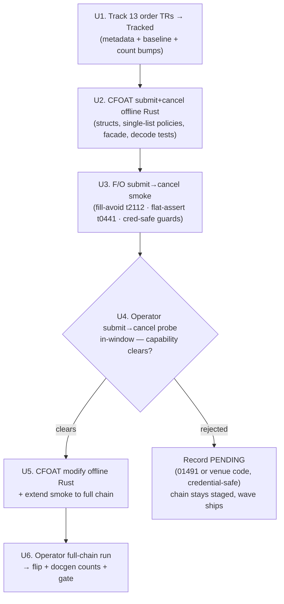

# Order-Surface Track + Domestic F/O Flip Wave - Plan

## Goal Capsule

- **Objective:** Bring the 13 untracked order-transaction TRs to Tracked, and live-flip the domestic futures/options order chain (CFOAT00100/00200/00300) to Implemented on an in-window operator order smoke.
- **Product authority:** SDK maintainer (sunkeunchoi). Live order placement is operator-gated and never run autonomously.
- **Open blockers:** Whether the paper account is F/O-**order**-capable is unproven. Because `01491` (paper-order-incapable) is per-account, the PR #74 order-enabled creds are expected to clear it for F/O — so the real risk is a venue-not-provisioned rejection under an unknown gateway code, possibly one `is_paper_order_incapable()` does not recognize. The CFOAT flip is contingent on a clean in-window order probe; if the submit is rejected (whatever the code), the wave still ships as track-13 + staged offline F/O chain + credential-safe rejection evidence (zero live flips) — an accepted outcome, not a failure.

## Product Contract

### Summary

Track the entire untracked order-transaction surface (13 TRs across domestic F/O, KRX night derivatives, overseas futures, and overseas US stock) and live-flip the one venue plausibly paper-order-capable in a KRX session: the domestic F/O order chain. The flip reuses the proven domestic-stock order infrastructure (`OrderAction`/`org_order_no` in `crates/ls-sdk/src/orders/reconcile.rs`, the flat-assert/retry-cancel harness in `crates/ls-sdk/tests/order_smoke.rs`, the `ls_core::is_paper_order_incapable()` `01491` classifier). The other 10 order TRs are taken to the Tracked rung only — metadata, baseline, and a faithful disposition — with no speculative Rust.

### Problem Frame

Every prior flip wave drained a different pool: domestic equity master/reference/charts, realtime WebSocket channels, account reads, closed-window reads, and most recently four order TRs promoted to Recommended in PR #74. The memory record repeatedly declared the raw pool "exhausted," but that referred to easy paper-viable *reads*. Fifty-three untracked raw TRs still sit in the capture; what is exhausted is the cheap yield, not the pool.

PR #74 changed the order surface specifically: it established order-capable paper credentials (clearing the `01491` "account-not-order-capable" block that stalled the domestic-stock chain for weeks) and promoted CSPAT00601/00701/00801 + t0425 to Recommended. That unlock makes the order-transaction family — which was un-trackable and un-flippable in every prior wave because no order-capable account existed — the highest-leverage remaining segment. The order surface is the product's spine, and this is the first wave that can actually exercise it beyond domestic stock.

The catch: `01491` (paper-order-incapable) is a per-*account* block — an order-enabled account, like the one PR #74 established, is expected to clear it for any venue, F/O included. The real F/O risk is therefore not `01491` but a **venue-not-provisioned rejection** whose gateway code is unknown and may not be one `is_paper_order_incapable()` classifies. The account demonstrably *reads* F/O (CFOEQ11100, 선물옵션가정산예탁금상세, is Implemented), but reading and ordering are separate enablements. This wave commits to a live flip only where capability is plausible and the window is reachable, and tracks the rest flip-ready for a future operator pass.

### Key Decisions

- **Target the order surface over the higher-yield read pool.** The ~20 fresh domestic F/O/stock reads would flip more cleanly, but the order surface is the product spine and PR #74 just unlocked it. Read breadth is deferred to a separate wave.
- **Live-flip the domestic F/O chain only.** CFOAT00100/00200/00300 is a submit→modify→cancel chain on KRX, the one venue plausibly paper-order-capable in a regular session. Night-deriv, overseas-futures, and overseas-stock orders are not attempted live this wave.
- **Tracked-rung-only for the other 10.** Metadata + projected baseline + disposition note, no Rust structs/policies/facades. These venues are mostly night/overseas and likely never flip on paper; speculative offline artifacts for them would be carrying cost with no payoff (YAGNI). They remain flip-ready for a future operator pass that confirms a venue's window and capability.
- **Reuse the domestic-stock order infrastructure; do not rebuild it.** The CFOAT chain rides the existing `OrderAction`/`org_order_no` reconcile types, the autonomy-guarded flat-assert/retry-cancel smoke harness, and the `01491` classifier. The F/O-specific additions are a request shape (numeric-serialized fields, a current valid F/O contract), an F/O price-band source, and an F/O flat-assert read.
- **Flip is contingent, sequenced probe-first, and a contingent miss still ships.** The wave's definition of success is track-13 + a fully-staged offline CFOAT chain. To avoid sinking modify-leg F/O build cost on an unprovable capability, the submit leg plus a single submit→cancel probe is built and run first to resolve order-capability in window; the modify leg and any modify-only F/O infra follow only after the probe clears. A rejection (whatever the code) is recorded as a faithful PENDING disposition with credential-safe evidence, not treated as wave failure.

### Requirements

**Tracking scope**

- R1. All 13 untracked order-transaction TRs reach Tracked: `metadata/trs/<tr>.yaml` + `tr-index.yaml` entry + normalized baseline projected via `make api-drift-renormalize` (projected, never hand-authored). The 13 are CFOAT00100/00200/00300, CCENT00100/00200/00300, CIDBT00100/00900/01000, COSAT00301/00311/00400, COSMT00300.
- R2. Each tracked TR carries a disposition reflecting its real paper-viability: the night-derivative CCENT family mirrors its already-tracked `paper_incompatible` read siblings (CCENQ10100/CCENQ90200); overseas futures (CIDBT) and overseas US stock (COSAT/COSMT) are dispositioned PENDING with the reason (unproven paper-order capability, off-window for a KRX session), not silently left blank.
- R3. The 10 non-CFOAT order TRs reach the Tracked rung only — no request/response structs, no policies, no facade handles, no offline tests authored for them this wave.

**Domestic F/O live flip**

- R4. The domestic F/O order chain (CFOAT00100 submit / CFOAT00200 modify / CFOAT00300 cancel) has callable Rust: request structs with numeric request-body fields serialized as JSON numbers (`string_as_number`, per the IGW40011 gotcha), response structs, REST `{TR}_POLICY` consts (`is_order: true`) registered in the policy-index crosscheck list **only** — never in `slice_rest_policies_are_non_order_rest`, which asserts non-order endpoints — per the implement-order-tr recipe, facade handles, and offline decode tests.
- R5. The F/O order chain reuses the existing order-runtime seams — `OrderAction` + `org_order_no` for the modify/cancel legs, the dedup/kill-switch path, and the `ls_core::is_paper_order_incapable()` classifier — rather than introducing parallel order machinery.
- R6. An operator-run, in-window F/O order smoke exercises submit→modify→cancel against the real LS paper gateway and certifies each leg from its own response. It is registered in the smoke map and a `make live-smoke-<...>` target, and is never run autonomously. Three preconditions are hard requirements, not deferred details:
  - **Fill avoidance.** The submit leg uses a limit price far from the inside market (sourced from the F/O price-band read) so the order rests rather than fills — F/O is margin-bearing and a fill cannot be cancelled. If the flat-assert detects a fill, the operator does not flip; the residual position is recorded and manually flattened.
  - **F/O flat-assert.** Flatness is verified against a named Implemented F/O working-orders/balance read (not the stock t0425 read), keyed on filled-quantity/order-remaining and never on status text. The check is fail-closed: an absent, empty, or ambiguous F/O flat read counts as NOT flat and blocks the flip.
  - **Credential-safe logging.** Every live leg routes through the fail-closed `install_dispatch_log_suppressor()` (which refuses the run if a foreign global tracing subscriber is present) and emits all evidence/failure lines through `scrub_secrets()` — the unscrubbed `ls_core` dispatch debug log (`inner.rs` `rsp_msg`/`body`) is the named account-leak vector the suppressor exists to drop. This applies to the success (flip) evidence path as well as the PENDING path.
- R7. CFOAT00100/00200/00300 flip to `implemented: true` only when their leg of the in-window smoke certifies clean. A leg that certifies may flip even if another pends (per the established gate1/gate2 independence).

**Dispositions, evidence, and gate**

- R8. If the F/O order smoke returns `01491` **or any other paper-order rejection code**, the CFOAT chain is recorded PENDING with credential-safe evidence (per R6's logging precondition); when the code is not `01491`, the new code is recorded verbatim and not assumed to be classified by `is_paper_order_incapable()`. The offline chain stays fully staged for a future flip, and the wave proceeds to ship without the flip.
- R9. Tracking 13 TRs updates every count site that tracked-count changes touch (the api-drift count, docgen `TRACKED_TRS`, the ls-trackers `cli.rs` count literals, `maintained_tr_count`); flipping CFOAT updates the docgen `reference.len` + banner counts. The full gate (`make docs`, `cargo test`, `cargo test -p ls-core`, `make docs-check`) is green at commit.
- R10. The api-drift manifest `refreshed` date is left at the last real raw-refresh date (not bumped by this tracking pass).

### Acceptance Examples

- AE1. **Covers R6, R7.** **Given** an order-capable paper account in a KRX regular session, **when** the operator runs the F/O order smoke and submit/modify/cancel each return valid rows with the account flat afterward, **then** CFOAT00100/00200/00300 each flip to `implemented: true`, certified from their own responses, and `reference.len` + banner counts increment by the flipped count.
- AE2. **Covers R8.** **Given** the same in-window run, **when** the submit leg returns `01491` or another paper-order rejection code, **then** the rejection is captured credential-safe (classified by `is_paper_order_incapable()` when it is `01491`, otherwise recorded verbatim as an unclassified rejection), the chain is recorded PENDING, the offline CFOAT artifacts remain staged, and the wave ships as track-13 with zero live flips.
- AE3. **Covers R2.** **Given** the CCENT night-derivative order family, **when** it is tracked, **then** it carries the same `paper_incompatible` disposition as its CCENQ read siblings without a live order attempt.

### Order-TR disposition map

| TR | Venue | Role | Wave disposition |
|---|---|---|---|
| CFOAT00100 | Domestic F/O | submit | Implement (live flip, contingent) |
| CFOAT00200 | Domestic F/O | modify | Implement (live flip, contingent) |
| CFOAT00300 | Domestic F/O | cancel | Implement (live flip, contingent) |
| CCENT00100 | KRX night deriv | submit | Track-only — paper_incompatible |
| CCENT00200 | KRX night deriv | modify | Track-only — paper_incompatible |
| CCENT00300 | KRX night deriv | cancel | Track-only — paper_incompatible |
| CIDBT00100 | Overseas futures | submit | Track-only — PENDING |
| CIDBT00900 | Overseas futures | modify | Track-only — PENDING |
| CIDBT01000 | Overseas futures | cancel | Track-only — PENDING |
| COSAT00301 | Overseas US stock | order | Track-only — PENDING |
| COSAT00311 | Overseas US stock | modify | Track-only — PENDING |
| COSAT00400 | Overseas US stock | reserved order reg/cancel | Track-only — PENDING |
| COSMT00300 | Overseas US stock | sell/redemption | Track-only — PENDING |

### Scope Boundaries

- The ~20 fresh domestic F/O + stock reads (CFOAQ/CFOBQ/CFOEQ/CFOFQ/CCENQ30100/FOCCQ, t0434, t0150/t0151, t845x), the ~11 overseas reads (COSAQ/COSOQ, g3202–g3204, CIDBQ/CIDEQ), and the ~6 untracked WS channels (DX0/DYC/NPH/NYS/...) are out of scope — a separate read-breadth / realtime wave.
- No live order placement on night-derivative, overseas-futures, or overseas-US-stock venues this wave. Those orders are tracked, not attempted.
- No Implemented→Recommended promotion this wave — the order surface's Recommended promotion is a separate quality pass (and only four order TRs are currently Recommended).
- No autonomous order placement — every live order leg is operator-run.

### Dependencies / Assumptions

- **Order-capable paper credentials in `.env`** (from PR #74) are present and clear `01491` for at least domestic stock. Whether they extend to F/O ordering is the wave's central open question (R8 handles the negative case).
- **A current, valid F/O contract code** is required for the submit leg — stale contract codes fail, mirroring the overseas-futures current-contract gotcha (CUSN26, not a stale code). The smoke must source a live contract, not a hardcoded one.
- **An in-window KRX regular session** is required for the live flip; off-window the smoke hits `01458`/장종료 and the flip pends on window, not capability.
- The existing order infrastructure (`orders/reconcile.rs`, `order_smoke.rs`, `is_paper_order_incapable()`, `live-smoke-order-chain` Makefile target) is present and reusable as the template.

### Outstanding Questions

**Resolve before planning**

- None blocking. The capability unknown (F/O-order-capable?) is intentionally resolved at smoke-time, not planning-time, and both branches are specified (R7/R8).

**Resolved during planning**

- Price-band source: `t2112` (선물/옵션현재가호가조회, Implemented) supplies the inside market (`price`/`bidho1`/`offerho1`) for pricing the resting limit. See KTD2.
- Flat-assert read: no Implemented F/O working-orders (미체결) read exists; `t0441` (선물/옵션잔고평가) structs supply fail-closed fill-detection and the cancel-leg response confirms resting-order removal. See KTD3.

**Deferred to implementation**

- The precise `make live-smoke-<name>` target name and smoke-map row shape (settled when U3 authors the harness).
- Whether `t0441` returns usable rows on the paper account at smoke-time (runtime-dependent; fail-closed handles the empty/ambiguous case).
- The exact F/O request-field set requiring `string_as_number` beyond the obvious price/qty — read from the CFOAT00100 normalized baseline when U2 authors the struct.
- Whether an Implemented F/O read exposes `상한가`/`하한가` for the daily-limit pricing anchor (candidate `t2111`); if none is Implemented, U3 gains a minimal F/O price-band read as a blocking dependency (KTD2).
- Whether a trackable F/O 미체결 (working-orders) read exists to verify post-cancel removal directly; absent one, the operator-flatten runbook (KTD3) covers the cancel-failure case.

### Sources / Research

- Untracked raw pool enumerated from `crates/ls-trackers/baselines/api-drift/raw/ls-openapi-full.json` (53 untracked TRs; 13 are order-transaction, all POST to `/futureoption/order`, `/overseas-futureoption/order`, or `/overseas-stock/order`).
- Order-runtime template: `crates/ls-sdk/src/orders/mod.rs`, `crates/ls-sdk/src/orders/reconcile.rs` (`OrderAction` at line 77, `org_order_no` at line 117), `crates/ls-sdk/tests/order_smoke.rs`.
- `01491` classifier: `crates/ls-core/src/error.rs:99` (`is_paper_order_incapable`) + `ls_core::inner::is_paper_order_incapable`; solution doc `docs/solutions/.../ls-paper-01491-account-not-order-capable.md`.
- Numeric-request-field gotcha (IGW40011): `AGENTS.md` Gotchas + `docs/solutions/integration-issues/ls-gateway-igw40011-numeric-request-fields.md`.
- Recipes: `.agents/skills/track-tr/SKILL.md`, `.agents/skills/implement-order-tr/SKILL.md` (authoritative for the CFOAT chain's struct/policy/facade/smoke work and single-list order-policy registration), `.agents/skills/implement-tr/SKILL.md` (non-order reference), `.agents/skills/promote-tr/references/smoke-map.md`.
- Prior order-wave record: `docs/plans/2026-06-30-002-feat-order-flip-recommended-promotion-wave-plan.md` (PR #74) — the order-capable-credential unlock and the read-vs-chain order-evidence gotcha.

**Product Contract preservation:** Product Contract unchanged — planning added the Planning Contract, Implementation Units, Verification Contract, and Definition of Done below; the R/AE IDs and disposition map above are carried verbatim.

---

## Planning Contract

### Key Technical Decisions

- **KTD1 — Track 13 first, decouple from the flip.** U1 brings all 13 order TRs to the Tracked rung (metadata + projected baseline) and is the wave's floor: it lands green regardless of what the live smoke later returns. Adding tracked TRs bumps `maintained_tr_count` and `TRACKED_TRS` but moves no `reference.len`/banner count (those track Implemented), so U1 is gate-complete on its own.
- **KTD2 — Price the resting limit at the daily price limit, fail-closed.** Price the order at the daily price limit *away* from the market — `하한가` for a buy, `상한가` for a sell — so it cannot fill. Daily price limits are static and reliably populated on paper, unlike the intraday 호가 book (`t2112`), which prior waves found **paper-empty for F/O intraday feeds even mid-session**. Source the limit from an Implemented F/O read carrying `상한가`/`하한가` (candidate `t2111`; verify its Implemented status — if not Implemented, track+implement a minimal price-band read as a U3 dependency). The smoke **fail-closes**: if it cannot source a valid, non-empty price anchor it aborts and places no order — a missing anchor must never fall back to a near-market (fillable) price. `t2112`'s inside market (`price`/`bidho1`/`offerho1` in `crates/ls-sdk/src/market_session/quote_deriv.rs`) may supplement the anchor but is never relied on alone.
- **KTD3 — Two-part flatness check, fail-closed, with an explicit cancel-failure path.** `t0441` (선물/옵션잔고평가; structs in `crates/ls-sdk/src/account/holdings.rs`, fields `jqty`/`cqty`) detects **filled** residuals only (잔고 = positions); it does **not** see a resting *unfilled* order. Flatness therefore has two parts: (1) `t0441` shows no fill (fail-closed: unreadable/empty/ambiguous = NOT flat → no flip), and (2) the resting order is confirmed gone. Because no Implemented F/O 미체결 (working-orders) read exists to scan the board, removal is confirmed only from a **clean** cancel response. The dangerous asymmetric case — submit succeeds (order rests), then the cancel leg is rejected or errors — is handled explicitly: the smoke does **not** assume flat, emits a loud operator-action-required signal, and the runbook requires a manual board check + manual flatten. `t0441` cannot detect this case. `t0441` is currently `implemented: false`; the smoke exercises its structs test-locally and this wave does **not** fold a t0441 flip into scope. (A future Implemented F/O working-orders read would let the smoke verify removal directly — follow-up, not a blocker for the operator-gated runbook.)
- **KTD4 — Order policies register in the policy-index crosscheck only.** CFOAT `{TR}_POLICY` consts (`is_order: true`) go in `crates/ls-core/src/endpoint_policy/order.rs` and the `policies` array of `crates/ls-core/tests/policy_index_crosscheck.rs` — never in `slice_rest_policies_are_non_order_rest()` (`crates/ls-core/src/endpoint_policy/mod.rs`), which asserts `is_order: false`. This mirrors the existing CSPAT00601/00701/00801 policies; t0425 (a non-order read) is the only order-module policy that appears in both.
- **KTD5 — Reuse the order_smoke autonomy + leak guards verbatim.** The F/O smoke extends `crates/ls-sdk/tests/order_smoke.rs` rather than spawning a new binary, inheriting `autonomy_guard()` / `validate_nonce()` (CI/no-TTY refusal, TTL nonce), `install_dispatch_log_suppressor()` (fail-closed), and `scrub_secrets()`. A new F/O `flat_verdict`-style helper consumes `t0441` rows (the existing `flat_verdict` is t0425-typed).
- **KTD6 — Sequence the build probe-first.** Offline submit+cancel (U2) and the submit→cancel smoke (U3) come before the operator probe (U4); the modify leg (U5) and full-chain run (U6) are built only after U4 clears capability. The primary benefit is safety — resolving order-capability with the minimal submit→cancel order footprint before risking a three-leg live chain; it also keeps modify-leg build cost from being sunk on a `01491`/venue-rejection outcome.

### High-Level Technical Design

The flip-leg independence (R7): U4 may flip CFOAT00100/00300 from the probe while U6's modify leg pends, and U6 may flip CFOAT00200 independently — each leg certifies from its own response.

### Sequencing

U1 is independent and lands first (the wave floor). U2→U3→U4 is the probe chain. U5→U6 is gated on U4 clearing capability; if U4 records PENDING, U5/U6 do not run and the wave ships at U4. The offline units (U1, U2, U5-build) keep the gate green at every commit; the operator units (U4, U6) are live-gateway actions, run by the maintainer in a KRX session, never autonomously.

---

## Implementation Units

### U1. Track the 13 order TRs to the Tracked rung

- **Goal:** Bring all 13 untracked order TRs to Tracked with faithful dispositions; establish the wave floor.
- **Requirements:** R1, R2, R3, R9 (tracked-count sites), R10.
- **Dependencies:** none.
- **Files:** `metadata/trs/{CFOAT00100,CFOAT00200,CFOAT00300,CCENT00100,CCENT00200,CCENT00300,CIDBT00100,CIDBT00900,CIDBT01000,COSAT00301,COSAT00311,COSAT00400,COSMT00300}.yaml` (create), `metadata/tr-index.yaml` (add 13 entries), `crates/ls-trackers/baselines/api-drift/normalized/trs/<tr>.json` (projected via `make api-drift-renormalize`, not hand-authored), `crates/ls-docgen/src/lib.rs` (`TRACKED_TRS` count 307→320), `crates/ls-trackers/tests/api_drift.rs` (`maintained_tr_count` assertion 307→320), and the **four** `307` literals in `crates/ls-trackers/src/cli.rs` (lines ~1811 — including its `three-hundred-seven` prose annotation — ~1876, ~2779, ~2787 → 320; the 365 full-inventory `code_set` literal at ~1812 is unchanged, since tracking adds no raw codes).
- **Approach:** Follow `.agents/skills/track-tr/SKILL.md` end to end per TR. Wire field names/types/array-shape come from the raw capture, not guesswork. Dispositions per R2: CCENT family → `paper_incompatible: true` mirroring CCENQ10100/CCENQ90200; CIDBT/COSAT/COSMT → PENDING with the unproven-capability/off-window reason. CFOAT trio is Tracked here (its flip is U4/U6). Leave the api-drift manifest `refreshed` date untouched (R10).
- **Patterns to follow:** prior batch-track waves (sector-cluster, closure-flip-ws-batch) — the count-site list and the projected-baseline rule.
- **Test scenarios:**
  - `Covers R1.` After tracking, `cargo test -p ls-core` metadata validation passes with 13 new TRs present in the index.
  - `Covers R9.` `TRACKED_TRS` and `maintained_tr_count` assertions reflect 320; no `reference.len`/banner change (Tracked ≠ Implemented).
  - `Covers R2.` Each new yaml carries the correct disposition facet (CCENT `paper_incompatible: true`; CIDBT/COSAT/COSMT PENDING reason present).
  - `Covers R10.` Manifest `refreshed` date is unchanged from the prior value.
- **Verification:** Full gate green (`make docs`, `cargo test`, `cargo test -p ls-core`, `make docs-check`) with 13 TRs Tracked and zero implemented-count movement.

### U2. CFOAT submit + cancel — callable Rust (probe legs)

- **Goal:** Author offline-complete submit (CFOAT00100) and cancel (CFOAT00300) request/response structs, policies, facade, and decode tests.
- **Requirements:** R4, R5 (submit/cancel legs).
- **Dependencies:** U1.
- **Files:** `crates/ls-sdk/src/orders/` (new F/O order module mirroring `mod.rs`'s CSPAT structs), `crates/ls-core/src/endpoint_policy/order.rs` (`CFOAT00100_POLICY`, `CFOAT00300_POLICY`, `is_order: true`), `crates/ls-core/tests/policy_index_crosscheck.rs` (add both to the `policies` array + its use-import), the facade handle (`Orders` or an F/O sibling), and offline decode tests alongside the structs.
- **Approach:** Mirror `CSPAT00601InBlock1` (submit) and the CSPAT cancel struct, swapping in F/O request fields read from `crates/ls-trackers/baselines/api-drift/normalized/trs/CFOAT00100.json`. Numeric request fields (price, qty, and any F/O-specific numerics) use `string_as_number` (KTD; IGW40011). Reuse `OrderAction`/`org_order_no` from `reconcile.rs` for the cancel leg keyed on the submit's order number. Register policies per KTD4 (crosscheck list only).
- **Patterns to follow:** `crates/ls-sdk/src/orders/mod.rs` (CSPAT struct layout), `crates/ls-core/src/endpoint_policy/order.rs:21-90` (policy const shape).
- **Test scenarios:**
  - Happy path: round-trip decode of a CFOAT00100 response sample (echo block + order-number block) deserializes without loss.
  - Edge: a numeric request field serializes as a JSON number, not a string (guards IGW40011).
  - `Covers R5.` Cancel request built from a submit `org_order_no` carries the original order number in the F/O cancel field.
  - Crosscheck: `policy_index_crosscheck` passes with the two new order policies; `slice_rest_policies_are_non_order_rest` is unchanged (they are not added there).
- **Verification:** `cargo test` + `cargo test -p ls-core` green; CFOAT00100/00300 callable offline; no live call yet.

### U3. F/O submit→cancel order smoke harness

- **Goal:** Extend the order smoke to a submit→cancel F/O probe carrying the three R6 safety preconditions, with a Makefile target and smoke-map row.
- **Requirements:** R6, R8 (evidence capture path).
- **Dependencies:** U2.
- **Files:** `crates/ls-sdk/tests/order_smoke.rs` (F/O probe path + F/O `flat_verdict` helper over `t0441` rows), `Makefile` (`live-smoke-fo-order` `.PHONY` target sourcing paper creds), `.agents/skills/promote-tr/references/smoke-map.md` (CFOAT chain row).
- **Approach:** Reuse `autonomy_guard()`, `validate_nonce()`, `install_dispatch_log_suppressor()`, `scrub_secrets()` verbatim (KTD5) — install the suppressor before the **first** dispatch, including the price-band and `t0441` reads, whose raw bodies carry account data. Price the submit limit at the daily price limit away from market (KTD2); if no valid, non-empty price anchor can be sourced, **abort and place no order**. After submit, read `t0441` to detect any fill — fail-closed if unreadable/empty/ambiguous (KTD3). Cancel keyed on the submit order number; confirm removal only from a **clean** cancel response. On a non-clean (rejected/errored) cancel, do **not** assume flat — raise a loud operator-action-required signal (KTD3 cancel-failure path). Route every evidence/diagnostic line — including the `t0441`-row fill diagnostic — through `scrub_secrets()`, not just `rsp_msg`. Certify each leg from its own response (R6). On a rejection code, capture it credential-safe and classify only when `01491` (R8).
- **Execution note:** Live order placement — never run autonomously; gated behind the autonomy guard + human-present nonce.
- **Patterns to follow:** `crates/ls-sdk/tests/order_smoke.rs` `flat_verdict()` (line ~654) and the `live-smoke-order-chain` Makefile target (line ~108).
- **Test scenarios:**
  - `Covers R6.` Offline unit over the F/O `flat_verdict` helper: `t0441` rows with `jqty>0` → Fill (block flip); empty/unreadable → NOT flat (fail-closed); zero-position → Flat.
  - `Covers R6.` Offline cert-predicate test: feed synthetic submit/cancel responses (clean success; soft-reject in a success-shaped envelope; partial/ambiguous; missing order-number block) and assert the per-leg certification flips only on a genuinely clean row — this guards the leg-flip decision U4 exercises live (PR #74 shipped a status-text cert bug caught only by review).
  - `Covers R6.` The probe path invokes `install_dispatch_log_suppressor()` before any dispatch and routes evidence through `scrub_secrets()`; a synthetic account-number-shaped value embedded in a `t0441` **row field** (not only `rsp_msg`) is masked.
  - `Covers R8.` A simulated `01491` response is classified by `is_paper_order_incapable()`; a simulated non-`01491` rejection is recorded verbatim and NOT asserted as classified.
  - Edge: the price-band read returns empty/zero → the smoke aborts and places no order (fail-closed pricing anchor).
  - Edge: a simulated non-clean cancel response → the smoke does not report flat and raises the operator-action-required signal.
  - Edge: missing/human-absent nonce or CI env → smoke refuses to place an order.
- **Verification:** Offline portions of the smoke pass under `cargo test`; the live path compiles and is wired to the Makefile target but is not executed in CI.

### U4. Operator probe — submit→cancel in-window; flip or record PENDING

- **Goal:** Resolve F/O order-capability with a real in-window probe; flip CFOAT00100/00300 on clean certification, else record PENDING.
- **Requirements:** R7 (submit/cancel legs), R8.
- **Dependencies:** U3.
- **Files:** `metadata/trs/CFOAT00100.yaml`, `metadata/trs/CFOAT00300.yaml` (flip `implemented: true` on cert), evidence capture (credential-safe), docgen regen outputs.
- **Approach:** Maintainer runs `make live-smoke-fo-order` in a KRX regular session with a current valid F/O contract and the order-enabled paper creds. On clean submit+cancel (account flat, each leg certified from its response): flip CFOAT00100/00300 to Implemented, bump `reference.len` + banner counts for the flipped legs, regen docs. On any rejection: record PENDING with the captured code (R8), leave the offline chain staged, and ship the wave at this unit.
- **Execution note:** Operator-run live gateway action; not autonomous. This is the wave's go/no-go gate for the modify leg (KTD6).
- **Test scenarios:** `Test expectation: none` — operator live-run + metadata flip. The leg-flip decision logic is offline-tested in U3 (cert-predicate test). When CFOAT00100/00300 flip, U4 itself runs `make docs` + `make docs-check` so its own commit is green; U6 re-runs the gate after the modify-leg flip.
- **Verification:** Either CFOAT00100/00300 are Implemented with credential-safe evidence and the gate is green, or both stay Tracked with a recorded PENDING disposition and the gate is green.

### U5. CFOAT modify — callable Rust + full-chain smoke (gated on U4)

- **Goal:** Add the modify leg (CFOAT00200) and extend the smoke to submit→modify→cancel. Built only after U4 clears capability.
- **Requirements:** R4, R5 (modify leg), R6 (full chain).
- **Dependencies:** U4 (capability cleared).
- **Files:** the F/O order module (add CFOAT00200 structs), `crates/ls-core/src/endpoint_policy/order.rs` (`CFOAT00200_POLICY`), `crates/ls-core/tests/policy_index_crosscheck.rs` (add to `policies` array), `crates/ls-sdk/tests/order_smoke.rs` (extend probe to submit→modify→cancel).
- **Approach:** Mirror `CSPAT00701InBlock1` (modify) — `org_order_no` + revised price/qty as numeric fields. Register the policy per KTD4. Extend the smoke so modify lands between submit and cancel, each leg certified from its own response; flat-assert still fail-closed via `t0441`.
- **Patterns to follow:** CSPAT00701 modify struct; the gate1/gate2 chain structure in `order_smoke.rs`.
- **Test scenarios:**
  - Happy path: round-trip decode of a CFOAT00200 response (new order number vs original).
  - `Covers R5.` Modify request carries `org_order_no` from the submit and the revised price as a JSON number.
  - Crosscheck passes with the third order policy added.
- **Verification:** `cargo test` + `cargo test -p ls-core` green; full submit→modify→cancel smoke compiles and is Makefile-wired.

### U6. Operator full-chain run — flip modify leg, docgen, gate

- **Goal:** Run the full chain in-window; flip CFOAT00200 on certification; finalize docgen counts and the gate.
- **Requirements:** R7 (modify leg), R9.
- **Dependencies:** U5.
- **Files:** `metadata/trs/CFOAT00200.yaml` (flip on cert), docgen regen outputs (`reference.len` + banner counts).
- **Approach:** Maintainer runs the full submit→modify→cancel smoke in window. On clean modify certification, flip CFOAT00200; regen docs so `reference.len`/banner reflect all flipped CFOAT legs. Run the full gate.
- **Execution note:** Operator-run live gateway action; not autonomous.
- **Test scenarios:** `Test expectation: none` — operator live-run + metadata flip; the gate (`make docs-check`) is the correctness check for the docgen counts.
- **Verification:** Full gate green with the flipped CFOAT legs' counts reflected, or CFOAT00200 stays Tracked with a recorded PENDING and the gate is green.

---

## Verification Contract

| Gate | Command | Applies to | Done signal |
|---|---|---|---|
| Metadata + policy crosscheck | `cargo test -p ls-core` | U1, U2, U5 | 13 TRs in index; order policies in crosscheck-only; `slice_rest_policies_are_non_order_rest` unchanged |
| Workspace tests | `cargo test` | U2, U3, U5 | Offline decode + F/O `flat_verdict` + smoke offline paths pass |
| Docs regen + match | `make docs` then `make docs-check` | U1, U4, U6 | Generated docs match committed; `TRACKED_TRS`/`maintained_tr_count` at 320; `reference.len`/banner reflect flipped legs |
| Live F/O probe (operator) | `make live-smoke-fo-order` | U4 | Submit+cancel certified flat in window; or credential-safe PENDING recorded; or operator-action-required raised on a non-clean cancel (manual board check + flatten) |
| Live F/O chain (operator) | full submit→modify→cancel smoke | U6 | Modify leg certified, or credential-safe PENDING recorded |

## Definition of Done

- All 13 order TRs are Tracked with faithful dispositions (R1–R3); `TRACKED_TRS` and `maintained_tr_count` at 320; manifest `refreshed` unchanged (R9, R10).
- The CFOAT submit/cancel — and, if U4 cleared, modify — legs have offline-complete callable Rust with order policies in the crosscheck list only (R4, R5).
- The F/O order smoke carries all three R6 preconditions — fill avoidance (daily-limit pricing, fail-closed on a missing anchor), two-part flatness (`t0441` fill-detection + clean-cancel removal, with the cancel-failure operator-flatten path), and credential-safe logging (including the `t0441`-row diagnostic) — and is operator-gated, never autonomous.
- The in-window operator probe ran: CFOAT legs that certified clean are Implemented with credential-safe evidence and reflected in `reference.len`/banner; any rejection is recorded PENDING (with verbatim non-`01491` codes) and the offline chain stays staged (R7, R8).
- The full gate is green at every commit, independent of whether the live flip landed.
