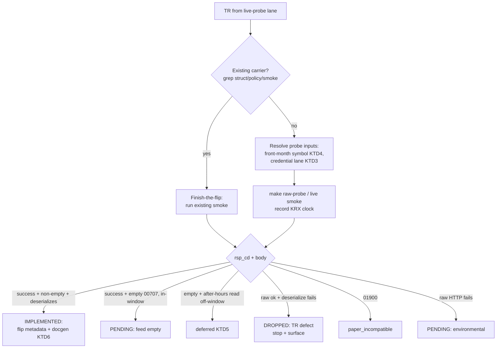

# Closed-Window Probe-and-Flip Sweep - Plan

## Goal Capsule

- **Objective:** Drive every one of the 41 Tracked-not-Implemented TRs to exactly one terminal disposition this wave — flipped Implemented if it serves a non-empty deserializable row under KRX closure, or a recorded terminal reason (PENDING / HELD / paper_incompatible / deferred) if it cannot.
- **Product authority:** Repo owner (sunkeunchoi); decisions confirmed in this brainstorm.
- **Execution profile:** Recipe-driven sweep — most TRs disposition without code; flips follow the frozen `implement-tr` recipe. Live probes need `.env` paper credentials with `LS_TRADING_ENV=paper`; lane-scoped account re-probes need `.env.domestic_option` / `.env.overseas_option`.
- **Stop conditions:** Stop and surface if (a) a TR's raw HTTP succeeds but the SDK deserialize fails on a non-empty body (a TR wire-shape defect — record DROPPED, do not flip), or (b) the gate (`cargo test -p ls-core` crosscheck) goes red after a flip and the cause isn't a known count-family site. Do **not** attempt any order TR (F/O or overseas) — orders reject off-window.
- **Tail ownership:** Single PR; gate green before commit; Recommended deferred for all flips.
- **Open blockers:** None block planning. Flip yield depends on live paper-feed presence under closure, unknown until probed.
- **Product Contract preservation:** Product Contract unchanged — `ce-plan` added only Planning Contract, Implementation Units, Verification Contract, and Definition of Done below.

---

## Product Contract

### Summary

Raw paper-viable pool is exhausted, so this is a pure Tracked→Implemented disposition wave run while KRX is closed. Probe the not-already-terminal subset of the 41 Tracked-not-Implemented TRs under closure, flip whatever serves non-empty deserializable data right now (t1109 is a speculative re-probe candidate, not a likely flip — see R5), and record one terminal disposition for every TR that cannot move tonight.

### Problem Frame

The TR support pipeline (Raw → Tracked → Implemented → Recommended) has been ground down across ~15 prior waves. The raw paper-viable pool is exhausted (0 `support: raw` TRs; 320 of 365 upstream codes maintained, the 45-code remainder deliberately excluded as non-paper-viable or case-collision WS codes). What remains is a residue of 41 Tracked-not-Implemented TRs that survived every prior flip attempt — nearly all hard-gated by session window, funding, gateway defects, paper-incompatibility, or unproven capability.

KRX is closed at execution time. That removes the two high-value lanes (live F/O orders, open-window reads) but is *not* dead time: closure is a different trading session, so a feed that returned empty during the open window may behave differently now — though prior waves show session feeds often stay empty under closure too, so re-probes are worth running but not expected to yield. The pipeline also carries a quiet debt — TRs sitting at Tracked with stale or implicit "still gated" labels that have never been pinned to an explicit terminal reason. This wave converts that residue into either flips or honest records.

### Key Decisions

- **Probe fresh, don't trust prior window-gating labels.** Closure is a different trading session, so a feed that returned empty during the open window may behave differently now. Prior closed-window waves found master/reference/account/board reads serve under closure while session feeds generally do not — so re-probe each not-already-terminal TR fresh, but treat session-feed flips (notably t1109, whose metadata facet is `venue_session: krx_regular`) as speculative rather than expected. Static raw-probe empty does not by itself prove session-independence — try a live-sourced identifier before recording PENDING.
- **Disposition completeness over flip count.** Success is every one of the 41 reaching a terminal state this wave, even when most land as records rather than flips. A clean, honest ledger is the guaranteed deliverable; flips are upside.
- **Orders stay deferred, not attempted.** The F/O order chain rejects off-window. Attempting it tonight would only re-derive `01458 장종료`. It is documented as a follow-up open-window/operator wave, not probed here.

### Requirements

**Probe and classify**

- R1. Partition the 41 first. TRs already carrying a terminal metadata disposition — `paper_incompatible` (g31xx, night-deriv CCENT/CCENQ) and the carried-forward terminal cases (t1631 / t3102 / t1964) — are routed to ledger-confirmation only, with no live attempt (per R6, R7, AE3). Raw-probe only the remaining not-already-terminal subset under current KRX closure using the credential-safe failure classifier, recording a per-TR result (serves non-empty deserializable row / empty `00707` / gateway-defect code / paper_incompatible `01900` / structural-input-blocked).
- R2. Before recording a session-dependent TR as PENDING, attempt a live-sourced identifier rather than only a static fixture id — a static empty does not prove the feed is genuinely unavailable under closure.
- R3. Before authoring any flip artifact, grep for an already-staged carrier (struct + policy + facade + smoke). For fully-carried TRs the flip is metadata + docgen only — do not re-author.

**Flip the servers**

- R4. Flip any TR that returns a non-empty deserializable row under closure to Implemented: callable Rust, offline tests, policy registered in both crosscheck lists (REST) or the crosscheck list only (WebSocket), and a Paper Live Smoke whose witness is a substantive modeled field, not `body_len` or array presence alone.
- R5. Treat t1109 as a speculative re-probe, not the headline candidate. First verify whether its prior empty probe was taken during the open window or under closure; if it was already smoked empty under closure, retire it as a candidate and record its carry-forward disposition. Otherwise re-probe under closure and flip only if it serves a non-empty deserializable row; record PENDING if paper-empty.

**Disposition the rest**

- R6. Record a terminal disposition with an explicit reason for every probed TR that does not flip: PENDING (session/funding-empty), HELD (structural input unresolved), paper_incompatible (gateway carries no data for the feed), or deferred (genuine open-window read; flip in a future live-session wave). Confirm — rather than silently inherit — dispositions already present in metadata (night-deriv CCENT/CCENQ, overseas g31xx).
- R7. Carry forward the known terminal cases without re-litigating: t1631 permanent PENDING (gateway `IGW40014` serializing its own response), t3102 HELD (no off-hours NWS frame), t1964 HELD (10 filter-enum inputs unresolved). Re-probe the account-empty reads (o3107 / o3127 / t0441) in case account state changed.

**Counts and gate**

- R8. Maintain count families correctly: flips move docgen `reference.len` and `banner_trs` by the flip count; `maintained_tr_count` stays 320 (no new tracking this wave). Update the docgen flip-wave comment ledger.
- R9. Keep the gate green throughout: `make docs`, `cargo test`, `cargo test -p ls-core`, `make docs-check`. Recommended stays deferred for all newly-flipped TRs.

### Acceptance Examples

- AE1. **Covers R4, R5.** When t1109 is re-probed under closure and returns a non-empty deserializable after-hours row, it flips to Implemented with the substantive field asserted as the smoke witness, `reference.len` increments by 1, and `maintained_tr_count` stays 320.
- AE2. **Covers R2, R6.** When a session-dependent read returns empty `00707` under closure even with a live-sourced id, it is recorded PENDING with the reason (paper feed empty under closure), and no flip artifact is authored.
- AE3. **Covers R6, R7.** When a TR's metadata already carries `paper_incompatible: true` (e.g. an overseas g31xx read), the wave confirms the disposition in the ledger without a live attempt rather than re-probing it as a flip candidate.
- AE4. **Covers R8, R9.** When the wave produces 0 flips (every probed TR empty or terminal), the gate stays green, all counts are unchanged, and the deliverable is the updated disposition ledger alone.

### Success Criteria

- Every one of the 41 Tracked-not-Implemented TRs has exactly one recorded terminal disposition after this wave.
- Each flip is certified from its own non-empty response with a substantive-field witness; no flip rests on `body_len` or empty-`00707`.
- Gate green (`make docs` / `cargo test` / `cargo test -p ls-core` / `make docs-check`); generated docs match committed.
- Realistic flip floor ~1–3 (possibly 0); the wave is still a success at 0 flips if the ledger is honest and complete.

### Scope Boundaries

**Deferred for later (open-window / operator run):**

- F/O order chain CFOAT00100 / CFOAT00200 / CFOAT00300 — needs an operator-run live paper F/O order smoke in an open window.
- Genuine open-window reads (t1951 / t1973 / t2212 / t2407 / t8404 / t8427, and t2106 whose memo populates intra-session) — these are within the 41, so they are probed under closure per R1, return empty `00707`, and are recorded with the `deferred` disposition; the flip itself happens only during a live KRX session with paper data present.

**Outside this wave's identity:**

- The 45 untracked upstream codes (Raw→Tracked breadth) — a separate lane; this wave adds no new tracking.
- Recommended promotions — no Implemented→Recommended moves this wave.
- Re-litigating known terminal cases (t1631 / t3102 / t1964) beyond recording their disposition.

### Dependencies / Assumptions

- **Assumption (weak, unverified):** t1109 might serve under closure, but its metadata facet is `venue_session: krx_regular` and prior precedent has session feeds empty under closure — so this is a long shot, not a likely flip. If paper-empty, it becomes PENDING — the wave does not depend on it.
- **Assumption:** re-probe the account reads (o3107 / o3127 / t0441) only when a triggering state change (account funded, new position taken) is plausible since their last PENDING record; absent any such change, carry forward the prior disposition without re-probing.
- **Dependency:** `.env` paper credentials with `LS_TRADING_ENV=paper`; the `raw-probe` classifier (`make raw-probe` / direct cargo `raw_http_probe`) for credential-safe probing.

### Sources / Research

- Grounding dossier (this session): raw pool exhausted, 41 Tracked-not-Implemented enumerated, count-family file:line pointers.
- `crates/ls-trackers/baselines/api-drift/normalized/trs/<tr>.json` — wire shapes for any flip.
- `.agents/skills/implement-tr/SKILL.md`, `.agents/skills/implement-realtime-tr/SKILL.md` — flip recipes and crosscheck-registration rules.
- `metadata/PROVISIONALITY-LEDGER.md` — per-TR provisional-facet ledger to update on disposition.
- Prior closed-window flip waves (plans 2026-06-26-003, 2026-06-27/28 -001, 2026-06-28 -001 through -004) — precedent that master/reference/account/board reads serve under closure while session feeds do not.

### Outstanding Questions

**Deferred to Implementation:**

- The current front-month symbol for each dated F/O / overseas read, and the trading-day input some account reads require — both are live-sourced at probe time (KTD4), not knowable now. The probe-vs-confirm partition itself is resolved in R1 + KTD1.

---

## Planning Contract

### Key Technical Decisions

- KTD1. **Three-lane partition before any live call.** Classify each of the 41 from existing metadata facets and TR family: (a) **confirm-only** — TRs already carrying a terminal disposition (`paper_incompatible` g31xx + night-deriv CCENQ/CCENT; carried-forward t1631/t3102/t1964) get a ledger re-affirmation with no live attempt; (b) **live-probe** — the not-already-terminal reads; (c) **deferred** — order TRs (F/O CFOAT, overseas CIDBT/COSAT/COSMT), which reject off-window and are not probed. This is the mechanism that keeps probe labor proportional (product-lens / scope-guardian review finding). Grounded in `docs/solutions/conventions/tr-pool-exhaustion-and-closure-viability.md`.
- KTD2. **Flip gate = non-empty deserializable witness, clock-stamped.** Apply the outcome checklist per probed TR: success `rsp_cd` + non-empty + deserializes → IMPLEMENTED; success + empty (`00707`) in-window → PENDING; success + empty on an after-hours read run off-window → `deferred` (KTD5); `01900` → paper_incompatible; raw HTTP ok + SDK deserialize fails → DROPPED (TR wire-shape defect, stop condition); raw HTTP fails → PENDING (environmental). These six branches match the HTD diagram. Assert the substantive modeled field is non-empty before flipping — never `body_len` or array-presence alone. Record the KRX session clock at every smoke. See `docs/solutions/conventions/market-hours-read-empty-result-disposition.md` and `.agents/skills/implement-tr/references/author-patterns.md`.
- KTD3. **Account reads re-probe under their credential lane before PENDING.** The gateway resolves the target account from the OAuth token, so o3107 / o3127 / t0441 may auth as the wrong account and return empty/all-default. Re-probe each under its `instrument_domain` lane (`.env.domestic_option` / `.env.overseas_option`) before recording PENDING; apply the holdings gate (read the typed array length, not `body_len`; an all-default 1-row `00136` is not a flip). `docs/solutions/conventions/ls-account-token-bound-credential-lanes.md`, `…/closed-window-account-capacity-reads-all-default.md`.
- KTD4. **Re-resolve dated symbols to front-month before recording feed-unprovisioned.** Dated F/O / overseas reads return success + empty when their contract symbol has rolled — indistinguishable from an unprovisioned feed. Re-resolve to the current front-month (`t8467`/`t8401` masters for domestic F/O; `make live-smoke-o3101` for overseas-futures) and re-probe before any PENDING. `docs/solutions/conventions/stale-smoke-symbol-masks-provisioned-feed.md`.
- KTD5. **t1109 and after-hours reads disposition by the KRX clock.** t1109 (시간외체결) needs the post-15:30 after-hours window; an empty result during regular hours or a fully-closed night/weekend is expected, not a paper-unavailability signal. If the run is outside the after-hours window, record `deferred` (to an after-hours run), not PENDING. `docs/solutions/conventions/market-hours-read-empty-result-disposition.md`.
- KTD6. **A flip moves docgen counts only.** Tracked→Implemented bumps `crates/ls-docgen/src/lib.rs` `reference.len()` and adds to `banner_trs` — nothing else. `maintained_tr_count` (`crates/ls-trackers/tests/api_drift.rs`), the `cli.rs` shape-count literals, and `TRACKED_TRS` stay frozen at 320. Before authoring any flip artifact, grep for an existing carrier (struct / `{TR}_POLICY` / smoke / Makefile target) — fully-carried "finish-the-flip" TRs (t1109/t8427/t2106 per prior wave; t1964 is confirm-only HELD this wave) are metadata + docgen only; do not re-author. `docs/solutions/conventions/implement-tr-registration-sites.md`, `…/check-existing-carrier-before-authoring-flip.md`.
- KTD7. **New carriers only: numeric request fields by type.** If a genuinely new carrier must be authored, integer request fields use `#[serde(serialize_with = "ls_core::string_as_number")]` and fractional fields use `string_as_decimal` — a quoted numeric triggers `IGW40011`. Read the wire type from the normalized baseline, decide per field. `docs/solutions/integration-issues/ls-gateway-igw40011-numeric-request-fields.md`.

### High-Level Technical Design

Per-TR disposition flow (applies to every TR in the live-probe lane):

The confirm-only lane skips A→F entirely: it re-affirms the existing terminal disposition in the ledger. The deferred-orders lane is never probed.

### Sequencing

U1 (partition) gates everything. U2 (confirm-only) and U3 (live probe) are independent after U1 and can run in either order. U4 (flips) consumes U3's IMPLEMENTED verdicts. U5 (disposition records) consumes U2 + U3 + U4 outcomes. U6 (counts + gate) runs last.

---

## Implementation Units

### U1. Partition the 41 and build the probe worklist

- **Goal:** Produce the three-lane worklist (confirm-only / live-probe / deferred-orders) and, for each live-probe TR, its resolved probe inputs.
- **Requirements:** R1, R3.
- **Dependencies:** none.
- **Files:** read `metadata/trs/*.yaml` (support + facets), `metadata/tr-index.yaml`, `metadata/PROVISIONALITY-LEDGER.md`; no writes this unit.
- **Approach:** Enumerate the 41 Tracked-not-Implemented TRs (grep `implemented: false`). Classify each per KTD1. For each live-probe TR, grep for an existing carrier (KTD6) and record its `instrument_domain` lane (KTD3) and whether it is a dated-symbol read needing front-month resolution (KTD4). Output the worklist as a scratch note, not a committed artifact.
- **Test scenarios:** Test expectation: none — classification/worklist setup, no behavioral change.
- **Verification:** Worklist accounts for all 41; each TR lands in exactly one lane; live-probe entries carry lane + carrier + symbol-resolution flags.

### U2. Confirm-only disposition pass

- **Goal:** Re-affirm the terminal disposition of the already-terminal TRs without a live attempt.
- **Requirements:** R6, R7.
- **Dependencies:** U1.
- **Files:** `metadata/PROVISIONALITY-LEDGER.md`; `metadata/trs/<tr>.yaml` only if a facet reason needs updating.
- **Approach:** For g31xx + CCENQ/CCENT (`paper_incompatible`), t1631 (PENDING — gateway `IGW40014`), t3102 (HELD — no off-hours NWS frame), t1964 (HELD — filter-enum inputs unresolved): confirm the existing facet/ledger reason still holds and stamp the review date. No probe, no flip. Distinguish net-new from re-confirmed in the recorded note (per the deferred D5 finding).
- **Test scenarios:** Test expectation: none — metadata/ledger re-affirmation, no behavioral change.
- **Verification:** Every confirm-only TR has a current-dated ledger/facet entry; none was probed live.

### U3. Live closed-window probe pass

- **Goal:** Probe the not-already-terminal subset under closure and assign each an outcome verdict (KTD2).
- **Requirements:** R1, R2, R4, R5.
- **Dependencies:** U1.
- **Files:** invokes `make raw-probe` / existing `make live-smoke-<tr>`; reads normalized baselines under `crates/ls-trackers/baselines/api-drift/normalized/trs/`.
- **Approach:** For each live-probe TR, resolve front-month symbol (KTD4) and credential lane (KTD3) first, then probe and record `[http / rsp_cd / body_len]` plus the KRX clock. Apply KTD2's outcome checklist. Treat t1109 + after-hours reads per KTD5. Treat account reads (o3107/o3127/t0441) per KTD3 (lane re-probe + holdings gate). Session-gated open-window reads (t1951/t1973/t2212/t2407/t8404/t8427) are expected to return empty `00707` → `deferred`.
- **Test scenarios:**
  - Happy: a TR returns success + non-empty + deserializes → verdict IMPLEMENTED (hand to U4).
  - Edge: a dated F/O read returns empty on a stale symbol → re-resolve front-month → re-probe before any verdict.
  - Edge: an account read returns empty/all-default on the default lane → re-probe under its lane → holdings gate decides flip vs PENDING.
  - Error: raw HTTP ok but SDK deserialize fails on a non-empty body → verdict DROPPED, stop and surface (do not flip).
  - Clock: t1109 empty outside the after-hours window → verdict `deferred`, not PENDING.
- **Verification:** Every live-probe TR has a recorded verdict with its clock stamp and `rsp_cd`; no PENDING was recorded for an account read without a lane re-probe or a dated read without front-month resolution.

### U4. Flip the servers

- **Goal:** Flip each TR that earned an IMPLEMENTED verdict in U3 to `support.implemented: true`.
- **Requirements:** R4, R8.
- **Dependencies:** U3.
- **Files (finish-the-flip carriers, the expected majority):** `metadata/trs/<tr>.yaml` (`support.implemented: true`), `crates/ls-docgen/src/lib.rs` (`banner_trs` + `reference.len()`). **Files (only if a new carrier is needed):** add the request/response structs (`crates/ls-sdk/src/...`), `{TR}_POLICY` in `crates/ls-core/src/endpoint_policy/<domain>.rs`, both crosscheck lists (`crates/ls-core/tests/policy_index_crosscheck.rs` + the non-order list in `crates/ls-core/src/endpoint_policy/mod.rs`), the facade handle, an offline serde test, `live_smoke_<tr>` in `crates/ls-sdk/tests/live_smoke.rs`, the `Makefile` `.PHONY` target, and a `.agents/skills/promote-tr/references/smoke-map.md` row (`implemented-only`).
- **Approach:** Per KTD6, prefer the finish-the-flip path (metadata + docgen only) after the U1 carrier grep. Each flip's witness is the substantive field asserted non-empty in its smoke (KTD2). `recommended` stays false.
- **Execution note:** For any new carrier, add the offline serde test (numeric fields serialize as JSON numbers per KTD7) before wiring the smoke; crosscheck lists are test-only, so fire the typed smoke before registrations.
- **Test scenarios:**
  - Covers R4. Offline serde round-trip: the carrier's response example deserializes into the typed struct with the witness field populated.
  - For new carriers only: every numeric request field serializes as a JSON number (assert `.is_number()`), guarding IGW40011.
  - Verification re-run: the TR's `make live-smoke-<tr>` passes its non-empty witness assertion.
- **Verification:** Each flipped TR is `implemented: true`, appears in `banner_trs`, and `reference.len()` increased by exactly the flip count; `maintained_tr_count`, `cli.rs` literals, and `TRACKED_TRS` are unchanged.

### U5. Record terminal dispositions for non-flips

- **Goal:** Give every non-flip TR exactly one clock-stamped terminal reason.
- **Requirements:** R5, R6, R7.
- **Dependencies:** U2, U3, U4.
- **Files:** `metadata/PROVISIONALITY-LEDGER.md`; `metadata/trs/<tr>.yaml` facet reasons where applicable; smoke records.
- **Approach:** Map each U3 verdict to its disposition: PENDING (empty in-window / environmental), `deferred` (after-hours reads off-window + session-gated open-window reads), `paper_incompatible` (`01900`), HELD (structural). Record net-new vs re-confirmed (D5). No order TR is touched.
- **Test scenarios:** Test expectation: none — ledger/metadata records, no behavioral change.
- **Verification:** Union of U4 flips + U5 dispositions covers all 41 with exactly one disposition each; no TR is both flipped and dispositioned.

### U6. Counts, docs, and gate

- **Goal:** Regenerate docs and bring the full gate green.
- **Requirements:** R8, R9.
- **Dependencies:** U4, U5.
- **Files:** generated `docs/reference/**` via `make docs`; no hand edits to generated output.
- **Approach:** Run the gate sequence; reconcile the docgen `reference.len()` comment ledger with the flip count; confirm `maintained_tr_count` stayed 320.
- **Test scenarios:** Covers R8, R9. The four gate commands pass; `reference.len()` assertion matches 280 + flip count; `maintained_tr_count` assertion still 320.
- **Verification:** `make docs`, `cargo test`, `cargo test -p ls-core`, `make docs-check` all green; generated docs match committed.

---

## Verification Contract

| Gate | Command | Proves |
|---|---|---|
| Docs regen | `make docs` | Generated reference reflects flips |
| Workspace | `cargo test` | Offline serde/witness tests + struct validity |
| Core crosscheck | `cargo test -p ls-core` | Metadata validation + policy index crosscheck (both lists) |
| Docs drift | `make docs-check` | Generated docs match committed |
| Per-flip witness | `make live-smoke-<tr>` | Each flipped TR serves a non-empty deserializable row |

Manual checks the gate does **not** assert (verify before commit): each flipped TR has a `smoke-map.md` row and a `Makefile` `.PHONY` target.

---

## Definition of Done

- Every one of the 41 Tracked-not-Implemented TRs has exactly one recorded terminal disposition (Implemented / PENDING / HELD / paper_incompatible / deferred).
- Each flip is certified from its own non-empty response with a substantive-field witness; none rests on `body_len` or empty-`00707`.
- Account-read PENDINGs were only recorded after a credential-lane re-probe; dated-read feed-unprovisioned dispositions only after front-month re-resolution.
- No order TR was attempted; t1109/after-hours reads dispositioned by the KRX clock.
- Count families correct: `reference.len()` = 280 + flip count; `maintained_tr_count`, `cli.rs` literals, `TRACKED_TRS` unchanged at 320.
- Gate green (`make docs` / `cargo test` / `cargo test -p ls-core` / `make docs-check`); generated docs match committed; `recommended` deferred for all flips.
- Cleanup: no half-authored carriers or dead scratch artifacts left in the diff; the ledger distinguishes net-new dispositions from re-confirmations.
- A 0-flip outcome that satisfies the above is a successful wave.

## Deferred / Open Questions

### From 2026-06-30 review

- **D5. Success metric can't distinguish net-new dispositions from re-confirmations** (product-lens + adversarial, P2). "Disposition completeness" scores a wave fully successful even if its entire output is re-confirming labels already in metadata (R6/R7/AE3 confirm rather than probe). Consider adding a success criterion that separates net-new dispositions (a TR moved from implicit/stale to a freshly-evidenced terminal reason) from re-confirmations, so a pure-reconfirmation wave is visible rather than counted as completion. Deferred because it sharpens the metric without overturning the settled disposition-over-flips decision — resolve at planning or accept as-is.
