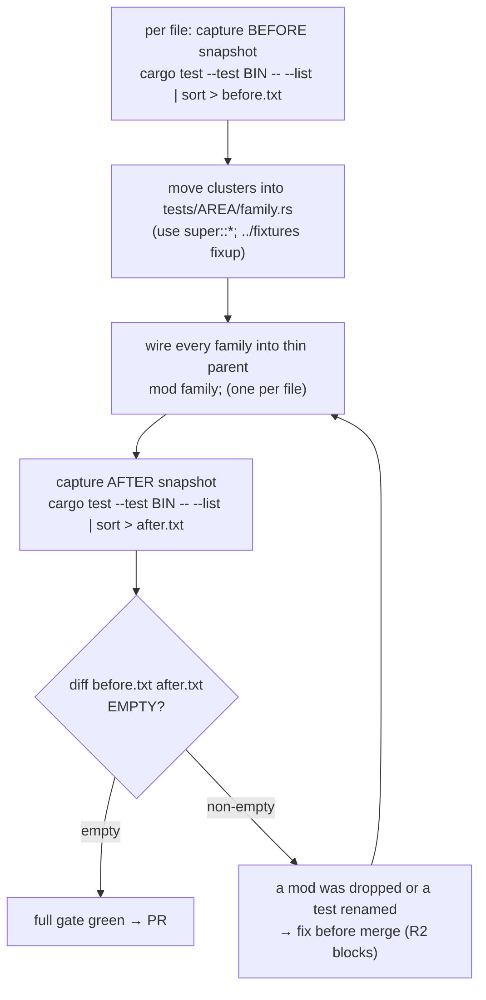

# refactor: Decompose the five large integration-test files - Plan

## Goal Capsule

- **Objective:** Split the five largest `ls-sdk` integration-test files into per-family sibling modules — mirroring the `src/` layout the merged module-decomposition wave (PR #72) already produced — without losing, renaming, or changing the run semantics of a single test.
- **Product authority:** Repo owner (sunkeunchoi). A `ce-brainstorm` refactor with no upstream product requirement; the authority is the maintainer's call to extend the structural-simplification effort into the test tree.
- **Open blockers:** None blocking planning. One scheduling input: the two highest-churn files (`market_session_tests.rs`, `live_smoke.rs`) should land during a TR-loop lull (R7).

**Product Contract preservation:** Product Contract unchanged. Planning added the snapshot harness as a foundational unit and the `include_str!` fixture-path fixup (a gotcha discovered during planning recon), neither of which alters product scope.

---

## Product Contract

### Summary

The source monoliths were decomposed and merged (PR #72), but the test tree was never in scope — so the five largest files in the repo are now all test files: `live_smoke.rs` (8,172), `market_session_tests.rs` (7,395), `paginated_tests.rs` (3,822), `order_smoke.rs` (2,295), `account_tests.rs` (1,961). Decompose each into per-family sibling modules under a thin parent (the source-mirror layout), as a behavior-preserving relocation. The defining constraint that separates this from the source waves: a moved-but-unwired test fails **silently** (a forgotten `mod` drops a whole file's tests with no compile error), so the load-bearing safety check is a test-name-set snapshot, not the compiler.

### Problem Frame

The structural-simplification effort (`docs/plans/2026-06-29-003-refactor-codebase-simplification-split-plan.md`, merged as PR #72) deliberately scoped only `src/` monoliths and left the test tree untouched. Since then the test files have kept growing with every TR flip wave, and they are now the heaviest files in the workspace. The cost is navigation and review: adding a TR's smoke means scrolling a 7,000–8,000-line file, and review diffs land in a single giant file with no per-domain locality. `market_session_tests.rs` is edited on nearly every feature PR (#73, #71, #70, #69, #68…), so the navigation cost is paid constantly.

Unlike the source decomposition, the test files do not get the compiler as a safety net. In Rust, files directly under `tests/` each compile as a separate integration-test binary, and subdirectories under `tests/` are **not** auto-compiled — they must be pulled in with an explicit `mod`. A test cluster moved into a submodule that is never `mod`-ed in still compiles clean and simply stops running. That silent-drop failure mode is the central risk this refactor exists to manage.

### Key Decisions

- KD1 — Submodule-into-thin-parent, not multiple binaries. Each file becomes a thin parent (`mod quote; mod charts; …`) with the tests moved to `tests/<area>/<family>.rs`. This keeps one test binary per area, so run semantics stay byte-identical and there is no extra per-binary link cost. The rejected alternative (many top-level `tests/*.rs` binaries) buys more test-run parallelism and avoids the fixture-path fixup (KD6), but re-links the crate per file and forces every shared helper into `tests/common/`; test-run speed is not a goal here, navigation is.
- KD2 — Mirror the source layout. Group test clusters under the same family names the merged source split uses. Verified actual `src/market_session/` modules: `quote`, `quote_deriv`, `investor_flow`, `charts`, `etf`, `elw`, `masters`, `reference`, `ranking`; `src/account/`: `balance`, `capacity`, `holdings`. Grouping follows each test's existing `// ----` per-TR/wave section marker.
- KD3 — The test-name snapshot is the verification, not the compiler. `cargo test -p ls-sdk --test <bin> -- --list` enumerates every test by name; capture the full sorted set before, diff after, require empty diff per file. This is the analog of the source wave's count-test invariance, but it must be checked explicitly because nothing else catches a silently-dropped module.
- KD4 — Files split into three risk tiers, handled differently. Pure-move files (`account_tests.rs`, 1 helper; `paginated_tests.rs`, 5) relocate clusters directly. Thin-bridge files (`market_session_tests.rs`, 1 helper `sdk_for`) move or share the lone helper, then glob. Shared-helper-core files (`live_smoke.rs`, 12 helpers; `order_smoke.rs`, 35) need a helper-extraction precondition before any cluster moves — the `frame.rs` precondition pattern from the source plan.
- KD5 — `order_smoke.rs` keeps its autonomy/safety helpers co-located with their tests. `validate_nonce`, `scrub_secrets` / `scrub_digit_runs`, `install_dispatch_log_suppressor`, and `flat_verdict` are *both* shared infra *and* the subject of the `autonomy_*` tests. The safety tests that exercise a helper stay in the same module as that helper (or import it explicitly); the helpers stay reachable by every smoke cluster. No safety/scrub/suppressor/nonce logic is thinned or rewritten — only relocated.
- KD6 — `include_str!("fixtures/…")` paths get a `../` fixup on every moved reference. `include_str!` resolves relative to the *current source file's* directory, so a cluster moving from `tests/foo_tests.rs` into `tests/foo/family.rs` must rewrite `include_str!("fixtures/x.json")` to `include_str!("../fixtures/x.json")`. Counts: `market_session_tests` 22, `paginated_tests` 15, `account_tests` 15; `live_smoke` and `order_smoke` have 0 (no fixtures). A missed one is a **compile error** (file-not-found at compile time), so this class — unlike dropped tests — is compiler-caught. The shared `tests/fixtures/` directory is not moved.

### Requirements

**Behavior & coverage preservation**

- R1. No test is lost, renamed, skipped, or changed in run semantics. The `#[test]`/`#[tokio::test]`/`#[ignore]` attribute set per test is identical before and after, including the 198 `#[ignore]` live smokes and the 3 ignored order smokes.
- R2. Per file, the `cargo test … -- --list` test-name set is byte-identical before and after the split (KD3). An empty diff is the pass condition; a non-empty diff blocks the merge.
- R3. No production/source change, no public-API change, no metadata or baseline edit. The docgen count tests (`reference.len`, `banner_trs`, `maintained_tr_count`, `TRACKED_TRS`) and the policy crosscheck lists stay green with zero edits, exactly as in the source waves.

**Decomposition shape**

- R4. The five files — `market_session_tests.rs`, `live_smoke.rs`, `paginated_tests.rs`, `order_smoke.rs`, `account_tests.rs` — are each decomposed into per-family submodules under a thin parent (KD1), grouped on the existing section markers and mirroring the source family names (KD2).
- R5. Each resulting test module sits comfortably under the ~1,500-line cohesion ceiling the source waves targeted; a family larger than that is split further rather than left oversized.
- R6. Shared test helpers are extracted to a reachable location (parent module or a per-area helpers module) before the clusters that use them move; for `order_smoke.rs` and `live_smoke.rs` this extraction is an explicit precondition step (KD4), and for `order_smoke.rs` the autonomy-safety helpers stay co-located with the tests that exercise them (KD5).

**Sequencing & safety**

- R7. Churn-safe sequencing. The high-churn giants (`market_session_tests.rs`, `live_smoke.rs`) land as atomic PRs during a confirmed TR-loop lull; lower-churn files may proceed independently. Within any one file, the split is a single atomic PR (not incremental) so the snapshot diff is checked once against a stable before-state.
- R8. The full gate (`make docs && cargo test && cargo test -p ls-core && make docs-check`) is green per PR; no `#[ignore]` smoke is un-ignored or run as part of this work.

### Scope Boundaries

**In scope**

- Decomposing the five named integration-test files into per-family submodules under a thin parent.
- Extracting shared test helpers to a reachable location as a precondition for the two helper-heavy smoke files.
- The per-file test-name-snapshot verification harness.

**Deferred to Follow-Up Work**

- The remaining smaller test files (`orders_tests.rs` 585, `realtime_tests.rs` 457, `order_logic_gate.rs`, `standalone_tests.rs`) — already under the cohesion ceiling; split only if a later wave wants uniformity.
- The U7 / Wave-5 source logic-quality backlog (`cli.rs`, `inner.rs`, `freshness.rs`+`fetch.rs`, `validator.rs`, `reconcile.rs`) — a separate standing backlog from `docs/plans/2026-06-29-003-…-plan.md`, not part of this refactor.

**Out of scope (non-goals)**

- Any change to production/source code, public API, metadata, or baselines.
- Converting the suite to top-level multiple test binaries (KD1 rejected this).
- Un-ignoring, adding, deleting, or rewriting any test; changing assertions or helper logic beyond relocation.
- Reformatting beyond the lines touched by the moves.

---

## Planning Contract

- **Depth:** Deep — cross-cutting across five files, three handling tiers, a silent-failure mode requiring a bespoke verification harness, and churn coordination against the active TR loop.
- **Execution posture:** Characterization is already provided by the existing tests; the snapshot harness (U1) IS the characterization net. No new behavioral tests are written. Each unit is a pure relocation verified by the snapshot + the full gate.
- **Sequencing:** Safest-first. U1 builds the harness; U2 (`account`, smallest pure-move) proves the harness; U3 (`paginated`) repeats it; then the giants (U4 `market_session`, U6 `live_smoke`) and helper-heavy U5 (`order_smoke`). Each file is one atomic PR (R7).
- **Landing strategy:** One PR per implementation unit (per file), gate-green, snapshot-diff-empty. U4 and U6 are scheduled into a confirmed TR-loop lull; U2/U3/U5 may land anytime after U1.

---

## High-Level Technical Design

### Per-file split shape (market_session example) and the silent-drop guard

```
BEFORE                                    AFTER
tests/                                     tests/
  market_session_tests.rs (7,395)            market_session_tests.rs   ← thin parent:
    use {ls_core, ls_sdk, wiremock}             use ...;  (shared imports + sdk_for helper)
    fn sdk_for(...)                             mod quote; mod quote_deriv; mod investor_flow;
    347 #[test] in // ---- sections             mod charts; mod etf; mod elw; mod masters;
    22x include_str!("fixtures/..")             mod reference; mod ranking;
                                              market_session/
                                                quote.rs   ← use super::*;  + moved tests
                                                            + include_str!("../fixtures/..")  (KD6)
                                                charts.rs  ...  (mirror src/ families, KD2)
```



The compiler catches two failure classes (a dropped `include_str!` fixture path, a moved struct that loses a `use super::*`); the snapshot diff catches the one class the compiler cannot — a whole `tests/AREA/family.rs` file that was written but never `mod`-ed into the parent, which compiles clean and silently runs zero of its tests.

---

## Output Structure

Target test-tree layout after all units (new paths marked `+`):

```
crates/ls-sdk/tests/
  fixtures/                         (unchanged, shared)
  account_tests.rs                  thin parent (imports + mod decls)
+ account/                          balance.rs capacity.rs holdings.rs
  paginated_tests.rs                thin parent
+ paginated/                        per-domain families (mirror src/paginated/)
  market_session_tests.rs          thin parent (keeps sdk_for)
+ market_session/                   quote.rs quote_deriv.rs investor_flow.rs charts.rs
+                                   etf.rs elw.rs masters.rs reference.rs ranking.rs
  order_smoke.rs                    thin parent (autonomy helpers + their tests stay here, KD5)
+ order/                            non-autonomy smoke clusters
  live_smoke.rs                     thin parent (shared setup helpers)
+ live/                             per-family ignored-smoke clusters
```

The per-unit **Files** lists are authoritative; the tree is the scope shape. Family file names mirror the source split and may be merged/renamed to match the real section grouping.

---

## Implementation Units

### U1. Test-name snapshot harness + baseline

- **Goal:** Provide the per-file before/after test-name-snapshot procedure (R2/KD3) that every later unit verifies against, and record the current count-test baseline.
- **Requirements:** R1, R2, R8
- **Dependencies:** none
- **Files:** new `docs/plans/notes/2026-06-30-005-test-split-baseline.md` (committed); optional helper `scripts/test-name-snapshot.sh` (a thin wrapper around `cargo test -p ls-sdk --test <bin> -- --list | sort`). No test-source changes.
- **Approach:** Document the invariant procedure: for a target binary, `cargo test -p ls-sdk --test <bin> -- --list | sort` before the split → `before.txt`; same after → `after.txt`; `diff` must be empty. Record in the baseline note the per-file BEFORE test counts (`account_tests` 72, `paginated_tests` 158, `market_session_tests` 347, `order_smoke` 33, `live_smoke` 204) and the four docgen count-test values (`reference.len`, `banner_trs`, `maintained_tr_count`, `TRACKED_TRS`) from a clean green gate. If the starting tree is red, stop and triage first — a baseline cannot be set on a red gate.
- **Patterns to follow:** the U1 baseline-note pattern in `docs/plans/2026-06-29-003-refactor-codebase-simplification-split-plan.md`; the `AGENTS.md` gate sequence.
- **Test expectation:** none — verification harness only; the existing suite + the snapshot ARE the test.
- **Verification:** the baseline note holds the five per-file counts, the four docgen values, and the snapshot procedure; a clean gate run is green before any move.

### U2. Split `account_tests.rs` (pure move — proves the harness)

- **Goal:** Relocate the 72 account tests into `tests/account/{balance,capacity,holdings}.rs` under a thin `account_tests.rs` parent, proving the U1 harness on the safest file.
- **Requirements:** R1, R2, R3, R4, R5, R6
- **Dependencies:** U1
- **Files:** `crates/ls-sdk/tests/account_tests.rs` (edit → thin parent); new `crates/ls-sdk/tests/account/{balance,capacity,holdings}.rs`.
- **Approach:** Capture BEFORE snapshot. Move each `// ----` test cluster into the family file matching the source module (KD2); move the single shared helper to the thin parent (or a `tests/account/mod`-level helper) so submodules reach it via `use super::*`; prepend `use super::*;` to each new file; add `mod <family>;` per family to the parent; apply the `../fixtures/` fixup to all 15 `include_str!` refs (KD6). Capture AFTER snapshot, require empty diff. One atomic PR.
- **Patterns to follow:** `src/account/` module layout; the source `mod.rs` re-export style.
- **Execution note:** the existing `account_tests` suite is the regression net — rely on it, write no new tests.
- **Test scenarios:** Test expectation: none — pure relocation. Verification is the snapshot diff + gate, not new cases.
- **Verification:** BEFORE/AFTER `--list` diff empty (72 tests, same names); full gate green; docgen count values unchanged vs U1 baseline; `account_tests.rs` is imports + `mod` decls only.

### U3. Split `paginated_tests.rs` (pure move)

- **Goal:** Relocate the 158 paginated tests into `tests/paginated/<domain>.rs` mirroring `src/paginated/`, under a thin parent.
- **Requirements:** R1, R2, R3, R4, R5, R6
- **Dependencies:** U1 (U2 recommended first as the proven template)
- **Files:** `crates/ls-sdk/tests/paginated_tests.rs` (edit → thin parent); new `crates/ls-sdk/tests/paginated/<domain>.rs` (mirroring the `src/paginated/` family names).
- **Approach:** Same recipe as U2. Move the ~5 shared helpers to the parent or a shared helper module; `../fixtures/` fixup on all 15 `include_str!` refs (KD6); per-family `mod` decls. Size any family over ~1,500 lines into a further split (R5). One atomic PR.
- **Patterns to follow:** `src/paginated/` per-domain layout; U2 as the now-proven move template.
- **Test scenarios:** Test expectation: none — pure relocation.
- **Verification:** `--list` diff empty (158 tests); gate green; count values unchanged.

### U4. Split `market_session_tests.rs` (thin bridge — high churn, lull)

- **Goal:** Relocate the 347 tests into `tests/market_session/<family>.rs` mirroring the nine `src/market_session/` modules, under a thin parent that keeps `sdk_for`.
- **Requirements:** R1, R2, R3, R4, R5, R6, R7
- **Dependencies:** U1, U2 (proven template)
- **Files:** `crates/ls-sdk/tests/market_session_tests.rs` (edit → thin parent retaining `sdk_for` + shared imports); new `crates/ls-sdk/tests/market_session/{quote,quote_deriv,investor_flow,charts,etf,elw,masters,reference,ranking}.rs`.
- **Approach:** Classify each `// ----`/per-TR section into its source-mirror family (KD2) — mis-filing is silent (still compiles + snapshot-clean via the parent `mod`), so record the TR→family map in the PR description for review. Keep `sdk_for` in the parent; submodules reach it via `use super::*`. `../fixtures/` fixup on all 22 `include_str!` refs (KD6). One atomic PR landed in a confirmed TR-loop lull (R7) — `market_session_tests.rs` is the single highest-churn test file.
- **Patterns to follow:** `src/market_session/mod.rs` (`mod quote; pub use quote::*;` family list) as the exact family cut; U2/U3 as the move template.
- **Test scenarios:** Test expectation: none — pure relocation.
- **Verification:** `--list` diff empty (347 tests, identical names); gate green; count values unchanged; parent file is imports + `sdk_for` + `mod` decls only.

### U5. Split `order_smoke.rs` (helper-core extraction + autonomy co-location)

- **Goal:** Decompose the 33 order smokes while keeping the 35 shared helpers reachable and the autonomy-safety helpers co-located with their tests (KD5).
- **Requirements:** R1, R2, R3, R4, R5, R6
- **Dependencies:** U1, U2
- **Files:** `crates/ls-sdk/tests/order_smoke.rs` (edit → thin parent holding the autonomy/safety helpers + the `autonomy_*` tests); new `crates/ls-sdk/tests/order/<cluster>.rs` for the non-autonomy smoke clusters.
- **Approach:** Precondition first (KD4): identify the shared helper core — `validate_nonce`, `scrub_secrets`, `scrub_digit_runs`, `install_dispatch_log_suppressor`, `flat_verdict`, plus the supporting types — and keep it in the thin parent so all clusters reach it via `use super::*`. The `autonomy_*` tests stay in the parent next to `validate_nonce`/scrub/suppressor (KD5) — they ARE the tests for those helpers; do not separate them. Move only the non-autonomy smoke clusters into `tests/order/<cluster>.rs`. No helper logic is rewritten — relocation only. 3 `#[ignore]` smokes keep their attribute (R1). No fixtures (KD6 n/a). One atomic PR.
- **Patterns to follow:** the `frame.rs` shared-helper precondition in `docs/plans/2026-06-29-003-…-plan.md` (U3); MEMORY note that `scrub_secrets`/suppressor are test-local to `order_smoke.rs`.
- **Test scenarios:**
  - Covers the autonomy contract: the five `autonomy_*` tests (`validate_nonce`-driven CI/no-TTY/expired/replayed/absent-nonce refusals) still compile, still live beside `validate_nonce`, and still pass unchanged.
  - Test expectation otherwise: none — pure relocation of the non-autonomy clusters.
- **Verification:** `--list` diff empty (33 tests, 3 still `#[ignore]`); gate green; the autonomy/scrub/suppressor functions are byte-identical (relocated-only, verified by diff); count values unchanged.

### U6. Split `live_smoke.rs` (helper-core — highest churn, mostly ignored, lull)

- **Goal:** Decompose the 204 live smokes (198 `#[ignore]`) into `tests/live/<family>.rs` under a thin parent holding the ~12 shared setup helpers.
- **Requirements:** R1, R2, R3, R4, R5, R6, R7
- **Dependencies:** U1, U2 (and ideally after U4 proves the giant-file recipe)
- **Files:** `crates/ls-sdk/tests/live_smoke.rs` (edit → thin parent with shared setup helpers); new `crates/ls-sdk/tests/live/<family>.rs` grouped per instrument/feed family.
- **Approach:** Helper-core precondition (KD4): keep the ~12 shared setup helpers in the parent, reached via `use super::*`. Group smokes per family (mirror the `live-smoke-*` Makefile targets / smoke-map families where they align). Preserve every `#[ignore]` exactly (R1/R8) — no smoke is un-ignored or run. No fixtures (KD6 n/a). One atomic PR in a confirmed lull (R7) — `live_smoke.rs` is the highest-churn file (edited today).
- **Patterns to follow:** U4's giant-file recipe; the smoke-map family grouping in `.agents/skills/promote-tr/references/smoke-map.md`.
- **Test scenarios:**
  - Covers the ignore-set invariant: exactly 198 of 204 tests remain `#[ignore]` after the split; the 6 non-ignored keep running in-gate.
  - Test expectation otherwise: none — pure relocation.
- **Verification:** `--list` diff empty (204 tests, same names, same ignore-set); gate green (no ignored smoke executed); count values unchanged.

---

## Verification Contract

- **Per-unit snapshot (every PR, the load-bearing check):** `cargo test -p ls-sdk --test <bin> -- --list | sort` is byte-identical before and after the split. A non-empty diff blocks the merge (R2). This is the only check that catches a silently-dropped `mod`.
- **Per-unit gate (every PR):** `make docs && cargo test && cargo test -p ls-core && make docs-check` is green (R8).
- **Count-test invariant (every PR):** the four docgen values recorded in U1 (`reference.len`, `banner_trs`, `maintained_tr_count`, `TRACKED_TRS`) are unchanged with zero count-test edits; generated docs show no diff (R3).
- **Attribute invariant:** the `#[test]`/`#[tokio::test]`/`#[ignore]` set per test is preserved — 198 ignored in `live_smoke`, 3 in `order_smoke` (R1).
- **Safety invariant (U5):** the autonomy/scrub/suppressor helper bodies are byte-identical post-move and the `autonomy_*` tests pass (KD5).
- **Compiler-caught classes:** every moved `include_str!` fixture path resolves (KD6); every moved struct/helper reference resolves via `use super::*`.

---

## Definition of Done

- All six units landed, each as a gate-green atomic PR with an empty per-file `--list` snapshot diff.
- No test file exceeds ~1,500 lines except by genuine cohesion; each of the five parents holds only imports, shared helpers (where required), and `mod` declarations.
- The `#[ignore]` set, docgen count values, and policy crosscheck lists are unchanged across the entire effort; generated docs show no diff.
- No production/source, public-API, metadata, or baseline change appears in any diff.
- The U5 autonomy-safety helpers are demonstrably relocation-only (byte-identical bodies).

---

## Risks & Dependencies

- **Silent test drop (highest).** A family file written but never `mod`-ed runs zero tests with no error. *Mitigation:* the U1 snapshot diff (KD3) is a hard merge gate on every unit.
- **Branch rot against the TR loop (high).** `market_session_tests.rs` and `live_smoke.rs` change on nearly every feature PR. *Mitigation (R7):* atomic single-PR splits scheduled into a confirmed lull; MEMORY notes the raw TR pool is exhausted as of 2026-06-30 — likely the lull, though order work (#75 F/O chain) may still touch `order_smoke`.
- **Missed `include_str!` fixup (low — compiler-caught).** *Mitigation:* `cargo test` fails to compile on a wrong fixture path (KD6); not a silent class.
- **`order_smoke` helper entanglement (medium).** 35 helpers, some both infra and test-subject. *Mitigation:* KD5 keeps the autonomy core + its tests in the parent; only non-autonomy clusters move.
- **Dependency:** a green starting tree and the `.env`-gated gate from `AGENTS.md`.

---

## Sources & Research

- Origin requirements: this file's Product Contract (`product_contract_source: ce-brainstorm`, 2026-06-30 brainstorm).
- Structural effort this extends: `docs/plans/2026-06-29-003-refactor-codebase-simplification-split-plan.md` (Waves 0–4 merged as PR #72; test tree explicitly out of scope; Wave 5 / U7 a separate standing source-logic backlog).
- Codebase facts verified during planning recon: test-file sizes and `#[test]`/`#[ignore]` counts, ignore counts cargo-verified via `--list --ignored` (`live_smoke` 204/198, `market_session_tests` 347/0, `paginated_tests` 158, `order_smoke` 33/3, `account_tests` 72); helper density (`order_smoke` ~35 incl. `validate_nonce`/`scrub_secrets`/`scrub_digit_runs`/`install_dispatch_log_suppressor`/`flat_verdict`; `live_smoke` ~12; `market_session_tests` 1 `sdk_for`; `account_tests` 1); `include_str!("fixtures/…")` counts (22/15/15/0/0) and its file-relative resolution (KD6); actual `src/market_session/` and `src/account/` module names (KD2); churn (`market_session_tests` touched by #73/#71/#70/#69/#68…); Rust integration-test compilation model (top-level `tests/*.rs` = one binary; `tests/` subdirs need explicit `mod`).
- Conventions: `AGENTS.md` (gate sequence; no-blanket-fmt on `ls-trackers`); merged `src/` family names and `mod.rs` re-export style as the mirror target.
