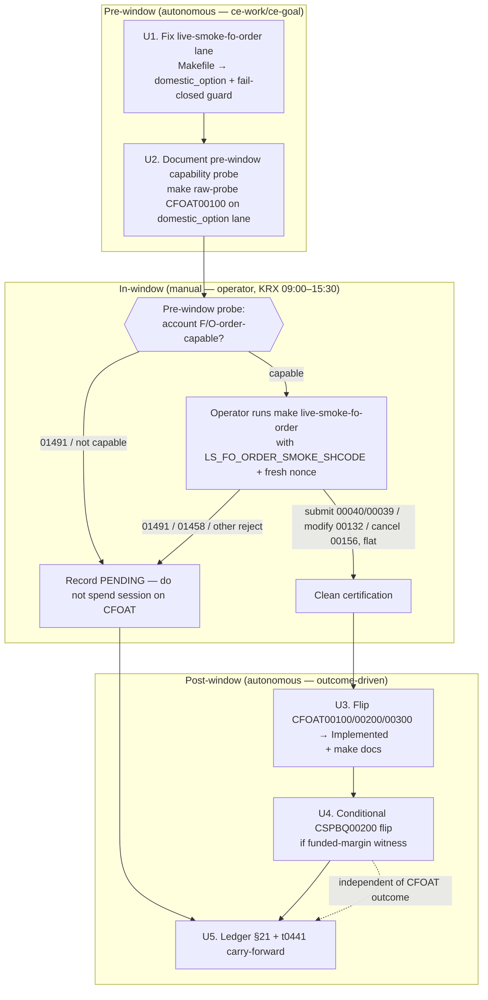

# KRX-Open Domestic F/O Order Certify-and-Flip Wave - Plan

## Goal Capsule

- **Objective:** Flip the already-staged domestic futures/option order chain (CFOAT00100/00200/00300) from Tracked → Implemented during tomorrow's KRX open window, plus the funded-margin read CSPBQ00200 if the paper account qualifies. This is a certify-and-flip wave — callable Rust + the smoke harness already ship from PR #75; the remaining work is one prerequisite lane fix, an operator-run in-window live smoke, and the metadata/docgen flips.
- **Product authority:** repo owner (operates the LS paper gateway; holds the gitignored credential lanes).
- **Open blockers:**
  - The in-window `make live-smoke-fo-order` is **operator-run, never autonomous** — an autonomous ce-work/ce-goal run cannot certify the order chain.
  - The F/O order chain's order-capability on the `.env.domestic_option` account is **unproven and is a distinct entitlement** from the domestic-spot `01491` clearance already obtained — derivatives order rights do not transfer from spot, so a non-certifying PENDING run is a **likely** day-of outcome, not the tail case. A cheap pre-window capability probe (see Outstanding Questions Q1) is recommended before committing the operator session.

---

## Product Contract

### Summary

A ready-now wave timed to tomorrow's KRX regular session (09:00–15:30 KST). An operator runs the staged domestic F/O order chain against the real paper gateway to certify CFOAT00100/00200/00300, then the certified TRs flip to Implemented via metadata + docgen. A prerequisite Makefile fix routes the F/O order smoke onto the correct `domestic_option` lane first. CSPBQ00200 is flipped opportunistically if a funded-margin read returns non-empty.

### Problem Frame

The raw TR pool is exhausted and the 41 Tracked-not-Implemented residue is mostly structurally blocked: 13 paper-incompatible reads, 7 intraday feeds that are paper-empty even mid-session, and 6 structural/HELD TRs that await external signals. None of those flip on an open window. The only residue an open KRX window genuinely unlocks is the **domestic** F/O order chain — overseas-stock and overseas-futures orders run on different sessions and credential lanes, and night-derivative orders (CCENT) are paper-incompatible forever.

The domestic F/O chain (CFOAT00100/00200/00300) was staged offline in PR #75 with callable Rust (`orders::futureoption`, `sdk.fo_orders()`) and a smoke harness (`fo_order_chained_smoke` / `make live-smoke-fo-order`), but its live flip was operator-gated and never run. Standing in the way: `make live-smoke-fo-order` sources plain `.env` rather than the `.env.domestic_option` lane the F/O **reads** authenticate against — a latent wrong-account bug that would make the order chain authenticate as the wrong (likely non-F/O-capable) account and fail in a way that looks like a window or gateway problem.

### Key Decisions

- **Domestic-only scope.** KRX-open unlocks only domestic instruments. Overseas-stock/futures order chains and night-derivative orders are explicitly out of this wave — different sessions, lanes, or permanent paper-incompatibility. This keeps the wave tight and ready-now with no new offline build.
- **Preserve the flatness-preserving chain; t0441 stays PENDING.** The staged chain submits → modifies → cancels, ending flat with no resting position (two-part fail-closed flatness: t0441 fill-detection + clean-cancel removal). t0441 (선물/옵션잔고평가) needs a non-empty open position to return data, which the flat chain deliberately never holds. Rather than manufacture real paper exposure to produce a witness, t0441 is carried forward PENDING with a ledger note. A deliberate-position leg was considered and rejected for this wave.
- **Fix the lane before the smoke.** Routing `live-smoke-fo-order` through the `domestic_option` lane is a hard prerequisite, not optional polish: it removes the wrong-account hazard and ensures the order chain and t0441 read the same `...51` account.
- **Operator/autonomous split.** The lane fix, offline verification, smoke-map upkeep, and post-certification metadata flips are autonomous (ce-work/ce-goal). The in-window live order smoke is a manual operator step.

### Requirements

**Lane correction (prerequisite)**

- R1. `make live-smoke-fo-order` authenticates against the `domestic_option` credential lane (the `...51` F/O-capable account), the same lane the F/O reads (including t0441) already use, rather than sourcing the default `.env` account.
- R2. The corrected target fails closed when its lane credential file is absent rather than silently falling back to the default account (matching the existing lane-guard behavior used by the other `domestic_option` smokes).
- R3. The full offline gate stays green after the lane fix (`make docs`, `cargo test`, `cargo test -p ls-core`, `make docs-check`); no TR support state changes from this prerequisite alone.

**In-window certification (operator)**

- R4. An operator runs `make live-smoke-fo-order` during the KRX regular session with the current valid F/O contract supplied (`LS_FO_ORDER_SMOKE_SHCODE`) and a fresh per-wave nonce, against the paper gateway on the corrected lane.
- R5. Certification of each of CFOAT00100 (submit), CFOAT00200 (modify), CFOAT00300 (cancel) derives from that leg's own non-empty acknowledgment in the chain response — submit, modify ack, and cancel ack each evidenced from their own leg, not inferred from a sibling.
- R6. After the chain runs, the account is left flat (the chain's existing fail-closed teardown holds); no resting order and no fill survive the smoke.
- R7. If the gateway rejects order placement — exact `01491` (account-not-order-capable, the one code the harness classifies as paper-order-incapable), or an off-window `01458` (모의투자 장종료, recorded **verbatim** as an unclassified rejection, not the `01491` classifier) — the wave records the CFOAT chain TRs as PENDING with the gateway code captured and flips no CFOAT TR; CSPBQ00200 still follows R9 independently. A non-certifying run is a valid, gate-green outcome.

**Flips (autonomous, post-certification)**

- R8. On a clean certification, CFOAT00100/00200/00300 flip Tracked → Implemented (metadata facet) with docgen regenerated and the full gate green.
- R9. CSPBQ00200 (현물계좌증거금률별주문가능수량조회) flips to Implemented only if smoked on a funded-margin context returning a non-empty deserializable row; on a zero-deposit account it stays PENDING with a ledger note.
- R10. t0441 (선물/옵션잔고평가) is carried forward PENDING with a ledger note recording that it needs a deliberately-held F/O position, out of scope for the flatness-preserving chain.
- R11. The provisionality ledger gains a new section recording this wave's disposition: CFOAT flips (or PENDING on non-certifying run), CSPBQ00200 outcome, t0441 carry-forward, and the lane-fix prerequisite.

### Acceptance Examples

- AE1. **Covers R5, R8.** Operator runs the chain in-window; response carries submit ack, modify ack (F/O modify success code), and cancel ack on their own legs → CFOAT00100/00200/00300 flip Implemented; gate green; ledger records the flip.
- AE2. **Covers R7.** Operator runs the chain; gateway returns exact `01491` on submit → CFOAT chain recorded PENDING (classified account-not-order-capable), no CFOAT flip; an off-window `01458` is instead recorded **verbatim** as an unclassified rejection (not the `01491` classifier); CSPBQ00200 still follows R9; gate stays green either way; the wave is reported as a non-certifying run, not a failure.
- AE3. **Covers R6, R10.** Chain completes its submit → modify → cancel legs and teardown confirms the account flat → t0441 still reads positions=0 and is left PENDING with its carry-forward note; no offsetting/position-holding action is taken.
- AE4. **Covers R9.** CSPBQ00200 smoked on a zero-deposit account returns all-default/empty fields → it stays PENDING; on a funded-margin context returning a non-empty row → it flips Implemented.
- AE5. **Covers R1, R2.** With `.env.domestic_option` absent, `make live-smoke-fo-order` aborts with a missing-lane error rather than running against the default `.env` account.

### Scope Boundaries

**Deferred for later**

- t0441 flip — requires a deliberately-held F/O position (separate, riskier wave that accepts brief real paper exposure).
- Overseas-stock order chain (COSAT00301/00311/00400, COSMT00300) and overseas-futures order chain (CIDBT00100/00900/01000) — their own market sessions and credential lanes; a later wave on the right session.
- CSPBQ00200 on a funded account if tomorrow's account is unfunded — re-attempt when a funded-margin context exists.

**Outside this wave's reach (no re-litigation)**

- 13 paper-incompatible reads (overseas-stock g31xx, KRX-night t8455/t8460, CCENQ pair) — structural feed gap, never flip on paper.
- 7 intraday feeds (t2212/t8404/t2407/t1951/t1973/t2106 and the t8427 reconfirm) — paper-empty even mid-session.
- 6 structural/HELD TRs (t1852/t1856 sFileData, t1860 realtime-control, t1631 gateway IGW40014, t3102 news-event, t1964 filter-enums) — await external signals, not an open window.
- Night-derivative orders (CCENT00100/00200/00300) — `paper_incompatible`, never flip.
- Overseas watchlist reads (o3107/o3127) and t1109 after-hours — wrong lane/session for the regular KRX window.

### Dependencies / Assumptions

- The `domestic_option` lane (`.env.domestic_option`, account `...51`) holds **F/O-order-capable** paper credentials. This is independently unproven: the prior `01491` clearance proved **domestic-spot** order capability only, and derivatives (F/O) order entitlement is a **separate per-account gate** that does not transfer from the spot clearance. Treat a non-certifying PENDING run as a **likely** day-of outcome, not the tail case. R7 makes a non-order-capable account a recorded-PENDING outcome rather than a wave failure.
- A current, valid F/O contract code is known at smoke time and supplied via `LS_FO_ORDER_SMOKE_SHCODE` (a stale contract fails the chain).
- The KRX regular session is open when the operator runs the smoke; off-window runs hit `장종료` and record PENDING (R7).
- The staged chain prices at the daily limit (t2111 상한가/하한가) so orders rest far from market and the chain stays flat — this design is unchanged by this wave.

### Outstanding Questions

**Resolve before the in-window run**

- Q1. Confirm the `...51` `domestic_option` account is F/O-**order**-capable *before* committing the operator's scarce in-window session — via a cheap pre-window raw-probe order, or by carrying forward any prior successful F/O order on this lane. The domestic-spot `01491` clearance does **not** establish derivatives order entitlement; without this check the session may be spent only to discover a PENDING.
- Q2. Confirm the current valid F/O contract code to pass as `LS_FO_ORDER_SMOKE_SHCODE` on the smoke day.
- Q3. Confirm whether tomorrow's `domestic_option` account is funded enough to give CSPBQ00200 a non-empty margin read (decides whether R9 flips or carries PENDING).

*(The planning-deferred lane-mechanism question is now resolved — see Planning Contract KTD1.)*

### Sources / Research

- Grounding dossier (this session): residue partition, ledger §18–§20 citations, PR #75 order-TR inventory — `metadata/PROVISIONALITY-LEDGER.md` §18–§20.
- Lane bug evidence: `Makefile:49-58` (F/O reads incl. `live-smoke-t0441` mapped to `LS_SMOKE_LANE = domestic_option`) vs `Makefile:125-130` (`live-smoke-fo-order` sources plain `.env`); lane-guard pattern in the `run_smoke` define `Makefile:36-47`.
- Docgen count site: `crates/ls-docgen/src/lib.rs::reference_covers_implemented_with_banner_and_omits_unimplemented` (`reference.len()` literal + `banner_trs` allowlist) — the hand-edited flip site (KTD2, U3, U4).
- Staged chain origin: PR #75 (commit `f1b7757`) — `orders::futureoption`, `sdk.fo_orders()`, `fo_order_chained_smoke`, `make live-smoke-fo-order`.
- F/O chain mechanics (already implemented, for reference): F/O price `string_as_decimal` (fractional, avoids IGW40011); F/O modify ack code; modify/cancel OutBlock2 parent in OutBlock1.OrgOrdNo; daily-limit pricing anchored on t2111.
- Recipe: `.agents/skills/implement-tr/SKILL.md` (Tracked → Implemented flip + dual crosscheck-list registration); `.agents/skills/promote-tr/references/smoke-map.md` (smoke registry).

**Product Contract preservation:** Product Contract unchanged — planning enriched this artifact with the Planning Contract, Implementation Units, Verification Contract, and Definition of Done below; the Product Contract R/AE IDs and scope are as authored by `ce-brainstorm` + `ce-doc-review`.

---

## Planning Contract

### Key Technical Decisions

- KTD1. **Lane fix uses a target-specific `LS_SMOKE_LANE = domestic_option` plus an inline fail-closed guard, not `run_smoke` reuse.** The shared `run_smoke` define (`Makefile:36-47`) hardcodes `cargo test ... --test live_smoke`, but `live-smoke-fo-order` runs `--test order_smoke` with an `LS_ORDER_SMOKE=1` export, so it cannot call `run_smoke`. The fix adds `live-smoke-fo-order` to the `domestic_option` lane-assignment block and replaces its hand-rolled `.env` sourcing with an inline guard that mirrors `run_smoke`'s fail-closed check (source `.env.$(LS_SMOKE_LANE)`, abort if the lane file is missing). Resolves the planning-deferred lane-mechanism question.
- KTD2. **The flip is metadata + docgen only — no `ls-core` or SDK change.** PR #75 already staged the callable Rust (`orders::futureoption`, `sdk.fo_orders()`) and crosscheck-registered `CFOAT00100/00200/00300_POLICY` (order TRs with `is_order: true`, correctly present in the general crosscheck list at `crates/ls-core/tests/policy_index_crosscheck.rs` and correctly **excluded** from `slice_rest_policies_are_non_order_rest`). A Tracked → Implemented flip moves the docgen `reference.len()` + banner count `+3` but does **not** move `maintained_tr_count` (ls-trackers). CSPBQ00200's callable Rust + `CSPBQ00200_POLICY` (a non-order account read) are likewise already staged.
- KTD3. **Certification codes are the verified F/O acks: submit `00040`/`00039`, modify `00132`, cancel `00156`.** These are the harness's `FO_SUBMIT_OK` / `FO_MODIFY_OK` / `FO_CANCEL_OK` sets in `crates/ls-sdk/tests/order/fo.rs`. Only exact `01491` (via `ls_core::is_paper_order_incapable`) and `01900` (via `is_paper_incompatible`) are classified; every other rejection (including off-window `01458`) is recorded **verbatim**, not classified — the flip units cite these codes when rewriting the metadata support comments.
- KTD4. **Operator/autonomous boundary.** U1 (lane fix) and U2 (pre-window capability probe recipe) land autonomously before the window. The live smoke (`fo_order_chained_smoke`, `#[ignore]`) is operator-run and never fires in the gate, so the flip units U3–U5 are metadata edits an autonomous run makes **only after the operator reports a clean in-window certification** (or the corresponding PENDING outcome). The gate is always green-but-uncertified on its own; certification is the operator's evidence, not the gate's.

### High-Level Technical Design

The wave is a three-phase gated sequence — an autonomous pre-window phase, a manual in-window operator phase, and an autonomous post-window flip phase whose edits are chosen by the operator's reported outcome:

Diagram is directional; the prose in each unit is authoritative where they differ.

### Sequencing

- **U1 → U2** land first and autonomously; U1 is a self-contained gate-green bug fix that can ship on its own before the window so the smoke runs on a corrected target.
- **Operator gate:** the in-window smoke (R4/R5) runs between U2 and U3. Nothing in U3–U5 executes until the operator reports the outcome.
- **U3** (CFOAT flip) fires only on a clean certification. **U4** (CSPBQ00200) is independent — it flips or holds on its own funded-margin witness regardless of the CFOAT outcome (R7/R9). **U5** (ledger) records whatever U3/U4 resolved to and always lands.

---

## Implementation Units

### U1. Fix the F/O order smoke credential lane

- **Goal:** Route `make live-smoke-fo-order` onto the `.env.domestic_option` lane with a fail-closed guard, removing the wrong-account hazard (R1, R2).
- **Requirements:** R1, R2, R3.
- **Dependencies:** none.
- **Files:** `Makefile`.
- **Approach:** Add `live-smoke-fo-order` to the `domestic_option` lane-assignment block (`Makefile:49-58`, the `LS_SMOKE_LANE = domestic_option` line). Replace the target recipe (`Makefile:125-130`) so it resolves `.env.$(LS_SMOKE_LANE)`, aborts with the same wrong-account-hazard message as `run_smoke` when the lane file is absent, sources it, then keeps the existing `export LS_ORDER_SMOKE=1` and `cargo test -p ls-sdk --test order_smoke -- --ignored --exact --nocapture fo_order_chained_smoke` invocation. Per KTD1, do not reuse `run_smoke` (wrong `--test` target).
- **Patterns to follow:** the fail-closed lane-guard in the `run_smoke` define (`Makefile:36-47`).
- **Test scenarios:**
  - Covers AE5. With `.env.domestic_option` absent, `make live-smoke-fo-order` aborts with the missing-lane error and does **not** source `.env` — verify by invoking with the lane file temporarily moved aside and confirming the abort message + non-zero exit (Make recipes are not unit-tested; verification is by inspection against the proven `run_smoke` pattern plus a manual dry-run).
  - The offline gate is unaffected: `make docs && cargo test && cargo test -p ls-core && make docs-check` stay green with no TR support-state change (R3).
- **Verification:** full offline gate green; no diff in generated docs; smoke target now shows `LS_SMOKE_LANE = domestic_option` in the lane block.

### U2. Document the pre-window F/O-order-capability probe

- **Goal:** Make the pre-window capability check (Q1) a repeatable, credential-safe, autonomously-runnable step so the operator's scarce in-window session isn't spent discovering a non-order-capable account (Open blockers; review Q1).
- **Requirements:** supports R4 (protects the operator session); no Product Contract requirement mandates a code artifact here.
- **Dependencies:** U1 (probe runs on the corrected lane).
- **Files:** `.agents/skills/promote-tr/references/smoke-map.md` (add/annotate a pre-window-probe row for the F/O order chain).
- **Approach:** Document a `make raw-probe LS_SMOKE_LANE=domestic_option LS_PROBE_TR_CD=CFOAT00100 LS_PROBE_PATH=/futureoption/order LS_PROBE_BODY=…` recipe (daily-limit-priced body) as the pre-window gate. Record the decision rule: `01491` → account not F/O-order-capable, record PENDING and **skip** the operator session; any accept/other code → proceed to the in-window smoke. `raw-probe` is credential-safe (prints only http / rsp_cd / body_len). This unit adds documentation only — `make raw-probe` already exists.
- **Patterns to follow:** the raw-probe A/B recipe in `docs/solutions/integration-issues/ls-gateway-igw40011-numeric-request-fields.md`.
- **Test scenarios:** Test expectation: none — documentation-only unit; no behavioral code change. The gate (`make docs-check`) stays green.
- **Verification:** smoke-map carries the pre-window-probe recipe and its `01491`-skip decision rule; an autonomous run can execute the probe without exposing credentials.

### U3. Flip CFOAT00100/00200/00300 to Implemented (operator-gated)

- **Goal:** On a clean certification, flip the three F/O order TRs Tracked → Implemented and regenerate docs (R8).
- **Requirements:** R5, R8; Covers AE1.
- **Dependencies:** U1; **operator certification (R4/R5) reported clean** — do not execute otherwise.
- **Files:** `metadata/trs/CFOAT00100.yaml`, `metadata/trs/CFOAT00200.yaml`, `metadata/trs/CFOAT00300.yaml`, `docs/reference/index.md` + `docs/reference/CFOAT00100.md`/`CFOAT00200.md`/`CFOAT00300.md` (regenerated by `make docs`), and `crates/ls-docgen/src/lib.rs` (hand-edit the `reference_covers_implemented_with_banner_and_omits_unimplemented` unit test — see Approach).
- **Approach:** In each YAML `support:` block, flip `implemented: false` → `implemented: true` (leave `recommended: false`) and rewrite the support comment to cite the in-window `fo_order_chained_smoke` certification with the certifying rsp_cd for that leg (submit `00040`/`00039`, modify `00132`, cancel `00156`, per KTD3). Run `make docs`. Then hand-edit `crates/ls-docgen/src/lib.rs::reference_covers_implemented_with_banner_and_omits_unimplemented`: bump the `reference.len()` literal from `280` by `+3`, and add the three CFOAT TR names to the `banner_trs` allowlist array (implemented-not-recommended TRs render a banner-carrying `docs/reference/<TR>.md` page). This unit test lives in `src/lib.rs`, NOT `tests/`, and is **not** caught by `make docs` or `committed_docs_match_current_metadata` — it must be edited by hand or `cargo test` reddens. No `ls-core` change — policies are already crosscheck-registered (KTD2). `maintained_tr_count` (ls-trackers) does not move; only the docgen `reference.len()` + `banner_trs` do.
- **Patterns to follow:** an already-Implemented order TR YAML (`metadata/trs/CSPAT00601.yaml`) for the target `support:` shape; `.agents/skills/implement-tr/SKILL.md` for the flip checklist.
- **Test scenarios:**
  - Covers AE1. After the flip + `make docs`, `crates/ls-docgen/tests/determinism.rs::committed_docs_match_current_metadata` passes (docs match metadata) and the three TRs appear in `docs/reference/index.md`.
  - `cargo test -p ls-core` (metadata validation + policy-index crosscheck) stays green with no crosscheck-list edit.
  - `cargo test -p ls-docgen` passes only after the `reference.len()` literal is bumped `+3` (from `280`) AND the three CFOAT names are added to the `banner_trs` allowlist in `src/lib.rs` — verify the red-then-green on `reference_covers_implemented_with_banner_and_omits_unimplemented`.
- **Verification:** full gate green (`make docs && cargo test && cargo test -p ls-core && make docs-check`); the three TRs read `implemented: true`; docgen reference count up `+3`.

### U4. Conditional CSPBQ00200 flip (independent of CFOAT outcome)

- **Goal:** Flip CSPBQ00200 → Implemented only if a funded-margin smoke returns a non-empty witness; otherwise leave it PENDING with an updated note (R9).
- **Requirements:** R9; Covers AE4.
- **Dependencies:** independent of U3 — flips or holds on its own witness even when the CFOAT chain PENDINGs (R7).
- **Files:** `metadata/trs/CSPBQ00200.yaml`, `docs/reference/index.md` + `docs/reference/CSPBQ00200.md` (regenerated if flipped), and `crates/ls-docgen/src/lib.rs` (same `reference.len()` + `banner_trs` edit as U3, `+1`, if flipped).
- **Approach:** If the operator confirms a non-zero capacity witness via `make live-smoke-cspbq00200` on a funded account, flip `implemented: false` → `implemented: true`, rewrite the support comment to cite the funded-margin witness, run `make docs`, and hand-edit `crates/ls-docgen/src/lib.rs` (bump `reference.len()` `+1`, add `CSPBQ00200` to `banner_trs`). **Shared change-site:** U3 and U4 edit the *same* `reference.len()` literal; if both flip, the final value is `+4` over baseline, and if U4 lands as a separate commit after U3 it must read the already-bumped value (not re-add `+1` to `280`). If the account is still zero-deposit, make no flip and update the support note only if the reason changed. Callable Rust + `CSPBQ00200_POLICY` already staged (KTD2).
- **Patterns to follow:** the current CSPBQ00200 PENDING support comment (records the zero-deposit reason); `metadata/trs/CSPAT00601.yaml` for the Implemented shape.
- **Test scenarios:**
  - Covers AE4. On a flip, `make docs` regenerates and `committed_docs_match_current_metadata` passes with CSPBQ00200 present; on a hold, no doc change and the gate stays green.
- **Verification:** gate green; CSPBQ00200 state matches the smoke outcome (Implemented on a funded witness, PENDING otherwise).

### U5. Record the wave disposition in the provisionality ledger

- **Goal:** Add ledger §21 capturing the wave's disposition and refresh the t0441 carry-forward note (R10, R11).
- **Requirements:** R10, R11; Covers AE3.
- **Dependencies:** U3, U4 (records their resolved outcomes).
- **Files:** `metadata/PROVISIONALITY-LEDGER.md`.
- **Approach:** Add §21 after §20, recording: the lane-fix prerequisite (U1); the CFOAT flip outcome (Implemented on clean certification, or PENDING with the verbatim rejection code); the CSPBQ00200 outcome (Implemented on funded witness, or carry-forward PENDING); and the t0441 carry-forward (needs a deliberately-held position, out of scope for the flat chain). Update the t0441 ledger reason to point at §21.
- **Patterns to follow:** the §20 section structure (partition + per-TR disposition).
- **Test scenarios:** Test expectation: none — the ledger is authored metadata prose, not docgen-derived; `make docs-check` is unaffected.
- **Verification:** §21 present and internally consistent with the actual U3/U4 outcomes; t0441 note updated.

---

## Verification Contract

| Gate | Command | Covers | Done signal |
|---|---|---|---|
| Docs regen + drift | `make docs && make docs-check` | U1, U3, U4, U5 | Generated docs match committed; reference count reflects flips (`+3` CFOAT, `+1` if CSPBQ00200 flips) |
| Workspace tests | `cargo test` | all | green — including `ls-docgen`'s `reference_covers_implemented_with_banner_and_omits_unimplemented` after the hand-edited `reference.len()` + `banner_trs` bump (U3/U4); this literal is not caught by `make docs`/`docs-check` |
| Metadata + policy crosscheck | `cargo test -p ls-core` | U3, U4 | metadata validates; policy-index crosscheck green with no list edit |
| In-window certification (manual, operator) | `make live-smoke-fo-order` (with `LS_FO_ORDER_SMOKE_SHCODE` + fresh `LS_ORDER_SMOKE_NONCE`, attended PTY) | R4, R5 | submit `00040`/`00039`, modify `00132`, cancel `00156`; account left flat — or a recorded PENDING (`01491` classified / `01458`/other verbatim), which is a valid non-certifying outcome |
| Pre-window capability probe (manual/autonomous, credential-safe) | `make raw-probe LS_SMOKE_LANE=domestic_option LS_PROBE_TR_CD=CFOAT00100 …` | U2, R4 | rsp_cd is not `01491` → proceed to operator session; `01491` → record PENDING, skip session |

The offline gate (`make docs`, `cargo test`, `cargo test -p ls-core`, `make docs-check`) never runs the live smoke (`#[ignore]`), so it is green-but-uncertified by construction — certification comes from the operator smoke, not the gate (KTD4).

---

## Definition of Done

**Autonomous, landable before the window:**
- U1 lands: `live-smoke-fo-order` runs on the `domestic_option` lane and fails closed when the lane file is absent (R1, R2); full offline gate green with no support-state change (R3).
- U2 lands: the pre-window capability-probe recipe + `01491`-skip decision rule are documented (protects R4).

**Operator-gated (after the in-window smoke):**
- The pre-window probe (U2) and the operator smoke (R4) have run; the outcome (clean certification, or a recorded PENDING with its code) is known.
- On clean certification: U3 flips CFOAT00100/00200/00300 to Implemented with docs regenerated (R8); on a non-certifying run, no CFOAT flip and the code is captured (R7).
- U4 has resolved CSPBQ00200 independently — Implemented on a funded-margin witness, or PENDING with an updated note (R9).
- t0441 remains PENDING with its carry-forward note (R10).
- U5 records the full disposition in ledger §21 (R11).
- The full offline gate is green at every commit: `make docs && cargo test && cargo test -p ls-core && make docs-check`.
