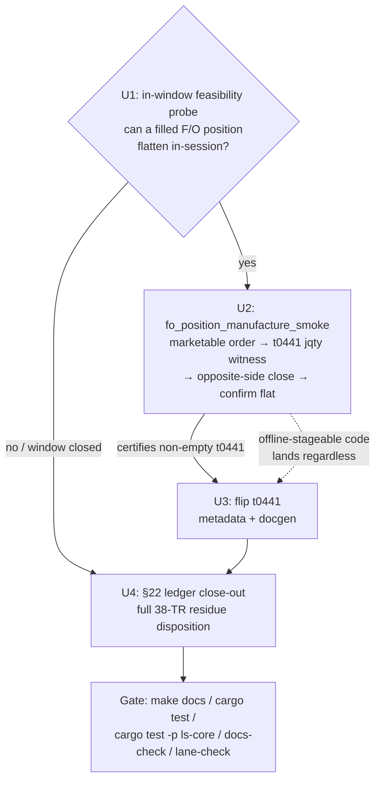

# Domestic Account-State Flip + Exhaustion Close-Out - Plan

## Goal Capsule

- **Objective:** Flip `t0441` (선물/옵션잔고평가) to Implemented by manufacturing a transient domestic F/O position, and write the honest terminal disposition for the rest of the Tracked-not-Implemented residue.
- **Product authority:** Repo owner (sunkeunchoi). Direction confirmed: manufacture domestic account state + exhaustion close-out; overseas excluded (window closed).
- **Open blockers:** Track A yield requires an open KRX F/O window at execution time (operator-gated, same constraint that gated CFOAT00100/00200/00300). If the window is closed, 0 flips is an acceptable outcome and the close-out stands alone.

---

## Product Contract

### Summary

A two-track certify-and-flip wave with no new tracking. Track A manufactures domestic account state to flip `t0441` to Implemented: an operator runs an intentionally non-flat F/O order chain in-window, reads the populated balance-valuation row, and flattens fail-closed. Track B writes a ledger §22 close-out that dispositions the terminal residue and records that both the raw pool and the offline flip pool are exhausted.

### Problem Frame

The raw pool is exhausted (0 untracked TRs) and the offline flip pool is spent. As of §21 the inventory is 320 Tracked, 282 Implemented (docgen `reference.len` is 283 — it counts the index page plus implemented reference pages, so it is not the residue divisor), 0 Recommended, with a 38-TR Tracked-not-Implemented residue (320 − 282) that §20/§21 already dispositioned in full. Most of that residue is *terminally* blocked, not wave-blocked: 13 `paper_incompatible`, 7 intraday feeds that probe paper-empty regardless of session, and 6 HELD-structural TRs. Repeated "flip more" waves now risk re-running disposition passes that yield nothing while implying progress.

Two domestic account-gated reads are the only genuine remaining Implemented-tier levers, and they are asymmetric. `t0441` is *reachable* on the funded `domestic_option` (…51) lane — it returns `00000` and is empty only because the account holds no open F/O position; a position can be manufactured now that the F/O order chain is callable. `CSPBQ00200` is a 현물/spot read on the default `.env.domestic` lane, which carries no cash deposit, and there is no SDK path to fund it — a paper deposit is an out-of-band operator action on the LS portal.

### Key Decisions

- **t0441 is the flip target; the position is manufactured, not waited for.** The prior order chains kept the account deliberately flat, so `t0441` never had a position to value. This wave intentionally submits a filling F/O order, holds it long enough to read a non-default valuation row, then flattens — the flip is earned from a real populated read, not inferred from the flat-chain no-fill check.
- **Manufacturing a fillable position reverses a choice §21 explicitly rejected, and its feasibility is unproven.** §21 considered and rejected a deliberate-position leg for the F/O chain (`PROVISIONALITY-LEDGER.md:1181-1184`). Manufacturing here requires a *marketable* order — the flat chain places only non-marketable band-floor/ceiling orders that cannot fill — and `docs/solutions/integration-issues/ls-gateway-t0425-rate-limit-and-pagination-flat-scan.md` records that a marketable fill "leaves a position needing an out-of-band paper reset." Whether a filled domestic F/O paper position can be flattened in-session without such a reset is the load-bearing open question for Track A (see Resolve Before Planning); if it cannot, `t0441` folds into the close-out exactly like `CSPBQ00200`.
- **CSPBQ00200 is conditional, and its default is PENDING.** It flips only if the operator independently funds the spot (`.env.domestic`) lane before the run. With no funding path under our control, the planning-time assumption is that it stays PENDING with a sharpened funding-gated reason and folds into the Track B close-out.
- **Close-out is a deliverable, not a fallback.** The §22 disposition ships regardless of Track A yield. A wave that flips 0 TRs but records the terminal residue honestly is a successful wave.
- **No new tracking, no overseas, no Recommended.** Raw pool is exhausted (nothing to track); the overseas order chain and o3107/o3127 watchlist reads are deferred (window closed); Recommended-tier promotion is a separate axis, out of scope here.

### Requirements

**Track A — manufacture domestic account state**

- R1. `t0441` flips to Implemented when an in-window run submits a domestic F/O order that fills — a marketable order, a deliberate departure from the flat chain's non-marketable band-floor/ceiling pricing — and its 선물/옵션잔고평가 response returns a row with at least one non-default position/valuation field (the non-default-witness gate from the account-capacity-reads convention — a real position, not an all-zero row).
- R2. The manufactured position is flattened fail-closed after the `t0441` read — a run that cannot confirm the account returned to flat must surface an error, never leave an open position.
- R3. The `t0441` flip is certified from its own live response only; the flat-chain no-fill/empty-array check is never accepted as a balance-row witness.
- R4. `CSPBQ00200` flips only if the spot (`.env.domestic`) lane is externally funded first and a re-smoke returns a non-default deposit/orderable-quantity witness. Absent that, it stays PENDING and is dispositioned in Track B; the wave does not attempt to fund it.

**Track B — exhaustion close-out**

- R5. A new PROVISIONALITY-LEDGER §22 dispositions every unflipped residue TR by terminal reason, reconciling to the full 38-TR residue: 13 `paper_incompatible`, 7 intraday paper-empty, 6 HELD-structural (`t1852`/`t1856`/`t1860`/`t1109`/`t1964`/`t3102`), 7 deferred overseas-order (`CIDBT00100`/`00900`/`01000`, `COSAT00301`/`00311`/`00400`, `COSMT00300`), and 5 account-gated (`CSPBQ00200` funding-gated, `o3107`/`o3127` watchlist-gated, `t1631` IGW40014 gateway defect, `t0441` if its window did not open) — 13+7+6+7+5 = 38.
- R6. The close-out records that the raw pool and offline flip pool are both exhausted, and names the concrete future triggers that would reopen yield (new account state, live news event for `t3102`, overseas window, entitlement grant) rather than implying another disposition pass will find flips.

### Success Criteria

- **Honest yield floor, not a numeric target.** 1 flip (`t0441`) if the F/O window opens, the position manufacture is feasible, and the read certifies; **0 flips is an acceptable outcome** if the window is closed or the filled position cannot be safely flattened, with the §22 close-out standing as the deliverable.
- **Gate green throughout** — `make docs`, `cargo test`, `cargo test -p ls-core`, `make docs-check`, `make lane-check`. A `t0441` flip moves docgen `reference.len` 283→284 and bumps `banner_trs` by one; `maintained_tr_count` stays 320 (Tracked→Implemented does not move it).

### Acceptance Examples

- AE1. **Covers R1, R2, R3.** **Given** an open KRX F/O window and the callable F/O order chain, **when** the operator submits a filling order and reads `t0441` while the position is open, **then** the response carries a non-default position/valuation field, the flip is certified from that response, and the position is flattened with a confirmed-flat post-check before the run exits.
- AE2. **Covers R1, R2.** **Given** the F/O order fills but the post-read flatten cannot be confirmed, **then** the run fails closed with an error and `t0441` is NOT flipped — an unconfirmed-flat account is a stop condition, not a partial success.
- AE3. **Covers R4, R5.** **Given** the spot lane was not externally funded, **when** the wave runs, **then** `CSPBQ00200` is neither smoked-for-flip nor flipped, and appears in the §22 close-out as funding-gated PENDING.
- AE4. **Covers R1, R5, R6.** **Given** the KRX F/O window is closed at execution time, **when** the wave runs, **then** `t0441` is dispositioned PENDING (window-gated) in §22 alongside the rest of the residue, 0 flips is recorded as the outcome, and the close-out ships as the deliverable.

### Scope Boundaries

**Deferred for later (real trigger required)**
- Overseas order chain — CIDBT00100/00900/01000, COSAT00301/00311/00400, COSMT00300 (overseas window closed).
- o3107/o3127 — overseas-option watchlist reads (overseas window; need registered symbols).
- `CSPBQ00200` — pending an out-of-band spot-lane deposit the operator arranges independently.
- `t3102` — pending a live `NWS` news frame; `t1109` — pending an after-hours window.

**Outside this wave's identity**
- New raw tracking (raw pool exhausted — nothing to track).
- Recommended-tier promotion of the 283 Implemented TRs (separate axis; needs the Focused Evidence layer, not a flip).
- Terminally-blocked residue dispositioned in §22, never flipped this wave: 13 `paper_incompatible`, 7 intraday paper-empty, `t1631` (IGW40014 gateway defect), and the 6 HELD-structural — `t1852`/`t1856` (unsourced `sFileData` blob), `t1860` (realtime control), `t1964` (unresolved filter-enums), plus `t1109` (after-hours) and `t3102` (live `NWS` frame). The last two are HELD now but carry concrete reopen triggers, which is why they also appear under Deferred for later; they stay inside the 6-count HELD-structural bucket in R5's 38-TR partition.

### Dependencies / Assumptions

- **Callable F/O order chain** — CFOAT00100/00200/00300 ship Implemented (PR #79), so a filling order can be submitted to manufacture the position.
- **Funded `domestic_option` (…51) lane** — `t0441` authenticates on this lane, which already carries a deposit; only the open position is missing.
- **Open KRX F/O window at execution time** — operator-gated; the primary Track A dependency. Assume it may be closed and plan the close-out path (AE4) accordingly.
- **Assumption: the spot lane is unfunded** — the CSPBQ00200 flip is treated as not-happening unless the operator states otherwise. Verified against §20/§21 ledger and `metadata/trs/CSPBQ00200.yaml` (all deposit fields default to zero on the default lane).

### Outstanding Questions

**Resolve before planning**
- None — the flatten-feasibility blocker is converted to the gating planning investigation below.

**Deferred to planning**
- **Gating feasibility probe (plan this as the first unit).** Can a filled domestic F/O paper position be flattened in-session (a marketable sell/buy-to-close) without an out-of-band paper reset? The `t0425` flat-scan solution doc records that the marketable scenario "leaves a position needing an out-of-band paper reset." The plan must scope an in-window operator probe that either proves flatten-in-session (Track A proceeds) or, on failure, folds `t0441` into the §22 close-out like `CSPBQ00200` — every downstream Track A unit is contingent on this outcome.
- The exact non-flat variant of the F/O chain harness (hold-then-flatten) and where the transient-position read lives relative to the existing `fo_order_chained_smoke` — an implementation choice for `ce-plan`.
- Whether `t0441`'s flatten reuses the existing clean-cancel/fill-detect teardown or needs a position-aware close (sell-to-close vs cancel), given the order now fills by design rather than resting.
- The precise non-default witness field on `t0441` to assert (e.g. `tappamt` / position quantity), read from the normalized baseline.

### Sources / Research

- `metadata/PROVISIONALITY-LEDGER.md:1047–1192` — §20 full-residue disposition and §21 F/O order certify-flip; the residue partition this wave closes out.
- `metadata/PROVISIONALITY-LEDGER.md:883, 1180–1184` — `t0441` reachable-but-no-positions verdict; flip awaits a non-empty position read.
- `metadata/trs/CSPBQ00200.yaml` — all-default deposit fields on the default lane; the funding-gated PENDING reason.
- `docs/solutions/conventions/closed-window-account-capacity-reads-all-default.md` — R5 non-default-witness gate for account capacity/deposit reads.
- `docs/plans/2026-07-01-001-feat-krx-open-domestic-fo-order-certify-flip-plan.md` — the certify-and-flip pattern this wave mirrors, plus the docgen `reference.len`/`banner_trs` hand-edit gotcha.
- `crates/ls-sdk/tests/order/fo.rs` — the `fo_order_chained_smoke` harness: daily-limit band sourcing (`FoBand`, t2111), `resting_buy_price` non-fillable pricing, `fo_assert_no_fill`/`fo_qty_is_position` (reads `t0441.jqty`), and the fail-closed teardown to mirror.
- `crates/ls-sdk/src/account/holdings.rs:550-638` + `crates/ls-sdk/src/account/mod.rs:251-262` — `T0441Request`/`T0441OutBlock1` (`jqty`, `tappamt`) and the `fo_balance_eval` facade; `t0441` is fully carried (struct + facade + `T0441_POLICY` in both crosscheck lists + `live-smoke-t0441` + smoke-map row).
- `crates/ls-docgen/src/lib.rs:1116-1208,1415-1419` — the `banner_trs` allowlist and `reference.len()` assertion (283) hand-edit sites; `ls-gateway-t0425-rate-limit-and-pagination-flat-scan.md:139-142` — the marketable-fill / out-of-band-reset premise that gates U1.

---

## Planning Contract

**Product Contract preservation:** unchanged — no R-IDs modified during enrichment. Planning narrows Track A's *implementation* (t0441 is already carried, so the flip is metadata+docgen only) but does not alter the product scope, requirements, or success criteria above.

### Key Technical Decisions

- **KTD1 — U1 is a gating spike, not a shipped smoke.** The flatten-feasibility question is a one-time in-window operator experiment (place a marketable F/O order, attempt an opposite-side close, observe whether the account returns flat without an out-of-band reset). Capture the finding in a `docs/solutions/` note, not a committed test. Rationale: it answers a go/no-go for Track A once; a permanent characterization smoke would place real marketable orders on every run, which the flat-chain discipline exists to avoid.
- **KTD2 — the manufacture harness is new and dedicated, not an extension of `fo_order_chained_smoke`.** `fo_position_manufacture_smoke` reuses `fo.rs`'s band sourcing, autonomy/scrub/leak-suppressor guards, and t0441 read helpers, but its teardown is an **opposite-side marketable close**, structurally different from the flat chain's clean-cancel. Keeping it separate preserves the flat chain's clean-cancel invariant (which certifies CFOAT00300) untouched. It is a one-use harness for this flip, not a reusable position-manufacture pattern — if a future flip needs a held position, consolidate then rather than generalizing now.
- **KTD3 — the fill witness is `t0441.jqty` (per-position balance qty), corroborated by `tappamt`.** `fo_qty_is_position()` already parses `jqty`; the manufacture harness inverts its use — a non-zero `jqty` on the manufactured symbol is the certification witness (R1's non-default position/valuation field), where the flat chain treats the same value as a fail-closed alarm.
- **KTD4 — marketable pricing sources the daily band but picks the fillable side.** Where `resting_buy_price` returns `dnlmt_str` (floor, unfillable), the manufacture buy must price at/through the market (e.g. `uplmt_str` ceiling for a marketable buy) so it fills. Prices serialize with `string_as_decimal` (F/O fractional; `string_as_number` → IGW40011). Fail closed if the band is degenerate (halted/limit-locked).
- **KTD5 — the flip is metadata + docgen only; no `ls-core`/facade/policy change.** `T0441_POLICY` is already registered in `slice_rest_policies_are_non_order_rest` (`endpoint_policy/mod.rs:284`) and the policy-index crosscheck (`policy_index_crosscheck.rs:202`); `TRACKED_TRS`/`maintained_tr_count` stay 320. Only `metadata/trs/t0441.yaml` (`implemented: false→true`) and the two docgen literals (`reference.len` 283→284, `banner_trs` +`"t0441"`) move — the latter caught only by `cargo test`, not `make docs`.
- **KTD6 — Track B ships independently of Track A yield.** The §22 ledger close-out dispositions the full 38-TR residue and is offline-authored; it records t0441 as flipped (if U3 lands) or window/feasibility-gated PENDING (if U1 fails or the window is closed). It never blocks on the live legs.

### High-Level Technical Design

### Sequencing & Assumptions

- **U1 gates U2/U3.** U2's harness *code* is offline-stageable and can land before the window opens; its live certification and U3's flip are contingent on U1's go verdict AND an open KRX F/O window.
- **U4 is independent** and can be authored and landed at any point; it is the guaranteed deliverable.
- **Assumption:** the `domestic_option` (…51) lane is funded and F/O-order-capable (proven by §21's CFOAT flips). The manufacture harness authenticates on it via `LS_SMOKE_LANE=domestic_option`.
- **Assumption:** a marketable F/O order fills promptly enough on the paper gateway that a single post-submit `t0441` read observes the position before the close leg. If fills are async/delayed, U2 must poll `t0441` with a bounded retry before declaring no-fill (an execution-time detail for the harness).

---

## Implementation Units

### U1. In-window feasibility probe — can a filled F/O position flatten in-session?

- **Goal:** Answer the gating question (Deferred-to-Planning): does flattening a *filled* domestic F/O paper position require an out-of-band paper reset, or can an opposite-side marketable close return the account to flat in-session? Produces a go/no-go for Track A.
- **Requirements:** Gates R1, R2 (Track A viability); resolves the Resolve-Before-Planning investigation.
- **Dependencies:** none (runs first).
- **Files:** `docs/solutions/integration-issues/ls-fo-filled-position-flatten-feasibility.md` (new — the finding).
- **Approach:** Operator runs an in-window manual/ad-hoc probe: submit one small marketable F/O order on the `domestic_option` lane, confirm fill via `t0441` (`jqty>0`), submit an opposite-side marketable close, re-read `t0441`, and observe whether the account returns to `jqty=0` without portal intervention. Beyond the flatten boolean, record the **fill parameters U2 needs**: (a) fill latency — time from submit-ack to `jqty>0`, so U2's `t0441` poll bound is data-derived, not guessed; (b) full-vs-partial — whether a marketable buy at `uplmt` fills the full submitted qty or partially (`jqty` magnitude vs order qty); (c) close reliability — whether the opposite-side marketable close fills promptly or itself rests. Record the full rsp_cd sequence. This is a throwaway spike (KTD1) — no committed test.
- **Execution note:** Operator-run, in-window, real paper orders. If the close cannot flatten the account, STOP Track A — t0441 folds into the U4 close-out as feasibility-gated PENDING.
- **Test scenarios:** `Test expectation: none — investigation spike; the deliverable is a documented finding, not code.`
- **Verification:** The solution doc states a clear verdict (flatten-in-session works / requires out-of-band reset) with the observed rsp_cd + t0441 evidence AND the three fill parameters (latency, full-vs-partial, close reliability). Track A proceeds only on a "works" verdict backed by a full (not partial) fill and a reliably-filling close; those observations become U2's concrete poll bound and partial-fill guard.

### U2. `fo_position_manufacture_smoke` — manufacture and flatten a transient position

- **Goal:** A new live smoke that submits a marketable F/O order, certifies a non-empty `t0441` read (the flip witness), then flattens fail-closed via an opposite-side close.
- **Requirements:** R1 (non-default `t0441` witness on a filled position), R2 (fail-closed flatten), R3 (certify from t0441's own response).
- **Dependencies:** U1 (go verdict) for live certification; harness code is offline-stageable independently.
- **Files:** `crates/ls-sdk/tests/order/fo.rs` (add `fo_position_manufacture_smoke` + helpers, reusing `FoBand`/guards), `Makefile` (add `live-smoke-fo-position` target + `.PHONY`), `.agents/skills/promote-tr/references/smoke-map.md` (add/annotate the certification row for `t0441`).
- **Approach:** Reuse `FoBand` band sourcing (t2111) and the autonomy/scrub/leak-suppressor guards from `fo_order_chained_smoke` (KTD2). Price the buy to fill (KTD4, `string_as_decimal`). After submit ack, poll `t0441` (bounded by U1's measured fill latency) and assert `jqty` equals the submitted order qty on the manufactured symbol (KTD3) — a full-fill witness; a partial fill (`jqty` below order qty) does not certify (see edge below). This is the certification witness. Then submit an opposite-side marketable close, re-read `t0441`, and assert `jqty=0`. Teardown is fail-closed: if the close ack is not clean OR the post-close `t0441` is not flat, engage the kill switch (`set_orders_enabled(false)`) and `panic!` — never exit with a position open (R2, AE2).
- **Execution note:** Live, operator-run, in-window; places real marketable paper orders. Fail-closed teardown is load-bearing — an unconfirmed-flat account is a stop condition.
- **Test scenarios:**
  - Covers AE1. Happy path: marketable buy fills → `t0441` shows `jqty>0` (+`tappamt` non-zero) → certification witness captured → opposite-side close → post-close `t0441` `jqty=0` → run passes.
  - Covers AE2. Fail-closed on flatten: close ack not clean OR post-close `t0441` not flat → kill switch engaged, `panic!`, t0441 NOT certified.
  - Edge: submit does not fill within the bounded `t0441` poll (async/no-liquidity) → treat as no-position, clean-cancel the resting order, exit without certifying (no stranded order).
  - Edge: partial fill (`jqty` magnitude below the submitted order qty) → do NOT certify; flatten the partial position fail-closed and exit, since a single-qty close may not cleanly offset an unexpected partial (U1 must have confirmed full fills, so a partial here is an anomaly, not the happy path).
  - Edge: the opposite-side close *rests* instead of filling (post-close `t0441` still shows `jqty>0` after the bounded poll) → both a position and a resting close order exist → cancel the resting close, re-read `t0441`, and if still not flat, fail closed (kill switch + `panic!`) after at most one cancel-then-reflatten attempt — never loop. This is the exact hazard U1 must have cleared.
  - Edge: degenerate/limit-locked band (KTD4) → place no order, fail closed.
- **Verification:** `make live-smoke-fo-position` passes in-window with a witnessed `jqty>0` t0441 read and a confirmed-flat teardown; a dry offline run (no creds) fails fast on the lane guard, not on a stranded position.

### U3. Flip `t0441` to Implemented — metadata + docgen

- **Goal:** Record the certified flip.
- **Requirements:** R1; advances the Success Criteria count anchors.
- **Dependencies:** U2 (live certification with a non-empty `t0441` witness).
- **Files:** `metadata/trs/t0441.yaml` (`implemented: false→true` + support comment citing the certifying smoke + `last_reviewed`), `crates/ls-docgen/src/lib.rs` (`reference.len` 283→284 at ~1417 + explanatory comment; add `"t0441"` to `banner_trs` ~1116-1208).
- **Approach:** Mirror the CFOAT support-comment style (cite `make live-smoke-fo-position`, the rsp_cd sequence, the `jqty` witness, and the confirmed-flat teardown). `TRACKED_TRS`/`maintained_tr_count` stay 320 (KTD5). The `banner_trs` + `reference.len` edits are caught only by `cargo test`, not `make docs` — run both.
- **Test scenarios:** `Test expectation: none — metadata/docgen flip; correctness is enforced by the existing docgen count assertions (reference.len, banner) under cargo test.`
- **Verification:** `cargo test` green with `reference.len == 284`; `make docs-check` clean; t0441 renders an implemented reference page with the banner.

### U4. PROVISIONALITY-LEDGER §22 — full-residue exhaustion close-out

- **Goal:** Disposition the full 38-TR Tracked-not-Implemented residue and record pool exhaustion; the guaranteed deliverable regardless of Track A yield.
- **Requirements:** R5 (full 38-TR disposition), R6 (exhaustion + future triggers).
- **Dependencies:** none for authoring; reads U1/U3 outcomes to disposition t0441 correctly.
- **Files:** `metadata/PROVISIONALITY-LEDGER.md` (new `## 22.` section).
- **Approach:** Follow the §20/§21 format (header + goal + partition-by-lane + count tally with the reference.len contrast note). Partition the 38: 13 `paper_incompatible`, 7 intraday paper-empty, 6 HELD-structural, 7 deferred overseas-order, 5 account-gated — enumerating each TR with its terminal reason and prior-§ cross-reference. Record raw + offline flip pools exhausted and the concrete reopen triggers (new account state, `t3102` live news, overseas window, entitlement). Disposition t0441 as **flipped** (if U3 landed) or **feasibility/window-gated PENDING** (if U1 failed or window closed); CSPBQ00200 as funding-gated PENDING (folds here per KD).
- **Test scenarios:** `Test expectation: none — ledger prose; ls-core metadata validation confirms every cited TR exists and no count assertion regresses.`
- **Verification:** `cargo test -p ls-core` green (metadata validation); the §22 partition sums to 38 and every TR name resolves to a real `metadata/trs/*.yaml`.

---

## Verification Contract

| Gate | Command | Applies to | Done signal |
|---|---|---|---|
| Docs regen | `make docs` | U3, U4 | Generated docs match committed |
| Workspace tests | `cargo test` | U2, U3 | Green; `reference.len == 284` after U3 |
| Metadata validation | `cargo test -p ls-core` | U3, U4 | Green; policy-index crosscheck + §22 TR names resolve |
| Docs match | `make docs-check` | U3 | No diff vs committed |
| Lane guard | `make lane-check` | U2 | Offline fail-fast guard passes |
| Live certification | `make live-smoke-fo-position` | U2 | In-window pass with `jqty>0` witness + confirmed-flat teardown |

---

## Definition of Done

- U1's feasibility verdict is documented; Track A proceeded only on a "flatten-in-session works" verdict.
- U4's §22 close-out is committed, dispositions the full 38-TR residue, and passes `cargo test -p ls-core` — this ships regardless of Track A outcome.
- If Track A proceeded: `make live-smoke-fo-position` certified a non-empty `t0441` read in-window with a confirmed-flat teardown, and U3 flipped t0441 (`reference.len` 284, `banner_trs` +1, `maintained_tr_count` 320).
- If Track A did not proceed (U1 no-go or window closed): t0441 is dispositioned in §22 as feasibility/window-gated PENDING, 0 flips recorded, no stranded paper position left open.
- Full gate green: `make docs`, `cargo test`, `cargo test -p ls-core`, `make docs-check`, `make lane-check`.
